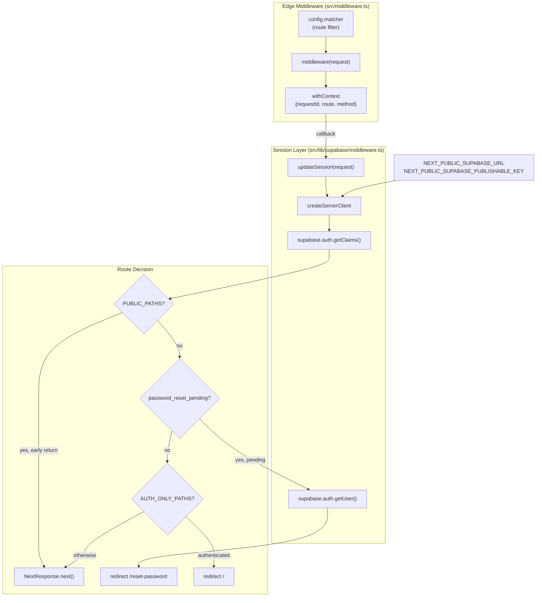
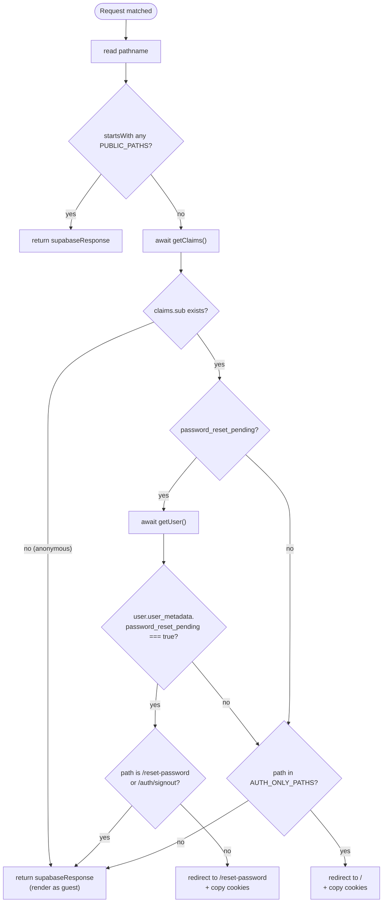
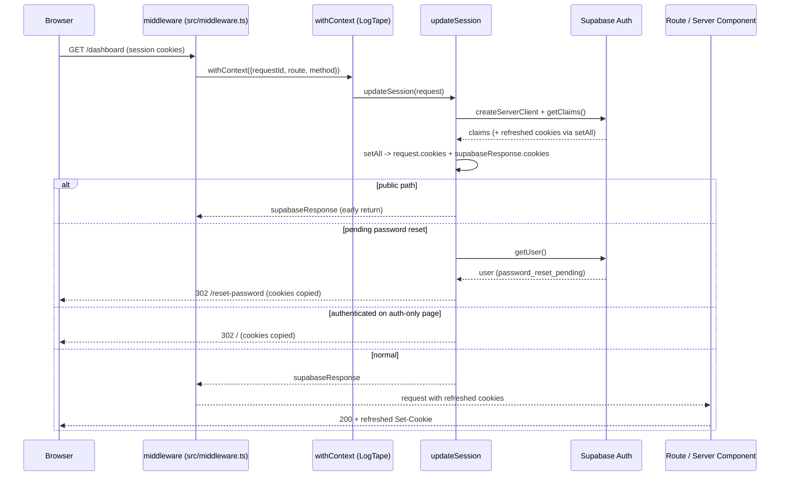

This page documents the Next.js edge middleware that runs on every non-static request, the LogTape request-context wrapper it establishes, and the Supabase session-refresh / route-guard logic it delegates to.

## Purpose and Scope

This page covers the request-handling pipeline that executes **before** any route handler or Server Component renders:

- The Next.js middleware entry point and its `matcher` configuration (`src/middleware.ts`).
- The LogTape `withContext` wrapper that attaches a per-request log context (`requestId`, `route`, `method`).
- The Supabase `updateSession` flow that refreshes auth cookies, identifies public/auth-only routes, enforces the pending-password-reset redirect, and keeps browser/server cookies in sync (`src/lib/supabase/middleware.ts`).
- The cookie-propagation contract required for session stability, and the matcher exclusions that prevent middleware from running on API routes, static assets, and prefetch requests.

Related topics that belong to sibling pages and are intentionally **not** covered here:

- Client-side / Server Component Supabase client creation and query helpers — see the Supabase data-access documentation.
- Structured logging configuration, sink setup, and category conventions — see the logging conventions and instrumentation docs.
- Route groups, layouts, and rendering boundaries — see the SSR / rendering documentation.

## Overview

`ozeaon-v2` is a Next.js application that authenticates users through Supabase. Two concerns must be handled on **every** request, before rendering begins:

1. **Observability** — every request needs a stable identifier and structured metadata so that logs emitted deep in the render tree can be correlated back to the originating HTTP request.
2. **Session hygiene** — Supabase's SSR cookie-based sessions expire and must be refreshed on a schedule; the refreshed cookies must be written back to both the outgoing response and the downstream request so that the browser and the server agree on the session state.

Next.js middleware is the only hook that runs *before* rendering for every matched route, which makes it the correct place for both responsibilities. The repository splits them into two files:

| Concern | File | Responsibility |
|---|---|---|
| Request entry + log context | [`src/middleware.ts`](https://github.com/ozeaon/ozeaon-v2/blob/0a4f1a95824db87782f1221a4108019d174df3d9/src/middleware.ts) | Wraps the whole handler in `withContext`, generates `requestId`, defines the `matcher` |
| Session + route guards | [`src/lib/supabase/middleware.ts`](https://github.com/ozeaon/ozeaon-v2/blob/0a4f1a95824db87782f1221a4108019d174df3d9/src/lib/supabase/middleware.ts) | Creates the SSR Supabase client, refreshes claims/cookies, applies public/auth-only/password-reset rules |

The design intent is a **thin, ordered wrapper**: the log context is established first so that *everything* the session logic logs is automatically tagged, and the session logic is a plain function that receives the `NextRequest` and returns a `NextResponse`. This separation keeps the middleware entry point trivial and the auth logic unit-testable in isolation.

### Key concepts

- **`withContext`** — a LogTape helper that runs a callback with thread/async-local log properties attached. Anything logged inside the callback inherits the properties.
- **`requestId`** — a `crypto.randomUUID()` generated per request so a single user action can be traced end-to-end.
- **`PUBLIC_PATHS` / `AUTH_ONLY_PATHS`** — the two allow/deny lists that define the route matrix for unauthenticated vs. authenticated users.
- **`password_reset_pending`** — a Supabase user-metadata flag that forces the user to `/reset-password` until the reset completes.
- **`supabaseResponse`** — the `NextResponse.next({ request })` object whose cookies must be preserved through every redirect branch; mutating or dropping it terminates sessions.

## Architecture



The diagram reflects the two-layer split: `src/middleware.ts` owns the matcher and the log context, while `src/lib/supabase/middleware.ts` owns client creation and the three-branch route decision (public, pending reset, auth-only). Environment variables feed the client directly, and every terminal branch returns a response whose cookies must remain in sync.

## Middleware Entry Point

The middleware entry point is deliberately minimal. It establishes the request context and delegates all logic to `updateSession`.

```typescript
import { withContext } from "@logtape/logtape";
import { updateSession } from "@/lib/supabase/middleware";
import type { NextRequest } from "next/server";

export async function middleware(request: NextRequest) {
  return await withContext(
    {
      requestId: crypto.randomUUID(),
      route: request.nextUrl.pathname,
      method: request.method,
    },
    () => updateSession(request),
  );
}
```

> Source: [middleware.ts](https://github.com/ozeaon/ozeaon-v2/blob/0a4f1a95824db87782f1221a4108019d174df3d9/src/middleware.ts#L1-L14)

### Design intent of the context wrapper

Three properties are attached to every request:

| Property | Source | Why it matters |
|---|---|---|
| `requestId` | `crypto.randomUUID()` | Correlates all log lines from one request. Generated per-request (not per-user) so it is unique even across concurrent requests from the same session. |
| `route` | `request.nextUrl.pathname` | Records the *path* the user requested, which is distinct from the matched route pattern and survives rewrites. |
| `method` | `request.method` | Distinguishes GET navigations from POST/Server-Action traffic that also passes through middleware. |

The `withContext(key, callback)` signature runs the callback inside a LogTape context scope. Because the callback returns `updateSession(request)` — an awaited promise — the context remains active for the entire async duration of session handling. Any logging performed inside `updateSession` (or anything it calls) is automatically annotated, so developers do not have to thread a logger or a context object through function parameters. This is the primary reason the wrapper lives here: it is the single choke point through which *all* matched requests pass.

The `await` on `withContext(...)` is significant — the middleware must return the resolved `NextResponse`, not a promise-wrapping object, so that Next.js can apply its redirect/rewrite semantics.

## Matcher Configuration

```typescript
export const config = {
  matcher: [
    {
      source:
        "/((?!api|_next/static|_next/image|favicon\\.ico|sitemap\\.xml|robots\\.txt|.*\\.(?:svg|png|jpg|jpeg|gif|webp|ico)$).*)",
      missing: [
        { type: "header", key: "next-router-prefetch" },
        { type: "header", key: "purpose", value: "prefetch" },
      ],
    },
  ],
};
```

> Source: [middleware.ts](https://github.com/ozeaon/ozeaon-v2/blob/0a4f1a95824db87782f1221a4108019d174df3d9/src/middleware.ts#L16-L27)

The matcher uses a **negative lookahead** to exclude paths at the edge, which is the performance-critical part of middleware: everything excluded here never pays the cost of client creation or a claims check.

Excluded by the `source` regex:

| Pattern | Reason |
|---|---|
| `api` | Route handlers manage their own auth; middleware should not intercept API traffic. |
| `_next/static`, `_next/image` | Next.js build artifacts and the image optimizer — immutable, auth-irrelevant. |
| `favicon.ico`, `sitemap.xml`, `robots.txt` | Crawler/meta files that must be publicly reachable. |
| `*.svg`, `*.png`, `*.jpg`, `*.jpeg`, `*.gif`, `*.webp`, `*.ico` | Static image assets. |

The `missing` array additionally skips requests that Next.js marks as prefetch traffic via either of two header conventions (`next-router-prefetch`, or `purpose: prefetch`). Skipping prefetch avoids running an auth refresh for speculative navigations the user may never complete, which reduces Supabase round-trips.

## Session Update Flow

`updateSession` is the heart of the request pipeline. It creates a per-request SSR Supabase client, refreshes the session, and applies route rules.

### Per-request client creation

```typescript
let supabaseResponse = NextResponse.next({
  request,
});

// With Fluid compute, don't put this client in a global environment
// variable. Always create a new one on each request.
const supabase = createServerClient(
  process.env.NEXT_PUBLIC_SUPABASE_URL!,
  process.env.NEXT_PUBLIC_SUPABASE_PUBLISHABLE_KEY!,
  {
    cookies: {
      getAll() {
        return request.cookies.getAll();
      },
      setAll(cookiesToSet) {
        cookiesToSet.forEach(({ name, value }) =>
          request.cookies.set(name, value),
        );
        supabaseResponse = NextResponse.next({
          request,
        });
        cookiesToSet.forEach(({ name, value, options }) =>
          supabaseResponse.cookies.set(name, value, options),
        );
      },
    },
  },
);
```

> Source: [middleware.ts](https://github.com/ozeaon/ozeaon-v2/blob/0a4f1a95824db87782f1221a4108019d174df3d9/src/lib/supabase/middleware.ts#L4-L32)

Critical details:

- **No global client.** The comment explicitly warns against storing the client in a module-level variable because serverless "Fluid compute" can reuse execution environments across requests, which would leak one user's session into another's. A fresh client per request is mandatory.
- **`getAll`** reads cookies straight from the incoming `request`, so the Supabase client sees the browser's real session cookies.
- **`setAll`** performs the crucial **double-write**: it first mutates `request.cookies` (so the *downstream* render sees the refreshed values) and then re-creates `supabaseResponse` and writes cookies onto the *outgoing* response (so the *browser* receives the refresh). Refreshing a session thus requires replacing `supabaseResponse`, which is why it is declared with `let` rather than `const`.
- Only the publishable key (`NEXT_PUBLIC_SUPABASE_PUBLISHABLE_KEY`) is used here — the middleware runs in an edge-ish context and must never hold a service-role secret.

### The `getClaims` ordering invariant

```typescript
const pathname = request.nextUrl.pathname;
const PUBLIC_PATHS = [
  "/theme",
  "/educational-resources",
  "/auth/signin",
  "/reset-password",
];
if (PUBLIC_PATHS.some((path) => pathname.startsWith(path))) {
  return supabaseResponse;
}

// Do not run code between createServerClient and
// supabase.auth.getClaims(). A simple mistake could make it very hard to debug
// issues with users being randomly logged out.

// IMPORTANT: If you remove getClaims() and you use server-side rendering
// with the Supabase client, your users may be randomly logged out.
const { data: claims } = await supabase.auth.getClaims();
```

> Source: [middleware.ts](https://github.com/ozeaon/ozeaon-v2/blob/0a4f1a95824db87782f1221a4108019d174df3d9/src/lib/supabase/middleware.ts#L34-L51)

This is the single most important behavioral contract in the file, and the source comments call it out twice:

1. `getClaims()` **must** be called to trigger the token refresh cycle. Its side effect (rewriting cookies via `setAll`) is what keeps SSR sessions alive; if it is removed, users are "randomly logged out" because HTTP-only SSR session cookies never get rotated.
2. **No other code may run between `createServerClient` and `getClaims()`.** Inserting logic there risks short-circuiting the refresh. The one allowed exception is the `PUBLIC_PATHS` early return, which happens *after* client creation but deliberately before claims are needed — public routes do not require auth, so skipping the refresh is safe and saves a network round-trip.

### Route decision matrix



- `PUBLIC_PATHS` (`/theme`, `/educational-resources`, `/auth/signin`, `/reset-password`) use `startsWith`, so nested sub-paths are also public. These return immediately without a claims check.
- Anonymous users (`!claims?.claims?.sub`) fall through to render as guests.
- Authenticated users with `password_reset_pending` are (after a confirmatory `getUser()` call) confined to `/reset-password` and `/auth/signout`.
- Authenticated users *without* a pending reset are redirected away from `AUTH_ONLY_PATHS` (`/login`, `/forgot-password`, `/verify-email`) to `/`.

### Password-reset enforcement

```typescript
if (
  claims?.claims?.sub &&
  claims?.claims.user_metadata?.password_reset_pending
) {
  // Check if user has pending password reset
  const {
    data: { user },
  } = await supabase.auth.getUser();

  if (user?.user_metadata?.password_reset_pending === true) {
    // Allow access to reset-password page and signout endpoint
    if (
      request.nextUrl.pathname !== "/reset-password" &&
      request.nextUrl.pathname !== "/auth/signout"
    ) {
      const redirectUrl = new URL("/reset-password", request.url);
      const redirectResponse = NextResponse.redirect(redirectUrl);
      // Copy cookies from supabaseResponse to maintain session
      supabaseResponse.cookies.getAll().forEach((cookie) => {
        redirectResponse.cookies.set(cookie.name, cookie.value, cookie);
      });
      return redirectResponse;
    }
  }
}
```

> Source: [middleware.ts](https://github.com/ozeaon/ozeaon-v2/blob/0a4f1a95824db87782f1221a4108019d174df3d9/src/lib/supabase/middleware.ts#L52-L76)

Notes on this branch:

- The flag is checked **twice** — once on the cheap `claims` token and once on the authoritative `getUser()` result. The claims token can be stale (it is refreshed lazily), so `getUser()` acts as the source of truth before forcing a disruptive redirect. The redirect is only issued when both agree.
- The exemption list uses **strict equality** (`!==`), not `startsWith`, unlike `PUBLIC_PATHS`. This is intentional: the reset page is a single exact route, and `startsWith` would let `/reset-password-something` slip through.
- Every redirect must **copy cookies** from `supabaseResponse` onto the `redirectResponse`, otherwise the refreshed auth cookies are dropped and the session dies.

### Auth-only page redirect

```typescript
// Redirect authenticated users away from auth-only pages
const AUTH_ONLY_PATHS = ["/login", "/forgot-password", "/verify-email"];
if (
  claims?.claims?.sub &&
  !claims?.claims?.user_metadata?.password_reset_pending &&
  AUTH_ONLY_PATHS.includes(pathname)
) {
  const redirectUrl = new URL("/", request.url);
  const redirectResponse = NextResponse.redirect(redirectUrl);
  supabaseResponse.cookies.getAll().forEach((cookie) => {
    redirectResponse.cookies.set(cookie.name, cookie.value, cookie);
  });
  return redirectResponse;
}
```

> Source: [middleware.ts](https://github.com/ozeaon/ozeaon-v2/blob/0a4f1a95824db87782f1221a4108019d174df3d9/src/lib/supabase/middleware.ts#L78-L91)

This is the inverse guard: a fully authenticated user (with `sub` set and *no* pending reset) should not see login/forgot-password/verify-email pages; they are sent home. `AUTH_ONLY_PATHS` uses `.includes(pathname)` (exact match) rather than `startsWith`, so only the exact paths are redirected. The same cookie-copying discipline applies.

## The Cookie Propagation Contract

The final block is a multi-line comment that is effectively executable documentation:

```typescript
// IMPORTANT: You *must* return the supabaseResponse object as it is.
// If you're creating a new response object with NextResponse.next() make sure to:
// 1. Pass the request in it, like so:
//    const myNewResponse = NextResponse.next({ request })
// 2. Copy over the cookies, like so:
//    myNewResponse.cookies.setAll(supabaseResponse.cookies.getAll())
// 3. Change the myNewResponse object to fit your needs, but avoid changing
//    the cookies!
// 4. Finally:
//    return myNewResponse
// If this is not done, you may be causing the browser and server to go out
// of sync and terminate the user's session prematurely!
return supabaseResponse;
```

> Source: [middleware.ts](https://github.com/ozeaon/ozeaon-v2/blob/0a4f1a95824db87782f1221a4108019d174df3d9/src/lib/supabase/middleware.ts#L93-L105)

This encodes a general invariant for any future branch added to the middleware: **any response you return must carry the refreshed cookies and must be constructed from the same `request`.** Breaking it desynchronizes browser and server session state and logs the user out. Every existing redirect branch in the file obeys this by explicitly looping over `supabaseResponse.cookies.getAll()`.



The sequence shows why the double-write in `setAll` matters: the refreshed cookies must reach **both** the downstream render (via `request.cookies`) and the browser (via `supabaseResponse.cookies`).

## Configuration Options

| Option | Type | Default | Description |
|---|---|---|---|
| `NEXT_PUBLIC_SUPABASE_URL` | string (env) | — (required) | Supabase project URL passed to `createServerClient`. Marked `!` in source, so a missing value throws at client creation. |
| `NEXT_PUBLIC_SUPABASE_PUBLISHABLE_KEY` | string (env) | — (required) | Publishable/anon key for the SSR client. Only a public key is used here; no service-role secret is present in middleware. |
| `config.matcher[0].source` | string | negative-lookahead regex | Which paths run middleware. Excludes `api`, `_next/*`, meta files, and image extensions. |
| `config.matcher[0].missing` | header conditions | `next-router-prefetch`, `purpose: prefetch` | Requests carrying these headers skip middleware (prefetch suppression). |
| `PUBLIC_PATHS` | `string[]` (in-file constant) | `["/theme", "/educational-resources", "/auth/signin", "/reset-password"]` | Routes that bypass the claims check. Matched with `startsWith`. |
| `AUTH_ONLY_PATHS` | `string[]` (in-file constant) | `["/login", "/forgot-password", "/verify-email"]` | Routes an authenticated user is redirected away from. Matched with exact `includes`. |
| `password_reset_pending` | boolean (Supabase user metadata) | unset / `false` | When `true`, forces the user to `/reset-password`. Exempts `/reset-password` and `/auth/signout`. |

> Sources:
> - [middleware.ts](https://github.com/ozeaon/ozeaon-v2/blob/0a4f1a95824db87782f1221a4108019d174df3d9/src/middleware.ts#L16-L27)
> - [middleware.ts](https://github.com/ozeaon/ozeaon-v2/blob/0a4f1a95824db87782f1221a4108019d174df3d9/src/lib/supabase/middleware.ts#L11-L13)
> - [middleware.ts](https://github.com/ozeaon/ozeaon-v2/blob/0a4f1a95824db87782f1221a4108019d174df3d9/src/lib/supabase/middleware.ts#L35-L40)
> - [middleware.ts](https://github.com/ozeaon/ozeaon-v2/blob/0a4f1a95824db87782f1221a4108019d174df3d9/src/lib/supabase/middleware.ts#L79-L79)

## API Reference

### `middleware(request: NextRequest): Promise<NextResponse>`

The Next.js middleware export. Wraps `updateSession` in a LogTape context and returns its response. This is the default export expected by Next.js from a root `middleware.ts`.

**Parameters:**
- `request` (`NextRequest`): The incoming request provided by Next.js, carrying cookies, headers, and `nextUrl`.

**Returns:** `Promise<NextResponse>` — either a pass-through `NextResponse.next(...)` or a redirect response.

> Source: [middleware.ts](https://github.com/ozeaon/ozeaon-v2/blob/0a4f1a95824db87782f1221a4108019d174df3d9/src/middleware.ts#L5-L14)

### `updateSession(request: NextRequest): Promise<NextResponse>`

Creates the per-request SSR Supabase client, refreshes the session, and applies route guards.

**Parameters:**
- `request` (`NextRequest`): The same request passed from the middleware entry point.

**Returns:** `Promise<NextResponse>` — a `next()` response for pass-through cases, or a `redirect()` response for the password-reset and auth-only branches.

**Behavioral contract:**
- Always creates a fresh Supabase client (never module-global).
- Calls `supabase.auth.getClaims()` to refresh the session, except on `PUBLIC_PATHS`.
- Returns a response whose cookies are always in sync with the refreshed session.

> Source: [middleware.ts](https://github.com/ozeaon/ozeaon-v2/blob/0a4f1a95824db87782f1221a4108019d174df3d9/src/lib/supabase/middleware.ts#L4-L106)

### `config`

The exported Next.js middleware configuration object with a single `matcher` entry.

> Source: [middleware.ts](https://github.com/ozeaon/ozeaon-v2/blob/0a4f1a95824db87782f1221a4108019d174df3d9/src/middleware.ts#L16-L27)

## Failure Modes, Edge Cases & Concurrency

| Scenario | Behavior | Evidence |
|---|---|---|
| Missing `NEXT_PUBLIC_SUPABASE_URL` / publishable key | `createServerClient` receives `undefined!`; the non-null assertions do not protect at runtime and will surface as a client-creation error. | [middleware.ts](https://github.com/ozeaon/ozeaon-v2/blob/0a4f1a95824db87782f1221a4108019d174df3d9/src/lib/supabase/middleware.ts#L11-L13) |
| `getClaims()` removed or bypassed | Users are "randomly logged out" because the SSR session cookie is never rotated. Called out as an explicit IMPORTANT comment. | [middleware.ts](https://github.com/ozeaon/ozeaon-v2/blob/0a4f1a95824db87782f1221a4108019d174df3d9/src/lib/supabase/middleware.ts#L45-L51) |
| Code inserted between `createServerClient` and `getClaims()` | Can short-circuit the refresh, "making it very hard to debug issues with users being randomly logged out." Public-path early return is the only sanctioned interruption. | [middleware.ts](https://github.com/ozeaon/ozeaon-v2/blob/0a4f1a95824db87782f1221a4108019d174df3d9/src/lib/supabase/middleware.ts#L45-L47) |
| Redirect that fails to copy cookies | Browser and server drift out of sync and the session terminates prematurely. Every redirect branch loops `supabaseResponse.cookies.getAll()` to prevent this. | [middleware.ts](https://github.com/ozeaon/ozeaon-v2/blob/0a4f1a95824db87782f1221a4108019d174df3d9/src/lib/supabase/middleware.ts#L69-L72), [#L87-L89](https://github.com/ozeaon/ozeaon-v2/blob/0a4f1a95824db87782f1221a4108019d174df3d9/src/lib/supabase/middleware.ts#L87-L89) |
| Stale `claims` after a password reset | The `password_reset_pending` flag is re-verified with `getUser()` before redirecting, so a stale token does not trigger an unnecessary redirect. | [middleware.ts](https://github.com/ozeaon/ozeaon-v2/blob/0a4f1a95824db87782f1221a4108019d174df3d9/src/lib/supabase/middleware.ts#L57-L61) |
| Concurrent requests | Each request generates its own `requestId` and its own Supabase client, so there is no shared mutable state between concurrent requests — the reason the client is not hoisted to module scope. | [middleware.ts](https://github.com/ozeaon/ozeaon-v2/blob/0a4f1a95824db87782f1221a4108019d174df3d9/src/middleware.ts#L8), [middleware.ts](https://github.com/ozeaon/ozeaon-v2/blob/0a4f1a95824db87782f1221a4108019d174df3d9/src/lib/supabase/middleware.ts#L9-L10) |
| Prefetch requests | Skipped via `missing` header conditions, avoiding auth round-trips for speculative navigations. | [middleware.ts](https://github.com/ozeaon/ozeaon-v2/blob/0a4f1a95824db87782f1221a4108019d174df3d9/src/middleware.ts#L21-L24) |
| Anonymous user on a protected route | No redirect occurs in middleware; the route itself is responsible for handling unauthenticated access (middleware only redirects *known* authenticated/pending cases). | [middleware.ts](https://github.com/ozeaon/ozeaon-v2/blob/0a4f1a95824db87782f1221a4108019d174df3d9/src/lib/supabase/middleware.ts#L52-L91) |

## Performance & Operational Considerations

- **Prefer exclusion over in-handler checks.** Static assets, API routes, meta files, and prefetch traffic are filtered by the `matcher` rather than inside `updateSession`, so they incur zero middleware cost.
- **Public routes short-circuit before `getClaims()`.** The `PUBLIC_PATHS` check runs after client construction but before any auth network call, avoiding a Supabase round-trip on public pages.
- **Client construction is cheap; network calls are not.** `createServerClient` is per-request and unavoidable, but the only outbound auth calls are `getClaims()` (every non-public request) and `getUser()` (only when a reset is pending).
- **Fluid/serverless safety.** Because execution environments may be reused, the client must not be cached globally; this is both a correctness and a security requirement (preventing cross-request session leakage).
- **Log correlation cost is negligible.** `crypto.randomUUID()` and reading `pathname`/`method` are in-memory; the log context itself is scoped by `withContext` and released when the callback resolves.

## Extension Points

- **New public route:** add the path to `PUBLIC_PATHS`. Because matching uses `startsWith`, adding a prefix makes an entire subtree public — be deliberate about this.
- **New auth-only route:** add the exact path to `AUTH_ONLY_PATHS` (exact-match `includes`).
- **New redirect branch:** follow the four-step contract in the closing comment — construct via `NextResponse.next({ request })` or a redirect, copy cookies with `setAll`/`getAll`, and preserve cookies exactly.
- **New log fields:** extend the object passed to `withContext` in `src/middleware.ts`; no changes are needed at the call sites that log.
- **Category conventions for logs:** per the logging conventions, root-level files such as `middleware.ts` use the fixed category `["app", "root"]`.

## Usage Examples

### Reading the request context fields

The middleware attaches metadata that downstream logging inherits automatically — no manual propagation is required:

```typescript
return await withContext(
  {
    requestId: crypto.randomUUID(),
    route: request.nextUrl.pathname,
    method: request.method,
  },
  () => updateSession(request),
);
```

> Source: [middleware.ts](https://github.com/ozeaon/ozeaon-v2/blob/0a4f1a95824db87782f1221a4108019d174df3d9/src/middleware.ts#L6-L13)

### Matching logic patterns used by the guards

Note the deliberate difference between prefix matching and exact matching across the two lists:

```typescript
if (PUBLIC_PATHS.some((path) => pathname.startsWith(path))) {
  return supabaseResponse;
}
```

> Source: [middleware.ts](https://github.com/ozeaon/ozeaon-v2/blob/0a4f1a95824db87782f1221a4108019d174df3d9/src/lib/supabase/middleware.ts#L41-L43)

```typescript
if (
  claims?.claims?.sub &&
  !claims?.claims?.user_metadata?.password_reset_pending &&
  AUTH_ONLY_PATHS.includes(pathname)
) {
```

> Source: [middleware.ts](https://github.com/ozeaon/ozeaon-v2/blob/0a4f1a95824db87782f1221a4108019d174df3d9/src/lib/supabase/middleware.ts#L80-L84)

## Related Links

- [src/middleware.ts](https://github.com/ozeaon/ozeaon-v2/blob/0a4f1a95824db87782f1221a4108019d174df3d9/src/middleware.ts) — Next.js middleware entry point, log context, and matcher.
- [src/lib/supabase/middleware.ts](https://github.com/ozeaon/ozeaon-v2/blob/0a4f1a95824db87782f1221a4108019d174df3d9/src/lib/supabase/middleware.ts) — session refresh and route-guard implementation.
- Logging conventions: root-level files (`middleware.ts`, `instrumentation.ts`, `layout.tsx`) use the `["app", "root"]` log category.
