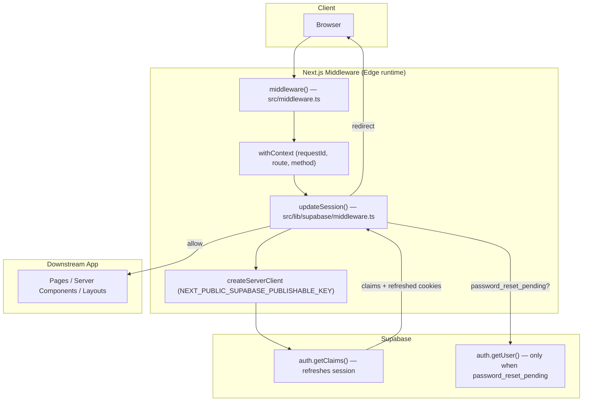
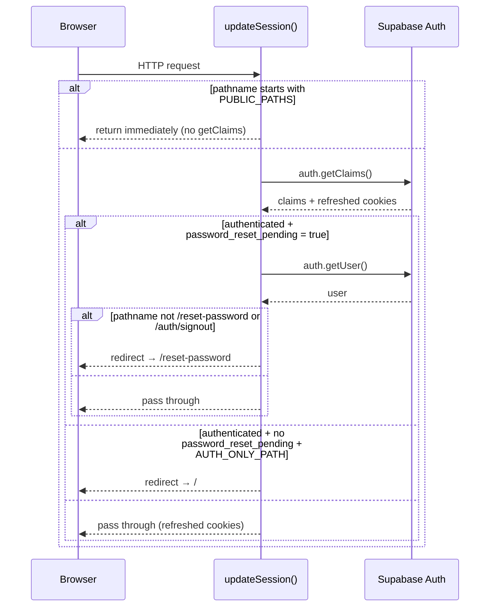

The Next.js Edge middleware handles one job per request: refresh the Supabase session cookie and apply two coarse-grained routing rules. It does not gate authenticated routes — that happens in the `(dashboard)` layout (`getAuthUserOrRedirect`) and in `(feed)/(private)` sub-groups. The middleware consists of two files: [`src/middleware.ts`](https://github.com/ozeaon/ozeaon-v2/blob/0a4f1a95824db87782f1221a4108019d174df3d9/src/middleware.ts) (the Next.js entry point) and [`src/lib/supabase/middleware.ts`](https://github.com/ozeaon/ozeaon-v2/blob/0a4f1a95824db87782f1221a4108019d174df3d9/src/lib/supabase/middleware.ts) (the session + guard implementation).

## Overview

The Supabase SSR pattern requires that every request pass through a small piece of middleware that calls `getClaims()` to transparently refresh the access token and write updated auth cookies back. Without this, Server Components and Route Handlers would see stale or missing sessions.

The matcher at the bottom of `src/middleware.ts` excludes `/api`, `_next/static`, `_next/image`, static file extensions, and prefetch requests, so the middleware never runs for API routes. API routes are responsible for their own auth via `withAuthUser`.

`src/middleware.ts` wraps `updateSession` in a `withContext` call that adds `requestId`, `route` and `method` to the logging context, so every log line produced during middleware execution can be correlated:

```typescript
export async function middleware(request: NextRequest) {
  return await withContext(
    { requestId: crypto.randomUUID(), route: request.nextUrl.pathname, method: request.method },
    () => updateSession(request),
  );
}
```

## Architecture



The design separates concerns deliberately: `src/middleware.ts` owns the framework integration and observability wrapping; `src/lib/supabase/middleware.ts` owns the authentication protocol details.

## Session Refresh

`updateSession` creates a Supabase client fresh on every request, bound to `NEXT_PUBLIC_SUPABASE_URL` and `NEXT_PUBLIC_SUPABASE_PUBLISHABLE_KEY`. The client is never shared across requests: the Edge handles many concurrent requests, and a singleton would leak one user's session cookies into another's.

The Supabase source comment captures the constraint: *"Do not run code between createServerClient and supabase.auth.getClaims(). A simple mistake could make it very hard to debug issues with users being randomly logged out."* `getClaims()` is therefore the first call after client construction.

## Routing Rules

`updateSession` applies three rules in order:

**Rule 1 — Skip public paths.** If the pathname starts with any entry in `PUBLIC_PATHS` (`/theme`, `/educational-resources`, `/auth/signin`, `/reset-password`), the function returns immediately without calling `getClaims()` or any guard logic. `/educational-resources`, `/theme` and `/auth/signin` are leftover entries from earlier code; they do not correspond to any current route (`/educational-resources` is an educational hub feature on the roadmap). `/reset-password` is a real route and is here so the reset page is always reachable.

**Rule 2 — Force password-reset-pending users to `/reset-password`.** `getClaims()` runs on every non-public path. If the claims show a signed-in user whose `user_metadata.password_reset_pending` is true, `getUser()` is called to confirm, and the user is redirected to `/reset-password` from every path except `/reset-password` itself and `/auth/signout`. This is the only case where `getUser()` runs; all other requests incur only the single `getClaims()` call.

**Rule 3 — Redirect signed-in users off auth pages.** If the user is authenticated and `password_reset_pending` is false, and the pathname is in `AUTH_ONLY_PATHS` (`/login`, `/forgot-password`, `/verify-email`), the middleware redirects to `/`. This prevents fully signed-in users from landing on login or recovery pages.



## Failure Modes & Edge Cases

| Failure | Mechanism | Mitigation |
|---------|-----------|------------|
| Random user logouts | Shared Supabase client across requests, or code between client creation and `getClaims()` | Fresh client per request; `getClaims()` called immediately |
| Redirect loop on `/reset-password` | Rule 1 causes early return before Rule 2 runs; `/reset-password` is in `PUBLIC_PATHS` | Always reachable |
| Authenticated user trapped mid-reset | Naively redirecting all authenticated users off auth pages would abort the reset | Rule 3 checks `!password_reset_pending` before redirecting |
| Inability to sign out | Rule 2 exempts `/auth/signout` from the password-reset redirect | Signout always reachable |
| Cookie cross-contamination under concurrency | Module-level singleton client | Per-request instantiation |

## Operational Notes

- **One `getClaims()` per non-public request.** `getUser()` only runs on requests where the claims carry `password_reset_pending`. The added latency for a typical request is one JWT verification round-trip.
- **Cookie write amplification.** Session refresh attaches `Set-Cookie` headers on every request where the token was renewed — the expected Supabase SSR behavior.
- **Statelessness.** The middleware holds no server-side session store; all session state travels in cookies, making the layer horizontally scalable.
- **Auth-page redirect destination.** Rule 3 redirects to `/`, not a configurable landing page.

## Related Links

- Root middleware entry point: [src/middleware.ts](https://github.com/ozeaon/ozeaon-v2/blob/0a4f1a95824db87782f1221a4108019d174df3d9/src/middleware.ts)
- Supabase session + guard implementation: [src/lib/supabase/middleware.ts](https://github.com/ozeaon/ozeaon-v2/blob/0a4f1a95824db87782f1221a4108019d174df3d9/src/lib/supabase/middleware.ts)
- Auth helpers (server-side guards used in layouts): [src/lib/supabase/queries/auth.ts](https://github.com/ozeaon/ozeaon-v2/blob/0a4f1a95824db87782f1221a4108019d174df3d9/src/lib/supabase/queries/auth.ts)
- Supabase client patterns: [Supabase Client Patterns](../supabase-client-patterns/)
- Auth flows: [Auth Flows](../../auth-and-accounts/auth-flows/)
- Logging: [Logging & Observability](../../operations/logging-observability/)
