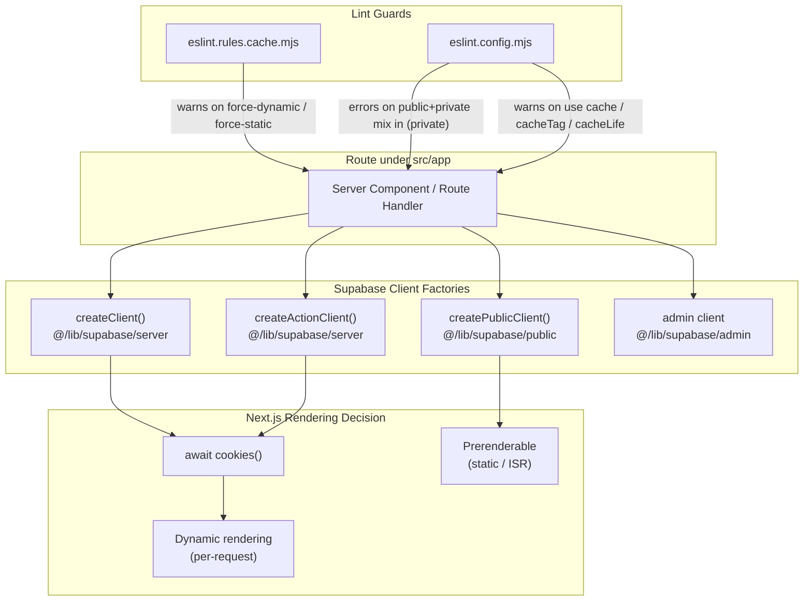
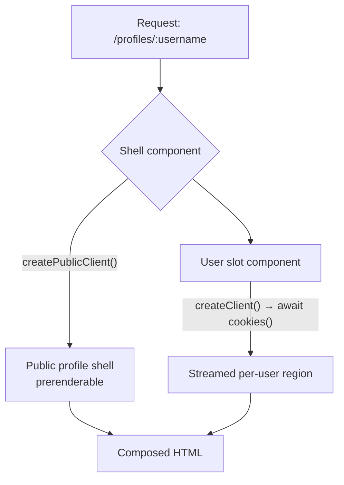
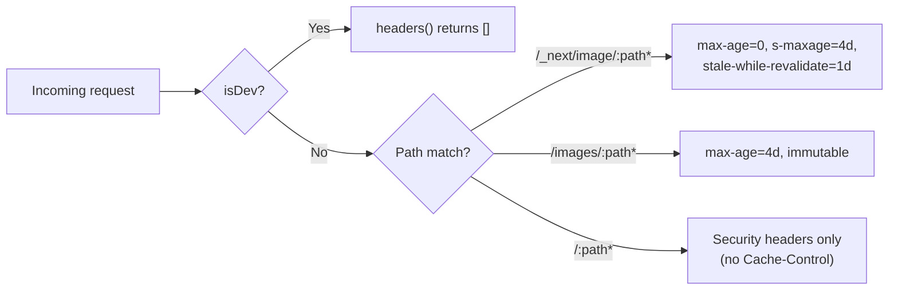
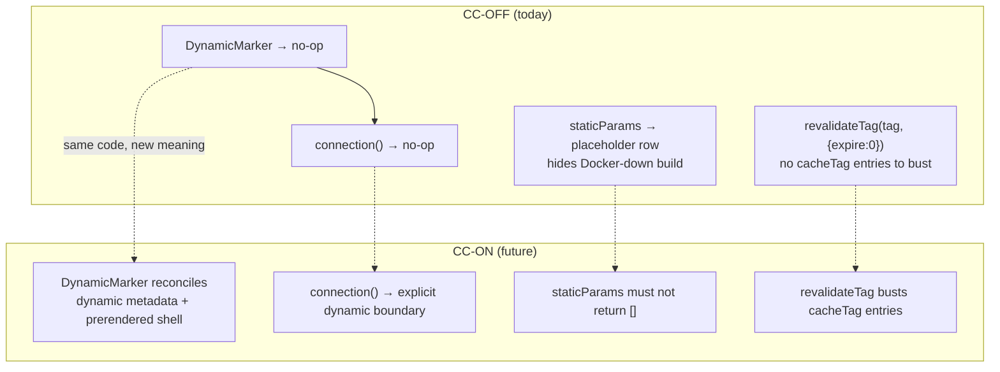

How this Next.js application decides — per route — whether a page is statically prerendered or dynamically rendered, and how HTTP caching is layered on top. The controlling mechanism is **which Supabase client a route imports**, not route-segment directives.

## Purpose and Scope

This page covers the project's current rendering contract: the deliberate choice of `cacheComponents: false`, the "client import decides rendering mode" rule, the ESLint enforcement around legacy directives, the `Cache-Control` / image-cache headers configured in `next.config.ts`, and the forward-compatible constructs (`DynamicMarker`, `staticParams`, two-arg `revalidateTag`) already present in the tree.

Out of scope — left to sibling pages:

- **Deployment topology, OpenNext/Cloudflare adapter internals, and preview environments** — see the deployment pages. This page only references them where caching headers or adapter constraints change rendering behavior.
- **Supabase client selection from a data-access / auth perspective** — see the Supabase & data-access page. Here we treat client selection purely as a *rendering trigger*.
- **Mutation ownership rules and Server Action conventions** — see the data-mutation/Server Actions page. Here we only cover the invalidation (`revalidateTag` / `revalidatePath`) side.

## Overview

The project runs a Next.js App Router application on Cloudflare Workers via the OpenNext adapter. Two rendering models exist in the codebase:

1. **The model in force today** — `cacheComponents: false`. Rendering mode is inferred by Next.js from the APIs a route calls. There are no `export const dynamic`, `revalidate`, `fetchCache`, or `runtime` directives; those are actively disallowed and lint-enforced.
2. **The future model** — `cacheComponents: true`, with `'use cache'`, `cacheLife`, `cacheTag`, `updateTag`, and Suspense boundaries. This is documented but deliberately disabled because it is blocked by the Cloudflare `workerd` 128 MB memory cap and postponned-state handling limitations in the OpenNext adapter.

Because the future model is documented and partially scaffolded (helper components and helpers already exist), a central engineering concern is **forward compatibility**: writing code today that still behaves correctly the day `cacheComponents` flips on. The rendering contract therefore has three distinct categories of rules:

| Category | Examples | Rule |
|---|---|---|
| **Active rules** | import `createClient()` vs `createPublicClient()` | Follow strictly today |
| **Forbidden constructs** | `export const dynamic`, `'use cache'`, one-arg `revalidateTag` in new code | Don't write; ESLint warns/errors |
| **Parked CC-era code** | `DynamicMarker`, `connection()`, `staticParams` helpers | Leave alone; don't extend |

The rule that "decides everything" is stated plainly in the rendering rules doc: route rendering is driven by **which Supabase client you import**, not by directives. `createClient()` calls `await cookies()`, and any use of `cookies()` automatically opts a Next.js route into dynamic rendering.

## Architecture

The rendering mode of a route is a consequence of the client factory it transitively imports. The diagram below shows the four client factories, their effect on Next.js rendering, and the ESLint rules that police the boundaries.



**Reading the diagram.** Every route reaches one of four client factories. Two of them — `createClient()` and `createActionClient()`, both in `@/lib/supabase/server` — await `cookies()`, which forces Next.js to render the route dynamically. `createPublicClient()` deliberately omits cookies and auth persistence, so routes that use only it remain prerenderable. The admin client bypasses RLS and is used sparingly. The lint layer does not run at runtime; it is a static guardrail that keeps developers from re-introducing legacy directives or accidentally mixing public and private data in the same component.

### Why the client decides rendering

The design intent is to make rendering mode an *emergent property of data access* rather than a manual, decoupled annotation. A developer cannot accidentally mark a route static while it reads user cookies — the cookie read itself forces dynamism. Conversely, a public page that never touches cookies is automatically optimizable. This removes an entire class of "I set `dynamic = 'force-static'` but the page reads a session" bugs.

The trade-off is that rendering mode is less visible at the top of a file. That is why the new-route checklist exists and why the ESLint rules are aggressive.

## Client Selection Rules

The rendering rules doc presents client selection as a decision table keyed on *what you are rendering*, not on what syntax you want:

| You're rendering… | Import from | Why |
|---|---|---|
| User-specific data (auth, owner controls, dashboards, anything under `(private)`) | `@/lib/supabase/server` → `createClient()` | Calls `await cookies()`; Next.js makes the route dynamic for you |
| Public read-only data (article body, public profile shell, public listings, build-time reads) | `@/lib/supabase/public` → `createPublicClient()` | No cookies, no auth — anonymous publishable key. Route can prerender |
| Client component (`"use client"`) | `@/lib/supabase/client` → `createClient()` | Create fresh per call. Never cache globally |
| Server-side, bypassing RLS (admin tooling, webhooks) | `@/lib/supabase/admin` | Use sparingly |

### Implementation of the dynamic client

```typescript
import "server-only";

import { env } from "@/config";
import { Database } from "@/types/supabase";
import { createServerClient } from "@supabase/ssr";
import { cookies } from "next/headers";

/**
 * Especially important if using Fluid compute: Don't put this client in a
 * global variable. Always create a new client within each function when using
 * it.
 */
export async function createClient() {
  const cookieStore = await cookies();

  return createServerClient<Database, "public">(
    env.supabase.url,
    env.supabase.pubKey,
    {
      cookies: {
        getAll() {
          return cookieStore.getAll();
        },
        setAll(cookiesToSet) {
          try {
            cookiesToSet.forEach(({ name, value, options }) =>
              cookieStore.set(name, value, options),
            );
          } catch {
            // The `setAll` method was called from a Server Component.
            // This can be ignored if you have middleware refreshing
            // user sessions.
          }
        },
      },
    },
  );
}
```

> Source: [server.ts](https://github.com/ozeaon/ozeaon-v2/blob/0a4f1a95824db87782f1221a4108019d174df3d9/src/lib/supabase/server.ts#L1-L38)

Three things in this file matter for rendering:

1. **`import "server-only"`** — a build-time guard that makes importing this module from a Client Component a compile error. This prevents the server cookie machinery from leaking into the browser bundle.
2. **`const cookieStore = await cookies()`** — the single line that flips a route to dynamic rendering. This is the entire mechanism referenced by the "rendering is driven by client import" rule.
3. **The `setAll` try/catch** — cookie writes fail silently inside Server Components (only Route Handlers and Server Actions may set cookies). The comment notes this is safe *if* middleware refreshes sessions. This is a deliberate tolerance so that the same client factory is usable in read-only rendering contexts.

### Implementation of the prerenderable public client

```typescript
import "server-only";

import { Database } from "@/types/supabase";
import { createClient } from "@supabase/supabase-js";

export function createPublicClient() {
  return createClient<Database, "public">(
    process.env.NEXT_PUBLIC_SUPABASE_URL!,
    process.env.NEXT_PUBLIC_SUPABASE_PUBLISHABLE_KEY!,
    {
      auth: {
        autoRefreshToken: false,
        persistSession: false,
      },
    },
  );
}
```

> Source: [public.ts](https://github.com/ozeaon/ozeaon-v2/blob/0a4f1a95824db87782f1221a4108019d174df3d9/src/lib/supabase/public.ts#L1-L17)

`createPublicClient()` is **synchronous** and touches no request-scoped API. It explicitly disables `autoRefreshToken` and `persistSession`, so there is no cookie or storage access of any kind. This is what makes routes that depend only on this client safe to prerender, and it is why the doc calls out the "naming trap": `@/lib/supabase/public` (anonymous *server* client, prerender-safe) is a different thing from `@/lib/supabase/client` (browser client, only valid inside `"use client"`).

### Reuse rules to avoid double clients

Two rules restated from `CLAUDE.md` prevent creating a second dynamic client per request:

- After `getAuthUser()` / `getAuthUserOrRedirect()`, **reuse** the `supabase` instance they return — don't call `createClient()` again.
- Inside a `withAuthUser` route handler, take `supabase` from `ctx` — don't re-create it.

Violating these does not break rendering correctness (cookies are already awaited either way) but it doubles the per-request client construction cost, which matters on a constrained Worker runtime.

## Recommended Route Patterns

### Public page

Import only `createPublicClient()` in the page, and supply a `generateStaticParams` that returns real rows. The `profiles/[username]/layout.tsx` route is cited as the reference shape.

### Private / auth-gated page

Import `createClient()` — or call `getAuthUserOrRedirect()`. **No directive is needed**; the `cookies()` call inside the client does the work.

### Mixed page (public shell + per-user slot)

This is the most important pattern, because it recovers cacheability for the public part of a page that also shows user data:

- Render the shell with `createPublicClient()`.
- Push the per-user piece into its own server component that uses `createClient()`.
- Wrap that component in `<Suspense>`.

The `profiles/[username]/` route decomposition is the worked example. The design intent: the shell stays prerenderable and the per-user region streams in, instead of the whole page being forced dynamic by one cookie read.



### Mutations

Server Actions and route handlers verify ownership with `.eq("user_id", user.id)`, then invalidate with `revalidateTag(...)` / `revalidatePath(...)`. See the data-mutation page for the ownership conventions; the invalidation specifics are covered below.

## Forbidden Constructs and Lint Enforcement

The rendering rules doc enumerates what *not* to write, tied to the specific lint rule that catches it.

| Forbidden | Reason | Enforcement |
|---|---|---|
| `export const dynamic = "force-dynamic" \| "force-static"` | Render mode is inferred from client import instead | ESLint warns (selector at `eslint.config.mjs:93`) |
| `export const revalidate \| fetchCache \| runtime \| dynamicParams = …` | Legacy route-segment config; already at zero in `src/` | Don't re-introduce |
| `"use cache"`, `cacheTag(...)`, `cacheLife(...)`, `updateTag(...)` | CC-only directives; project is CC-OFF | ESLint warns ("Project doesn't support cacheComponents yet") |
| `createPublicClient()` or admin inside a component that also reads user state | Mixes public cache with private data | ESLint **errors** inside `src/app/**/(private)/**/*.tsx` |
| A second `createClient()` after `getAuthUser*()` or inside `withAuthUser` | Two clients per request | Convention (`CLAUDE.md`) |
| Browser APIs (`document`, `window`, `localStorage`) in server components or at module level | SSR breakage | Convention (`CLAUDE.md`) |

### How the directive lint is implemented

The `force-dynamic` / `force-static` guard is an ESLint rule defined in `eslint.rules.cache.mjs`, matching on AST selectors rather than raw text:

```javascript
selector:
  "ExportNamedDeclaration > VariableDeclaration > VariableDeclarator[id.name='dynamic'][init.value='force-dynamic']",
```

> Source: [eslint.rules.cache.mjs](https://github.com/ozeaon/ozeaon-v2/blob/0a4f1a95824db87782f1221a4108019d174df3d9/eslint.rules.cache.mjs#L9)

```javascript
selector:
  "ExportNamedDeclaration > VariableDeclaration > VariableDeclarator[id.name='dynamic'][init.value='force-static']",
```

> Source: [eslint.rules.cache.mjs](https://github.com/ozeaon/ozeaon-v2/blob/0a4f1a95824db87782f1221a4108019d174df3d9/eslint.rules.cache.mjs#L15)

Using AST selectors rather than a regex means the rule fires only on a genuine *exported* `const dynamic`, not on an unrelated local variable named `dynamic` or on string content. Two separate selectors exist because `force-dynamic` and `force-static` are distinct literal nodes.

## HTTP Caching Configuration

Beyond Next.js render mode, the app applies explicit `Cache-Control` headers in `next.config.ts`. These are only emitted when not in development — the `headers()` function returns an empty array in dev so local development never serves stale assets.

```typescript
async headers() {
  if (isDev) {
    return [];
  }
  return [
    {
      source: "/_next/image/:path*",
      headers: [
        {
          key: "Cache-Control",
          value: `public, max-age=0, s-maxage=${FOUR_DAYS}, stale-while-revalidate=86400`,
        },
      ],
    },
    {
      source: "/images/:path*",
      headers: [
        {
          key: "Cache-Control",
          value: `public, max-age=${FOUR_DAYS}, immutable`,
        },
      ],
    },
    {
      source: "/:path*",
      headers: [
        { key: "Content-Security-Policy", value: _ContentSecurityPolicy },
        { key: "X-Frame-Options", value: "DENY" },
        { key: "X-Content-Type-Options", value: "nosniff" },
        { key: "Referrer-Policy", value: "strict-origin-when-cross-origin" },
        {
          key: "Strict-Transport-Security",
          value: "max-age=31536000; includeSubDomains",
        },
        {
          key: "Permissions-Policy",
          value: "geolocation=(), browsing-topics=()",
        },
        { key: "X-DNS-Prefetch-Control", value: "on" },
      ],
    },
  ];
},
```

> Source: [next.config.ts](https://github.com/ozeaon/ozeaon-v2/blob/0a4f1a95824db87782f1221a4108019d174df3d9/next.config.ts#L141-L183)

### Cache-Control semantics

| Route pattern | Cache-Control | Intent |
|---|---|---|
| `/_next/image/:path*` | `public, max-age=0, s-maxage=172800, stale-while-revalidate=86400` | Optimized images are never cached in the browser (`max-age=0`) but are cached at the edge/CDN for four days. `stale-while-revalidate=86400` (one day) lets the CDN serve a stale image while refetching in the background — avoiding a thundering herd of image re-optimizations |
| `/images/:path*` | `public, max-age=172800, immutable` | Static image assets are content-addressed by convention and never mutated, so they are cached in the browser for four days with `immutable`, meaning the browser will not even revalidate on reload |
| `/:path*` | Security headers only | No `Cache-Control` at all — page caching is entirely delegated to Next.js's own render-mode logic and the OpenNext/Cloudflare cache layer |

The key asymmetry: **the two-argument `FOUR_DAYS` value is shared** between the image `Cache-Control` headers and the Next.js image optimizer's `minimumCacheTTL`. The `images` config also sets `minimumCacheTTL: FOUR_DAYS`, `.formats: ["image/avif", "image/webp"]`, a custom loader at `./src/lib/image-loader.ts`, and allow-listed remote hostnames (`*.githubusercontent.com`, `*.googleusercontent.com`, `*.supabase.co`, `*.gstatic.com`, plus a computed `storageHost`).

### Why the general `/:path*` rule carries no Cache-Control

Page responses must not be cached with a static header, because the correct cacheability differs per route depending on whether it is dynamic or prerenderable. Hard-coding `Cache-Control` on `/:path*` would either make private pages edge-cacheable (a security/privacy hazard) or destroy caching for public pages. Next.js's own inference — driven by the client-import rule — is the authority instead. The `/:path*` block exists purely to apply security headers (CSP, HSTS, frame options, referrer policy, permissions policy) uniformly.



## CC-Era Constructs Already in the Tree

Several constructs in the repository belong conceptually to the future `cacheComponents` world but are present now. The rules doc is explicit: **don't remove them, don't copy them into new code.** They are deliberately shaped to be harmless today and correct tomorrow.

### `DynamicMarker`

A `<Suspense>`-wrapped `await connection()` component living at `src/components/ui/DynamicMarker.tsx`. Under CC-OFF it is a **no-op marker**. Under CC-ON it reconciles dynamic `generateMetadata` with prerenderable page shells — the "metadata keystone". New usages should not be added today.

### `staticParams` / `staticSlugParams` / `notFoundIfPlaceholder`

`generateStaticParams` helpers in `src/utils/generators/static-params.ts`. They are *defensive*: when the database returns empty or errors (e.g., Docker is down during a local build), they return a `__placeholder__` row instead of an empty array. Two reasons this exists:

1. **Future safety** — under CC-ON, `generateStaticParams` is forbidden from returning `[]`.
2. **Present safety** — it hides the Docker-down dev-build trap today, where an empty DB would otherwise produce a build with zero prerendered paths.

### `connection()` call sites

Exactly three exist: `api/storage/route.ts`, `profiles/[username]/images/page.tsx`, and `DynamicMarker` itself. All are no-ops under CC-OFF. New `connection()` calls outside `DynamicMarker` are disallowed.

### Two-arg `revalidateTag(tag, { expire: 0 })`

Some existing invalidations use the two-argument form (for example, `api/articles/[id]/route.ts`). The `{ expire: 0 }` options object is the CC-era shape. Under CC-OFF it is harmless — there are no `cacheTag` entries to invalidate — but it is forward-compatible. New tag invalidations should keep the two-arg shape and be paired with `revalidatePath(...)` for now.



## Enablement Path: When `cacheComponents` Flips On

The switch is a deliberate, documented migration rather than a config toggle. Three things must happen together:

1. **Follow the new rules** — `'use cache'`, `cacheLife`, `cacheTag`, Suspense boundaries, and the metadata + `DynamicMarker` keystone, per `cache-components-model.md`.
2. **Uncomment `experimental.maxPostponedStateSize: "25mb"`** in `next.config.ts`. This is required because Cloudflare `workerd` has a 128 MB memory cap, and the default postponed-state size of 100 MB multiplied by a 5× decompression buffer would blow it.
3. **Re-enable the parked OpenNext overrides** in `open-next.config.ts` — R2 incremental cache, D1 tag cache, and the DO (Durable Object) queue — **only after** `@opennextjs/cloudflare` ships a release supporting `cacheComponents`.

Until all three land, the CC-OFF rules remain "the project's rendering contract."

### Adapter / platform constraint

A related note appears in the Cloudflare Worker configuration: `revalidateTag` from a preview environment hits **staging's** code, not the preview's own code, because of `WORKER_SELF_REFERENCE`. A self-reference to a Worker that does not yet exist fails on first deploy, so the reference is pointed at staging instead. The documented cost is precisely this: tag revalidation triggered from a preview runs staging's code path. This is a caching-correctness caveat to be aware of when testing invalidation from preview branches.

## New-Route Checklist

The rendering rules doc provides a checklist intended to be copied into a PR description whenever a route is added under `src/app/`:

- [ ] Does the route render user-specific data? → `createClient()` (server), **no** directive.
- [ ] Public data only? → `createPublicClient()` + `generateStaticParams` via `staticParams(...)`.
- [ ] Mixed? → Public shell + Suspense-wrapped user slot, each with its own client.
- [ ] No `export const dynamic | revalidate | fetchCache | runtime | dynamicParams`.
- [ ] No `"use cache"` / `cacheTag` / `cacheLife` / `updateTag`.
- [ ] Mutations call `revalidateTag` / `revalidatePath`.
- [ ] No second `createClient()` after `getAuthUser*()` or inside `withAuthUser`.
- [ ] `pnpm build` is green (prerender errors only surface here, not in `tsc`).
- [ ] `pnpm lint` is green.

The penultimate item is an important operational detail: **prerender failures are build-time failures, not type-check failures.** `tsc` will happily accept a page that blows up during static generation. Only `pnpm build` exercises the prerender path.

## Failure Modes and Edge Cases

| Failure mode | Trigger | Behavior / mitigation |
|---|---|---|
| Cookie write from a Server Component | Supabase auth tries to refresh a token while rendering | `setAll` throws; the `try/catch` in `createClient()` swallows it. Safe only if middleware refreshes sessions — noted in the source comment |
| Docker down during a local build | DB unreachable while `generateStaticParams` runs | `staticParams` helpers return a `__placeholder__` row instead of `[]`, avoiding an empty prerender set and (in the future) a CC violation |
| Legacy directive re-introduced | Developer adds `export const dynamic` | ESLint warns via `eslint.rules.cache.mjs` AST selectors |
| Public + private data mixed in one component | `createPublicClient()` used in a component that also reads user state | ESLint **errors** inside `src/app/**/(private)/**/*.tsx` |
| Duplicate clients per request | Second `createClient()` after `getAuthUser*()` / inside `withAuthUser` | Convention violation; doubles client construction cost on constrained Worker runtime |
| Stale preview invalidation | `revalidateTag` from a preview deployment | Executes staging's code via `WORKER_SELF_REFERENCE`, not the preview's own code |
| Stale image after content update | Browser cached an image for four days as `immutable` (for `/images/:path*`) | Content-addressed/naming convention is relied upon; changing image content at the same path will not be picked up during the cache window |
| Postponed-state memory overflow (future) | CC-ON without the size override | Blocked today; the fix (`maxPostponedStateSize: "25mb"`) is pre-staged as a commented config line |

## Performance and Operational Notes

- **Edge image caching is the primary bandwidth lever.** The `/_next/image/:path*` rule keeps browser cache at zero while letting the CDN hold optimized images for four days with a one-day stale-while-revalidate window. Combined with `minimumCacheTTL: FOUR_DAYS`, the optimizer and the CDN agree on the same lifetime, so re-optimization is rare.
- **`immutable` on `/images/:path*`** means browsers skip conditional requests entirely for those assets — the cheapest possible repeat-visit path, purchased at the cost of requiring content-addressed or versioned filenames.
- **Streaming via Suspense on mixed pages** avoids forcing an entire page dynamic because of a single per-user region. This is a direct performance win: the public shell can be served from the prerender cache while only the user slot is computed per request.
- **Single client per request** keeps Worker CPU and memory usage down; the doc's repeated emphasis on reuse (via `getAuthUser*()` return values and `withAuthUser` `ctx`) is about the 128 MB `workerd` cap as much as about tidiness.
- **AVIF/WebP only** (`formats: ["image/avif", "image/webp"]`) with `qualities: [75, 85, 95]` bounds the set of generated variants, keeping the optimizer's cache from exploding combinatorially.
- **`minimumCacheTTL` and `Cache-Control` are coupled.** Changing `FOUR_DAYS` affects the header values, the optimizer TTL, and the browser cache lifetime simultaneously — it is a single shared constant.

## Extension Points

- **Add a new client factory** — a new `@/lib/supabase/*` module governs rendering exactly the way the existing four do: touch `cookies()` and the route goes dynamic; avoid it and the route stays prerenderable. This is the supported lever for new data-access shapes.
- **Add a lint rule** — new guards belong in `eslint.rules.cache.mjs` as AST selectors, allowing the same warn/error graduation pattern used for `force-dynamic`/`force-static`.
- **Add a cached route pattern** — new `headers()` entries in `next.config.ts` follow the same `source`/`headers` shape; keep the `isDev` early-return so development never serves cached responses.
- **Adopt CC constructs** — new `cacheTag`/`cacheLife`/`'use cache'` usage is gated behind the three-step enablement path; the two-arg `revalidateTag` shape is already the forward-compatible call form.

## API Reference

### `createClient(): Promise<SupabaseClient<Database, "public">>`

Server Supabase client for user-specific data. Reads all request cookies and silently tolerates failed cookie writes.

- **Parameters:** none.
- **Returns:** a `@supabase/ssr` server client bound to the `public` schema.
- **Rendering effect:** forces the calling route into dynamic rendering by awaiting `cookies()`.
- **Notes:** guarded by `import "server-only"`. Must not be placed in a module-level global.

> Source: [server.ts](https://github.com/ozeaon/ozeaon-v2/blob/0a4f1a95824db87782f1221a4108019d174df3d9/src/lib/supabase/server.ts#L13-L38)

### `createActionClient(): Promise<SupabaseClient<Database, "public">>`

Server Supabase client for **Server Actions**. Identical cookie wiring to `createClient()`, but `setAll` is **not** wrapped in a try/catch, because Server Actions are permitted to set cookies.

- **Parameters:** none.
- **Returns:** a `@supabase/ssr` server client bound to the `public` schema.
- **Throws:** cookie-set failures propagate (unlike `createClient()`).

> Source: [server.ts](https://github.com/ozeaon/ozeaon-v2/blob/0a4f1a95824db87782f1221a4108019d174df3d9/src/lib/supabase/server.ts#L44-L60)

### `createPublicClient(): SupabaseClient<Database, "public">`

Synchronous anonymous server client for public, read-only data. No cookies, no session persistence.

- **Parameters:** none.
- **Returns:** a `@supabase/supabase-js` client constructed from `NEXT_PUBLIC_SUPABASE_URL` and `NEXT_PUBLIC_SUPABASE_PUBLISHABLE_KEY`, with `autoRefreshToken: false` and `persistSession: false`.
- **Rendering effect:** none — the calling route remains prerenderable.
- **Notes:** guarded by `import "server-only"`; distinct from the browser client at `@/lib/supabase/client`.

> Source: [public.ts](https://github.com/ozeaon/ozeaon-v2/blob/0a4f1a95824db87782f1221a4108019d174df3d9/src/lib/supabase/public.ts#L6-L17)

## Related Links

- Rendering rules in force today — [docs/ssr/rendering-rules-today.md](https://github.com/ozeaon/ozeaon-v2/blob/0a4f1a95824db87782f1221a4108019d174df3d9/docs/ssr/rendering-rules-today.md)
- Future cacheComponents model — `docs/ssr/cache-components-model.md` (sibling document)
- Deployment previews and tag-revalidation caveats — [docs/deployment-previews.md](https://github.com/ozeaon/ozeaon-v2/blob/0a4f1a95824db87782f1221a4108019d174df3d9/docs/deployment-previews.md)
- Server client factory — [src/lib/supabase/server.ts](https://github.com/ozeaon/ozeaon-v2/blob/0a4f1a95824db87782f1221a4108019d174df3d9/src/lib/supabase/server.ts)
- Public (prerender-safe) client factory — [src/lib/supabase/public.ts](https://github.com/ozeaon/ozeaon-v2/blob/0a4f1a95824db87782f1221a4108019d174df3d9/src/lib/supabase/public.ts)
- Cache-Control and header configuration — [next.config.ts](https://github.com/ozeaon/ozeaon-v2/blob/0a4f1a95824db87782f1221a4108019d174df3d9/next.config.ts#L141-L183)
- Directive lint rules — [eslint.rules.cache.mjs](https://github.com/ozeaon/ozeaon-v2/blob/0a4f1a95824db87782f1221a4108019d174df3d9/eslint.rules.cache.mjs)
- Project conventions — [CLAUDE.md](https://github.com/ozeaon/ozeaon-v2/blob/0a4f1a95824db87782f1221a4108019d174df3d9/CLAUDE.md)
