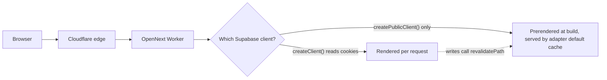

OZEAON is a Next.js App Router app that runs on Cloudflare Workers through the OpenNext adapter. This page explains how a route ends up prerendered or dynamic, why the Next.js Cache Components model is switched off, what the OpenNext adapter is (and is not) configured to cache, and which HTTP headers the app sets.

## Overview

Rendering is decided by which Supabase client a route uses, not by route-segment directives. A server component that calls `createClient()` from [`src/lib/supabase/server.ts`](https://github.com/ozeaon/ozeaon-v2/blob/0a4f1a95824db87782f1221a4108019d174df3d9/src/lib/supabase/server.ts) reads `cookies()`, so Next.js marks the route dynamic. A route that only uses `createPublicClient()` from [`src/lib/supabase/public.ts`](https://github.com/ozeaon/ozeaon-v2/blob/0a4f1a95824db87782f1221a4108019d174df3d9/src/lib/supabase/public.ts) has no cookies and can prerender. See [Supabase Client Patterns](../supabase-client-patterns/) for the factories themselves.

Caching is mostly left at defaults:

- `cacheComponents` is `false` in [`next.config.ts`](https://github.com/ozeaon/ozeaon-v2/blob/0a4f1a95824db87782f1221a4108019d174df3d9/next.config.ts), on purpose. It stays off until the OpenNext Cloudflare adapter supports it; the postponed-state buffers would exceed the 128 MB `workerd` memory cap.
- The OpenNext R2 incremental cache, D1 tag cache and Durable Object queue are **not enabled**. All three are commented out in [`open-next.config.ts`](https://github.com/ozeaon/ozeaon-v2/blob/0a4f1a95824db87782f1221a4108019d174df3d9/open-next.config.ts), and `defineCloudflareConfig` is called with an empty object, so the adapter uses its own defaults.
- The only explicit caching is two `Cache-Control` header rules for image paths, set in `next.config.ts`.

The working rules live in the codebase in [`docs/ssr/rendering-rules-today.md`](https://github.com/ozeaon/ozeaon-v2/blob/0a4f1a95824db87782f1221a4108019d174df3d9/docs/ssr/rendering-rules-today.md). The future model (`"use cache"`, `cacheLife`, `cacheTag`, Suspense boundaries) is written up in [`docs/ssr/cache-components-model.md`](https://github.com/ozeaon/ozeaon-v2/blob/0a4f1a95824db87782f1221a4108019d174df3d9/docs/ssr/cache-components-model.md). That model is not in use yet.

## Rendering Rules Today

- **User-specific data:** use `createClient()` (or `getAuthUser()` / `getAuthUserOrRedirect()`, which call it). The route becomes dynamic automatically. No directive is needed.
- **Public data only:** use `createPublicClient()` and a `generateStaticParams` built with the helpers in [`src/utils/generators/static-params.ts`](https://github.com/ozeaon/ozeaon-v2/blob/0a4f1a95824db87782f1221a4108019d174df3d9/src/utils/generators/static-params.ts). They return a `__placeholder__` row when the database is empty or unreachable during a build, and `notFoundIfPlaceholder` turns that row into a 404 at request time.
- **Mixed pages:** render the public shell with `createPublicClient()` and put the per-user part in its own server component that uses `createClient()`, wrapped in `<Suspense>`.
- **No route-segment config.** There are no `export const dynamic | revalidate | fetchCache | runtime | dynamicParams` exports anywhere in `src/`. ESLint enforces part of this: [`eslint.rules.cache.mjs`](https://github.com/ozeaon/ozeaon-v2/blob/0a4f1a95824db87782f1221a4108019d174df3d9/eslint.rules.cache.mjs) errors on `dynamic = "force-dynamic"` and `"force-static"`. The other exports are kept out by convention only.
- **No Cache Components directives.** The same rule file errors on `"use cache"`, `cacheTag()`, `cacheLife()` and `updateTag()` with "Project doesn't support cacheComponents yet."
- **No public client in private routes.** [`eslint.config.mjs`](https://github.com/ozeaon/ozeaon-v2/blob/0a4f1a95824db87782f1221a4108019d174df3d9/eslint.config.mjs) bans importing `@/lib/supabase/public` from any `src/app/**/(private)/**/*.tsx` file.
- **Invalidation uses `revalidatePath`.** Server Actions and route handlers call `revalidatePath(...)` after writes. For examples, see [`src/lib/supabase/actions.ts`](https://github.com/ozeaon/ozeaon-v2/blob/0a4f1a95824db87782f1221a4108019d174df3d9/src/lib/supabase/actions.ts) and [`src/app/api/posts/route.ts`](https://github.com/ozeaon/ozeaon-v2/blob/0a4f1a95824db87782f1221a4108019d174df3d9/src/app/api/posts/route.ts). The code has no `revalidateTag` calls, even though `CLAUDE.md` and `docs/ssr/rendering-rules-today.md` mention them.

Some constructs in the tree only matter once Cache Components is on: `DynamicMarker` (a Suspense-wrapped `await connection()`) and the few `connection()` call sites. They do nothing today. Leave them in place, and don't copy them into new code.

## Architecture



`next.config.ts` decides what is rendered and which headers go out. `open-next.config.ts` would decide where cached output is stored, but its overrides are commented out, so it currently changes nothing.

### HTTP Headers

`headers()` returns nothing in development. In production builds it sets two caching rules and a set of security headers:

```typescript
{ source: "/_next/image/:path*",
  headers: [{ key: "Cache-Control",
    value: `public, max-age=0, s-maxage=${FOUR_DAYS}, stale-while-revalidate=86400` }] },
{ source: "/images/:path*",
  headers: [{ key: "Cache-Control", value: `public, max-age=${FOUR_DAYS}, immutable` }] },
```

`FOUR_DAYS` is four days in seconds. It is also used for `images.minimumCacheTTL`, so the header and the optimiser TTL change together. HTML responses (`/:path*`) get security headers but no `Cache-Control`.

The Content Security Policy is built from environment variables. Both storage hosts (`storage-r2.ozeaon.com` and `storage-r2.ozeaon.dev`) are always allowed in `img-src` and `connect-src`, because article content and attachments store absolute URLs from whichever environment uploaded them. Local Supabase origins are added when `NEXT_PUBLIC_SUPABASE_URL` points at `localhost` or `127.0.0.1`. The check uses the URL rather than `NODE_ENV` because `pnpm preview` and `pnpm ci:build` emit production headers while still talking to a local Supabase.

### Images

`images.loader` is `"custom"`, pointing at [`src/lib/image-loader.ts`](https://github.com/ozeaon/ozeaon-v2/blob/0a4f1a95824db87782f1221a4108019d174df3d9/src/lib/image-loader.ts). The loader rewrites production R2 URLs to Cloudflare Image Transformations (`/cdn-cgi/image/...`) on the storage domain. Cloudflare resizes, re-encodes and edge-caches the image there. Local `/api/storage` URLs get width and quality hints. Everything else passes through unchanged. See [Media & Images](../../storage/media-and-images/) and [Storage (R2)](../../storage/storage-r2/).

## Failure Modes & Edge Cases

- **A public page imports `createClient()` by accident.** The page silently becomes dynamic. Nothing fails, and `tsc` won't catch it; the only sign is in the `pnpm build` route output. The ESLint rule only works the other way round, stopping the public client from being used in `(private)` routes.
- **The database is unreachable during a build.** `generateStaticParams` would return no params. The `staticParams` helpers return a placeholder row instead, so the build still succeeds and the placeholder route 404s.
- **`NEXT_PUBLIC_STORAGE_URL` is unset or malformed.** The configured storage host is dropped from the CSP and `images.remotePatterns`. The two hard-coded ozeaon storage hosts are still allowed.
- **The image loader only knows the production R2 origin.** URLs on `storage-r2.ozeaon.dev` pass through untransformed. Because the loader is custom, `next/image` does not generate `/_next/image` URLs, so that `Cache-Control` rule and `minimumCacheTTL` only apply if something requests the path directly. There is also no `public/images/` directory, so the `/images/:path*` rule matches nothing today.

## Operational Notes

- `NEXT_PUBLIC_*` values are inlined at build time. Changing the storage or Supabase URL means rebuilding, because the CSP and image patterns are baked into the build.
- `initOpenNextCloudflareForDev()` only runs when `NODE_ENV === "development"`. That stops `typegen`, `build` and other CLI commands from stalling on binding setup.
- `pdfjs-dist` is listed in `serverExternalPackages`, so it is not bundled into the server output.
- Prerender errors only appear in `pnpm build`, not in `tsc` or `pnpm lint`.

## Extension Points

- **Turning on Cache Components** is a roadmap item, blocked on adapter support. When it happens: follow `docs/ssr/cache-components-model.md`, uncomment `experimental.maxPostponedStateSize` in `next.config.ts`, then re-enable the R2 incremental cache, D1 tag cache and DO queue in `open-next.config.ts`. Each of those also needs its Cloudflare binding provisioned.
- **Adding an image or CSP host:** add it to `images.remotePatterns` and to the CSP template in the same change.
- **Changing the image cache window:** edit `FOUR_DAYS`.

## Related Links

- [Supabase Client Patterns](../supabase-client-patterns/)
- [App Structure](../app-structure/)
- [Middleware & Sessions](../middleware-sessions/)
- [Storage (R2)](../../storage/storage-r2/)
- [Media & Images](../../storage/media-and-images/)
- [Cloudflare Deployment](../../operations/cloudflare-deployment/)
