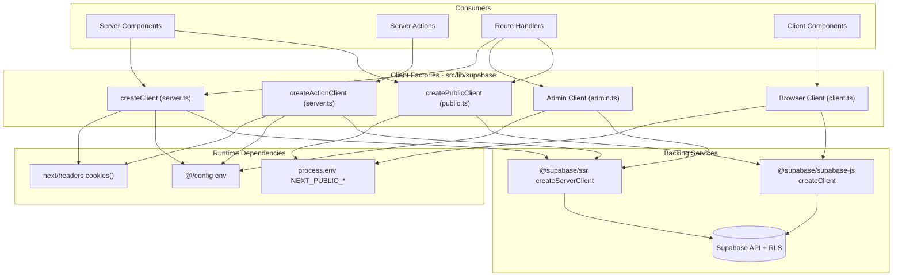
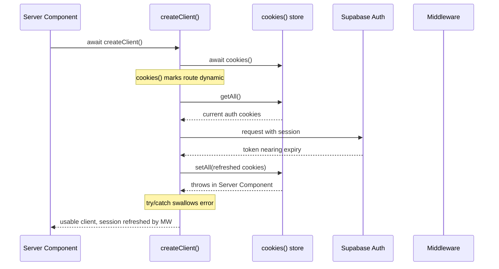

A reference for the four Supabase client factories used across OZEAON V2 and the rules that keep server-side data access correct under Next.js App Router's rendering model.

## Purpose and Scope

This page documents the Supabase client layer of OZEAON V2: the separate client factories (`server`, `public`, `admin`, `client`), how they are wired to cookies and environment configuration, and the discipline required around them in Server Components, Server Actions, and Route Handlers.

It covers:

- The client factory modules under `src/lib/supabase/`
- Cookie wiring and why `createClient()` is the dynamic-rendering signal
- Rules for reusing the memoized client returned by the auth helpers
- The ESLint guardrails that enforce client selection
- Typed data access via the generated `Database` types

Related topics left to sibling pages: the generated database schema/types themselves, the R2 storage adapter, and route-level authentication middleware are covered where they intersect this page, but their full treatment lives on their own pages. For background on the broader application architecture, see the parent Architecture section.

## Overview

OZEAON V2 is a Next.js App Router application with React Server Components, backed by Supabase (PostgreSQL with Row Level Security over 30+ tables). Because the same codebase renders on the server, in the browser, and inside request handlers, a single "global" Supabase client would be incorrect: each execution context has different access to cookies, different security constraints, and different caching semantics.

The project therefore exposes **four distinct client factories**, each with an explicit audience:

| Client | Import | Use In |
| ------ | ------ | ------ |
| Server | `@/lib/supabase/server` | Server Components, Server Actions, API routes |
| Browser | `@/lib/supabase/client` | Client Components (`"use client"`) — create fresh per call |
| Admin | `@/lib/supabase/admin` | API routes bypassing RLS (use sparingly) |
| Public | `@/lib/supabase/public` | Unauthenticated public queries |

> Source: [CLAUDE.md](https://github.com/ozeaon/ozeaon-v2/blob/0a4f1a95824db87782f1221a4108019d174df3d9/CLAUDE.md#L82-L89)

The core design intent is **context-appropriate identity and caching**. A request that must serve user-specific data goes through the server client (which reads the request cookies and therefore becomes dynamic). A page that only needs publicly readable rows goes through the public client (which touches no request state and therefore can be statically prerendered). The admin client intentionally steps outside RLS and is restricted to cases where bypassing row security is the point.

## Architecture

The client layer sits between application code and three backing services: the Supabase Auth/PostgREST API, the request cookie store, and the environment configuration module.



Each factory returns a client strongly typed against the generated `Database` type and the `"public"` schema, so table and column names are checked at compile time. The server factories bind to the incoming request's cookie store; the public factory explicitly disables session persistence and token refresh because it has no user session to maintain.

## The Server Client: `createClient()`

The server client is the default for anything that reads or writes user-specific data. It is implemented with `@supabase/ssr`'s `createServerClient` and is explicitly marked `server-only`, so importing it from a Client Component is a build error rather than a runtime surprise.

```typescript
import "server-only";

import { env } from "@/config";
import { Database } from "@/types/supabase";
import { createServerClient } from "@supabase/ssr";
import { cookies } from "next/headers";

/**
 * Especially important if using Fluid compute: Don't put this client in a
 * global variable. Always create a new client within each function when using
 * it.
 */
export async function createClient() {
  const cookieStore = await cookies();

  return createServerClient<Database, "public">(
    env.supabase.url,
    env.supabase.pubKey,
    {
      cookies: {
        getAll() {
          return cookieStore.getAll();
        },
        setAll(cookiesToSet) {
          try {
            cookiesToSet.forEach(({ name, value, options }) =>
              cookieStore.set(name, value, options),
            );
          } catch {
            // The `setAll` method was called from a Server Component.
            // This can be ignored if you have middleware refreshing
            // user sessions.
          }
        },
      },
    },
  );
}
```

> Source: [server.ts](https://github.com/ozeaon/ozeaon-v2/blob/0a4f1a95824db87782f1221a4108019d174df3d9/src/lib/supabase/server.ts#L1-L38)

Several deliberate decisions are visible in this short function:

- **`import "server-only"`** — a compile-time firewall. Any accidental client-side import fails the build immediately.
- **No global/cached instance.** The doc comment notes this matters especially under Fluid compute: a globally shared client would leak request context between invocations. The comment directs callers to create a new client *within each function*.
- **`await cookies()`** — under this project's Next.js version `cookies()` is async (a breaking change from 14). This single call is the mechanism that opts the enclosing route into **dynamic rendering**.
- **The `setAll` try/catch is intentional.** Server Components are not allowed to mutate cookies. When Supabase attempts to refresh a session during a Server Component render, the `set` throws; swallowing the error is safe *provided middleware is refreshing sessions*. If middleware were removed, expired tokens would silently fail to refresh.

### Why `createClient()` is the dynamic signal

The project relies on an implicit contract rather than explicit route config: with `cacheComponents: false`, calling `await createClient()` internally calls `cookies()`, which automatically opts that route into dynamic rendering.

> Source: [CLAUDE.md](https://github.com/ozeaon/ozeaon-v2/blob/0a4f1a95824db87782f1221a4108019d174df3d9/CLAUDE.md#L13-L21)

The safe-coding rules that follow from this:

- **Always use `createClient()` for user-specific data** — the `cookies()` call inside is the dynamic signal.
- **Never use `createPublicClient()` or the admin client in a component that also renders user-specific state** — doing so mixes a static-capable client into a dynamic view and can serve stale or incorrectly scoped data.
- **Public pages (articles, profiles, etc.) that use only `createPublicClient()` will correctly prerender statically.** This is the performance payoff of the split: the same codebase statically generates public content while remaining dynamic only where user state is required.
- **Never use old model directives** such as `export const dynamic` / `revalidate` / `fetchCache` / `runtime`. The cookie call already expresses intent; declaring it again is redundant and error-prone.

## The Action Client: `createActionClient()`

Server Actions **are** permitted to set cookies, so they use a variant that does not swallow the write error. This is the whole difference between the two factories.

```typescript
/**
 * Create a Supabase client specifically for Server Actions.
 * Server Actions CAN set cookies, so we don't catch errors here.
 */
export async function createActionClient() {
  const cookieStore = await cookies();

  return createServerClient<Database, "public">(
    env.supabase.url,
    env.supabase.pubKey,
    {
      cookies: {
        getAll() {
          return cookieStore.getAll();
        },
        setAll(cookiesToSet) {
          cookiesToSet.forEach(({ name, value, options }) =>
            cookieStore.set(name, value, options),
          );
        },
      },
    },
  );
}
```

> Source: [server.ts](https://github.com/ozeaon/ozeaon-v2/blob/0a4f1a95824db87782f1221a4108019d174df3d9/src/lib/supabase/server.ts#L40-L63)

| Aspect | `createClient()` | `createActionClient()` |
| ------ | ---------------- | ---------------------- |
| Cookie `getAll` | Returns request cookies | Returns request cookies |
| Cookie `setAll` | Wrapped in `try/catch` (errors ignored) | Unwrapped — errors propagate |
| Intended caller | Server Components, API routes | Server Actions |
| Rationale | Server Components cannot mutate cookies | Server Actions can and should persist refreshed session |

Both factories share the same typed signature `createServerClient<Database, "public">` and read credentials from the `env` module, so the only behavioral difference is error surfacing on cookie writes.

## The Public Client: `createPublicClient()`

The public client is for data that is readable without a user session. It uses `@supabase/supabase-js` directly (not the SSR package) and hard-disables session handling.

```typescript
import "server-only";

import { Database } from "@/types/supabase";
import { createClient } from "@supabase/supabase-js";

export function createPublicClient() {
  return createClient<Database, "public">(
    process.env.NEXT_PUBLIC_SUPABASE_URL!,
    process.env.NEXT_PUBLIC_SUPABASE_PUBLISHABLE_KEY!,
    {
      auth: {
        autoRefreshToken: false,
        persistSession: false,
      },
    },
  );
}
```

> Source: [public.ts](https://github.com/ozeaon/ozeaon-v2/blob/0a4f1a95824db87782f1221a4108019d174df3d9/src/lib/supabase/public.ts#L1-L17)

Design intent:

- **No cookie access at all.** By never touching `cookies()`, this client does not mark routes dynamic, which is what allows public pages to be statically prerendered.
- **`persistSession: false` and `autoRefreshToken: false`.** There is no session to keep; leaving refresh enabled would be wasted work and could introduce hidden state.
- **It is still `server-only`.** Public does not mean *browser* — this is a server-rendered, unauthenticated client. It reads `NEXT_PUBLIC_*` env vars, but the module itself is restricted to the server.
- **RLS still applies.** It uses the publishable (anon) key, so row visibility is governed by the same Row Level Security policies as the server client — only without an authenticated identity.

The ESLint configuration reinforces the boundary: importing from `@/lib/supabase/public` inside private routes is flagged, with the message *"Use createClient() in private routes."*

> Source: [eslint.config.mjs](https://github.com/ozeaon/ozeaon-v2/blob/0a4f1a95824db87782f1221a4108019d174df3d9/eslint.config.mjs#L44-L46)

## Client Selection Flow

Choosing a client is the first decision in any data-access path. The following flow encodes the rules from the project guidance into a decision process.

```mermaid
flowchart TD
    Start(["Data access needed"]) --> Context{"Where does this code run?"}

    Context -->|"Client Component"| Browser["createClient from @/lib/supabase/client, fresh per call"]
    Context -->|"Server Component or Route Handler"| UserState{"Does it render or return user-specific state?"}
    Context -->|"Server Action"| Action["createActionClient (server.ts) - errors surface on cookie set"]

    UserState -->|"Yes"| HasAuth{"Already called getAuthUser / getAuthUserOrRedirect?"}
    UserState -->|"No, public read only"| Priv{"Is this a private route?"}

    HasAuth -->|"Yes"| Reuse["Reuse {" user, supabase "} from the auth helper"]
    HasAuth -->|"No"| Server["await createClient() from @/lib/supabase/server"]

    Priv -->|"Yes"| Server
    Priv -->|"No, public page"| Public["createPublicClient() - enables static prerender"]

    Server --> Dynamic["Route becomes dynamic via cookies()"]
    Reuse --> Dynamic
    Action --> Dynamic
    Public --> Static["Route can prerender statically"]
    Browser --> End(["Execute query"])
    Dynamic --> End
    Static --> End

    subgraph sg_Admin["Exception: privileged operations"]
        AdminPath["Route Handler that must bypass RLS"] --> AdminClient["Admin client from @/lib/supabase/admin - use sparingly"]
    end
```

The two terminal states matter: paths through `createClient()` / `createActionClient()` yield a **dynamic** route, while the public path yields a **statically prerenderable** route. This is a deliberate trade — the codebase prefers a dynamic route for correctness on authenticated data over aggressive caching of the same page.

## Client Reuse and Memoization

The auth helpers return *both* the user and a request-memoized `supabase` client. Creating a second client after calling them is a documented anti-pattern because it allocates a redundant client for the same request.

```typescript
// ❌ Wrong — two clients for one request
const supabase = await createClient();
const { user } = await getAuthUserOrRedirect();

// ✅ Correct — reuse the client from auth
const { user, supabase } = await getAuthUserOrRedirect();
```

> Source: [CLAUDE.md](https://github.com/ozeaon/ozeaon-v2/blob/0a4f1a95824db87782f1221a4108019d174df3d9/CLAUDE.md#L100-L107)

The same rule applies inside route handlers wrapped by `withAuthUser`, which inject the client through the handler context:

```typescript
// ❌ Wrong
export const POST = withAuthUser(async (req, { user }) => {
  const supabase = await createClient();
  ...

// ✅ Correct
export const POST = withAuthUser(async (req, { user, supabase }) => {
  ...
```

> Source: [CLAUDE.md](https://github.com/ozeaon/ozeaon-v2/blob/0a4f1a95824db87782f1221a4108019d174df3d9/CLAUDE.md#L109-L121)

Why it matters: `getAuthUser()` and `getAuthUserOrRedirect()` already return a `supabase` client memoized by React `cache()` for the request. Calling `createClient()` again creates a second client unnecessarily, duplicating cookie reads and the internal auth state machine for no benefit. Reusing the memoized client keeps the request to a single client instance without sacrificing the dynamic-rendering signal (the memoized client was itself built from `cookies()`).

## Client Component Usage

In the browser, the rule inverts: create a fresh client per call and never cache it globally.

```typescript
// Client Component
"use client";
// ⚠️ Create fresh per request, never cache globally Client Component
import { createClient } from "@/lib/supabase/client";

const supabase = createClient();
```

> Source: [CLAUDE.md](https://github.com/ozeaon/ozeaon-v2/blob/0a4f1a95824db87782f1221a4108019d174df3d9/CLAUDE.md#L124-L131)

A globally cached browser client would carry auth state across unrelated navigations and could hold stale sessions. Creating fresh per call keeps the client aligned with the current session held in the browser's cookie/local-storage.

## Data Access Layer: Typed Queries

Data access is organized into a `queries/` directory under `src/lib/supabase/`, one module per domain entity, plus a barrel `index.ts` and shared helpers.

| Module | Domain |
| ------ | ------ |
| `queries/articles.ts` | Articles |
| `queries/auth.ts` | Auth-related reads |
| `queries/categories.ts` | Categories |
| `queries/comment-sources.ts` | Comment sources |
| `queries/comments.ts` | Comments |
| `queries/notifications.ts` | Notifications |
| `queries/organizations.ts` | Organizations |
| `queries/posts.ts` | Posts |
| `queries/profile.ts` | Profile |
| `queries/profile-reads.ts` | Profile read tracking |
| `queries/projects.ts` | Projects |
| `queries/reactions.ts` | Reactions |
| `queries/generate-unique-slug.ts` | Slug generation helper |
| `queries/index.ts` | Barrel export surface |

> Source: [index.ts](https://github.com/ozeaon/ozeaon-v2/blob/0a4f1a95824db87782f1221a4108019d174df3d9/src/lib/supabase/queries/index.ts)

The convention is that each query function receives (or creates) a client and issues typed PostgREST calls, using the generated `Database` types. Application code imports query functions from the barrel rather than reaching for a client directly, which centralizes the "which client, which table, which filter" decision in one place per domain.

Because queries are written against the generated types, the recommended type imports are:

```typescript
import type { Tables, TablesInsert, TablesUpdate } from "@/types/supabase";
```

> Source: [CLAUDE.md](https://github.com/ozeaon/ozeaon-v2/blob/0a4f1a95824db87782f1221a4108019d174df3d9/CLAUDE.md#L156)

`TablesInsert<"table">` is the standard shape for insert payloads in API routes, and mutations in Server Actions must add `.eq("user_id", user.id)` to enforce ownership on top of RLS.

> Source: [CLAUDE.md](https://github.com/ozeaon/ozeaon-v2/blob/0a4f1a95824db87782f1221a4108019d174df3d9/CLAUDE.md#L142-L144)

## Cookie and Session Lifecycle

The server and action clients both delegate cookie handling to the request-scoped store from `next/headers`. Understanding the write path explains the whole design.



The design assumes a middleware layer refreshes sessions on every request so that the swallowed `setAll` failure in Server Components is harmless. This is the classic `@supabase/ssr` + Next.js arrangement: middleware owns the write, Server Components read only.

For Server Actions, the same sequence applies but the `setAll` write succeeds, which is why `createActionClient()` omits the `try/catch` — a failure there should surface rather than be silently dropped.

## Failure Modes and Edge Cases

| Scenario | Behavior | Mitigation in source |
| -------- | -------- | -------------------- |
| Server Component attempts to refresh a session | `cookieStore.set` throws; error swallowed | Middleware refreshes sessions; `createClient()` catches and ignores |
| Server Action needs to persist refreshed tokens | `setAll` unwrapped, so errors propagate | `createActionClient()` provides an unsuppressed write path |
| Global cached server client under Fluid compute | Would leak request context | Doc comment forbids global/client-var usage; create per function |
| Client Component caches browser client globally | Stale session across navigations | Guidance: create fresh per call, never cache globally |
| User-specific component also uses public/admin client | Mixed static and dynamic data | Explicit rule: never use public/admin where user state is rendered |
| Dynamic route relies on explicit directives | Redundant and fragile | Project rule forbids `dynamic`/`revalidate`/`fetchCache`/`runtime` |
| Private route imports the public client | Wrong client selection | ESLint rule: "Use createClient() in private routes." |
| Two clients created in one request | Redundant client, duplicated cookie reads | Reuse the memoized `supabase` returned by the auth helpers |

> Sources:
> - [server.ts](https://github.com/ozeaon/ozeaon-v2/blob/0a4f1a95824db87782f1221a4108019d174df3d9/src/lib/supabase/server.ts#L8-L38)
> - [CLAUDE.md](https://github.com/ozeaon/ozeaon-v2/blob/0a4f1a95824db87782f1221a4108019d174df3d9/CLAUDE.md#L13-L21)
> - [CLAUDE.md](https://github.com/ozeaon/ozeaon-v2/blob/0a4f1a95824db87782f1221a4108019d174df3d9/CLAUDE.md#L98-L121)
> - [eslint.config.mjs](https://github.com/ozeaon/ozeaon-v2/blob/0a4f1a95824db87782f1221a4108019d174df3d9/eslint.config.mjs#L44-L46)

## Operational and Caching Notes

- **Dynamic vs. static is a data-correctness decision, not a performance tweak.** Because `createClient()` triggers dynamics implicitly, a reviewer can infer a route's rendering mode by which client it uses.
- **Fluid compute safety** depends entirely on per-function client creation. Any refactor that hoists a server client into a module-level variable introduces cross-request contamination risk.
- **The public client is the only path that preserves static prerendering.** Public pages (articles, profiles) that use only `createPublicClient()` stay statically generated; adding one `createClient()` call to such a page silently makes it dynamic.
- **`server-only` is enforced at build time** for the server, action, and public modules, so mistakes fail fast during `pnpm check` / `pnpm build` rather than in production.
- **Env sourcing differs by client**: the server factories use the validated `env` module from `@/config`, while the public and browser clients read `NEXT_PUBLIC_SUPABASE_URL` and `NEXT_PUBLIC_SUPABASE_PUBLISHABLE_KEY` directly from `process.env`.

> Sources:
> - [server.ts](https://github.com/ozeaon/ozeaon-v2/blob/0a4f1a95824db87782f1221a4108019d174df3d9/src/lib/supabase/server.ts#L1-L38)
> - [public.ts](https://github.com/ozeaon/ozeaon-v2/blob/0a4f1a95824db87782f1221a4108019d174df3d9/src/lib/supabase/public.ts#L1-L17)

## Extension Points

- **New domain modules** belong in `src/lib/supabase/queries/<domain>.ts` and should be re-exported from `queries/index.ts`, matching the existing one-module-per-entity convention.
- **New client variants** should follow the identical shape — a `server-only` module exporting a factory that returns `createServerClient<Database, "public">` or `createClient<Database, "public">`, with credentials sourced from `env` (server) or `NEXT_PUBLIC_*` (public/browser).
- **ESLint restrictions** in `eslint.config.mjs` are the enforcement mechanism for client selection; adding a new restricted client means adding a corresponding no-restricted-imports entry.
- **Cache directives** are intentionally not used — new caching should be expressed by choosing the public client for static-capable data rather than by adding `revalidate`/`dynamic` exports.

> Sources:
> - [queries/index.ts](https://github.com/ozeaon/ozeaon-v2/blob/0a4f1a95824db87782f1221a4108019d174df3d9/src/lib/supabase/queries/index.ts)
> - [eslint.config.mjs](https://github.com/ozeaon/ozeaon-v2/blob/0a4f1a95824db87782f1221a4108019d174df3d9/eslint.config.mjs#L44-L46)
> - [eslint.rules.cache.mjs](https://github.com/ozeaon/ozeaon-v2/blob/0a4f1a95824db87782f1221a4108019d174df3d9/eslint.rules.cache.mjs#L10-L12)

## API Reference

### `createClient(): Promise<SupabaseClient<Database, "public">>`

Creates a request-scoped server client bound to the incoming cookies. Marks the enclosing route dynamic.

- **Module:** `@/lib/supabase/server`
- **Returns:** A typed Supabase client configured with cookie `getAll`/`setAll`.
- **Errors:** Cookie write failures are swallowed internally (safe only if middleware refreshes sessions).

> Source: [server.ts](https://github.com/ozeaon/ozeaon-v2/blob/0a4f1a95824db87782f1221a4108019d174df3d9/src/lib/supabase/server.ts#L13-L38)

### `createActionClient(): Promise<SupabaseClient<Database, "public">>`

Creates a server client for Server Actions, where cookie writes are permitted and propagate errors.

- **Module:** `@/lib/supabase/server`
- **Behavior:** Identical to `createClient()` except `setAll` is not wrapped in `try/catch`.

> Source: [server.ts](https://github.com/ozeaon/ozeaon-v2/blob/0a4f1a95824db87782f1221a4108019d174df3d9/src/lib/supabase/server.ts#L44-L63)

### `createPublicClient(): SupabaseClient<Database, "public">`

Creates an unauthenticated server client that does not read cookies, preserving static prerendering.

- **Module:** `@/lib/supabase/public`
- **Auth options:** `autoRefreshToken: false`, `persistSession: false`.
- **Credentials:** `NEXT_PUBLIC_SUPABASE_URL`, `NEXT_PUBLIC_SUPABASE_PUBLISHABLE_KEY`.

> Source: [public.ts](https://github.com/ozeaon/ozeaon-v2/blob/0a4f1a95824db87782f1221a4108019d174df3d9/src/lib/supabase/public.ts#L6-L17)

## Related Links

- [CLAUDE.md — Supabase Client Patterns](https://github.com/ozeaon/ozeaon-v2/blob/0a4f1a95824db87782f1221a4108019d174df3d9/CLAUDE.md#L82-L131)
- [src/lib/supabase/server.ts](https://github.com/ozeaon/ozeaon-v2/blob/0a4f1a95824db87782f1221a4108019d174df3d9/src/lib/supabase/server.ts)
- [src/lib/supabase/public.ts](https://github.com/ozeaon/ozeaon-v2/blob/0a4f1a95824db87782f1221a4108019d174df3d9/src/lib/supabase/public.ts)
- [src/lib/supabase/queries/index.ts](https://github.com/ozeaon/ozeaon-v2/blob/0a4f1a95824db87782f1221a4108019d174df3d9/src/lib/supabase/queries/index.ts)
- [src/types/supabase.ts](https://github.com/ozeaon/ozeaon-v2/blob/0a4f1a95824db87782f1221a4108019d174df3d9/src/types/supabase.ts)
- [eslint.config.mjs](https://github.com/ozeaon/ozeaon-v2/blob/0a4f1a95824db87782f1221a4108019d174df3d9/eslint.config.mjs#L44-L46)
- [docs/supabase-local.md](https://github.com/ozeaon/ozeaon-v2/blob/0a4f1a95824db87782f1221a4108019d174df3d9/docs/supabase-local.md)
