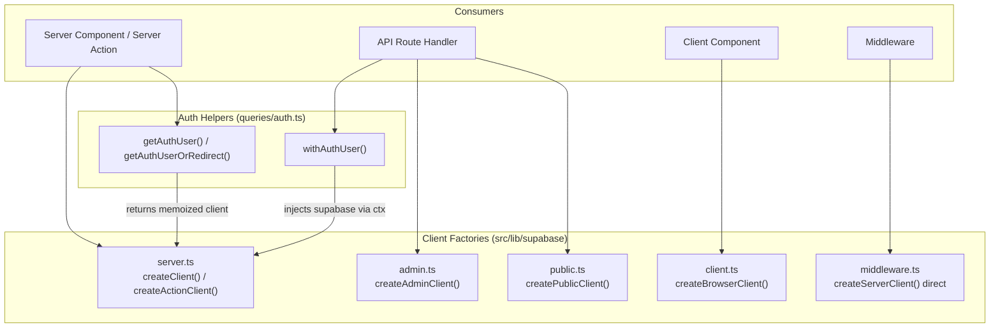
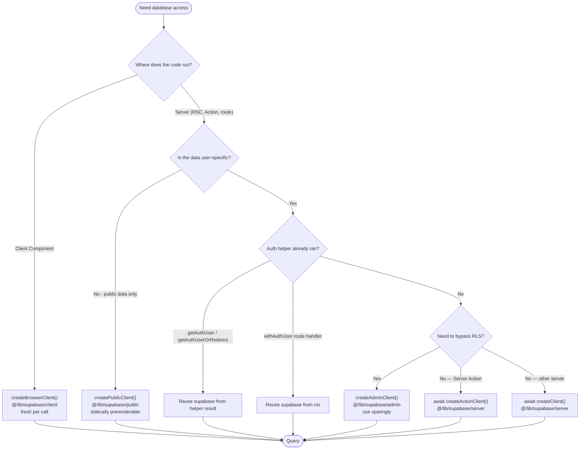

OZEAON exposes four distinct Supabase client factories — server, browser, admin, and public — each with a different authorization model, runtime target, and rendering consequence. The choice of factory is architectural: it determines whether a route renders statically or dynamically, and whether data access is scoped by row-level security.

## Overview

| Client | Factory | Use In | Runtime |
|--------|---------|--------|---------|
| Server | `createClient()` / `createActionClient()` from [`@/lib/supabase/server`](https://github.com/ozeaon/ozeaon-v2/blob/0a4f1a95824db87782f1221a4108019d174df3d9/src/lib/supabase/server.ts) | Server Components, API routes, Server Actions | Node / Worker, cookie-bound |
| Browser | `createBrowserClient()` from [`@/lib/supabase/client`](https://github.com/ozeaon/ozeaon-v2/blob/0a4f1a95824db87782f1221a4108019d174df3d9/src/lib/supabase/client.ts) | Client Components (`"use client"`) | Browser |
| Admin | `createAdminClient()` from [`@/lib/supabase/admin`](https://github.com/ozeaon/ozeaon-v2/blob/0a4f1a95824db87782f1221a4108019d174df3d9/src/lib/supabase/admin.ts) | API routes bypassing RLS | Server only |
| Public | `createPublicClient()` from [`@/lib/supabase/public`](https://github.com/ozeaon/ozeaon-v2/blob/0a4f1a95824db87782f1221a4108019d174df3d9/src/lib/supabase/public.ts) | Unauthenticated public queries | Server only |

Three design rules underpin the split:

1. **Typed schema binding.** The server, browser, and public factories all bind the generated `Database` type from `@/types/supabase`. The admin client does not; admin queries carry no compile-time table checking. `CLAUDE.md` says only `public.ts` binds `Database` — that is stale.
2. **`server-only` guard.** The admin and public modules begin with `import "server-only";`, turning accidental import from a client component into a build error rather than a credential leak.
3. **Cookie-based dynamism as a rendering signal.** `createClient()` calls `cookies()` internally, automatically opting the containing route into dynamic rendering. No `export const dynamic` directive is needed (and the project bans legacy cache directives).

Middleware builds its own client directly in [`src/lib/supabase/middleware.ts`](https://github.com/ozeaon/ozeaon-v2/blob/0a4f1a95824db87782f1221a4108019d174df3d9/src/lib/supabase/middleware.ts) using `createServerClient` from `@supabase/ssr` — it does not go through `server.ts`.

## Architecture



## Client Factory Implementations

### Public Client

`createPublicClient()` is for unauthenticated reads on routes that should prerender statically. It creates a fresh client per call, disables token refresh and session persistence, and binds `Database` with the `"public"` schema. Because it never calls `cookies()`, routes using it exclusively can be prerendered by Next.js. The env vars are asserted (`!`) rather than validated; a missing value surfaces as a Supabase request error rather than a thrown configuration error. Source: [`public.ts`](https://github.com/ozeaon/ozeaon-v2/blob/0a4f1a95824db87782f1221a4108019d174df3d9/src/lib/supabase/public.ts).

### Admin Client

`createAdminClient()` bypasses row-level security using the service-role key. It performs an explicit credential check before construction — the one factory that throws on misconfiguration:

```typescript
if (!supabaseUrl || !supabaseServiceKey) {
  throw new Error("Missing Supabase admin credentials");
}
```

Source: [`admin.ts`](https://github.com/ozeaon/ozeaon-v2/blob/0a4f1a95824db87782f1221a4108019d174df3d9/src/lib/supabase/admin.ts). The admin client does not bind `Database`, so admin queries carry no compile-time table checking. Use sparingly and only in API routes. Both `public.ts` and `admin.ts` use `process.env.*` directly; `server.ts` and `client.ts` use the validated `env.supabase.*` from `@/config`.

### Server Client

`server.ts` exports two cookie-aware clients, both bound to `Database` and using `env.supabase.*`:

- **`createClient()`** — for Server Components and route handlers. If `setAll` is called from a Server Component (where cookies cannot be set), the error is swallowed silently; middleware is expected to keep the session alive.
- **`createActionClient()`** — for Server Actions, where setting cookies is permitted. Does not swallow `setAll` errors, so cookie-write failures surface to the caller.

Both must be awaited because `cookies()` is async in this Next.js version. The `await` is also the dynamic-rendering signal: creating the server client opts the route into dynamic rendering.

### Browser Client

`createBrowserClient()` from `@/lib/supabase/client` is the client-side factory. It is synchronous and must be called fresh inside each component — hoisting it to a module-level singleton would share mutable auth state across React renders. `CLAUDE.md` names this factory `createClient()` — that is stale; the exported function is `createBrowserClient`.

```typescript
"use client";
import { createBrowserClient } from "@/lib/supabase/client";

const supabase = createBrowserClient(); // fresh per call, never module-level
```

## Client Selection Flow



## Client Reuse Rules

The most consequential pattern is *not creating* a server client when one has already been created for the request.

### Rule 1 — Reuse the Client Returned by Auth Helpers

`getAuthUser()` and `getAuthUserOrRedirect()` live in [`src/lib/supabase/queries/auth.ts`](https://github.com/ozeaon/ozeaon-v2/blob/0a4f1a95824db87782f1221a4108019d174df3d9/src/lib/supabase/queries/auth.ts) and are wrapped in React `cache()`, so they return the same client instance on every call within a request. Reuse it:

```typescript
// Wrong — two clients, two cookie reads
const supabase = await createClient();
const { user } = await getAuthUserOrRedirect();

// Correct — one client
const { user, supabase } = await getAuthUserOrRedirect();
```

### Rule 2 — Reuse the Client Injected by `withAuthUser`

Route handlers wrapped in `withAuthUser` receive `{ user, supabase }` through `ctx`. Never call `createClient()` inside a `withAuthUser` handler:

```typescript
// Correct
export const POST = withAuthUser(async (req, { user, supabase }) => {
  // use supabase from ctx, not a new createClient()
});
```

### Rule 3 — Never Cache a Browser Client Globally

The browser client is the exception to the reuse rule: call `createBrowserClient()` fresh per component render. A module-level singleton shares mutable auth state across renders.

## Query Modules

The query modules under `src/lib/supabase/queries/` apply a consistent pattern: each function accepts the client as a parameter rather than creating one internally, so the same query runs on `createPublicClient()` for published reads (where the result can be cached) and on `createClient()` for draft or user-scoped reads (where RLS must scope the rows). See [Server Actions & Queries](../../api-layer/server-actions-and-queries/) for detail on that layer.

## ESLint Enforcement

A custom ESLint rule fires for any file matching `src/app/**/(private)/**/*.tsx` that imports `@/lib/supabase/public`, with the message "Use createClient() in private routes." ([eslint.config.mjs](https://github.com/ozeaon/ozeaon-v2/blob/0a4f1a95824db87782f1221a4108019d174df3d9/eslint.config.mjs)). The rule is path-based — it detects imports of the wrong module in private route files, not whether user-specific state is rendered.

A second rule in [`eslint.rules.cache.mjs`](https://github.com/ozeaon/ozeaon-v2/blob/0a4f1a95824db87782f1221a4108019d174df3d9/eslint.rules.cache.mjs) warns against legacy cache directives, noting the same effect is achievable with `await createClient()`.

## Failure Modes & Edge Cases

| Failure | Trigger | Result |
|---------|---------|--------|
| Missing admin credentials | `SUPABASE_SERVICE_ROLE_KEY` or URL unset at call time | Throws `Error("Missing Supabase admin credentials")` |
| Missing public credentials | `NEXT_PUBLIC_SUPABASE_PUBLISHABLE_KEY` unset | `!` assertion passes; surfaces as a Supabase request error |
| Duplicate server client | `await createClient()` then an auth helper | Two clients, two `cookies()` reads; no crash, but redundant work |
| Server client inside `withAuthUser` | Calling `createClient()` in a `withAuthUser` handler | Redundant client, contradicts the wrapper contract |
| Singleton browser client | Module-level `createBrowserClient()` | Shared mutable auth state across renders |
| Admin or public module in client bundle | Importing `admin.ts` or `public.ts` from a client component | Build error from `import "server-only"` |
| Public client in private route | Importing `@/lib/supabase/public` in `src/app/**/(private)/**/*.tsx` | ESLint error; route silently loses the dynamic rendering signal |
| Public client mixed with user-specific state | Any component that reads public client but renders per-user output | No crash; the route prerenders with stale user data |

## Operational Notes

- Do not create clients speculatively. Each `await createClient()` performs cookie reads; React `cache()` in the auth helpers collapses N client needs into one, but only if callers reuse the returned client rather than constructing a second.
- The admin client bypasses RLS, meaning queries must carry correct filters in application code. This is why the source comment and project guidance both scope it to API routes and say "use sparingly."
- `createPublicClient()` enables static output. Routes using it exclusively can be prerendered, a build-time and edge-latency win on Cloudflare Workers.
- `server-only` failures happen at build time, not runtime — a mistaken import fails the build rather than shipping credentials to the browser.

## Extension Points

| Extension | How | Constraint |
|-----------|-----|------------|
| New stateless server client | Add a module under `src/lib/supabase/` following the `public.ts` shape | Begin with `import "server-only";`; disable session persistence |
| New authenticated server capability | Extend `server.ts` or auth helpers rather than a new factory | Must remain cookie-aware so dynamic rendering is preserved |
| New lint guardrail | Add a rule to `eslint.config.mjs` targeting the relevant file pattern | Preserve the existing `(private)`-route prohibition |

## Related Links

- Auth helper implementations: [`src/lib/supabase/queries/auth.ts`](https://github.com/ozeaon/ozeaon-v2/blob/0a4f1a95824db87782f1221a4108019d174df3d9/src/lib/supabase/queries/auth.ts)
- Middleware client: [`src/lib/supabase/middleware.ts`](https://github.com/ozeaon/ozeaon-v2/blob/0a4f1a95824db87782f1221a4108019d174df3d9/src/lib/supabase/middleware.ts)
- Generated database types: [`src/types/supabase.ts`](https://github.com/ozeaon/ozeaon-v2/blob/0a4f1a95824db87782f1221a4108019d174df3d9/src/types/supabase.ts)
- Query layer built on these clients: [Server Actions & Queries](../../api-layer/server-actions-and-queries/)
- Type system and derivation patterns: [Type System & Generated Types](../type-system/)
- SSR rendering decisions that follow from client choice: [SSR Rendering & Caching](../ssr-rendering-and-caching/)
- Middleware session handling: [Middleware & Sessions](../middleware-sessions/)
