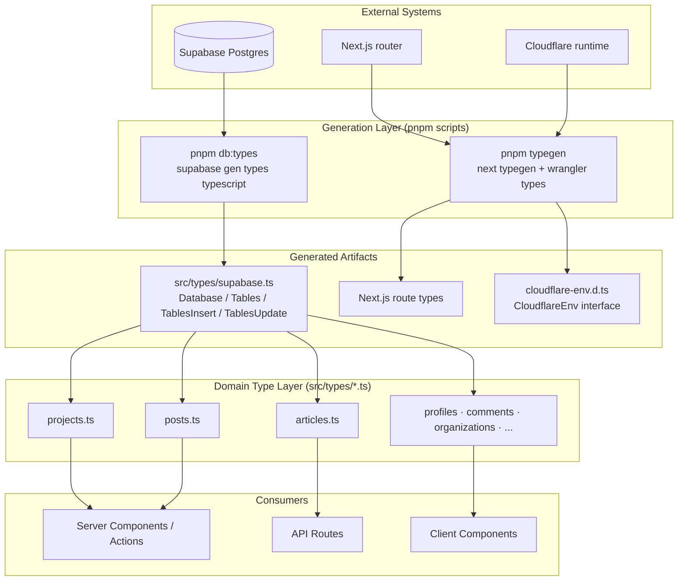
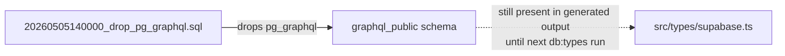
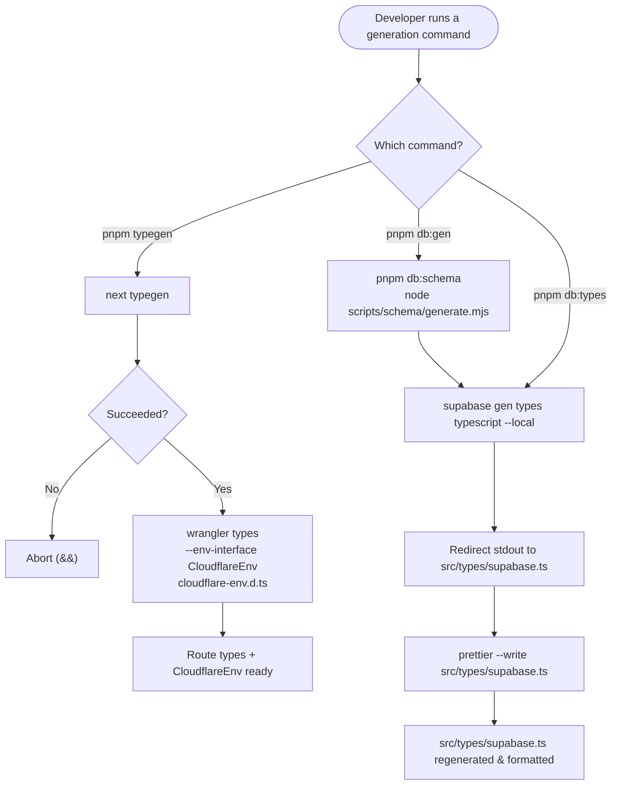
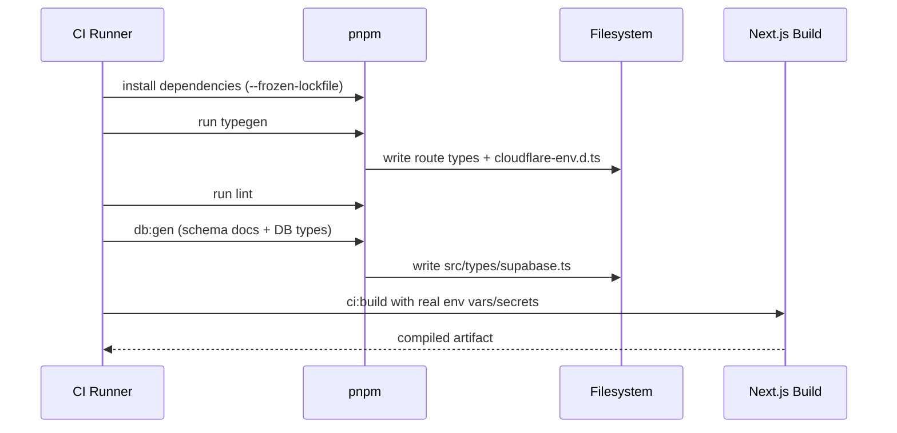
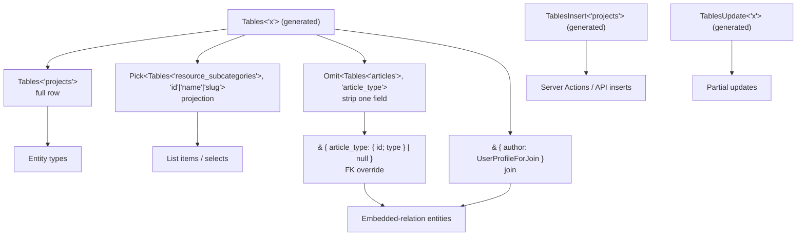
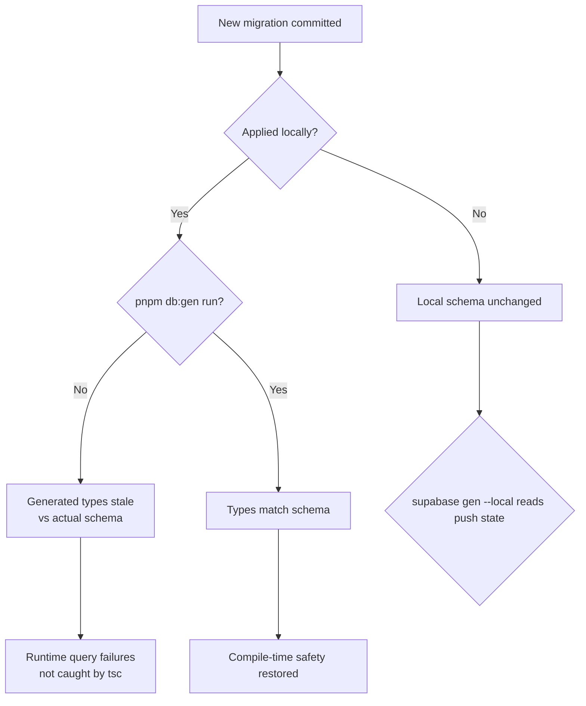

A layered TypeScript type strategy in which database schema types are machine-generated from Supabase, and all domain types are derived from those generated types through a documented set of TypeScript utility patterns rather than being hand-authored.

## Purpose and Scope

This page documents how types flow through the application: the generated artifacts (Supabase DB types, Next.js route types, and Cloudflare environment types), the generation commands that produce them, and the conventions that keep hand-written domain types derived from generated sources.

In scope:

- The `Database`, `Tables`, `TablesInsert`, and `TablesUpdate` generated type surface from `src/types/supabase.ts`.
- The generation pipeline (`pnpm typegen`, `pnpm db:gen`) and its constituent commands.
- The derivation patterns (`Tables<"x">`, `Pick`, `Omit`, `&` intersections) mandated by the project conventions.
- Where domain types live and how they are organized, with a per-file reference for the domain modules (`shared`, `articles`, `projects`, `posts`, `documents`, `images`, `memberships`).

Out of scope (see sibling pages):

- Supabase client selection and request-scoped memoization — see the Supabase client architecture page.
- Storage/R2 adapters and file-type validation — see the storage/r2 pages.
- Deployment and CI ordering — see the operations/deployment page.

## Overview

The application treats **generated types as the single source of truth** for anything shape-related. Rather than declaring entity interfaces by hand (which silently drifts from the database), the codebase generates a TypeScript description of the database schema and then composes domain types out of it using standard TypeScript utility types.

Three distinct families of generated types exist:

| Family | Generated by | Output | Purpose |
| --- | --- | --- | --- |
| Database schema types | `supabase gen types typescript --local` | `src/types/supabase.ts` | Row / Insert / Update shapes for every table, view, function, and enum |
| Next.js route types | `next typegen` | (Next.js managed) | Typed route params and route handler contracts |
| Cloudflare environment types | `wrangler types --env-interface CloudflareEnv` | `cloudflare-env.d.ts` | Typed bindings for the Cloudflare runtime environment |

The key design intent is **derivation over declaration**: a domain concept such as a `Project` is not written as an interface with five fields that may be wrong two migrations from now. It is written as `Tables<"projects">`, so a schema change immediately surfaces as a compile error at every consumption site.

The project convention is explicit on this point:

> Always derive from generated types; never hand-roll

## Architecture

The type system has three layers: a generation layer that produces artifacts from external systems, a raw generated layer containing those artifacts, and a domain layer where the artifacts are composed into application-meaningful types.



The separation matters: nothing in `sg_Domain` re-declares column types. Everything in `sg_Generated` is disposable — it can be regenerated at any time and the only files that change are generated ones, provided the domain layer only used derivation utilities.

## Generated Database Types

The primary generated artifact is `src/types/supabase.ts`. Its entry point is the `Database` type, which is a namespace-per-schema structure. Each schema (`public`, and the Supabase-managed `graphql_public`) exposes six parallel maps: `Tables`, `Views`, `Functions`, `Enums`, `CompositeTypes`, and — within `Tables` — per-table `Row`, `Insert`, `Update`, and `Relationships`.

```typescript
export type Json =
  | string
  | number
  | boolean
  | null
  | { [key: string]: Json | undefined }
  | Json[];

export type Database = {
  graphql_public: {
    Tables: {
      [_ in never]: never;
    };
    Views: {
      [_ in never]: never;
    };
    Functions: {
      graphql: {
        Args: {
          extensions?: Json;
          operationName?: string;
          query?: string;
          variables?: Json;
        };
        Returns: Json;
      };
    };
    Enums: {
      [_ in never]: never;
    };
    CompositeTypes: {
      [_ in never]: never;
    };
  };
  public: {
    Tables: {
      access_levels: {
        Row: {
          code: string;
          created_at: string;
          description: string | null;
          id: string;
          name: string;
          requires_embargo_date: boolean | null;
          requires_payment: boolean | null;
          sort_order: number | null;
        };
        Insert: {
          code: string;
          created_at?: string;
          description?: string | null;
          id?: string;
          name: string;
          requires_embargo_date?: boolean | null;
          requires_payment?: boolean | null;
          sort_order?: number | null;
        };
        Update: {
          code?: string;
          created_at?: string;
          description?: string | null;
          id?: string;
          name?: string;
          requires_embargo_date?: boolean | null;
          requires_payment?: boolean | null;
          sort_order?: number | null;
        };
        Relationships: [];
      };
      article_authors: {
        // ...
      };
    };
  };
};

> Source: [supabase.ts](https://github.com/ozeaon/ozeaon-v2/blob/0a4f1a95824db87782f1221a4108019d174df3d9/src/types/supabase.ts#L1-L70)

The `access_levels` table illustrates the three-shape pattern that repeats for every table: `Row` reflects the persisted shape (nullable columns are `T | null`), `Insert` makes columns with database defaults optional (`?`) and removes their nullability requirement, and `Update` makes every column optional. This is the mechanism that lets mutation code use `TablesInsert<"projects">` and get exactly the right optionality without any maintenance.

### The `graphql_public` namespace and the removed pg_graphql extension

The `graphql_public` schema is emitted by the Supabase generator as part of the standard Supabase schema set. Notably, the repository contains a migration that drops the pg_graphql extension:



This is a real edge case worth understanding: because `src/types/supabase.ts` is a **generated snapshot**, it can lag behind the actual schema. The `graphql_public` block existing in the generated file while the extension has been dropped by a migration is evidence that generated artifacts must be regenerated (`pnpm db:gen`) after migrations for the types to match reality. The project documents this expectation directly in its command table, describing `db:gen` as "run after migrations".

## The Generation Pipeline

Generation is driven by two pnpm scripts that address two different concerns: database-derived types and platform/runtime types.

```json
"typegen": "next typegen && wrangler types --env-interface CloudflareEnv cloudflare-env.d.ts",
"db:types": "supabase gen types typescript --local > src/types/supabase.ts && prettier --write src/types/supabase.ts",
"db:gen": "pnpm db:schema && pnpm db:types",
```

> Source: [package.json](https://github.com/ozeaon/ozeaon-v2/blob/0a4f1a95824db87782f1221a4108019d174df3d9/package.json#L18-L25)

### Command Anatomy

| Command | Composed of | Output |
| --- | --- | --- |
| `pnpm typegen` | `next typegen` then `wrangler types --env-interface CloudflareEnv cloudflare-env.d.ts` | Next.js route types + `cloudflare-env.d.ts` |
| `pnpm db:types` | `supabase gen types typescript --local` redirected into `src/types/supabase.ts`, then `prettier --write` | Formatted `src/types/supabase.ts` |
| `pnpm db:gen` | `pnpm db:schema` then `pnpm db:types` | Schema docs + TypeScript DB types |

Three design details stand out:

1. **Chained with `&&`.** Both `typegen` and `db:types` use `&&`, so a failure in the first step aborts the second. For `typegen`, this means a broken Next.js type generation prevents a stale `cloudflare-env.d.ts` from being written and masking the failure.

2. **Prettier is part of the pipeline.** `db:types` pipes generator output through `prettier --write` as an explicit second stage. Generated Supabase output is not Prettier-formatted by default; without this step, the file would fail `pnpm format` checks and would produce noisy diffs on every regeneration. Formatting the generated file at generation time keeps regeneration diffs limited to genuine schema changes.

3. **`--local` targets the local stack.** `supabase gen types typescript --local` reads the schema from the locally running Supabase instance rather than a remote project. This makes type generation deterministic and offline-capable — it depends on migrations applied locally, not on whatever state a remote database happens to be in.

The `typegen` command also specifies `--env-interface CloudflareEnv`, naming the generated interface and writing it to `cloudflare-env.d.ts` at the repository root. The paired environment flag (`-e`/`--env`) and the file location mean Cloudflare bindings are typed as `CloudflareEnv` wherever the runtime environment is referenced.

### Generation Command Flow



The entry-point diagram explains why generation is a prerequisite in CI/CD: the build consumes generated types, and the deploy documentation lists typegen as an explicit step before the build. A build that runs before generation would compile against stale or missing type artifacts.

### CI/CD Integration

The deployment documentation orders generation before the build:



Installation precedes generation because generation tooling (`supabase` CLI, `wrangler`, `next`) comes from dependencies. Lint runs after typegen because lint and type checks operate against the generated artifacts. The build runs last so it compiles against freshly generated types.

## The Domain Type Layer

All hand-written types live under `src/types/`, one file per domain concept:

`account.ts`, `articles.ts`, `comments.ts`, `documents.ts`, `images.ts`, `memberships.ts`, `moderation.ts`, `notifications.ts`, `organizations.ts`, `posts.ts`, `profiles.ts`, `projects.ts`, `search.ts`, `shared.ts`, plus the generated `supabase.ts` and the ambient `natural.d.ts`, with `index.ts` acting as the barrel.

The convention is that these files live at `src/types/` and are never declared inside component files:

> Domain types live in `src/types/`. Never define them inside component files.

This placement rule exists so that a backend change to a table's shape has a single, discoverable place to be reflected on the frontend, and so that shared types cannot accidentally become component-private.

### Derivation Patterns

Four composition patterns are used to build domain types from generated primitives:

```typescript
type Project = Tables<"projects">; // full row
type Slug = Pick<Tables<"resource_subcategories">, "id" | "name" | "slug">; // projection
type Comment = Tables<"comments"> & { author: UserProfileForJoin }; // join
type Article = Omit<Tables<"articles">, "article_type"> & {
  // FK override
  article_type: { id: number; type: string } | null;
};
const insert: TablesInsert<"projects"> = { title, slug, created_by: user.id }; // mutation
```

> Source: [CLAUDE.md](https://github.com/ozeaon/ozeaon-v2/blob/0a4f1a95824db87782f1221a4108019d174df3d9/CLAUDE.md#L164-L177)

| Pattern | Utility | Why it is used |
| --- | --- | --- |
| Full row | `Tables<"projects">` | Entity identity — the canonical shape with zero mapping code |
| Projection | `Pick<Tables<...>, "id" \| "name" \| "slug">` | Lists, dropdowns, and nested summaries need only a subset; `Pick` guarantees the subset stays valid |
| Join | `Tables<"comments"> & { author: UserProfileForJoin }` | PostgREST joins return extra embedded objects; intersection composes them without redeclaring base columns |
| FK override | `Omit<Tables<"articles">, "article_type"> & { article_type: ... }` | When a query embeds a related row, the column's raw scalar type is wrong; `Omit` + re-add replaces exactly one field |
| Mutation | `TablesInsert<"projects">` | Insert shapes carry correct optionality from the generated `Insert` variant |

The **FK override** pattern is the most instructive. A foreign-key column in the generated `Row` type is a scalar (an id). But when a query embeds the related row (`select("*, article_type(*)")`), the runtime value is an object, not a scalar. `Omit<>` removes the scalar field and the intersection adds the object shape. This is the boundary where generated types are *correct for the table* but *incorrect for the query*, and the codebase resolves it explicitly rather than with `as` casts.

### Type Utility Diagram



The diagram shows that two leaves of the generated type tree — `Tables` and `TablesInsert`/`TablesUpdate` — feed five distinct consumption patterns, and none of the intermediate nodes are hand-declared column lists.

### Import Convention

Generated types are imported through an explicit type-only import from `@/types/supabase`:

```typescript
import type { Tables, TablesInsert, TablesUpdate } from "@/types/supabase";
```

> Source: [CLAUDE.md](https://github.com/ozeaon/ozeaon-v2/blob/0a4f1a95824db87782f1221a4108019d174df3d9/CLAUDE.md#L150-L157)

The `import type` form is used deliberately: it is erased at compile time, so importing entity shapes never pulls `supabase.ts` (a 6000+ line generated file) into the runtime module graph.

### Domain File Reference

The domain files listed above are not all alike: some are pure `Pick`/`Omit` compositions over generated tables, some describe query results with embedded relations, and a few are hand-rolled form or result models. This section documents each file's exports and how each relates to the generated layer.

#### `src/types/shared.ts`

Cross-domain primitives imported by nearly every other domain file. Almost everything is a `Pick` projection over a generated table, with embedded images joined on via intersection (the join pattern above).

| Type | Derivation | Purpose |
| --- | --- | --- |
| `Image` | `Pick<Tables<"images">, "id" \| "path" \| "alt"> & { mime_type?; title? }` | The minimal image shape used everywhere an embedded image appears; the optional extras support partial selects. The most-referenced type in the domain layer. |
| `UserProfileForJoin` | `Pick<Tables<"user_profiles">, 5 fields> & { avatar_image: Image \| null }` | Author/avatar join shape. |
| `OrganizationForJoin` / `ProjectForJoin` | `Pick` of the respective table `& { logo_image?: Image \| null }` | Embedded org/project summaries. |
| `OrgBylineData` / `AuthorBylineData` | `Pick` of name/slug/verified and username/display_name | Minimum shapes for rendering bylines; the `*ForJoin` types are supersets assignable to them. |
| `UserProfileSummary`, `UserCardData`, `UserGridCardData` | `Pick`-based profile variants | `UserCardData` deliberately widens `username` and `role_descriptor` to nullable so unlinked team members render next to real profiles; `UserGridCardData` restores `username` via `Omit` + `Pick` and adds `location`/`created_at`. |
| `Currency`, `Subcategory`, `CategoryWithSubcategories`, `SDG` | `Pick` projections (+ one nested array) | Reference data for form pickers and badges. |
| `AuthUser` | `User & { platform_meta?: UserProfile \| null }` | The only type built on `@supabase/auth-js`'s `User` rather than a table. |
| `SearchResult<TMeta>` / `AttachSearchResult` | hand-rolled generic + specialization | Normalised rows returned by the entity search routes (`/api/{users,projects,organizations,articles}/search`); `AttachSearchResult` adds `avatar_url`, `description`, `type` for the composer attach modal. |
| `DocumentRecord` | `Pick<Tables<"documents">, 7 fields> & Pick<Tables<"project_documents">, "attachment_type">` | A document plus its attachment kind, across both tables. |
| `DocumentType` | `Pick<Tables<"document_types">, "label" \| "extension" \| "mime_type">` | Distinct from TipTap's `DocumentType`; `types/articles.ts` aliases the latter as `TipTapDocumentType` to keep them apart. |
| `UserSettings` | fully hand-rolled object type | Settings-panel shape including `privacy: ContentVisibility` — imported from `@/config`, not from a generated table. Currently unused elsewhere. |
| `AuthorData` | alias of `UserProfileForJoin` | Exported but unconsumed. |

> Source: [shared.ts](https://github.com/ozeaon/ozeaon-v2/blob/0a4f1a95824db87782f1221a4108019d174df3d9/src/types/shared.ts)

#### `src/types/documents.ts`

The result-type trio for the shared document upload pipeline (`lib/documents/upload.ts`, consumed by `app/api/projects/[id]/documents/route.ts`):

- `UploadDocumentParams` — `{ supabase, uploaderId, file, storageKeyPrefix, title? }`, with `uploaderId` and `title` typed through `Tables<"documents">` index access so the params track the table.
- `UploadDocumentSuccess` — `{ data: Tables<"documents">; error: null }`.
- `UploadDocumentFailure` — `{ data: null; error: string; status: number }`.
- `UploadDocumentResult` — the union of the two. It is a discriminated union with no named discriminant field: narrowing works because `data` is the full row on success and literally `null` on failure.

> Source: [documents.ts](https://github.com/ozeaon/ozeaon-v2/blob/0a4f1a95824db87782f1221a4108019d174df3d9/src/types/documents.ts)

#### `src/types/images.ts`

The same trio pattern for the image upload pipeline, extended with moderation inputs:

- `UploadImageParams` — adds `uploadType`, `maxSize`, `account` (`ModerationAttemptAccount`), `surface` (`ModerationSurface`), optional `width`/`height`, and an `onMark` performance callback to the document param set. `userId` is `NonNullable<Tables<"images">["uploader_id"]>` — the column is nullable so images outlive deleted uploaders, but an upload always has an owner.
- `UploadImageSuccess` — `{ data: { imageId, imageUrl, path }; error: null }`.
- `UploadImageFailure` — `{ data: null; error: string; status: number; moderation?: ApiModerationIssue[] }` — the failure variant optionally carries moderation issues, which is how rejected uploads surface review state to the UI.
- `UploadImageResult` — the success/failure union.

Consumed by `lib/images/upload.ts` and every upload UI path: `hooks/use-post-images.ts`, `hooks/use-profile-image-upload.ts`, the Tiptap `ImageUploadNodeView`, `CoverImageEditor`, and `ProfileSettings`.

> Source: [images.ts](https://github.com/ozeaon/ozeaon-v2/blob/0a4f1a95824db87782f1221a4108019d174df3d9/src/types/images.ts)

#### `src/types/memberships.ts`

One type: `MembershipResult`, a discriminated union on the literal `type` field — `"organization"`, `"pod"`, or `"project"` — where `id` and `title` are indexed off the corresponding generated table (`Tables<"organizations">["id"]`, `Tables<"pods">["name"]`, `Tables<"projects">["title"]`, …). Because each variant indexes a different table, a renamed or re-typed column in any of the three tables breaks this file at compile time. Returned by `app/api/users/memberships/route.ts` to render a user's affiliation list.

> Source: [memberships.ts](https://github.com/ozeaon/ozeaon-v2/blob/0a4f1a95824db87782f1221a4108019d174df3d9/src/types/memberships.ts)

#### `src/types/posts.ts`

The feed-row model for posts and the attach previews shared with other domains:

| Type | Shape | Purpose |
| --- | --- | --- |
| `AttachedProjectItem` / `AttachedArticleItem` / `AttachedOrganizationItem` | `Pick` of the entity table + embedded `cover_image`/`author`/`stats` | The three entity kinds a post can attach, as rendered in attach pickers and post cards. |
| `PostStats` | hand-rolled `{ reaction_count?; comment_count?; repost_count? }` | Counters aggregate; used only by `PublicPost` within this file. |
| `AuthoringOrg` | `Pick<Tables<"organizations">, "id" \| "name" \| "slug" \| "verified"> & { logo_image: Pick<Tables<"images">, "path"> \| null }` | The org byline shape; consumed across domains (articles.ts, projects.ts and their cards). |
| `PublicPost` | `Tables<"posts"> & { images: { image; sort_order }[]; author; authoring_org; project; article; organization; reposted_post: PublicPost \| null; stats }` | The canonical feed-row shape: every embed of the posts feed query. |

`PublicPost` is **recursive** — `reposted_post: PublicPost | null` mirrors the PostgREST self-join that renders repost chains, and each of the three attach slots is nullable because a post attaches at most one entity. It is the most-consumed export of the domain layer after `Image` and `Project`.

> Source: [posts.ts](https://github.com/ozeaon/ozeaon-v2/blob/0a4f1a95824db87782f1221a4108019d174df3d9/src/types/posts.ts)

#### `src/types/projects.ts`

The largest read-side domain file after articles. Its types fall into four groups:

- **Statuses and full rows.** `Project = Tables<"projects">` and `ProjectStats = Tables<"project_stats">` are plain aliases. `ProjectStatus = (typeof PROJECT_STATUSES)[number]` is the one derivation in the domain layer taken from a **runtime constant** rather than a generated type: the union `"live" | "scheduled" | "unscheduled" | "archived" | "draft"` comes from `PROJECT_STATUSES` in `src/config/constants/projects.ts`. That import is a value import (not `import type`) used only in a `typeof` position — the exception to the type-only import convention above.
- **Table projections.** `ProjectType`, `ProjectSubcategory`, `ProjectTag`, `ProjectDocument`, `ProjectTeamMember`, `ProjectFAQ`, `SystemSectionType`, `ProjectSection` — `Pick`s over their tables with embedded `category`/`document`/`section_type`/`avatar` objects where the query joins one.
- **Card and list surfaces.** `ProjectListItem` (unused elsewhere), `DashboardProjectCardEntry`, `CondensedProjectCardData`, `FeaturedProject`, `ProjectWithAuthor` — progressively wider `Pick`-plus-joins shapes, each carrying `project_status?: { status: ProjectStatus } | null`.
- **Query-result composites.** `ProjectWithRelations` (the full public project page shape matching `getProjectBySlug`), `ProjectWithJoins` (the raw pre-transformation form query shape), and `FormSection` (the form editor's section shape, adding `is_custom`/`image_url` over two table `Pick`s).

`project_status` deserves note: it is typed `{ status: ProjectStatus } | null` because it comes from the `v_project_status` **view**, not a table column — the object nesting is the embedded-view shape, following the same FK-override logic as column embeds.

> Source: [projects.ts](https://github.com/ozeaon/ozeaon-v2/blob/0a4f1a95824db87782f1221a4108019d174df3d9/src/types/projects.ts)

#### `src/types/articles.ts`

The largest domain file (~460 lines), mixing derived query shapes, hand-rolled form models, and string enums:

- **Enums.** `GeographicScope` (`global`/`regional`/`local`), `ArticleTypeCode` (the eight article type codes that mirror `ARTICLE_TYPE_REQUIRED_FIELDS` keys in `src/config/constants/articles.ts`), and `AccessLevelCode` (six access codes, marked `TODO useful post P0` and currently unconsumed). These are the only runtime `enum` values in the domain layer.
- **Derived query shapes.** Internal aliases such as `ArticleCardEntry` (feed card), `ArticleWithRelations` (FK-override of `article_type` to `{ id; name; slug; description; code }` plus embedded `access_level`, `license_type`, `subcategories`, `sdgs`, images and project), `ArticleWithAuthors`, and `ArticleComplete` compose the full article page. Exported projections include `ArticleType`, `ArticleAccessLevel`, `ArticleLicenseType`, `ArticleFundingSource`, `ArticleSubcategory`, `ArticleTag`, `ArticleImage`, `ArticleDocument`, `ArticleAttachment` (+ `AttachmentType` = `"annex" | "image" | "pdf"`, the same three kinds as `ATTACHMENT_STORAGE_PREFIX`), `CondensedArticleCardData`, `DashboardArticleCardEntry`, `ArticleAttributionData` (the fields `generateAttributionText` needs for citations), `ArticlePublishedStatus` (`"all" | "published" | "draft"`), and `ArticleViewer` (server-resolved identity/role context used to gate viewer actions).
- **Form models.** `ArticleFormSelect extends Tables<"articles">` with embedded relation shapes (the raw form query result); `ArticleFormTransformed` reshapes it via `Omit` for form consumption; `ArticleFormData` is a fully hand-rolled form model — the one large type that does not derive from a table — and `ArticleFormMeta`/`ArticleContentData` (TipTap JSON + HTML) support the editor. `ValidationError`/`PublishValidationResult` exist for a planned publish validator and are currently unused.
- **Hand-rolled interfaces duplicating generated shapes.** `IndigenousMacroRegion` re-declares the `indigenous_macro_regions` row field-by-field even though the table exists in the generated types — a candidate for `Tables<"indigenous_macro_regions">`. `ArticleAuthor extends Tables<"article_authors">` also re-lists every column, which is redundant but pins the expected fields explicitly.

> Source: [articles.ts](https://github.com/ozeaon/ozeaon-v2/blob/0a4f1a95824db87782f1221a4108019d174df3d9/src/types/articles.ts)

All of these files are re-exported through the `src/types/index.ts` barrel, so most consumers import from `@/types` rather than from individual files.

## Usage Examples

### Full Row and Mutation Types

The two most common derivations are the full row type and its insert counterpart. Note how `TablesInsert` produces an insert object whose `id` and `created_at` are optional (from the generated `Insert` variant) while `title` and `slug` are required.

```typescript
type Project = Tables<"projects">; // full row
// ...
const insert: TablesInsert<"projects"> = { title, slug, created_by: user.id }; // mutation
```

> Source: [CLAUDE.md](https://github.com/ozeaon/ozeaon-v2/blob/0a4f1a95824db87782f1221a4108019d174df3d9/CLAUDE.md#L164-L177)

This works because the generator emits an `Insert` shape per table that mirrors `Row` but with `?` on defaulted columns — exactly as `access_levels.Insert` shows `created_at?`, `id?`, `sort_order?` optional while `code` and `name` stay required.

### Projection for Narrow Surfaces

When a UI element needs only three fields, `Pick` expresses that intent while remaining tied to the source of truth:

```typescript
type Slug = Pick<Tables<"resource_subcategories">, "id" | "name" | "slug">; // projection
```

> Source: [CLAUDE.md](https://github.com/ozeaon/ozeaon-v2/blob/0a4f1a95824db87782f1221a4108019d174df3d9/CLAUDE.md#L170)

A hand-written `{ id: string; name: string; slug: string }` would compile today and silently lie the moment a column is renamed. `Pick` cannot lie: if `resource_subcategories.slug` is renamed, this line breaks at compile time.

### Join and FK Override

PostgREST's embedded selects return nested objects. These two patterns compose the embedded shapes onto the base row:

```typescript
type Comment = Tables<"comments"> & { author: UserProfileForJoin }; // join
type Article = Omit<Tables<"articles">, "article_type"> & {
  // FK override
  article_type: { id: number; type: string } | null;
};
```

> Source: [CLAUDE.md](https://github.com/ozeaon/ozeaon-v2/blob/0a4f1a95824db87782f1221a4108019d174df3d9/CLAUDE.md#L171-L175)

The `Comment` join appends a non-column field (`author`). The `Article` FK override *replaces* a column that exists in the table but arrives as an object at runtime. Crucially, both use the `| null` suffix to model relation-embedding nullability, which the generated scalar-typed column does not express.

## Configuration Options

The type system is configured through npm scripts and generator flags rather than a dedicated config file. The relevant options are:

| Option | Type | Value | Description |
| --- | --- | --- | --- |
| `db:types` target | file path | `src/types/supabase.ts` | Destination of generated DB types (via shell redirect) |
| `db:types` source | flag | `--local` | Read schema from the local Supabase instance, not a remote project |
| `typegen` step 1 | command | `next typegen` | Emits Next.js route types |
| `typegen` step 2 | command | `wrangler types` | Emits Cloudflare binding types |
| `--env-interface` | string | `CloudflareEnv` | Name of the generated Cloudflare environment interface |
| `typegen` output | file path | `cloudflare-env.d.ts` | Destination of the Cloudflare env types |
| Post-processing | command | `prettier --write src/types/supabase.ts` | Formats the generated file so regeneration diffs stay clean |

> Source: [package.json](https://github.com/ozeaon/ozeaon-v2/blob/0a4f1a95824db87782f1221a4108019d174df3d9/package.json#L18-L25)

### Command Reference

| Command | Description |
| --- | --- |
| `pnpm typegen` | Generate Next.js route types + Cloudflare env types |
| `pnpm db:gen` | Generate Supabase DB schema types (run after migrations) |
| `pnpm db:types` | Generate only DB types (`supabase gen types typescript --local` + Prettier) |
| `pnpm db:schema` | Generate schema docs via `node scripts/schema/generate.mjs` |
| `pnpm check` | Type check (`tsc --noEmit`) |
| `pnpm format` | Format with Prettier |

> Source: [CLAUDE.md](https://github.com/ozeaon/ozeaon-v2/blob/0a4f1a95824db87782f1221a4108019d174df3d9/CLAUDE.md#L61-L79)

## API Reference

The type system exposes no runtime functions; its "API" is the set of types and scripts consumed across the codebase.

### `Tables<T>`

Extracts the full row type for a table named `T` from the `public` schema of the generated `Database` type.

- **Type parameter** `T` (string literal): the table name, e.g. `"projects"`, `"articles"`, `"comments"`.
- **Returns**: the table's `Row` shape, with nullable columns as `T | null`.
- **Example**: `type Project = Tables<"projects">;`

### `TablesInsert<T>`

Extracts the insert shape for table `T` — the `Row` shape with defaulted columns made optional, suitable for `insert()` payloads.

- **Type parameter** `T` (string literal): the table name.
- **Returns**: the table's `Insert` shape.
- **Example**: `const insert: TablesInsert<"projects"> = { title, slug, created_by: user.id };`

### `TablesUpdate<T>`

Extracts the update shape for table `T` — every column optional, suitable for `update()` payloads.

- **Type parameter** `T` (string literal): the table name.
- **Returns**: the table's `Update` shape.

### `Database`

The root generated namespace. Structure: `Database[<schema>]["Tables"][<table>]["Row" | "Insert" | "Update" | "Relationships"]`, plus `Views`, `Functions`, `Enums`, and `CompositeTypes` maps per schema.

- **Schemas present**: `public` and `graphql_public`.
- **Returns**: a namespace-shaped type object; never instantiated at runtime.

### `Json`

The generated JSON-compatible union used by JSON/JSONB columns and RPC arguments.

- **Shape**: `string | number | boolean | null | { [key: string]: Json | undefined } | Json[]`.
- **Example**: the `graphql` function's `Args.variables` field in `graphql_public` is typed `Json`.

### `CloudflareEnv`

The `wrangler types --env-interface` output, describing available Cloudflare bindings. Named via the `--env-interface CloudflareEnv` flag and written to `cloudflare-env.d.ts`.

> Source: [supabase.ts](https://github.com/ozeaon/ozeaon-v2/blob/0a4f1a95824db87782f1221a4108019d174df3d9/src/types/supabase.ts#L1-L34)

## Failure Modes, Edge Cases & Concurrency

### Stale generated types after migrations

The most consequential failure mode is drift between the database schema and `src/types/supabase.ts`. Because generation is a manual/CI step rather than something that runs on every build, a migration can land while the generated types remain at the previous schema. The project addresses this by convention: `db:gen` is documented as "(run after migrations)", and the deployment pipeline runs typegen as an explicit build step.

Direct evidence of this class of drift exists in the repository: a migration titled `20260505140000_drop_pg_graphql.sql` removes the `pg_graphql` extension, yet the `graphql_public` namespace — including its `graphql` function and `Json`-typed args — is still present in the generated `src/types/supabase.ts`. Until `pnpm db:gen` is re-run against the local schema, consumers can still reference `graphql_public` structures that no longer exist server-side.



The risk is specifically that stale types produce **no compiler error** — `tsc` validates against the generated file, which is internally consistent. Runtime query failures against removed columns/functions are therefore the observable symptom, and only re-running generation closes the gap.

### Optionality mistakes on writes

`Insert` and `Update` shapes differ from `Row` in optionality. Using a `Row` type for a write forces the caller to supply defaulted columns unnecessarily; using `Insert` for reads permits treating an optional field as always present. The correct pairing (`Row`/`Tables<>` for reads, `Insert`/`Update` for writes) is a per-call-site discipline with no automated enforcement beyond types.

### FK view/embed mismatch

Embedded relations (PostgREST `select("*, relation(*)")`) return objects where the generated `Row` declares scalars. The FK-override pattern is the sanctioned fix. Casting instead (`as Article`) disables checking for the entire object, whereas `Omit<> & {}` narrows the divergence to one field.

### Why generated types are disposable

A design consequence worth internalizing: because generated files are pure artifacts, they should never be hand-edited. Any manual patch to `src/types/supabase.ts` is destroyed at the next `pnpm db:gen`. Structural corrections belong in migrations (which change the generated output) or in the domain files (which derive from it).

## Performance and Operational Notes

- **File size**: `src/types/supabase.ts` is over 6,000 lines (the excerpt above covers lines 1–70 of a file reported as "6170 more lines not shown"). It should always be imported with `import type` so it is erased at compile time and never enters a runtime bundle.
- **Prettier as a pipeline stage** keeps regeneration diffs reviewable. Without it, every schema change would reformat the entire file, burying real changes in whitespace noise and complicating code review of migrations.
- **Local-only generation** (`--local`) makes type generation independent of network state and remote database credentials, so it can run reliably in CI before secrets are injected. Note the ordering in the deploy docs: generation runs before the build step that receives "real environment vars/secrets".
- **`--frozen-lockfile` install precedes generation** in CI, ensuring the generator tool versions are exactly those locked in `pnpm-lock.yaml`, which keeps output byte-stable across runs.

> Source: [ops-deployment.md](https://github.com/ozeaon/ozeaon-v2/blob/0a4f1a95824db87782f1221a4108019d174df3d9/docs/ops-deployment.md#L82-L96)

## Extension Points

- **Adding a domain type file**: create a new module under `src/types/` (e.g. `widgets.ts`) and derive from `Tables<"widgets">`; export via `src/types/index.ts` if a barrel export is desired. Do not add interfaces inside component files.
- **Adding a `Pick`/`Omit` variant**: when a new UI surface needs a subset or FK-overridden shape, add a derived alias in the relevant `src/types/*.ts` file rather than an inline structural type at the call site, keeping derivations discoverable and reusable.
- **Extending generated output**: to add a new generated artifact family, add a script to `package.json` following the `db:types` pattern (generate → redirect to a target path → Post-process with `prettier --write`) and chain it into `db:gen` or `typegen` with `&&`.
- **New Cloudflare bindings**: bindings surface automatically through regenerating `cloudflare-env.d.ts` with `wrangler types --env-interface CloudflareEnv`; no hand-editing of `CloudflareEnv` is required.

## Related Links

- Supabase client selection and per-request client memoization — see the Supabase client architecture page.
- Storage/R2 adapters and file-type validation (which consume `IMAGE_CONFIG` and related types) — see the storage architecture pages.
- Deployment and CI ordering — see [ops-deployment.md](https://github.com/ozeaon/ozeaon-v2/blob/0a4f1a95824db87782f1221a4108019d174df3d9/docs/ops-deployment.md).
- Command reference and project-wide conventions — see [CLAUDE.md](https://github.com/ozeaon/ozeaon-v2/blob/0a4f1a95824db87782f1221a4108019d174df3d9/CLAUDE.md#L61-L79) and [README.md](https://github.com/ozeaon/ozeaon-v2/blob/0a4f1a95824db87782f1221a4108019d174df3d9/README.md#L205-L251).
- Generated database types — [src/types/supabase.ts](https://github.com/ozeaon/ozeaon-v2/blob/0a4f1a95824db87782f1221a4108019d174df3d9/src/types/supabase.ts).
- Domain type modules — [src/types/shared.ts](https://github.com/ozeaon/ozeaon-v2/blob/0a4f1a95824db87782f1221a4108019d174df3d9/src/types/shared.ts) · [articles.ts](https://github.com/ozeaon/ozeaon-v2/blob/0a4f1a95824db87782f1221a4108019d174df3d9/src/types/articles.ts) · [projects.ts](https://github.com/ozeaon/ozeaon-v2/blob/0a4f1a95824db87782f1221a4108019d174df3d9/src/types/projects.ts) · [posts.ts](https://github.com/ozeaon/ozeaon-v2/blob/0a4f1a95824db87782f1221a4108019d174df3d9/src/types/posts.ts) · [documents.ts](https://github.com/ozeaon/ozeaon-v2/blob/0a4f1a95824db87782f1221a4108019d174df3d9/src/types/documents.ts) · [images.ts](https://github.com/ozeaon/ozeaon-v2/blob/0a4f1a95824db87782f1221a4108019d174df3d9/src/types/images.ts) · [memberships.ts](https://github.com/ozeaon/ozeaon-v2/blob/0a4f1a95824db87782f1221a4108019d174df3d9/src/types/memberships.ts), re-exported through the [src/types/index.ts](https://github.com/ozeaon/ozeaon-v2/blob/0a4f1a95824db87782f1221a4108019d174df3d9/src/types/index.ts) barrel.
- Generated Cloudflare environment interface — [cloudflare-env.d.ts](https://github.com/ozeaon/ozeaon-v2/blob/0a4f1a95824db87782f1221a4108019d174df3d9/cloudflare-env.d.ts).
- Supabase type generation script — [package.json](https://github.com/ozeaon/ozeaon-v2/blob/0a4f1a95824db87782f1221a4108019d174df3d9/package.json#L18-L25).
