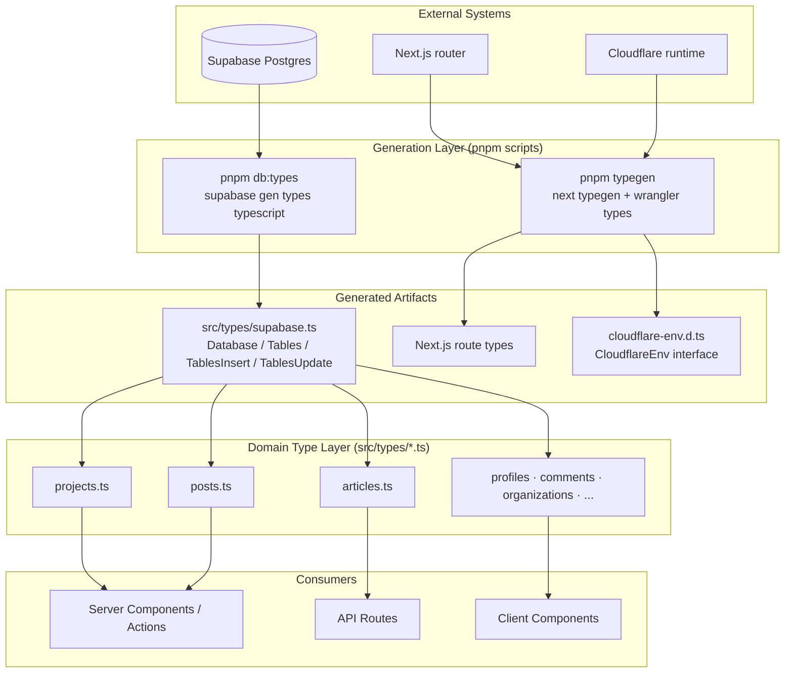
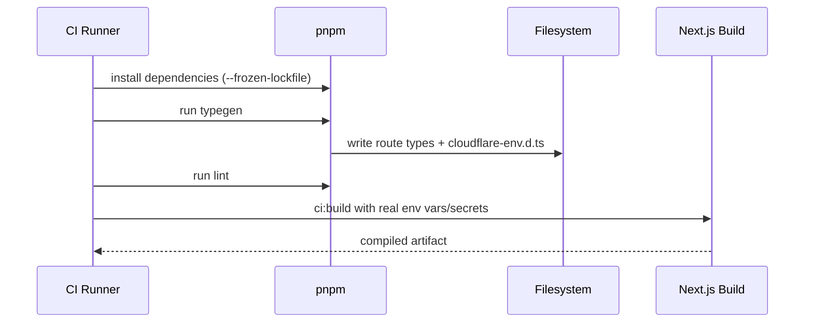
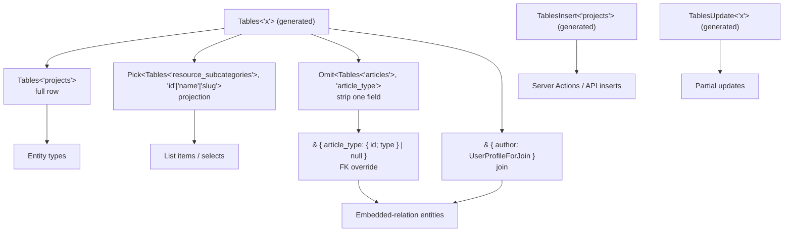

A layered TypeScript type strategy in which database schema types are machine-generated from Supabase, and all domain types are derived from those generated types through a documented set of TypeScript utility patterns rather than being hand-authored.

## Overview

The application treats **generated types as the single source of truth** for anything shape-related. Rather than declaring entity interfaces by hand, the codebase generates a TypeScript description of the database schema and then composes domain types out of it using standard TypeScript utility types.

Three families of generated types exist:

| Family | Generated by | Output | Purpose |
| --- | --- | --- | --- |
| Database schema types | `supabase gen types typescript --local` | [`src/types/supabase.ts`](https://github.com/ozeaon/ozeaon-v2/blob/0a4f1a95824db87782f1221a4108019d174df3d9/src/types/supabase.ts) | Row / Insert / Update shapes for every table, view, function, and enum |
| Next.js route types | `next typegen` | (Next.js managed) | Typed route params and route handler contracts |
| Cloudflare environment types | `wrangler types --env-interface CloudflareEnv` | `cloudflare-env.d.ts` | Typed bindings for the Cloudflare runtime environment |

`src/types/supabase.ts` is committed to the repository and regenerated locally by developers after migrations. CI does not run `db:gen`; it runs only `typegen` (route and Cloudflare types), which does not require a local Supabase instance.

## Architecture



## Generated Database Types

The primary generated artifact is [`src/types/supabase.ts`](https://github.com/ozeaon/ozeaon-v2/blob/0a4f1a95824db87782f1221a4108019d174df3d9/src/types/supabase.ts), about 6,000 lines. Its entry point is the `Database` type, a namespace-per-schema structure. Each schema (`public`, and the Supabase-managed `graphql_public`) exposes six parallel maps: `Tables`, `Views`, `Functions`, `Enums`, `CompositeTypes`, and — within `Tables` — per-table `Row`, `Insert`, `Update`, and `Relationships`.

The three-shape pattern repeats for every table: `Row` reflects the persisted shape (nullable columns are `T | null`), `Insert` makes columns with database defaults optional (`?`), and `Update` makes every column optional. This is the mechanism that lets mutation code use `TablesInsert<"projects">` and get exactly the right optionality without any maintenance.

The committed types can lag behind migrations. For example, a migration that drops the `pg_graphql` extension leaves the `graphql_public` namespace — including its `graphql` function — present in `supabase.ts` until `pnpm db:gen` is re-run against the local schema. Stale types produce no compiler error; `tsc` validates against the generated file, which is internally consistent. Runtime query failures against removed columns or functions are the observable symptom.

## The Generation Pipeline

Generation is driven by two pnpm scripts ([`package.json`](https://github.com/ozeaon/ozeaon-v2/blob/0a4f1a95824db87782f1221a4108019d174df3d9/package.json)):

| Command | Composed of | Output |
| --- | --- | --- |
| `pnpm typegen` | `next typegen` then `wrangler types --env-interface CloudflareEnv cloudflare-env.d.ts` | Next.js route types + `cloudflare-env.d.ts` |
| `pnpm db:types` | `supabase gen types typescript --local` redirected into `src/types/supabase.ts`, then `prettier --write` | Formatted `src/types/supabase.ts` |
| `pnpm db:gen` | `pnpm db:schema` then `pnpm db:types` | Schema docs + TypeScript DB types |

Three design details stand out:

1. **Chained with `&&`.** A failure in the first step aborts the second, preventing stale artifacts from masking the failure.
2. **Prettier is part of the pipeline.** `db:types` pipes generator output through `prettier --write`. Without this step, regeneration diffs would include whitespace noise, burying real schema changes in code review.
3. **`--local` targets the local stack.** `supabase gen types typescript --local` reads the schema from the locally running Supabase instance, making type generation deterministic and offline-capable.

### CI/CD Integration

CI runs install → typegen → lint → build. `db:gen` is a developer step, not a CI step; `src/types/supabase.ts` is committed.



Installation precedes generation because generation tooling (`wrangler`, `next`) comes from dependencies. Lint runs after `typegen` because lint and type checks operate against the generated artifacts.

## The Domain Type Layer

All hand-written types live under [`src/types/`](https://github.com/ozeaon/ozeaon-v2/blob/0a4f1a95824db87782f1221a4108019d174df3d9/src/types), one file per domain concept, re-exported through the [`src/types/index.ts`](https://github.com/ozeaon/ozeaon-v2/blob/0a4f1a95824db87782f1221a4108019d174df3d9/src/types/index.ts) barrel. Domain types are never declared inside component files.

### Derivation Patterns

Four composition patterns build domain types from generated primitives:

```typescript
type Project = Tables<"projects">; // full row
type Slug = Pick<Tables<"resource_subcategories">, "id" | "name" | "slug">; // projection
type Comment = Tables<"post_comments"> & { author: UserProfileForJoin }; // join
type Article = Omit<Tables<"articles">, "article_type"> & {
  article_type: { id: number; type: string } | null; // FK override
};
const insert: TablesInsert<"projects"> = { title, slug, created_by: user.id }; // mutation
```

| Pattern | Utility | Why it is used |
| --- | --- | --- |
| Full row | `Tables<"projects">` | Entity identity — canonical shape with zero mapping code |
| Projection | `Pick<Tables<...>, "id" \| "name" \| "slug">` | Lists and nested summaries need only a subset; `Pick` guarantees the subset stays valid |
| Join | `Tables<"post_comments"> & { author: UserProfileForJoin }` | PostgREST joins return extra embedded objects; intersection composes them without redeclaring base columns |
| FK override | `Omit<Tables<"articles">, "article_type"> & { article_type: ... }` | A FK column is a scalar in `Row`, but an embedded object at runtime; `Omit` + re-add replaces exactly one field |
| Mutation | `TablesInsert<"projects">` | Insert shapes carry correct optionality from the generated `Insert` variant |

The FK override pattern is the most instructive: a foreign-key column in the generated `Row` type is a scalar (an id), but when a query embeds the related row, the runtime value is an object. `Omit<>` removes the scalar field and the intersection adds the object shape. This resolves the mismatch explicitly rather than with `as` casts.

### Type Utility Diagram



### Import Convention

Generated types are always imported with `import type` so the ~6,000-line `supabase.ts` is erased at compile time and never enters a runtime bundle:

```typescript
import type { Tables, TablesInsert, TablesUpdate } from "@/types/supabase";
```

### Domain File Reference

Most domain files are pure `Pick`/`Omit` compositions over generated tables. A few hold hand-rolled form or result models that cannot be derived: `ArticleFormData` (the article editor state, too far from any table shape to derive), and `SearchResult<TMeta>` / `AttachSearchResult` (normalised rows returned by the entity search routes). Two files contain hand-rolled duplicates of existing generated shapes — candidates for cleanup: `IndigenousMacroRegion` redeclares the `indigenous_macro_regions` row field-by-field even though `Tables<"indigenous_macro_regions">` exists, and `ArticleAuthor extends Tables<"article_authors">` re-lists every column redundantly.

`MembershipResult` in [`src/types/memberships.ts`](https://github.com/ozeaon/ozeaon-v2/blob/0a4f1a95824db87782f1221a4108019d174df3d9/src/types/memberships.ts) is a discriminated union on the literal `type` field with variants `"organization"`, `"pod"`, and `"project"`. The `"pod"` variant exists for the placeholder table — pods are a roadmap feature with no UI.

## Failure Modes & Edge Cases

**Stale generated types after migrations.** Because `src/types/supabase.ts` is committed and regenerated locally, a migration can land while the committed types remain at the previous schema. The project addresses this by convention: `db:gen` is documented as "(run after migrations)". Stale types produce no compiler error — `tsc` validates against the generated file, which is internally consistent. Runtime query failures against removed columns or functions are the observable symptom. The `graphql_public` namespace in the committed types is a live example: a migration drops `pg_graphql`, but the namespace persists until the next `db:gen`.

**Optionality mistakes on writes.** Using a `Row` type for a write forces the caller to supply defaulted columns unnecessarily; using `Insert` for reads permits treating an optional field as always present. The correct pairing (`Tables<>` for reads, `TablesInsert`/`TablesUpdate` for writes) is a per-call-site discipline with no automated enforcement beyond types.

**FK view/embed mismatch.** Embedded relations return objects where the generated `Row` declares scalars. The FK-override pattern (`Omit<> & {}`) is the sanctioned fix; casting with `as` disables checking for the entire object.

**Generated types are disposable.** Never hand-edit `src/types/supabase.ts`. Any manual patch is destroyed at the next `pnpm db:gen`. Structural corrections belong in migrations (which change the generated output) or in the domain files (which derive from it).

## Operational Notes

- `src/types/supabase.ts` is about 6,000 lines and should always be imported with `import type` so it is erased at compile time and never enters a runtime bundle.
- Prettier as a pipeline stage keeps regeneration diffs reviewable. Without it, every schema change would reformat the entire file, burying real changes in whitespace noise.
- `pnpm typegen` does not require a local Supabase instance, so it runs in CI without database credentials. `pnpm db:gen` requires a running local Supabase and is a developer workflow.

## Extension Points

- **Adding a domain type file:** create a new module under `src/types/` (e.g. `widgets.ts`) and derive from `Tables<"widgets">`; export via `src/types/index.ts`. Do not add types inside component files.
- **Adding a `Pick`/`Omit` variant:** add a derived alias in the relevant `src/types/*.ts` file rather than an inline structural type at the call site, keeping derivations discoverable and reusable.
- **New Cloudflare bindings:** regenerate `cloudflare-env.d.ts` with `wrangler types --env-interface CloudflareEnv`; no hand-editing of `CloudflareEnv` is required.

## Related Links

- Supabase client selection and per-request client memoization: [Supabase Client Patterns](../supabase-client-patterns/)
- Storage/R2 adapters and file-type validation: [Storage & R2](../../moderation-and-storage/storage-r2/)
- Scripts and commands reference: [Technology Stack](../../overview/technology-stack/)
- Generated database types: [`src/types/supabase.ts`](https://github.com/ozeaon/ozeaon-v2/blob/0a4f1a95824db87782f1221a4108019d174df3d9/src/types/supabase.ts)
- Domain type modules: [`src/types/`](https://github.com/ozeaon/ozeaon-v2/blob/0a4f1a95824db87782f1221a4108019d174df3d9/src/types) — `shared.ts`, `articles.ts`, `projects.ts`, `posts.ts`, `documents.ts`, `images.ts`, `memberships.ts`
- Generated Cloudflare environment interface: [`cloudflare-env.d.ts`](https://github.com/ozeaon/ozeaon-v2/blob/0a4f1a95824db87782f1221a4108019d174df3d9/cloudflare-env.d.ts)
