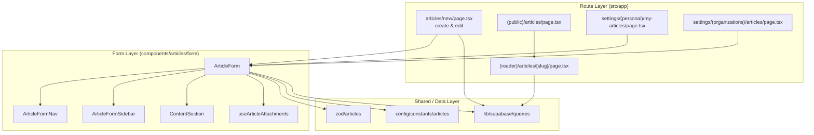
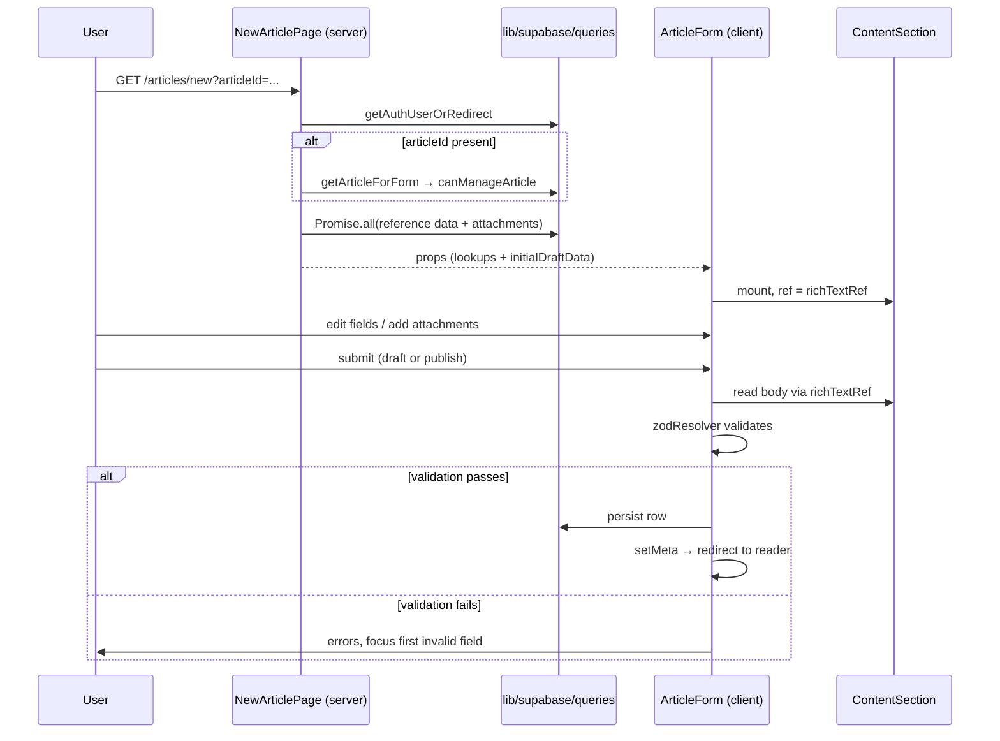
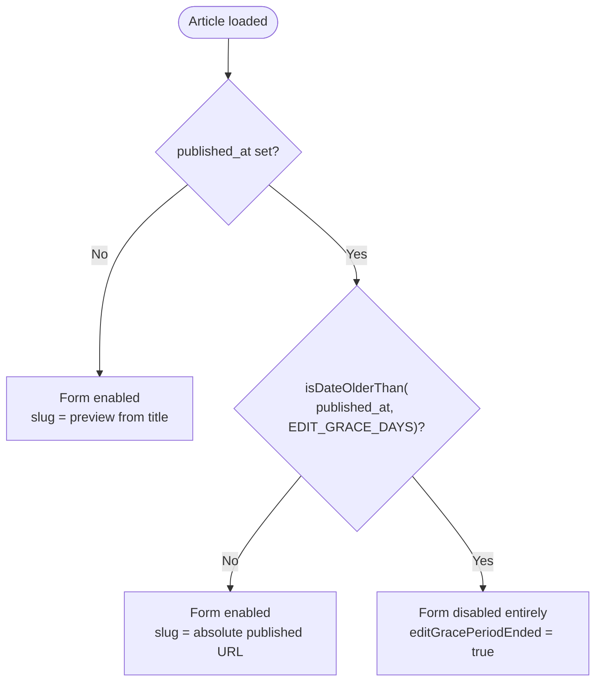

The Articles authoring capability lets authenticated users write, save as draft, and publish long-form content with rich-text bodies, authors, licensing, SDGs, categories and attachments. This page covers the editor route, the `ArticleForm` state model, and how draft saves differ from publication. For the reader route and public feeds, see [Article Reader](../articles-reader/).

## Overview

A draft and a published article are the same database row. The `published` field and `published_at` timestamp distinguish them, and two Zod schemas enforce different requirements at each stage: `articleDraftSchema` (permissive) for saves, `articlePublishSchema` (strict) for publication. This avoids a separate draft entity and duplicate persistence paths at the cost of a more complex schema.

The editor lives at `/articles/new` and handles both create and edit modes through a single `?articleId=` search parameter. `ArticleForm` is the hub: it imports the section components, Zod schemas, constants, mappers and query hooks. The route is thin — it resolves auth and reference data, then hands everything to `ArticleForm` as props.

## Architecture

## The Editor Route

[`articles/new/page.tsx`](https://github.com/ozeaon/ozeaon-v2/blob/0a4f1a95824db87782f1221a4108019d174df3d9/src/app/(main)/(editor)/articles/new/page.tsx) is a single async server component that handles both create and edit modes. Its key behaviors:

- **Authorization comes from the row, not the cookie.** When `?articleId=` is present, the route calls `getArticleForForm` then `canManageArticle(supabase, data, user.id, activeAccount)`. A missing row calls `notFound()` rather than falling through to create mode — falling through would render a blank create form and a submit would silently create a second article. An authenticated but unauthorized user gets an `ErrorFallback` panel (200 response, not 404).
- **Parallel reference data.** One `Promise.all` fetches categories, article types, SDGs, access levels, license types, funding sources and attachments together — the form cannot render meaningfully until every option list is present.
- **Attachment assembly.** The route flattens `pdf_file`, `article_documents` and `article_images` into a typed `ArticleAttachment[]`. The PDF title falls back through `pdf.title ?? pdf.filename ?? "Paper"`, and a null `attachment_type` defaults to `"annex"`.

The funding sources (`getFundingSources`) are declared research-funding provenance metadata — who funded the work — not payments. Project funding, tipping and Stripe are on the roadmap.

## Article Form: State Model

`ArticleForm` is a client component parameterized `<FormInput, unknown, FormOutput>` so Zod's input and output types are distinct. The form always resolves against `articleDraftSchema`; the publish action re-validates against the stricter `articlePublishSchema`.

**Key `useForm` decisions:**

- `shouldUnregister: false` — required so `ShowWhen` (conditional) fields retain their values when hidden, and so the unregistered `slug` field remains readable via `useWatch`.
- `disabled: isDateOlderThan(published_at, EDIT_GRACE_DAYS)` — the entire form is disabled once the edit grace period ends; `EDIT_GRACE_DAYS` lives in `config/constants/attachments`.
- `mode: "onBlur"` for edit, `"onSubmit"` for create — editing validates on field blur (faster feedback); creating waits until submit.

**Slug handling.** While draft, the slug is a preview generated from the title. Once published, `generatePublishedUrl("articles", slug)` produces the absolute locked URL. The slug is intentionally unregistered in the form (never user-editable) but readable via `useWatch`.

**Language options.** `ISO_LANGUAGE_CODES` (from `config/constants/articles`) populates the full ISO list, but every entry except `en` is `disabled`. English is the only enabled language today.

**Default article type.** The form resolves `articleTypes.find(t => t.code === ArticleTypeCode.blog) ?? articleTypes[0]` so an empty or misconfigured `article_types` table cannot crash the editor.

## Implicit Draft Creation & Concurrency

Attachments cannot be uploaded until an article row exists, but users should not have to explicitly save before attaching. The form solves this with an implicit draft create:

- `createdDraftRef` — a shared in-flight `Promise<string | null>`. Two concurrent actions (save + drop a file) that both need the article id await the same promise, preventing duplicate inserts.
- `createdArticleIdRef` — remembers the id of a row created before `meta` caught up, so a retry updates that row instead of creating another.
- `isRedirecting` — set on successful submit and **never cleared**. The form unmounts once the article page renders; clearing the flag would risk a flash of the form during navigation.

## Core Flow: Draft Save vs. Publish

Auth is resolved before any query because every query needs the request-scoped Supabase client. The route fetches the row, then authorizes from it — authorization depends on the row's ownership fields. The API routes (`src/app/api/articles/route.ts` and `[id]/content/route.ts`) run the Zod schemas server-side; the client-side `zodResolver` is the fast feedback path, not the only gate.

## Grace Period & Read-Only Lock

The slug is locked from the moment of publishing; the form-wide lock applies only after the grace period ends.

## Route Map

| Route | Group | Purpose |
| --- | --- | --- |
| `/articles/new` | `(editor)` | Create a new article, or edit one via `?articleId=`. |
| `/articles` | `(feed)/(public)` | Public article feed. |
| `/articles/[slug]` | `(reader)` | Public article reader. |
| `@sidebar/articles/[slug]` | `(reader)` | Parallel sidebar slot — Authors and Funding (declared provenance). A `BountyBlock` component exists but is an unrendered "Coming Soon" placeholder; token economy is on the roadmap. |
| `/settings/my-articles` | `(dashboard)/(personal)` | Personal article management. |
| `/settings/.../articles` | `(dashboard)/(organizations)` | Organisation article management. |

## Failure Modes & Edge Cases

- **Missing or unauthorized row** — `notFound()` on missing; `ErrorFallback` (200) on unauthorized. A hard 404 on unauthorized would leak existence information.
- **Concurrent actions needing an article id** — shared in-flight promise via `createdDraftRef` prevents duplicate inserts.
- **Retry after create where `meta` lagged** — `createdArticleIdRef` makes the retry an update.
- **Grace period expired** — whole form is `disabled`; no submission is possible.
- **Moderation rejection** — `ModerationRejectedDialog` + `useModerationRejection` surface the decision to the author as a dialog, not a generic error toast.
- **Empty `article_types` table** — falls back to `articleTypes[0]`; the editor cannot crash from a missing `blog` type.
- **Null `attachment_type`** — defaults to `"annex"`.

## Operational Notes

- **Parallel reference loading** — one `Promise.all` batch for six lookup queries plus attachments; time-to-interactive scales with the slowest query, not their sum.
- **Rich text is loaded lazily** — `content` and `content_text` start as `null`/`""` and are populated by the editor after mount. The initial SSR payload does not include the full body.
- **Storage hosts** — article content and attachments store absolute URLs against the environment that uploaded them. Both storage hosts must be in the `next.config.ts` image/host allowlist.
- **Constants** — `ARTICLE_FIELD_LIMITS` and `EDIT_GRACE_DAYS` are the two constants that drive both the Zod schemas and the form behavior. `ISO_LANGUAGE_CODES` controls the language select.

## Extension Points

- **New article type** — add a row to `article_types` and a code to `ArticleTypeCode`; the form maps them generically.
- **Type-specific required fields** — add predicates to `@/zod/articles/combined` (`isResearchOrIP`, `isVolunteeringOrField`).
- **Additional language** — flip `disabled: key !== "en"` in the language options memo.
- **Grace period length** — one constant: `EDIT_GRACE_DAYS` in `config/constants/attachments`.
- **New attachment kind** — add a category to `AttachmentType` and a paired upload component in `form/sections/attachments/`.

## Related Links

- [Editor route](https://github.com/ozeaon/ozeaon-v2/blob/0a4f1a95824db87782f1221a4108019d174df3d9/src/app/(main)/(editor)/articles/new/page.tsx)
- [ArticleForm](https://github.com/ozeaon/ozeaon-v2/blob/0a4f1a95824db87782f1221a4108019d174df3d9/src/components/articles/form/ArticleForm.tsx)
- [Zod schemas](https://github.com/ozeaon/ozeaon-v2/blob/0a4f1a95824db87782f1221a4108019d174df3d9/src/zod/articles/index.ts)
- [Article API routes](https://github.com/ozeaon/ozeaon-v2/blob/0a4f1a95824db87782f1221a4108019d174df3d9/src/app/api/articles/route.ts)
- [Article Reader](../articles-reader/) — reader route and static generation
- [Article components](../../components/articles/)
- [Media & Images](../../storage/media-and-images/) — upload transport and image URL helpers
