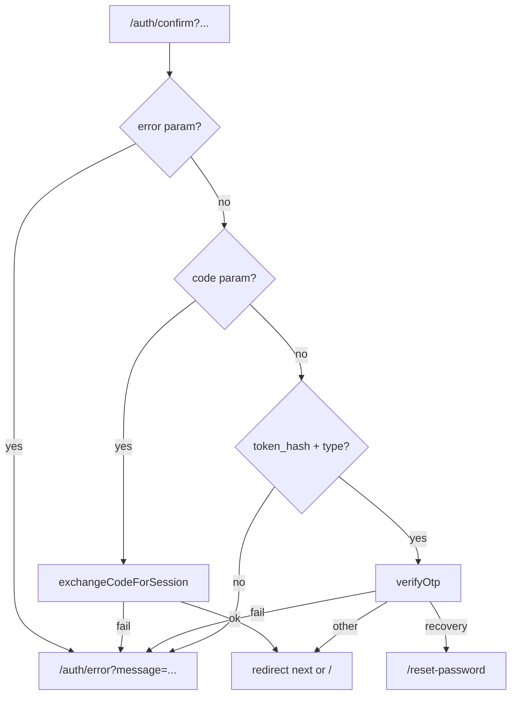

Ozeaon delegates identity to Supabase Auth. Sign-in, sign-up, password reset, and email verification are all server actions in [`src/lib/supabase/actions.ts`](https://github.com/ozeaon/ozeaon-v2/blob/0a4f1a95824db87782f1221a4108019d174df3d9/src/lib/supabase/actions.ts). Route gating happens in server component layouts using `getAuthUserOrRedirect()`. There is no custom session cookie and no client-side redirect logic.

## Overview

All auth routes live in the `(auth)` route group under `src/app/(auth)/`. The layout renders `AuthMarketingPanel` alongside the form panel. The pages are:

- `/login` — `LoginPageForm` calls `useAuth()` to submit the `login` server action.
- `/signup` — requires an `ACCESS_TOKEN` gate; creates the Supabase auth user only (profile is created on email OTP verification).
- `/forgot-password` — calls `forgotPassword`; sends a Supabase reset email.
- `/reset-password` — calls `resetPassword` after OTP or link verification.
- `/verify-email` — shows the in-app OTP form after signup.

`AuthFormPanel` is a presentational shell. `LoginPageForm` holds the submit logic and reads session state via `useAuth()`.

Google sign-in exists as [`src/components/auth/GoogleSignIn.tsx`](https://github.com/ozeaon/ozeaon-v2/blob/0a4f1a95824db87782f1221a4108019d174df3d9/src/components/auth/GoogleSignIn.tsx) but is not rendered anywhere — it is not a live sign-in option.

## Architecture

### Server Actions

All auth flows are server actions. The key ones:

- **`login`** — `signInWithPassword`, then reads the profile and returns `{ user, activeAccount }` directly so `SessionProvider` can hydrate without a second round-trip.
- **`signup`** — checks `ACCESS_TOKEN` before calling `supabase.auth.signUp`. The Supabase email OTP is sent at this point; the profile row is not created until `verifyEmailOtp` succeeds.
- **`verifyEmailOtp`** — verifies the OTP, generates a unique username from `display_name`, and inserts `user_profiles` and `user_settings` rows via the admin client (to bypass RLS on first-time profile creation).
- **`forgotPassword`** — calls `supabase.auth.resetPasswordForEmail`. Supabase sends a PKCE link; in-app OTP recovery is handled by `verifyOtpForRecovery`.
- **`verifyOtpForRecovery`** — verifies the recovery OTP and sets `user_metadata.password_reset_pending = true` to force a password reset before any other navigation.
- **`resetPassword`** — calls `supabase.auth.updateUser` with the new password and clears `password_reset_pending`.
- **`resendVerificationEmail`** — calls `supabase.auth.resend` for `signup` or `email_change` types.
- **`signOut`** — clears `password_reset_pending` if set, signs out, calls `clearActiveAccount`, and redirects to `/`.

### /auth/confirm Callback

[`src/app/(auth)/auth/confirm/route.ts`](https://github.com/ozeaon/ozeaon-v2/blob/0a4f1a95824db87782f1221a4108019d174df3d9/src/app/(auth)/auth/confirm/route.ts) is the GET route that Supabase links point to when email links are used (as opposed to in-app OTP). It handles three cases in order:

1. **Error params** — if `error` is present, redirects to `/auth/error` with the encoded `error_description`.
2. **PKCE code** — if `code` is present, calls `exchangeCodeForSession`. Password reset links carry `next=/reset-password`. Any other `next` value from the link is honoured; the default is `/`.
3. **Legacy OTP hash** — if `token_hash` and `type` are present, calls `supabase.auth.verifyOtp`. Recovery types redirect to `/reset-password`; others redirect to `next` or `/`.

### /auth/error Page

[`src/app/auth/error/page.tsx`](https://github.com/ozeaon/ozeaon-v2/blob/0a4f1a95824db87782f1221a4108019d174df3d9/src/app/auth/error/page.tsx) reads only the `message` search param and shows a static "Link is invalid or has expired" heading with a default fallback message. It lives outside the `(auth)` route group. An `AuthError` component on `(main)/error` handles runtime errors and reads `code`; these are separate.

### Route Gating

`authorizeUser()` in [`src/lib/supabase/auth.ts`](https://github.com/ozeaon/ozeaon-v2/blob/0a4f1a95824db87782f1221a4108019d174df3d9/src/lib/supabase/auth.ts) calls `supabase.auth.getUser()` and redirects to `/login`. It exists in the codebase but has no callers — it is dead code.

The real guard is `getAuthUserOrRedirect()` in [`src/lib/supabase/queries/auth.ts`](https://github.com/ozeaon/ozeaon-v2/blob/0a4f1a95824db87782f1221a4108019d174df3d9/src/lib/supabase/queries/auth.ts). It calls `getAuthUser()` (React-cached) and redirects to `/login` if there is no user. The `(dashboard)` layout calls it for all settings and org routes. Individual pages in that group also call it to get typed `user` and `activeAccount` values.

Feed, reader, and profile routes in `(main)/(feed)/(public)` and `(main)/(profile)` are public — they do not call `getAuthUserOrRedirect`. Some inner pages in `(feed)/(private)` call it directly.

### Password-reset Guard

The middleware (`src/middleware.ts`) runs `getClaims()` on every request. If `user_metadata.password_reset_pending` is set, the middleware calls `getUser()` and redirects any route except `/reset-password` and `/auth/signout` to `/reset-password`. This prevents a user who requested a password reset from navigating away before completing it.

## Failure Modes & Edge Cases

- **Unconfirmed email on login** — `login` checks `email_confirmed_at` and signs the session back out, returning an error rather than leaving an unconfirmed session active.
- **Email already exists on signup** — `signup` detects `identities.length === 0` and returns a "log in instead" message, avoiding a Supabase error leaking internal state.
- **Double confirm changes** — `verifyEmailChange` checks that `data.user.email` actually moved to the new address after OTP verification, because GoTrue may silently wait for a second confirmation under `double_confirm_changes`. If the email hasn't moved, an explanatory error is returned.
- **Expired /auth/confirm link** — the route redirects to `/auth/error` with the Supabase error message; the page shows a "Reset password again" link.
- **`password_reset_pending` on sign-out** — `signOut` clears the flag before signing out, so a re-login is not immediately redirected to `/reset-password`.

## Operational Notes

`getAuthUser` is wrapped in React's `cache()`, so it resolves at most once per server render across all layouts and pages that call it in the same request tree. `withAuthUser` (used by API routes) also calls `getAuthUser` and injects the user into the route handler context via `withContext` for structured logging.

Supabase auth emails (verification, password reset) are sent by Supabase directly. The only application-sent auth-adjacent emails are the email-change security notice and the account-deletion confirmation (see [User Settings & Account Management](../user-settings/)).

## Related Links

- [Account Switching & Active Account](../account-switching/) — org mode and the active account cookie
- [User Settings & Account Management](../user-settings/) — email/password change dialogs and account deletion
- [Middleware & Sessions](../../architecture/middleware-sessions/) — the password-reset guard and session cookie mechanics
