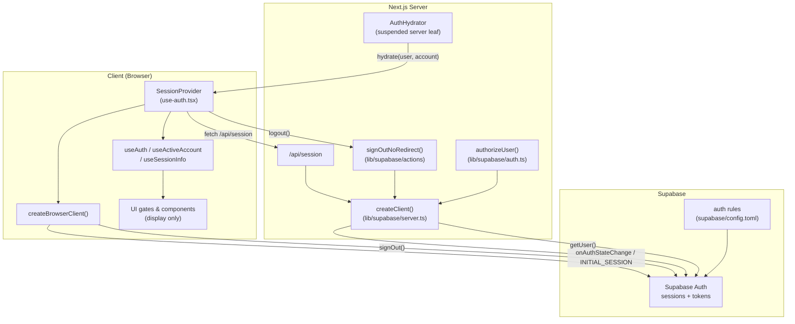
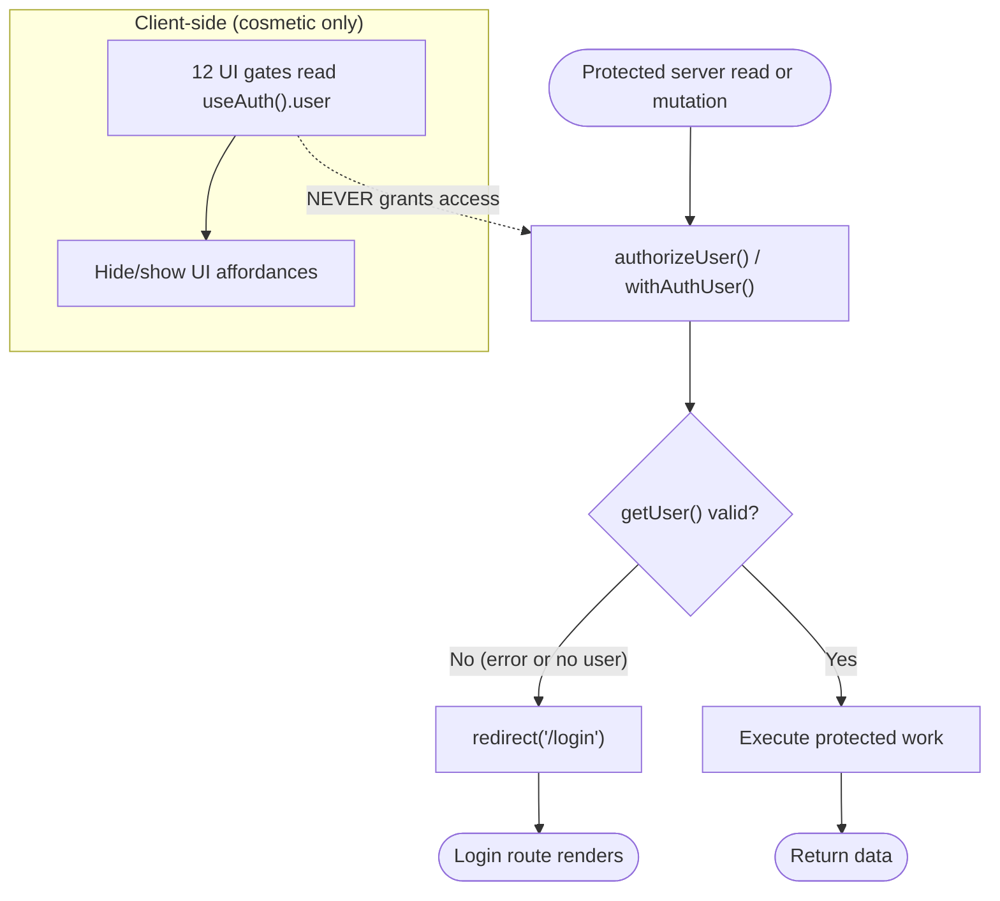
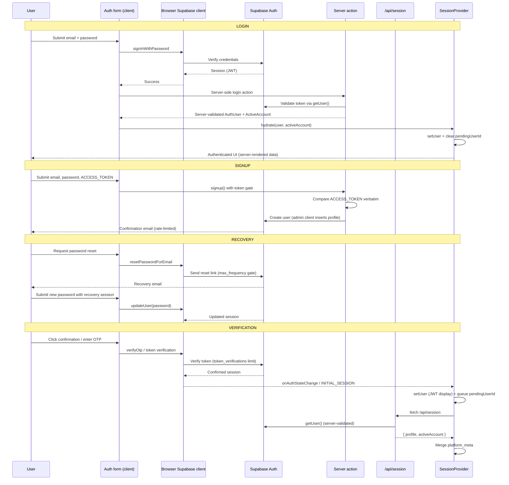
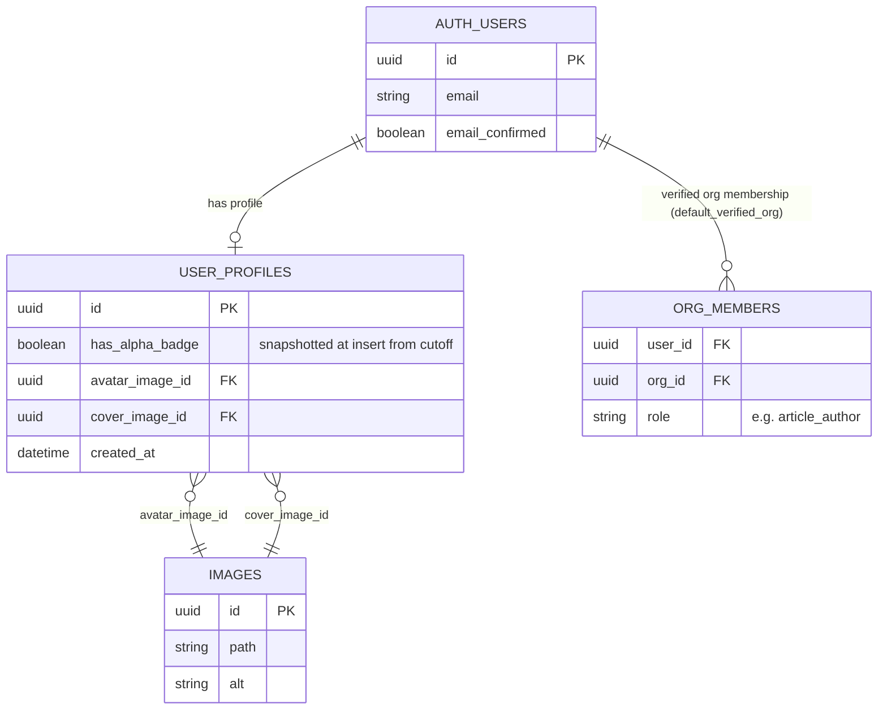
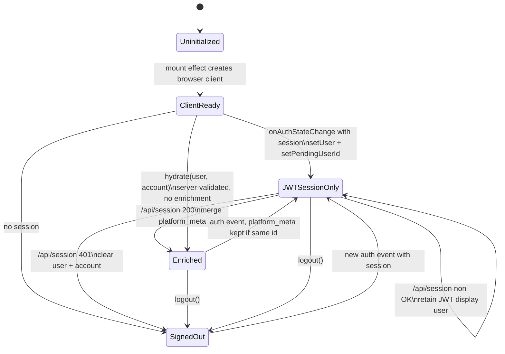

This page documents the authentication flow layer of ozeaon-v2 — the session provider, server-side authorization helper, and the Supabase-backed credential, recovery, and verification mechanisms that underpin login, signup, and account recovery.

## Purpose and Scope

This page covers:

- The **client-side session context** (`SessionProvider`, `useAuth`, `useActiveAccount`, `useSessionInfo`) that owns display identity and logout behavior.
- The **server-side authorization gate** (`authorizeUser`) used by protected server components and routes.
- The **credential + recovery flows** delegated to Supabase Auth (`signInWithPassword`, `signUp`, `resetPasswordForEmail`, `updateUser`, `verifyOtp`) and how the hosting configuration (`supabase/config.toml`) constrains them.
- The **signup gating** mechanism driven by the `ACCESS_TOKEN` environment variable, compared verbatim in `signup()`.
- The **verification** surfaces: email confirmation, OTP/token verification rate limits, and the relation between verified org membership and the alpha badge window.

Related topics intentionally left to sibling pages:

- For the SSR/session refactor rationale (server as source of truth, PPR hydration), see the related architecture documentation.
- For deployment-time environment configuration of preview environments, see the deployment documentation.
- For database schema and migrations (profiles, org membership, badge columns), see the data model pages.

## Overview

Authentication in ozeaon-v2 is **not** implemented with custom password hashing or bespoke JWT issuance. Instead, the application builds on **Supabase Auth** as the credential authority, and layers two application-owned concerns on top:

1. **A server-side authorization gate.** Every protected read or mutation re-checks identity on the server via `authorizeUser()` (and the `withAuthUser` / `getAuthUser` helpers referenced in the session provider invariants). The client never makes a security decision.
2. **A client-side display/session context.** The `SessionProvider` exposes session-derived state for rendering: who is displayed as logged in, which active account (personal vs. organization) is selected, a browser Supabase client, and the logout action.

This split is deliberate. The comment block at the top of the session provider states it as a set of **invariants that must not be broken**:

- The **server** is the only source of truth for **authorization**. Every mutation and protected read re-checks server-side. The client-side gates that read `user` are cosmetic.
- `useAuth().user` is **display state only**. It is derived from the local JWT via `onAuthStateChange`, and on login and on PPR routes it is server-validated via `hydrate`. A security decision must never be based on it.
- Session state is **hydrated, then event-synced — never polled**. There is no `getSession()` on navigation; `INITIAL_SESSION` provides the first read.
- **No auth reads in layouts/providers above content that could be static.** Auth enters the tree via the client provider, or a suspended server leaf (`AuthHydrator`) on PPR routes — never the root layout.

### Terminology

| Term | Meaning in this codebase |
| --- | --- |
| `SessionProvider` | React context provider owning client session state; wraps the app subtree that needs auth |
| `hydrate` | Injects a **server-validated** `AuthUser` (+ optional `ActiveAccount`) into client state, e.g. after login or on PPR routes |
| `AuthHydrator` | A suspended server leaf component that pushes server-validated session into the context on PPR routes |
| `ActiveAccount` | Discriminated union of account context; `{ type: "user" }` for a personal account, otherwise an organization scope |
| `platform_meta` | The enriched profile object attached to `AuthUser`; its presence marks a user record as fully enriched |
| `ACCESS_TOKEN` | Environment variable used to gate signup; compared verbatim inside `signup()` |
| `authorizeUser` | Server helper that resolves the current user and redirects to `/login` when unauthenticated |

### Why this design

The design intent behind the split is to keep **static rendering fast** while keeping **authorization strict**:

- Reading auth state at the root layout would make every page dynamic, because the read cannot be statically resolved. Pushing auth reads down to a suspended server leaf (`AuthHydrator`) or into a client provider keeps the surrounding page shell static.
- Because client identity can be stale (local JWT, no backend verification), it can only ever drive the UI. Anything that grants access is re-verified on the server.
- Because the previous implementation **polled** (a `getSession()` on mount plus a `usePathname` poll), the current implementation replaced polling with `INITIAL_SESSION` plus `onAuthStateChange` events — a strictly cheaper and more reactive model.

## Architecture

The diagram below shows the verified participants: the client session context, the browser and server Supabase clients, Supabase Auth itself, the session bootstrap API route, and the server-side authorization gate.



The architecture has three cooperating layers:

- **Supabase Auth** is the credential authority and the issuer of sessions. It owns password verification, token issuance, and the rate limits configured in `supabase/config.toml`.
- **The Next.js server** holds the two server-only responsibilities: `authorizeUser()` for gate-keeping, and the `/api/session` bootstrap endpoint that enriches a session into a full profile plus active account. `AuthHydrator` is the PPR-specific bridge that pushes a server-validated session into client state.
- **The client session context** holds display state and the browser Supabase client. It listens to auth events, queues enrichment, and exposes actions (`hydrate`, `logout`, `refreshProfile`).

The single most important structural property is that **arrows crossing the client boundary never carry authority**. The `/api/session` response and the `onAuthStateChange` payload only influence rendering; `authorizeUser()` is the gate.

## The Server Authorization Gate

The entire server-side gate is a small, focused function. Its brevity is the point: there is exactly one place where "is this request authenticated?" is answered for server-rendered protected content.

```typescript
import { redirect } from "next/navigation";
import { createClient } from "@/lib/supabase/server";

export async function authorizeUser() {
  const supabase = await createClient();

  const { data, error } = await supabase.auth.getUser();

  if (error || !data.user) {
    redirect("/login");
  }

  return data;
}
```

> Source: [auth.ts](https://github.com/ozeaon/ozeaon-v2/blob/0a4f1a95824db87782f1221a4108019d174df3d9/src/lib/supabase/auth.ts#L1-L13)

Key implementation details and their intent:

- **`createClient()` is awaited.** The server Supabase client factory is asynchronous in this codebase, so the gate resolves it before use. This is what allows cookie-based session reading on the server.
- **`supabase.auth.getUser()`, not `getSession()`.** `getUser()` validates the token against the Supabase Auth server rather than trusting the cookie payload. This is the concrete mechanism behind the "server is the only source of truth" invariant: the client may be showing a stale JWT, but this call will fail if the token is invalid.
- **`redirect("/login")` on failure.** Failure is handled by redirecting to the login route rather than throwing. `redirect()` in Next.js works by throwing an internal control-flow signal, so execution does not continue past this branch in practice. Returning `data` on the success path gives callers the validated user.
- **The error and no-user cases are collapsed.** The condition `error || !data.user` treats a transport/auth error identically to a successful call with no user, because both mean the caller is not authorized.

### Where the gate is applied

The session provider's invariant comment states that "every mutation and protected read re-checks server-side (`withAuthUser` / server `getAuthUser`)", and that there are **12 client gates** that read `user` cosmetically. This is the enforcement model:



The dotted edge is the crux: client gates may influence what is *rendered*, but access is only ever granted by the server gate.

## Client Session Context: `SessionProvider`

`SessionProvider` is the single owner of client-side session state. Everything a client component needs to know about "who is logged in" flows through this one provider.

### Exposed surface

The context value is defined as a single type, `SessionContextValue`, and split into three narrow hooks so consumers only subscribe to what they need.

```typescript
type SessionContextValue = {
  /** Display identity — UI only, never an authorization decision (invariant #2). */
  user: AuthUser | null;
  activeAccount: ActiveAccount;
  client: SupabaseClient | null;
  /** Inject server-validated session (login success / PPR AuthHydrator). */
  hydrate: (user: AuthUser, activeAccount?: ActiveAccount) => void;
  setActiveAccount: Dispatch<SetStateAction<ActiveAccount>>;
  logout: () => Promise<void>;
  refreshProfile: () => Promise<void>;
};
```

> Source: [use-auth.tsx](https://github.com/ozeaon/ozeaon-v2/blob/0a4f1a95824db87782f1221a4108019d174df3d9/src/hooks/use-auth.tsx#L40-L50)

The three public hooks partition this surface by concern:

| Hook | Returns | Intended use |
| --- | --- | --- |
| `useAuth()` | `user`, `client`, `hydrate`, `logout`, `refreshProfile` | Identity display, imperative client calls, and session mutations |
| `useActiveAccount()` | `activeAccount`, `setActiveAccount`, `logout` | Account switcher UI and sign-out |
| `useSessionInfo()` | `user`, `activeAccount` | Read-only render consumers that must not trigger side effects |

```typescript
/** Identity + browser client + session actions. `user` is display-only (invariant #2). */
export function useAuth() {
  const { user, client, hydrate, logout, refreshProfile } = useSession();
  return { user, client, hydrate, logout, refreshProfile };
}

/** Active account (personal vs org) + switch/logout actions. */
export function useActiveAccount() {
  const { activeAccount, setActiveAccount, logout } = useSession();
  return { activeAccount, setActiveAccount, logout };
}

export function useSessionInfo() {
  const { user, activeAccount } = useSession();
  return { user, activeAccount };
}
```

> Source: [use-auth.tsx](https://github.com/ozeaon/ozeaon-v2/blob/0a4f1a95824db87782f1221a4108019d174df3d9/src/hooks/use-auth.tsx#L205-L220)

All three delegate to an internal `useSession()` that throws when used outside the provider — a fail-fast guard so a missing provider surfaces immediately rather than as `undefined` reads:

```typescript
function useSession() {
  const ctx = useContext(SessionContext);
  if (!ctx) throw new Error("useSession must be used within SessionProvider");
  return ctx;
}
```

> Source: [use-auth.tsx](https://github.com/ozeaon/ozeaon-v2/blob/0a4f1a95824db87782f1221a4108019d174df3d9/src/hooks/use-auth.tsx#L199-L203)

### State held by the provider

```typescript
const [user, setUser] = useState<AuthUser | null>(null);
const [activeAccount, setActiveAccount] = useState<ActiveAccount>({
  type: "user",
});
const [client, setClient] = useState<SupabaseClient | null>(null);

// Which user id still needs enrichment (profile + active account). Kept OUT of
// onAuthStateChange — network/DB ops inside that listener hang.
// See: https://github.com/supabase/auth-js/issues/762
const [pendingUserId, setPendingUserId] = useState<string | null>(null);
```

> Source: [use-auth.tsx](https://github.com/ozeaon/ozeaon-v2/blob/0a4f1a95824db87782f1221a4108019d174df3d9/src/hooks/use-auth.tsx#L63-L72)

Three design decisions are encoded here:

1. **`activeAccount` defaults to `{ type: "user" }`.** The neutral default is the personal account, so a component that renders before enrichment does not have to handle a null account.
2. **`client` is `null` initially.** The browser Supabase client is created in an effect, not at module scope, explicitly to "avoid an SSR-time auth network call."
3. **`pendingUserId` exists as a separate state variable.** This is the workaround for a real upstream bug: network/DB operations inside `onAuthStateChange` hang (supabase/auth-js issue #762). The provider therefore splits the flow into *set state synchronously* and *enrich asynchronously in a separate effect*.

The browser client is created once on mount:

```typescript
// Browser client only on the client — avoids an SSR-time auth network call.
useEffect(() => {
  setClient(createBrowserClient());
}, []);
```

> Source: [use-auth.tsx](https://github.com/ozeaon/ozeaon-v2/blob/0a4f1a95824db87782f1221a4108019d174df3d9/src/hooks/use-auth.tsx#L74-L77)

### `hydrate` — injecting a server-validated session

```typescript
// Inject server-validated session (login / PPR AuthHydrator). No enrichment
// needed: the caller already supplies the full profile + active account.
const hydrate = useCallback(
  (nextUser: AuthUser, nextAccount?: ActiveAccount) => {
    setUser(nextUser);
    if (nextAccount) setActiveAccount(nextAccount);
    setPendingUserId(null);
  },
  [],
);
```

> Source: [use-auth.tsx](https://github.com/ozeaon/ozeaon-v2/blob/0a4f1a95824db87782f1221a4108019d174df3d9/src/hooks/use-auth.tsx#L79-L88)

`hydrate` is the fast path. Because the caller already holds a server-validated `AuthUser` with its full profile, no `/api/session` round trip is required. Clearing `pendingUserId` is essential: it suppresses the enrichment effect so a hydrated user is never immediately re-enriched. This is the mechanism for the invariant that session state is "hydrated, then event-synced — never polled."

### Auth event subscription

```typescript
// Single source of client auth events. NO DB ops here (issue #762): set the
// base user from the JWT session and queue enrichment. INITIAL_SESSION (fired
// on registration) replaces the old getSession()-on-mount + usePathname poll.
useEffect(() => {
  if (!client) return;
  const {
    data: { subscription },
  } = client.auth.onAuthStateChange((_event, session) => {
    if (session?.user) {
      setUser((current) => {
        // Already have this fully-enriched user (e.g. server-hydrated on
        // login) — keep it, don't re-trigger enrichment.
        if (current?.id === session.user.id && current.platform_meta) {
          return current;
        }
        setPendingUserId(session.user.id);
        return session.user as AuthUser;
      });
    } else {
      setUser(null);
      setActiveAccount({ type: "user" });
      setPendingUserId(null);
    }
  });
  return () => subscription.unsubscribe();
}, [client]);
```

> Source: [use-auth.tsx](https://github.com/ozeaon/ozeaon-v2/blob/0a4f1a95824db87782f1221a4108019d174df3d9/src/hooks/use-auth.tsx#L90-L115)

This listener is the **only** source of client auth events. Several deliberate behaviors:

- **The event name is ignored (`_event`).** Every event that carries a session is handled identically — the provider reacts to session presence, not to event semantics. `INITIAL_SESSION`, fired on registration, supplies the first read.
- **The functional `setUser` updater performs the enrichment decision.** If the current user already has the same `id` **and** a truthy `platform_meta`, the existing object is returned unchanged. This prevents a login-time `hydrate()` from being clobbered by a subsequent auth event and re-triggered into an enrichment round trip.
- **`setPendingUserId` is called inside the updater.** Because it is a state setter (not a network call), this is safe under the #762 constraint. The `as AuthUser` cast reflects that the raw `session.user` carries no `platform_meta` yet — the enrichment step fills it.
- **Sign-out handling is a full reset.** No session means `user = null`, `activeAccount` reset to `{ type: "user" }`, and `pendingUserId` cleared, so the enrichment effect cannot fire against a stale id.
- **The subscription is torn down** by returning `subscription.unsubscribe()`, and the effect re-runs when `client` changes (i.e. once, when the browser client is created).

### Enrichment: the server-validated round trip

```typescript
// Enrichment: one server-validated round-trip for profile + active account.
// Separate from the listener (issue #762). Replaces the browser-client
// profile query and the `/api/active-account` GET.
useEffect(() => {
  if (!pendingUserId) return;
  const controller = new AbortController();
  void (async () => {
    try {
      const res = await fetch("/api/session", { signal: controller.signal });
      if (res.status === 401) {
        setUser(null);
        setActiveAccount({ type: "user" });
        setPendingUserId(null);
        return;
      }
      if (!res.ok) {
        setPendingUserId(null);
        return;
      }
      const data = (await res.json()) as SessionBootstrap;
      setUser((current) =>
        current && current.id === pendingUserId
          ? { ...current, platform_meta: data.profile ?? null }
          : current,
      );
      setActiveAccount(data.activeAccount);
      setPendingUserId(null);
    } catch (err) {
      if (err instanceof Error && err.name === "AbortError") return;
      setPendingUserId(null);
    }
  })();
  return () => controller.abort();
}, [pendingUserId]);
```

> Source: [use-auth.tsx](https://github.com/ozeaon/ozeaon-v2/blob/0a4f1a95824db87782f1221a4108019d174df3d9/src/hooks/use-auth.tsx#L117-L150)

The enrichment effect is the bridge between the JWT-derived display user and the full profile. Notable details:

- **The payload shape is `SessionBootstrap`** — `{ profile: AuthUser["platform_meta"], activeAccount: ActiveAccount }`. Types are attached to the bootstrap object rather than assumed:

  ```typescript
  type SessionBootstrap = {
    profile: AuthUser["platform_meta"];
    activeAccount: ActiveAccount;
  };
  ```

  > Source: [use-auth.tsx](https://github.com/ozeaon/ozeaon-v2/blob/0a4f1a95824db87782f1221a4108019d174df3d9/src/hooks/use-auth.tsx#L52-L55)

- **`AbortController` cancels in-flight enrichment** when `pendingUserId` changes or the component unmounts. Because the effect keys on `pendingUserId`, a rapid user switch aborts the previous request rather than letting a stale response land.
- **`401` is treated as authoritative sign-out**, clearing user, account, and pending id. A non-OK, non-401 response clears only `pendingUserId` and leaves the JWT-derived user displayed — a deliberate degradation: an enrichment outage should not log the user out.
- **The response is identity-checked before merging.** `current.id === pendingUserId` guards against applying a profile fetched for user A onto a user object that has since become user B.
- **`platform_meta` falls back to `null`** via `data.profile ?? null`, so the merge is well-defined even for a profile-less session.
- **Only `platform_meta` is merged.** The rest of `AuthUser` from the JWT is preserved; enrichment augments rather than replaces identity.
- **`AbortError` is swallowed**, since it is an expected consequence of the cleanup function.

### Logout and profile refresh

```typescript
const logout = useCallback(async () => {
  if (client) await client.auth.signOut();
  await signOutNoRedirect();
  setUser(null);
  setActiveAccount({ type: "user" });
  router.refresh();
  router.push("/");
}, [client, router]);
```

> Source: [use-auth.tsx](https://github.com/ozeaon/ozeaon-v2/blob/0a4f1a95824db87782f1221a4108019d174df3d9/src/hooks/use-auth.tsx#L152-L159)

Logout is a **two-sided** operation, which is why it is documented here rather than as a single auth call:

1. `client.auth.signOut()` clears the browser-side Supabase session (no-op if the client is not yet created).
2. `signOutNoRedirect()` (imported from `@/lib/supabase/actions`) clears the **server-side** session — cookies the server client reads. The name indicates the server action deliberately does not redirect, because the client performs navigation itself.
3. Local state is reset, then `router.refresh()` re-renders server components with the cleared cookies **before** `router.push("/")` navigates. The ordering matters: refreshing first ensures server-rendered output for the new route is not produced from a stale authenticated render.

```typescript
const refreshProfile = useCallback(async () => {
  if (!user?.id || !client) return;
  try {
    const { data: profile } = await client
      .from("user_profiles")
      .select(
        "*, avatar_image:images!avatar_image_id(id, path, alt), cover_image:images!cover_image_id(id, path, alt)",
      )
      .eq("id", user.id)
      .single();
    if (profile) {
      setUser((current) =>
        current ? { ...current, platform_meta: profile } : null,
      );
    }
  } catch (e) {
    logError(logger, "Failed to refresh profile", e, { userId: user.id });
  }
}, [user, client]);
```

> Source: [use-auth.tsx](https://github.com/ozeaon/ozeaon-v2/blob/0a4f1a95824db87782f1221a4108019d174df3d9/src/hooks/use-auth.tsx#L161-L179)

`refreshProfile` is an explicit, opt-in refresh used after profile edits (for example, after changing an avatar). Unlike enrichment, it queries the database directly through the browser client and applies RLS as the authenticated user. It selects the profile plus two aliased image relations (`avatar_image`, `cover_image`) resolved through the `images` table by foreign key. Failures are logged via `logError` with the `userId` as context and are non-fatal — the UI keeps the last known profile. Both the `user?.id` and `client` guards make the function a safe no-op when called too early.

The logger is scoped at module level:

```typescript
const logger = getLogger(["hooks", "use-auth"]);
```

> Source: [use-auth.tsx](https://github.com/ozeaon/ozeaon-v2/blob/0a4f1a95824db87782f1221a4108019d174df3d9/src/hooks/use-auth.tsx#L21)

## Core Flow: Login, Signup, Recovery & Verification

The following sequence walks the four flows end to end. It combines the client session context, the server authorization gate, the session bootstrap endpoint, and Supabase Auth.



### Step-by-step: what happens on a successful login

1. The credential exchange happens against Supabase Auth. On success the browser client holds a session, and `onAuthStateChange` fires.
2. **The server-validated path wins.** After login the application redirects/reloads through a server route where either `AuthHydrator` or the login success path calls `hydrate(user, activeAccount)` with a **server-validated** `AuthUser`. This is why invariant #2 can say identity is server-validated on login.
3. `hydrate` sets `user`, optionally sets `activeAccount`, and clears `pendingUserId`. The enrichment effect therefore does not fire, so login costs **zero** `/api/session` calls.
4. Because `hydrate` was called before/with the auth event, the listener's `setUser` updater sees `current.id === session.user.id && current.platform_meta` and returns the current object unchanged — no redundant enrichment, no state flicker.

### Step-by-step: signup

Signup is gated by an access token rather than left fully open. The deployment documentation states the mechanism precisely:

```markdown
Sign-up is gated by `ACCESS_TOKEN`, compared verbatim in `signup()`. Previews use `ozeaon-preview`, so
production's token never reaches a public `workers.dev` hostname and signup stays testable.
```

> Source: [deployment-previews.md](https://github.com/ozeaon/ozeaon-v2/blob/0a4f1a95824db87782f1221a4108019d174df3d9/docs/deployment-previews.md#L74-L75)

Design intent and consequences:

- **Comparison is verbatim**, so the token is an exact-match shared secret, not a hash or a signed claim. Rotation requires updating every environment that performs signup.
- **Preview environments use a distinct token (`ozeaon-preview`)** so that "production's token never reaches a public `workers.dev` hostname." This confines the blast radius of a leaked preview secret to preview environments.
- **Signup remains testable in previews** even while production signup stays gated — the token is a functional gate, not an environment-specific disable flag.
- **Email signup inserts profiles with the admin client.** A migration comment records this explicitly, which matters because column defaults are evaluated as the inserting role — hence `service_role` is granted schema usage alongside `anon` and `authenticated`:

  ```sql
  -- service_role included: column defaults are evaluated as the inserting role, and the
  -- email-signup path inserts profiles with the admin client.
  GRANT USAGE ON SCHEMA private TO anon, authenticated, service_role;
  ```

  > Source: [20260826170000_alpha_badge_window.sql](https://github.com/ozeaon/ozeaon-v2/blob/0a4f1a95824db87782f1221a4108019d174df3d9/supabase/migrations/20260826170000_alpha_badge_window.sql#L6-L8)

### Step-by-step: recovery

Recovery follows the standard Supabase two-phase pattern: a reset request email containing a recovery link establishes a short-lived recovery session, and the new password is then applied through `updateUser`. Two configuration values constrain the flow:

- `secure_password_change = false` — the password-change route does not require re-authentication with the current password.
- `max_frequency = "1s"` — "the minimum amount of time that must pass before sending another signup confirmation or **password reset** email."

  ```toml
  # Controls the minimum amount of time that must pass before sending another signup confirmation or password reset email.
  max_frequency = "1s"
  ```

  > Source: [config.toml](https://github.com/ozeaon/ozeaon-v2/blob/0a4f1a95824db87782f1221a4108019d174df3d9/supabase/config.toml#L216-L217)

### Step-by-step: verification

Verification covers email confirmation and OTP/token verification. Both are rate-limited per IP over a **5 minute** interval:

| Setting | Value | Reported meaning |
| --- | --- | --- |
| `sign_in_sign_ups` | `30` | Sign up and sign-in requests per 5 min per IP (excludes anonymous users) |
| `token_verifications` | `30` | OTP / magic link verifications per 5 min per IP |

```toml
# Number of sign up and sign-in requests that can be made in a 5 minute interval per IP address (excludes anonymous users).
sign_in_sign_ups = 30
# Number of OTP / Magic link verifications that can be made in a 5 minute interval per IP address.
token_verifications = 30
```

> Source: [config.toml](https://github.com/ozeaon/ozeaon-v2/blob/0a4f1a95824db87782f1221a4108019d174df3d9/supabase/config.toml#L193-L196)

After successful verification, the browser client receives a confirmed session; the provider then follows the enrichment path described above (event → `pendingUserId` → `/api/session`).

## Verification State and the Alpha Badge Window

Verification has a downstream effect on the user record. The alpha badge window migration snapshots a cutoff **onto each row at insert time**, so later changes to the cutoff date only affect *future* signups:

```sql
-- The cutoff is snapshotted onto each row at insert, so moving this date only affects
-- future signups. To extend it retrospectively:
--   UPDATE public.user_profiles SET has_alpha_badge = true WHERE created_at < <new cutoff>;
```

> Source: [20260826170000_alpha_badge_window.sql](https://github.com/ozeaon/ozeaon-v2/blob/0a4f1a95824db87782f1221a4108019d174df3d9/supabase/migrations/20260826170000_alpha_badge_window.sql#L13-L15)

This is a deliberate immutability choice: because the flag is materialized per row rather than computed at read time, the badge reflects the policy that was in force when the account was created. Retroactive extension is possible but explicit and manual, via the documented `UPDATE`. A related migration notes that verification logic is still in flux:

```sql
-- TODO Drop this migration in future, when propper verification logic will be scoped
```

> Source: [20260714171240_default_verified_org.sql](https://github.com/ozeaon/ozeaon-v2/blob/0a4f1a95824db87782f1221a4108019d174df3d9/supabase/migrations/20260714171240_default_verified_org.sql#L1)



The `USER_PROFILES` shape above is verified from the `refreshProfile` select (`*, avatar_image:images!avatar_image_id(id, path, alt), cover_image:images!cover_image_id(id, path, alt)`) plus the badge migration; the `ORG_MEMBERS` relation is verified by the author-role and org-membership migrations in the repository.

## Usage Examples

### Guarding a server component or route with `authorizeUser`

The gate is intentionally minimal so it can be called at the top of any protected server component. Because it calls `redirect()` internally on failure, callers do not need their own null-handling branch.

```typescript
import { redirect } from "next/navigation";
import { createClient } from "@/lib/supabase/server";

export async function authorizeUser() {
  const supabase = await createClient();

  const { data, error } = await supabase.auth.getUser();

  if (error || !data.user) {
    redirect("/login");
  }

  return data;
}
```

> Source: [auth.ts](https://github.com/ozeaon/ozeaon-v2/blob/0a4f1a95824db87782f1221a4108019d174df3d9/src/lib/supabase/auth.ts#L1-L13)

### Consuming display identity in a client component

`useAuth()` is the correct hook for UI that reflects identity. Note the documented constraint: this value must never back an authorization decision.

```typescript
/** Identity + browser client + session actions. `user` is display-only (invariant #2). */
export function useAuth() {
  const { user, client, hydrate, logout, refreshProfile } = useSession();
  return { user, client, hydrate, logout, refreshProfile };
}
```

> Source: [use-auth.tsx](https://github.com/ozeaon/ozeaon-v2/blob/0a4f1a95824db87782f1221a4108019d174df3d9/src/hooks/use-auth.tsx#L205-L209)

### Injecting a server-validated session with `hydrate`

`hydrate` is the intended bridge from a server-validated identity into client state — used on login success and on PPR routes via `AuthHydrator`.

```typescript
// Inject server-validated session (login / PPR AuthHydrator). No enrichment
// needed: the caller already supplies the full profile + active account.
const hydrate = useCallback(
  (nextUser: AuthUser, nextAccount?: ActiveAccount) => {
    setUser(nextUser);
    if (nextAccount) setActiveAccount(nextAccount);
    setPendingUserId(null);
  },
  [],
);
```

> Source: [use-auth.tsx](https://github.com/ozeaon/ozeaon-v2/blob/0a4f1a95824db87782f1221a4108019d174df3d9/src/hooks/use-auth.tsx#L79-L88)

### Refreshing the profile after an edit

`refreshProfile` performs a direct, RLS-scoped read of the profile and its image relations, then merges the result into `platform_meta`.

```typescript
const { data: profile } = await client
  .from("user_profiles")
  .select(
    "*, avatar_image:images!avatar_image_id(id, path, alt), cover_image:images!cover_image_id(id, path, alt)",
  )
  .eq("id", user.id)
  .single();
```

> Source: [use-auth.tsx](https://github.com/ozeaon/ozeaon-v2/blob/0a4f1a95824db87782f1221a4108019d174df3d9/src/hooks/use-auth.tsx#L164-L170)

### Full logout (client + server session)

Logout must clear both sessions. The ordering of `refresh` before `push` is significant.

```typescript
const logout = useCallback(async () => {
  if (client) await client.auth.signOut();
  await signOutNoRedirect();
  setUser(null);
  setActiveAccount({ type: "user" });
  router.refresh();
  router.push("/");
}, [client, router]);
```

> Source: [use-auth.tsx](https://github.com/ozeaon/ozeaon-v2/blob/0a4f1a95824db87782f1221a4108019d174df3d9/src/hooks/use-auth.tsx#L152-L159)

### Bootstrap handlers: `SessionProvider` and `AuthHydrator`

Providers must be constructed and consumed per the documented invariants — in particular, auth reads must not sit above content that could be static.

```typescript
export function SessionProvider({ children }: React.PropsWithChildren<{}>) {
  const router = useTransitionRouter();
  const [user, setUser] = useState<AuthUser | null>(null);
  const [activeAccount, setActiveAccount] = useState<ActiveAccount>({
    type: "user",
  });
  const [client, setClient] = useState<SupabaseClient | null>(null);
```

> Source: [use-auth.tsx](https://github.com/ozeaon/ozeaon-v2/blob/0a4f1a95824db87782f1221a4108019d174df3d9/src/hooks/use-auth.tsx#L61-L67)

The invariant block that governs where auth may enter the tree is stated verbatim in source:

```typescript
 * 4. No auth reads in layouts/providers above content that could be static.
 *    Auth enters the tree via this client provider today, or a suspended server
 *    leaf (AuthHydrator) on PPR routes — never the root layout.
```

> Source: [use-auth.tsx](https://github.com/ozeaon/ozeaon-v2/blob/0a4f1a95824db87782f1221a4108019d174df3d9/src/hooks/use-auth.tsx#L36-L38)

## Configuration Options

### Supabase Auth configuration (`supabase/config.toml`)

| Option | Value | Type | Description |
| --- | --- | --- | --- |
| `enable_signup` | `true` | bool | Project-wide allow/disallow of new user signups |
| `[auth.email].enable_signup` | `true` | bool | Allow/disallow new user signups **via email** |
| `[auth.sms].enable_signup` | `false` | bool | Allow/disallow new user signups via SMS — disabled |
| `refresh_token_reuse_interval` | `10` | int | Refresh token reuse interval |
| `sign_in_sign_ups` | `30` | int | Sign-up + sign-in requests per 5 min per IP (excludes anonymous users) |
| `token_verifications` | `30` | int | OTP / magic link verifications per 5 min per IP |
| `secure_password_change` | `false` | bool | If enabled, requires re-authentication before a password change |
| `[auth.email].max_frequency` | `"1s"` | string (duration) | Minimum interval before another signup confirmation or password reset email |

> Sources:
> - [config.toml](https://github.com/ozeaon/ozeaon-v2/blob/0a4f1a95824db87782f1221a4108019d174df3d9/supabase/config.toml#L172-L173)
> - [config.toml](https://github.com/ozeaon/ozeaon-v2/blob/0a4f1a95824db87782f1221a4108019d174df3d9/supabase/config.toml#L193-L196)
> - [config.toml](https://github.com/ozeaon/ozeaon-v2/blob/0a4f1a95824db87782f1221a4108019d174df3d9/supabase/config.toml#L206-L217)
> - [config.toml](https://github.com/ozeaon/ozeaon-v2/blob/0a4f1a95824db87782f1221a4108019d174df3d9/supabase/config.toml#L244-L246)

### Application-level authentication configuration

| Option | Type | Default / Value | Description |
| --- | --- | --- | --- |
| `ACCESS_TOKEN` | string (env) | production value; `ozeaon-preview` in previews | Shared secret gating signup; compared **verbatim** inside `signup()` |
| `PREVIEW_RESEND_API_KEY` | string (env) | unset in previews | Preview-only mail key; previews send **real** mail so any typed address receives a message |
| `PREVIEW_MAILCHIMP_*` | string (env) | unset in previews | Unset in previews so mailing-list writes **fail** rather than touching the live audience |

> Sources:
> - [deployment-previews.md](https://github.com/ozeaon/ozeaon-v2/blob/0a4f1a95824db87782f1221a4108019d174df3d9/docs/deployment-previews.md#L70-L75)

The preview-mail behavior is worth calling out as an operational hazard, because it is a deliberate divergence from production:

```markdown
`PREVIEW_RESEND_API_KEY`, separate from production's key, so **previews send real mail** — whatever
address you type in a sign-up or invite gets a real message. `PREVIEW_MAILCHIMP_*` are unset, so
mailing list writes fail rather than touching the live audience.
```

> Source: [deployment-previews.md](https://github.com/ozeaon/ozeaon-v2/blob/0a4f1a95824db87782f1221a4108019d174df3d9/docs/deployment-previews.md#L70-L72)

## API Reference

### `authorizeUser(): Promise<{ user: User | null }>` (server)

Resolves the current authenticated user using a **server-validated** `getUser()` call and redirects unauthenticated callers to `/login`.

**Parameters:** none.

**Returns:** The `data` object from `supabase.auth.getUser()` — on the success path this contains a validated `user`. Callers may treat `user` as non-null after this function returns, because the null case redirects.

**Throws / control flow:** Invokes Next.js `redirect("/login")` when `error` is truthy or `data.user` is absent. `redirect()` signals by throwing, so code after the guard does not execute for unauthenticated callers.

> Source: [auth.ts](https://github.com/ozeaon/ozeaon-v2/blob/0a4f1a95824db87782f1221a4108019d174df3d9/src/lib/supabase/auth.ts#L4-L13)

### `SessionContextValue` (client context contract)

| Member | Signature | Description |
| --- | --- | --- |
| `user` | `AuthUser \| null` | Display identity — UI only, never an authorization decision |
| `activeAccount` | `ActiveAccount` | Current account scope; defaults to `{ type: "user" }` |
| `client` | `SupabaseClient \| null` | Browser Supabase client; `null` until the mount effect runs |
| `hydrate` | `(user: AuthUser, activeAccount?: ActiveAccount) => void` | Inject a server-validated session |
| `setActiveAccount` | `Dispatch<SetStateAction<ActiveAccount>>` | Switch account scope |
| `logout` | `() => Promise<void>` | Clear client + server sessions and navigate home |
| `refreshProfile` | `() => Promise<void>` | Re-read the profile and merge into `platform_meta` |

> Source: [use-auth.tsx](https://github.com/ozeaon/ozeaon-v2/blob/0a4f1a95824db87782f1221a4108019d174df3d9/src/hooks/use-auth.tsx#L40-L50)

### `useAuth(): { user, client, hydrate, logout, refreshProfile }`

Client hook for identity display, imperative client access, and session mutations.

**Throws:** `Error("useSession must be used within SessionProvider")` if rendered outside `SessionProvider`.

> Source: [use-auth.tsx](https://github.com/ozeaon/ozeaon-v2/blob/0a4f1a95824db87782f1221a4108019d174df3d9/src/hooks/use-auth.tsx#L199-L209)

### `useActiveAccount(): { activeAccount, setActiveAccount, logout }`

Client hook for the account switcher and sign-out.

**Throws:** same provider guard as `useAuth`.

> Source: [use-auth.tsx](https://github.com/ozeaon/ozeaon-v2/blob/0a4f1a95824db87782f1221a4108019d174df3d9/src/hooks/use-auth.tsx#L212-L215)

### `useSessionInfo(): { user, activeAccount }`

Read-only hook for render consumers that must not trigger side effects.

> Source: [use-auth.tsx](https://github.com/ozeaon/ozeaon-v2/blob/0a4f1a95824db87782f1221a4108019d174df3d9/src/hooks/use-auth.tsx#L217-L220)

### `hydrate(nextUser: AuthUser, nextAccount?: ActiveAccount): void`

Merges a server-validated identity into client state and clears `pendingUserId`, suppressing the enrichment round trip. When `nextAccount` is omitted, `activeAccount` is left unchanged.

> Source: [use-auth.tsx](https://github.com/ozeaon/ozeaon-v2/blob/0a4f1a95824db87782f1221a4108019d174df3d9/src/hooks/use-auth.tsx#L81-L88)

### `logout(): Promise<void>`

Signs out of the browser Supabase session (if the client exists), signs out of the server session via `signOutNoRedirect()`, resets local state, then `router.refresh()` followed by `router.push("/")`.

> Source: [use-auth.tsx](https://github.com/ozeaon/ozeaon-v2/blob/0a4f1a95824db87782f1221a4108019d174df3d9/src/hooks/use-auth.tsx#L152-L159)

### `refreshProfile(): Promise<void>`

No-ops when `user?.id` or `client` is missing. Otherwise reads `user_profiles` with the two aliased image relations, merges the row into `platform_meta`, and logs failures via `logError` without throwing.

**Throws:** Does not rethrow; database errors are caught and logged with `userId` context.

> Source: [use-auth.tsx](https://github.com/ozeaon/ozeaon-v2/blob/0a4f1a95824db87782f1221a4108019d174df3d9/src/hooks/use-auth.tsx#L161-L179)

### `GET /api/session` (internal bootstrap endpoint)

Returns a `SessionBootstrap` payload for the enrichment step.

**Response `200`:** `{ profile: AuthUser["platform_meta"], activeAccount: ActiveAccount }`

**Response `401`:** Treated by the client as authoritative sign-out.

**Other non-OK:** Treated as a transient failure; the JWT-derived display user is retained.

> Source: [use-auth.tsx](https://github.com/ozeaon/ozeaon-v2/blob/0a4f1a95824db87782f1221a4108019d174df3d9/src/hooks/use-auth.tsx#L117-L150)

## Failure Modes, Edge Cases & Concurrency

### Enrichment failure handling matrix

The enrichment effect distinguishes three failure classes, each with different security and UX consequences:

| Condition | Handling | Rationale |
| --- | --- | --- |
| `res.status === 401` | Clear `user`, reset `activeAccount`, clear `pendingUserId` | The server has rejected the session — this is authoritative, so the client must reflect sign-out |
| `!res.ok` (non-401, e.g. 5xx) | Clear `pendingUserId` only; keep the JWT-derived `user` | An enrichment outage must not log users out; the UI degrades to unenriched display state |
| Thrown error with `name === "AbortError"` | Return immediately without state changes | Expected consequence of the cleanup function; not a real failure |
| Any other thrown error | Clear `pendingUserId` | Prevents the effect from retrying in a loop; `user` remains as-is without `platform_meta` |
| `res.ok` but `data.profile` is null | Merge `platform_meta: null` | Well-defined merge for profile-less sessions |

Because enrichment only ever augments `platform_meta`, a failed enrichment leaves a **partially populated** `AuthUser` — the JWT claims are present but profile data is not. Consumers must therefore tolerate `platform_meta === null`; the `user` hook contract explicitly types it.

### The `onAuthStateChange` hang (upstream issue #762)

The single most consequential edge case in this subsystem is documented in source twice, in two different comments:

```typescript
// Which user id still needs enrichment (profile + active account). Kept OUT of
// onAuthStateChange — network/DB ops inside that listener hang.
// See: https://github.com/supabase/auth-js/issues/762
const [pendingUserId, setPendingUserId] = useState<string | null>(null);
```

> Source: [use-auth.tsx](https://github.com/ozeaon/ozeaon-v2/blob/0a4f1a95824db87782f1221a4108019d174df3d9/src/hooks/use-auth.tsx#L69-L72)

```typescript
// Single source of client auth events. NO DB ops here (issue #762): set the
// base user from the JWT session and queue enrichment. INITIAL_SESSION (fired
// on registration) replaces the old getSession()-on-mount + usePathname poll.
```

> Source: [use-auth.tsx](https://github.com/ozeaon/ozeaon-v2/blob/0a4f1a95824db87782f1221a4108019d174df3d9/src/hooks/use-auth.tsx#L90-L92)

The architectural consequence is a strict rule: **the auth event listener must be synchronous.** It may only call `setState`. All network I/O is deferred to the `pendingUserId`-keyed effect. Any future change that adds an `await` inside the listener will silently hang session initialization.

### Race conditions and stale responses

Three separate guards defend against races:

1. **Abort on cleanup.** The enrichment effect returns `() => controller.abort()`, so when `pendingUserId` changes the previous fetch is cancelled rather than merely ignored.
2. **Identity check before merge.** `current && current.id === pendingUserId` prevents a response fetched for one user from being applied to another.
3. **Hydrate-wins guard in the listener.** The `current?.id === session.user.id && current.platform_meta` short-circuit keeps a hydrated user intact when a subsequent auth event fires for the same identity.

A further subtlety: `setPendingUserId(session.user.id)` is invoked **inside** the `setUser` updater function. React may invoke state updaters during rendering, so this relies on the updaters being pure state setters. This is consistent with the "no I/O in the listener" rule and is why the pattern is safe here.

### Provider misconfiguration

`useSession()` throws rather than returning `undefined`, converting a silent rendering bug into an immediate, attributable error:

```typescript
if (!ctx) throw new Error("useSession must be used within SessionProvider");
```

> Source: [use-auth.tsx](https://github.com/ozeaon/ozeaon-v2/blob/0a4f1a95824db87782f1221a4108019d174df3d9/src/hooks/use-auth.tsx#L201)

### Concurrency: why polling was removed

The old implementation combined a `getSession()` on mount with a `usePathname` poll. The current implementation is event-driven for two reasons stated in source: `INITIAL_SESSION` supplies the first read on registration, and `onAuthStateChange` supplies subsequent updates. This eliminates the poll's wasted reads during navigation and removes a class of race where a poll result could arrive after a server hydration.



The state machine makes the key property explicit: there are **two distinct paths into an authenticated state** — the enrichment path (`JWTSessionOnly → Enriched`) and the server-validated path (`ClientReady → Enriched` via `hydrate`). Only the latter carries a guarantee; the former is display state pending validation.

## Performance & Operational Considerations

### Rendering performance

- **No auth reads above static content.** The invariant that auth "enters the tree via this client provider today, or a suspended server leaf (`AuthHydrator`) on PPR routes — never the root layout" is a performance constraint. An auth read in the root layout would force every page dynamic.
- **Enrichment is exactly one round trip.** The provider explicitly replaced two prior mechanisms with one: "Replaces the browser-client profile query and the `/api/active-account` GET."
- **No enrichment after hydration.** `hydrate` clears `pendingUserId`, so login costs zero enrichment calls. The listener's short-circuit prevents re-enrichment on redundant events.
- **The browser client is created lazily** in an effect, "avoiding an SSR-time auth network call."

### Rate limits and abuse controls

The Supabase configuration caps both credential attempts and verification attempts at **30 per 5 minutes per IP**, and signup confirmation / password reset emails are throttled to at most one per second. Together these bound brute-force credential attempts, verification-code guessing, and outbound email abuse. Note that sign-in/sign-up limits "exclude anonymous users."

### Session lifetime and token reuse

`refresh_token_reuse_interval = 10` governs how long a rotated refresh token remains acceptable for reuse — the standard Supabase refresh-token-rotation window. Because authorization is re-derived server-side on every protected access via `getUser()`, a revoked or expired session cannot be kept alive by a stale client token.

### Mail-side effects in previews

Previews use a **separate** `PREVIEW_RESEND_API_KEY` and deliberately send real mail, while `PREVIEW_MAILCHIMP_*` is unset so "mailing list writes fail rather than touching the live audience." Operationally this means preview signups and invites can generate real email to any address typed in — a real, intended side effect rather than a sandboxed no-op.

### Signup gating as an operational control

Because `ACCESS_TOKEN` is compared verbatim, rotating it is a configuration change across every environment that performs signup. Preview environments use `ozeaon-preview` specifically so "production's token never reaches a public `workers.dev` hostname." A leaked preview token therefore does not unlock production signup.

## Extension Points

| Extension point | Mechanism | Notes |
| --- | --- | --- |
| Add a new server-protected route | Call `authorizeUser()` at the top of the server component | The canonical gate; it redirects rather than throwing so no null-handling is needed |
| Add a new client-side auth read | Use `useSessionInfo()` (read-only) or `useAuth()` | Must remain **cosmetic**; never back a security decision on it |
| Inject session outside login/PPR | Call `hydrate(user, account)` from any component with a server-validated `AuthUser` | Skips enrichment entirely — the caller owns profile completeness |
| Add account scopes | Extend `ActiveAccount` and pass it via `hydrate` or `setActiveAccount` | `{ type: "user" }` is the neutral default |
| Customize identity enrichment | Change the `/api/session` response and the `SessionBootstrap` type | Keeps the single-round-trip contract intact |
| Add a new hook over session state | Compose `useSession()` internally | Preserve the `SessionProvider` guard and the memoized value |

The extension boundary is enforced by the invariant comment block. Any extension that (a) performs I/O inside `onAuthStateChange`, (b) places an auth read above static content, or (c) makes an authorization decision from `user`, breaks the contract that this provider is designed around.

## Related Links

### Source files

- [src/lib/supabase/auth.ts](https://github.com/ozeaon/ozeaon-v2/blob/0a4f1a95824db87782f1221a4108019d174df3d9/src/lib/supabase/auth.ts) — `authorizeUser` server-side gate
- [src/hooks/use-auth.tsx](https://github.com/ozeaon/ozeaon-v2/blob/0a4f1a95824db87782f1221a4108019d174df3d9/src/hooks/use-auth.tsx) — `SessionProvider`, `useAuth`, `useActiveAccount`, `useSessionInfo`
- [src/lib/supabase/queries/auth.ts](https://github.com/ozeaon/ozeaon-v2/blob/0a4f1a95824db87782f1221a4108019d174df3d9/src/lib/supabase/queries/auth.ts) — auth-related queries
- [supabase/config.toml](https://github.com/ozeaon/ozeaon-v2/blob/0a4f1a95824db87782f1221a4108019d174df3d9/supabase/config.toml) — Supabase Auth configuration and rate limits
- [src/components/auth/AuthFormPanel.tsx](https://github.com/ozeaon/ozeaon-v2/blob/0a4f1a95824db87782f1221a4108019d174df3d9/src/components/auth/AuthFormPanel.tsx) — auth form panel
- [src/components/auth/AuthHeader.tsx](https://github.com/ozeaon/ozeaon-v2/blob/0a4f1a95824db87782f1221a4108019d174df3d9/src/components/auth/AuthHeader.tsx) — auth page header
- [src/components/auth/AuthError.tsx](https://github.com/ozeaon/ozeaon-v2/blob/0a4f1a95824db87782f1221a4108019d174df3d9/src/components/auth/AuthError.tsx) — auth error surface
- [src/components/auth/AuthMarketingPanel.tsx](https://github.com/ozeaon/ozeaon-v2/blob/0a4f1a95824db87782f1221a4108019d174df3d9/src/components/auth/AuthMarketingPanel.tsx) — auth marketing panel
- [eslint.rules.auth.mjs](https://github.com/ozeaon/ozeaon-v2/blob/0a4f1a95824db87782f1221a4108019d174df3d9/eslint.rules.auth.mjs) — lint rules constraining auth usage

### Documentation

- [docs/ssr/auth-session-refactor.md](https://github.com/ozeaon/ozeaon-v2/blob/0a4f1a95824db87782f1221a4108019d174df3d9/docs/ssr/auth-session-refactor.md) — rationale for the SSR session refactor (server-validated state, event-sync instead of polling)
- [docs/deployment-previews.md](https://github.com/ozeaon/ozeaon-v2/blob/0a4f1a95824db87782f1221a4108019d174df3d9/docs/deployment-previews.md) — preview environment mail keys and `ACCESS_TOKEN` signup gating

### Migrations relevant to verification and identity

- [supabase/migrations/20260714171240_default_verified_org.sql](https://github.com/ozeaon/ozeaon-v2/blob/0a4f1a95824db87782f1221a4108019d174df3d9/supabase/migrations/20260714171240_default_verified_org.sql) — default verified org membership (scoped verification TODO)
- [supabase/migrations/20260826170000_alpha_badge_window.sql](https://github.com/ozeaon/ozeaon-v2/blob/0a4f1a95824db87782f1221a4108019d174df3d9/supabase/migrations/20260826170000_alpha_badge_window.sql) — alpha badge cutoff snapshot at insert; admin-client signup profile inserts
- [supabase/migrations/20260421205300_article_author_role.sql](https://github.com/ozeaon/ozeaon-v2/blob/0a4f1a95824db87782f1221a4108019d174df3d9/supabase/migrations/20260421205300_article_author_role.sql) — article author role
- [supabase/migrations/20260805125500_articles_org_member_authors_unpublished_select.sql](https://github.com/ozeaon/ozeaon-v2/blob/0a4f1a95824db87782f1221a4108019d174df3d9/supabase/migrations/20260805125500_articles_org_member_authors_unpublished_select.sql) — org-member author select policy

## Open Questions / Gaps in Source

The following could not be verified within the source-discovery budget for this page and are noted honestly rather than assumed:

- The concrete implementation bodies of `signup()`, the login server action, `signOutNoRedirect()`, `withAuthUser`, and `getAuthUser` were not read directly; their behavior is described here only where quoted from the deployment documentation and the session provider's invariant comments.
- The exact route files for the login, signup, forgot-password, and reset-password pages were not enumerated.
- The precise table definitions for `user_profiles`, `images`, and org membership were inferred from the `refreshProfile` select statement and migration comments, not from schema DDL.
