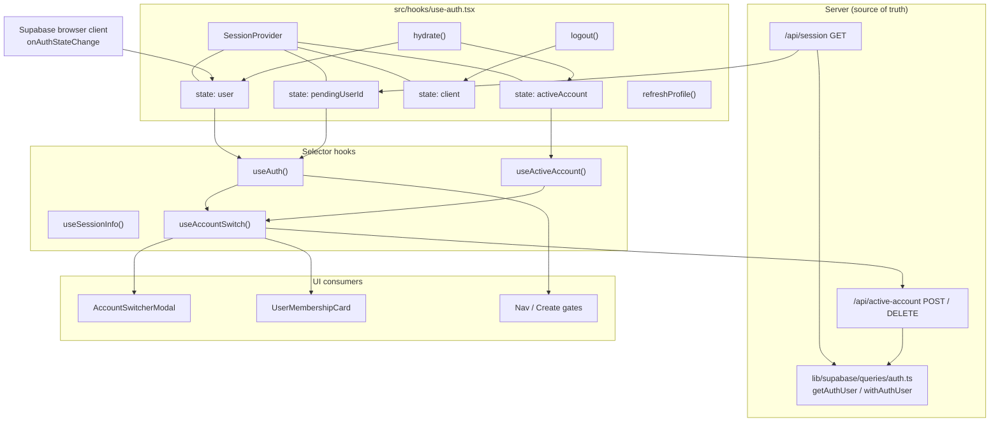
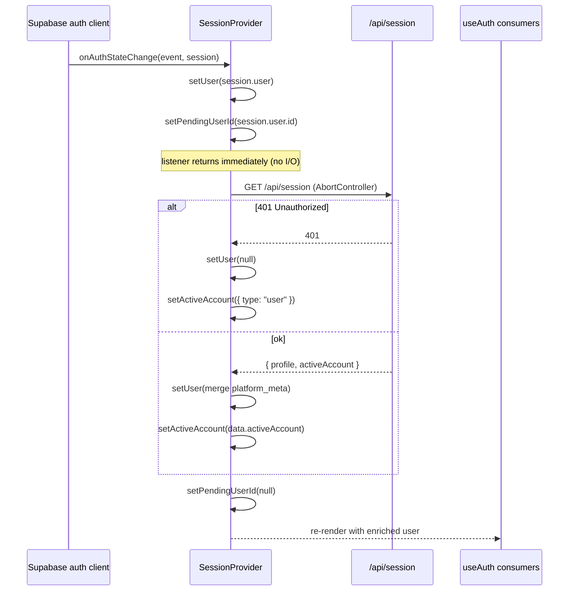
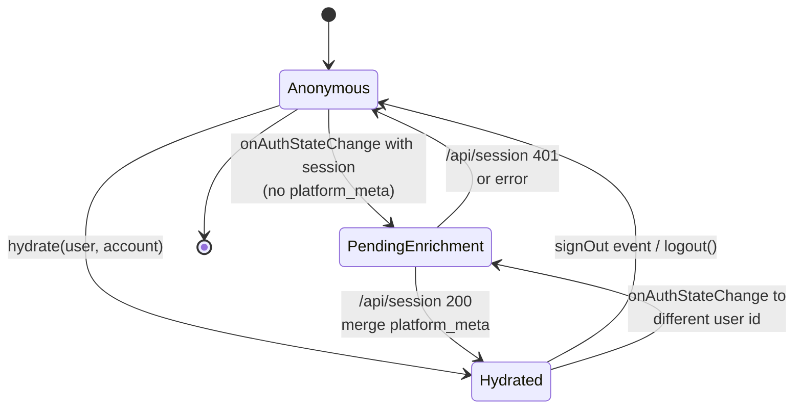
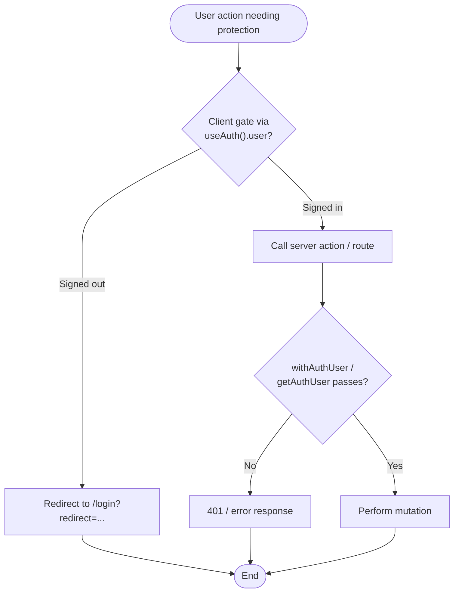

The client-side authentication surface of ozeaon-v2: a single unified `SessionProvider` context that owns identity, the active account, the browser Supabase client, and logout — exposed through the `useAuth`, `useActiveAccount`, and `useSessionInfo` selector hooks, plus the dedicated `useAccountSwitch` hook and the `AccountSwitcherModal` UI that drives personal-vs-organisation account switching.

## Purpose and Scope

This page documents how client-side session state is produced, consumed, and mutated:

- The `SessionProvider` context and its four invariants (`src/hooks/use-auth.tsx`).
- The three selector hooks `useAuth()`, `useActiveAccount()`, `useSessionInfo()` and why they exist separately.
- The enrichment round-trip to `/api/session` and the `pendingUserId` queueing mechanism.
- The `useAccountSwitch()` hook and its `switchToOrg` / `switchToUser` actions.
- The `AccountSwitcherModal` component and the `AccountCard` presentation primitive.
- The ESLint rule that bans raw `client.auth.getSession()` reads.

**Out of scope / sibling topics.** Server-side authorization (`withAuthUser`, `getAuthUser`) is documented on the server-auth page — this page only explains the client's relationship to it (invariant #1: the client is cosmetic). Supabase auth *actions* (`login`, `signOut`, `signOutNoRedirect`) live with the login flow. The `/api/session` and `/api/active-account` route handlers are described here only to the extent the client depends on their contract.

> **Note on verification.** The source-discovery budget for this page allowed reading `src/hooks/use-auth.tsx` and `src/components/nav/components/AccountSwitcherModal.tsx` in full, plus grep-level evidence for `src/hooks/use-account-switch.ts`, `src/hooks/index.ts`, `src/components/organizations/cards/UserMembershipCard.tsx`, and `eslint.rules.auth.mjs`. The bodies of `/api/session` and `/api/active-account` route handlers were not readable within budget, so their contracts are described from the client code that calls them and explicitly flagged where uncertain.

## Overview

Before the refactor described in `docs/ssr/auth-session-refactor.md`, client session state was split and unreliable: `useAuth().user` was unvalidated display state read from the local JWT with no backend verification, and it *polled* rather than *listened*.

The current design consolidates everything into one provider and states four invariants directly in the source as JSDoc:

1. **The server is the only source of truth for authorization.** Every mutation and protected read re-checks server-side via `withAuthUser` / server `getAuthUser`. The ~12 client gates that read `user` are *cosmetic*.
2. **`user` is display state only.** It is derived from the local JWT via `onAuthStateChange`, and server-validated via `hydrate` on login and on PPR routes. You must never make a security decision based on it.
3. **Hydrated, then event-synced — never polled.** There is no `getSession()` on navigation; `INITIAL_SESSION` provides the first read.
4. **No auth reads in layouts/providers above content that could be static.** Auth enters the tree via this client provider, or a suspended server leaf (`AuthHydrator`) on PPR routes — never the root layout.

```tsx
/**
 * Unified session context — the single source of CLIENT-SIDE session state
 * (identity + active account + the browser Supabase client + logout).
 *
 * INVARIANTS — do not break:
 * 1. The SERVER is the only source of truth for AUTHORIZATION. Every mutation
 *    and protected read re-checks server-side (`withAuthUser` / server
 *    `getAuthUser`). The 12 client gates that read `user` are cosmetic.
 * 2. `user` here is DISPLAY state only. Today it is derived from the local JWT
 *    (`onAuthStateChange`); on login and on PPR routes it is server-validated
 *    via `hydrate`. NEVER make a security decision based on it.
 * 3. Hydrated, then event-synced — NEVER polled. There is no `getSession()` on
 *    navigation; `INITIAL_SESSION` provides the first read.
 * 4. No auth reads in layouts/providers above content that could be static.
 *    Auth enters the tree via this client provider today, or a suspended server
 *    leaf (AuthHydrator) on PPR routes — never the root layout.
 */
```

> Source: [use-auth.tsx](https://github.com/ozeaon/ozeaon-v2/blob/0a4f1a95824db87782f1221a4108019d174df3d9/src/hooks/use-auth.tsx#L23-L39)

The architectural consequence is that the client session layer is *advisory*. It exists to render the correct chrome (avatars, dropdown state, the active org badge, which Create entry points to show) and to make session-dependent UI respond instantly to auth events — while final authority always rests on a server re-check.

## Architecture

The session layer sits between Supabase's browser client and the React component tree. Two independent data paths feed the one context: a **server-injected path** (`hydrate`) and an **event-driven path** (`onAuthStateChange` → enrichment fetch).



The provider is the only place that touches React state for session data; the hooks are thin projections. This is deliberate — keeping `useAuth()` and `useActiveAccount()` as *separate selectors over one context* bounds call-site churn across roughly fourteen consumers, rather than forcing every consumer to migrate to a new API shape.

> Source: [use-auth.tsx](https://github.com/ozeaon/ozeaon-v2/blob/0a4f1a95824db87782f1221a4108019d174df3d9/src/hooks/use-auth.tsx#L40-L60)

## The SessionContextValue Contract

The context value is a small, deliberately closed surface:

```tsx
type SessionContextValue = {
  /** Display identity — UI only, never an authorization decision (invariant #2). */
  user: AuthUser | null;
  activeAccount: ActiveAccount;
  client: SupabaseClient | null;
  /** Inject server-validated session (login success / PPR AuthHydrator). */
  hydrate: (user: AuthUser, activeAccount?: ActiveAccount) => void;
  setActiveAccount: Dispatch<SetStateAction<ActiveAccount>>;
  logout: () => Promise<void>;
  refreshProfile: () => Promise<void>;
};
```

> Source: [use-auth.tsx](https://github.com/ozeaon/ozeaon-v2/blob/0a4f1a95824db87782f1221a4108019d174df3d9/src/hooks/use-auth.tsx#L40-L50)

| Member | Type | Purpose |
|--------|------|---------|
| `user` | `AuthUser \| null` | Display identity. `null` when signed out. Populated from JWT then enriched. |
| `activeAccount` | `ActiveAccount` | Which identity context is active. Defaults to `{ type: "user" }`. |
| `client` | `SupabaseClient \| null` | The browser client. `null` until a client-only `useEffect` runs. |
| `hydrate` | `(user, activeAccount?) => void` | Server-injection API. Bypasses enrichment. |
| `setActiveAccount` | `Dispatch<SetStateAction<ActiveAccount>>` | Raw setter, used by `useAccountSwitch`. |
| `logout` | `() => Promise<void>` | Signs out of both client and server, resets state, redirects home. |
| `refreshProfile` | `() => Promise<void>` | Re-reads `user_profiles` and re-merges into `user.platform_meta`. |

The `client` member being nullable is intentional: the browser client is created inside a `useEffect` so that no auth network call occurs during SSR.

```tsx
// Browser client only on the client — avoids an SSR-time auth network call.
useEffect(() => {
  setClient(createBrowserClient());
}, []);
```

> Source: [use-auth.tsx](https://github.com/ozeaon/ozeaon-v2/blob/0a4f1a95824db87782f1221a4108019d174df3d9/src/hooks/use-auth.tsx#L74-L77)

## Identity Population: Two Paths Into One Context

### Path A — Server injection via `hydrate`

`hydrate` is the authoritative fast path. It sets the user, optionally the account, and crucially clears `pendingUserId` — signalling that no enrichment is required because the caller already supplied the fully-validated profile plus active account.

```tsx
// Inject server-validated session (login / PPR AuthHydrator). No enrichment
// needed: the caller already supplies the full profile + active account.
const hydrate = useCallback(
  (nextUser: AuthUser, nextAccount?: ActiveAccount) => {
    setUser(nextUser);
    if (nextAccount) setActiveAccount(nextAccount);
    setPendingUserId(null);
  },
  [],
);
```

> Source: [use-auth.tsx](https://github.com/ozeaon/ozeaon-v2/blob/0a4f1a95824db87782f1221a4108019d174df3d9/src/hooks/use-auth.tsx#L79-L88)

The documented consumer pattern is a tiny client leaf that reads the server value and pushes it in:

```tsx
import { useEffect } from "react";
import { useAuth } from "@/hooks";
import type { AuthUser } from "@/types";

// ... inside a client component receiving server props:
const { hydrate } = useAuth();
useEffect(() => { hydrate(user, activeAccount); }, [hydrate, user, activeAccount]);
```

> Source: [auth-session-refactor.md](https://github.com/ozeaon/ozeaon-v2/blob/0a4f1a95824db87782f1221a4108019d174df3d9/docs/ssr/auth-session-refactor.md#L148-L156)

### Path B — Event-driven via `onAuthStateChange`

The listener is registered once per client instance. It is strictly synchronous state work — **no database or network operations** — because of a known Supabase behaviour (`auth-js` issue #762) where async work inside the listener hangs the listener.

```tsx
useEffect(() => {
  if (!client) return;
  const {
    data: { subscription },
  } = client.auth.onAuthStateChange((_event, session) => {
    if (session?.user) {
      setUser((current) => {
        // Already have this fully-enriched user (e.g. server-hydrated on
        // login) — keep it, don't re-trigger enrichment.
        if (current?.id === session.user.id && current.platform_meta) {
          return current;
        }
        setPendingUserId(session.user.id);
        return session.user as AuthUser;
      });
    } else {
      setUser(null);
      setActiveAccount({ type: "user" });
      setPendingUserId(null);
    }
  });
  return () => subscription.unsubscribe();
}, [client]);
```

> Source: [use-auth.tsx](https://github.com/ozeaon/ozeaon-v2/blob/0a4f1a95824db87782f1221a4108019d174df3d9/src/hooks/use-auth.tsx#L90-L115)

Two design decisions are visible here:

- **Idempotence guard.** If the current user has the same `id` *and* already carries `platform_meta`, the enriched object is returned unchanged. Without this, a login that was already server-hydrated would immediately trigger a redundant enrichment fetch.
- **The pending queue.** Instead of awaiting a fetch inside the listener, the listener records `session.user.id` into `pendingUserId`. A *separate* effect reacts to that state change and performs the network work. This is the core of the "no DB ops in the listener" rule.

## Enrichment: One Server-Validated Round-Trip

The enrichment effect fires whenever `pendingUserId` becomes non-null. It performs a single `GET /api/session` that returns both the profile and the active account, replacing what used to be two separate client-side calls (a browser-client profile query and a `/api/active-account` GET).



```tsx
// Enrichment: one server-validated round-trip for profile + active account.
// Separate from the listener (issue #762). Replaces the browser-client
// profile query and the `/api/active-account` GET.
useEffect(() => {
  if (!pendingUserId) return;
  const controller = new AbortController();
  void (async () => {
    try {
      const res = await fetch("/api/session", { signal: controller.signal });
      if (res.status === 401) {
        setUser(null);
        setActiveAccount({ type: "user" });
        setPendingUserId(null);
        return;
      }
      if (!res.ok) {
        setPendingUserId(null);
        return;
      }
      const data = (await res.json()) as SessionBootstrap;
      setUser((current) =>
        current && current.id === pendingUserId
          ? { ...current, platform_meta: data.profile ?? null }
          : current,
      );
      setActiveAccount(data.activeAccount);
      setPendingUserId(null);
    } catch (err) {
      if (err instanceof Error && err.name === "AbortError") return;
      setPendingUserId(null);
    }
  })();
  return () => controller.abort();
}, [pendingUserId]);
```

> Source: [use-auth.tsx](https://github.com/ozeaon/ozeaon-v2/blob/0a4f1a95824db87782f1221a4108019d174df3d9/src/hooks/use-auth.tsx#L117-L150)

The response shape is typed narrowly:

```tsx
type SessionBootstrap = {
  profile: AuthUser["platform_meta"];
  activeAccount: ActiveAccount;
};
```

> Source: [use-auth.tsx](https://github.com/ozeaon/ozeaon-v2/blob/0a4f1a95824db87782f1221a4108019d174df3d9/src/hooks/use-auth.tsx#L52-L55)

## Session Lifecycle State Machine

The interplay of `user`, `activeAccount`, and `pendingUserId` forms a small state machine worth making explicit:



| State | `user` | `pendingUserId` | `activeAccount` |
|-------|--------|-----------------|-----------------|
| Anonymous | `null` | `null` | `{ type: "user" }` |
| PendingEnrichment | JWT user, no `platform_meta` | session user id | previous value |
| Hydrated | full user with `platform_meta` | `null` | server-provided or previous |

The `PENDING → Hydrated` transition is the only one that performs I/O. Note that a switch to a *different* user id (multi-tab sign-out / sign-in) re-enters `PendingEnrichment` because the idempotence guard compares `current?.id === session.user.id`.

## Account Switching

Account switching is a **separate concern from identity**. The signed-in `user` never changes; only `activeAccount` does. This keeps a single auth session while letting the same human operate under a personal context or an organisation context.

`useAccountSwitch` is explicitly described as the single source of the switch: one fetch, one error parse, one client-state update.

```ts
// Single source of the account switch: one fetch, one error parse, one client-state update.
export function useAccountSwitch() {
  const { setActiveAccount } = useActiveAccount();

  const switchToOrg = useCallback(
    async (orgId: string): Promise<ActiveAccount> => {
      // ...
    },
    // ...
  );

  const switchToUser = useCallback(async (): Promise<ActiveAccount> => {
    const account = await requestAccountSwitch({ method: "DELETE" });
    // ...
  });

  return { switchToOrg, switchToUser };
}
```

> Source: [use-account-switch.ts](https://github.com/ozeaon/ozeaon-v2/blob/0a4f1a95824db87782f1221a4108019d174df3d9/src/hooks/use-account-switch.ts#L16-L40)

Both actions return `Promise<ActiveAccount>` — the caller receives the authoritative account object that the client state was set to. `switchToOrg(orgId)` issues the switch with a body/param carrying the org id; `switchToUser()` is the revert path and is implemented as a **`DELETE`** against the same endpoint (matching the documented split: "POST/DELETE kept (org switch / revert)").

> The internal `requestAccountSwitch` helper referenced by both callbacks was not readable within the source budget. Its observable contract is inferred from the call sites: it takes an init object with a `method`, and returns the new `ActiveAccount`. Treat the HTTP details below as the contract the client relies on rather than a verbatim route listing.

### Consuming the switch hook

`UserMembershipCard` shows the canonical "enter an org" pattern — switch, then navigate:

| Step | Detail |
|------|--------|
| Import | `useAccountSwitch, useAsyncAction` from `@/hooks` ([UserMembershipCard.tsx](https://github.com/ozeaon/ozeaon-v2/blob/0a4f1a95824db87782f1221a4108019d174df3d9/src/components/organizations/cards/UserMembershipCard.tsx#L15)) |
| Destructure | `const { switchToOrg } = useAccountSwitch();` ([L29](https://github.com/ozeaon/ozeaon-v2/blob/0a4f1a95824db87782f1221a4108019d174df3d9/src/components/organizations/cards/UserMembershipCard.tsx#L29)) |
| Invoke | `await switchToOrg(orgId)` then `router.push("/settings")` ([L46-L47](https://github.com/ozeaon/ozeaon-v2/blob/0a4f1a95824db87782f1221a4108019d174df3d9/src/components/organizations/cards/UserMembershipCard.tsx#L46-L47)) |

### The AccountSwitcherModal component

`AccountSwitcherModal` is the primary UI entry point. It receives server-fetched organisation data as a **promise**, not an array, and unwraps it with React's `use()` inside a `<Suspense>` boundary.

Props:

| Prop | Type | Purpose |
|------|------|---------|
| `open` | `boolean` | Dialog open state (controlled). |
| `onOpenChange` | `(open: boolean) => void` | Close/notify callback. |
| `user` | `AuthUser` | Identity for the personal-account card. |
| `activeAccount` | `ActiveAccount` | Determines which card is marked active. |
| `adminOrgsPromise` | `Promise<AdminOrg[]>` | Orgs the user administers, streamed from the server. |

```tsx
type SwitcherProps = {
  open: boolean;
  onOpenChange: (open: boolean) => void;
  user: AuthUser;
  activeAccount: ActiveAccount;
  adminOrgsPromise: Promise<AdminOrg[]>;
};
```

> Source: [AccountSwitcherModal.tsx](https://github.com/ozeaon/ozeaon-v2/blob/0a4f1a95824db87782f1221a4108019d174df3d9/src/components/nav/components/AccountSwitcherModal.tsx#L74-L80)

Passing a promise (rather than awaiting server-side) lets the dialog shell, header, and "Add New Account" link render immediately while the org list resolves — the `Suspense` fallback is a single centred spinner:

```tsx
function AccountListFallback() {
  return (
    <div className="flex items-center justify-center py-8">
      <Loader2 size={20} className="text-muted animate-spin" />
    </div>
  );
}
```

> Source: [AccountSwitcherModal.tsx](https://github.com/ozeaon/ozeaon-v2/blob/0a4f1a95824db87782f1221a4108019d174df3d9/src/components/nav/components/AccountSwitcherModal.tsx#L135-L141)

The dialog is wrapped in a `ViewTransition` with the shared name `dialog-modal` (`share="morpg"`, plus an inline `viewTransitionName: "dialog-modal"`), so opening/closing the switcher participates in the app's view-transition morph.

> Source: [AccountSwitcherModal.tsx](https://github.com/ozeaon/ozeaon-v2/blob/0a4f1a95824db87782f1221a4108019d174df3d9/src/components/nav/components/AccountSwitcherModal.tsx#L90-L98)

### Switch execution and error handling

All switching logic funnels through a single `runSwitch` wrapper that owns the loading flag, the navigation refresh, the dialog close, and the error toast. Centralising it means every card type behaves identically under failure.

```tsx
const [switchingTo, setSwitchingTo] = useState<string | null>(null);

const displayName = user.platform_meta?.display_name ?? "User";
const email = user.email ?? undefined;
const avatarUrl = resolveUserAvatarUrl(user);
const isUserActive = activeAccount.type !== "org";

async function runSwitch(target: string, switching: () => Promise<unknown>) {
  setSwitchingTo(target);
  try {
    await switching();
    router.refresh();
    onOpenChange(false);
  } catch {
    toast.error("Failed to switch account");
  } finally {
    setSwitchingTo(null);
  }
}
```

> Source: [AccountSwitcherModal.tsx](https://github.com/ozeaon/ozeaon-v2/blob/0a4f1a95824db87782f1221a4108019d174df3d9/src/components/nav/components/AccountSwitcherModal.tsx#L154-L175)

Ordering matters in `runSwitch`: `router.refresh()` runs **before** `onOpenChange(false)`. The refresh re-runs server components against the new cookie/account so that server-rendered content already reflects the switch by the time the dialog closes — avoiding a visible flash of the previous account's data.

### AccountCard presentation primitive

`AccountCard` is a pure presentational button. Its interesting design choice is that the **active card is `disabled`** rather than merely styled, which both prevents a redundant switch and correctly removes it from the tab order.

```tsx
<button
  onClick={onClick}
  disabled={isActive || isSwitching}
  aria-current={isActive ? "true" : undefined}
  className={cn(
    "flex w-full items-center justify-between rounded-md border p-4 text-left transition-colors",
    "focus-visible:outline-none",
    isActive
      ? "border-border-focus cursor-default"
      : "border-border hover:border-border-strong",
    isSwitching && "cursor-default",
  )}
>
```

> Source: [AccountSwitcherModal.tsx](https://github.com/ozeaon/ozeaon-v2/blob/0a4f1a95824db87782f1221a4108019d174df3d9/src/components/nav/components/AccountSwitcherModal.tsx#L37-L49)

The right-hand slot is a three-way branch: a spinner while switching, a check badge when active, otherwise nothing.

```tsx
{isSwitching ? (
  <Loader2 size={16} className="text-muted shrink-0 animate-spin" />
) : isActive ? (
  <span
    aria-hidden
    className="bg-ozeaon-blue text-inverse flex size-4 shrink-0 items-center justify-center rounded-full"
  >
    <Check className="size-3" strokeWidth={3} />
  </span>
) : null}
```

> Source: [AccountSwitcherModal.tsx](https://github.com/ozeaon/ozeaon-v2/blob/0a4f1a95824db87782f1221a4108019d174df3d9/src/components/nav/components/AccountSwitcherModal.tsx#L60-L69)

### Active-state detection

The org list and the personal card derive their active state from different predicates, which is why the split is visible in the code:

- Organisation card: `activeAccount.type === "org" && activeAccount.id === org.id` — requires both a type match and an id match.
- Personal card: `isUserActive = activeAccount.type !== "org"` — a *negative* test. Any non-org account resolves to the personal card, so an unset or unexpected account type safely falls back to the user's own account.

```tsx
{adminOrgs.map((org) => (
  <AccountCard
    key={org.id}
    avatar={
      <UserAvatar
        avatarUrl={getImageUrl(org.logo_path)}
        displayName={org.name}
        size="sm"
      />
    }
    name={org.name}
    subtitle="Organisation"
    isActive={activeAccount.type === "org" && activeAccount.id === org.id}
    isSwitching={switchingTo === org.id}
    onClick={() => void runSwitch(org.id, () => switchToOrg(org.id))}
  />
))}
```

> Source: [AccountSwitcherModal.tsx](https://github.com/ozeaon/ozeaon-v2/blob/0a4f1a95824db87782f1221a4108019d174df3d9/src/components/nav/components/AccountSwitcherModal.tsx#L179-L195)

The `switchingTo` sentinel is a `string | null` where the personal account is tracked by the literal `"user"`, giving every row a unique in-flight key without a separate boolean.

```tsx
onClick={() => void runSwitch("user", switchToUser)}
```

> Source: [AccountSwitcherModal.tsx](https://github.com/ozeaon/ozeaon-v2/blob/0a4f1a95824db87782f1221a4108019d174df3d9/src/components/nav/components/AccountSwitcherModal.tsx#L209)

## Selector Hooks and the Barrel Export

The three selectors are intentionally narrow projections of the single context. Their JSDoc states the division of responsibility explicitly:

```tsx
function useSession() {
  const ctx = useContext(SessionContext);
  if (!ctx) throw new Error("useSession must be used within SessionProvider");
  return ctx;
}

/** Identity + browser client + session actions. `user` is display-only (invariant #2). */
export function useAuth() {
  const { user, client, hydrate, logout, refreshProfile } = useSession();
  return { user, client, hydrate, logout, refreshProfile };
}

/** Active account (personal vs org) + switch/logout actions. */
export function useActiveAccount() {
  const { activeAccount, setActiveAccount, logout } = useSession();
  return { activeAccount, setActiveAccount, logout };
}

export function useSessionInfo() {
  const { user, activeAccount } = useSession();
  return { user, activeAccount };
}
```

> Source: [use-auth.tsx](https://github.com/ozeaon/ozeaon-v2/blob/0a4f1a95824db87782f1221a4108019d174df3d9/src/hooks/use-auth.tsx#L199-L220)

| Hook | Returns | Typical consumer |
|------|---------|------------------|
| `useAuth()` | `user`, `client`, `hydrate`, `logout`, `refreshProfile` | Nav gates, Create entry points, `AuthHydrator`, `UserDropdown` |
| `useActiveAccount()` | `activeAccount`, `setActiveAccount`, `logout` | `CreatePostForm`, `DashboardSidebar`, `DashboardNavSlot`, `AccountSwitcherModal` |
| `useSessionInfo()` | `user`, `activeAccount` | Read-only combined views |
| `useAccountSwitch()` | `switchToOrg`, `switchToUser` | `AccountSwitcherModal`, `UserMembershipCard` |

Note that `logout` appears in **both** `useAuth()` and `useActiveAccount()` — a deliberate convenience so that consumers already holding one hook do not need to import the other just to sign out. `setActiveAccount` is exposed from `useActiveAccount()` specifically so `useAccountSwitch` can write the new account after its fetch resolves.

`useSession` itself is **not exported**; it is module-private. The guard throws if the context is missing, turning a misplaced provider into an immediate, diagnosable error rather than silent `undefined` propagation:

```
useSession must be used within SessionProvider
```

> Source: [use-auth.tsx](https://github.com/ozeaon/ozeaon-v2/blob/0a4f1a95824db87782f1221a4108019d174df3d9/src/hooks/use-auth.tsx#L201)

Public surface is re-exported through the barrel at `src/hooks/index.ts`:

```ts
export { useAccountSwitch } from "./use-account-switch";
```

> Source: [index.ts](https://github.com/ozeaon/ozeaon-v2/blob/0a4f1a95824db87782f1221a4108019d174df3d9/src/hooks/index.ts#L7)

This is why consumers write `import { useAuth } from "@/hooks"` and `import { useAccountSwitch } from "@/hooks"` rather than reaching into individual files. The refactor deliberately **redirected** `useActiveAccount` consumers through this barrel (CreatePostForm, DashboardSidebar, DashboardNavSlot, AccountSwitcherModal) and moved `UserDropdown` onto the provider's `logout`.

> Source: [auth-session-refactor.md](https://github.com/ozeaon/ozeaon-v2/blob/0a4f1a95824db87782f1221a4108019d174df3d9/docs/ssr/auth-session-refactor.md#L105)

## Usage Examples

### Reading identity in a component

```tsx
import { useAuth } from "@/hooks";
import { env, IMAGE_CONFIG } from "@/config";
```

> Source: [CLAUDE.md](https://github.com/ozeaon/ozeaon-v2/blob/0a4f1a95824db87782f1221a4108019d174df3d9/CLAUDE.md#L151-L152)

### Injecting a server-validated session (PPR / AuthHydrator)

```tsx
import { useEffect } from "react";
import { useAuth } from "@/hooks";
import type { AuthUser } from "@/types";

// component receives { user: AuthUser; activeAccount: ActiveAccount }
const { hydrate } = useAuth();
useEffect(() => { hydrate(user, activeAccount); }, [hydrate, user, activeAccount]);
```

> Source: [auth-session-refactor.md](https://github.com/ozeaon/ozeaon-v2/blob/0a4f1a95824db87782f1221a4108019d174df3d9/docs/ssr/auth-session-refactor.md#L148-L156)

### Switching account from a membership card

```tsx
import { useAccountSwitch, useAsyncAction } from "@/hooks";
// ...
const { switchToOrg } = useAccountSwitch();
// ...
    await switchToOrg(orgId);
    router.push("/settings");
```

> Source: [UserMembershipCard.tsx](https://github.com/ozeaon/ozeaon-v2/blob/0a4f1a95824db87782f1221a4108019d174df3d9/src/components/organizations/cards/UserMembershipCard.tsx#L15-L47)

### Gating a Create entry point

The login-redirect convention for Create entry points uses `useAuth()` as a two-line branch at each call site — the project explicitly decided a shared hook was not worth the abstraction cost:

> Every Create entry point (MegaMenu create rows, `MobileFloatingCreate`, sidebar Create dropdowns) must send visitors to `/login?redirect=<target-create-path>` rather than `/login`. Signed-in users go straight to the target. Detection uses the existing `useAuth()` hook.

> Source: [DESIGN-CONSISTENCY-PLAN.md](https://github.com/ozeaon/ozeaon-v2/blob/0a4f1a95824db87782f1221a4108019d174df3d9/DESIGN-CONSISTENCY-PLAN.md#L459)

## Configuration Options

| Option | Type | Default | Description |
|--------|------|---------|-------------|
| `activeAccount` initial state | `ActiveAccount` | `{ type: "user" }` | Personal account is the default before any server value arrives ([use-auth.tsx#L64-L66](https://github.com/ozeaon/ozeaon-v2/blob/0a4f1a95824db87782f1221a4108019d174df3d9/src/hooks/use-auth.tsx#L64-L66)) |
| `client` initial state | `SupabaseClient \| null` | `null` | Browser client is created in a `useEffect` to avoid SSR-time auth calls ([use-auth.tsx#L74-L77](https://github.com/ozeaon/ozeaon-v2/blob/0a4f1a95824db87782f1221a4108019d174df3d9/src/hooks/use-auth.tsx#L74-L77)) |
| Active-account cookie | cookie | — | `oz_active_account`, managed by `src/utils/data/active-account.ts` ([auth-session-refactor.md#L225](https://github.com/ozeaon/ozeaon-v2/blob/0a4f1a95824db87782f1221a4108019d174df3d9/docs/ssr/auth-session-refactor.md#L225)) |
| Enrichment endpoint | path | `/api/session` | Single round-trip returning `{ profile, activeAccount }` |
| Switch endpoint | path | `/api/active-account` | `POST` to switch to org, `DELETE` to revert to personal |

## API Reference

### `SessionProvider({ children })`

Client component that owns all session state and provides `SessionContext`.

**Props:** `children: React.ReactNode`

**Side effects:** creates the browser client; subscribes to `onAuthStateChange`; performs the `/api/session` enrichment fetch when `pendingUserId` is set; aborts in-flight enrichment on unmount or when `pendingUserId` changes.

> Source: [use-auth.tsx](https://github.com/ozeaon/ozeaon-v2/blob/0a4f1a95824db87782f1221a4108019d174df3d9/src/hooks/use-auth.tsx#L61-L197)

### `hydrate(nextUser: AuthUser, nextAccount?: ActiveAccount): void`

Injects a server-validated session. Clears `pendingUserId` so no enrichment fetch occurs. Stable across renders (`useCallback` with empty deps).

**Parameters**
- `nextUser` (`AuthUser`): the server-validated user, including `platform_meta`.
- `nextAccount` (`ActiveAccount`, optional): the server-resolved active account. If omitted, the current `activeAccount` is preserved.

> Source: [use-auth.tsx](https://github.com/ozeaon/ozeaon-v2/blob/0a4f1a95824db87782f1221a4108019d174df3d9/src/hooks/use-auth.tsx#L81-L88)

### `logout(): Promise<void>`

Signs out of the Supabase browser client (if present), calls the server action `signOutNoRedirect`, resets `user` to `null` and `activeAccount` to `{ type: "user" }`, then `router.refresh()` and `router.push("/")`.

**Throws:** does not catch; errors from `client.auth.signOut()` or `signOutNoRedirect()` propagate to the caller.

> Source: [use-auth.tsx](https://github.com/ozeaon/ozeaon-v2/blob/0a4f1a95824db87782f1221a4108019d174df3d9/src/hooks/use-auth.tsx#L152-L159)

### `refreshProfile(): Promise<void>`

Re-reads the current user's `user_profiles` row (joining `avatar_image` and `cover_image` via the `images` relation) and merges the result into `user.platform_meta`. No-ops if there is no `user?.id` or no `client`. Errors are caught and logged via `logError` with `{ userId }` context rather than thrown.

> Source: [use-auth.tsx](https://github.com/ozeaon/ozeaon-v2/blob/0a4f1a95824db87782f1221a4108019d174df3d9/src/hooks/use-auth.tsx#L161-L179)

### `switchToOrg(orgId: string): Promise<ActiveAccount>`

**Parameters:** `orgId: string` — the organisation to activate.
**Returns:** the new `ActiveAccount`.
**Behaviour:** performs the switch request, then updates `activeAccount` via `setActiveAccount`.

> Source: [use-account-switch.ts](https://github.com/ozeaon/ozeaon-v2/blob/0a4f1a95824db87782f1221a4108019d174df3d9/src/hooks/use-account-switch.ts#L20-L32)

### `switchToUser(): Promise<ActiveAccount>`

Takes no arguments. Issues the revert request with `method: "DELETE"`.
**Returns:** the new `ActiveAccount`.

> Source: [use-account-switch.ts](https://github.com/ozeaon/ozeaon-v2/blob/0a4f1a95824db87782f1221a4108019d174df3d9/src/hooks/use-account-switch.ts#L33-L38)

### `AccountSwitcherModal(props)`

Renders the switch dialog: administered orgs from `adminOrgsPromise`, the personal account card, and an "Add New Account" link to `/organizations/new` that closes the dialog on click.

> Source: [AccountSwitcherModal.tsx](https://github.com/ozeaon/ozeaon-v2/blob/0a4f1a95824db87782f1221a4108019d174df3d9/src/components/nav/components/AccountSwitcherModal.tsx#L82-L133)

## Failure Modes, Edge Cases & Concurrency

| Scenario | Handling | Location |
|----------|----------|----------|
| `/api/session` returns **401** | `user` → `null`, `activeAccount` → `{ type: "user" }`, `pendingUserId` → `null`. The client treats an unauthorized enrichment as a signed-out state. | [use-auth.tsx#L126-L131](https://github.com/ozeaon/ozeaon-v2/blob/0a4f1a95824db87782f1221a4108019d174df3d9/src/hooks/use-auth.tsx#L126-L131) |
| `/api/session` returns other non-OK | `pendingUserId` cleared; **`user` is left as the bare JWT user without `platform_meta`**. UI that reads `platform_meta` must tolerate absence (e.g. `user.platform_meta?.display_name ?? "User"`). | [use-auth.tsx#L132-L135](https://github.com/ozeaon/ozeaon-v2/blob/0a4f1a95824db87782f1221a4108019d174df3d9/src/hooks/use-auth.tsx#L132-L135) |
| Fetch throws | `AbortError` is swallowed (expected on navigation/unmount); any other error clears `pendingUserId` silently. | [use-auth.tsx#L144-L147](https://github.com/ozeaon/ozeaon-v2/blob/0a4f1a95824db87782f1221a4108019d174df3d9/src/hooks/use-auth.tsx#L144-L147) |
| Stale enrichment response | The `setUser` merge is guarded by `current && current.id === pendingUserId`, so a response for a superseded user id cannot overwrite the newer user. | [use-auth.tsx#L137-L141](https://github.com/ozeaon/ozeaon-v2/blob/0a4f1a95824db87782f1221a4108019d174df3d9/src/hooks/use-auth.tsx#L137-L141) |
| Rapid auth events | Each `pendingUserId` change runs the effect cleanup, aborting the previous request via `AbortController`. | [use-auth.tsx#L149](https://github.com/ozeaon/ozeaon-v2/blob/0a4f1a95824db87782f1221a4108019d174df3d9/src/hooks/use-auth.tsx#L149) |
| Redundant enrichment after hydration | The listener short-circuits when `current?.id === session.user.id && current.platform_meta`. | [use-auth.tsx#L100-L104](https://github.com/ozeaon/ozeaon-v2/blob/0a4f1a95824db87782f1221a4108019d174df3d9/src/hooks/use-auth.tsx#L100-L104) |
| Listener hang | All async/DB work is kept outside `onAuthStateChange` (auth-js issue #762) — the listener only calls `setState`. | [use-auth.tsx#L69-L72](https://github.com/ozeaon/ozeaon-v2/blob/0a4f1a95824db87782f1221a4108019d174df3d9/src/hooks/use-auth.tsx#L69-L72) |
| Switch failure | `runSwitch` catches, shows `toast.error("Failed to switch account")`, and resets `switchingTo`. The dialog stays open so the user can retry. | [AccountSwitcherModal.tsx#L164-L175](https://github.com/ozeaon/ozeaon-v2/blob/0a4f1a95824db87782f1221a4108019d174df3d9/src/components/nav/components/AccountSwitcherModal.tsx#L164-L175) |
| Double switch | The active card is `disabled` and all cards are disabled while any switch is in flight (`disabled={isActive \|\| isSwitching}`). | [AccountSwitcherModal.tsx#L40](https://github.com/ozeaon/ozeaon-v2/blob/0a4f1a95824db87782f1221a4108019d174df3d9/src/components/nav/components/AccountSwitcherModal.tsx#L40) |
| Missing provider | `useSession` throws `useSession must be used within SessionProvider`. | [use-auth.tsx#L201](https://github.com/ozeaon/ozeaon-v2/blob/0a4f1a95824db87782f1221a4108019d174df3d9/src/hooks/use-auth.tsx#L201) |
| Profile refresh failure | Caught and logged, never thrown; `user.platform_meta` retains its previous value. | [use-auth.tsx#L176-L178](https://github.com/ozeaon/ozeaon-v2/blob/0a4f1a95824db87782f1221a4108019d174df3d9/src/hooks/use-auth.tsx#L176-L178) |

### The authorization boundary

The most important edge case is not a code path but a **policy**: invariant #1 states the client is never authoritative. Twelve client gates read `user` purely to decide what chrome to render; the real check happens server-side via `withAuthUser` / `getAuthUser`. Any new feature that needs to *protect* something must re-check on the server, because a client gate can be bypassed by anyone with a valid-but-stale JWT.



### Enforcement via ESLint

The "do not read the raw session" rule is machine-enforced, not just documented. A dedicated rule module bans direct `client.auth.getSession()` calls, and a `.tsx` warning variant is wired into `eslint.config.mjs`. A single documented exception exists for the best-effort call in `LoginForm` / `LoginPageForm`, marked with `// eslint-disable-next-line no-restricted-syntax`.

> Source: [auth-session-refactor.md](https://github.com/ozeaon/ozeaon-v2/blob/0a4f1a95824db87782f1221a4108019d174df3d9/docs/ssr/auth-session-refactor.md#L106)

The rule message states the rationale directly:

```js
message:
  "Don't read getSession() directly — it returns the UNVALIDATED local JWT. Use useAuth()/useActiveAccount() (SessionProvider) for client session state, or getAuthUser() server-side.",
```

> Source: [eslint.rules.auth.mjs](https://github.com/ozeaon/ozeaon-v2/blob/0a4f1a95824db87782f1221a4108019d174df3d9/eslint.rules.auth.mjs#L16-L17)

This is a meaningful safety net: `getSession()` returns the local JWT without backend verification, so any authorization logic built on it would be spoofable. Banning the call syntactically forces developers down the `useAuth()` (cosmetic) or `getAuthUser()` (authoritative) paths.

## Performance & Operational Notes

- **One round-trip per session change, not two.** The refactor replaced a browser-client profile query *plus* an `/api/active-account` GET with a single `/api/session` fetch returning both `profile` and `activeAccount`. Fewer requests also means fewer distinct server auth re-validations.
- **Zero auth reads on navigation.** Removing the `usePathname` poll was the primary performance win: previously every route change triggered a session check. Now reads happen only on mount (`INITIAL_SESSION`), on genuine auth events, and on explicit `hydrate`.
- **No SSR-time auth network call.** Deferring `createBrowserClient()` into a `useEffect` keeps the server render free of auth I/O.
- **Static-friendly placement.** Invariant #4 forbids auth reads in layouts/providers above potentially-static content. The root layout must stay static; auth enters via `SessionProvider` or a suspended `AuthHydrator` leaf on PPR routes.
- **Suspense-friendly org list.** `AccountSwitcherModal` accepts a promise, so the dialog's chrome streams in before the org query resolves.
- **Memoized context value.** `value` is wrapped in `useMemo` keyed on all seven members, so consumers do not re-render unless something they can observe actually changed.

```tsx
const value = useMemo<SessionContextValue>(
  () => ({
    user,
    activeAccount,
    client,
    hydrate,
    setActiveAccount,
    logout,
    refreshProfile,
  }),
  [user, activeAccount, client, hydrate, logout, refreshProfile],
);
```

> Source: [use-auth.tsx](https://github.com/ozeaon/ozeaon-v2/blob/0a4f1a95824db87782f1221a4108019d174df3d9/src/hooks/use-auth.tsx#L181-L192)

## Extension Points

| Extension | How | Caveat |
|-----------|-----|--------|
| Add a session field | Extend `SessionContextValue` and `SessionBootstrap`, then populate in the enrichment effect | Update the `useMemo` dependency list and the relevant selector |
| New account type | Extend `ActiveAccount` in `@/types/account` | `isUserActive = activeAccount.type !== "org"` treats every non-org type as personal — a new type silently maps to the personal card |
| New selector | Add a projection over `useSession()` rather than a new context | Keeps one state owner and bounds consumer churn |
| Bypass enrichment | Call `hydrate(user, activeAccount)` with server-validated data | Only from server-validated sources; do not pass unvalidated client data |
| Persist session server-side | The `/api/session` route is the single injection point for server-resolved profile + account | See the server-auth page for `withAuthUser` |

## Related Links

- [Session provider: src/hooks/use-auth.tsx](https://github.com/ozeaon/ozeaon-v2/blob/0a4f1a95824db87782f1221a4108019d174df3d9/src/hooks/use-auth.tsx)
- [Account switch hook: src/hooks/use-account-switch.ts](https://github.com/ozeaon/ozeaon-v2/blob/0a4f1a95824db87782f1221a4108019d174df3d9/src/hooks/use-account-switch.ts)
- [Hooks barrel: src/hooks/index.ts](https://github.com/ozeaon/ozeaon-v2/blob/0a4f1a95824db87782f1221a4108019d174df3d9/src/hooks/index.ts)
- [Switcher modal: src/components/nav/components/AccountSwitcherModal.tsx](https://github.com/ozeaon/ozeaon-v2/blob/0a4f1a95824db87782f1221a4108019d174df3d9/src/components/nav/components/AccountSwitcherModal.tsx)
- [Membership card consumer: src/components/organizations/cards/UserMembershipCard.tsx](https://github.com/ozeaon/ozeaon-v2/blob/0a4f1a95824db87782f1221a4108019d174df3d9/src/components/organizations/cards/UserMembershipCard.tsx)
- [Auth ESLint rule: eslint.rules.auth.mjs](https://github.com/ozeaon/ozeaon-v2/blob/0a4f1a95824db87782f1221a4108019d174df3d9/eslint.rules.auth.mjs)
- [Design document: docs/ssr/auth-session-refactor.md](https://github.com/ozeaon/ozeaon-v2/blob/0a4f1a95824db87782f1221a4108019d174df3d9/docs/ssr/auth-session-refactor.md)
