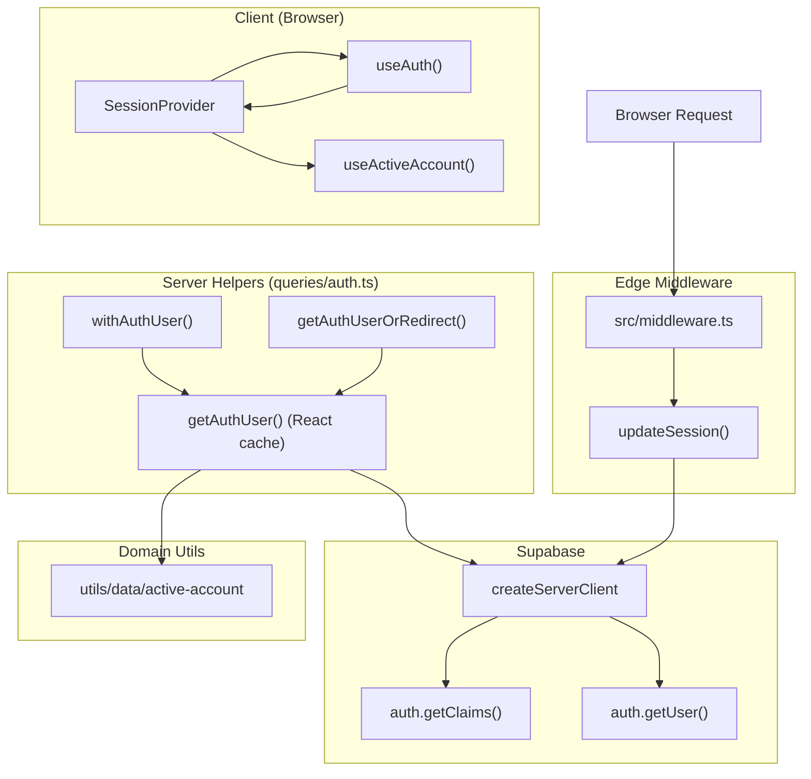
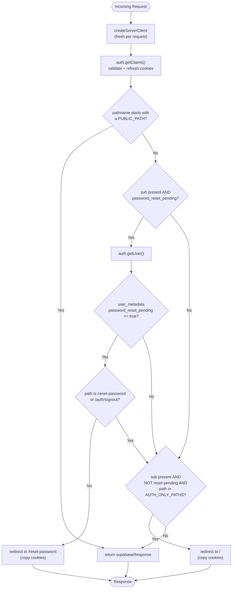
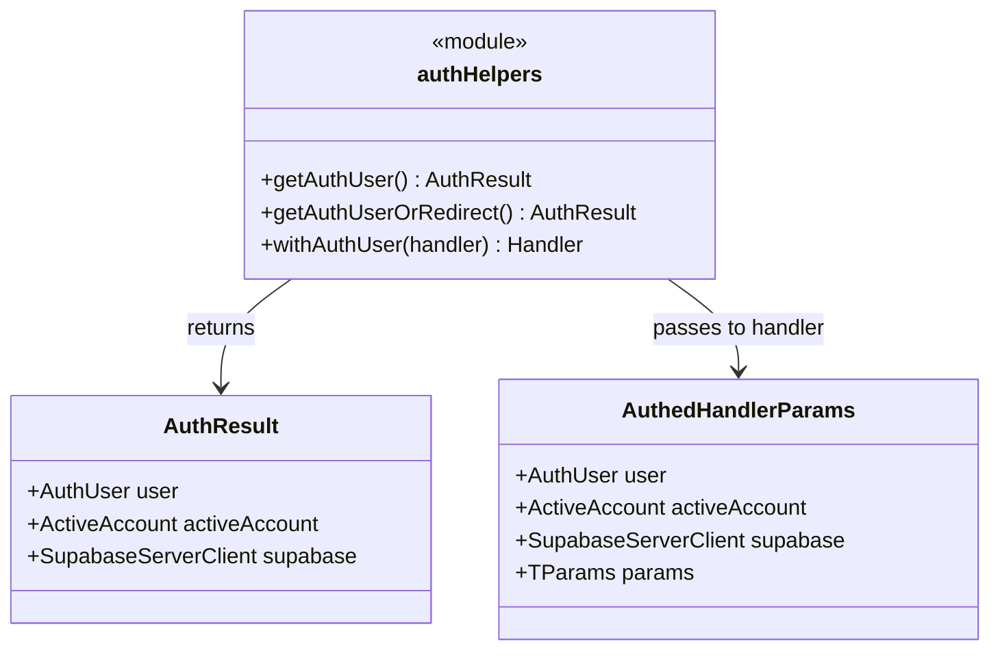
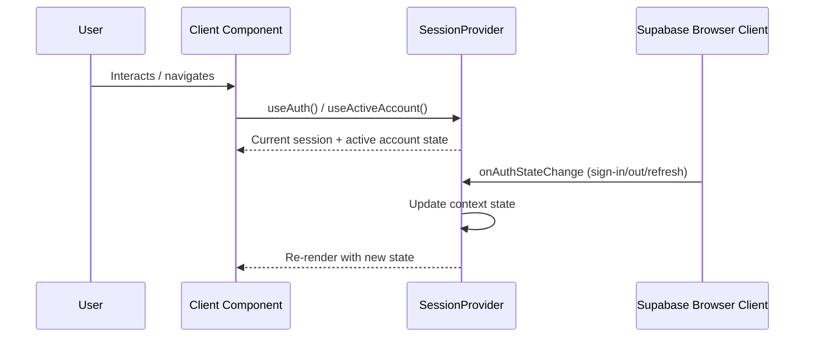

This page documents how the OZEAON V2 platform manages Supabase authentication sessions and protects routes — from the edge middleware that refreshes and validates tokens on every request, through the server-side `getAuthUser()` / `getAuthUserOrRedirect()` / `withAuthUser()` helpers, to the client-side `SessionProvider` hooks and the ESLint guardrails that enforce safe session access patterns.

## Purpose and Scope

This page covers the **session lifecycle and route protection mechanisms** of the application:

- The Next.js edge middleware (`src/middleware.ts` → `updateSession()`) that runs on every request, refreshes the Supabase session cookies, validates claims, and performs redirect-based route protection.
- The server-side auth query helpers in `src/lib/supabase/queries/auth.ts` (`getAuthUser`, `getAuthUserOrRedirect`, `withAuthUser`) that provide memoized, request-scoped access to the authenticated user and active account.
- The client-side session state surface (`SessionProvider`, `useAuth()`, `useActiveAccount()`) and the rule that direct `auth.getSession()` reads are forbidden.
- The ESLint rules in `eslint.rules.auth.mjs` that enforce these conventions.

**Out of scope (sibling topics):** The mechanics of login/logout flows, password reset, email verification, OAuth providers, and the account/organization switching domain belong to their own authentication pages. The broader SSR rendering and cache-components rules are documented separately (see `docs/ssr/*.md`). This page focuses on *how a session is read, validated, protected, and kept in sync* once a request is in flight.

## Overview

The platform is a Next.js App Router application on top of Supabase Auth. Because Supabase issues **short-lived JWTs stored in cookies**, session handling is fundamentally a *cookie synchronization* problem: the server components, route handlers, and the browser client all need to agree on the current token, and an expired token must be transparently refreshed without logging the user out.

Three concerns are handled in three distinct layers:

| Layer | File | Responsibility |
|-------|------|----------------|
| Edge middleware | [`src/middleware.ts`](https://github.com/ozeaon/ozeaon-v2/blob/0a4f1a95824db87782f1221a4108019d174df3d9/src/middleware.ts) → [`src/lib/supabase/middleware.ts`](https://github.com/ozeaon/ozeaon-v2/blob/0a4f1a95824db87782f1221a4108019d174df3d9/src/lib/supabase/middleware.ts) | Refresh cookies, validate claims, redirect for password-reset and auth-only pages |
| Server helpers | [`src/lib/supabase/queries/auth.ts`](https://github.com/ozeaon/ozeaon-v2/blob/0a4f1a95824db87782f1221a4108019d174df3d9/src/lib/supabase/queries/auth.ts) | Request-scoped, memoized auth reads; page redirects; route-handler wrapping |
| Client provider | `SessionProvider` / `useAuth()` / `useActiveAccount()` | Reactive session + active-account state in React |

A key design principle stated in the repository is that **auth must never be cached** — every auth helper reads cookies, so an auth read is inherently request-time and must live in a `<Suspense>`-wrapped leaf and can never go inside a `'use cache'` scope, because putting it in a layout or provider body would de-opt the whole subtree out of the shell.

> Source: [cache-components-model.md](https://github.com/ozeaon/ozeaon-v2/blob/0a4f1a95824db87782f1221a4108019d174df3d9/docs/ssr/cache-components-model.md#L21)

A second principle is **never read the unvalidated local JWT**. `supabase.auth.getSession()` returns the cookie-local token without verifying it against the auth server, so it is banned in favor of validated server helpers and reactive client hooks.

## Architecture

The following diagram shows the three layers of session handling and how a request flows through them.



**Layer roles:**

- **SessionProvider / useAuth / useActiveAccount** — the client-facing reactive surface for session and account-switching state, used by components that need to react to sign-in/out without a full reload.
- **Edge middleware (`updateSession`)** — the first server-side touchpoint on every request. It constructs a fresh `createServerClient`, runs `getClaims()`, and rewrites response cookies so the browser and server stay in sync.
- **Server helpers** — provide validated user identity to React Server Components and Route Handlers, with different contracts for pages (redirect) versus API routes (401 JSON).

## Edge Middleware: `updateSession()`

The middleware is the backbone of route protection. `src/middleware.ts` wires the Supabase handler into the LogTape context, and `updateSession()` in `src/lib/supabase/middleware.ts` does the real work.

```typescript
import { withContext } from "@logtape/logtape";
import { updateSession } from "@/lib/supabase/middleware";
import type { NextRequest } from "next/server";
```

> Source: [middleware.ts](https://github.com/ozeaon/ozeaon-v2/blob/0a4f1a95824db87782f1221a4108019d174df3d9/src/middleware.ts#L1-L3)

### Cookie synchronization contract

The handler creates a fresh server client on every request (never a module-global, because of Fluid compute), and it manipulates **two** cookie stores: the incoming `request.cookies` and the outgoing `supabaseResponse.cookies`. This is the critical mechanism that prevents random logouts.

```typescript
export async function updateSession(request: NextRequest) {
  let supabaseResponse = NextResponse.next({
    request,
  });

  // With Fluid compute, don't put this client in a global environment
  // variable. Always create a new one on each request.
  const supabase = createServerClient(
    process.env.NEXT_PUBLIC_SUPABASE_URL!,
    process.env.NEXT_PUBLIC_SUPABASE_PUBLISHABLE_KEY!,
    {
      cookies: {
        getAll() {
          return request.cookies.getAll();
        },
        setAll(cookiesToSet) {
          cookiesToSet.forEach(({ name, value }) =>
            request.cookies.set(name, value),
          );
          supabaseResponse = NextResponse.next({
            request,
          });
          cookiesToSet.forEach(({ name, value, options }) =>
            supabaseResponse.cookies.set(name, value, options),
          );
        },
      },
    },
  );
```

> Source: [middleware.ts](https://github.com/ozeaon/ozeaon-v2/blob/0a4f1a95824db87782f1221a4108019d174df3d9/src/lib/supabase/middleware.ts#L4-L32)

**Why two stores?** When Supabase refreshes a token, it calls `setAll()` with the new cookie values. The middleware writes them onto the *request* (so downstream server components in the same request see the refreshed token) **and** onto the *response* (so the browser stores the new token for the next request). If only one side were updated, the browser and server would drift out of sync and the session would terminate prematurely — a hazard called out explicitly in the source comments.

```typescript
  // IMPORTANT: You *must* return the supabaseResponse object as it is.
  // If you're creating a new response object with NextResponse.next() make sure to:
  // 1. Pass the request in it, like so:
  //    const myNewResponse = NextResponse.next({ request })
  // 2. Copy over the cookies, like so:
  //    myNewResponse.cookies.setAll(supabaseResponse.cookies.getAll())
  // 3. Change the myNewResponse object to fit your needs, but avoid changing
  //    the cookies!
  // 4. Finally:
  //    return myNewResponse
  // If this is not done, you may be causing the browser and server to go out
  // of sync and terminate the user's session prematurely!
  return supabaseResponse;
```

> Source: [middleware.ts](https://github.com/ozeaon/ozeaon-v2/blob/0a4f1a95824db87782f1221a4108019d174df3d9/src/lib/supabase/middleware.ts#L93-L105)

### The `getClaims()` requirement

Immediately after `createServerClient`, the middleware calls `getClaims()`. The source is emphatic that **no other code may run between client creation and `getClaims()`**, because a mistake there causes hard-to-debug random logouts. `getClaims()` both validates the JWT and triggers the refresh-and-`setAll` cycle that syncs cookies.

```typescript
  // Do not run code between createServerClient and
  // supabase.auth.getClaims(). A simple mistake could make it very hard to debug
  // issues with users being randomly logged out.

  // IMPORTANT: If you remove getClaims() and you use server-side rendering
  // with the Supabase client, your users may be randomly logged out.
  const { data: claims } = await supabase.auth.getClaims();
```

> Source: [middleware.ts](https://github.com/ozeaon/ozeaon-v2/blob/0a4f1a95824db87782f1221a4108019d174df3d9/src/lib/supabase/middleware.ts#L45-L51)

## Route Protection Decision Flow

After building a valid, refreshed session, `updateSession()` applies three ordered protection rules. Order matters: the public-path early return happens *first*, so a public path never triggers any redirect even for a signed-in user.



### Rule 1 — Public path early return

Four path prefixes bypass all further auth logic and return the (possibly refreshed) response immediately.

```typescript
  const pathname = request.nextUrl.pathname;
  const PUBLIC_PATHS = [
    "/theme",
    "/educational-resources",
    "/auth/signin",
    "/reset-password",
  ];
  if (PUBLIC_PATHS.some((path) => pathname.startsWith(path))) {
    return supabaseResponse;
  }
```

> Source: [middleware.ts](https://github.com/ozeaon/ozeaon-v2/blob/0a4f1a95824db87782f1221a4108019d174df3d9/src/lib/supabase/middleware.ts#L34-L43)

Note that `/reset-password` is public precisely because a user with a pending password reset must be able to *reach* the reset page — which is the destination of Rule 2's redirect.

### Rule 2 — Force password-reset flow

If the validated claims indicate the user has `password_reset_pending` in `user_metadata`, the middleware performs a second, authoritative check via `auth.getUser()` and then forces the user to the reset page. The user is only allowed to stay on `/reset-password` or hit the `/auth/signout` endpoint.

```typescript
  if (
    claims?.claims?.sub &&
    claims?.claims.user_metadata?.password_reset_pending
  ) {
    // Check if user has pending password reset
    const {
      data: { user },
    } = await supabase.auth.getUser();

    if (user?.user_metadata?.password_reset_pending === true) {
      // Allow access to reset-password page and signout endpoint
      if (
        request.nextUrl.pathname !== "/reset-password" &&
        request.nextUrl.pathname !== "/auth/signout"
      ) {
        const redirectUrl = new URL("/reset-password", request.url);
        const redirectResponse = NextResponse.redirect(redirectUrl);
        // Copy cookies from supabaseResponse to maintain session
        supabaseResponse.cookies.getAll().forEach((cookie) => {
          redirectResponse.cookies.set(cookie.name, cookie.value, cookie);
        });
        return redirectResponse;
      }
    }
  }
```

> Source: [middleware.ts](https://github.com/ozeaon/ozeaon-v2/blob/0a4f1a95824db87782f1221a4108019d174df3d9/src/lib/supabase/middleware.ts#L52-L76)

Two design details stand out:

1. **The claims short-circuit.** The cheap `getClaims()` result is used as a *gate* (`if claims...user_metadata.password_reset_pending`), and only then is the more expensive `getUser()` call made. This avoids an extra network round-trip for the overwhelmingly common case where no reset is pending.
2. **Cookie copying on redirect.** Every `NextResponse.redirect()` explicitly copies all cookies from `supabaseResponse` onto the redirect response. Without this, a refreshed token would be lost when the browser follows the redirect.

### Rule 3 — Redirect signed-in users away from auth-only pages

Authenticated users (with `sub`, and *not* pending a password reset) are bounced off the auth entry pages back to the home page.

```typescript
  // Redirect authenticated users away from auth-only pages
  const AUTH_ONLY_PATHS = ["/login", "/forgot-password", "/verify-email"];
  if (
    claims?.claims?.sub &&
    !claims?.claims?.user_metadata?.password_reset_pending &&
    AUTH_ONLY_PATHS.includes(pathname)
  ) {
    const redirectUrl = new URL("/", request.url);
    const redirectResponse = NextResponse.redirect(redirectUrl);
    supabaseResponse.cookies.getAll().forEach((cookie) => {
      redirectResponse.cookies.set(cookie.name, cookie.value, cookie);
    });
    return redirectResponse;
  }
```

> Source: [middleware.ts](https://github.com/ozeaon/ozeaon-v2/blob/0a4f1a95824db87782f1221a4108019d174df3d9/src/lib/supabase/middleware.ts#L78-L91)

The `password_reset_pending` exclusion is significant: a signed-in user with a pending reset is *not* redirected home, so that Rule 2 continues to take precedence and they are funneled to `/reset-password` instead.

### Middleware rule summary

| Rule | Constant / condition | Action |
|------|----------------------|--------|
| Public path | `PUBLIC_PATHS` prefix match | Return response as-is (no auth gate) |
| Pending reset | `claims.sub` + `user_metadata.password_reset_pending` | Force redirect to `/reset-password` unless on `/reset-password` or `/auth/signout` |
| Auth-only path | `sub` present, reset not pending, path in `AUTH_ONLY_PATHS` | Redirect to `/` |
| Default | none of the above | Return refreshed response |

## Server-Side Session Helpers

While the middleware handles redirects and cookie refresh, React Server Components and Route Handlers need a *programmatic* way to obtain the validated user. `src/lib/supabase/queries/auth.ts` provides three helpers with deliberately different contracts.



### `getAuthUser()` — memoized validated read

`getAuthUser()` is wrapped in React's `cache()`, so within a single request it runs at most once and returns the same `{ user, activeAccount, supabase }` object to every caller. This is the single, canonical server-side auth read.

```typescript
export const getAuthUser = cache(async (): Promise<AuthResult> => {
  const supabase = await createClient();
  const { data } = await supabase.auth.getUser();
  if (!data.user)
    return { user: null, activeAccount: { type: "user" }, supabase };

  const [profile, activeAccount] = await Promise.all([
    supabase
      .from("user_profiles")
      .select(
        "*, avatar_image:images!avatar_image_id(id, path, alt), cover_image:images!cover_image_id(id, path, alt)",
      )
      .eq("id", data.user.id)
      .single()
      .then((r) => r.data),
    getActiveAccount(),
  ]);

  const user: AuthUser = profile
    ? { ...data.user, platform_meta: profile }
    : data.user;
  return { user, activeAccount, supabase };
});
```

> Source: [auth.ts](https://github.com/ozeaon/ozeaon-v2/blob/0a4f1a95824db87782f1221a4108019d174df3d9/src/lib/supabase/queries/auth.ts#L18-L40)

Key behaviors:

- **Validated identity.** It uses `supabase.auth.getUser()` (server-validated), never `getSession()`.
- **Parallel enrichment.** The `user_profiles` row (with joined `avatar_image` and `cover_image` from the `images` table) and the active account are fetched concurrently with `Promise.all`, minimizing latency on the critical auth path.
- **Graceful degradation.** If there is no authenticated user, it returns `user: null` with a default `{ type: "user" }` account. If there is a user but no matching profile row, it returns the raw `data.user` without `platform_meta`.
- **Client is returned.** The already-constructed `supabase` client is part of the result, so callers never need to build a second one.

The repository documentation explicitly warns against calling `createClient()` again after `getAuthUser()` / `getAuthUserOrRedirect()`, since both already return a `cache()`-memoized client.

> Source: [CLAUDE.md](https://github.com/ozeaon/ozeaon-v2/blob/0a4f1a95824db87782f1221a4108019d174df3d9/CLAUDE.md#L98-L107)

### `getAuthUserOrRedirect()` — page-level gate

For pages that require authentication, this helper calls `getAuthUser()` and issues a `redirect("/login")` when no user is present. It narrows the return type to guarantee a non-null `user`.

```typescript
export const getAuthUserOrRedirect = async (): Promise<
  Omit<AuthResult, "user"> & { user: AuthUser }
> => {
  const result = await getAuthUser();
  if (!result.user) redirect("/login");
  return result as Omit<AuthResult, "user"> & { user: AuthUser };
};
```

> Source: [auth.ts](https://github.com/ozeaon/ozeaon-v2/blob/0a4f1a95824db87782f1221a4108019d174df3d9/src/lib/supabase/queries/auth.ts#L42-L48)

### `withAuthUser()` — route-handler wrapper

For API route handlers, throwing a redirect is wrong; a clean `401` JSON response is required. `withAuthUser()` wraps a handler, performs the auth check once, returns `401` when unauthenticated, resolves the dynamic route `params`, and then invokes the handler inside a LogTape request context.

```typescript
export function withAuthUser<
  TParams extends Record<string, string> = Record<string, string>,
>(
  handler: (
    req: NextRequest,
    ctx: AuthedHandlerParams<TParams>,
  ) => Promise<NextResponse>,
) {
  return async (req: NextRequest, routeCtx?: { params: Promise<TParams> }) => {
    const authStart = performance.now();
    const { user, activeAccount, supabase } = await getAuthUser();
    const authMark = `auth_wrapper;dur=${(performance.now() - authStart).toFixed(1)}`;
    if (!user)
      return NextResponse.json({ error: "Unauthenticated" }, { status: 401 });
    const params = (routeCtx?.params ? await routeCtx.params : {}) as TParams;
    const res = await withContext(
      {
        requestId: crypto.randomUUID(),
        userId: user.id,
        route: req.nextUrl?.pathname,
        method: req.method,
      },
      () => handler(req, { user, activeAccount, supabase, params }),
    );
    const existing = res.headers.get("Server-Timing");
    res.headers.set(
      "Server-Timing",
      existing ? `${existing}, ${authMark}` : authMark,
    );
    return res;
  };
}
```

> Source: [auth.ts](https://github.com/ozeaon/ozeaon-v2/blob/0a4f1a95824db87782f1221a4108019d174df3d9/src/lib/supabase/queries/auth.ts#L57-L87)

Design rationale worth highlighting:

- **Contract per caller type.** Pages redirect; API routes return `401 JSON`. Splitting the two avoids awkward error handling in route handlers.
- **Async params.** Route params are awaited (`routeCtx.params` is a `Promise`), matching Next.js App Router's async params convention, and default to `{}` when absent.
- **Observability.** A `Server-Timing` header measuring the `auth_wrapper` duration is appended to every response, and each invocation gets a fresh `requestId` plus `userId`/`route`/`method` in the LogTape context for structured logging.
- **Differs from `getAuthUserOrRedirect` by returning `401` instead of throwing.** The wrapped handler receives the resolved `user`, `activeAccount`, `supabase`, and `params` in a single `ctx` object.

> Source: [auth.ts](https://github.com/ozeaon/ozeaon-v2/blob/0a4f1a95824db87782f1221a4108019d174df3d9/src/lib/supabase/queries/auth.ts#L66-L86)

## Client-Side Session State

On the browser, session and account state must be *reactive* — components need to re-render when the user signs in, signs out, or switches active accounts. This is provided by `SessionProvider`, which exposes the `useAuth()` and `useActiveAccount()` hooks.



**Why a provider rather than direct reads?** Reading `supabase.auth.getSession()` in a component would return the *unvalidated local JWT* and would not automatically re-render on auth changes. The `SessionProvider` centralizes subscription to auth state and exposes a stable, validated-from-the-server-consistent view. The `useAuth()` hook is also used to branch behavior such as routing signed-out visitors to `/login?redirect=<target>` instead of `/login`.

> Source: [CLAUDE.md](https://github.com/ozeaon/ozeaon-v2/blob/0a4f1a95824db87782f1221a4108019d174df3d9/CLAUDE.md#L151-L152), [DESIGN-CONSISTENCY-PLAN.md](https://github.com/ozeaon/ozeaon-v2/blob/0a4f1a95824db87782f1221a4108019d174df3d9/DESIGN-CONSISTENCY-PLAN.md#L459)

### Where session reads are allowed

The interaction between the client provider and server helpers follows the SSR rendering rules: auth always streams and is never cached. A private/auth-gated page simply imports `createClient()` (or calls `getAuthUserOrRedirect()`), relying on `cookies()` to force request-time rendering with no directive needed.

> Source: [rendering-rules-today.md](https://github.com/ozeaon/ozeaon-v2/blob/0a4f1a95824db87782f1221a4108019d174df3d9/docs/ssr/rendering-rules-today.md#L27-L38)

## Enforcing the Conventions: ESLint Rules

The session conventions are not merely documented — they are machine-enforced via `eslint.rules.auth.mjs`. This file defines custom rules that fail the build when unsafe patterns are used.

```javascript
{
  message:
    "Use withAuthUser() for route handlers, getAuthUser() for mid-function auth checks, or getAuthUserOrRedirect() in pages — all from @/lib/supabase/queries/auth.",
},
{
  selector:
    "MemberExpression[object.property.name='auth'][property.name='getSession']",
  message:
    "Don't read getSession() directly — it returns the UNVALIDATED local JWT. Use useAuth()/useActiveAccount() (SessionProvider) for client session state, or getAuthUser() server-side.",
},
```

> Source: [eslint.rules.auth.mjs](https://github.com/ozeaon/ozeaon-v2/blob/0a4f1a95824db87782f1221a4108019d174df3d9/eslint.rules.auth.mjs#L10-L18)

Two enforcement rules are visible:

1. **Ban `auth.getSession()`** — flagged by AST selector `MemberExpression[object.property.name='auth'][property.name='getSession']`, because it returns the *unvalidated* local JWT.
2. **Direct developers to the correct helper** — `withAuthUser()` for route handlers, `getAuthUser()` for mid-function checks, `getAuthUserOrRedirect()` in pages.

The middleware helper itself is also registered so that the supabase client/middleware files are treated consistently by the linter.

> Source: [eslint.config.mjs](https://github.com/ozeaon/ozeaon-v2/blob/0a4f1a95824db87782f1221a4108019d174df3d9/eslint.config.mjs#L65)

## API Reference

### `updateSession(request: NextRequest): Promise<NextResponse>`

Edge middleware handler that refreshes the Supabase session and applies route protection rules.

**Parameters:**
- `request` (`NextRequest`): The incoming request.

**Returns:** `Promise<NextResponse>` — the response with synchronized auth cookies; either a `NextResponse.next()` (with refreshed cookies) or a `NextResponse.redirect()` for protected/auth-only paths.

**Behavior/Throws:** Not documented to throw; on redirect it constructs `NextResponse.redirect()` and copies all cookies from `supabaseResponse`.

> Source: [middleware.ts](https://github.com/ozeaon/ozeaon-v2/blob/0a4f1a95824db87782f1221a4108019d174df3d9/src/lib/supabase/middleware.ts#L4-L105)

### `getAuthUser(): Promise<AuthResult>`

Request-scoped, `cache()`-memoized validated auth read. Returns `{ user, activeAccount, supabase }`.

**Returns:** `Promise<AuthResult>` where `AuthResult = { user: AuthUser | null; activeAccount: ActiveAccount; supabase: SupabaseServerClient }`.

**Notes:** Returns `user: null` with `activeAccount: { type: "user" }` when unauthenticated. Enriches the user with `platform_meta` from `user_profiles` (including joined `avatar_image` / `cover_image`).

> Source: [auth.ts](https://github.com/ozeaon/ozeaon-v2/blob/0a4f1a95824db87782f1221a4108019d174df3d9/src/lib/supabase/queries/auth.ts#L12-L40)

### `getAuthUserOrRedirect(): Promise<Omit<AuthResult, "user"> & { user: AuthUser }>`

Page-level auth gate; redirects to `/login` when no user is authenticated.

**Returns:** The same shape as `AuthResult` but with a non-nullable `user: AuthUser`.

**Throws/Redirects:** Calls `redirect("/login")` (Next.js) when `user` is null.

> Source: [auth.ts](https://github.com/ozeaon/ozeaon-v2/blob/0a4f1a95824db87782f1221a4108019d174df3d9/src/lib/supabase/queries/auth.ts#L42-L48)

### `withAuthUser<TParams>(handler): (req, routeCtx?) => Promise<NextResponse>`

Wraps a Route Handler with auth, dynamic params resolution, logging context, and a `Server-Timing` header.

**Type parameters:**
- `TParams extends Record<string, string>` — the shape of the route's dynamic params (defaults to `Record<string, string>`).

**Parameters:**
- `handler` (`(req: NextRequest, ctx: AuthedHandlerParams<TParams>) => Promise<NextResponse>`) — the wrapped handler receiving `{ user, activeAccount, supabase, params }`.

**Returns:** An async handler `(req, routeCtx?: { params: Promise<TParams> }) => Promise<NextResponse>`.

**Error responses:**
- Returns `NextResponse.json({ error: "Unauthenticated" }, { status: 401 })` when no user is authenticated.

> Source: [auth.ts](https://github.com/ozeaon/ozeaon-v2/blob/0a4f1a95824db87782f1221a4108019d174df3d9/src/lib/supabase/queries/auth.ts#L50-L87)

## Failure Modes, Edge Cases & Concurrency

### Random logouts from cookie desync

The most heavily documented failure mode is **session desynchronization**. Two specific mistakes cause it:

- **Running code between `createServerClient` and `getClaims()`** — the source explicitly warns this "could make it very hard to debug issues with users being randomly logged out."
- **Returning a response that does not carry over the refreshed cookies.** Every redirect response in `updateSession()` copies cookies from `supabaseResponse` before returning, and any new `NextResponse.next()` must reuse the request and preserve cookies.

> Source: [middleware.ts](https://github.com/ozeaon/ozeaon-v2/blob/0a4f1a95824db87782f1221a4108019d174df3d9/src/lib/supabase/middleware.ts#L45-L105)

### Per-request client creation (Fluid compute)

The middleware deliberately creates a new `createServerClient` on **every request** rather than reusing a module-global. This is required for Fluid compute, where module scope may be reused across requests; a shared client would leak session cookies between users. Similarly, `getAuthUser()` is `cache()`-memoized so that multiple callers within one request share one client and one round-trip.

> Source: [middleware.ts](https://github.com/ozeaon/ozeaon-v2/blob/0a4f1a95824db87782f1221a4108019d174df3d9/src/lib/supabase/middleware.ts#L9-L11), [auth.ts](https://github.com/ozeaon/ozeaon-v2/blob/0a4f1a95824db87782f1221a4108019d174df3d9/src/lib/supabase/queries/auth.ts#L18)

### Double client creation

A subtle performance/correctness pitfall: calling `createClient()` *after* `getAuthUser()` / `getAuthUserOrRedirect()` constructs a second, unnecessary Supabase client. The documented correct pattern is to reuse the `supabase` returned in `AuthResult`.

> Source: [CLAUDE.md](https://github.com/ozeaon/ozeaon-v2/blob/0a4f1a95824db87782f1221a4108019d174df3d9/CLAUDE.md#L98-L107)

### Edge cases handled explicitly

| Scenario | Handling |
|----------|----------|
| No authenticated user | Middleware passes through; `getAuthUser()` returns `user: null`; `getAuthUserOrRedirect()` redirects; `withAuthUser()` returns `401` |
| User with pending password reset | Forced to `/reset-password`, except on `/reset-password` or `/auth/signout` |
| Signed-in user on auth-only page | Redirected to `/` (unless reset is pending) |
| Public path | All auth logic skipped |
| User with no `user_profiles` row | `getAuthUser()` returns the raw `data.user` without `platform_meta` |
| Route handler without params | `params` defaults to `{}` |

### Rendering/cache interaction

Because every auth helper reads cookies, auth reads are request-time. The SSR documentation states that auth "must live in a `<Suspense>`-wrapped leaf, and can **never** go inside `'use cache'`"; placing it in a layout or provider body de-opts the whole subtree out of the shell and defeats static rendering of the public shell.

> Source: [cache-components-model.md](https://github.com/ozeaon/ozeaon-v2/blob/0a4f1a95824db87782f1221a4108019d174df3d9/docs/ssr/cache-components-model.md#L21)

## Performance & Operational Notes

- **Memoization.** `getAuthUser()` uses React `cache()` so the authentication round-trip and the `user_profiles` + `getActiveAccount()` fetch (`Promise.all`) happen once per request, regardless of how many components call it.
- **Cheap-gate ordering.** The middleware uses `getClaims()` (used as a cheap gate) before the more expensive `auth.getUser()`, so the extra user fetch only runs when a password reset is actually pending.
- **`Server-Timing` instrumentation.** `withAuthUser()` records the `auth_wrapper` duration and appends it to the `Server-Timing` header, making auth latency observable in production.
- **Structured logging context.** `withAuthUser()` wraps handler execution in a LogTape `withContext` with `requestId` (fresh per invocation), `userId`, `route`, and `method`, so logs are correlated to user and request.

> Source: [auth.ts](https://github.com/ozeaon/ozeaon-v2/blob/0a4f1a95824db87782f1221a4108019d174df3d9/src/lib/supabase/queries/auth.ts#L66-L86), [middleware.ts](https://github.com/ozeaon/ozeaon-v2/blob/0a4f1a95824db87782f1221a4108019d174df3d9/src/lib/supabase/middleware.ts#L52-L76)

## Extension Points

- **Protected path lists** — `PUBLIC_PATHS` and `AUTH_ONLY_PATHS` in `updateSession()` are the extension points for adding new public or auth-only routes.
- **New auth-gated API routes** — wrap new route handlers with `withAuthUser()` to inherit the 401 contract, params resolution, and request context.
- **New server-side auth consumers** — call `getAuthUser()` (mid-function) or `getAuthUserOrRedirect()` (pages) and reuse the returned `supabase` client.
- **Custom claims-driven redirects** — the `claims.claims.user_metadata` checks (e.g., `password_reset_pending`) show the pattern for gating routes on arbitrary JWT metadata.

## Usage Examples

### Protecting a page (server component)

Reuse the returned `supabase` client rather than creating a new one:

```typescript
// ✅ Correct — reuse the client from auth
const { user, supabase } = await getAuthUserOrRedirect();
```

> Source: [CLAUDE.md](https://github.com/ozeaon/ozeaon-v2/blob/0a4f1a95824db87782f1221a4108019d174df3d9/CLAUDE.md#L105-L106)

### Importing client hooks

Client session/account state is consumed through the barrel-exported hooks:

```typescript
import { useAuth } from "@/hooks"; // barrel exports
import { env, IMAGE_CONFIG } from "@/config";
```

> Source: [CLAUDE.md](https://github.com/ozeaon/ozeaon-v2/blob/0a4f1a95824db87782f1221a4108019d174df3d9/CLAUDE.md#L151-L152)

### Routing unauthenticated visitors with a redirect target

Create flows branch on `useAuth()` to send signed-out visitors to `/login?redirect=<target>` while signed-in users proceed directly:

```markdown
Every Create entry point (MegaMenu create rows, `MobileFloatingCreate`, sidebar Create dropdowns) must send visitors to `/login?redirect=<target-create-path>` rather than `/login`. Signed-in users go straight to the target. Detection uses the existing `useAuth()` hook.
```

> Source: [DESIGN-CONSISTENCY-PLAN.md](https://github.com/ozeaon/ozeaon-v2/blob/0a4f1a95824db87782f1221a4108019d174df3d9/DESIGN-CONSISTENCY-PLAN.md#L459)

## Related Links

- [Edge middleware entrypoint — src/middleware.ts](https://github.com/ozeaon/ozeaon-v2/blob/0a4f1a95824db87782f1221a4108019d174df3d9/src/middleware.ts)
- [Session refresh & route protection — src/lib/supabase/middleware.ts](https://github.com/ozeaon/ozeaon-v2/blob/0a4f1a95824db87782f1221a4108019d174df3d9/src/lib/supabase/middleware.ts)
- [Server auth helpers — src/lib/supabase/queries/auth.ts](https://github.com/ozeaon/ozeaon-v2/blob/0a4f1a95824db87782f1221a4108019d174df3d9/src/lib/supabase/queries/auth.ts)
- [Auth ESLint rules — eslint.rules.auth.mjs](https://github.com/ozeaon/ozeaon-v2/blob/0a4f1a95824db87782f1221a4108019d174df3d9/eslint.rules.auth.mjs)
- [SSR auth/caching rules — docs/ssr/cache-components-model.md](https://github.com/ozeaon/ozeaon-v2/blob/0a4f1a95824db87782f1221a4108019d174df3d9/docs/ssr/cache-components-model.md)
- [SSR rendering rules — docs/ssr/rendering-rules-today.md](https://github.com/ozeaon/ozeaon-v2/blob/0a4f1a95824db87782f1221a4108019d174df3d9/docs/ssr/rendering-rules-today.md)
- [Project conventions — CLAUDE.md](https://github.com/ozeaon/ozeaon-v2/blob/0a4f1a95824db87782f1221a4108019d174df3d9/CLAUDE.md)
