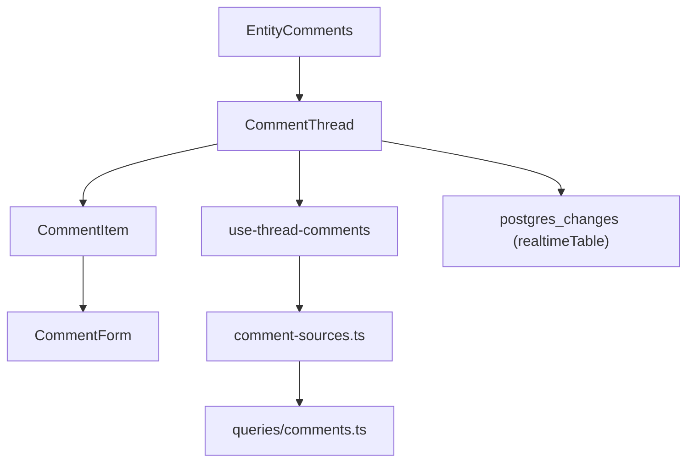

The Comments & Reactions subsystem provides entity-agnostic threaded discussions on posts, projects and articles, with soft deletion, organization-vs-user identity authorship, realtime updates and per-comment reaction counting.

## Overview

Comments are modelled once and projected onto three entity tables (`post_comments`, `project_comments`, `article_comments`). Rather than three parallel implementations, the codebase derives an entity-agnostic shape from a single canonical table and re-adds the entity-specific foreign key at the edge. The central design intent: write the thread logic once, let each entity contribute only its foreign key.

What is built: like-only reactions on posts (via `togglePostLike` and [`/api/posts/[id]/like`](https://github.com/ozeaon/ozeaon-v2/blob/0a4f1a95824db87782f1221a4108019d174df3d9/src/app/api/posts/%5Bid%5D/like/route.ts)) and on post, project and article comments (via `toggleLikeComment` and its siblings in [`queries/reactions.ts`](https://github.com/ozeaon/ozeaon-v2/blob/0a4f1a95824db87782f1221a4108019d174df3d9/src/lib/supabase/queries/reactions.ts)). Comment likes are server actions, not API routes. The `article_reactions` and `project_reactions` tables exist in the schema but nothing in `src` uses them — article and project (non-comment) reactions are on the roadmap.

Comment and reaction notifications come from DB triggers in [20260921000000_notifications_triggers.sql](https://github.com/ozeaon/ozeaon-v2/blob/0a4f1a95824db87782f1221a4108019d174df3d9/supabase/migrations/20260921000000_notifications_triggers.sql), behind the notifications feature flag. See [../notifications/](../notifications/).

## Architecture



`EntityComments` ([EntityComments.tsx](https://github.com/ozeaon/ozeaon-v2/blob/0a4f1a95824db87782f1221a4108019d174df3d9/src/components/ui/comments/EntityComments.tsx)) maps each entity to its route segment, realtime table (`post_comments`, `project_comments`, `article_comments`) and like actions, then passes them into `CommentThread`. `CommentThread` owns the `use-thread-comments` hook and the Supabase Realtime subscription — it subscribes to `postgres_changes` on the `realtimeTable` and refetches the thread window on `INSERT`, `UPDATE` and `DELETE`. The realtime publication is set in [20260707000000_realtime_comments_publication.sql](https://github.com/ozeaon/ozeaon-v2/blob/0a4f1a95824db87782f1221a4108019d174df3d9/supabase/migrations/20260707000000_realtime_comments_publication.sql).

`types/comments.ts` sits at the bottom and depends only on the generated `Database` type, so a fourth comment table entering the schema automatically widens the `CommentEntity` union:

```typescript
export type CommentEntity =
  Extract<keyof Database["public"]["Tables"], `${string}_comments`>
    extends infer Table
    ? Table extends `${infer Entity}_comments` ? Entity : never
    : never;
```

`lib/supabase/queries/comments.ts` holds the route-shared helpers and the three select projections. `use-thread-comments` owns all mutable client-side thread state, keeping `CommentThread` and `CommentItem` free of data-fetching concerns.

### Type Model

`ThreadComment` is derived from `post_comments` with `post_id` omitted via `Omit`, then augmented with joined relations. `author` is nullable (`ON DELETE SET NULL` on `author_id`) so orphaned comments render as "deleted user". Exactly one of `author` / `authoring_org` is the credited identity; `authoring_org` is null for user-authored comments.

The response envelope `CommentThreadResponse<T>` carries `comments` (the fetched page), `total` (Level 1 count for "Show more"), `commentCount` (full thread badge) and `replyTotals` (per-root reply counts from the `post_comment_reply_totals` DB function). Without `replyTotals`, "Show N more replies" would either undercount or require returning every reply.

### Query Helpers

Select projections are kept as literal strings because Supabase infers result types from the select text — a dynamically built select would erase the inferred types. Each of `POST_COMMENT_SELECT`, `PROJECT_COMMENT_SELECT` and `ARTICLE_COMMENT_SELECT` names its own FK constraint explicitly because `organizations` is reachable from a comment row by more than one path.

`scopeToPostingIdentity` scopes edit and delete to the *currently acting* identity: someone commenting for an organization must be wearing the same hat to edit or delete it. `scopeToOwnComment` composes that with the comment id and author id. Neither helper adds the entity FK column — it is the one column named differently in every comment table (`post_id`, `project_id`, `article_id`), so the entity-specific route adds it.

`assertCommentsOpen` returns 404 for a nonexistent entity and 403 for a disabled thread. The 404/403 split is intentional: a bad entity id must never read as a disabled thread, or a caller could probe which ids exist.

`redactDeletedComments` strips `content` from rows where `deleted_at` is set, in the API response layer (not in the database). The row survives so replies keep their anchor.

### Pagination & Counting

Constants in [`config/constants/comments.ts`](https://github.com/ozeaon/ozeaon-v2/blob/0a4f1a95824db87782f1221a4108019d174df3d9/src/config/constants/comments.ts): `COMMENT_BATCH_SIZE` (5 Level 1 comments per page), `REPLY_FOLD_THRESHOLD` (2 replies shown before the "Show replies" control), `REPLY_EXPANDED_LIMIT` (200 replies per expanded root — capped so one loud thread cannot starve its neighbours), `MAX_COMMENT_LIMIT` (200) and `COMMENT_MAX_LENGTH` (500).

`parseExpandedRoots` filters the `expand` query parameter through `isUuid` before any database call, dropping malformed tokens rather than passing them to an `in()` filter.

### Thread State Hook

The hook's option contract injects `basePath`, `fetchLiked` and an optional `onCountChange`, so it never knows which entity it is serving. Liking is applied to local state first (`applyLocalLike`), then reconciled against the server. The displayed count is floored at zero (`Math.max(..., 0)`) as a defensive guard against a stale server count. Switching identity clears the cached liked set and triggers a refetch — because likes are per-identity, the previous identity's liked set must not be shown.

## Failure Modes & Edge Cases

- **Soft-delete redaction** happens in the API only, not in the database. A deleted comment retains its author, timestamp and like count so the placeholder remains meaningful.
- **404 vs 403:** `assertCommentsOpen` returns 404 for a missing entity and 403 for a disabled thread. These are intentionally distinct to prevent id probing.
- **Identity switch clears likes:** `resetLikedComments` empties the cached liked set on every identity change. A like the new identity never placed must not be shown.
- **`fetchLiked` failure:** logged and swallowed; the thread still renders, but every comment appears un-liked. The reaction count from `stats.reaction_count` remains correct.
- **Orphan replies:** if a parent comment's author is deleted, `author` is null (set by `ON DELETE SET NULL`) — comments render as "deleted user" and their replies keep their anchor.
- **`expand` ids:** each must pass `isUuid` or it is dropped before reaching the database.

## Extension Points

- **Fourth entity:** adding a `poll_comments` table to the schema widens `CommentEntity` automatically. The new route needs its own select projection, `replyTotals` function and a matching `EntityComments` entry.
- **New reaction types:** the schema has `reaction_types`; the current code hard-codes `like`. A second reaction type would need a new `toggleLike*` server action and a UI picker.
- **Article & project reactions** (roadmap): `article_reactions` and `project_reactions` tables exist but have no `src` callers.

## Related Links

- [queries/comments.ts](https://github.com/ozeaon/ozeaon-v2/blob/0a4f1a95824db87782f1221a4108019d174df3d9/src/lib/supabase/queries/comments.ts)
- [queries/reactions.ts](https://github.com/ozeaon/ozeaon-v2/blob/0a4f1a95824db87782f1221a4108019d174df3d9/src/lib/supabase/queries/reactions.ts)
- [types/comments.ts](https://github.com/ozeaon/ozeaon-v2/blob/0a4f1a95824db87782f1221a4108019d174df3d9/src/types/comments.ts)
- [use-thread-comments.ts](https://github.com/ozeaon/ozeaon-v2/blob/0a4f1a95824db87782f1221a4108019d174df3d9/src/hooks/use-thread-comments.ts)
- [EntityComments.tsx](https://github.com/ozeaon/ozeaon-v2/blob/0a4f1a95824db87782f1221a4108019d174df3d9/src/components/ui/comments/EntityComments.tsx)
- [config/constants/comments.ts](https://github.com/ozeaon/ozeaon-v2/blob/0a4f1a95824db87782f1221a4108019d174df3d9/src/config/constants/comments.ts)
- [../../components/ui/comments/](../../components/ui/comments/)
- [../notifications/](../notifications/)
