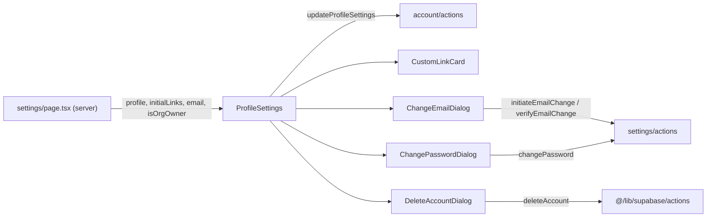

Components in [`src/components/account/`](https://github.com/ozeaon/ozeaon-v2/tree/0a4f1a95824db87782f1221a4108019d174df3d9/src/components/account) make up the personal settings screen at `/settings`. The server component loads the user's profile, custom links and org-owner flag, then passes them to `ProfileSettings`. Import from `@/components/account`.

See also: [User Settings](../../auth-and-accounts/user-settings/)

## ProfileSettings

The full Profile Settings form: identity, bio, social links and custom links, plus avatar upload and a Danger Zone. Validates with `zodResolver(profileSettingsSchema)` and submits through the `updateProfileSettings` server action. Bio moderation rejections surface through `useModerationRejection` into a `ModerationRejectedDialog`; other errors toast. Avatar upload is independent of the form submit and goes through `useProfileImageUpload`.

**Source:** [src/components/account/ProfileSettings.tsx](https://github.com/ozeaon/ozeaon-v2/blob/0a4f1a95824db87782f1221a4108019d174df3d9/src/components/account/ProfileSettings.tsx)

## CustomLinkCard

Collapsible card for one entry in the `custom_links` field array. Must be rendered inside a React Hook Form `Form` context because it uses `InputText` RHF wrappers directly.

**Source:** [src/components/account/CustomLinkCard.tsx](https://github.com/ozeaon/ozeaon-v2/blob/0a4f1a95824db87782f1221a4108019d174df3d9/src/components/account/CustomLinkCard.tsx)

## ChangeEmailDialog

Two-step dialog: enter a new email address (step 1 calls `initiateEmailChange`), then enter the 6-digit code sent to it (step 2 calls `verifyEmailChange`). Closing resets to step 1 and clears all input and error state.

**Source:** [src/components/account/ChangeEmailDialog.tsx](https://github.com/ozeaon/ozeaon-v2/blob/0a4f1a95824db87782f1221a4108019d174df3d9/src/components/account/ChangeEmailDialog.tsx)

## ChangePasswordDialog

Current, new and confirm password fields that submit through the `changePassword` server action. A `"current_password_incorrect"` server error maps to the Current Password field; any other error lands on New Password.

**Source:** [src/components/account/ChangePasswordDialog.tsx](https://github.com/ozeaon/ozeaon-v2/blob/0a4f1a95824db87782f1221a4108019d174df3d9/src/components/account/ChangePasswordDialog.tsx)

## DeleteAccountDialog

Multi-step confirmation for permanent account deletion, ending in a typed-confirmation gate that calls `deleteAccount`. Regular users see two steps; organization owners get an extra warning step about their owned organizations before the final confirm.

**Source:** [src/components/account/DeleteAccountDialog.tsx](https://github.com/ozeaon/ozeaon-v2/blob/0a4f1a95824db87782f1221a4108019d174df3d9/src/components/account/DeleteAccountDialog.tsx)
