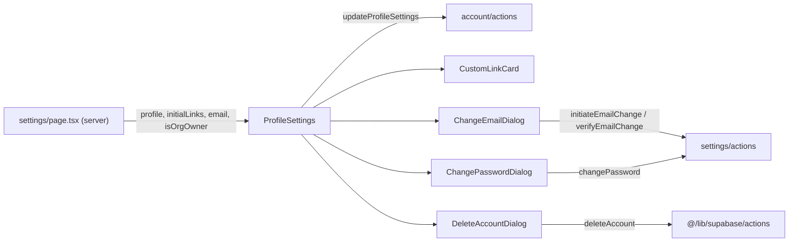

The `account/` components make up the personal settings screen at `/settings`. `src/app/(main)/(dashboard)/settings/page.tsx` is a server component: it resolves the user with `getAuthUserOrRedirect()` and, when the active account is a user (not an Organization), loads the `user_profiles` row (with avatar and cover image joins), the user's `user_links`, and whether the user owns any Organization. It passes these to `ProfileSettings`, a client-side React Hook Form that saves through the `updateProfileSettings` server action. Email, password and account deletion are handled outside the form, each in its own dialog that calls its own server action.



## ProfileSettings

The full Profile Settings form: Identity (avatar, display name, role, location, read-only email), About you (bio), Social Links (website, LinkedIn, GitHub, custom links), Change Password and a Danger zone.

- **Source:** [src/components/account/ProfileSettings.tsx](https://github.com/ozeaon/ozeaon-v2/blob/0a4f1a95824db87782f1221a4108019d174df3d9/src/components/account/ProfileSettings.tsx)
- **Kind:** Client component (`"use client"`)
- **Used in:** `src/app/(main)/(dashboard)/settings/page.tsx`

| Prop | Type | Default | Description |
|---|---|---|---|
| `profile` | `UserProfile` | — | The user's profile row; seeds the form defaults and avatar. |
| `initialLinks` | `Pick<Tables<"user_links">, "id" \| "title" \| "url">[]` | — | Existing custom links, mapped into the `custom_links` field array. |
| `email` | `string` | — | Current email, shown read-only and passed to the email/password dialogs. |
| `isOrgOwner` | `boolean` | — | Forwarded to `DeleteAccountDialog` to add the Organization-ownership warning step. |

Notable behaviour:

- `useForm` with `zodResolver(profileSettingsSchema)` (`@/zod/profile/profileSettings`), `mode: "onBlur"`, wrapped in `RequiredFieldsProvider` with `PROFILE_REQUIRED_FIELDS`. `display_name` and `role_descriptor` are marked required.
- Submits via `updateProfileSettings` (`src/app/(main)/(feed)/(private)/account/actions`). If the result carries `moderationCategories`, the rejection is applied to the `bio` field through `useModerationRejection` and `ModerationRejectedDialog`; other errors show a toast. On success it calls `form.reset(data)`, toasts "Profile updated" and calls `refreshProfile()` from `useAuth`.
- An invalid submit toasts a "Please complete all required fields" error.
- Avatar upload/removal goes through `AvatarUpload` and `useProfileImageUpload` (`type: "avatar"`, 0.5 MB, 512px max), independent of the form submit. Image moderation rejections go to the same moderation hook.
- Custom links use `useFieldArray` on `custom_links`; "Add Custom Link" appends `{ title: "", url: "" }`.
- Desktop shows a "Save Changes" button in the heading; on mobile a floating save button appears only while the form is dirty.
- `currentEmail` is local state, updated when `ChangeEmailDialog` succeeds.

```tsx
<ProfileSettings
  profile={profile}
  initialLinks={links ?? []}
  email={user.email ?? ""}
  isOrgOwner={isOrgOwner}
/>
```

## CustomLinkCard

A collapsible card holding the title and URL inputs for one entry in the `custom_links` field array, with a delete button guarded by a confirm dialog.

- **Source:** [src/components/account/CustomLinkCard.tsx](https://github.com/ozeaon/ozeaon-v2/blob/0a4f1a95824db87782f1221a4108019d174df3d9/src/components/account/CustomLinkCard.tsx)
- **Kind:** Client component (`"use client"`)
- **Used in:** `src/components/account/ProfileSettings.tsx`

| Prop | Type | Default | Description |
|---|---|---|---|
| `index` | `number` | — | Position in the field array; binds inputs to `custom_links.${index}.title` / `.url` and labels the card "Custom Link {index + 1}". |
| `onDelete` | `() => void` | — | Called after the user confirms deletion. |

Notable behaviour:

- Must be rendered inside a React Hook Form `Form` context, since it uses the `InputText` RHF wrappers.
- Starts expanded. The URL field is `required` and `type="url"`.
- Delete opens a destructive `ConfirmDialog` ("Delete this section?").
- The delete and collapse icon buttons have `aria-label`s that include the link number.

```tsx
{fields.map((field, index) => (
  <CustomLinkCard
    key={field.id}
    index={index}
    onDelete={() => remove(index)}
  />
))}
```

## ChangeEmailDialog

A two-step dialog: enter a new email, then enter the 6-digit code sent to it.

- **Source:** [src/components/account/ChangeEmailDialog.tsx](https://github.com/ozeaon/ozeaon-v2/blob/0a4f1a95824db87782f1221a4108019d174df3d9/src/components/account/ChangeEmailDialog.tsx)
- **Kind:** Client component (`"use client"`)
- **Used in:** `src/components/account/ProfileSettings.tsx`

| Prop | Type | Default | Description |
|---|---|---|---|
| `open` | `boolean` | — | Controlled open state. |
| `onOpenChange` | `(open: boolean) => void` | — | Open state setter. |
| `currentEmail` | `string` | — | Shown in step 1 and used to reject an unchanged address. |
| `onSuccess` | `(newEmail: string) => void` | — | Called with the trimmed new email after the code verifies. |

Notable behaviour:

- Step 1 validates the trimmed input with `emailSchema` (`@/zod/auth`) and rejects it case-insensitively if it matches `currentEmail`, then calls the `initiateEmailChange` server action.
- Step 2 renders `OtpInput`; on completion it calls `verifyEmailChange(newEmail, otp)`. On success it closes the dialog and calls `onSuccess`.
- "Resend code" calls `initiateEmailChange` again in place and shows a `role="status"` confirmation message.
- Closing the dialog resets it to step 1 and clears all input and error state.

```tsx
<ChangeEmailDialog
  open={changeEmailOpen}
  onOpenChange={setChangeEmailOpen}
  currentEmail={currentEmail}
  onSuccess={(newEmail) => {
    setCurrentEmail(newEmail);
    toast.success("Email address updated successfully");
  }}
/>
```

## ChangePasswordDialog

A dialog with current, new and confirm password fields that calls the `changePassword` server action.

- **Source:** [src/components/account/ChangePasswordDialog.tsx](https://github.com/ozeaon/ozeaon-v2/blob/0a4f1a95824db87782f1221a4108019d174df3d9/src/components/account/ChangePasswordDialog.tsx)
- **Kind:** Client component (`"use client"`)
- **Used in:** `src/components/account/ProfileSettings.tsx`

| Prop | Type | Default | Description |
|---|---|---|---|
| `open` | `boolean` | — | Controlled open state. |
| `onOpenChange` | `(open: boolean) => void` | — | Open state setter. |
| `currentEmail` | `string` | — | Rendered into a hidden `autoComplete="username"` input so the browser's password manager knows which credential changed. |

Notable behaviour:

- Client validation parses the new password with `newPasswordSchema` (`@/zod/auth`), the same schema the server action uses, and checks the confirmation matches.
- A server error of `"current_password_incorrect"` is shown under Current Password; any other error is shown under New Password.
- On success the dialog closes and toasts "Password updated successfully". Closing clears all fields and errors.

```tsx
<ChangePasswordDialog
  open={changePasswordOpen}
  onOpenChange={setChangePasswordOpen}
  currentEmail={currentEmail}
/>
```

## DeleteAccountDialog

A multi-step confirmation for permanently deleting the account, ending in a typed-confirmation delete gate.

- **Source:** [src/components/account/DeleteAccountDialog.tsx](https://github.com/ozeaon/ozeaon-v2/blob/0a4f1a95824db87782f1221a4108019d174df3d9/src/components/account/DeleteAccountDialog.tsx)
- **Kind:** Client component (`"use client"`)
- **Used in:** `src/components/account/ProfileSettings.tsx`

| Prop | Type | Default | Description |
|---|---|---|---|
| `open` | `boolean` | — | Controlled open state. |
| `onOpenChange` | `(open: boolean) => void` | — | Open state setter. |
| `isOrgOwner` | `boolean` | — | When true, inserts an extra warning step about deleting owned Organizations. |

Notable behaviour:

- Two steps for regular users, three for Organization owners. Earlier steps are destructive `ConfirmDialog`s ("Yes, I want to continue"); the final step is `ConfirmDeleteDialog`.
- The final confirm calls `deleteAccount()` from `@/lib/supabase/actions`, which redirects on success. On failure it shows "Failed to delete the account. Please try again".
- Closing resets to step 1 and clears the error.

```tsx
<DeleteAccountDialog
  open={deleteAccountOpen}
  onOpenChange={setDeleteAccountOpen}
  isOrgOwner={isOrgOwner}
/>
```
