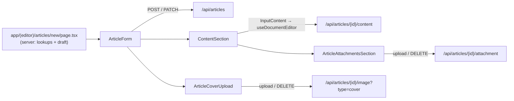

`src/components/articles/` covers three surfaces: feed cards and lists, the single-page authoring form at `/articles/new`, and the public reader at `/articles/[slug]`. Import from the barrel at `@/components/articles` or by path for internal pieces.

See also: [Article Authoring & Publishing](../../articles/articles-authoring/) and [Article Reader](../../articles/articles-reader/).

The form's write path works as follows: the `/articles/new` server page fetches lookup tables and any existing draft, then passes them to the client `ArticleForm`. The form writes fields to `/api/articles` (POST to create, PATCH to update). The Tiptap body goes through `/api/articles/{id}/content`, and files upload to dedicated `/api/articles/{id}/...` routes.



## Cards & Feeds

### ArticleDeleteDialog

A destructive `ConfirmDialog` with the fixed "Delete Article?" copy from `DELETE_ARTICLE_DIALOG`.

**Source:** [src/components/articles/ArticleDeleteDialog.tsx](https://github.com/ozeaon/ozeaon-v2/blob/0a4f1a95824db87782f1221a4108019d174df3d9/src/components/articles/ArticleDeleteDialog.tsx)

### ArticlesInfiniteFeed

The public infinite scroll feed of `ArticleCard`s. Wraps `GenericInfiniteFeed` with `entity="articles"`, ordered by `published_at` descending. Pass `userId` or `organizationId` to scope it to a profile or organisation tab; omitting both gives the global feed.

**Source:** [src/components/articles/ArticlesInfiniteFeed.tsx](https://github.com/ozeaon/ozeaon-v2/blob/0a4f1a95824db87782f1221a4108019d174df3d9/src/components/articles/ArticlesInfiniteFeed.tsx)

### ArticleCard

The full feed card: cover, byline row, article type, title, summary, category badges, an optional linked-project panel and an actions row. Stacks vertically below the `@md` container breakpoint and switches to a row layout above it. The cover uses `ViewTransition name="article-cover-{id}"` so it morphs into the hero on the reader page.

**Source:** [src/components/articles/cards/ArticleCard.tsx](https://github.com/ozeaon/ozeaon-v2/blob/0a4f1a95824db87782f1221a4108019d174df3d9/src/components/articles/cards/ArticleCard.tsx)

### ArticleCardActions

The desktop actions row of `ArticleCard`: a comment toggle, a "Read Article" link, and an expandable `EntityComments` panel. Keeps `commentCount` in local state; hides the toggle and panel when comments are disabled and the count is zero.

**Source:** [src/components/articles/cards/ArticleCardActions.tsx](https://github.com/ozeaon/ozeaon-v2/blob/0a4f1a95824db87782f1221a4108019d174df3d9/src/components/articles/cards/ArticleCardActions.tsx)

### ArticleBylineRow

Author or authoring organisation byline, divider, relative publish date, and optional linked-organisation byline. Callers pass the grid-cols template directly via `className` because it depends on whether `linked_organization` is set.

**Source:** [src/components/articles/cards/ArticleBylineRow.tsx](https://github.com/ozeaon/ozeaon-v2/blob/0a4f1a95824db87782f1221a4108019d174df3d9/src/components/articles/cards/ArticleBylineRow.tsx)

### CondensedArticleCard

Compact card built on the shared `CondensedCardShell` / `CondensedCardCover` / `CondensedCardActions` primitives. Adds a "Featured" badge when `is_featured` is set. Uses the same `article-cover-{id}` view-transition name as `ArticleCard`.

**Source:** [src/components/articles/cards/CondensedArticleCard.tsx](https://github.com/ozeaon/ozeaon-v2/blob/0a4f1a95824db87782f1221a4108019d174df3d9/src/components/articles/cards/CondensedArticleCard.tsx)

### ArticleCardAttached / MiniArticleCardAttached

Link cards for an article attached to a post. `ArticleCardAttached` shows the type label, title, a 4-line summary and the cover. `MiniArticleCardAttached` is a single-row version for reposts.

**Source:** [src/components/articles/cards/ArticleCardAttached.tsx](https://github.com/ozeaon/ozeaon-v2/blob/0a4f1a95824db87782f1221a4108019d174df3d9/src/components/articles/cards/ArticleCardAttached.tsx)

### MyArticleCard

Dashboard card for an author's own article. Shows Published/Draft badge, type, title, comment/publish/edit-lock metadata, and Edit / View / Delete actions. Edit is available only within the 7-day grace window after `published_at`; disabled buttons carry explanatory `aria-label`s.

**Source:** [src/components/articles/cards/MyArticleCard.tsx](https://github.com/ozeaon/ozeaon-v2/blob/0a4f1a95824db87782f1221a4108019d174df3d9/src/components/articles/cards/MyArticleCard.tsx)

### SmallArticleSkeletonCard

Loading skeleton shaped like `MyArticleCard`.

**Source:** [src/components/articles/cards/SmallArticleSkeletonCard.tsx](https://github.com/ozeaon/ozeaon-v2/blob/0a4f1a95824db87782f1221a4108019d174df3d9/src/components/articles/cards/SmallArticleSkeletonCard.tsx)

## Form

### ArticleForm

The article create/edit form. Has eight numbered `FormSectionCard` sections: Type & Identity, Body, Categories/SDGs/Tags, Authors, Access & Licensing, Provenance, Comments, and Deletion (existing articles only).

Key flow details:

- **Schema resolution.** Uses `zodResolver(articleDraftSchema)` with `shouldUnregister: false` (required by `ShowWhen` fields). Publishing re-validates against `articlePublishSchema`.
- **Edit lock.** The whole form is `disabled` once `published_at` is more than 7 days ago (`EDIT_GRACE_DAYS`).
- **Draft-then-publish.** A new article published with a body is first created as a draft, its body stored, then a second PATCH sets `published: true`, so a live article never exists without its body.
- **Silent draft.** `saveDraftSilent` creates a draft on demand so file uploads work before the first save. Concurrent callers share one in-flight create through `createdDraftRef`.
- **Moderation.** Rejections and 503s go to `useModerationRejection`, rendering `FormErrorBanner` and `ModerationRejectedDialog`.

```tsx
<NewArticleForm
  sdgs={sdgs}
  categories={transformedCategories}
  accessLevels={accessLevels}
  licenseTypes={licenseTypes}
  articleTypes={articleTypes}
  fundingSources={fundingSources}
  attachments={articleAttachments}
  initialDraftData={initialDraftData}
  initialArticleId={initialArticleId}
/>
```

**Source:** [src/components/articles/form/ArticleForm.tsx](https://github.com/ozeaon/ozeaon-v2/blob/0a4f1a95824db87782f1221a4108019d174df3d9/src/components/articles/form/ArticleForm.tsx)

### ArticleFormNav

Puts the form's title and Save/Publish buttons into the global nav via `FormNavSlot`. Handlers are held in refs so the memoised right slot does not rebuild when function identities change.

**Source:** [src/components/articles/form/ArticleFormNav.tsx](https://github.com/ozeaon/ozeaon-v2/blob/0a4f1a95824db87782f1221a4108019d174df3d9/src/components/articles/form/ArticleFormNav.tsx)

### ArticleFormSidebar

Section navigator for the form. Wraps `FormSidebar` with scroll-spy via `IntersectionObserver` (root margin −20% top and bottom), smooth scrolling, and per-section completion marks from `useArticleValidation`. Sections only show as complete once the form has been saved at least once.

**Source:** [src/components/articles/form/ArticleFormSidebar.tsx](https://github.com/ozeaon/ozeaon-v2/blob/0a4f1a95824db87782f1221a4108019d174df3d9/src/components/articles/form/ArticleFormSidebar.tsx)

### FormErrors

Flattens React Hook Form's nested `formState.errors` (objects and arrays) and renders each message as an error row. Has no call sites in `src/`.

**Source:** [src/components/articles/form/FormErrors.tsx](https://github.com/ozeaon/ozeaon-v2/blob/0a4f1a95824db87782f1221a4108019d174df3d9/src/components/articles/form/FormErrors.tsx)

## Form Sections

### ContentSection

Form section 2. For research/IP types it shows a "Text Only Mode" toggle and the abstract field. Always shows the `InputContent` rich-text editor and `ArticleAttachmentsSection`. Autosave runs every 5 seconds for drafts and is disabled once the article is published.

**Source:** [src/components/articles/form/sections/ContentSection.tsx](https://github.com/ozeaon/ozeaon-v2/blob/0a4f1a95824db87782f1221a4108019d174df3d9/src/components/articles/form/sections/ContentSection.tsx)

### AuthorInput

Field array editor for `authors` (1–10 entries). The first entry is "Lead Author" and cannot be removed. Searching the Ozeaon user directory via `/api/users/search` locks the name field while a user is linked. Only one author can be corresponding; switching one on switches the others off.

**Source:** [src/components/articles/form/sections/AuthorInput.tsx](https://github.com/ozeaon/ozeaon-v2/blob/0a4f1a95824db87782f1221a4108019d174df3d9/src/components/articles/form/sections/AuthorInput.tsx)

### LicensingAccessSection

Form section 5: license type, custom-license details and reuse permissions, a hidden `attribution_text` field, and legal notes. The `token_gated` access level and the embargo date field are rendered inside a `hidden` container — paywalls are on the roadmap and not built.

**Source:** [src/components/articles/form/sections/LicensingAccessSection.tsx](https://github.com/ozeaon/ozeaon-v2/blob/0a4f1a95824db87782f1221a4108019d174df3d9/src/components/articles/form/sections/LicensingAccessSection.tsx)

### ProvenanceSection

Form section 6: funding source (research-funding provenance, not payments), funding details, geographic scope, country search, and location details. Country and location fields each re-validate each other. The indigenous-knowledge fields are commented out — the Indigenous Knowledge Hub is on the roadmap.

**Source:** [src/components/articles/form/sections/ProvenanceSection.tsx](https://github.com/ozeaon/ozeaon-v2/blob/0a4f1a95824db87782f1221a4108019d174df3d9/src/components/articles/form/sections/ProvenanceSection.tsx)

## Attachments

### ArticleAttachmentsSection

Brings the paper PDF, annex, and gallery uploaders together around a single `useArticleAttachments` instance, and renders the image `ModerationRejectedDialog`. The PDF uploader renders only for research/IP types when `text_only_publication` is off; turning text-only on unregisters `pdf_file_url`.

**Source:** [src/components/articles/form/sections/attachments/ArticleAttachmentsSection.tsx](https://github.com/ozeaon/ozeaon-v2/blob/0a4f1a95824db87782f1221a4108019d174df3d9/src/components/articles/form/sections/attachments/ArticleAttachmentsSection.tsx)

### useArticleAttachments

Hook behind `ArticleAttachmentsSection`. Validates the batch client-side, calls `saveDraftSilent` if needed, posts to `/api/articles/{id}/attachment`, and handles moderation rejections. Uploading a PDF when one already exists replaces it.

**Source:** [src/components/articles/form/sections/attachments/useArticleAttachments.ts](https://github.com/ozeaon/ozeaon-v2/blob/0a4f1a95824db87782f1221a4108019d174df3d9/src/components/articles/form/sections/attachments/useArticleAttachments.ts)

### ArticleCoverUpload

Cover-image field (`cover_image_url`). Wraps `FormImageUpload` with `type="cover"`. Upload and remove both target `/api/articles/{id}/image?type=cover`. If `articleId` is `null`, `onBeforeUpload` must create the draft first and return the new id, otherwise the upload is cancelled.

**Source:** [src/components/articles/form/sections/attachments/ArticleCoverUpload.tsx](https://github.com/ozeaon/ozeaon-v2/blob/0a4f1a95824db87782f1221a4108019d174df3d9/src/components/articles/form/sections/attachments/ArticleCoverUpload.tsx)

### ArticlePaperUpload

Single-PDF "Paper File" dropzone and uploaded-file card. Shows a warning when a draft already has a PDF, because uploading replaces it.

**Source:** [src/components/articles/form/sections/attachments/ArticlePaperUpload.tsx](https://github.com/ozeaon/ozeaon-v2/blob/0a4f1a95824db87782f1221a4108019d174df3d9/src/components/articles/form/sections/attachments/ArticlePaperUpload.tsx)

### ArticleAnnexesUpload

Multi-file "Supporting Documents" dropzone and file list with an "n / max files" count.

**Source:** [src/components/articles/form/sections/attachments/ArticleAnnexesUpload.tsx](https://github.com/ozeaon/ozeaon-v2/blob/0a4f1a95824db87782f1221a4108019d174df3d9/src/components/articles/form/sections/attachments/ArticleAnnexesUpload.tsx)

### ArticleGalleryUpload

Multi-image "Add Images" dropzone and a two-column preview grid. Replacing a tile removes the old image and then uploads the new file; failure shows a toast.

**Source:** [src/components/articles/form/sections/attachments/ArticleGalleryUpload.tsx](https://github.com/ozeaon/ozeaon-v2/blob/0a4f1a95824db87782f1221a4108019d174df3d9/src/components/articles/form/sections/attachments/ArticleGalleryUpload.tsx)

## Reader

### ArticlePublicPage

Main column of the public article page: hero, then content, documents, gallery, and comments.

**Source:** [src/components/articles/pages/ArticlePublicPage.tsx](https://github.com/ozeaon/ozeaon-v2/blob/0a4f1a95824db87782f1221a4108019d174df3d9/src/components/articles/pages/ArticlePublicPage.tsx)

### ArticleNavSlot

Puts a back button and the article title into the nav's left slot (desktop only). Clears the slot on unmount.

**Source:** [src/components/articles/pages/ArticleNavSlot.tsx](https://github.com/ozeaon/ozeaon-v2/blob/0a4f1a95824db87782f1221a4108019d174df3d9/src/components/articles/pages/ArticleNavSlot.tsx)

### ArticleHeroSection

Article header: cover with a type pill (using `ViewTransition name="article-cover-{id}"` for the feed-to-reader morph), byline, title, subtitle, category chips, SDGs, license badge, and edit button. `ArticleEditButton` renders twice (desktop and mobile) in `<Suspense>` boundaries; its fallback is a disabled "Tip - Coming soon" button (tipping is on the roadmap).

**Source:** [src/components/articles/pages/ArticleHeroSection.tsx](https://github.com/ozeaon/ozeaon-v2/blob/0a4f1a95824db87782f1221a4108019d174df3d9/src/components/articles/pages/ArticleHeroSection.tsx)

### ArticleContentSection

Article body: mobile-only authors, summary and abstract text, keyword tags, the HTML body inside `CollapsibleContent`, and a paper PDF viewer. The body is skipped when empty or `"<p></p>"`.

**Source:** [src/components/articles/pages/ArticleContentSection.tsx](https://github.com/ozeaon/ozeaon-v2/blob/0a4f1a95824db87782f1221a4108019d174df3d9/src/components/articles/pages/ArticleContentSection.tsx)

### ArticleDocumentsSection

Renders `DocumentSelector` for annex documents. Returns `null` when `documents` is empty.

**Source:** [src/components/articles/pages/ArticleDocumentsSection.tsx](https://github.com/ozeaon/ozeaon-v2/blob/0a4f1a95824db87782f1221a4108019d174df3d9/src/components/articles/pages/ArticleDocumentsSection.tsx)

### ArticleMediaSection

Gallery carousel. Clicking a tile opens `ImageCarouselLightbox` at that index. Returns `null` when `images` is empty.

**Source:** [src/components/articles/pages/ArticleMediaSection.tsx](https://github.com/ozeaon/ozeaon-v2/blob/0a4f1a95824db87782f1221a4108019d174df3d9/src/components/articles/pages/ArticleMediaSection.tsx)

### ArticleCommentsSection

Renders `EntityComments` for the article. Returns `null` when comments are disabled and the count is zero.

**Source:** [src/components/articles/pages/ArticleCommentsSection.tsx](https://github.com/ozeaon/ozeaon-v2/blob/0a4f1a95824db87782f1221a4108019d174df3d9/src/components/articles/pages/ArticleCommentsSection.tsx)

### ArticleReviewSection

A static peer-review mock-up: review count, a textarea, and a submit button. Nothing is wired up. Peer review is on the roadmap; this component is commented out in `ArticlePublicPage`.

**Source:** [src/components/articles/pages/ArticleReviewSection.tsx](https://github.com/ozeaon/ozeaon-v2/blob/0a4f1a95824db87782f1221a4108019d174df3d9/src/components/articles/pages/ArticleReviewSection.tsx)

## Dashboard

### PrivateArticlesInfiniteFeed

Author dashboard feed with All / Published / Drafts tabs above a `GenericInfiniteFeed` of `MyArticleCard`s, ordered by `updated_at` descending. Changing tabs pushes `?filter={value}` and the feed is keyed by `filter` to remount on each change.

**Source:** [src/components/articles/pages/dashboard/PrivateArticlesInfiniteFeed.tsx](https://github.com/ozeaon/ozeaon-v2/blob/0a4f1a95824db87782f1221a4108019d174df3d9/src/components/articles/pages/dashboard/PrivateArticlesInfiniteFeed.tsx)

## Reader Parts

### ArticleEditButton

Async server component that shows "Edit Article" to users who can manage the article. Calls `getAuthUser()`, which makes the route dynamic. After the 7-day edit window it shows a disabled button with a tooltip instead of the link. Wrap in `<Suspense>`.

**Source:** [src/components/articles/pages/parts/ArticleEditButton.tsx](https://github.com/ozeaon/ozeaon-v2/blob/0a4f1a95824db87782f1221a4108019d174df3d9/src/components/articles/pages/parts/ArticleEditButton.tsx)

### Authors

"Authors" list: the first three authors shown as Lead Author and Co-Author with a corresponding-author tooltip icon, plus an "All Authors" collapsible for any further entries. Returns `null` when there are no authors.

**Source:** [src/components/articles/pages/parts/Authors.tsx](https://github.com/ozeaon/ozeaon-v2/blob/0a4f1a95824db87782f1221a4108019d174df3d9/src/components/articles/pages/parts/Authors.tsx)

### FundingBlock

Shows the declared funding source name and optional funding details (research-funding provenance, not payments or project funding). Returns `null` without a `funding_source`.

**Source:** [src/components/articles/pages/parts/FundingBlock.tsx](https://github.com/ozeaon/ozeaon-v2/blob/0a4f1a95824db87782f1221a4108019d174df3d9/src/components/articles/pages/parts/FundingBlock.tsx)

### BountyBlock

A static "Bounty / Coming Soon / 250 ozn" placeholder card. Takes no props and has no call sites. Article bounties ($OZN token rewards) are on the roadmap and not built.

**Source:** [src/components/articles/pages/parts/BountyBlock.tsx](https://github.com/ozeaon/ozeaon-v2/blob/0a4f1a95824db87782f1221a4108019d174df3d9/src/components/articles/pages/parts/BountyBlock.tsx)

### CollapsibleContent

Renders sanitised article HTML via `sanitizeArticleHtml` before `dangerouslySetInnerHTML`. Content taller than 900px is collapsed behind a "Read more" / "Show less" toggle that sets `maxHeight` directly on the element.

**Source:** [src/components/articles/pages/parts/CollapsibleContent.tsx](https://github.com/ozeaon/ozeaon-v2/blob/0a4f1a95824db87782f1221a4108019d174df3d9/src/components/articles/pages/parts/CollapsibleContent.tsx)

### GeographicScopeBadge

"Geo-scope: {scope}" label. Becomes a tooltip trigger when `geographic_scope_country` or `location_details` is set.

**Source:** [src/components/articles/pages/parts/GeographicScopeBadge.tsx](https://github.com/ozeaon/ozeaon-v2/blob/0a4f1a95824db87782f1221a4108019d174df3d9/src/components/articles/pages/parts/GeographicScopeBadge.tsx)

### LicenseTypeBadge

License-name pill with a tooltip showing the description, URL, and for custom licenses the terms and commercial-use/derivative-works flags. Shows parsed `attribution_text` when present. Returns `null` without a `license_type`.

**Source:** [src/components/articles/pages/parts/LicenseTypeBadge.tsx](https://github.com/ozeaon/ozeaon-v2/blob/0a4f1a95824db87782f1221a4108019d174df3d9/src/components/articles/pages/parts/LicenseTypeBadge.tsx)
