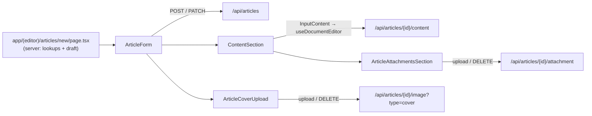

`src/components/articles/` covers three surfaces:

- **Cards and feeds** (`cards/`, `ArticlesInfiniteFeed`, `pages/dashboard/`): list views for public feeds, profile and Organization tabs, related content, attached posts and the author dashboard.
- **Form** (`form/`): the single-page article editor at `/articles/new` (create, or edit with `?articleId=`).
- **Reader** (`pages/`): the public article page at `/articles/[slug]` and its sidebar parts.

The form works like this: the `/articles/new` server page loads lookup tables and any existing draft, then hands them to the client `ArticleForm`. The form writes article fields to `/api/articles` (`POST` to create, `PATCH ?id=` to update). The rich-text body goes through the Tiptap editor ([Tiptap](../tiptap/)) to `/api/articles/{id}/content`. Cover, attachments and gallery images upload to their own `/api/articles/{id}/...` routes.



Uploads need an article row. If the author uploads before the first save, `saveDraftSilent` creates a draft first.

## Root

### ArticleDeleteDialog

A destructive `ConfirmDialog` with the fixed "Delete Article?" copy from `DELETE_ARTICLE_DIALOG`.

- **Source:** [src/components/articles/ArticleDeleteDialog.tsx](https://github.com/ozeaon/ozeaon-v2/blob/0a4f1a95824db87782f1221a4108019d174df3d9/src/components/articles/ArticleDeleteDialog.tsx)
- **Kind:** Client component (`"use client"`)
- **Used in:** `src/components/articles/form/ArticleForm.tsx`, `src/components/articles/cards/MyArticleCard.tsx`

| Prop | Type | Default | Description |
|---|---|---|---|
| `open` | `boolean` | — | Controlled open state. |
| `onOpenChange` | `(open: boolean) => void` | — | Open-state setter. |
| `onConfirm` | `() => void \| Promise<unknown>` | — | Runs when the user confirms. |
| `isLoading` | `boolean` | — | Puts the confirm button into its loading state. |

```tsx
<ArticleDeleteDialog
  open={showDeleteDialog}
  onOpenChange={setShowDeleteDialog}
  onConfirm={deleteArticle}
  isLoading={isDeleting}
/>
```

### ArticlesInfiniteFeed

The public infinite feed of `ArticleCard`s. It wraps `GenericInfiniteFeed` with `entity="articles"`, ordered by `published_at` descending.

- **Source:** [src/components/articles/ArticlesInfiniteFeed.tsx](https://github.com/ozeaon/ozeaon-v2/blob/0a4f1a95824db87782f1221a4108019d174df3d9/src/components/articles/ArticlesInfiniteFeed.tsx)
- **Kind:** Client component (`"use client"`)
- **Used in:** `src/app/(main)/(feed)/(public)/articles/page.tsx`, `src/app/(main)/(profile)/profiles/[username]/articles/page.tsx`, `src/app/(main)/(profile)/organizations/[slug]/(tabs)/articles/page.tsx`

| Prop | Type | Default | Description |
|---|---|---|---|
| `initial` | `ArticleCardEntry[]` | — | First page, fetched server-side. |
| `limit` | `number` | — | Page size passed to `GenericInfiniteFeed`. |
| `userId` | `string` | — | Adds `userId` to the fetch params so the feed only shows that user's articles. |
| `organizationId` | `string` | — | Adds `organizationId` to the fetch params so the feed only shows that Organization's articles. |

When neither `userId` nor `organizationId` is set, `extraParams` is `undefined`.

```tsx
<ArticlesInfiniteFeed initial={articles} limit={LIMIT} userId={profileId} />
```

## cards/

Barrel `cards/index.ts` exports `CondensedArticleCard`, `ArticleCard` and `MyArticleCard`. Other card files are imported by path.

### ArticleCard

The full feed card. It shows the cover image, byline row, article type, title, summary, category badges, an optional linked-project panel and the actions row. It is stacked below the `@md` container breakpoint and switches to a row layout at `@md` and up.

- **Source:** [src/components/articles/cards/ArticleCard.tsx](https://github.com/ozeaon/ozeaon-v2/blob/0a4f1a95824db87782f1221a4108019d174df3d9/src/components/articles/cards/ArticleCard.tsx)
- **Kind:** No directive (rendered from client feeds; contains the client `ArticleCardActions`)
- **Used in:** `src/components/articles/ArticlesInfiniteFeed.tsx`, `src/components/search/SearchResultsFeed.tsx`

| Prop | Type | Default | Description |
|---|---|---|---|
| `article` | `ArticleCardEntry` | — | Card data, including `author`, `authoring_org`, `linked_organization`, `linked_project`, `subcategories` and `stats`. |

Notable behaviour:

- The cover is wrapped in `<ViewTransition name="article-cover-{id}" share="morph">`, so it morphs into the hero on the article page (`ArticleHeroSection` uses the same name).
- Subcategories are collapsed to their parent category names via `dedupeSubcategoriesToCategories`.
- The summary is truncated to 300 characters.
- On mobile the actions row is `CondensedCardActions`. From `@md` up it is `ArticleCardActions`, which includes the comments toggle.
- The internal `LinkedProject` panel renders only when `linked_project` is set. When the project status is `live`, it shows an "Ends in" countdown.

```tsx
renderItem={(article) => <ArticleCard article={article} />}
```

### ArticleCardActions

The desktop actions row of `ArticleCard`: a comment toggle, a "Read Article" link, and an expandable `EntityComments` panel.

- **Source:** [src/components/articles/cards/ArticleCardActions.tsx](https://github.com/ozeaon/ozeaon-v2/blob/0a4f1a95824db87782f1221a4108019d174df3d9/src/components/articles/cards/ArticleCardActions.tsx)
- **Kind:** Client component (`"use client"`)
- **Used in:** `src/components/articles/cards/ArticleCard.tsx`

| Prop | Type | Default | Description |
|---|---|---|---|
| `articleId` | `string` | — | Passed to `EntityComments` as `entityId`. |
| `slug` | `string` | — | Builds the `/articles/{slug}` link. |
| `commentsEnabled` | `boolean` | — | Whether new comments are allowed. |
| `initialCommentCount` | `number` | — | Seed for the local comment count. |

Notable behaviour:

- Keeps `commentCount` in local state and updates it through `EntityComments`' `onCommentCountChange`.
- Hides the toggle and panel when `shouldHideCommentSection(commentsEnabled, commentCount)` is true, which means comments are disabled and the count is zero.
- Reads the current user from `useAuth()`.

```tsx
<ArticleCardActions
  articleId={article.id}
  slug={article.slug}
  commentsEnabled={article.comments_enabled}
  initialCommentCount={article.stats?.comment_count ?? 0}
/>
```

### ArticleBylineRow

A grid row with the author (or authoring Organization) byline, a divider, the relative publish date, and an optional linked-Organization byline.

- **Source:** [src/components/articles/cards/ArticleBylineRow.tsx](https://github.com/ozeaon/ozeaon-v2/blob/0a4f1a95824db87782f1221a4108019d174df3d9/src/components/articles/cards/ArticleBylineRow.tsx)
- **Kind:** No directive
- **Used in:** `src/components/articles/cards/ArticleCard.tsx`, `src/components/articles/cards/CondensedArticleCard.tsx`

| Prop | Type | Default | Description |
|---|---|---|---|
| `author` | `AuthorBylineData \| null` | — | When set, renders the author and links to `/profiles/{username}/articles`. |
| `authoring_org` | `OrgBylineData \| null` | — | Used when `author` is null. |
| `published_at` | `string \| null` | — | Shown via `DateDisplay format="relative"`. |
| `linked_organization` | `OrgBylineData \| null` | — | Optional third byline segment. |
| `className` | `ClassNameValue` | — | Merged onto the grid. Callers pass `grid-cols-[...]` templates that depend on whether `linked_organization` is set. |

```tsx
<ArticleBylineRow
  author={article.author}
  authoring_org={article.authoring_org}
  published_at={article.published_at}
  linked_organization={article.linked_organization}
  className={
    article.linked_organization
      ? "grid-cols-[minmax(40px,min-content)_4px_max-content_4px_minmax(10%,min-content)]"
      : "grid-cols-[minmax(40px,min-content)_4px_max-content]"
  }
/>
```

### CondensedArticleCard

A compact card built on the shared `CondensedCardShell` / `CondensedCardCover` / `CondensedCardActions` primitives. It adds a "Featured" badge when `is_featured` is set.

- **Source:** [src/components/articles/cards/CondensedArticleCard.tsx](https://github.com/ozeaon/ozeaon-v2/blob/0a4f1a95824db87782f1221a4108019d174df3d9/src/components/articles/cards/CondensedArticleCard.tsx)
- **Kind:** No directive
- **Used in:** `src/app/(main)/(feed)/(public)/(home)/page.tsx`, `src/components/projects/page/sections/RelatedContentSection.tsx`, `src/components/profiles/organizations/sections/RecentArticlesSection.tsx`

| Prop | Type | Default | Description |
|---|---|---|---|
| `article` | `CondensedArticleCardData` | — | Card data. |
| `className` | `string` | — | Merged onto the shell. |

Notable behaviour: it uses the same `article-cover-{id}` view-transition name as `ArticleCard`, with `enter`/`exit="auto"` and `default="none"`.

```tsx
<CondensedArticleCard key={a.id} article={a} className="w-full" />
```

### ArticleCardAttached / MiniArticleCardAttached

Link cards for an article attached to a post. `ArticleCardAttached` shows the "Article · {type}" label, title, a 4-line summary and the cover. `MiniArticleCardAttached` is a single-row version (small cover, label, title) used inside reposts.

- **Source:** [src/components/articles/cards/ArticleCardAttached.tsx](https://github.com/ozeaon/ozeaon-v2/blob/0a4f1a95824db87782f1221a4108019d174df3d9/src/components/articles/cards/ArticleCardAttached.tsx)
- **Kind:** No directive
- **Used in:** `src/components/posts/cards/PostCard.tsx` (`ArticleCardAttached`), `src/components/posts/attachments/RepostingPost.tsx` (`MiniArticleCardAttached`)

| Prop | Type | Default | Description |
|---|---|---|---|
| `article` | `AttachedArticleItem` | — | Attached article data. Both components link to `/articles/{slug}` with `prefetch={false}`. |

The file also exports the `ArticleCardAttachedProps` type.

```tsx
{post.article && <MiniArticleCardAttached article={post.article} />}
```

### MyArticleCard

The dashboard card for an author's own article. It shows a Published/Draft badge, the article type, the title, comment/publish/edit-lock metadata, and Edit / View / Delete actions.

- **Source:** [src/components/articles/cards/MyArticleCard.tsx](https://github.com/ozeaon/ozeaon-v2/blob/0a4f1a95824db87782f1221a4108019d174df3d9/src/components/articles/cards/MyArticleCard.tsx)
- **Kind:** Client component (`"use client"`)
- **Used in:** `src/components/articles/pages/dashboard/PrivateArticlesInfiniteFeed.tsx`

| Prop | Type | Default | Description |
|---|---|---|---|
| `article` | `DashboardArticleCardEntry` | — | Dashboard card data. |
| `viewer` | `ArticleViewer` | — | The viewing account (`id`, `activeOrgId`, `activeOrgRole`). Used for permission checks. |

Notable behaviour:

- `canManageArticleFromActiveAccount` decides whether the viewer can manage the article. Delete is enabled only when they can. Edit is enabled only when they can **and** the article is within the edit window (`EDIT_GRACE_DAYS`, 7 days after `published_at`). Disabled buttons carry explanatory `aria-label`s.
- Edit links to `/articles/new?articleId={id}`. View (published articles only) links to `/articles/{slug}`.
- Delete opens `ArticleDeleteDialog`. `useDeleteArticle` runs the delete, then `router.refresh()`.
- For published articles, the metadata row shows the comment count, publish date, and either the time left until edit lock or "editing locked", with a tooltip explaining the 7-day rule.
- In development (`env.isDevelopment`) it adds a badge that copies the article ID to the clipboard.

```tsx
<MyArticleCard article={article} viewer={viewer} />
```

### SmallArticleSkeletonCard

A loading skeleton with the same shape as `MyArticleCard`. It spreads any `HTMLAttributes<HTMLDivElement>` onto the outer `Skeleton`, but always overrides `className`.

- **Source:** [src/components/articles/cards/SmallArticleSkeletonCard.tsx](https://github.com/ozeaon/ozeaon-v2/blob/0a4f1a95824db87782f1221a4108019d174df3d9/src/components/articles/cards/SmallArticleSkeletonCard.tsx)
- **Kind:** No directive
- **Used in:** `src/app/(main)/(dashboard)/settings/(personal)/my-articles/page.tsx`, `src/app/(main)/(dashboard)/settings/(organizations)/articles/page.tsx`

```tsx
function Loading() {
  return Array.from({ length: 5 }).map((_, i) => (
    <SmallArticleSkeletonCard key={`key-${i}-skeleton`} />
  ));
}
```

## form/

### ArticleForm

The article create/edit form (default export). It has eight numbered `FormSectionCard` sections: Type & Identity, Body, Categories/SDGs/Tags, Authors, Access & Licensing, Provenance, Comments, and Deletion (existing articles only). It also renders a nav bar with save/publish actions and a sticky section sidebar.

- **Source:** [src/components/articles/form/ArticleForm.tsx](https://github.com/ozeaon/ozeaon-v2/blob/0a4f1a95824db87782f1221a4108019d174df3d9/src/components/articles/form/ArticleForm.tsx)
- **Kind:** Client component (`"use client"`)
- **Used in:** `src/app/(main)/(editor)/articles/new/page.tsx` (imported as `NewArticleForm`)

| Prop | Type | Default | Description |
|---|---|---|---|
| `sdgs` | `SDG[]` | — | Options for the SDG picker. |
| `categories` | `CategoryWithSubcategories[]` | — | Options for the category/subcategory picker. |
| `articleTypes` | `ArticleType[]` | — | Article type options. The default type is `blog`, or the first type if there is no `blog`. |
| `accessLevels` | `ArticleAccessLevel[]` | — | Access levels. `[0]` is the default. |
| `licenseTypes` | `ArticleLicenseType[]` | — | License types. `[0]` is the default. |
| `fundingSources` | `ArticleFundingSource[]` | — | Funding source options. |
| `attachments` | `ArticleAttachment[]` | — | Existing PDF, annex and image attachments. |
| `initialDraftData` | `ArticleFormData \| null` | — | Existing article mapped to form shape, or `null` for a new article. |
| `initialArticleId` | `string \| null` | — | Existing article id, or `null`. |

Notable behaviour:

- **Schemas.** React Hook Form uses `zodResolver(articleDraftSchema)` with `shouldUnregister: false`, which `ShowWhen` fields depend on. On submit, the data is re-parsed against `articlePublishSchema` when publishing (or when the article is already published) and against `articleDraftSchema` otherwise. `articleTextFieldsSchema` also runs, and its errors are mapped onto `content`.
- **Validation mode.** `onBlur` when editing an existing article, `onSubmit` for a new one.
- **Edit lock.** The whole form is `disabled` once the article was published more than `EDIT_GRACE_DAYS` (7) ago.
- **Submit flow.** After validation passes, a dirty body is flushed through `richTextRef.current.save(articleId)`. The form then calls `POST /api/articles` (new) or `PATCH /api/articles?id=` (existing). A new article that is published with a body is first created as a draft, its body is stored, and a second `PATCH` sets `published: true`, so a live article never exists without its body. After a create, the URL is rewritten to `/articles/new?articleId={id}` with `history.replaceState`.
- **After saving.** The first publish redirects to `/articles/{slug}`. Later saves stay on the form and reset the form defaults from the server response.
- **Silent draft.** `saveDraftSilent` creates a draft on demand so uploads work before the first save (a title is required). Concurrent callers share one in-flight create through `createdDraftRef`.
- **Errors.** Moderation rejections and 503s go to `useModerationRejection`, which renders `FormErrorBanner` and `ModerationRejectedDialog`. Zod issues from the API are set onto fields.
- **Unsaved changes.** A `beforeunload` warning is armed while the form is dirty, and disarmed during the post-publish redirect.
- **Conditional fields.** `ShowWhen` drives them. `linked_project_id` shows only for `project_log`. DOI, journal/publisher, external publication and linked-Organization fields show only for research/IP types (`isResearchOrIP`).
- **Required markers.** `RequiredFieldsProvider` marks required fields, including conditional ones such as `content` for text-only research/IP articles, and the geographic scope/location pair for volunteering/field types.

```tsx
<NewArticleForm
  sdgs={sdgs}
  categories={transformedCategories}
  accessLevels={accessLevels}
  licenseTypes={licenseTypes}
  articleTypes={articleTypes}
  fundingSources={fundingSources}
  attachments={articleAttachments}
  initialDraftData={initialDraftData}
  initialArticleId={initialArticleId}
/>
```

### ArticleFormNav

Puts the form's title and its Save/Update Draft and Publish/Update Article buttons into the global nav via `FormNavSlot`.

- **Source:** [src/components/articles/form/ArticleFormNav.tsx](https://github.com/ozeaon/ozeaon-v2/blob/0a4f1a95824db87782f1221a4108019d174df3d9/src/components/articles/form/ArticleFormNav.tsx)
- **Kind:** Client component (`"use client"`)
- **Used in:** `src/components/articles/form/ArticleForm.tsx`

| Prop | Type | Default | Description |
|---|---|---|---|
| `draftId` | `string \| null` | — | Switches labels between "Create New Article"/"Save Draft" and "Edit Article"/"Update Draft". |
| `published` | `boolean` | — | Hides the draft button and relabels the publish button "Update". |
| `isSaving` | `boolean` | — | Disables both buttons. Shows the draft-button spinner when not publishing. |
| `isPublishing` | `boolean` | — | Shows the publish-button spinner. |
| `editGracePeriodEnded` | `boolean` | — | Disables the publish button. |
| `onBack` | `() => void` | — | Back handler for the nav slot. |
| `onSaveDraft` | `() => Promise<string \| undefined>` | — | Save-draft handler. |
| `onPublish` | `() => Promise<string \| undefined>` | — | Publish handler. |

Notable behaviour: the handlers are stored in refs (updated in `useLayoutEffect`), so the memoised right slot doesn't rebuild every time the handler identity changes.

```tsx
<ArticleFormNav
  isSaving={isLoading || isRedirecting}
  isPublishing={isPublishing || isRedirecting}
  editGracePeriodEnded={meta.editGracePeriodEnded}
  published={meta.isPublished}
  draftId={meta.articleId}
  onBack={() => router.back()}
  onSaveDraft={form.handleSubmit(handleSubmit(false))}
  onPublish={form.handleSubmit(handleSubmit(true))}
/>
```

### ArticleFormSidebar

The section navigator for the form. It wraps `FormSidebar` and adds scroll-spy, smooth scrolling and per-section completion marks.

- **Source:** [src/components/articles/form/ArticleFormSidebar.tsx](https://github.com/ozeaon/ozeaon-v2/blob/0a4f1a95824db87782f1221a4108019d174df3d9/src/components/articles/form/ArticleFormSidebar.tsx)
- **Kind:** Client component (`"use client"`)
- **Used in:** `src/components/articles/form/ArticleForm.tsx`

| Prop | Type | Default | Description |
|---|---|---|---|
| `lastSaved` | `Date \| string \| undefined` | — | Last save time. Sections only show as complete once this is set. |
| `articleId` | `string \| null` | — | When `null`, the "Deletion" section (`section-8`) is left out. |

Notable behaviour:

- An `IntersectionObserver` (with `rootMargin: -20% 0px -20% 0px`) picks the most-visible `section-N` element as the active section. Scrolling to the bottom of the page forces the last section active.
- Clicking a section scrolls to it with a 72px offset.
- Completion uses `useArticleValidation().validateSection(code, getValues())`, and must be called inside the form's `FormProvider`.

```tsx
<ArticleFormSidebar lastSaved={meta.lastSavedDate} articleId={meta.articleId} />
```

### FormErrors

Flattens React Hook Form's nested `formState.errors` (objects and arrays) and renders each message as an error row. Returns `null` when there are no errors.

- **Source:** [src/components/articles/form/FormErrors.tsx](https://github.com/ozeaon/ozeaon-v2/blob/0a4f1a95824db87782f1221a4108019d174df3d9/src/components/articles/form/FormErrors.tsx)
- **Kind:** No directive (uses `useFormContext`, so it needs a client form context)
- **Used in:** No call sites found in `src/`.

## form/sections/

Barrel `form/sections/index.ts` exports `AuthorInput`, `LicensingAccessSection` and `ProvenanceSection`, and re-exports everything from `./attachments`. `ContentSection` is not in the barrel; it is imported by path.

### ContentSection

The body of form section 2. For research/IP types it shows the "Text Only Mode" toggle and the abstract. It always shows the rich-text `InputContent` editor and then `ArticleAttachmentsSection`.

- **Source:** [src/components/articles/form/sections/ContentSection.tsx](https://github.com/ozeaon/ozeaon-v2/blob/0a4f1a95824db87782f1221a4108019d174df3d9/src/components/articles/form/sections/ContentSection.tsx)
- **Kind:** No directive (uses `useFormContext`)
- **Used in:** `src/components/articles/form/ArticleForm.tsx`

| Prop | Type | Default | Description |
|---|---|---|---|
| `meta` | `ArticleFormMeta` | — | Form meta: `articleId`, `isPublished`, `publishedAt`, `articleAttachments`, and so on. |
| `setMeta` | `Dispatch<SetStateAction<ArticleFormMeta>>` | — | Used to update `articleAttachments`. |
| `richTextRef` | `React.RefObject<InputContentHandle \| null>` | — | Ref to the editor. `ArticleForm` calls `.save(id)` on it during submit. |
| `saveDraftSilent` | `() => Promise<string \| null>` | — | Creates a draft row on demand for attachment uploads. |

Notable behaviour:

- `onChanged` copies the editor's plain text into `content_text` (marked dirty) and triggers validation of both `content` and `content_text`.
- `onLoaded` resets the `content` default, so loading content from the server does not mark the form dirty.
- Autosave runs every 5000 ms for drafts and is off (`debounceMs={0}`) once the article is published.
- `onPdfUrlChange` writes `pdf_file_url`.

```tsx
<ContentSection
  meta={meta}
  setMeta={setMeta}
  richTextRef={richTextRef}
  saveDraftSilent={saveDraftSilent}
/>
```

### AuthorInput

A field array editor for `authors` (1–10 entries). Each entry is a collapsible block containing an Ozeaon user search, full name, ORCID, and a "Corresponding Author" switch.

- **Source:** [src/components/articles/form/sections/AuthorInput.tsx](https://github.com/ozeaon/ozeaon-v2/blob/0a4f1a95824db87782f1221a4108019d174df3d9/src/components/articles/form/sections/AuthorInput.tsx)
- **Kind:** Client component (`"use client"`)
- **Used in:** `src/components/articles/form/ArticleForm.tsx`

| Prop | Type | Default | Description |
|---|---|---|---|
| `description` | `string` | — | Optional helper text under the "Add Another Author" button. |
| `descriptionProps` | `FieldDescriptionProps` | — | Spread onto the description `<p>`. |

Notable behaviour:

- The first entry is labelled "Lead Author" and cannot be removed. New entries default to role `"Co-Author"`.
- User search hits `/api/users/search`. Picking a user sets `user_id` and `display_name`, and locks the name field while a user is linked.
- Only one author can be corresponding. Switching one on switches the others off, and switching the current one off moves the flag back to `authors.0`.

```tsx
<AuthorInput />
```

### LicensingAccessSection

Form section 5 fields: license type, custom-license details and reuse permissions (shown only when `license_type.is_custom`), a hidden `attribution_text` field, and legal notes.

- **Source:** [src/components/articles/form/sections/LicensingAccessSection.tsx](https://github.com/ozeaon/ozeaon-v2/blob/0a4f1a95824db87782f1221a4108019d174df3d9/src/components/articles/form/sections/LicensingAccessSection.tsx)
- **Kind:** No directive (form fields need a client form context)
- **Used in:** `src/components/articles/form/ArticleForm.tsx`

| Prop | Type | Default | Description |
|---|---|---|---|
| `accessLevels` | `ArticleAccessLevel[]` | — | Access level options. `token_gated` is disabled and labelled "Coming soon". |
| `licenseTypes` | `ArticleLicenseType[]` | — | License options. The license URL is appended to the description. |

Notable behaviour: the access-level select and the embargo date (shown when `access_level.requires_embargo_date`) are rendered inside a `hidden` container, so they are currently invisible.

```tsx
<LicensingAccessSection accessLevels={accessLevels} licenseTypes={licenseTypes} />
```

### ProvenanceSection

Form section 6 fields: funding source (clearable), funding details (shown once a source is picked, max 500 characters), geographic scope (global/regional/local), country search (shown when scope is not global), and location details.

- **Source:** [src/components/articles/form/sections/ProvenanceSection.tsx](https://github.com/ozeaon/ozeaon-v2/blob/0a4f1a95824db87782f1221a4108019d174df3d9/src/components/articles/form/sections/ProvenanceSection.tsx)
- **Kind:** No directive (form fields need a client form context)
- **Used in:** `src/components/articles/form/ArticleForm.tsx`

| Prop | Type | Default | Description |
|---|---|---|---|
| `fundingSources` | `ArticleFundingSource[]` | — | Funding source options. |
| `macroRegions` | `IndigenousMacroRegion[]` | — | Declared in the props type but not used; the indigenous-knowledge fields are commented out. |

Notable behaviour: `geographic_scope_country` and `location_details` each re-validate the other (`validates`).

```tsx
<ProvenanceSection fundingSources={fundingSources} />
```

## form/sections/attachments/

Barrel `attachments/index.ts` exports `ArticleAttachmentsSection`, `ArticlePaperUpload`, `ArticleAnnexesUpload` and `ArticleGalleryUpload`. `ArticleCoverUpload` (default export) and `useArticleAttachments` are imported by path.

### ArticleAttachmentsSection

Brings the paper PDF, annex and gallery uploaders together around a single `useArticleAttachments` instance, and renders the image `ModerationRejectedDialog`.

- **Source:** [src/components/articles/form/sections/attachments/ArticleAttachmentsSection.tsx](https://github.com/ozeaon/ozeaon-v2/blob/0a4f1a95824db87782f1221a4108019d174df3d9/src/components/articles/form/sections/attachments/ArticleAttachmentsSection.tsx)
- **Kind:** Client component (`"use client"`)
- **Used in:** `src/components/articles/form/sections/ContentSection.tsx`

| Prop | Type | Default | Description |
|---|---|---|---|
| `articleId` | `string \| null` | — | Target article. When `null`, uploads create a draft first. |
| `isPublished` | `boolean` | — | Locks the PDF. Combined with `publishedAt` to lock annexes and gallery. |
| `publishedAt` | `string \| null` | — | Used for the grace-period check. |
| `attachments` | `ArticleAttachment[]` | — | Current attachments, split by `type`. |
| `saveDraftSilent` | `() => Promise<string \| null>` | — | On-demand draft creation. |
| `onAttachmentsChange` | `Dispatch<SetStateAction<ArticleAttachment[]>>` | — | Receives appends on upload and filters on delete. |
| `onPdfUrlChange` | `(url: string \| null) => void` | — | Called with the new PDF URL, or `null` on removal. |

Notable behaviour: `ArticlePaperUpload` renders only for research/IP types when `text_only_publication` is off. Turning text-only on unregisters `pdf_file_url`.

```tsx
<ArticleAttachmentsSection
  articleId={meta.articleId}
  isPublished={meta.isPublished}
  publishedAt={meta.publishedAt}
  attachments={meta.articleAttachments}
  saveDraftSilent={saveDraftSilent}
  onAttachmentsChange={(val) =>
    setMeta((prev) => ({
      ...prev,
      articleAttachments: typeof val === "function" ? val(prev.articleAttachments) : val,
    }))
  }
  onPdfUrlChange={(url) => form.setValue("pdf_file_url", url ?? "", { shouldValidate: true })}
/>
```

### useArticleAttachments

The hook behind `ArticleAttachmentsSection`. It splits attachments by type, works out upload permissions, and performs uploads and deletes.

- **Source:** [src/components/articles/form/sections/attachments/useArticleAttachments.ts](https://github.com/ozeaon/ozeaon-v2/blob/0a4f1a95824db87782f1221a4108019d174df3d9/src/components/articles/form/sections/attachments/useArticleAttachments.ts)
- **Kind:** Client hook (`"use client"`)
- **Used in:** `src/components/articles/form/sections/attachments/ArticleAttachmentsSection.tsx`

| Arg | Type | Default | Description |
|---|---|---|---|
| `articleId` | `string \| null` | — | Target article. |
| `attachments` | `ArticleAttachment[]` | — | Current attachments. |
| `isPublished` | `boolean` | — | Publish state. |
| `publishedAt` | `string \| null` | — | Used for `isGracePeriodExpired`. |
| `saveDraftSilent` | `() => Promise<string \| null>` | — | Creates the row before the first upload. |
| `onUploaded` | `(uploaded: ArticleAttachment[]) => void` | — | Called with the new attachments. |
| `onDeleted` | `(id: string) => void` | — | Called with the removed id. Also called for the old PDF on replace. |
| `onPdfUrlChange` | `(url: string \| null) => void` | — | Optional PDF URL callback. |

Returns `totals`, `busyType`, `pdfs`, `annexes`, `images`, `annexGalleryLocked`, `canUploadPdf`, `canUploadAnnex`, `canUploadImage`, `upload(files, type)`, `remove(attachment)` and `imageRejectionDialogProps`.

Notable behaviour:

- **Upload.** `validateAttachmentBatch` runs client-side before any draft is created. The hook then posts to `/api/articles/{id}/attachment?type={pdf\|annex\|image}` via `uploadModeratedFiles`. A `rejected` result opens the moderation dialog instead of showing a toast.
- **PDF replace.** Uploading a PDF when one already exists replaces it.
- **Remove.** Sends `DELETE /api/articles/{id}/attachment`, with `imageId=` for images and `documentId=` for PDFs and annexes. It does nothing when `articleId` is `null`.

### ArticleCoverUpload

The cover-image field (`cover_image_url`). It wraps `FormImageUpload` with `type="cover"`.

- **Source:** [src/components/articles/form/sections/attachments/ArticleCoverUpload.tsx](https://github.com/ozeaon/ozeaon-v2/blob/0a4f1a95824db87782f1221a4108019d174df3d9/src/components/articles/form/sections/attachments/ArticleCoverUpload.tsx)
- **Kind:** No directive (uses `useFormContext`); default export
- **Used in:** `src/components/articles/form/ArticleForm.tsx`

| Prop | Type | Default | Description |
|---|---|---|---|
| `articleId` | `string \| null` | — | Needed for removal. Remove does nothing without it. |
| `name` | `"cover_image_url"` | — | Form field name. |
| `onBeforeUpload` | `() => Promise<string \| null> \| string \| null` | — | Resolves the article id before upload. Returning `null` cancels the upload. |

Notable behaviour:

- Uploads go to `/api/articles/{id}/image?type=cover`. Remove sends `DELETE` to the same URL.
- Upload and remove both set the field with `shouldDirty` and `shouldValidate`.

```tsx
<ArticleCoverUpload
  articleId={meta.articleId}
  onBeforeUpload={meta.articleId ? () => meta.articleId : saveDraftSilent}
  name="cover_image_url"
/>
```

### ArticlePaperUpload

The single-PDF "Paper File" dropzone (`pdf_file_url`) and the uploaded-file card.

- **Source:** [src/components/articles/form/sections/attachments/ArticlePaperUpload.tsx](https://github.com/ozeaon/ozeaon-v2/blob/0a4f1a95824db87782f1221a4108019d174df3d9/src/components/articles/form/sections/attachments/ArticlePaperUpload.tsx)
- **Kind:** Client component (`"use client"`)
- **Used in:** `src/components/articles/form/sections/attachments/ArticleAttachmentsSection.tsx`

| Prop | Type | Default | Description |
|---|---|---|---|
| `pdfs` | `ArticleAttachment[]` | — | Current PDF(s). |
| `isBusy` | `boolean` | — | Dropzone busy state. |
| `canUpload` | `boolean` | — | Enables the dropzone. |
| `isPublished` | `boolean` | — | Shows "PDF is locked after publishing" and removes the remove action. |
| `onUpload` | `(files: File[]) => void` | — | Upload handler. |
| `onRemove` | `(attachment: ArticleAttachment) => void` | — | Remove handler. |

While a draft already has a PDF, the dropzone message warns that uploading will replace it.

### ArticleAnnexesUpload

The multi-file "Supporting Documents" dropzone (`annexes`) and the list of uploaded files with an "n / max files" count.

- **Source:** [src/components/articles/form/sections/attachments/ArticleAnnexesUpload.tsx](https://github.com/ozeaon/ozeaon-v2/blob/0a4f1a95824db87782f1221a4108019d174df3d9/src/components/articles/form/sections/attachments/ArticleAnnexesUpload.tsx)
- **Kind:** Client component (`"use client"`)
- **Used in:** `src/components/articles/form/sections/attachments/ArticleAttachmentsSection.tsx`

| Prop | Type | Default | Description |
|---|---|---|---|
| `annexes` | `ArticleAttachment[]` | — | Current annexes. |
| `isBusy` | `boolean` | — | Dropzone busy state. |
| `canUpload` | `boolean` | — | Enables the dropzone. |
| `annexGalleryLocked` | `boolean` | — | Shows the locked message and removes the remove actions. |
| `onUpload` | `(files: File[]) => void` | — | Upload handler. |
| `onRemove` | `(attachment: ArticleAttachment) => void` | — | Remove handler. |

### ArticleGalleryUpload

The multi-image "Add Images" dropzone (`gallery`) and a two-column preview grid. The first tile spans both columns, and so does a trailing odd tile.

- **Source:** [src/components/articles/form/sections/attachments/ArticleGalleryUpload.tsx](https://github.com/ozeaon/ozeaon-v2/blob/0a4f1a95824db87782f1221a4108019d174df3d9/src/components/articles/form/sections/attachments/ArticleGalleryUpload.tsx)
- **Kind:** Client component (`"use client"`)
- **Used in:** `src/components/articles/form/sections/attachments/ArticleAttachmentsSection.tsx`

| Prop | Type | Default | Description |
|---|---|---|---|
| `images` | `ArticleAttachment[]` | — | Current gallery images. |
| `isBusy` | `boolean` | — | Dropzone busy state. |
| `canUpload` | `boolean` | — | Enables the dropzone. |
| `annexGalleryLocked` | `boolean` | — | Locks the tiles and removes replace. |
| `onUpload` | `(files: File[]) => void` | — | Upload handler. |
| `onRemove` | `(attachment: ArticleAttachment) => void \| Promise<void>` | — | Remove handler. Awaited before re-uploading on replace. |

Replacing a tile removes the old image and then uploads the new file. A failure shows the "Failed to replace image" toast.

## pages/

### ArticlePublicPage

The main column of the public article page: hero, then content, documents, gallery and comments. A peer-review section is present but commented out.

- **Source:** [src/components/articles/pages/ArticlePublicPage.tsx](https://github.com/ozeaon/ozeaon-v2/blob/0a4f1a95824db87782f1221a4108019d174df3d9/src/components/articles/pages/ArticlePublicPage.tsx)
- **Kind:** Server component (no directive)
- **Used in:** `src/app/(main)/(reader)/articles/[slug]/page.tsx`

| Prop | Type | Default | Description |
|---|---|---|---|
| `article` | `ArticleComplete` | — | Full article. |
| `images` | `ArticleImage[]` | — | Gallery images. |
| `documents` | `ArticleDocument[]` | — | Annex documents. |
| `hasContent` | `boolean` | — | Forwarded to `ArticleContentSection`, which does not read it. |
| `html` | `string` | — | Rendered body HTML. |
| `pdfFile` | `ArticleComplete["pdf_file"]` | — | Optional paper PDF. |

```tsx
<ArticleNavSlot title={article.title} />
<ArticlePublicPage
  article={article}
  hasContent={hasContent}
  documents={article.article_documents}
  images={article.article_images}
  pdfFile={pdfFile}
  html={html}
/>
```

### ArticleNavSlot

Puts a back button and the article title into the nav's left slot (on desktop only). It renders nothing itself.

- **Source:** [src/components/articles/pages/ArticleNavSlot.tsx](https://github.com/ozeaon/ozeaon-v2/blob/0a4f1a95824db87782f1221a4108019d174df3d9/src/components/articles/pages/ArticleNavSlot.tsx)
- **Kind:** Client component (`"use client"`)
- **Used in:** `src/app/(main)/(reader)/articles/[slug]/page.tsx`

| Prop | Type | Default | Description |
|---|---|---|---|
| `title` | `ArticleComplete["title"]` | — | Title shown next to the back button. |

It sets the slot in `useLayoutEffect` and clears it on unmount.

### ArticleHeroSection

The article header: cover image with a type pill, byline (author or authoring Organization, date, linked Organization, geographic scope), title, subtitle, category chips, SDGs, license badge and the edit button.

- **Source:** [src/components/articles/pages/ArticleHeroSection.tsx](https://github.com/ozeaon/ozeaon-v2/blob/0a4f1a95824db87782f1221a4108019d174df3d9/src/components/articles/pages/ArticleHeroSection.tsx)
- **Kind:** Server component (no directive)
- **Used in:** `src/components/articles/pages/ArticlePublicPage.tsx`

| Prop | Type | Default | Description |
|---|---|---|---|
| `article` | `ArticleComplete` | — | Full article. |

Notable behaviour:

- The hero is wrapped in `ViewTransition name="article-cover-{id}"`, so it morphs from the feed cards.
- Without a cover, the layout falls back to a bordered header with the type shown as mono text.
- `ArticleEditButton` renders twice (desktop action bar, and full-width on mobile), each inside `<Suspense fallback={null}>`. Its fallback is a disabled "Tip - Coming soon" button.

### ArticleContentSection

The article body column: mobile-only authors, the Summary and Abstract text sections, keyword tags, the HTML body (inside `CollapsibleContent`), and a "Paper" PDF viewer (skipped when `text_only_publication`).

- **Source:** [src/components/articles/pages/ArticleContentSection.tsx](https://github.com/ozeaon/ozeaon-v2/blob/0a4f1a95824db87782f1221a4108019d174df3d9/src/components/articles/pages/ArticleContentSection.tsx)
- **Kind:** Server component (no directive)
- **Used in:** `src/components/articles/pages/ArticlePublicPage.tsx`

| Prop | Type | Default | Description |
|---|---|---|---|
| `article` | `ArticleComplete` | — | Full article. |
| `hasContent` | `boolean` | — | Declared but not read. |
| `pdfFile` | `ArticleComplete["pdf_file"]` | — | Paper PDF rendered with `PDFViewer allowDownload`. |
| `html` | `string` | — | Body HTML. Skipped when empty or `"<p></p>"`. |

### ArticleDocumentsSection

The "Documents" section, which renders `DocumentSelector`. Returns `null` when `documents` is empty.

- **Source:** [src/components/articles/pages/ArticleDocumentsSection.tsx](https://github.com/ozeaon/ozeaon-v2/blob/0a4f1a95824db87782f1221a4108019d174df3d9/src/components/articles/pages/ArticleDocumentsSection.tsx)
- **Kind:** Server component (no directive)
- **Used in:** `src/components/articles/pages/ArticlePublicPage.tsx`

| Prop | Type | Default | Description |
|---|---|---|---|
| `documents` | `ArticleDocument[]` | — | Annex documents. |

### ArticleMediaSection

The "Gallery" carousel of image tiles. Clicking a tile opens `ImageCarouselLightbox` at that index. Returns `null` when `images` is empty.

- **Source:** [src/components/articles/pages/ArticleMediaSection.tsx](https://github.com/ozeaon/ozeaon-v2/blob/0a4f1a95824db87782f1221a4108019d174df3d9/src/components/articles/pages/ArticleMediaSection.tsx)
- **Kind:** Client component (`"use client"`)
- **Used in:** `src/components/articles/pages/ArticlePublicPage.tsx`

| Prop | Type | Default | Description |
|---|---|---|---|
| `images` | `ArticleImage[]` | — | Gallery images (each wraps an `image`). |

### ArticleCommentsSection

The "Comments" section, which renders `EntityComments` for the article. Returns `null` when comments are disabled and the count is zero.

- **Source:** [src/components/articles/pages/ArticleCommentsSection.tsx](https://github.com/ozeaon/ozeaon-v2/blob/0a4f1a95824db87782f1221a4108019d174df3d9/src/components/articles/pages/ArticleCommentsSection.tsx)
- **Kind:** Client component (`"use client"`)
- **Used in:** `src/components/articles/pages/ArticlePublicPage.tsx`

| Prop | Type | Default | Description |
|---|---|---|---|
| `article` | `ArticleComplete` | — | Supplies `id`, `comments_enabled` and `stats.comment_count`. |

### ArticleReviewSection

A static "Peer Review" mock-up: a review count from `stats.reaction_count`, a textarea and a submit button. Nothing is wired up.

- **Source:** [src/components/articles/pages/ArticleReviewSection.tsx](https://github.com/ozeaon/ozeaon-v2/blob/0a4f1a95824db87782f1221a4108019d174df3d9/src/components/articles/pages/ArticleReviewSection.tsx)
- **Kind:** Server component (no directive)
- **Used in:** Only as a commented-out line in `ArticlePublicPage.tsx`.

| Prop | Type | Default | Description |
|---|---|---|---|
| `article` | `ArticleComplete` | — | Supplies `stats.reaction_count`. |

## pages/dashboard/

### PrivateArticlesInfiniteFeed

The author dashboard feed. It has All / Published / Drafts filter tabs above a `GenericInfiniteFeed` of `MyArticleCard`s, ordered by `updated_at` descending, with an `EmptyState` and a "Write new article" CTA.

- **Source:** [src/components/articles/pages/dashboard/PrivateArticlesInfiniteFeed.tsx](https://github.com/ozeaon/ozeaon-v2/blob/0a4f1a95824db87782f1221a4108019d174df3d9/src/components/articles/pages/dashboard/PrivateArticlesInfiniteFeed.tsx)
- **Kind:** Client component (`"use client"`)
- **Used in:** `src/app/(main)/(dashboard)/settings/(personal)/my-articles/page.tsx`, `src/app/(main)/(dashboard)/settings/(organizations)/articles/page.tsx`

| Prop | Type | Default | Description |
|---|---|---|---|
| `initial` | `DashboardArticleCardEntry[]` | — | First page. When empty, the empty state renders. |
| `limit` | `number` | — | Page size. |
| `userId` | `string` | — | Adds `userId` to the fetch params. |
| `organizationId` | `string` | — | Adds `organizationId` to the fetch params. |
| `filter` | `ArticlePublishedStatus` | `"all"` | Active tab. |
| `viewer` | `ArticleViewer` | — | Passed to each `MyArticleCard`. |

Notable behaviour:

- Changing tabs pushes `?filter={value}`, so the server page refetches.
- The feed is keyed by `filter`, which remounts it on each change.
- `dashboard: "true"` is always sent as a fetch param.
- The tab panel carries `role="tabpanel"` and ARIA ids.

```tsx
<PrivateArticlesInfiniteFeed
  limit={12}
  initial={articles}
  userId={user.id}
  filter={filter}
  viewer={{ id: user.id, activeOrgId: null, activeOrgRole: null }}
/>
```

## pages/parts/

Barrel `pages/parts/index.ts` re-exports `ArticleEditButton`, `Authors`, `BountyBlock`, `CollapsibleContent`, `FundingBlock`, `GeographicScopeBadge` and `LicenseTypeBadge`.

### ArticleEditButton

An async server component that shows "Edit Article" to users who can manage the article.

- **Source:** [src/components/articles/pages/parts/ArticleEditButton.tsx](https://github.com/ozeaon/ozeaon-v2/blob/0a4f1a95824db87782f1221a4108019d174df3d9/src/components/articles/pages/parts/ArticleEditButton.tsx)
- **Kind:** Server component (async)
- **Used in:** `src/components/articles/pages/ArticleHeroSection.tsx`

| Prop | Type | Default | Description |
|---|---|---|---|
| `id` | `string` | — | Article id for the `/articles/new?articleId=` link. |
| `author` | `string \| null` | — | Author user id. `null` on an Organization's article. |
| `authorOrg` | `string` | — | Authoring Organization id. Carries ownership when `author` is null. |
| `publishedAt` | `string` | — | Checked against `EDIT_GRACE_DAYS`. |
| `fallback` | `JSX.Element` | — | Rendered when there is no user or the user cannot manage the article. Otherwise nothing renders. |

Notable behaviour:

- Calls `getAuthUser()`, which reads cookies and so makes the route dynamic, then `canManageArticle(supabase, ...)`.
- After the 7-day window it renders a disabled-looking button with a tooltip instead of the link.
- Wrap it in `<Suspense>`.

```tsx
<Suspense fallback={null}>
  <ArticleEditButton
    id={article.id}
    author={article.author_id}
    authorOrg={article.authoring_org?.id}
    publishedAt={article.published_at!}
    fallback={<button disabled>Tip - Coming soon</button>}
  />
</Suspense>
```

### Authors

An "Authors" list. The first three authors are shown, labelled Lead Author and then Co-Author, with a corresponding-author tooltip icon. Any further authors sit in an "All Authors" collapsible. Returns `null` when there are no authors.

- **Source:** [src/components/articles/pages/parts/Authors.tsx](https://github.com/ozeaon/ozeaon-v2/blob/0a4f1a95824db87782f1221a4108019d174df3d9/src/components/articles/pages/parts/Authors.tsx)
- **Kind:** Client component (`"use client"`)
- **Used in:** `src/app/(main)/(reader)/@sidebar/articles/[slug]/page.tsx`, `src/components/articles/pages/ArticleContentSection.tsx`

| Prop | Type | Default | Description |
|---|---|---|---|
| `authors` | `ArticleWithAuthors["authors"]` | — | Author rows (with an optional joined `user` for the avatar). |
| `className` | `string` | — | Merged onto the wrapper. |

```tsx
<Authors authors={article.authors} />
```

### FundingBlock

A "Funding" card showing the funding source name and the optional funding details (clamped to 6 lines). Returns `null` without a `funding_source`.

- **Source:** [src/components/articles/pages/parts/FundingBlock.tsx](https://github.com/ozeaon/ozeaon-v2/blob/0a4f1a95824db87782f1221a4108019d174df3d9/src/components/articles/pages/parts/FundingBlock.tsx)
- **Kind:** Server component (no directive)
- **Used in:** `src/app/(main)/(reader)/@sidebar/articles/[slug]/page.tsx`

| Prop | Type | Default | Description |
|---|---|---|---|
| `article` | `ArticleComplete` | — | Supplies `funding_source` and `funding_details`. |

```tsx
<FundingBlock article={article} />
```

### BountyBlock

A static "Bounty / Coming Soon / 250 ozn" placeholder card. It takes no props.

- **Source:** [src/components/articles/pages/parts/BountyBlock.tsx](https://github.com/ozeaon/ozeaon-v2/blob/0a4f1a95824db87782f1221a4108019d174df3d9/src/components/articles/pages/parts/BountyBlock.tsx)
- **Kind:** Server component (no directive)
- **Used in:** No call sites found in `src/` (barrel export only).

### CollapsibleContent

Renders sanitised article HTML. Content taller than 900px is collapsed behind a "Read more" / "Show less" toggle.

- **Source:** [src/components/articles/pages/parts/CollapsibleContent.tsx](https://github.com/ozeaon/ozeaon-v2/blob/0a4f1a95824db87782f1221a4108019d174df3d9/src/components/articles/pages/parts/CollapsibleContent.tsx)
- **Kind:** Client component (`"use client"`)
- **Used in:** `src/components/articles/pages/ArticleContentSection.tsx`

| Prop | Type | Default | Description |
|---|---|---|---|
| `content` | `string` | — | Raw HTML. Passed through `sanitizeArticleHtml` before `dangerouslySetInnerHTML`. |

Notable behaviour: it measures `scrollHeight` in an effect and sets `maxHeight` directly on toggle. The toggle button carries `aria-expanded` and `aria-controls`.

### GeographicScopeBadge

A "Geo-scope: {scope}" label. When `geographic_scope_country` or `location_details` is set, it becomes a tooltip trigger that shows those details.

- **Source:** [src/components/articles/pages/parts/GeographicScopeBadge.tsx](https://github.com/ozeaon/ozeaon-v2/blob/0a4f1a95824db87782f1221a4108019d174df3d9/src/components/articles/pages/parts/GeographicScopeBadge.tsx)
- **Kind:** Client component (`"use client"`)
- **Used in:** `src/components/articles/pages/ArticleHeroSection.tsx`

| Prop | Type | Default | Description |
|---|---|---|---|
| `article` | `ArticleComplete` | — | Supplies `geographic_scope`, `geographic_scope_country` and `location_details`. |

### LicenseTypeBadge

A license-name pill with a tooltip showing the license description and URL. For custom licenses it also shows the terms and the commercial-use and derivative-works allowed/prohibited flags. It shows parsed `attribution_text` when present. Returns `null` without a `license_type`.

- **Source:** [src/components/articles/pages/parts/LicenseTypeBadge.tsx](https://github.com/ozeaon/ozeaon-v2/blob/0a4f1a95824db87782f1221a4108019d174df3d9/src/components/articles/pages/parts/LicenseTypeBadge.tsx)
- **Kind:** Client component (`"use client"`)
- **Used in:** `src/components/articles/pages/ArticleHeroSection.tsx`

| Prop | Type | Default | Description |
|---|---|---|---|
| `article` | `ArticleComplete` | — | Supplies `license_type`, `custom_license`, `commercial_use_allowed`, `derivatives_allowed` and `attribution_text`. |
