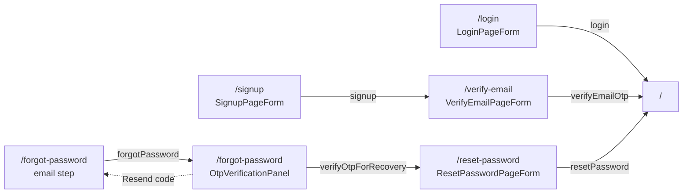

Components in [`src/components/auth/`](https://github.com/ozeaon/ozeaon-v2/tree/0a4f1a95824db87782f1221a4108019d174df3d9/src/components/auth) build the pages under `src/app/(auth)/` plus the `/error` page. Every auth page wraps its form in `AuthFormPanel` next to `AuthMarketingPanel`. Forms are client components calling server actions from `@/lib/supabase/actions` and validating with schemas from `@/zod/auth`.

See also: [Auth Flows](../../auth-and-accounts/auth-flows/)

## AuthFormPanel

The left-hand column of every auth page: `AuthHeader`, a heading, the form slot, an optional link below it, and a Privacy Policy footer. On large screens it takes 45 % of the width; below that it fills the screen.

**Source:** [src/components/auth/AuthFormPanel.tsx](https://github.com/ozeaon/ozeaon-v2/blob/0a4f1a95824db87782f1221a4108019d174df3d9/src/components/auth/AuthFormPanel.tsx)

## AuthHeader

The Ozeaon logo mark and wordmark, linking to `/`. Centred on mobile, left-aligned from `lg`.

**Source:** [src/components/auth/AuthHeader.tsx](https://github.com/ozeaon/ozeaon-v2/blob/0a4f1a95824db87782f1221a4108019d174df3d9/src/components/auth/AuthHeader.tsx)

## AuthMarketingPanel

The right-hand `<aside>` of the auth layout: a welcome heading, a short description and the auth image (loaded with `priority`). Hidden below `lg`.

**Source:** [src/components/auth/AuthMarketingPanel.tsx](https://github.com/ozeaon/ozeaon-v2/blob/0a4f1a95824db87782f1221a4108019d174df3d9/src/components/auth/AuthMarketingPanel.tsx)

## LoginPageForm

Email and password sign-in form. On success it calls `hydrate(result.user, result.activeAccount)` from `useAuth()` so the auth context is filled from the server-validated payload (not cookies), then calls `client?.auth.getSession()` as a best-effort browser-client sync before pushing to `/`.

**Source:** [src/components/auth/LoginPageForm.tsx](https://github.com/ozeaon/ozeaon-v2/blob/0a4f1a95824db87782f1221a4108019d174df3d9/src/components/auth/LoginPageForm.tsx)

## SignupPageForm

Registration form: full name, email, password and a 16-character access token. On success it navigates to `/verify-email?email=<encoded email>`.

**Source:** [src/components/auth/SignupPageForm.tsx](https://github.com/ozeaon/ozeaon-v2/blob/0a4f1a95824db87782f1221a4108019d174df3d9/src/components/auth/SignupPageForm.tsx)

## VerifyEmailPageForm

Wires `OtpVerificationPanel` to the signup email-verification actions for the given address. On success it does a full navigation with `window.location.href = "/"`.

**Source:** [src/components/auth/VerifyEmailPageForm.tsx](https://github.com/ozeaon/ozeaon-v2/blob/0a4f1a95824db87782f1221a4108019d174df3d9/src/components/auth/VerifyEmailPageForm.tsx)

## OtpVerificationPanel

Presentational OTP step: shows where the code was sent, a `mailto:` button, the 6-digit `OtpInput`, a verifying indicator and a "Resend code" link. Holds no state of its own; all callbacks are passed as props.

**Source:** [src/components/auth/OtpVerificationPanel.tsx](https://github.com/ozeaon/ozeaon-v2/blob/0a4f1a95824db87782f1221a4108019d174df3d9/src/components/auth/OtpVerificationPanel.tsx)

## ResetPasswordPageForm

New and confirm password form shown after a recovery OTP is verified. On success it navigates with `window.location.href = "/"` after a 100 ms `setTimeout`; a source comment says the delay avoids a Firefox streaming race condition. Cancel is a separate `<form action={signOut}>`.

**Source:** [src/components/auth/ResetPasswordPageForm.tsx](https://github.com/ozeaon/ozeaon-v2/blob/0a4f1a95824db87782f1221a4108019d174df3d9/src/components/auth/ResetPasswordPageForm.tsx)

## AuthError

Centred error page with a "Back to Login" button. Reads `code` and `message` search params via `useSearchParams()`, so the page that mounts it must wrap it in `<Suspense>`. `code=email_not_confirmed` shows a specific message; otherwise `message`, if present, replaces the generic error.

**Source:** [src/components/auth/AuthError.tsx](https://github.com/ozeaon/ozeaon-v2/blob/0a4f1a95824db87782f1221a4108019d174df3d9/src/components/auth/AuthError.tsx)

## GoogleSignIn

Currently unused — no page renders it. On mount it generates a random nonce, sends the SHA-256 hash to Google and passes the raw nonce to `supabase.auth.signInWithIdToken`. On first sign-in it bootstraps a `user_profiles` row and a default `user_settings` row. The Google client ID is hard-coded in the source.

**Source:** [src/components/auth/GoogleSignIn.tsx](https://github.com/ozeaon/ozeaon-v2/blob/0a4f1a95824db87782f1221a4108019d174df3d9/src/components/auth/GoogleSignIn.tsx)
