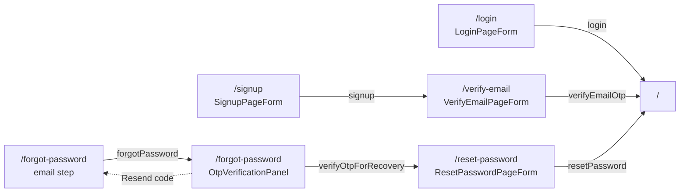

These components build the pages under the `src/app/(auth)/` route group plus the `/error` page. The `(auth)` layout renders each page next to `AuthMarketingPanel`; every page wraps its form in `AuthFormPanel`, which supplies `AuthHeader`, the heading and the Privacy Policy footer. The forms are client components that call server actions from `@/lib/supabase/actions` and validate with schemas from `@/zod/auth`.

- **Login** (`/login`): `LoginPageForm` calls `login`, then redirects to `/`.
- **Signup** (`/signup`): `SignupPageForm` calls `signup`, then redirects to `/verify-email?email=…`.
- **Verify email** (`/verify-email`): `VerifyEmailPageForm` renders `OtpVerificationPanel` and calls `verifyEmailOtp` / `resendVerificationEmail`.
- **Forgot password** (`/forgot-password`): the page itself (not a component in this folder) holds a two-step state. The email step calls `forgotPassword`; the OTP step renders `OtpVerificationPanel` and calls `verifyOtpForRecovery`, then routes to `/reset-password`. Its "Resend code" goes back to the email step, it doesn't resend in place.
- **Reset password** (`/reset-password`): `ResetPasswordPageForm` calls `resetPassword`, or `signOut` to cancel.



## AuthFormPanel

The left-hand column of every auth page: `AuthHeader`, a heading, the form, an optional link below it, and a footer link to `/privacy`. On large screens it takes 45% of the width (minimum `min-w-105`); below that it fills the screen.

- **Source:** [src/components/auth/AuthFormPanel.tsx](https://github.com/ozeaon/ozeaon-v2/blob/0a4f1a95824db87782f1221a4108019d174df3d9/src/components/auth/AuthFormPanel.tsx)
- **Kind:** Server component (no directive; the client `forgot-password` page renders it too)
- **Used in:** `src/app/(auth)/login/page.tsx`, `src/app/(auth)/signup/page.tsx`, `src/app/(auth)/forgot-password/page.tsx`, `src/app/(auth)/verify-email/page.tsx`, `src/app/(auth)/reset-password/page.tsx`

| Prop | Type | Default | Description |
|---|---|---|---|
| `heading` | `string` | — | Rendered as the page `<h1>`. |
| `form` | `React.ReactNode` | — | The form or panel body. |
| `link` | `React.ReactNode` | — | Optional content below the form, such as a "Sign Up" or "Back to Sign In" line. |

```tsx
<AuthFormPanel
  heading="Sign In"
  form={<LoginPageForm />}
  link={
    <p className="font-body text-secondary text-center">
      Don&apos;t have an account?{" "}
      <Link href="/signup" className="text-link hover:underline">
        Sign Up
      </Link>
    </p>
  }
/>
```

## AuthHeader

The Ozeaon logo mark (`OzeaonLogo`) and wordmark text, linking to `/`. It's centred on mobile and left-aligned from `lg`.

- **Source:** [src/components/auth/AuthHeader.tsx](https://github.com/ozeaon/ozeaon-v2/blob/0a4f1a95824db87782f1221a4108019d174df3d9/src/components/auth/AuthHeader.tsx)
- **Kind:** Server component (no directive)
- **Used in:** `src/components/auth/AuthFormPanel.tsx`

## AuthMarketingPanel

The right-hand `<aside>` of the auth layout: a "Welcome to Ozeaon" heading, a short description and the `/assets/ozeaon-auth-image.jpg` image (loaded with `priority`). It's hidden below `lg`.

- **Source:** [src/components/auth/AuthMarketingPanel.tsx](https://github.com/ozeaon/ozeaon-v2/blob/0a4f1a95824db87782f1221a4108019d174df3d9/src/components/auth/AuthMarketingPanel.tsx)
- **Kind:** Server component (no directive)
- **Used in:** `src/app/(auth)/layout.tsx`

```tsx
<main className="flex min-h-screen">
  {children}
  <AuthMarketingPanel />
</main>
```

## LoginPageForm

The email and password sign-in form, with a "Forgot password?" link on the password label.

- **Source:** [src/components/auth/LoginPageForm.tsx](https://github.com/ozeaon/ozeaon-v2/blob/0a4f1a95824db87782f1221a4108019d174df3d9/src/components/auth/LoginPageForm.tsx)
- **Kind:** Client component (`"use client"`)
- **Used in:** `src/app/(auth)/login/page.tsx`

Notable behaviour:

- Validates with `loginSchema` (email, plus a non-empty password).
- Submits through the `login` server action. On error it sets the message on the `password` field and shows `toast.error`.
- On success it calls `hydrate(result.user, result.activeAccount)` from `useAuth()`, so the auth context is filled from the server-validated payload, not from cookies. It then calls `client?.auth.getSession()` as a best-effort browser-client sync, followed by `router.refresh()` and `router.push("/")`.
- Uses `InputText`, `InputPassword` and `LoadingButton` (`variant="ozeaon"`).

## SignupPageForm

The registration form: full name, email, password and a registration access token.

- **Source:** [src/components/auth/SignupPageForm.tsx](https://github.com/ozeaon/ozeaon-v2/blob/0a4f1a95824db87782f1221a4108019d174df3d9/src/components/auth/SignupPageForm.tsx)
- **Kind:** Client component (`"use client"`)
- **Used in:** `src/app/(auth)/signup/page.tsx`

Notable behaviour:

- Validates with `signupSchema`. `display_name` must be 2–100 characters, `access_token` exactly 16 characters, and `password` uses the shared `passwordSchema`.
- Submits through the `signup` server action. Errors show as `toast.error`. On success it navigates to `/verify-email?email=<encoded email>`.

## VerifyEmailPageForm

Wires `OtpVerificationPanel` to the signup email-verification actions for the given address.

- **Source:** [src/components/auth/VerifyEmailPageForm.tsx](https://github.com/ozeaon/ozeaon-v2/blob/0a4f1a95824db87782f1221a4108019d174df3d9/src/components/auth/VerifyEmailPageForm.tsx)
- **Kind:** Client component (`"use client"`)
- **Used in:** `src/app/(auth)/verify-email/page.tsx`

| Prop | Type | Default | Description |
|---|---|---|---|
| `email` | `string` | — | The address the code was sent to. The page redirects to `/login` if the `email` search param is missing. |

Notable behaviour:

- When the 6th digit is entered, it posts `FormData` (`email`, `token`) to `verifyEmailOtp`. On success it does a full navigation with `window.location.href = "/"`. On error it shows "Invalid or expired verification code. Please try again."
- "Resend code" posts `email` and `type: "signup"` to `resendVerificationEmail` and shows a status message ("A new verification code has been sent to your email.") or an error.

```tsx
<AuthFormPanel
  heading="Verify your email"
  form={<VerifyEmailPageForm email={email} />}
/>
```

## OtpVerificationPanel

A presentational OTP step: it says where the code was sent, shows a `mailto:` "Check your email" button, the 6-digit `OtpInput`, a verifying indicator and a "Resend code" link button. It holds no state of its own.

- **Source:** [src/components/auth/OtpVerificationPanel.tsx](https://github.com/ozeaon/ozeaon-v2/blob/0a4f1a95824db87782f1221a4108019d174df3d9/src/components/auth/OtpVerificationPanel.tsx)
- **Kind:** No directive; renders inside client components
- **Used in:** `src/components/auth/VerifyEmailPageForm.tsx`, `src/app/(auth)/forgot-password/page.tsx`

| Prop | Type | Default | Description |
|---|---|---|---|
| `email` | `string` | — | Shown in the prompt and used for the `mailto:` link. |
| `error` | `string` | — | Passed to `OtpInput` as its error. |
| `message` | `string` | — | Optional status line, rendered with `role="status"`. |
| `isVerifying` | `boolean` | — | Disables the input and shows "Verifying the code...". |
| `isResending` | `boolean` | — | Disables the resend button and changes its label to "Resending...". |
| `onCompleteAction` | `(otp: string) => void` | — | Called by `OtpInput` once all 6 digits are entered. |
| `onResend` | `() => void` | — | "Resend code" click handler. |

```tsx
<OtpVerificationPanel
  email={submittedEmail}
  error={otpState.error}
  isVerifying={otpState.isLoading}
  isResending={false}
  onCompleteAction={handleOtpComplete}
  onResend={handleBackToEmail}
/>
```

## ResetPasswordPageForm

The new-password and confirm-password form shown after a recovery OTP is verified, with a Cancel button that signs out.

- **Source:** [src/components/auth/ResetPasswordPageForm.tsx](https://github.com/ozeaon/ozeaon-v2/blob/0a4f1a95824db87782f1221a4108019d174df3d9/src/components/auth/ResetPasswordPageForm.tsx)
- **Kind:** Client component (`"use client"`)
- **Used in:** `src/app/(auth)/reset-password/page.tsx`

Notable behaviour:

- Validates with `resetPasswordSchema`: `password` uses `passwordSchema`, and `confirmPassword` must match or it fails with "Passwords do not match".
- Submits through the `resetPassword` server action. Errors go to the form `root` error, shown in a `role="alert"` paragraph.
- On success it navigates with `window.location.href = "/"` after a 100 ms `setTimeout`. A source comment says the delay avoids a Firefox streaming race condition.
- Cancel is a separate `<form action={signOut}>`.

## AuthError

A centred error message with a "Back to Login" button. The title and message come from the `code` and `message` search params.

- **Source:** [src/components/auth/AuthError.tsx](https://github.com/ozeaon/ozeaon-v2/blob/0a4f1a95824db87782f1221a4108019d174df3d9/src/components/auth/AuthError.tsx)
- **Kind:** Client component (`"use client"`)
- **Used in:** `src/app/(main)/error/page.tsx`

Notable behaviour:

- `code=email_not_confirmed` shows "Email not confirmed" with confirmation instructions. Otherwise `message`, if present, replaces the generic "Sorry, an unexpected error occurred."
- It uses `useSearchParams()`, so the page wraps it in `<Suspense>` with a static fallback. The page calls `notFound()` when neither param is set.

```tsx
<Suspense fallback={/* static "Something went wrong" markup */}>
  <AuthError />
</Suspense>
```

## GoogleSignIn

A Google Identity Services "Continue with Google" button that signs in through Supabase. **Nothing renders it yet.** A `TODO(google-sign-in)` in the source says to wire it into the login and signup pages when Google auth is re-enabled.

- **Source:** [src/components/auth/GoogleSignIn.tsx](https://github.com/ozeaon/ozeaon-v2/blob/0a4f1a95824db87782f1221a4108019d174df3d9/src/components/auth/GoogleSignIn.tsx)
- **Kind:** Client component (`"use client"`), default export
- **Used in:** not used

Notable behaviour:

- On mount it generates a random nonce and its SHA-256 hash. The hash goes to Google, and the raw nonce goes to `supabase.auth.signInWithIdToken({ provider: "google", token, nonce })`.
- It registers `window.handleSignInWithGoogle` as the GIS callback and deletes it on unmount. It loads `https://accounts.google.com/gsi/client` with `next/script` and renders the button manually if the script is already loaded. The Google client ID is hard-coded.
- First sign-in bootstrap: if no `user_profiles` row exists, it inserts one. The `display_name` comes from Google metadata, falling back to the email local part and then to `"User"`. The `username` comes from `generateUniqueUsername`, and `role_descriptor` is `"Member"`. It then inserts a default `user_settings` row. A failed settings insert is logged but doesn't throw.
- On success it calls `router.push("/")`. Errors are logged with `logError` and nothing is shown to the user.
