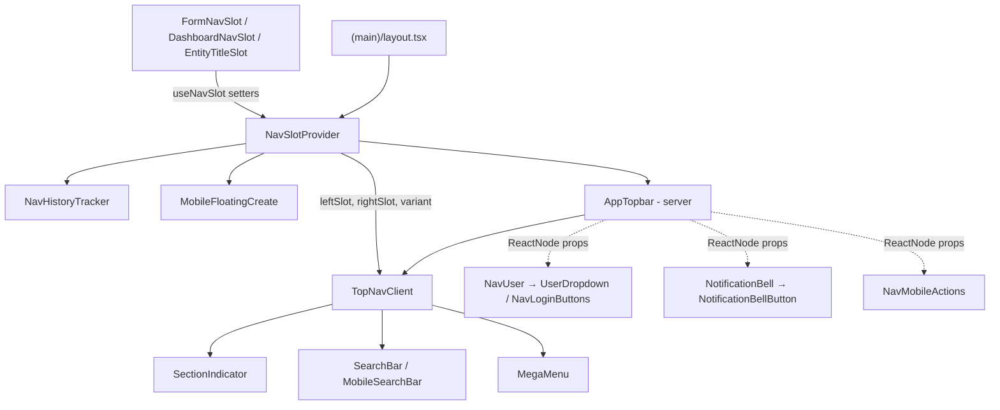

Navigation is one shared top bar plus a per-layout sidebar, coordinated through a client context.

- **`NavSlotProvider`** wraps everything under `src/app/(main)/layout.tsx`, alongside `NavHistoryTracker` and the mobile `MobileFloatingCreate` button. It holds the header's left/right slot overrides, colour variant, mega-menu and mobile-search open state, and the current entity name.
- **`AppTopbar`** (server) fetches the mega-menu counts and passes server-rendered user pieces (`NavUser`, `NotificationBell`, `NavUserAvatar`, `NavMobileGetStarted`, `NavMobileActions`) into **`TopNavClient`** as `ReactNode` props.
- **Sidebars:** `AppSidebar` (default export of `SideNav.tsx`) on feed, profile and reader layouts; `DashboardSidebar` on the dashboard layout. The editor layout has no sidebar.
- **Slots:** pages push their own header content with `FormNavSlot`, `DashboardNavSlot`, `EntityTitleSlot` (and domain slots such as `ArticleNavSlot` / `ProjectNavSlot` outside this folder). These render `null` and write to the context in an effect, clearing it on unmount.

| Layout | Top bar | Sidebar |
|---|---|---|
| `(main)/(feed)` | `<AppTopbar />` in `TwoColumnShell` | `<AppSidebar />` |
| `(main)/(profile)` | `<AppTopbar />` | `<AppSidebar />` |
| `(main)/(reader)` | `<AppTopbar />` | `<AppSidebar />` |
| `(main)/(dashboard)` | `<AppTopbar noLogo />` in `TwoColumnShell`, plus `DashboardNavSlot` | `<DashboardSidebar />` |
| `(main)/(editor)` | `<AppTopbar noUser neutralVariant hideLogoOnMobile />` | none |

**Desktop vs mobile.** Both sidebars are desktop-only (`hidden md:flex` on `AppSidebar`). On desktop the header shows `SectionIndicator` + `SearchBar` on the left and `NotificationBell` + `NavUser` on the right. Below `md` the right side shows `NavMobileActions` (search trigger and section indicator) and `NavMobileGetStarted`; opening search swaps the whole bar for `MobileSearchBar`, and the mega menu becomes a full-viewport dialog.

`@/components/nav` exports `AppTopbar`, `AppSidebar` and `DashboardSidebar`. Import everything else by path. See also [Navigation System](../../design-system/navigation-system/).

## Shell and Context

### AppTopbar

Server entry point for the top bar. It fetches the mega-menu counts and passes the server-rendered user pieces into `TopNavClient` as `ReactNode` props.

**Source:** [src/components/nav/AppTopbar.tsx](https://github.com/ozeaon/ozeaon-v2/blob/0a4f1a95824db87782f1221a4108019d174df3d9/src/components/nav/AppTopbar.tsx)

### TopNavClient

The sticky header: logo, sidebar toggle, left and right slots (defaulting to `SectionIndicator` + `SearchBar`), mobile search and the `MegaMenu`. Exported from `TopNav.tsx`.

**Source:** [src/components/nav/TopNav.tsx](https://github.com/ozeaon/ozeaon-v2/blob/0a4f1a95824db87782f1221a4108019d174df3d9/src/components/nav/TopNav.tsx)

### MegaMenu

The section menu opened from the section indicator: a drop-down panel on desktop, a full-viewport dialog on mobile. Entries marked `comingSoon` (Featured, Verified, the Resources section) are placeholders for roadmap features that aren't built yet.

**Source:** [src/components/nav/MegaMenu.tsx](https://github.com/ozeaon/ozeaon-v2/blob/0a4f1a95824db87782f1221a4108019d174df3d9/src/components/nav/MegaMenu.tsx)

### NavSlotProvider / useNavSlot

The context pages use to customise the top nav: left/right slot overrides, colour variant, mega-menu and mobile-search state, and the section entity name. `useNavSlot()` is inert outside a provider.

**Source:** [src/components/nav/NavSlotContext.tsx](https://github.com/ozeaon/ozeaon-v2/blob/0a4f1a95824db87782f1221a4108019d174df3d9/src/components/nav/NavSlotContext.tsx)

### NavHistoryTracker

Renders nothing. It records in-app navigation so `safeRouterBack` knows whether one of the app's own pages is behind the current one.

**Source:** [src/components/nav/NavHistoryTracker.tsx](https://github.com/ozeaon/ozeaon-v2/blob/0a4f1a95824db87782f1221a4108019d174df3d9/src/components/nav/NavHistoryTracker.tsx)

### EntityTitleSlot

Renders nothing. It sets the entity name so `SectionIndicator` shows it instead of a generic label. It is mounted by the profile layouts.

**Source:** [src/components/nav/EntityTitleSlot.tsx](https://github.com/ozeaon/ozeaon-v2/blob/0a4f1a95824db87782f1221a4108019d174df3d9/src/components/nav/EntityTitleSlot.tsx)

### BackControl

A link-styled "back" pill with a truncated label, used by `SectionIndicator` on single-entity pages.

**Source:** [src/components/nav/BackControl.tsx](https://github.com/ozeaon/ozeaon-v2/blob/0a4f1a95824db87782f1221a4108019d174df3d9/src/components/nav/BackControl.tsx)

### AppSidebar

The main desktop sidebar: a Create dropdown, collapsible Platform and My Library sections, and footer links. Its open state persists in the `oz_sidebar_state` cookie so the server renders it correctly. My Library's Resources, Notes and Bookmarks are disabled "Soon" items (roadmap). Default export of `SideNav.tsx`.

**Source:** [src/components/nav/SideNav.tsx](https://github.com/ozeaon/ozeaon-v2/blob/0a4f1a95824db87782f1221a4108019d174df3d9/src/components/nav/SideNav.tsx)

### DashboardSidebar

The dashboard sidebar: a "Create New" dropdown (Article, Project, Organisation) and the dashboard nav for the active account type.

**Source:** [src/components/nav/DashboardSidebar.tsx](https://github.com/ozeaon/ozeaon-v2/blob/0a4f1a95824db87782f1221a4108019d174df3d9/src/components/nav/DashboardSidebar.tsx)

## Components

### SectionIndicator

Shows where the viewer is. On section pages it is the mega-menu trigger. On create, edit and single-entity pages it shows a `BackControl` plus the entity title on desktop.

**Source:** [src/components/nav/components/SectionIndicator.tsx](https://github.com/ozeaon/ozeaon-v2/blob/0a4f1a95824db87782f1221a4108019d174df3d9/src/components/nav/components/SectionIndicator.tsx)

### NavUser and UserDropdown

`NavUser` (server) renders `UserDropdown` when signed in, or `NavLoginButtons` otherwise. `UserDropdown` is the desktop account menu: profile link, "Switch account" (opens `AccountSwitcherModal`), the dashboard nav and log out.

**Source:** [src/components/nav/components/NavUser.tsx](https://github.com/ozeaon/ozeaon-v2/blob/0a4f1a95824db87782f1221a4108019d174df3d9/src/components/nav/components/NavUser.tsx)

### AccountSwitcherModal

Lists the organisations the user administers plus the personal account. See [Account Switching](../../auth-and-accounts/account-switching/).

**Source:** [src/components/nav/components/AccountSwitcherModal.tsx](https://github.com/ozeaon/ozeaon-v2/blob/0a4f1a95824db87782f1221a4108019d174df3d9/src/components/nav/components/AccountSwitcherModal.tsx)

### DashboardMobileMenu

The mobile dashboard account menu, with the same actions as `UserDropdown`.

**Source:** [src/components/nav/components/DashboardMobileMenu.tsx](https://github.com/ozeaon/ozeaon-v2/blob/0a4f1a95824db87782f1221a4108019d174df3d9/src/components/nav/components/DashboardMobileMenu.tsx)

### NavUserAvatar

A server-streamed avatar link to `/settings` for the active account. Renders nothing when signed out.

**Source:** [src/components/nav/components/NavUserAvatar.tsx](https://github.com/ozeaon/ozeaon-v2/blob/0a4f1a95824db87782f1221a4108019d174df3d9/src/components/nav/components/NavUserAvatar.tsx)

### NavLoginButtons

"Log In" and "Create Account" buttons for signed-out desktop viewers. Exported from `NavLogin.tsx`.

**Source:** [src/components/nav/components/NavLogin.tsx](https://github.com/ozeaon/ozeaon-v2/blob/0a4f1a95824db87782f1221a4108019d174df3d9/src/components/nav/components/NavLogin.tsx)

### NavMobileActions, NavMobileGetStarted and MobileSearchTrigger

The mobile header controls: the search trigger and section indicator (compact when the signed-out "Get Started" button sits beside them). The search trigger calls `openSearch()` from `useNavSlot()`.

**Source:** [src/components/nav/components/NavMobileActions.tsx](https://github.com/ozeaon/ozeaon-v2/blob/0a4f1a95824db87782f1221a4108019d174df3d9/src/components/nav/components/NavMobileActions.tsx)

### MobileFloatingCreate

The mobile-only floating "+" button. When signed in it opens the create menu; when signed out it sends you to login. It hides itself on settings, create/edit and auth pages, using a path list in the component. That list includes `/register`, which isn't a real route; signup is `/signup`.

**Source:** [src/components/nav/components/MobileFloatingCreate.tsx](https://github.com/ozeaon/ozeaon-v2/blob/0a4f1a95824db87782f1221a4108019d174df3d9/src/components/nav/components/MobileFloatingCreate.tsx)

### NotificationBell and NotificationBellButton

`NotificationBell` (server) reads the unread count. It renders only when signed in and `env.features.notifications` is on, because notifications are in progress. On desktop the button opens the [notification overlay](../notifications/). On mobile it's a bare button, because the notifications page isn't built yet.

**Source:** [src/components/nav/components/NotificationBell.tsx](https://github.com/ozeaon/ozeaon-v2/blob/0a4f1a95824db87782f1221a4108019d174df3d9/src/components/nav/components/NotificationBell.tsx)

### Sidebar Building Blocks

`NavItem` (link row with icon, badge and active/disabled states), `NavSectionHeading` (collapsible heading) and `NavSupportItem` (secondary link).

**Source:** [src/components/nav/components/NavItem.tsx](https://github.com/ozeaon/ozeaon-v2/blob/0a4f1a95824db87782f1221a4108019d174df3d9/src/components/nav/components/NavItem.tsx)

### Mega Menu Building Blocks

`MegaMenuSection` (one column with its "Coming Soon" pill), `MegaMenuLink` (entry with optional count and pill) and `MegaMenuTrigger` (the pill that toggles the menu).

**Source:** [src/components/nav/components/MegaMenuSection.tsx](https://github.com/ozeaon/ozeaon-v2/blob/0a4f1a95824db87782f1221a4108019d174df3d9/src/components/nav/components/MegaMenuSection.tsx)

### BackButton

The shared ghost "Back" button for nav slots, and the one place to change back-navigation styling in the top bar.

**Source:** [src/components/nav/components/BackButton.tsx](https://github.com/ozeaon/ozeaon-v2/blob/0a4f1a95824db87782f1221a4108019d174df3d9/src/components/nav/components/BackButton.tsx)

## Slots

Slots render `null` and write to the nav context in a layout effect, resetting it on unmount.

### FormNavSlot

Replaces the header with a back button, the form title, a saving/saved status and caller-supplied right-side actions. Used by the create/edit forms.

**Source:** [src/components/nav/slots/FormNavSlot.tsx](https://github.com/ozeaon/ozeaon-v2/blob/0a4f1a95824db87782f1221a4108019d174df3d9/src/components/nav/slots/FormNavSlot.tsx)

### DashboardNavSlot

Sets the dashboard header: account avatar and name, the dashboard mega-menu trigger on desktop, `DashboardMobileMenu` on mobile, and a "Back To Ozeaon" link. The layout passes it `adminOrgsPromise` so the account list streams in.

**Source:** [src/components/nav/slots/DashboardNavSlot.tsx](https://github.com/ozeaon/ozeaon-v2/blob/0a4f1a95824db87782f1221a4108019d174df3d9/src/components/nav/slots/DashboardNavSlot.tsx)
