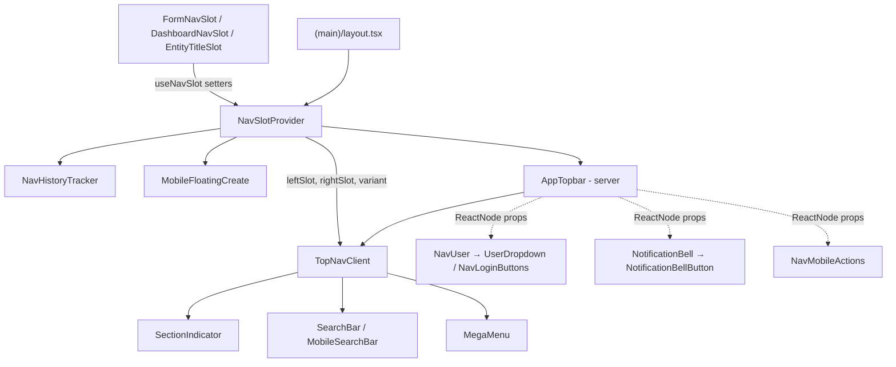

Navigation is one shared top bar plus a per-layout sidebar, coordinated through a client context.

- **`NavSlotProvider`** wraps everything under `src/app/(main)/layout.tsx`, alongside `NavHistoryTracker` and the mobile `MobileFloatingCreate` button. It holds the header's left/right slot overrides, colour variant, mega-menu and mobile-search open state, and the current entity name.
- **`AppTopbar`** (server) fetches the mega-menu counts and passes server-rendered user pieces (`NavUser`, `NotificationBell`, `NavUserAvatar`, `NavMobileGetStarted`, `NavMobileActions`) into **`TopNavClient`** as `ReactNode` props.
- **Sidebars:** `AppSidebar` (default export of `SideNav.tsx`) on feed, profile and reader layouts; `DashboardSidebar` on the dashboard layout. The editor layout has no sidebar.
- **Slots:** pages push their own header content with `FormNavSlot`, `DashboardNavSlot`, `EntityTitleSlot` (and domain slots such as `ArticleNavSlot` / `ProjectNavSlot` outside this folder). These render `null` and write to the context in an effect, clearing it on unmount.

| Layout | Top bar | Sidebar |
|---|---|---|
| `(main)/(feed)` | `<AppTopbar />` in `TwoColumnShell` | `<AppSidebar />` |
| `(main)/(profile)` | `<AppTopbar />` | `<AppSidebar />` |
| `(main)/(reader)` | `<AppTopbar />` | `<AppSidebar />` |
| `(main)/(dashboard)` | `<AppTopbar noLogo />` in `TwoColumnShell`, plus `DashboardNavSlot` | `<DashboardSidebar />` |
| `(main)/(editor)` | `<AppTopbar noUser neutralVariant hideLogoOnMobile />` | none |

**Desktop vs mobile.** Both sidebars are desktop-only (`hidden md:flex` on `AppSidebar`). On desktop the header shows `SectionIndicator` + `SearchBar` on the left and `NotificationBell` + `NavUser` on the right. Below `md` the right side shows `NavMobileActions` (search trigger and section indicator) and `NavMobileGetStarted`; opening search swaps the whole bar for `MobileSearchBar`, and the mega menu becomes a full-viewport dialog.



- **Barrel:** `src/components/nav/index.tsx` exports `AppTopbar`, `AppSidebar` (default export of `SideNav.tsx`) and `DashboardSidebar`. Everything else is imported by path.

## Shell and context

Files at the root of `src/components/nav/`.

### AppTopbar

Server entry point for the top bar. Fetches the four mega-menu counts and composes the user-specific pieces for `TopNavClient`.

- **Source:** [src/components/nav/AppTopbar.tsx](https://github.com/ozeaon/ozeaon-v2/blob/0a4f1a95824db87782f1221a4108019d174df3d9/src/components/nav/AppTopbar.tsx)
- **Kind:** Server component (async)
- **Used in:** `src/app/(main)/(feed)/layout.tsx`, `src/app/(main)/(dashboard)/layout.tsx`, `src/app/(main)/(editor)/layout.tsx` (also `(profile)` and `(reader)` layouts)

| Prop | Type | Default | Description |
|---|---|---|---|
| `noUser` | `boolean` | `false` | Omits `NavUser`, `NotificationBell`, `NavUserAvatar` and `NavMobileGetStarted`; `NavMobileActions` gets `hasGetStarted={false}`. |
| `noLogo` | `boolean` | `false` | Hides the logo link. |
| `hideLogoOnMobile` | `boolean` | `false` | Hides the logo below `md`. |
| `neutralVariant` | `boolean` | `false` | Uses the neutral header background instead of the account variant gradient. |

Notable behaviour:

- Counts come from `getPublishedProjectsCount`, `getPublishedArticlesCount`, `getFeedPostsCount` and `getVisibleOrganizationsCount`, run in parallel.
- `NotificationBell` is also omitted when `env.features.notifications` is false.

```tsx
<TwoColumnShell topbar={<AppTopbar noLogo />} sidebar={<DashboardSidebar />}>
```

### TopNavClient

The sticky header itself: logo, sidebar toggle, left slot (default `SectionIndicator` + `SearchBar`), right slot, mobile search and the `MegaMenu`. Exported from `TopNav.tsx`.

- **Source:** [src/components/nav/TopNav.tsx](https://github.com/ozeaon/ozeaon-v2/blob/0a4f1a95824db87782f1221a4108019d174df3d9/src/components/nav/TopNav.tsx)
- **Kind:** Client component (`"use client"`)
- **Used in:** `src/components/nav/AppTopbar.tsx`

| Prop | Type | Default | Description |
|---|---|---|---|
| `navUser` | `ReactNode` | — | Desktop account control (shown `md` and up). |
| `notificationBell` | `ReactNode` | — | Bell, hidden while the mega menu is open. |
| `navUserAvatar` | `ReactNode` | — | Avatar shown in place of bell/user while the mega menu is open. |
| `navMobileGetStarted` | `ReactNode` | — | Mobile "Get Started" button. |
| `navMobileActions` | `ReactNode` | — | Mobile search trigger and section indicator. |
| `noLogo` | `boolean` | `false` | Hides the logo link. |
| `hideLogoOnMobile` | `boolean` | `false` | Hides the logo below `md`. |
| `neutralVariant` | `boolean` | `false` | Forces the `neutral` header variant. |
| `counts` | `MegaMenuCounts` | — | Passed to `MegaMenu`. |

Notable behaviour:

- Sets the context `variant` to `"org"` when the active account is an organization, otherwise `"default"`; this picks the header gradient.
- Closes the mega menu and mobile search on every pathname change.
- A page-supplied `leftSlot` / `rightSlot` from `useNavSlot()` replaces the defaults. When a `rightSlot` is set, the mobile actions and Get Started are not rendered.
- On `SEARCH_PATHNAME` the mobile search bar is "docked" (always shown); elsewhere it opens as an overlay with a scrim `button` (`aria-label="Close search"`) that closes it.
- Shows a sidebar open/close `IconButton` on desktop when `useSidebarSafe()` reports a sidebar is available. The site title is hidden when the sidebar is closed.
- `SearchBar` and `MobileSearchBar` each sit in a `Suspense` boundary because they read `useSearchParams()`, keeping static pages prerenderable.
- The header has `viewTransitionName: "top-nav"`.

### MegaMenu

Section menu (Community, Articles, Projects, Organisations, Resources) opened from the section indicator. A drop-down panel with scrim on desktop; a full-viewport dialog on mobile.

- **Source:** [src/components/nav/MegaMenu.tsx](https://github.com/ozeaon/ozeaon-v2/blob/0a4f1a95824db87782f1221a4108019d174df3d9/src/components/nav/MegaMenu.tsx)
- **Kind:** Client component (`"use client"`)
- **Used in:** `src/components/nav/TopNav.tsx`

| Prop | Type | Default | Description |
|---|---|---|---|
| `isOpen` | `boolean` | — | Open state. |
| `onCloseAction` | `() => void` | — | Close handler (Escape, scrim, close button, link click). |
| `counts` | `MegaMenuCounts` | — | `{ community, articles, projects, organisations }`, shown with `toLocaleString()` next to "Browse All …". |
| `navUserAvatar` | `ReactNode` | — | Avatar shown in the mobile menu header. |

Notable behaviour:

- Portals into `document.body` and renders nothing until `useHydration()` is true.
- "Create …" / "Write Article" links point to `/login?redirect=…` when there is no signed-in user (`useAuth()`).
- Featured/Verified links are marked `comingSoon`; the entire Resources section is `comingSoon`. Coming-soon links render as non-interactive spans.
- Escape closes it while open. The mobile view has `role="dialog"`, `aria-modal="true"`, `aria-label="Navigation menu"`.
- Exports the `MegaMenuCounts` type.

```tsx
<MegaMenu
  isOpen={megaMenuOpen}
  onCloseAction={closeMegaMenu}
  counts={counts}
  navUserAvatar={navUserAvatar}
/>
```

### NavSlotProvider / useNavSlot

Context that lets pages customise the top nav and that holds shared nav UI state. Exported from `NavSlotContext.tsx`.

- **Source:** [src/components/nav/NavSlotContext.tsx](https://github.com/ozeaon/ozeaon-v2/blob/0a4f1a95824db87782f1221a4108019d174df3d9/src/components/nav/NavSlotContext.tsx)
- **Kind:** Client component (`"use client"`)
- **Used in:** `src/app/(main)/layout.tsx` (provider); `useNavSlot` in `src/components/nav/TopNav.tsx`, `src/components/articles/pages/ArticleNavSlot.tsx`, `src/components/projects/page/ProjectNavSlot.tsx`

`NavSlotProvider` takes only `children`. `useNavSlot()` returns:

| Field | Type | Description |
|---|---|---|
| `leftSlot` / `setLeftSlot` | `ReactNode \| null` / setter | Replaces the default left side of the header. |
| `rightSlot` / `setRightSlot` | `ReactNode \| null` / setter | Replaces the default right side. |
| `variant` / `setVariant` | `"default" \| "org"` / setter | Header colour variant. |
| `megaMenuOpen`, `toggleMegaMenu`, `closeMegaMenu` | `boolean`, `() => void`, `() => void` | Mega menu state. Toggling also closes search. |
| `searchOpen`, `openSearch`, `closeSearch` | `boolean`, `() => void`, `() => void` | Mobile search overlay state. Opening closes the mega menu. |
| `sectionEntityName` / `setSectionEntityName` | `string \| null` / `Dispatch<SetStateAction<…>>` | Entity title shown by `SectionIndicator`. |

Outside a provider, the default context value is inert (no-op setters).

```tsx
<NavSlotProvider>
  <NavHistoryTracker />
  {children}
  <MobileFloatingCreate />
</NavSlotProvider>
```

### NavHistoryTracker

Renders nothing; records in-app navigation so `safeRouterBack` knows whether one of the app's own pages is behind the current one.

- **Source:** [src/components/nav/NavHistoryTracker.tsx](https://github.com/ozeaon/ozeaon-v2/blob/0a4f1a95824db87782f1221a4108019d174df3d9/src/components/nav/NavHistoryTracker.tsx)
- **Kind:** Client component (`"use client"`)
- **Used in:** `src/app/(main)/layout.tsx`

Calls `initNavHistory()` on mount and `syncNavigation` on `popstate` (both from `@/utils/nav-history`). Mount once.

### EntityTitleSlot

Renders nothing; sets `sectionEntityName` so `SectionIndicator` shows the entity's name instead of a generic label.

- **Source:** [src/components/nav/EntityTitleSlot.tsx](https://github.com/ozeaon/ozeaon-v2/blob/0a4f1a95824db87782f1221a4108019d174df3d9/src/components/nav/EntityTitleSlot.tsx)
- **Kind:** Client component (`"use client"`)
- **Used in:** `src/app/(main)/(profile)/organizations/[slug]/layout.tsx`, `src/app/(main)/(profile)/profiles/[username]/layout.tsx`

| Prop | Type | Default | Description |
|---|---|---|---|
| `title` | `string` | — | Entity name to show. |

On unmount it clears the name only if it is still its own `title`, so a newer slot's value is not wiped.

```tsx
<EntityTitleSlot title={org.name} />
```

### BackControl

Link-styled "back" pill with an undo icon and a truncated label.

- **Source:** [src/components/nav/BackControl.tsx](https://github.com/ozeaon/ozeaon-v2/blob/0a4f1a95824db87782f1221a4108019d174df3d9/src/components/nav/BackControl.tsx)
- **Kind:** Client component (`"use client"`)
- **Used in:** `src/components/nav/components/SectionIndicator.tsx`

| Prop | Type | Default | Description |
|---|---|---|---|
| `label` | `string` | — | Link text. |
| `href` | `string` | — | Destination. |
| `className` | `string` | — | Extra classes. |

```tsx
<BackControl label={resolved.back.label} href={resolved.back.href} />
```

### AppSidebar

Main desktop sidebar: a "Create" dropdown, collapsible "Platform" and "My Library" sections, and footer links. Default export of `SideNav.tsx`, re-exported as `AppSidebar`.

- **Source:** [src/components/nav/SideNav.tsx](https://github.com/ozeaon/ozeaon-v2/blob/0a4f1a95824db87782f1221a4108019d174df3d9/src/components/nav/SideNav.tsx)
- **Kind:** Client component (`"use client"`)
- **Used in:** `src/app/(main)/(feed)/layout.tsx`, `src/app/(main)/(profile)/layout.tsx`, `src/app/(main)/(reader)/layout.tsx`

| Prop | Type | Default | Description |
|---|---|---|---|
| `...props` | `ComponentProps<typeof Sidebar>` | — | Spread onto the underlying `Sidebar`; `className` is merged. |

Notable behaviour:

- Returns `null` when `useSidebar().open` is false. Hidden below `md`. Open/closed state is cookie-persisted per page type (`oz_sidebar_state`), hence the `suppressHydrationWarning`.
- The column is sticky under the top bar via `STICKY_NAV_CLASS` (`sticky top-14`, height `calc(100svh - 7rem)`) and `w-58` wide.
- "Create" is a controlled `DropdownMenu` (closed by default) listing `sitemap.addItems` — Article, Project, Organisation.
- "Platform" (Community, Articles, Projects) and "My Library" are independently collapsible, both open by default; the collapsed/expanded state is local `useState` only, not persisted.
- Create items, Platform items and footer items come from `@/config/sitemap` (`addItems`, `leftNav`, `footerNav`); the footer (Network, Organisations) is pinned to the bottom with `mt-auto`.
- Platform items are active on exact pathname match; footer items also match nested paths.
- "My Library" (Resources, Notes, Bookmarks) items are hard-coded as disabled with a "Soon" badge.
- No auth coupling: nothing in the file reads the user, so it renders the same signed in or out.

```tsx
<TwoColumnShell topbar={<AppTopbar />} sidebar={<AppSidebar />}>
```

### DashboardSidebar

Dashboard sidebar: a "Create New" dropdown (Article, Project, Organisation) and the dashboard nav for the active account type.

- **Source:** [src/components/nav/DashboardSidebar.tsx](https://github.com/ozeaon/ozeaon-v2/blob/0a4f1a95824db87782f1221a4108019d174df3d9/src/components/nav/DashboardSidebar.tsx)
- **Kind:** Client component (`"use client"`)
- **Used in:** `src/app/(main)/(dashboard)/layout.tsx`

Notable behaviour:

- Items come from `DASHBOARD_NAV_ITEMS[activeAccount.type]` (`@/config`), so user and organization accounts get different menus.
- Active state: `/settings` matches exactly; every other item also matches nested paths.
- Wrapped in `SidebarShell` from `@/components/ui`.

```tsx
<TwoColumnShell topbar={<AppTopbar noLogo />} sidebar={<DashboardSidebar />}>
```

## Components

Files in `src/components/nav/components/`.

### SectionIndicator

Shows where the viewer is. On section pages it is the mega-menu trigger labelled with the section; on create/edit/single-entity pages it shows a `BackControl` plus the entity title on desktop, and the trigger on mobile.

- **Source:** [src/components/nav/components/SectionIndicator.tsx](https://github.com/ozeaon/ozeaon-v2/blob/0a4f1a95824db87782f1221a4108019d174df3d9/src/components/nav/components/SectionIndicator.tsx)
- **Kind:** Client component (`"use client"`)
- **Used in:** `src/components/nav/TopNav.tsx`, `src/components/nav/components/NavMobileActions.tsx`

| Prop | Type | Default | Description |
|---|---|---|---|
| `compact` | `boolean` | `false` | Icon and chevron only, no label (label moves to `aria-label`). |

Notable behaviour:

- Resolves the section from the first path segment against `sitemap.pages` (falling back to the first page); `/` is "Home".
- `/{section}/new` → "New {Singular}", `/{section}/{x}/edit` → "Edit {Singular}", `/{section}/{x}` → the section title, each overridden by `sectionEntityName` when set. Singular labels exist for projects, articles, posts and organizations; others fall back to "Item".
- Back link reads "Back to {section title}".

```tsx
<SectionIndicator compact={compact} />
```

### NavUser

Server wrapper for the desktop account control: `UserDropdown` when signed in, `NavLoginButtons` otherwise.

- **Source:** [src/components/nav/components/NavUser.tsx](https://github.com/ozeaon/ozeaon-v2/blob/0a4f1a95824db87782f1221a4108019d174df3d9/src/components/nav/components/NavUser.tsx)
- **Kind:** Server component (async child in `Suspense`, fallback `null`)
- **Used in:** `src/components/nav/AppTopbar.tsx`

Calls `getAuthUser()` and passes `getAdminOrgs(supabase, user.id)` to `UserDropdown` as an unawaited promise. The file also contains a commented-out earlier client implementation.

```tsx
navUser={noUser ? null : <NavUser />}
```

### UserDropdown

Desktop account menu: avatar trigger, a header linking to the active profile, "Switch account", the dashboard nav items, and "Log out". Opens `AccountSwitcherModal`.

- **Source:** [src/components/nav/components/UserDropdown.tsx](https://github.com/ozeaon/ozeaon-v2/blob/0a4f1a95824db87782f1221a4108019d174df3d9/src/components/nav/components/UserDropdown.tsx)
- **Kind:** Client component (`"use client"`)
- **Used in:** `src/components/nav/components/NavUser.tsx`

| Prop | Type | Default | Description |
|---|---|---|---|
| `user` | `AuthUser` | — | Signed-in user. |
| `activeAccount` | `ActiveAccount` | — | Current user or organization account. |
| `adminOrgsPromise` | `Promise<AdminOrg[]>` | — | Organizations the user administers, for the switcher. |

Notable behaviour:

- Renders `null` until hydrated (`useHydration()`).
- Acting as an organization: trigger shows the organization logo and name; header links to `/organizations/{slug}` with subtitle "Organisation". As a user: header links to `/profiles/{username}` (no link if there is no username) with the email as subtitle.
- User avatar prefers `platform_meta.avatar_image.path`, falling back to `user_metadata.avatar_url`.
- Menu items come from `DASHBOARD_NAV_ITEMS[activeAccount.type]`. "Log out" calls `useAuth().logout()`.

```tsx
<UserDropdown
  user={user}
  activeAccount={activeAccount}
  adminOrgsPromise={adminOrgsPromise}
/>
```

### AccountSwitcherModal

Dialog listing the organizations the user administers plus the personal account, with an "Add New Account" link to `/organizations/new`.

- **Source:** [src/components/nav/components/AccountSwitcherModal.tsx](https://github.com/ozeaon/ozeaon-v2/blob/0a4f1a95824db87782f1221a4108019d174df3d9/src/components/nav/components/AccountSwitcherModal.tsx)
- **Kind:** Client component (`"use client"`)
- **Used in:** `src/components/nav/components/UserDropdown.tsx`, `src/components/nav/components/DashboardMobileMenu.tsx`

| Prop | Type | Default | Description |
|---|---|---|---|
| `open` | `boolean` | — | Dialog open state. |
| `onOpenChange` | `(open: boolean) => void` | — | Open state setter. |
| `user` | `AuthUser` | — | Signed-in user, shown as the personal account. |
| `activeAccount` | `ActiveAccount` | — | Marks the active card. |
| `adminOrgsPromise` | `Promise<AdminOrg[]>` | — | Unwrapped with `use()` inside a `Suspense` boundary (spinner fallback). |

Notable behaviour:

- Clicking a card calls `switchToOrg(id)` or `switchToUser()` from `useAccountSwitch()`, then `router.refresh()` and closes. Failures show a "Failed to switch account" toast.
- The active card is disabled with `aria-current="true"` and a check mark; the switching card shows a spinner.
- Wrapped in a React `ViewTransition` named `dialog-modal`.

```tsx
<AccountSwitcherModal
  open={switcherOpen}
  onOpenChange={setSwitcherOpen}
  user={user}
  activeAccount={activeAccount}
  adminOrgsPromise={adminOrgsPromise}
/>
```

### DashboardMobileMenu

Mobile dashboard account menu: avatar + name trigger opening a dropdown with "Switch account", the dashboard nav items and "Log out".

- **Source:** [src/components/nav/components/DashboardMobileMenu.tsx](https://github.com/ozeaon/ozeaon-v2/blob/0a4f1a95824db87782f1221a4108019d174df3d9/src/components/nav/components/DashboardMobileMenu.tsx)
- **Kind:** Client component (`"use client"`)
- **Used in:** `src/components/nav/slots/DashboardNavSlot.tsx`

| Prop | Type | Default | Description |
|---|---|---|---|
| `user` | `AuthUser` | — | Signed-in user; the dropdown header always shows the user, not the organization. |
| `activeAccount` | `ActiveAccount` | — | Selects `DASHBOARD_NAV_ITEMS[activeAccount.type]`. |
| `adminOrgsPromise` | `Promise<AdminOrg[]>` | — | Passed to `AccountSwitcherModal`. |
| `displayName` | `string` | — | Name on the trigger. |
| `triggerAvatarUrl` | `string \| null` | — | Avatar on the trigger. |

```tsx
<DashboardMobileMenu
  user={user}
  activeAccount={activeAccount}
  adminOrgsPromise={adminOrgsPromise}
  displayName={displayName}
  triggerAvatarUrl={avatarUrl}
/>
```

### NavUserAvatar

Server-streamed avatar link to `/settings` for the active account (organization logo or user avatar). Renders nothing when signed out.

- **Source:** [src/components/nav/components/NavUserAvatar.tsx](https://github.com/ozeaon/ozeaon-v2/blob/0a4f1a95824db87782f1221a4108019d174df3d9/src/components/nav/components/NavUserAvatar.tsx)
- **Kind:** Server component (async child in `Suspense`, fallback `null`)
- **Used in:** `src/components/nav/AppTopbar.tsx` (rendered by `TopNavClient` and `MegaMenu` while the mega menu is open)

Link has `aria-label="Profile settings"`.

```tsx
navUserAvatar={noUser ? null : <NavUserAvatar />}
```

### NavLoginButtons

"Log In" (`/login`) and "Create Account" (`/signup`) buttons shown in place of `UserDropdown` when the desktop header has no signed-in user. Exported from `NavLogin.tsx`.

- **Source:** [src/components/nav/components/NavLogin.tsx](https://github.com/ozeaon/ozeaon-v2/blob/0a4f1a95824db87782f1221a4108019d174df3d9/src/components/nav/components/NavLogin.tsx)
- **Kind:** No directive (shared)
- **Used in:** `src/components/nav/components/NavUser.tsx`

Takes no props. It renders two `Button asChild` links, both with `prefetch={false}`:

| Button | Variant | Icon | Links to |
|---|---|---|---|
| "Log In" | `sunken` | `LogIn` | `/login` |
| "Create Account" | `ozeaon` | `UserPlus` | `/signup` |

Notable behaviour:

- Holds no auth state of its own; it is the signed-out branch of the server `NavUser`, which swaps it in when `getAuthUser()` returns no user.
- Desktop only — `TopNavClient` renders `NavUser` from `md` up. On mobile, signed-out viewers get `NavMobileActions` and `NavMobileGetStarted` instead.

```tsx
if (!user) return <NavLoginButtons />;
```

### NavMobileActions

Mobile header triggers: `MobileSearchTrigger` and `SectionIndicator`, in compact (icon-only) form when the Get Started button is showing beside them.

- **Source:** [src/components/nav/components/NavMobileActions.tsx](https://github.com/ozeaon/ozeaon-v2/blob/0a4f1a95824db87782f1221a4108019d174df3d9/src/components/nav/components/NavMobileActions.tsx)
- **Kind:** Server component (async child in `Suspense`)
- **Used in:** `src/components/nav/AppTopbar.tsx`

| Prop | Type | Default | Description |
|---|---|---|---|
| `hasGetStarted` | `boolean` | — | Whether the caller renders Get Started at all (`false` when `AppTopbar` has `noUser`). |

Compact when `hasGetStarted && !user`. The auth read is suspended so it does not opt static pages into dynamic rendering; the fallback is an empty `h-9` row.

```tsx
navMobileActions={<NavMobileActions hasGetStarted={!noUser} />}
```

### NavMobileGetStarted

Mobile "Get Started" button linking to `/signup`, shown only to signed-out viewers.

- **Source:** [src/components/nav/components/NavMobileGetStarted.tsx](https://github.com/ozeaon/ozeaon-v2/blob/0a4f1a95824db87782f1221a4108019d174df3d9/src/components/nav/components/NavMobileGetStarted.tsx)
- **Kind:** Server component (async child in `Suspense`, fallback `null`)
- **Used in:** `src/components/nav/AppTopbar.tsx`

`TopNavClient` hides it while the mega menu is open.

```tsx
navMobileGetStarted={noUser ? null : <NavMobileGetStarted />}
```

### MobileSearchTrigger

Mobile button that opens the search overlay via `openSearch()` from `useNavSlot()`.

- **Source:** [src/components/nav/components/MobileSearchTrigger.tsx](https://github.com/ozeaon/ozeaon-v2/blob/0a4f1a95824db87782f1221a4108019d174df3d9/src/components/nav/components/MobileSearchTrigger.tsx)
- **Kind:** Client component (`"use client"`)
- **Used in:** `src/components/nav/components/NavMobileActions.tsx`

| Prop | Type | Default | Description |
|---|---|---|---|
| `compact` | `boolean` | `false` | Icon only, with `aria-label="Search"`. |

Sets `aria-expanded` from `searchOpen`, and returns focus to itself when search closes.

```tsx
<MobileSearchTrigger compact={compact} />
```

### MobileFloatingCreate

Mobile-only fixed "+" button. Signed in, it opens a dropdown of `sitemap.addItems`; signed out, it pushes to `/login?redirect={pathname}`.

- **Source:** [src/components/nav/components/MobileFloatingCreate.tsx](https://github.com/ozeaon/ozeaon-v2/blob/0a4f1a95824db87782f1221a4108019d174df3d9/src/components/nav/components/MobileFloatingCreate.tsx)
- **Kind:** Client component (`"use client"`)
- **Used in:** `src/app/(main)/layout.tsx`

Hidden on `/settings`, `/projects/new`, `/projects/{x}/edit`, `/articles/new`, `/articles/{x}/edit`, `/organizations/new`, `/login` and `/register` (and their sub-paths).

```tsx
<MobileFloatingCreate />
```

### NotificationBell

Server wrapper that reads the unread notification count for the active account and renders `NotificationBellButton`. Renders nothing when signed out.

- **Source:** [src/components/nav/components/NotificationBell.tsx](https://github.com/ozeaon/ozeaon-v2/blob/0a4f1a95824db87782f1221a4108019d174df3d9/src/components/nav/components/NotificationBell.tsx)
- **Kind:** Server component (async child in `Suspense`, fallback `null`)
- **Used in:** `src/components/nav/AppTopbar.tsx`

Uses `getUnreadNotificationCount(supabase, user.id, notificationScopeOrgId(activeAccount))`.

```tsx
notificationBell={
  noUser || !env.features.notifications ? null : <NotificationBell />
}
```

### NotificationBellButton

Bell `IconButton` with an unread badge. On desktop it opens a popover with `NotificationOverlay` (see [Notifications](../notifications/)); on mobile it is the bare button.

- **Source:** [src/components/nav/components/NotificationBellButton.tsx](https://github.com/ozeaon/ozeaon-v2/blob/0a4f1a95824db87782f1221a4108019d174df3d9/src/components/nav/components/NotificationBellButton.tsx)
- **Kind:** Client component (`"use client"`)
- **Used in:** `src/components/nav/components/NotificationBell.tsx`

| Prop | Type | Default | Description |
|---|---|---|---|
| `userId` | `string` | — | Passed to `useNotificationCount` and `NotificationOverlay`. |
| `initialCount` | `number` | — | Server-read unread count, seeding `useNotificationCount`. |

Notable behaviour:

- Badge caps at `9+`. Label reads "Notifications, {n} unread" or "Notifications, none new".
- On mobile (`useIsMobile()`) no popover is attached; per the source comment the bell waits for a dedicated notifications page.
- Ordered first in the row on mobile, natural order from `md`.
- The popover closes on a second trigger press, outside press or Escape; navigating from a row also closes it.

```tsx
<NotificationBellButton userId={user.id} initialCount={initialCount} />
```

### NavItem

Sidebar link row with an icon, label, optional trailing badge, and active/disabled states.

- **Source:** [src/components/nav/components/NavItem.tsx](https://github.com/ozeaon/ozeaon-v2/blob/0a4f1a95824db87782f1221a4108019d174df3d9/src/components/nav/components/NavItem.tsx)
- **Kind:** No directive (shared)
- **Used in:** `src/components/nav/SideNav.tsx`, `src/components/nav/DashboardSidebar.tsx`

| Prop | Type | Default | Description |
|---|---|---|---|
| `href` | `string` | — | Link target. |
| `icon` | `LucideIcon` | — | Leading icon. |
| `label` | `string` | — | Link text. |
| `badge` | `React.ReactNode` | — | Right-aligned trailing content. |
| `disabled` | `boolean` | — | Renders a non-interactive `div` with dimmed content. |
| `active` | `boolean` | — | Highlighted; clicking it does nothing (navigation prevented). |
| `size` | `"default" \| "sm"` | `"default"` | `sm` is a smaller label-sized row. |

Uses `prefetch={false}`. `UserDropdown.tsx` has its own unrelated local `NavItem`.

```tsx
<NavItem
  key={item.href}
  href={item.href}
  icon={item.icon}
  label={item.label}
  active={isActive}
/>
```

### NavSectionHeading

Collapsible section heading button with a rotating chevron.

- **Source:** [src/components/nav/components/NavSectionHeading.tsx](https://github.com/ozeaon/ozeaon-v2/blob/0a4f1a95824db87782f1221a4108019d174df3d9/src/components/nav/components/NavSectionHeading.tsx)
- **Kind:** No directive (shared)
- **Used in:** `src/components/nav/SideNav.tsx`

| Prop | Type | Default | Description |
|---|---|---|---|
| `children` | `React.ReactNode` | — | Heading text. |
| `open` | `boolean` | `true` | Sets `aria-expanded` and chevron direction. |
| `onToggle` | `() => void` | — | Click handler. |
| `badge` | `React.ReactNode` | — | Shown after the text. |

```tsx
<NavSectionHeading
  open={platformOpen}
  onToggle={() => setPlatformOpen((v) => !v)}
>
  Platform
</NavSectionHeading>
```

### NavSupportItem

Small icon + label link styled for support/secondary links.

- **Source:** [src/components/nav/components/NavSupportItem.tsx](https://github.com/ozeaon/ozeaon-v2/blob/0a4f1a95824db87782f1221a4108019d174df3d9/src/components/nav/components/NavSupportItem.tsx)
- **Kind:** No directive (shared)
- **Used in:** no call sites found

| Prop | Type | Default | Description |
|---|---|---|---|
| `href` | `string` | — | Link target. |
| `icon` | `LucideIcon` | — | Leading icon. |
| `label` | `string` | — | Link text. |

### MegaMenuSection

One mega-menu column: coloured icon tile, title, optional "Coming Soon" pill, and its links.

- **Source:** [src/components/nav/components/MegaMenuSection.tsx](https://github.com/ozeaon/ozeaon-v2/blob/0a4f1a95824db87782f1221a4108019d174df3d9/src/components/nav/components/MegaMenuSection.tsx)
- **Kind:** No directive (shared); rendered by the client `MegaMenu`
- **Used in:** `src/components/nav/MegaMenu.tsx`

| Prop | Type | Default | Description |
|---|---|---|---|
| `section` | `MenuSection` | — | `{ title, icon, iconBg, links, comingSoon? }`; `iconBg` is a CSS colour value. |
| `onCloseAction` | `() => void` | — | Passed to each `MegaMenuLink`. |

Exports the `MenuSection` type.

```tsx
<MegaMenuSection key={section.title} section={section} onCloseAction={onCloseAction} />
```

### MegaMenuLink

A mega-menu entry with optional `+`/edit icon, count and "Coming Soon" pill.

- **Source:** [src/components/nav/components/MegaMenuLink.tsx](https://github.com/ozeaon/ozeaon-v2/blob/0a4f1a95824db87782f1221a4108019d174df3d9/src/components/nav/components/MegaMenuLink.tsx)
- **Kind:** No directive; uses `usePathname`, so it must render inside a client component (it does, via `MegaMenu`)
- **Used in:** `src/components/nav/components/MegaMenuSection.tsx`

| Prop | Type | Default | Description |
|---|---|---|---|
| `link` | `NavLink` | — | `{ label, href, count?, comingSoon?, action?: "plus" \| "edit" }`. |
| `sectionComingSoon` | `boolean` | — | Disables the link when the whole section is coming soon. |
| `onCloseAction` | `() => void` | — | Called on click. |

Disabled links render as a `span` with `aria-disabled="true"`. Clicking a link to the current pathname prevents navigation but still closes the menu. Exports the `NavLink` type.

```tsx
<MegaMenuLink
  key={link.label}
  link={link}
  sectionComingSoon={section.comingSoon}
  onCloseAction={onCloseAction}
/>
```

### MegaMenuTrigger

Pill button with optional icon, label and chevron that toggles the mega menu.

- **Source:** [src/components/nav/components/MegaMenuTrigger.tsx](https://github.com/ozeaon/ozeaon-v2/blob/0a4f1a95824db87782f1221a4108019d174df3d9/src/components/nav/components/MegaMenuTrigger.tsx)
- **Kind:** No directive (shared)
- **Used in:** `src/components/nav/slots/DashboardNavSlot.tsx`

| Prop | Type | Default | Description |
|---|---|---|---|
| `label` | `string` | — | Button text. |
| `icon` | `LucideIcon` | — | Optional leading icon. |
| `open` | `boolean` | — | Sets `aria-expanded` and chevron rotation. |
| `onClick` | `() => void` | — | Click handler. |

```tsx
<MegaMenuTrigger
  label={isOrg ? "Organisation Dashboard" : "Account Dashboard"}
  icon={LayoutGrid}
  open={megaMenuOpen}
  onClick={toggleMegaMenu}
/>
```

### BackButton

Shared ghost "Back" button for nav slots; the single place to change back-navigation styling in the top bar.

- **Source:** [src/components/nav/components/BackButton.tsx](https://github.com/ozeaon/ozeaon-v2/blob/0a4f1a95824db87782f1221a4108019d174df3d9/src/components/nav/components/BackButton.tsx)
- **Kind:** Client component (`"use client"`)
- **Used in:** `src/components/nav/slots/FormNavSlot.tsx`, `src/components/articles/pages/ArticleNavSlot.tsx`, `src/components/projects/page/ProjectNavSlot.tsx`

| Prop | Type | Default | Description |
|---|---|---|---|
| `onClick` | `() => void` | — | Back handler. |
| `label` | `string` | `"Back"` | Text, hidden below `sm` (icon only). |
| `className` | `string` | — | Extra classes. |

```tsx
<BackButton onClick={back} />
```

## Slots

Files in `src/components/nav/slots/`. Both render `null` and write to the nav context in a `useLayoutEffect`, resetting it on unmount.

- **Barrel:** `src/components/nav/slots/index.ts` exports `FormNavSlot` and `DashboardNavSlot`.

### FormNavSlot

Replaces the header with a back button, the form title and a saving/saved status, plus caller-supplied right-side actions.

- **Source:** [src/components/nav/slots/FormNavSlot.tsx](https://github.com/ozeaon/ozeaon-v2/blob/0a4f1a95824db87782f1221a4108019d174df3d9/src/components/nav/slots/FormNavSlot.tsx)
- **Kind:** Client component (`"use client"`)
- **Used in:** `src/components/projects/form/ProjectForm.tsx`, `src/components/articles/form/ArticleFormNav.tsx`, `src/components/organizations/form/OrganizationForm.tsx`

| Prop | Type | Default | Description |
|---|---|---|---|
| `title` | `string` | — | Shown from `md` up. |
| `isSaving` | `boolean` | — | Shows a "Saving..." spinner. |
| `lastSaved` | `Date \| null` | — | When not saving, shows "Saved {relative time}". |
| `onBack` | `() => void` | — | Back button handler. |
| `rightSlot` | `ReactNode` | — | Set as the header's right slot. |

`onBack` is held in a ref, so a new function identity does not rebuild the left slot.

```tsx
<FormNavSlot
  title="Create New Project"
  isSaving={isSaving || isSavingManually}
  lastSaved={lastSaved}
  onBack={() => {
    if (!hasUnsavedChanges) navigateBack();
    else setShowCancelDialog(true);
  }}
  rightSlot={rightSlot}
/>
```

### DashboardNavSlot

Sets the dashboard header: account avatar + name and a "Account Dashboard" / "Organisation Dashboard" mega-menu trigger on desktop, `DashboardMobileMenu` on mobile, and a "Back To Ozeaon" link on the right.

- **Source:** [src/components/nav/slots/DashboardNavSlot.tsx](https://github.com/ozeaon/ozeaon-v2/blob/0a4f1a95824db87782f1221a4108019d174df3d9/src/components/nav/slots/DashboardNavSlot.tsx)
- **Kind:** Client component (`"use client"`)
- **Used in:** `src/app/(main)/(dashboard)/layout.tsx`

| Prop | Type | Default | Description |
|---|---|---|---|
| `user` | `AuthUser` | — | Signed-in user. |
| `adminOrgsPromise` | `Promise<AdminOrg[]>` | — | Passed through to `DashboardMobileMenu`. |

Also sets the nav `variant` to `"org"` or `"default"` from the active account, and resets it to `"default"` on unmount.

```tsx
const { user, supabase } = await getAuthUserOrRedirect();
const adminOrgsPromise = getAdminOrgs(supabase, user.id).catch(() => []);
return (
  <>
    <DashboardNavSlot user={user} adminOrgsPromise={adminOrgsPromise} />
    {children}
  </>
);
```
