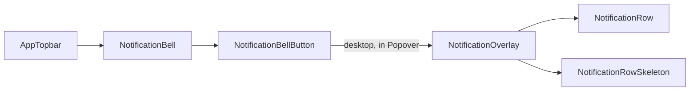

These components render the notification overlay. The entry point lives in the nav: `NotificationBell` (server) reads the unread count and renders `NotificationBellButton` (client), which on desktop opens a `Popover` containing `NotificationOverlay`. On mobile the bell renders without the overlay (a dedicated notifications page is pending, per the source comments). The bell is only rendered when `env.features.notifications` is on and `AppTopbar` is not in `noUser` mode. See [Navigation](../nav/) for the bell components.

The overlay lists **unread notifications only**: a row leaves the list as soon as it is marked read.



- **Barrel:** `src/components/notifications/index.ts` exports `NotificationOverlay`, `NotificationRow`, `NotificationRowSkeleton`.

## NotificationOverlay

Header, "Mark all as read" action and the list of unread notifications, with loading, error and empty states.

- **Source:** [src/components/notifications/NotificationOverlay.tsx](https://github.com/ozeaon/ozeaon-v2/blob/0a4f1a95824db87782f1221a4108019d174df3d9/src/components/notifications/NotificationOverlay.tsx)
- **Kind:** Client component (`"use client"`)
- **Used in:** `src/components/nav/components/NotificationBellButton.tsx`

| Prop | Type | Default | Description |
|---|---|---|---|
| `userId` | `string` | — | Recipient user id, passed to `useNotifications`. |
| `open` | `boolean` | — | Whether the containing popover is open; passed to `useNotifications`. |
| `onNavigate` | `() => void` | — | Called when a row is opened (the bell uses it to close the popover). |

Notable behaviour:

- Data comes from `useNotifications(userId, open)`, which returns `notifications`, `hasLoaded`, `hasFailed`, `retry` and `markRead`.
- Opening a row calls `markRead([id])`, then `onNavigate()`, then `router.push(destination_path)` (via `useTransitionRouter`) if the notification has one.
- "Mark all as read" marks only the currently loaded batch, not every unread notification. It shows only once loaded and non-empty.
- States: failed before first load → `EmptyState` with a "Try again" button calling `retry`; loaded and empty → "You're all caught up" `EmptyState`; not yet loaded → `NotificationRowSkeleton`.
- When the active account is an organization, its name is passed to each row as `organisationName`.

```tsx
<PopoverContent align="end" sideOffset={8} className="...">
  <NotificationOverlay
    userId={userId}
    open={open}
    onNavigate={() => setOpen(false)}
  />
</PopoverContent>
```

## NotificationRow

A single unread notification: unread marker, actor avatar, message text, optional snippet, relative timestamp, and an options menu.

- **Source:** [src/components/notifications/NotificationRow.tsx](https://github.com/ozeaon/ozeaon-v2/blob/0a4f1a95824db87782f1221a4108019d174df3d9/src/components/notifications/NotificationRow.tsx)
- **Kind:** Client component (`"use client"`)
- **Used in:** `src/components/notifications/NotificationOverlay.tsx`

| Prop | Type | Default | Description |
|---|---|---|---|
| `notification` | `NotificationListItem` | — | The notification to render. |
| `organisationName` | `string \| null` | — | Active organization's name, used when building the message text. |
| `onOpen` | `(notification: NotificationListItem) => void` | — | Called when the row body is clicked. |
| `onMarkRead` | `(id: string) => void` | — | Called from the "Mark as read" menu item. |

Notable behaviour:

- Message and snippet come from `notificationText(notification, organisationName)` and `notificationSnippet(notification)` in `@/utils/notifications`.
- Avatar uses `actor_avatar_path` / `actor_name`; timestamp is `last_event_at` rendered with `DateDisplay format="relative"`.
- The row body button and the options menu trigger (`aria-label="Notification options"`) are siblings, not nested, to avoid a button inside a button.
- The options menu currently has only "Mark as read"; delete is not implemented yet.
- Renders an `<li>`; place it inside a `<ul>`.

```tsx
<NotificationRow
  key={notification.id}
  notification={notification}
  organisationName={organisationName}
  onOpen={handleOpen}
  onMarkRead={handleMarkRead}
/>
```

## NotificationRowSkeleton

Placeholder rows shown while the first batch loads.

- **Source:** [src/components/notifications/NotificationRowSkeleton.tsx](https://github.com/ozeaon/ozeaon-v2/blob/0a4f1a95824db87782f1221a4108019d174df3d9/src/components/notifications/NotificationRowSkeleton.tsx)
- **Kind:** No directive (shared); rendered here inside a client component
- **Used in:** `src/components/notifications/NotificationOverlay.tsx`

| Prop | Type | Default | Description |
|---|---|---|---|
| `rows` | `number` | `4` | Number of placeholder rows. |

Renders a fragment of `<li>` elements, so it must sit inside a `<ul>`.

```tsx
<ul className="flex flex-col">
  {!hasLoaded ? <NotificationRowSkeleton /> : /* rows */ null}
</ul>
```
