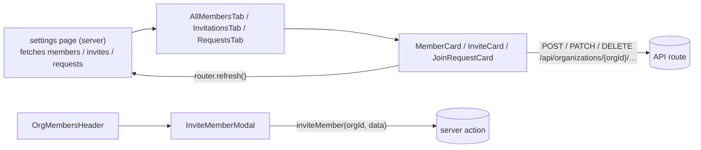

Organization components serve three audiences: the public feed (`OrganizationsInfiniteFeed`, `OrganizationCard`), the signed-in user's own memberships and invitations (`OrganizationsTabs` and the `User*Card` trio), and organization admins (the members screens and the two forms). There are no barrel files; import each component from its file path. Client cards send `fetch` calls to `/api/organizations/{orgId}/…` and then call `router.refresh()`; invites are the exception and go through the `inviteMember` server action.

See also: [Organizations feature](../../organisations/organisations/)

## Feed

### OrganizationsInfiniteFeed

A paginated two-column grid of `OrganizationCard`s, built on `GenericInfiniteFeed` with `entity="organizations"`.

**Source:** [src/components/organizations/OrganizationsInfiniteFeed.tsx](https://github.com/ozeaon/ozeaon-v2/blob/0a4f1a95824db87782f1221a4108019d174df3d9/src/components/organizations/OrganizationsInfiniteFeed.tsx)

### OrganizationsTabs

The underline `NavTabs` for "My Organisations": Active Organisations, Invitations and Requests to join. `OrganizationsTabs` is async and adds pending counts to the Invitations and Requests tabs; `OrganizationsTabsFallback` renders the same tabs without counts and serves as the `Suspense` fallback. Count queries run in parallel; if one fails the error is logged and the tab renders without that count.

**Source:** [src/components/organizations/OrganizationsTabs.tsx](https://github.com/ozeaon/ozeaon-v2/blob/0a4f1a95824db87782f1221a4108019d174df3d9/src/components/organizations/OrganizationsTabs.tsx)

## Cards

### OrganizationCard

A feed card showing the logo, name, mission, member/project/article counts, an optional role line, and a "View" affordance. The whole card links to `/organizations/{slug}` via an overlay `<Link>` with `prefetch={false}`; a count is shown only when it is greater than 0.

**Source:** [src/components/organizations/cards/OrganizationCard.tsx](https://github.com/ozeaon/ozeaon-v2/blob/0a4f1a95824db87782f1221a4108019d174df3d9/src/components/organizations/cards/OrganizationCard.tsx)

### MemberCard

A collapsible admin card for one organization member with a role select (Member/Admin) and removal behind a confirmation. Owners show a read-only "Owner" field and have no remove action.

**Source:** [src/components/organizations/cards/MemberCard.tsx](https://github.com/ozeaon/ozeaon-v2/blob/0a4f1a95824db87782f1221a4108019d174df3d9/src/components/organizations/cards/MemberCard.tsx)

### InviteCard

A collapsible admin card for a pending invitation showing the invitee name and role. The card's cancel action removes the invite immediately with no confirmation dialog.

**Source:** [src/components/organizations/cards/InviteCard.tsx](https://github.com/ozeaon/ozeaon-v2/blob/0a4f1a95824db87782f1221a4108019d174df3d9/src/components/organizations/cards/InviteCard.tsx)

### JoinRequestCard

A collapsible admin card for a user's join request with Accept and Reject buttons. Both buttons are disabled while either request is in flight.

**Source:** [src/components/organizations/cards/JoinRequestCard.tsx](https://github.com/ozeaon/ozeaon-v2/blob/0a4f1a95824db87782f1221a4108019d174df3d9/src/components/organizations/cards/JoinRequestCard.tsx)

### UserMembershipCard

A collapsible card for one of the signed-in user's own memberships. Owners and admins see "Edit Organisation" (switches account then pushes `/settings`); other members see "Leave Organisation" behind a confirmation.

**Source:** [src/components/organizations/cards/UserMembershipCard.tsx](https://github.com/ozeaon/ozeaon-v2/blob/0a4f1a95824db87782f1221a4108019d174df3d9/src/components/organizations/cards/UserMembershipCard.tsx)

### UserInviteCard

A collapsible card for an invitation the signed-in user received, with Accept and Decline buttons. Decline requires a confirmation.

**Source:** [src/components/organizations/cards/UserInviteCard.tsx](https://github.com/ozeaon/ozeaon-v2/blob/0a4f1a95824db87782f1221a4108019d174df3d9/src/components/organizations/cards/UserInviteCard.tsx)

### UserJoinRequestCard

A collapsible card for a join request the signed-in user sent, with a "Cancel Request" button behind a confirmation.

**Source:** [src/components/organizations/cards/UserJoinRequestCard.tsx](https://github.com/ozeaon/ozeaon-v2/blob/0a4f1a95824db87782f1221a4108019d174df3d9/src/components/organizations/cards/UserJoinRequestCard.tsx)

## Forms

### OrganizationForm

The create-organization form with three `FormSectionCard`s (Identity, Media, Links & Social Media), a `FormSidebar` section tracker, and a "Create Organisation" button. Form state and moderation handling come from `useOrganizationForm()`; on success it routes to `/organizations/{slug}`. The back button opens a "Discard Changes" confirmation.

**Source:** [src/components/organizations/form/OrganizationForm.tsx](https://github.com/ozeaon/ozeaon-v2/blob/0a4f1a95824db87782f1221a4108019d174df3d9/src/components/organizations/form/OrganizationForm.tsx)

### IdentityStep

Name, slug, organization type, mission, description, contact email, and location fields. The slug auto-syncs to `slugify(name)` until the user edits it directly.

**Source:** [src/components/organizations/form/steps/IdentityStep.tsx](https://github.com/ozeaon/ozeaon-v2/blob/0a4f1a95824db87782f1221a4108019d174df3d9/src/components/organizations/form/steps/IdentityStep.tsx)

### MediaStep

Logo and cover image upload fields using `FormImageUpload`. Removing an image sets its field to `null`.

**Source:** [src/components/organizations/form/steps/MediaStep.tsx](https://github.com/ozeaon/ozeaon-v2/blob/0a4f1a95824db87782f1221a4108019d174df3d9/src/components/organizations/form/steps/MediaStep.tsx)

### LinksStep

Website and LinkedIn URL fields plus a repeatable `custom_links` list managed with `useFieldArray`.

**Source:** [src/components/organizations/form/steps/LinksStep.tsx](https://github.com/ozeaon/ozeaon-v2/blob/0a4f1a95824db87782f1221a4108019d174df3d9/src/components/organizations/form/steps/LinksStep.tsx)

### OrganizationSettingsForm

The organization settings page for an existing organization, with Identity, About, Social Links, and (owners only) Danger Zone cards. Key behaviours:

- Images and custom-link deletions commit immediately; undo and navigating away restore saved form values but do not revert those changes.
- The slug re-syncs to `slugify(name)` only after the name field has been edited, so mounting never overwrites a stored slug.
- A 422 response with a `moderation` body opens `ModerationRejectedDialog`; a 503 is treated as a moderation failure.
- The Danger Zone is visible to owners only and deletes the organization, switches the active account back to user, and redirects to `/`.

**Source:** [src/components/organizations/form/OrganizationSettingsForm.tsx](https://github.com/ozeaon/ozeaon-v2/blob/0a4f1a95824db87782f1221a4108019d174df3d9/src/components/organizations/form/OrganizationSettingsForm.tsx)

## Members

### OrgMembersHeader

The "Organisation Members" heading with an "Invite Member" button that opens `InviteMemberModal`. Calls `router.refresh()` after a successful invite.

**Source:** [src/components/organizations/members/OrgMembersHeader.tsx](https://github.com/ozeaon/ozeaon-v2/blob/0a4f1a95824db87782f1221a4108019d174df3d9/src/components/organizations/members/OrgMembersHeader.tsx)

### InviteMemberModal

A dialog form for inviting a user, with a user search (`InputSearchSelect` against `/api/users/search`) and a role select (Member/Admin, default `member`). Submit calls the `inviteMember(orgId, data)` server action.

**Source:** [src/components/organizations/members/InviteMemberModal.tsx](https://github.com/ozeaon/ozeaon-v2/blob/0a4f1a95824db87782f1221a4108019d174df3d9/src/components/organizations/members/InviteMemberModal.tsx)

### AllMembersTab

Shows pending join requests first, then pending invites, then members. Renders `EmptyState` when all three lists are empty.

**Source:** [src/components/organizations/members/AllMembersTab.tsx](https://github.com/ozeaon/ozeaon-v2/blob/0a4f1a95824db87782f1221a4108019d174df3d9/src/components/organizations/members/AllMembersTab.tsx)

### InvitationsTab

A list of pending invites rendered as `InviteCard`s. Renders `EmptyState` ("No pending invitations") when empty.

**Source:** [src/components/organizations/members/InvitationsTab.tsx](https://github.com/ozeaon/ozeaon-v2/blob/0a4f1a95824db87782f1221a4108019d174df3d9/src/components/organizations/members/InvitationsTab.tsx)

### RequestsTab

A list of pending join requests rendered as `JoinRequestCard`s. Renders `EmptyState` ("No pending requests") when empty.

**Source:** [src/components/organizations/members/RequestsTab.tsx](https://github.com/ozeaon/ozeaon-v2/blob/0a4f1a95824db87782f1221a4108019d174df3d9/src/components/organizations/members/RequestsTab.tsx)
