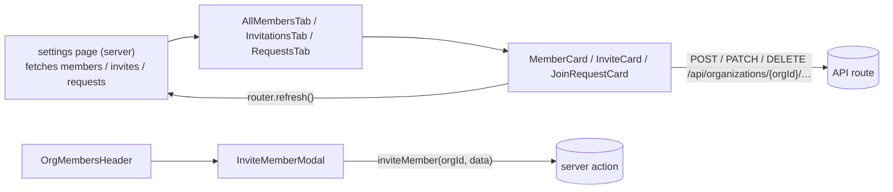

Organization components serve three audiences:

- **Public feed and search:** `OrganizationsInfiniteFeed` and `OrganizationCard`.
- **Signed-in user's own organizations** (`/settings/organizations`): `OrganizationsTabs` with `UserMembershipCard`, `UserInviteCard` and `UserJoinRequestCard`.
- **Organization admins:** the members screens (`OrgMembersHeader`, the `*Tab` lists, and `MemberCard`, `InviteCard`, `JoinRequestCard`) and the two forms (`OrganizationForm` to create, `OrganizationSettingsForm` to edit).

Server pages fetch the rows and pass them down as props. The client cards change data with `fetch` calls to `/api/organizations/{orgId}/…` and then call `router.refresh()` so the server page re-renders. Invites are the exception: they go through the `inviteMember` server action.



There are no barrel files in this folder; import each component from its file path.

## Feed

### OrganizationsInfiniteFeed

A paginated two-column grid of `OrganizationCard`s, built on `GenericInfiniteFeed` with `entity="organizations"` (pages are fetched from `/api/organizations`).

- **Source:** [src/components/organizations/OrganizationsInfiniteFeed.tsx](https://github.com/ozeaon/ozeaon-v2/blob/0a4f1a95824db87782f1221a4108019d174df3d9/src/components/organizations/OrganizationsInfiniteFeed.tsx)
- **Kind:** Client component (`"use client"`)
- **Used in:** `src/app/(main)/(feed)/(public)/organizations/page.tsx`

| Prop | Type | Default | Description |
|---|---|---|---|
| `initial` | `OrgFeedRow[]` | — | First page from the server. |
| `limit` | `number` | `20` | Page size. |
| `showRole` | `boolean` | — | Forwarded to each card. |

```tsx
<OrganizationsInfiniteFeed
  initial={organizations}
  limit={BATCH}
  showRole={showRole}
/>
```

### OrganizationsTabs / OrganizationsTabsFallback

The underline `NavTabs` for "My Organisations": Active Organisations, Invitations and Requests to join. `OrganizationsTabs` adds pending counts to the Invitations and Requests tabs. `OrganizationsTabsFallback` renders the same tabs without counts and serves as the `Suspense` fallback.

- **Source:** [src/components/organizations/OrganizationsTabs.tsx](https://github.com/ozeaon/ozeaon-v2/blob/0a4f1a95824db87782f1221a4108019d174df3d9/src/components/organizations/OrganizationsTabs.tsx)
- **Kind:** Server component (`OrganizationsTabs` is `async`)
- **Used in:** `src/app/(main)/(dashboard)/settings/(personal)/organizations/layout.tsx`

No props.

Notable behaviour:

- Calls `getAuthUserOrRedirect()`, then `getPendingInviteCountForUser` and `getPendingJoinRequestCountForUser` in parallel. If a count query fails, the error is logged and the tab still renders, without that count.

```tsx
<Suspense fallback={<OrganizationsTabsFallback />}>
  <OrganizationsTabs />
</Suspense>
```

## cards/

### OrganizationCard

A feed card showing the logo, name, mission, member/project/article counts, an optional "You are the …" role line and a "View" affordance. The whole card links to `/organizations/{slug}`.

- **Source:** [src/components/organizations/cards/OrganizationCard.tsx](https://github.com/ozeaon/ozeaon-v2/blob/0a4f1a95824db87782f1221a4108019d174df3d9/src/components/organizations/cards/OrganizationCard.tsx)
- **Kind:** Shared (no `"use client"` directive)
- **Used in:** `src/components/organizations/OrganizationsInfiniteFeed.tsx`, `src/components/search/SearchResultsFeed.tsx`

| Prop | Type | Default | Description |
|---|---|---|---|
| `org` | `OrgFeedRow` | — | Feed row: `name`, `slug`, `mission`, `logo_image`, counts, `viewer_role`. |
| `showRole` | `boolean` | — | Shows the viewer's role (`owner` / `admin` / `member`) when `org.viewer_role` is set. |

Notable behaviour:

- The link is an empty overlay `<Link className="card-link">` with `aria-label="View {name}"` and `prefetch={false}`.
- A count is shown only when it is greater than 0 and is pluralised. The article count is hidden below `md`.

```tsx
<OrganizationCard org={item.organization} showRole={false} />
```

### MemberCard

A collapsible admin card for one organization member. It shows the name and a role select (Member/Admin), with removal behind a confirmation.

- **Source:** [src/components/organizations/cards/MemberCard.tsx](https://github.com/ozeaon/ozeaon-v2/blob/0a4f1a95824db87782f1221a4108019d174df3d9/src/components/organizations/cards/MemberCard.tsx)
- **Kind:** Client component (`"use client"`)
- **Used in:** `src/components/organizations/members/AllMembersTab.tsx`

| Prop | Type | Default | Description |
|---|---|---|---|
| `member` | `OrganizationMember` | — | Member row with `member_role` and `user_profile`. |
| `orgId` | `string` | — | Organization ID used in API paths. |

Notable behaviour:

- Changing the role sends `PATCH /api/organizations/{orgId}/members/{userId}` with body `{ role }`. Only `"admin"` and `"member"` are accepted.
- Remove opens a `ConfirmDialog`, then sends `DELETE` to the same path.
- Owners (`member_role.slug === "owner"`) show a read-only "Owner" field and have no remove action.
- Each action reports through `useAsyncAction` toasts and then calls `router.refresh()`.

### InviteCard

A collapsible admin card for a pending invitation. It shows the invitee name and role (read-only) and an "awaiting to accept" notice.

- **Source:** [src/components/organizations/cards/InviteCard.tsx](https://github.com/ozeaon/ozeaon-v2/blob/0a4f1a95824db87782f1221a4108019d174df3d9/src/components/organizations/cards/InviteCard.tsx)
- **Kind:** Client component (`"use client"`)
- **Used in:** `src/components/organizations/members/AllMembersTab.tsx`, `src/components/organizations/members/InvitationsTab.tsx`

| Prop | Type | Default | Description |
|---|---|---|---|
| `invite` | `OrgInvite` | — | Invite with `invitee` and `role`. |
| `orgId` | `string` | — | Organization ID. |

Notable behaviour:

- The card's remove action cancels the invite immediately, with no confirmation, by sending `DELETE /api/organizations/{orgId}/invites/{invite.id}`. It then calls `router.refresh()`.

### JoinRequestCard

A collapsible admin card for a user's request to join. It has Accept and Reject buttons, and the role is fixed to "Member".

- **Source:** [src/components/organizations/cards/JoinRequestCard.tsx](https://github.com/ozeaon/ozeaon-v2/blob/0a4f1a95824db87782f1221a4108019d174df3d9/src/components/organizations/cards/JoinRequestCard.tsx)
- **Kind:** Client component (`"use client"`)
- **Used in:** `src/components/organizations/members/AllMembersTab.tsx`, `src/components/organizations/members/RequestsTab.tsx`

| Prop | Type | Default | Description |
|---|---|---|---|
| `request` | `OrgJoinRequest` | — | Request with `user`. |
| `orgId` | `string` | — | Organization ID. |

Notable behaviour:

- Accept sends `POST /api/organizations/{orgId}/members` with `{ user_id }`.
- Reject, from either the button or the card's remove action, opens a `ConfirmDialog` and then sends `DELETE /api/organizations/{orgId}/join-requests/{request.id}`.
- Both buttons are disabled while either request is in flight. Both actions call `router.refresh()` when they finish.

### UserMembershipCard

A collapsible card for one of the signed-in user's own memberships. Owners and admins see "Edit Organisation". Other members see "Leave Organisation".

- **Source:** [src/components/organizations/cards/UserMembershipCard.tsx](https://github.com/ozeaon/ozeaon-v2/blob/0a4f1a95824db87782f1221a4108019d174df3d9/src/components/organizations/cards/UserMembershipCard.tsx)
- **Kind:** Client component (`"use client"`)
- **Used in:** `src/app/(main)/(dashboard)/settings/(personal)/organizations/page.tsx`

| Prop | Type | Default | Description |
|---|---|---|---|
| `membership` | `UserMembership` | — | Membership with `organization` and `role`. |
| `userId` | `string` | — | Current user's ID (used in the leave request). |

Notable behaviour:

- Edit calls `switchToOrg(orgId)` from `useAccountSwitch()` and then `router.push("/settings")`.
- Leave opens a `ConfirmDialog`, then sends `DELETE /api/organizations/{orgId}/members/{userId}` and calls `router.refresh()`.
- The organization row has an external-link button to `/organizations/{slug}`.

```tsx
<UserMembershipCard
  key={membership.id}
  membership={membership}
  userId={user.id}
/>
```

### UserInviteCard

A collapsible card for an invitation the signed-in user received, with Accept and Decline buttons.

- **Source:** [src/components/organizations/cards/UserInviteCard.tsx](https://github.com/ozeaon/ozeaon-v2/blob/0a4f1a95824db87782f1221a4108019d174df3d9/src/components/organizations/cards/UserInviteCard.tsx)
- **Kind:** Client component (`"use client"`)
- **Used in:** `src/app/(main)/(dashboard)/settings/(personal)/organizations/invitations/page.tsx`

| Prop | Type | Default | Description |
|---|---|---|---|
| `invite` | `UserInvite` | — | Invite with `organization` and `role`. |

Notable behaviour:

- Accept sends `POST /api/organizations/{orgId}/members` with an empty JSON body. Success toast: "Joined {name}".
- Decline opens a `ConfirmDialog`, then sends `DELETE /api/organizations/{orgId}/invites/{invite.id}`. Both actions call `router.refresh()`.

```tsx
<UserInviteCard key={invite.id} invite={invite} />
```

### UserJoinRequestCard

A collapsible card for a join request the signed-in user sent, with a "Cancel Request" button.

- **Source:** [src/components/organizations/cards/UserJoinRequestCard.tsx](https://github.com/ozeaon/ozeaon-v2/blob/0a4f1a95824db87782f1221a4108019d174df3d9/src/components/organizations/cards/UserJoinRequestCard.tsx)
- **Kind:** Client component (`"use client"`)
- **Used in:** `src/app/(main)/(dashboard)/settings/(personal)/organizations/requests/page.tsx`

| Prop | Type | Default | Description |
|---|---|---|---|
| `request` | `UserJoinRequest` | — | Request with `organization`. |

Notable behaviour:

- Cancel opens a `ConfirmDialog`, then sends `DELETE /api/organizations/{orgId}/join-requests/{request.id}` and calls `router.refresh()`.

```tsx
<UserJoinRequestCard key={request.id} request={request} />
```

## form/

### OrganizationForm

The create-organization page. It has three numbered `FormSectionCard`s (Identity, Media, Links & Social Media), a `FormSidebar` section tracker, and a "Create Organisation" button in the nav slot.

- **Source:** [src/components/organizations/form/OrganizationForm.tsx](https://github.com/ozeaon/ozeaon-v2/blob/0a4f1a95824db87782f1221a4108019d174df3d9/src/components/organizations/form/OrganizationForm.tsx)
- **Kind:** Client component (`"use client"`)
- **Used in:** `src/app/(main)/(editor)/organizations/new/page.tsx`

| Prop | Type | Default | Description |
|---|---|---|---|
| `organizationTypes` | `SelectOption[]` | — | Options for the organization type select. |

Notable behaviour:

- Form state, submission, completed-section tracking and moderation handling come from `useOrganizationForm()`. The hook validates against `organizationSchema` and, on success, routes to `/organizations/{slug}`.
- Required-field markers come from `RequiredFieldsProvider fields={ORG_REQUIRED_FIELDS}`.
- The active sidebar section follows `focusin` and `pointerdown` events inside each section. Clicking a sidebar item smooth-scrolls to its section.
- The back button opens a "Discard Changes" `ConfirmDialog` that navigates to `/organizations`.

```tsx
<OrganizationForm organizationTypes={formattedOrganizationTypes} />
```

### steps/IdentityStep

The Identity fields: name, slug, organization type, mission, description, contact email and location. It reads the parent form with `useFormContext<Organization>()`.

- **Source:** [src/components/organizations/form/steps/IdentityStep.tsx](https://github.com/ozeaon/ozeaon-v2/blob/0a4f1a95824db87782f1221a4108019d174df3d9/src/components/organizations/form/steps/IdentityStep.tsx)
- **Kind:** Client component (`"use client"`)
- **Used in:** `src/components/organizations/form/OrganizationForm.tsx`

| Prop | Type | Default | Description |
|---|---|---|---|
| `organizationTypes` | `SelectOption[]` | — | Type select options. |

Notable behaviour:

- Until the user edits the slug field, `slug` is set to `slugify(name)` (from `transliteration`) whenever the name changes.
- Text limits come from `ORG_FIELD_LIMITS`, and the fields show remaining-character counters.

### steps/MediaStep

Logo and cover image uploads, using `FormImageUpload`. Uploads go to `/api/organizations/image?type=logo` and `?type=cover`, and the results set `logo_image_id` and `cover_image_id`.

- **Source:** [src/components/organizations/form/steps/MediaStep.tsx](https://github.com/ozeaon/ozeaon-v2/blob/0a4f1a95824db87782f1221a4108019d174df3d9/src/components/organizations/form/steps/MediaStep.tsx)
- **Kind:** Client component (`"use client"`)
- **Used in:** `src/components/organizations/form/OrganizationForm.tsx`

No props. Removing an image sets its field to `null`.

### steps/LinksStep

Website and LinkedIn URL fields, plus a repeatable list of `custom_links` (managed with `useFieldArray`) and an "Add Another Link" button.

- **Source:** [src/components/organizations/form/steps/LinksStep.tsx](https://github.com/ozeaon/ozeaon-v2/blob/0a4f1a95824db87782f1221a4108019d174df3d9/src/components/organizations/form/steps/LinksStep.tsx)
- **Kind:** Client component (`"use client"`)
- **Used in:** `src/components/organizations/form/OrganizationForm.tsx`

No props.

### OrganizationSettingsForm

The organization settings page for an existing organization. It has an Identity card (logo, name, read-only slug, type, cover, mission, email, location), an About card, a Social Links card, and a Danger zone card that only owners see.

- **Source:** [src/components/organizations/form/OrganizationSettingsForm.tsx](https://github.com/ozeaon/ozeaon-v2/blob/0a4f1a95824db87782f1221a4108019d174df3d9/src/components/organizations/form/OrganizationSettingsForm.tsx)
- **Kind:** Client component (`"use client"`)
- **Used in:** `src/app/(main)/(dashboard)/settings/page.tsx`

| Prop | Type | Default | Description |
|---|---|---|---|
| `organizationTypes` | `SelectOption[]` | — | Type select options. |
| `defaultValues` | `Partial<z.input<typeof organizationSettingsSchema>>` | — | Saved values. |
| `orgId` | `string` | — | Organization being edited. |
| `isOwner` | `boolean` | — | Shows the Danger zone (delete organization). |
| `logoPreviewUrl` | `string \| null` | — | Current logo URL for `AvatarUpload`. |
| `logoPath` | `string \| null` | — | Current logo storage path. |
| `coverPreviewUrl` | `string \| null` | — | Current cover URL. |
| `coverPath` | `string \| null` | — | Current cover storage path. |

Notable behaviour:

- **Validation:** RHF with `zodResolver(organizationSettingsSchema)` and `mode: "onBlur"`. On an invalid submit it shows a toast and focuses the first leaf field with an error, walking into nested errors such as `custom_links.N.url`.
- **Save:** sends `PATCH /api/organizations/{orgId}`.
  - `code: "slug_taken"` shows an inline slug error.
  - A 422 with `moderation` opens `ModerationRejectedDialog` through `useModerationRejection`. A 503 is shown as a moderation failure.
  - On success the form resets from the response (the returned `slug`, plus the `links` with their new IDs), the active account's `slug` and `name` are updated with `setActiveAccount`, and `router.refresh()` runs.
- **Slug:** the slug is always `slugify(name)`. It starts re-syncing only after the name is first edited, so mounting never rewrites a stored slug. Undo resets this.
- **Images and links save immediately:** the logo (cropped by `AvatarUpload`, compressed to 0.5MB / 512px, then sent with `uploadModeratedImage`), the cover, image removal (`DELETE /api/organizations/image?type=…&orgId=…`) and custom-link deletion (`DELETE /api/organizations/{orgId}/links/{linkId}`). Undo and leave-page restore the saved values but keep these committed changes.
- **Unsaved changes:** "Undo Changes" opens a discard `ConfirmDialog`. `useUnsavedChangesGuard` prompts before navigating away while the form is dirty. On mobile, undo and save are floating action buttons.
- **Delete:** the internal `DeleteOrgDialog` (a `ConfirmDeleteDialog`) sends `DELETE /api/organizations/{orgId}`, sets the active account back to `{ type: "user" }` and pushes `/`.

```tsx
<OrganizationSettingsForm
  organizationTypes={organizationTypes}
  defaultValues={defaultValues}
  orgId={org.id}
  isOwner={role === "owner"}
  logoPreviewUrl={logoPreviewUrl}
  logoPath={org.logo_image?.path ?? null}
  coverPreviewUrl={coverPreviewUrl}
  coverPath={org.cover_image?.path ?? null}
/>
```

## members/

### OrgMembersHeader

The "Organisation Members" heading with an "Invite Member" button that opens `InviteMemberModal`. After a successful invite it closes the modal and calls `router.refresh()`.

- **Source:** [src/components/organizations/members/OrgMembersHeader.tsx](https://github.com/ozeaon/ozeaon-v2/blob/0a4f1a95824db87782f1221a4108019d174df3d9/src/components/organizations/members/OrgMembersHeader.tsx)
- **Kind:** Client component (`"use client"`)
- **Used in:** `src/app/(main)/(dashboard)/settings/(organizations)/members/layout.tsx`

| Prop | Type | Default | Description |
|---|---|---|---|
| `orgId` | `string` | — | Organization to invite into. |

```tsx
<OrgMembersHeader orgId={activeAccount.id} />
```

### InviteMemberModal

A dialog form for inviting a user. It has a user search (`InputSearchSelect` against `/api/users/search`) and a role select (Member/Admin, default `member`).

- **Source:** [src/components/organizations/members/InviteMemberModal.tsx](https://github.com/ozeaon/ozeaon-v2/blob/0a4f1a95824db87782f1221a4108019d174df3d9/src/components/organizations/members/InviteMemberModal.tsx)
- **Kind:** Client component (`"use client"`)
- **Used in:** `src/components/organizations/members/OrgMembersHeader.tsx`

| Prop | Type | Default | Description |
|---|---|---|---|
| `orgId` | `string` | — | Organization ID. |
| `isOpen` | `boolean` | — | Dialog state. |
| `onClose` | `() => void` | — | Called when the dialog closes (after a form reset). |
| `onSuccess` | `() => void` | — | Called after the invite is sent. |

Notable behaviour:

- Validated with `zodResolver(InviteBodySchema)`. The form is typed with `z.input`, the type before transforms are applied.
- Submit calls the `inviteMember(orgId, data)` server action (`src/app/(main)/(dashboard)/settings/(organizations)/members/actions.ts`). It shows a toast on success or failure and resets the form on success.

### AllMembersTab

The full members list: pending join requests first, then pending invites, then members. Shows `EmptyState` ("No members yet") when all three lists are empty.

- **Source:** [src/components/organizations/members/AllMembersTab.tsx](https://github.com/ozeaon/ozeaon-v2/blob/0a4f1a95824db87782f1221a4108019d174df3d9/src/components/organizations/members/AllMembersTab.tsx)
- **Kind:** Shared (no `"use client"` directive)
- **Used in:** `src/app/(main)/(dashboard)/settings/(organizations)/members/page.tsx`

| Prop | Type | Default | Description |
|---|---|---|---|
| `orgId` | `string` | — | Passed to each card. |
| `members` | `OrganizationMember[]` | — | Rendered as `MemberCard`. |
| `invites` | `OrgInvite[]` | — | Rendered as `InviteCard`. |
| `requests` | `OrgJoinRequest[]` | — | Rendered as `JoinRequestCard`. |

```tsx
<AllMembersTab
  orgId={activeAccount.id}
  members={(membersResult.data ?? []) as OrganizationMember[]}
  invites={(invitesResult.data ?? []) as OrgInvite[]}
  requests={requestsResult.data as OrgJoinRequest[]}
/>
```

### InvitationsTab

A list of pending invites rendered as `InviteCard`s. Shows `EmptyState` ("No pending invitations") when the list is empty.

- **Source:** [src/components/organizations/members/InvitationsTab.tsx](https://github.com/ozeaon/ozeaon-v2/blob/0a4f1a95824db87782f1221a4108019d174df3d9/src/components/organizations/members/InvitationsTab.tsx)
- **Kind:** Shared (no `"use client"` directive)
- **Used in:** `src/app/(main)/(dashboard)/settings/(organizations)/members/invitations/page.tsx`

| Prop | Type | Default | Description |
|---|---|---|---|
| `orgId` | `string` | — | Organization ID. |
| `invites` | `OrgInvite[]` | — | Pending invites. |

```tsx
<InvitationsTab orgId={activeAccount.id} invites={data} />
```

### RequestsTab

A list of pending join requests rendered as `JoinRequestCard`s. Shows `EmptyState` ("No pending requests") when the list is empty.

- **Source:** [src/components/organizations/members/RequestsTab.tsx](https://github.com/ozeaon/ozeaon-v2/blob/0a4f1a95824db87782f1221a4108019d174df3d9/src/components/organizations/members/RequestsTab.tsx)
- **Kind:** Shared (no `"use client"` directive)
- **Used in:** `src/app/(main)/(dashboard)/settings/(organizations)/members/requests/page.tsx`

| Prop | Type | Default | Description |
|---|---|---|---|
| `orgId` | `string` | — | Organization ID. |
| `requests` | `OrgJoinRequest[]` | — | Pending requests. |

```tsx
<RequestsTab orgId={activeAccount.id} requests={data} />
```
