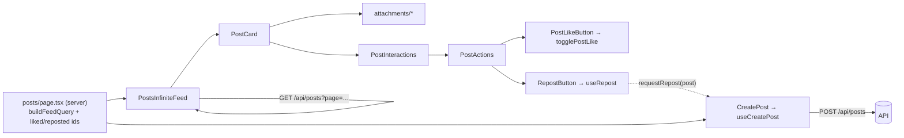

`src/components/posts/` builds the Posts feed, each post card, the composer and its attachments. Import cards from `@/components/posts/cards`, attachments from `@/components/posts/attachments`, and utilities from `@/components/posts/utils`. See also [Posts](../../posts/posts/).



## Feed & Interactions

### PostsInfiniteFeed

An infinite list of `PostCard`s. It starts from a server-fetched first page (`initialPosts`) and loads more via `GET /api/posts` as the user scrolls to a sentinel element. `likedPosts` and `repostedPosts` are converted to `Set`s so per-card lookups are O(1). `hasMore` stays true only while each page comes back full; a fetch error sets it to false. State resets to page 1 when `initialPosts` changes (for example after `router.refresh()`).

**Source:** [src/components/posts/PostsInfiniteFeed.tsx](https://github.com/ozeaon/ozeaon-v2/blob/0a4f1a95824db87782f1221a4108019d174df3d9/src/components/posts/PostsInfiniteFeed.tsx)

### PostInteractions

The action row (`PostActions`) plus a collapsible comments panel for one post. Owns `commentCount` (seeded from `post.stats.comment_count`) and updates it through `onCommentCountChange`. The panel hides when `shouldHideCommentSection` returns true.

**Source:** [src/components/posts/PostInteractions.tsx](https://github.com/ozeaon/ozeaon-v2/blob/0a4f1a95824db87782f1221a4108019d174df3d9/src/components/posts/PostInteractions.tsx)

### PostActions

The like, comment-toggle and repost buttons for a post. The bookmark button is `sr-only` and disabled — Notes & Bookmarks is on the roadmap and not built. `RepostButton` renders only when `post.allow_repost` is true.

**Source:** [src/components/posts/PostActions.tsx](https://github.com/ozeaon/ozeaon-v2/blob/0a4f1a95824db87782f1221a4108019d174df3d9/src/components/posts/PostActions.tsx)

### PostLikeButton

A like toggle with an optimistic count wrapping the shared `LikeButton`. Flips state immediately, calls `togglePostLike`, then re-syncs if the server's returned `status` disagrees. Renders `inert` and does nothing when there is no signed-in user.

**Source:** [src/components/posts/LikePostButton.tsx](https://github.com/ozeaon/ozeaon-v2/blob/0a4f1a95824db87782f1221a4108019d174df3d9/src/components/posts/LikePostButton.tsx)

### RepostButton

Shows the repost count; clicking hands the post to the composer's repost mode via `requestRepost`. Outside `/posts` and `/` it also navigates to `/posts`.

**Source:** [src/components/posts/RepostButton.tsx](https://github.com/ozeaon/ozeaon-v2/blob/0a4f1a95824db87782f1221a4108019d174df3d9/src/components/posts/RepostButton.tsx)

## Cards

### PostCard

The full feed card: author header, collapsible message, image carousel, a single attachment and the interactions row. `post.message` is JSON-encoded and parsed with `parseJSON<string>`. The attachment is picked in priority order: `organization` → `project` → `article` → `reposted_post`; if none is present, the first set `*_unavailable` flag renders `UnavailablePost`. Organization-authored posts show the organization logo and name.

**Source:** [src/components/posts/cards/PostCard.tsx](https://github.com/ozeaon/ozeaon-v2/blob/0a4f1a95824db87782f1221a4108019d174df3d9/src/components/posts/cards/PostCard.tsx)

```tsx
<PostCard
  post={post}
  liked={liked.includes(post.id)}
  reposted={reposted.includes(post.id)}
  defaultCommentsOpen
/>
```

## Attachments

### PostAuthor

The author line with a relative date; adds a "Delete Post" dropdown for owners. Owner detection uses `useSessionInfo()` — an organization post is owned only when the active account is that organization.

**Source:** [src/components/posts/attachments/PostAuthor.tsx](https://github.com/ozeaon/ozeaon-v2/blob/0a4f1a95824db87782f1221a4108019d174df3d9/src/components/posts/attachments/PostAuthor.tsx)

### CollapsibleMessage

Post body text that collapses when it exceeds a height threshold, with a "Read more" / "Show less" toggle. Collapsing scrolls the container back to the top.

**Source:** [src/components/posts/attachments/CollapsibleMessage.tsx](https://github.com/ozeaon/ozeaon-v2/blob/0a4f1a95824db87782f1221a4108019d174df3d9/src/components/posts/attachments/CollapsibleMessage.tsx)

### PostImages

A carousel of a post's images sorted by `sort_order`. Clicking opens `ImageCarouselLightbox`. Returns `null` when the post has no images.

**Source:** [src/components/posts/attachments/PostImages.tsx](https://github.com/ozeaon/ozeaon-v2/blob/0a4f1a95824db87782f1221a4108019d174df3d9/src/components/posts/attachments/PostImages.tsx)

### ImageCarouselLightbox

A full-screen dialog image viewer with previous/next buttons, a counter and a thumbnail strip. ArrowLeft/ArrowRight navigate; navigation stops at the ends and does not wrap. Also used by article media sections.

**Source:** [src/components/posts/attachments/ImageCarouselLightbox.tsx](https://github.com/ozeaon/ozeaon-v2/blob/0a4f1a95824db87782f1221a4108019d174df3d9/src/components/posts/attachments/ImageCarouselLightbox.tsx)

### RepostingPost

A compact card for a reposted post: author, 4-line message clamp, images and a mini project or article attachment. `PostAuthor` is always `isOwner={false}` — no delete menu appears.

**Source:** [src/components/posts/attachments/RepostingPost.tsx](https://github.com/ozeaon/ozeaon-v2/blob/0a4f1a95824db87782f1221a4108019d174df3d9/src/components/posts/attachments/RepostingPost.tsx)

### AttachedProject / MiniAttachedProject

Link cards for a project attached to a post, both linking to `/projects/{slug}`. `AttachedProject` shows the title, tagline, category badges and cover image; `MiniAttachedProject` shows a thumbnail with title, a truncated tagline and at most 2 tags.

**Source:** [src/components/posts/attachments/AttachedProject.tsx](https://github.com/ozeaon/ozeaon-v2/blob/0a4f1a95824db87782f1221a4108019d174df3d9/src/components/posts/attachments/AttachedProject.tsx)

### AttachedOrganization

A link card for an organization tagged in a post: name and cover image, or logo when there is no cover.

**Source:** [src/components/posts/attachments/AttachedOrganization.tsx](https://github.com/ozeaon/ozeaon-v2/blob/0a4f1a95824db87782f1221a4108019d174df3d9/src/components/posts/attachments/AttachedOrganization.tsx)

### UnavailablePost

A placeholder for attached content whose author or organization was deleted.

**Source:** [src/components/posts/attachments/UnavailablePost.tsx](https://github.com/ozeaon/ozeaon-v2/blob/0a4f1a95824db87782f1221a4108019d174df3d9/src/components/posts/attachments/UnavailablePost.tsx)

### AttachedItem

The removable attachment chip in the composer: label, type, title, description and optional cover image. Not in the barrel; only used by `AttachmentPreviews`.

**Source:** [src/components/posts/attachments/AttachedItem.tsx](https://github.com/ozeaon/ozeaon-v2/blob/0a4f1a95824db87782f1221a4108019d174df3d9/src/components/posts/attachments/AttachedItem.tsx)

### AttachmentAuthor

A link to an author's profile tab. No live call sites; exported from the barrel only.

**Source:** [src/components/posts/attachments/AttachmentAuthor.tsx](https://github.com/ozeaon/ozeaon-v2/blob/0a4f1a95824db87782f1221a4108019d174df3d9/src/components/posts/attachments/AttachmentAuthor.tsx)

### CircularProgress

Unused SVG progress ring; only referenced in commented-out markup in `AttachedProject.tsx`. Kept for planned project funding progress.

**Source:** [src/components/posts/attachments/CircularProgress.tsx](https://github.com/ozeaon/ozeaon-v2/blob/0a4f1a95824db87782f1221a4108019d174df3d9/src/components/posts/attachments/CircularProgress.tsx)

## Composer

`CreatePost` is the entry point. It renders `MobileComposer` (bottom-sheet drawer) or `DesktopComposer` (inline collapsible) according to `composer.isMobile`. State, image lifecycle, validation and submit live in `useCreatePost` (`src/hooks/use-create-post.ts`), which posts to `/api/posts`. Per-kind attachment config (FormData field, labels, search endpoint) is in `attachment-kinds.ts` ([src/components/posts/create-form/attachment-kinds.ts](https://github.com/ozeaon/ozeaon-v2/blob/0a4f1a95824db87782f1221a4108019d174df3d9/src/components/posts/create-form/attachment-kinds.ts)); a post attaches one kind at a time.

### CreatePost

Returns `null` until hydration and while there is no signed-in user. Builds the shared `HiddenImageInput` and passes it to both layouts.

**Source:** [src/components/posts/create-form/CreatePostForm.tsx](https://github.com/ozeaon/ozeaon-v2/blob/0a4f1a95824db87782f1221a4108019d174df3d9/src/components/posts/create-form/CreatePostForm.tsx)

### AttachModal

A search dialog for choosing a project, article or organization to attach. Debounces at 3 characters and 500ms. Resets query and results when the dialog closes.

**Source:** [src/components/posts/create-form/AttachModal.tsx](https://github.com/ozeaon/ozeaon-v2/blob/0a4f1a95824db87782f1221a4108019d174df3d9/src/components/posts/create-form/AttachModal.tsx)

### CreatePostButton

A "New Post" / "Hide" toggle button with animated icons. No live call sites.

**Source:** [src/components/posts/create-form/CreatePostButton.tsx](https://github.com/ozeaon/ozeaon-v2/blob/0a4f1a95824db87782f1221a4108019d174df3d9/src/components/posts/create-form/CreatePostButton.tsx)

### DesktopComposer

An inline `Collapsible` card. Scrolls to the top on each new `repostRequestId` in repost mode. Shows `FormErrorBanner`, `AttachmentModals` and `ModerationRejectedDialog`.

**Source:** [src/components/posts/create-form/layouts/DesktopComposer.tsx](https://github.com/ozeaon/ozeaon-v2/blob/0a4f1a95824db87782f1221a4108019d174df3d9/src/components/posts/create-form/layouts/DesktopComposer.tsx)

### MobileComposer

Opens a `CustomDrawer` bottom sheet. Sets `document.documentElement.style.overflow = "hidden"` while the sheet is open.

**Source:** [src/components/posts/create-form/layouts/MobileComposer.tsx](https://github.com/ozeaon/ozeaon-v2/blob/0a4f1a95824db87782f1221a4108019d174df3d9/src/components/posts/create-form/layouts/MobileComposer.tsx)

### CustomDrawer

The bottom-sheet chrome; the sheet element is the `<form>`. The backdrop and drag handle close it; dragging down more than 120px also closes the sheet. Traps focus while open and restores it on close.

**Source:** [src/components/posts/create-form/layouts/CustomDrawer.tsx](https://github.com/ozeaon/ozeaon-v2/blob/0a4f1a95824db87782f1221a4108019d174df3d9/src/components/posts/create-form/layouts/CustomDrawer.tsx)

### ComposerTextarea

The RHF `message` textarea, capped at `MAX_MESSAGE_LENGTH`.

**Source:** [src/components/posts/create-form/parts/ComposerTextarea.tsx](https://github.com/ozeaon/ozeaon-v2/blob/0a4f1a95824db87782f1221a4108019d174df3d9/src/components/posts/create-form/parts/ComposerTextarea.tsx)

### AttachmentActionBar

The image button plus one attach button per kind from `POST_ATTACHMENT_TYPES`. A kind's button is disabled while a different kind is already attached.

**Source:** [src/components/posts/create-form/parts/AttachmentActionBar.tsx](https://github.com/ozeaon/ozeaon-v2/blob/0a4f1a95824db87782f1221a4108019d174df3d9/src/components/posts/create-form/parts/AttachmentActionBar.tsx)

### AttachmentModals

Renders one `AttachModal` per attachment kind; a single `activeModal` value controls which is open.

**Source:** [src/components/posts/create-form/parts/AttachmentModals.tsx](https://github.com/ozeaon/ozeaon-v2/blob/0a4f1a95824db87782f1221a4108019d174df3d9/src/components/posts/create-form/parts/AttachmentModals.tsx)

### AttachmentPreviews

The composer's preview area: image grid, repost preview, attachment chips, per-image error and inline validation error.

**Source:** [src/components/posts/create-form/parts/AttachmentPreviews.tsx](https://github.com/ozeaon/ozeaon-v2/blob/0a4f1a95824db87782f1221a4108019d174df3d9/src/components/posts/create-form/parts/AttachmentPreviews.tsx)

### ImagePreviewGrid

A 5-column grid of selected-image tiles with an "add more" tile and an `N/max images` caption. Wrapped in `React.memo`.

**Source:** [src/components/posts/create-form/parts/ImagePreviewGrid.tsx](https://github.com/ozeaon/ozeaon-v2/blob/0a4f1a95824db87782f1221a4108019d174df3d9/src/components/posts/create-form/parts/ImagePreviewGrid.tsx)

### HiddenImageInput

The single hidden `<input type="file" multiple>` that accepts `IMAGE_CONFIG.allowedMimeTypes`.

**Source:** [src/components/posts/create-form/parts/HiddenImageInput.tsx](https://github.com/ozeaon/ozeaon-v2/blob/0a4f1a95824db87782f1221a4108019d174df3d9/src/components/posts/create-form/parts/HiddenImageInput.tsx)

### PostOptionsToggles

"Allow Comments" and "Allow Reposts" switches connected through RHF `Controller`. A missing value counts as `true`.

**Source:** [src/components/posts/create-form/parts/PostOptionsToggles.tsx](https://github.com/ozeaon/ozeaon-v2/blob/0a4f1a95824db87782f1221a4108019d174df3d9/src/components/posts/create-form/parts/PostOptionsToggles.tsx)

## Utils

### CustomPostFilters

Sort and user filters for `/posts/custom`. Pushes `sort`, `dir` and `user` query params on "Apply Filters". Both selects are uncontrolled and read their defaults from the URL.

**Source:** [src/components/posts/utils/CustomPostFilters.tsx](https://github.com/ozeaon/ozeaon-v2/blob/0a4f1a95824db87782f1221a4108019d174df3d9/src/components/posts/utils/CustomPostFilters.tsx)
