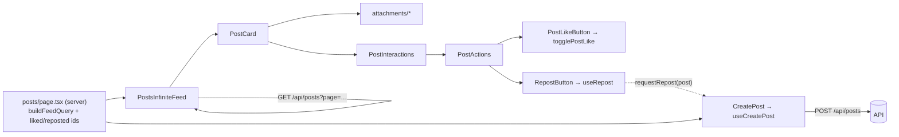

Posts components fall into four groups. **Feed**: `PostsInfiniteFeed` takes the first page from a server component and pages on via `GET /api/posts`. **Card**: `PostCard` renders one post, using the `attachments/` pieces for the author line, message, images and the single attached project / article / organization / reposted post, then `PostInteractions` for like, comment and repost. **Composer**: `CreatePost` (`create-form/`) is a thin shell over the `useCreatePost` hook. It renders `MobileComposer` (bottom-sheet drawer) or `DesktopComposer` (inline collapsible), and both are built from the same `parts/`. The hook submits to `POST /api/posts`. **Utils**: `CustomPostFilters` drives the sort/user filter on `/posts/custom`.



- **Barrels:** `src/components/posts/cards/index.ts` exports `PostCard`. `src/components/posts/attachments/index.ts` re-exports `AttachedOrganization`, `AttachedProject` (and `MiniAttachedProject`), `AttachmentAuthor`, `CollapsibleMessage`, `PostAuthor`, `PostImages`, `RepostingPost` and `UnavailablePost`. `src/components/posts/utils/index.ts` re-exports `CustomPostFilters`.

## Feed and interactions

### PostsInfiniteFeed

An infinite list of `PostCard`s. It starts from server-fetched posts and loads more pages as the user scrolls.

- **Source:** [src/components/posts/PostsInfiniteFeed.tsx](https://github.com/ozeaon/ozeaon-v2/blob/0a4f1a95824db87782f1221a4108019d174df3d9/src/components/posts/PostsInfiniteFeed.tsx)
- **Kind:** Client component (`"use client"`), default export
- **Used in:** `src/app/(main)/(feed)/(public)/posts/page.tsx`, `src/app/(main)/(profile)/profiles/[username]/posts/page.tsx`, `src/app/(main)/(profile)/organizations/[slug]/(tabs)/posts/page.tsx`

| Prop | Type | Default | Description |
|---|---|---|---|
| `initialPosts` | `PublicPost[]` | — | First page, fetched server-side. |
| `likedPosts` | `string[]` | — | IDs of posts the viewer has liked. |
| `repostedPosts` | `string[]` | — | IDs of posts the viewer has reposted. |
| `filterFollowed` | `boolean` | — | Sent as `followed=true\|false` to the API. |
| `userId` | `string` | — | Restricts the feed to one user's posts (`userId` query param). |
| `organizationId` | `string` | — | Restricts the feed to one organization's posts (`organizationId` query param). |

Notable behaviour:

- Page size is `FEED_PAGE_LIMIT`. `hasMore` stays true only while each page comes back full.
- An `IntersectionObserver` on a sentinel div (`rootMargin: "200px"`, `threshold: 0.5`) moves to the next page. Each page is fetched with `fetchWithRetry('/api/posts?page=…&limit=…&followed=…')`.
- New pages are de-duplicated by `id` before they are appended. A fetch error sets `hasMore` to false.
- State resets to page 1 when `initialPosts` changes (for example after `router.refresh()`).
- `likedPosts` and `repostedPosts` are converted to `Set`s, so `liked` and `reposted` lookups per card are O(1).

```tsx
<PostsInfiniteFeed
  initialPosts={posts}
  likedPosts={likedPosts}
  repostedPosts={repostedPosts}
  organizationId={orgId}
/>
```

### PostInteractions

The action row (`PostActions`) plus a collapsible comments panel for one post. `PostCard` renders it.

- **Source:** [src/components/posts/PostInteractions.tsx](https://github.com/ozeaon/ozeaon-v2/blob/0a4f1a95824db87782f1221a4108019d174df3d9/src/components/posts/PostInteractions.tsx)
- **Kind:** Client component (`"use client"`)
- **Used in:** `src/components/posts/cards/PostCard.tsx`

| Prop | Type | Default | Description |
|---|---|---|---|
| `post` | `PublicPost` | — | The post. |
| `liked` | `boolean` | — | Whether the viewer has liked it. |
| `reposted` | `boolean` | — | Whether the viewer has reposted it. |
| `defaultCommentsOpen` | `boolean` | `false` | Opens the comments panel on mount. |

Notable behaviour:

- Owns `commentCount` (seeded from `post.stats.comment_count`) and `commentsOpen`. `EntityComments` (`entity="post"`) updates the count through `onCommentCountChange`.
- The panel is hidden when `shouldHideCommentSection(post.comments_enabled, commentCount)` is true.

### PostActions

The like, comment-toggle and repost buttons for a post, plus a bookmark button that is disabled and screen-reader-only.

- **Source:** [src/components/posts/PostActions.tsx](https://github.com/ozeaon/ozeaon-v2/blob/0a4f1a95824db87782f1221a4108019d174df3d9/src/components/posts/PostActions.tsx)
- **Kind:** Client component (`"use client"`), default export
- **Used in:** `src/components/posts/PostInteractions.tsx`

| Prop | Type | Default | Description |
|---|---|---|---|
| `post` | `PublicPost` | — | The post. |
| `liked` | `boolean` | — | Initial like state. |
| `reposted` | `boolean` | — | Whether the viewer has reposted. |
| `commentCount` | `number` | — | Count shown on the comment toggle. |
| `commentsOpen` | `boolean` | — | Comment panel state. |
| `setCommentsOpenAction` | `(open: boolean) => void` | — | Toggles the comment panel. |

Notable behaviour:

- The comment toggle follows the same `shouldHideCommentSection` rule as `PostInteractions`.
- `RepostButton` renders only when `post.allow_repost` is true.
- Like and repost counts come from `post.stats.reaction_count` and `post.stats.repost_count`.

### PostLikeButton

A like toggle with an optimistic count. It wraps the shared `LikeButton`.

- **Source:** [src/components/posts/LikePostButton.tsx](https://github.com/ozeaon/ozeaon-v2/blob/0a4f1a95824db87782f1221a4108019d174df3d9/src/components/posts/LikePostButton.tsx)
- **Kind:** Client component (`"use client"`)
- **Used in:** `src/components/posts/PostActions.tsx`

| Prop | Type | Default | Description |
|---|---|---|---|
| `postId` | `string` | — | Post to like/unlike. |
| `initialLiked` | `boolean` | — | Starting state. |
| `initialCount` | `number` | — | Starting count. |

Notable behaviour:

- Does nothing when there is no signed-in user, and renders `inert` in that case.
- Flips state and count immediately, then calls `togglePostLike(postId)` (`@/lib/supabase/queries/reactions`). If the returned `status` disagrees with the optimistic value, it re-syncs. On error it logs and reverts.
- Disabled while the request is pending.

### RepostButton

The repost icon and count. Clicking it hands the post to the composer's repost mode.

- **Source:** [src/components/posts/RepostButton.tsx](https://github.com/ozeaon/ozeaon-v2/blob/0a4f1a95824db87782f1221a4108019d174df3d9/src/components/posts/RepostButton.tsx)
- **Kind:** Client component (`"use client"`)
- **Used in:** `src/components/posts/PostActions.tsx`

| Prop | Type | Default | Description |
|---|---|---|---|
| `post` | `PublicPost` | — | Post to repost. |
| `reposted` | `boolean` | — | Already reposted by the viewer; clicking is a no-op. |
| `initialCount` | `number` | — | Repost count shown next to the icon. |

Notable behaviour:

- Calls `requestRepost(post)` from `useRepost()`. Outside `/posts` and `/`, it also navigates to `/posts` with `useTransitionRouter().push`.
- Disabled when there is no user or when `post.allow_repost` is false.
- The tooltip and `aria-label` change with `reposted`: "Already reposted" / "Repost".

## cards/

### PostCard

The full feed card for one post: author header, collapsible message, image carousel, a single attachment, and the interactions row.

- **Source:** [src/components/posts/cards/PostCard.tsx](https://github.com/ozeaon/ozeaon-v2/blob/0a4f1a95824db87782f1221a4108019d174df3d9/src/components/posts/cards/PostCard.tsx)
- **Kind:** Client component (`"use client"`)
- **Used in:** `src/components/posts/PostsInfiniteFeed.tsx`, `src/app/(main)/(feed)/(public)/posts/[id]/page.tsx`, `src/app/(main)/(feed)/(public)/posts/custom/page.tsx`

| Prop | Type | Default | Description |
|---|---|---|---|
| `post` | `PublicPost` | — | The post, with joins. |
| `liked` | `boolean` | — | Whether the viewer liked it. |
| `reposted` | `boolean` | — | Whether the viewer reposted it. |
| `defaultCommentsOpen` | `boolean` | — | Passed to `PostInteractions`. |

Notable behaviour:

- Posts authored by an organization (`post.authoring_org`) show the organization's logo and name instead of the user's.
- Owner detection uses `useSessionInfo()`. A user post is owned when the active account is the user and `user.id === post.user_id`. An organization post is owned when the active account is that organization. Ownership shows the delete menu in `PostAuthor`.
- `post.message` is JSON-encoded and is parsed with `parseJSON<string>`.
- The attachment is picked in priority order: `organization` → `project` → `article` → `reposted_post`. If none is present, the first set flag among `organization_unavailable`, `project_unavailable`, `article_unavailable` and `repost_unavailable` renders `UnavailablePost`.

```tsx
<PostCard
  post={post}
  liked={liked.includes(post.id)}
  reposted={reposted.includes(post.id)}
  defaultCommentsOpen
/>
```

## attachments/

### PostAuthor

The author line (organization or user name with a relative date). For owners it adds a "Delete Post" dropdown.

- **Source:** [src/components/posts/attachments/PostAuthor.tsx](https://github.com/ozeaon/ozeaon-v2/blob/0a4f1a95824db87782f1221a4108019d174df3d9/src/components/posts/attachments/PostAuthor.tsx)
- **Kind:** Client component (`"use client"`)
- **Used in:** `src/components/posts/cards/PostCard.tsx`, `src/components/posts/attachments/RepostingPost.tsx`

| Prop | Type | Default | Description |
|---|---|---|---|
| `author` | `PublicPost["author"]` | — | User author; links to `/profiles/{username}/posts`. |
| `authoringOrg` | `PublicPost["authoring_org"]` | — | When set, takes precedence and links to `/organizations/{slug}`. |
| `postedAt` | `string` | — | Rendered with `DateDisplay format="relative"`. |
| `reposting` | `boolean` | — | Disables pointer events and hides the options menu. |
| `postId` | `string` | — | Post to delete. |
| `isOwner` | `boolean` | — | Shows the options menu. |

Notable behaviour:

- Delete opens a `ConfirmDialog`. On confirm it runs the `deletePost(postId)` server action (`src/app/(main)/(feed)/(private)/account/posts/actions.ts`) through `useAsyncAction`, shows toast messages, closes the dialog and calls `router.refresh()`.

### CollapsibleMessage

Post body text that collapses when it is long, with a "Read more" / "Show less" toggle.

- **Source:** [src/components/posts/attachments/CollapsibleMessage.tsx](https://github.com/ozeaon/ozeaon-v2/blob/0a4f1a95824db87782f1221a4108019d174df3d9/src/components/posts/attachments/CollapsibleMessage.tsx)
- **Kind:** Client component (`"use client"`)
- **Used in:** `src/components/posts/cards/PostCard.tsx`

| Prop | Type | Default | Description |
|---|---|---|---|
| `message` | `string` | — | Plain text; rendered with `whitespace-pre-line`. |
| `children` | `React.ReactNode` | — | Rendered after the message inside the same container. |

Notable behaviour:

- When the message changes, it measures `scrollHeight`. Above 300px the text collapses behind a toggle (capped at `max-h-75`). Above 600px the expanded text scrolls inside `max-h-150`.
- Collapsing again scrolls the container back to the top.

### PostImages

A carousel of a post's images, sorted by `sort_order`. Clicking or pressing Enter/Space on an image opens `ImageCarouselLightbox` at that image.

- **Source:** [src/components/posts/attachments/PostImages.tsx](https://github.com/ozeaon/ozeaon-v2/blob/0a4f1a95824db87782f1221a4108019d174df3d9/src/components/posts/attachments/PostImages.tsx)
- **Kind:** Client component (`"use client"`)
- **Used in:** `src/components/posts/cards/PostCard.tsx`, `src/components/posts/attachments/RepostingPost.tsx`

| Prop | Type | Default | Description |
|---|---|---|---|
| `post` | `PublicPost` | — | Reads `post.images`. |
| `interactive` | `boolean` | `true` | When false the carousel gets `pointer-events-none`. |

Notable behaviour:

- Returns `null` when the post has no images.
- A single image spans the full width. On `md` and up it uses a fixed height instead of a square.

### ImageCarouselLightbox

A full-screen dialog image viewer with previous/next buttons, a counter and a thumbnail strip.

- **Source:** [src/components/posts/attachments/ImageCarouselLightbox.tsx](https://github.com/ozeaon/ozeaon-v2/blob/0a4f1a95824db87782f1221a4108019d174df3d9/src/components/posts/attachments/ImageCarouselLightbox.tsx)
- **Kind:** Client component (`"use client"`)
- **Used in:** `src/components/posts/attachments/PostImages.tsx`, `src/components/articles/pages/ArticleMediaSection.tsx`

| Prop | Type | Default | Description |
|---|---|---|---|
| `images` | `Image[]` | — | Images (from `@/types`); `path` is resolved with `getImageUrlFromKey`. |
| `initialIndex` | `number` | `0` | Image shown first; re-applied when it changes. |
| `open` | `boolean` | — | Dialog open state. |
| `onOpenChange` | `(open: boolean) => void` | — | Dialog open callback. |
| `contentClassName` | `ClassValue` | — | Extra classes on `DialogContent`. |

Notable behaviour:

- ArrowLeft/ArrowRight navigate while open. Navigation stops at the first and last image and does not wrap.
- Preloads the adjacent images. Scrolls the active thumbnail into view, using a `MutationObserver` to wait until the thumbnails have mounted.
- The `sr-only` `DialogTitle` is the image's `alt`, or "Image N of M". The counter is `role="status"` with `aria-live="polite"`.

```tsx
<ImageCarouselLightbox
  images={images.map((itm) => itm.image)}
  open={open}
  initialIndex={index}
  onOpenChange={setOpen}
  contentClassName="rounded-lg h-[95vh] md:h-[80vh] w-[calc(100vw-1rem)] md:w-10/12! md:max-w-250!"
/>
```

### RepostingPost

A compact card for a reposted post. It shows the author, a 4-line message clamp, images, and a mini project or article attachment.

- **Source:** [src/components/posts/attachments/RepostingPost.tsx](https://github.com/ozeaon/ozeaon-v2/blob/0a4f1a95824db87782f1221a4108019d174df3d9/src/components/posts/attachments/RepostingPost.tsx)
- **Kind:** Shared (no `"use client"` directive)
- **Used in:** `src/components/posts/cards/PostCard.tsx`, `src/components/posts/create-form/parts/AttachmentPreviews.tsx`

| Prop | Type | Default | Description |
|---|---|---|---|
| `post` | `PublicPost` | — | The reposted post. |
| `attached` | `boolean` | — | Shown inside another post. When false the whole card is `pointer-events-none`; when true the author line is non-interactive. |
| `preview` | `boolean` | — | The composer's repost preview; makes `PostImages` non-interactive. |

Notable behaviour:

- `PostAuthor` is always rendered with `isOwner={false}`, so no delete menu appears.
- The card height is capped at `max-h-86` unless the post has images or `attached` is set.

```tsx
<RepostingPost post={post.reposted_post} attached />
```

### AttachedProject / MiniAttachedProject

Link cards for a project attached to a post. Both link to `/projects/{slug}` with `prefetch={false}`. `AttachedProject` shows the title, tagline, `CategoryBadges` and the cover image. `MiniAttachedProject` shows a thumbnail, title, a tagline truncated to 60 characters and at most 2 tags plus a "+N" count.

- **Source:** [src/components/posts/attachments/AttachedProject.tsx](https://github.com/ozeaon/ozeaon-v2/blob/0a4f1a95824db87782f1221a4108019d174df3d9/src/components/posts/attachments/AttachedProject.tsx)
- **Kind:** Shared (no `"use client"` directive)
- **Used in:** `AttachedProject` in `src/components/posts/cards/PostCard.tsx`; `MiniAttachedProject` in `src/components/posts/attachments/RepostingPost.tsx`

| Prop | Type | Default | Description |
|---|---|---|---|
| `project` | `AttachedProjectItem` | — | Project join on the post. |

### AttachedOrganization

A link card for an organization tagged in a post. It shows the name and the cover image, or the logo when there is no cover.

- **Source:** [src/components/posts/attachments/AttachedOrganization.tsx](https://github.com/ozeaon/ozeaon-v2/blob/0a4f1a95824db87782f1221a4108019d174df3d9/src/components/posts/attachments/AttachedOrganization.tsx)
- **Kind:** Shared (no `"use client"` directive)
- **Used in:** `src/components/posts/cards/PostCard.tsx`

| Prop | Type | Default | Description |
|---|---|---|---|
| `organization` | `AttachedOrganizationItem` | — | Links to `/organizations/{slug}`. |

### UnavailablePost

A placeholder for attached content whose author or organization was deleted. It shows the label and "Unavailable".

- **Source:** [src/components/posts/attachments/UnavailablePost.tsx](https://github.com/ozeaon/ozeaon-v2/blob/0a4f1a95824db87782f1221a4108019d174df3d9/src/components/posts/attachments/UnavailablePost.tsx)
- **Kind:** Shared (no `"use client"` directive)
- **Used in:** `src/components/posts/cards/PostCard.tsx`

| Prop | Type | Default | Description |
|---|---|---|---|
| `label` | `string` | `"post"` | Type of the missing attachment, e.g. `"project"`. |

### AttachedItem

The removable attachment chip in the composer. It shows a label, an optional type, the title, a description and an optional cover image.

- **Source:** [src/components/posts/attachments/AttachedItem.tsx](https://github.com/ozeaon/ozeaon-v2/blob/0a4f1a95824db87782f1221a4108019d174df3d9/src/components/posts/attachments/AttachedItem.tsx)
- **Kind:** Client component (`"use client"`); not in the barrel
- **Used in:** `src/components/posts/create-form/parts/AttachmentPreviews.tsx`

| Prop | Type | Default | Description |
|---|---|---|---|
| `label` | `string` | — | Uppercase caption, e.g. "Project". |
| `title` | `string` | — | Main line. |
| `desc` | `string` | — | Clamped to 4 lines. |
| `logo` | `string` | — | Image URL; rendered with `next/image`. |
| `type` | `string` | — | Shown after the label, separated by a dot. |
| `onRemove` | `() => void` | — | Shows a remove (X) button labelled `Remove attached {label}`. |
| `className` | `ClassNameValue` | — | Extra classes (used for per-kind backgrounds). |

### AttachmentAuthor

A link to an author's profile tab (`/profiles/{username}/{type}`). It returns `null` when there is no author.

- **Source:** [src/components/posts/attachments/AttachmentAuthor.tsx](https://github.com/ozeaon/ozeaon-v2/blob/0a4f1a95824db87782f1221a4108019d174df3d9/src/components/posts/attachments/AttachmentAuthor.tsx)
- **Kind:** Shared (no `"use client"` directive)
- **Used in:** No call sites found; exported from the barrel only.

| Prop | Type | Default | Description |
|---|---|---|---|
| `author` | `PublicPost["author"]` | — | Author to link. |
| `type` | `"posts" \| "projects" \| "articles" \| "organizations"` | — | Profile tab segment. |

### CircularProgress

An SVG progress ring with a centred percentage label.

- **Source:** [src/components/posts/attachments/CircularProgress.tsx](https://github.com/ozeaon/ozeaon-v2/blob/0a4f1a95824db87782f1221a4108019d174df3d9/src/components/posts/attachments/CircularProgress.tsx)
- **Kind:** Shared (no `"use client"` directive), default export; not in the barrel
- **Used in:** No live call sites; only referenced in commented-out markup in `AttachedProject.tsx`.

| Prop | Type | Default | Description |
|---|---|---|---|
| `size` | `number` | — | SVG width/height in px. |
| `progress` | `number` | — | 0–100. |
| `width` | `number` | — | Stroke width. |
| `circleOneStroke` | `string` | — | Track stroke colour. |
| `circleTwoStroke` | `string` | — | Progress stroke colour. |
| `className` | `ClassNameValue` | — | Wrapper classes. |

## create-form/

The composer. `CreatePost` renders a layout and the layout renders `parts/`. State, the image lifecycle, validation and submit all live in `useCreatePost` (`src/hooks/use-create-post.ts`), which posts to `/api/posts`. Each layout receives the whole hook return value as a `composer` prop.

### CreatePost

The entry point for the post composer. It returns `null` until hydration finishes and while there is no signed-in user. After that it renders `MobileComposer` or `DesktopComposer` according to `composer.isMobile`. It builds the shared `HiddenImageInput` and passes it to both layouts as their `hiddenFileInput` prop.

- **Source:** [src/components/posts/create-form/CreatePostForm.tsx](https://github.com/ozeaon/ozeaon-v2/blob/0a4f1a95824db87782f1221a4108019d174df3d9/src/components/posts/create-form/CreatePostForm.tsx)
- **Kind:** Client component (`"use client"`), default export
- **Used in:** `src/app/(main)/(feed)/(public)/posts/page.tsx`, `src/app/(main)/(profile)/profiles/[username]/posts/page.tsx`, `src/components/home/CreatePostFormSlot.tsx`

No props.

```tsx
{isAuthorized && <CreatePost />}
```

### attachment-kinds.ts

Config module (not a component). Exports the `AttachmentType` type (`"project" | "article" | "organization"`), the `AttachedRef` shape (`id`, `title`, `logo`, `type`, `desc`), `AttachmentTypeConfig`, and `POST_ATTACHMENT_TYPES`. That array holds each kind's FormData field (`project_tag` / `article_tag` / `organization_tag`), icon, action-bar labels, chip label and class, modal title and placeholder, and search endpoint (`/api/projects/search`, `/api/articles/search`, `/api/organizations/search`). A post attaches one kind at a time. Also imported by `src/hooks/use-create-post.ts`.

- **Source:** [src/components/posts/create-form/attachment-kinds.ts](https://github.com/ozeaon/ozeaon-v2/blob/0a4f1a95824db87782f1221a4108019d174df3d9/src/components/posts/create-form/attachment-kinds.ts)

### AttachModal

A search dialog for choosing a project, article or organization to attach.

- **Source:** [src/components/posts/create-form/AttachModal.tsx](https://github.com/ozeaon/ozeaon-v2/blob/0a4f1a95824db87782f1221a4108019d174df3d9/src/components/posts/create-form/AttachModal.tsx)
- **Kind:** Client component (`"use client"`)
- **Used in:** `src/components/posts/create-form/parts/AttachmentModals.tsx`

| Prop | Type | Default | Description |
|---|---|---|---|
| `open` | `boolean` | — | Dialog state. |
| `onOpenChange` | `(open: boolean) => void` | — | Dialog callback; also called with `false` after a selection. |
| `title` | `string` | — | Dialog title. |
| `searchPlaceholder` | `string` | — | Input placeholder. |
| `fetchUrl` | `string` | — | Search endpoint; called as `{fetchUrl}?q=…&limit=10`. |
| `onSelect` | `(item: AttachedRef) => void` | — | Receives the chosen result mapped to `AttachedRef` (`logo` from `meta.avatar_url`). |

Notable behaviour:

- The search is debounced: it needs at least 3 characters and 500ms without typing. The response is read as `{ data: AttachSearchResult[] }`.
- Shows `EmptyState` ("No results found") when a query returns nothing. The query and results reset when the dialog closes.

### CreatePostButton

A "New Post" / "Hide" toggle button with animated plus/minus icons.

- **Source:** [src/components/posts/create-form/CreatePostButton.tsx](https://github.com/ozeaon/ozeaon-v2/blob/0a4f1a95824db87782f1221a4108019d174df3d9/src/components/posts/create-form/CreatePostButton.tsx)
- **Kind:** Shared (no `"use client"` directive), default export
- **Used in:** No call sites found.

| Prop | Type | Default | Description |
|---|---|---|---|
| `isOpen` | `boolean` | — | Switches label between "New Post" and "Hide". Other props are spread onto the `Button`. |

### layouts/DesktopComposer

The desktop composer: an inline `Collapsible` card with the avatar, textarea, action bar and options toggles. Previews sit in the collapsible content, and an animated "Publish" button appears when `showSubmitButton` is true.

- **Source:** [src/components/posts/create-form/layouts/DesktopComposer.tsx](https://github.com/ozeaon/ozeaon-v2/blob/0a4f1a95824db87782f1221a4108019d174df3d9/src/components/posts/create-form/layouts/DesktopComposer.tsx)
- **Kind:** Client component (`"use client"`)
- **Used in:** `src/components/posts/create-form/CreatePostForm.tsx`

| Prop | Type | Default | Description |
|---|---|---|---|
| `composer` | `UseCreatePostReturn` | — | The `useCreatePost()` return value. |
| `hiddenFileInput` | `ReactNode` | — | The `HiddenImageInput` element. |

Notable behaviour:

- Scrolls the window to the top on each new `repostRequestId` while in repost mode. The effect is keyed on the request ID so that repeat repost clicks also scroll.
- Submit is disabled unless `canSubmit` is true and the message is non-empty.
- Renders `FormErrorBanner` for `pageError`, `AttachmentModals`, and `ModerationRejectedDialog`.

### layouts/MobileComposer

The mobile composer. A tappable "What's on your mind today?" row opens a `CustomDrawer` bottom sheet. The sheet has a Cancel / Publish header, the textarea, previews, option toggles, the action bar and a `{length} / MAX_MESSAGE_LENGTH` counter.

- **Source:** [src/components/posts/create-form/layouts/MobileComposer.tsx](https://github.com/ozeaon/ozeaon-v2/blob/0a4f1a95824db87782f1221a4108019d174df3d9/src/components/posts/create-form/layouts/MobileComposer.tsx)
- **Kind:** Client component (`"use client"`)
- **Used in:** `src/components/posts/create-form/CreatePostForm.tsx`

| Prop | Type | Default | Description |
|---|---|---|---|
| `composer` | `UseCreatePostReturn` | — | The `useCreatePost()` return value. |
| `hiddenFileInput` | `ReactNode` | — | The `HiddenImageInput` element. |

Notable behaviour:

- Sets `document.documentElement.style.overflow = "hidden"` while the sheet is open and restores the previous value when it closes.

### layouts/CustomDrawer

The bottom-sheet chrome. The backdrop and the drag handle close the sheet, and the sheet itself is the `<form>` element.

- **Source:** [src/components/posts/create-form/layouts/CustomDrawer.tsx](https://github.com/ozeaon/ozeaon-v2/blob/0a4f1a95824db87782f1221a4108019d174df3d9/src/components/posts/create-form/layouts/CustomDrawer.tsx)
- **Kind:** Client component (`"use client"`)
- **Used in:** `src/components/posts/create-form/layouts/MobileComposer.tsx`

| Prop | Type | Default | Description |
|---|---|---|---|
| `open` | `boolean` | — | Shows the drawer (`data-drawer-open`). |
| `onOpenChange` | `(open: boolean) => void` | — | Called with `false` on Escape, backdrop press, or a drag past the threshold. |
| `formRef` | `RefObject<HTMLFormElement \| null>` | — | Ref attached to the sheet `<form>`. |
| `onSubmit` | `SubmitEventHandler<HTMLFormElement>` | — | Form submit handler. |
| `children` | `ReactNode` | — | Sheet content. |

Notable behaviour:

- The form has `role="dialog"`, `aria-modal` and `aria-label="Create post"`. Opening focuses the sheet and traps Tab/Shift+Tab inside it. Closing restores focus to the element that was active before.
- Dragging the handle down more than 120px (`DRAG_CLOSE_THRESHOLD_PX`) closes the sheet. The backdrop opacity fades as you drag.

### parts/ComposerTextarea

The message `Textarea`, registered with RHF as `message`. It is capped at `MAX_MESSAGE_LENGTH` and labelled "Post message".

- **Source:** [src/components/posts/create-form/parts/ComposerTextarea.tsx](https://github.com/ozeaon/ozeaon-v2/blob/0a4f1a95824db87782f1221a4108019d174df3d9/src/components/posts/create-form/parts/ComposerTextarea.tsx)
- **Kind:** Client component (`"use client"`)
- **Used in:** `DesktopComposer`, `MobileComposer`

| Prop | Type | Default | Description |
|---|---|---|---|
| `form` | `ComposerForm` | — | RHF form from `useCreatePost`. |
| `onKeyDown` | `(e: KeyboardEvent<HTMLTextAreaElement>) => void` | — | Enter-to-submit handler. |
| `onKeyUp` | `(e: KeyboardEvent<HTMLTextAreaElement>) => void` | — | Optional key-up handler. |
| `className` | `string` | — | Layout-specific styling. |
| `autoFocus` | `boolean` | — | Passed to the textarea. |
| `onFocus` | `(e: React.FocusEvent<HTMLTextAreaElement>) => void` | — | Desktop focus tracking. |
| `onBlur` | `(e: React.FocusEvent<HTMLTextAreaElement>) => void` | — | Replaces RHF's `onBlur` when given. |

### parts/AttachmentActionBar

The image button plus one attach button per kind in `POST_ATTACHMENT_TYPES`.

- **Source:** [src/components/posts/create-form/parts/AttachmentActionBar.tsx](https://github.com/ozeaon/ozeaon-v2/blob/0a4f1a95824db87782f1221a4108019d174df3d9/src/components/posts/create-form/parts/AttachmentActionBar.tsx)
- **Kind:** Client component (`"use client"`)
- **Used in:** `DesktopComposer`, `MobileComposer`

| Prop | Type | Default | Description |
|---|---|---|---|
| `imageCount` | `number` | — | Current image count; the button is disabled at `MAX_IMAGES_PER_POST`. |
| `attachments` | `Partial<Record<AttachmentType, AttachedRef>>` | — | Current attachments. |
| `isRepostMode` | `boolean` | — | Hides the attach buttons; the image button stays. |
| `onAddImage` | `() => void` | — | Opens the file picker. |
| `onOpenModal` | `(kind: AttachmentType) => void` | — | Opens that kind's `AttachModal`. |

Notable behaviour:

- A kind's button is disabled while a different kind is attached. A kind that is already attached shows its "Change …" label and a brand colour.

### parts/AttachmentModals

Renders one `AttachModal` for each kind in `POST_ATTACHMENT_TYPES`. A single `activeModal` value controls which one is open.

- **Source:** [src/components/posts/create-form/parts/AttachmentModals.tsx](https://github.com/ozeaon/ozeaon-v2/blob/0a4f1a95824db87782f1221a4108019d174df3d9/src/components/posts/create-form/parts/AttachmentModals.tsx)
- **Kind:** Client component (`"use client"`)
- **Used in:** `DesktopComposer`, `MobileComposer`

| Prop | Type | Default | Description |
|---|---|---|---|
| `activeModal` | `AttachmentType \| null` | — | Which modal is open. |
| `setActiveModal` | `(kind: AttachmentType \| null) => void` | — | Open/close setter. |
| `onSelect` | `(type: AttachmentType, item: AttachedRef) => void` | — | Selection callback. |

### parts/AttachmentPreviews

The composer's preview area. It shows the image grid, the reposted-post preview, attachment chips (`AttachedItem`), the per-image error, and the inline validation error.

- **Source:** [src/components/posts/create-form/parts/AttachmentPreviews.tsx](https://github.com/ozeaon/ozeaon-v2/blob/0a4f1a95824db87782f1221a4108019d174df3d9/src/components/posts/create-form/parts/AttachmentPreviews.tsx)
- **Kind:** Client component (`"use client"`)
- **Used in:** `DesktopComposer`, `MobileComposer`

| Prop | Type | Default | Description |
|---|---|---|---|
| `images` | `PostImage[]` | — | Selected images. |
| `imageError` | `PostImageError \| null` | — | Upload/moderation error. |
| `onRemoveImage` | `(index: number) => void` | — | Removes an image. |
| `onAddImage` | `() => void` | — | Opens the file picker. |
| `repostPost` | `PublicPost \| null` | — | Post being reposted; rendered as `RepostingPost attached preview`. |
| `attachments` | `Partial<Record<AttachmentType, AttachedRef>>` | — | Current attachments. |
| `onRemoveAttachment` | `(type: AttachmentType) => void` | — | Removes an attachment. |
| `errorMessage` | `string` | — | Client validation error. |
| `messageError` | `string` | — | RHF `message` error; shown when `errorMessage` is empty. |

Notable behaviour:

- When `imageError.moderationRejected` is set, the error includes a "report the issue" link to `MODERATION_REPORT_URL`. Both error boxes use `role="alert"`.

### parts/ImagePreviewGrid

A 5-column grid of selected-image tiles with an "add more" tile and an `N/max images` caption. Tiles that have no `imageId` yet show a "Checking..." overlay. Returns `null` when there are no images.

- **Source:** [src/components/posts/create-form/parts/ImagePreviewGrid.tsx](https://github.com/ozeaon/ozeaon-v2/blob/0a4f1a95824db87782f1221a4108019d174df3d9/src/components/posts/create-form/parts/ImagePreviewGrid.tsx)
- **Kind:** Shared (no `"use client"` directive), wrapped in `React.memo`
- **Used in:** `src/components/posts/create-form/parts/AttachmentPreviews.tsx`

| Prop | Type | Default | Description |
|---|---|---|---|
| `images` | `PostImage[]` | — | Uses `previewUrl` and `imageId`. |
| `onRemove` | `(index: number) => void` | — | Remove button on each tile. |
| `onAddMore` | `() => void` | — | "Add more images" tile; hidden at `maxImages`. |
| `maxImages` | `number` | — | Cap. |

### parts/HiddenImageInput

The single hidden `<input type="file" multiple>` used to pick images. It accepts `IMAGE_CONFIG.allowedMimeTypes`.

- **Source:** [src/components/posts/create-form/parts/HiddenImageInput.tsx](https://github.com/ozeaon/ozeaon-v2/blob/0a4f1a95824db87782f1221a4108019d174df3d9/src/components/posts/create-form/parts/HiddenImageInput.tsx)
- **Kind:** Client component (`"use client"`)
- **Used in:** `src/components/posts/create-form/CreatePostForm.tsx`

| Prop | Type | Default | Description |
|---|---|---|---|
| `fileInputRef` | `RefObject<HTMLInputElement \| null>` | — | Ref the composer uses to open the picker. |
| `onSelect` | `(e: ChangeEvent<HTMLInputElement>) => void` | — | Change handler. |

### parts/PostOptionsToggles

"Allow Comments" (`comments_enabled`) and "Allow Reposts" (`allow_repost`) switches, connected through RHF `Controller`. A missing value counts as `true`.

- **Source:** [src/components/posts/create-form/parts/PostOptionsToggles.tsx](https://github.com/ozeaon/ozeaon-v2/blob/0a4f1a95824db87782f1221a4108019d174df3d9/src/components/posts/create-form/parts/PostOptionsToggles.tsx)
- **Kind:** Client component (`"use client"`)
- **Used in:** `DesktopComposer`, `MobileComposer`

| Prop | Type | Default | Description |
|---|---|---|---|
| `form` | `ComposerForm` | — | RHF form. |
| `variant` | `"mobile" \| "desktop"` | — | Mobile: stacked rows with `sheet-` id prefixes. Desktop: an inline group. |

## utils/

### CustomPostFilters

Sort and user filters for `/posts/custom`. Clicking "Apply Filters" pushes the choices as `sort`, `dir` and `user` query params.

- **Source:** [src/components/posts/utils/CustomPostFilters.tsx](https://github.com/ozeaon/ozeaon-v2/blob/0a4f1a95824db87782f1221a4108019d174df3d9/src/components/posts/utils/CustomPostFilters.tsx)
- **Kind:** Client component (`"use client"`)
- **Used in:** `src/app/(main)/(feed)/(public)/posts/custom/page.tsx`

| Prop | Type | Default | Description |
|---|---|---|---|
| `fields` | `{ value: string; label: string }[]` | — | Sortable fields; each produces an ascending and a descending option. |
| `users` | `{ id: string; username: string }[]` | — | Options for the user filter ("All Users" = none). |

Notable behaviour:

- Both selects are uncontrolled and read their defaults from the URL. Choices are held in refs until "Apply Filters" is clicked.
- The defaults (`created_at`, `desc`) are left out of the URL, except `created_at` ascending, which sets both params. With no params it pushes `/posts/custom`.

```tsx
<CustomPostFilters fields={FILTER_FIELDS} users={users} />
```
