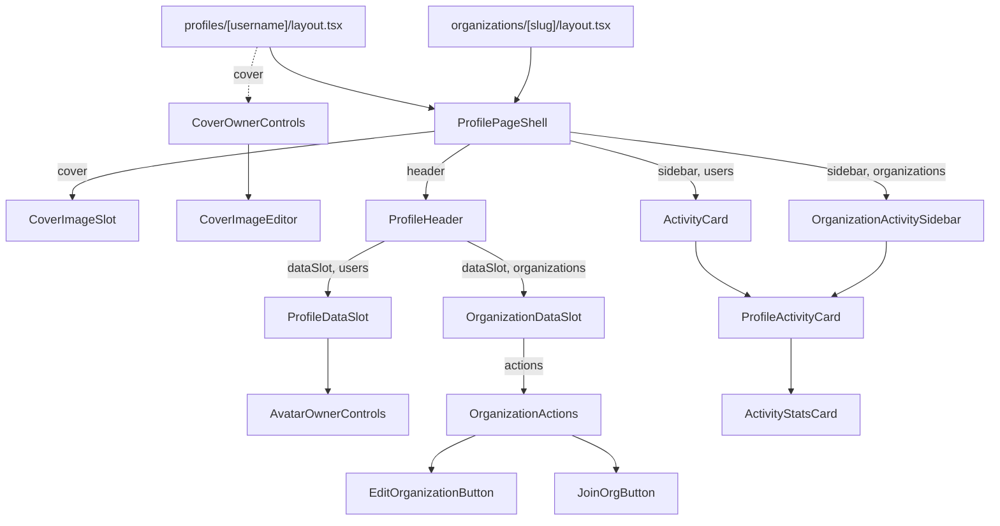

`src/components/profiles/` assembles the two profile page layouts: user profiles at `/profiles/[username]` and organization profiles at `/organizations/[slug]`. Both layouts compose the same `shared/` frame — `ProfilePageShell` with a cover, header, tabs and sidebar — and fill its slots with domain-specific pieces from `users/` or `organizations/`. Owner editing (cover, avatar, the Edit Profile link) is offered only while the active account is the user themself, not an organization they manage. See also [Profiles & Social Graph](../../features/profiles-and-social-graph/).

## Shared

### ProfilePageShell

The two-column profile page frame: a full-width cover band, then a main column (header, tabs, content) that overlaps the cover, with a sticky sidebar from `md` up. The cover band carries a `group` class that hover controls inside it depend on.

**Source:** [src/components/profiles/shared/ProfilePageShell.tsx](https://github.com/ozeaon/ozeaon-v2/blob/0a4f1a95824db87782f1221a4108019d174df3d9/src/components/profiles/shared/ProfilePageShell.tsx)

### CoverImageSlot

The cover image for a profile, or a brand gradient when there is none. Renders `next/image` with `fill` and `priority`, so it needs a positioned parent.

**Source:** [src/components/profiles/shared/CoverImageSlot.tsx](https://github.com/ozeaon/ozeaon-v2/blob/0a4f1a95824db87782f1221a4108019d174df3d9/src/components/profiles/shared/CoverImageSlot.tsx)

### ProfileHeader

Stacks a data slot above an actions slot, wrapping actions in `Suspense`. Both current layouts pass `actions={null}`.

**Source:** [src/components/profiles/shared/ProfileHeader.tsx](https://github.com/ozeaon/ozeaon-v2/blob/0a4f1a95824db87782f1221a4108019d174df3d9/src/components/profiles/shared/ProfileHeader.tsx)

### ProfileHeaderCard

The rounded, padded card background shared by both header data slots.

**Source:** [src/components/profiles/shared/ProfileHeaderCard.tsx](https://github.com/ozeaon/ozeaon-v2/blob/0a4f1a95824db87782f1221a4108019d174df3d9/src/components/profiles/shared/ProfileHeaderCard.tsx)

### ActivityStatsCard

A titled stats card: a row of numeric stats, an optional month-on-month trend line and a children slot.

**Source:** [src/components/profiles/shared/ActivityStatsCard.tsx](https://github.com/ozeaon/ozeaon-v2/blob/0a4f1a95824db87782f1221a4108019d174df3d9/src/components/profiles/shared/ActivityStatsCard.tsx)

### ProfileActivityCard

An `ActivityStatsCard` preset with Projects and Articles counts and the `ProgressTokensSoon` teaser.

**Source:** [src/components/profiles/shared/ProfileActivityCard.tsx](https://github.com/ozeaon/ozeaon-v2/blob/0a4f1a95824db87782f1221a4108019d174df3d9/src/components/profiles/shared/ProfileActivityCard.tsx)

### ProgressTokensSoon

A static teaser showing a "Progress Tokens — Soon" badge. Progress Tokens and the PRG ledger are planned and not built.

**Source:** [src/components/profiles/shared/ProgressTokensSoon.tsx](https://github.com/ozeaon/ozeaon-v2/blob/0a4f1a95824db87782f1221a4108019d174df3d9/src/components/profiles/shared/ProgressTokensSoon.tsx)

## Users

### ProfileDataSlot

The user profile header card: avatar (with owner controls), name, founding-member badge, location, role, social and custom links, and an "Edit Profile" link for the owner. Calls `getAuthUser()`; the viewer is the owner only when `activeAccount.type === "user"` and `user.id === profile.id`.

**Source:** [src/components/profiles/users/ProfileDataSlot.tsx](https://github.com/ozeaon/ozeaon-v2/blob/0a4f1a95824db87782f1221a4108019d174df3d9/src/components/profiles/users/ProfileDataSlot.tsx)

### AvatarOwnerControls

The profile avatar, with camera (upload) and trash (remove) buttons overlaid on hover/focus when the viewer owns the profile; for non-owners it is just a `UserAvatar`. Ownership requires `activeAccount.type === "user"`. Upload goes through `AvatarCropModal`; moderation rejections keep the crop modal open.

**Source:** [src/components/profiles/users/AvatarOwnerControls.tsx](https://github.com/ozeaon/ozeaon-v2/blob/0a4f1a95824db87782f1221a4108019d174df3d9/src/components/profiles/users/AvatarOwnerControls.tsx)

### CoverOwnerControls

Renders `CoverImageEditor` only when the viewer is the profile owner acting as themselves. Returns `null` when the active account is an organization, because the upload route always writes to the personal profile.

**Source:** [src/components/profiles/users/CoverOwnerControls.tsx](https://github.com/ozeaon/ozeaon-v2/blob/0a4f1a95824db87782f1221a4108019d174df3d9/src/components/profiles/users/CoverOwnerControls.tsx)

### CoverImageEditor

Hover buttons over the cover band to add, replace or remove the cover image. Does no ownership check itself — always render it through `CoverOwnerControls`. The buttons appear on `group-hover`, which relies on the `group` class on `ProfilePageShell`'s cover band.

**Source:** [src/components/profiles/users/CoverImageEditor.tsx](https://github.com/ozeaon/ozeaon-v2/blob/0a4f1a95824db87782f1221a4108019d174df3d9/src/components/profiles/users/CoverImageEditor.tsx)

### ActivityCard

Fetches a user's project and article counts and renders them as a `ProfileActivityCard` titled "Activity".

**Source:** [src/components/profiles/users/ActivityCard.tsx](https://github.com/ozeaon/ozeaon-v2/blob/0a4f1a95824db87782f1221a4108019d174df3d9/src/components/profiles/users/ActivityCard.tsx)

## Connections, Following & Blocking

Code exists for connecting, following, blocking and displaying privacy-gated content, but none of it is wired up. Rewiring connections into profiles and re-enabling blocking is on the roadmap; privacy settings are not built. The profile layout currently passes `actions={null}` to `ProfileHeader` (marked `TODO(post-Phase-0)`).

### ProfileActions

Server-side wiring for Connect, Follow and Block buttons on another user's profile. No current call sites.

**Source:** [src/components/profiles/users/ProfileActions.tsx](https://github.com/ozeaon/ozeaon-v2/blob/0a4f1a95824db87782f1221a4108019d174df3d9/src/components/profiles/users/ProfileActions.tsx)

### ConnectButton

Connection request controls whose label and action depend on the connection state (`none` / `pending_outgoing` / `pending_incoming` / `connected`). The displayed state does not update after an action — it comes only from `initialStatus`.

**Source:** [src/components/profiles/users/ConnectButton.tsx](https://github.com/ozeaon/ozeaon-v2/blob/0a4f1a95824db87782f1221a4108019d174df3d9/src/components/profiles/users/ConnectButton.tsx)

### FollowButton

A Follow / Following toggle. Calls `followUser` / `unfollowUser` via `useAsyncAction`.

**Source:** [src/components/profiles/users/FollowButton.tsx](https://github.com/ozeaon/ozeaon-v2/blob/0a4f1a95824db87782f1221a4108019d174df3d9/src/components/profiles/users/FollowButton.tsx)

### BlockButton

An overflow ("…") menu with a "Block user" item and a destructive confirm dialog.

**Source:** [src/components/profiles/users/BlockButton.tsx](https://github.com/ozeaon/ozeaon-v2/blob/0a4f1a95824db87782f1221a4108019d174df3d9/src/components/profiles/users/BlockButton.tsx)

### UnblockButton

A ghost "Unblock" button that calls `unblockUser` then `router.refresh()`. No current call sites.

**Source:** [src/components/profiles/users/UnblockButton.tsx](https://github.com/ozeaon/ozeaon-v2/blob/0a4f1a95824db87782f1221a4108019d174df3d9/src/components/profiles/users/UnblockButton.tsx)

### ConnectionRequests

A list of incoming or outgoing connection requests that removes each request from the list once it is acted on. No current call sites.

**Source:** [src/components/profiles/users/ConnectionRequests.tsx](https://github.com/ozeaon/ozeaon-v2/blob/0a4f1a95824db87782f1221a4108019d174df3d9/src/components/profiles/users/ConnectionRequests.tsx)

### ConnectionRequestCard

One connection request row: the other user's avatar and name with Accept/Decline (incoming) or Cancel (outgoing) buttons.

**Source:** [src/components/profiles/users/ConnectionRequestCard.tsx](https://github.com/ozeaon/ozeaon-v2/blob/0a4f1a95824db87782f1221a4108019d174df3d9/src/components/profiles/users/ConnectionRequestCard.tsx)

### PrivateContentMessage

A centred lock message explaining why a user's posts and articles are hidden. No current call sites.

**Source:** [src/components/profiles/users/PrivateContentMessage.tsx](https://github.com/ozeaon/ozeaon-v2/blob/0a4f1a95824db87782f1221a4108019d174df3d9/src/components/profiles/users/PrivateContentMessage.tsx)

## Image Gallery

`ImageGalleryList` and `ImageCard` exist in `src/components/profiles/users/images/` but have no call sites in the app; they are exported from a barrel but unused.

### ImageGalleryList

A responsive grid of post images or an `EmptyState`. No current call sites.

**Source:** [src/components/profiles/users/images/ImageGalleryList.tsx](https://github.com/ozeaon/ozeaon-v2/blob/0a4f1a95824db87782f1221a4108019d174df3d9/src/components/profiles/users/images/ImageGalleryList.tsx)

### ImageCard

A square card holding a single `ZoomableImage`.

**Source:** [src/components/profiles/users/images/ImageCard.tsx](https://github.com/ozeaon/ozeaon-v2/blob/0a4f1a95824db87782f1221a4108019d174df3d9/src/components/profiles/users/images/ImageCard.tsx)

## Organizations

### OrganizationDataSlot

The organization profile header card: logo, name, Verified badge, founding-member badge, contact/social links, mission, member and active-project counts, and an actions slot. Renders the `verified` flag from the database; there is no verification flow yet (organization verification is on the roadmap). Uses `UserAvatar` for the logo, so organizations without a logo get initials.

**Source:** [src/components/profiles/organizations/OrganizationDataSlot.tsx](https://github.com/ozeaon/ozeaon-v2/blob/0a4f1a95824db87782f1221a4108019d174df3d9/src/components/profiles/organizations/OrganizationDataSlot.tsx)

### OrganizationActions

Chooses the viewer's action on an organization profile: Edit for owners and admins, Join/Cancel Request for non-members, nothing for other members or signed-out viewers. Reads the viewer's `organization_members` row and any pending join request in parallel; the layout wraps it in `Suspense`.

**Source:** [src/components/profiles/organizations/OrganizationActions.tsx](https://github.com/ozeaon/ozeaon-v2/blob/0a4f1a95824db87782f1221a4108019d174df3d9/src/components/profiles/organizations/OrganizationActions.tsx)

### EditOrganizationButton

An "Edit Organisation" button that switches the active account to the organization if needed (via `switchToOrg`), then navigates to `/settings`. Organization settings render from the active account cookie, so the account switch must happen first.

**Source:** [src/components/profiles/organizations/EditOrganizationButton.tsx](https://github.com/ozeaon/ozeaon-v2/blob/0a4f1a95824db87782f1221a4108019d174df3d9/src/components/profiles/organizations/EditOrganizationButton.tsx)

### JoinOrgButton

A "Join Organisation" button that becomes "Cancel Request" while a join request is pending. Stores the request id in local state so the cancel action can reference it. Returns `null` when signed out or when the state is `member`.

**Source:** [src/components/profiles/organizations/JoinOrgButton.tsx](https://github.com/ozeaon/ozeaon-v2/blob/0a4f1a95824db87782f1221a4108019d174df3d9/src/components/profiles/organizations/JoinOrgButton.tsx)

### OrganizationActivitySidebar

The organization profile sidebar: an activity card with project/article counts and trend, above the organization's links. The overview page renders a second copy inside a `md:hidden` wrapper for mobile.

**Source:** [src/components/profiles/organizations/OrganizationActivitySidebar.tsx](https://github.com/ozeaon/ozeaon-v2/blob/0a4f1a95824db87782f1221a4108019d174df3d9/src/components/profiles/organizations/OrganizationActivitySidebar.tsx)

### OrganizationLinks

An organization's contact and social links in an icon-only row (default) or a labelled column. Returns `null` when there are no links. Each link gets an `aria-label` when labels are hidden.

**Source:** [src/components/profiles/organizations/OrganizationLinks.tsx](https://github.com/ozeaon/ozeaon-v2/blob/0a4f1a95824db87782f1221a4108019d174df3d9/src/components/profiles/organizations/OrganizationLinks.tsx)

### SocialLinkIcon

Picks a brand icon (LinkedIn, GitHub or globe) for a link based on its label, matched case-insensitively.

**Source:** [src/components/profiles/organizations/SocialLinkIcon.tsx](https://github.com/ozeaon/ozeaon-v2/blob/0a4f1a95824db87782f1221a4108019d174df3d9/src/components/profiles/organizations/SocialLinkIcon.tsx)

## Organization Overview Sections

Barrel: `src/components/profiles/organizations/sections/index.ts` exports `DescriptionSection`, `ActiveProjectsSection`, `RecentArticlesSection` and `MembersSection`.

### DescriptionSection

A "Description" heading and the organization's description text. Returns `null` when there is no description.

**Source:** [src/components/profiles/organizations/sections/DescriptionSection.tsx](https://github.com/ozeaon/ozeaon-v2/blob/0a4f1a95824db87782f1221a4108019d174df3d9/src/components/profiles/organizations/sections/DescriptionSection.tsx)

### ActiveProjectsSection

An "Active Projects" carousel of `CondensedProjectCard`s, or an `EmptyState`. Excludes archived projects and caps the carousel at 12.

**Source:** [src/components/profiles/organizations/sections/ActiveProjectsSection.tsx](https://github.com/ozeaon/ozeaon-v2/blob/0a4f1a95824db87782f1221a4108019d174df3d9/src/components/profiles/organizations/sections/ActiveProjectsSection.tsx)

### RecentArticlesSection

A "Recent Articles" carousel of `CondensedArticleCard`s, or an `EmptyState`. Drops articles with a null `published_at` and caps at 12.

**Source:** [src/components/profiles/organizations/sections/RecentArticlesSection.tsx](https://github.com/ozeaon/ozeaon-v2/blob/0a4f1a95824db87782f1221a4108019d174df3d9/src/components/profiles/organizations/sections/RecentArticlesSection.tsx)

### MembersSection

A "Members" heading and a one- or two-column grid of `UserCard`s. Returns `null` when no member has a joined `user_profile`.

**Source:** [src/components/profiles/organizations/sections/MembersSection.tsx](https://github.com/ozeaon/ozeaon-v2/blob/0a4f1a95824db87782f1221a4108019d174df3d9/src/components/profiles/organizations/sections/MembersSection.tsx)

### OrgPostsFeed

Empty placeholder file — no content, no exports, not in the sections barrel. The organization posts tab renders the shared `PostsInfiniteFeed` with an `organizationId` directly (see [Posts](../../features/posts/)).

**Source:** [src/components/profiles/organizations/sections/OrgPostsFeed.tsx](https://github.com/ozeaon/ozeaon-v2/blob/0a4f1a95824db87782f1221a4108019d174df3d9/src/components/profiles/organizations/sections/OrgPostsFeed.tsx)
