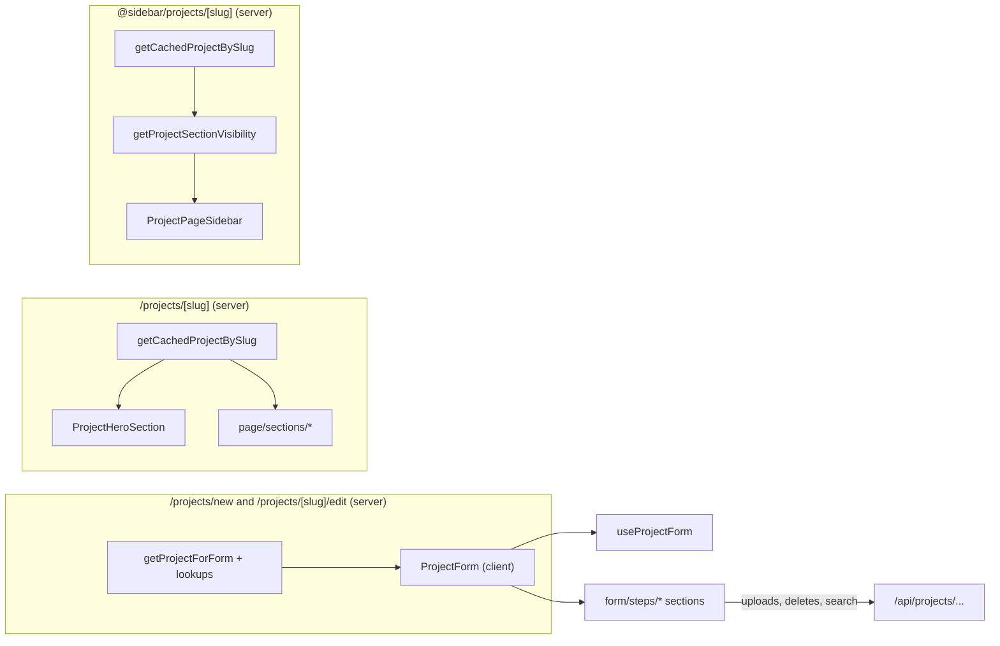

`src/components/projects/` covers four surfaces: public feeds and cards, the multi-section create/edit form, the public project page, and shared dialogs. Import cards from `@/components/projects/cards`, form steps from `@/components/projects/form/steps`, and page components from `@/components/projects/page`. See also [Projects](../../features/projects/).

Project funding, donations and rewards are on the roadmap; all funding UI (the disabled toggles in ConfigurationSection, the static "Funding - Soon" badge on CondensedProjectCard, the "Fund - Coming Soon" CTA in ProjectHeroCta, and FundingSection) is placeholder.

The card components, `ProjectHeroSection` and `ProjectCard` all wrap the cover image in a `ViewTransition` named `project-cover-{id}` with `share="morph"` so the cover morphs between a feed and the project page.

## Root

### ProjectsInfiniteFeed

The public infinite-scrolling project feed. Wraps `GenericInfiniteFeed` with `entity="projects"` and switches between `ProjectCard` on desktop and `CondensedProjectCard` on mobile. SSR renders the desktop variant; only one card variant is mounted per row so each `project-cover-${id}` view transition name stays unique.

**Source:** [src/components/projects/ProjectsInfiniteFeed.tsx](https://github.com/ozeaon/ozeaon-v2/blob/0a4f1a95824db87782f1221a4108019d174df3d9/src/components/projects/ProjectsInfiniteFeed.tsx)

### ProjectDeleteDialog

A destructive `ConfirmDialog` preset that confirms before deleting a project. The caller performs the actual deletion.

**Source:** [src/components/projects/ProjectDeleteDialog.tsx](https://github.com/ozeaon/ozeaon-v2/blob/0a4f1a95824db87782f1221a4108019d174df3d9/src/components/projects/ProjectDeleteDialog.tsx)

### ProjectsFilterDialog

A filter button and dialog for the project feed (duration, type, SDGs, categories), with filters stored in the URL query string. It has no live call sites; it appears only in commented-out code in the projects layout, pending product sign-off on Feed filters.

**Source:** [src/components/projects/ProjectsFilterDialog.tsx](https://github.com/ozeaon/ozeaon-v2/blob/0a4f1a95824db87782f1221a4108019d174df3d9/src/components/projects/ProjectsFilterDialog.tsx)

## Dashboard

### PrivateProjectsInfiniteFeed

The dashboard "My Projects" feed. Renders status-filter tabs above an infinite list of `MyProjectCard`s, or an empty state. Changing a tab pushes `?filter=<value>` and re-fetches; `GenericInfiniteFeed` is keyed by `filter` so it remounts on tab change.

**Source:** [src/components/projects/pages/dashboard/PrivateProjectsInfiniteFeed.tsx](https://github.com/ozeaon/ozeaon-v2/blob/0a4f1a95824db87782f1221a4108019d174df3d9/src/components/projects/pages/dashboard/PrivateProjectsInfiniteFeed.tsx)

## Cards

`cards/index.ts` exports `CondensedProjectCard`, `MyProjectCard`, `SmallProjectSkeletonCard`, `ProjectStatusBadge`, `ProjectTimer`, `ProjectCard`, `ProjectSkeleton` and `ProjectListSkeleton`. `ProjectCardActions` and `ProjectCardCategories` are internal to `ProjectCard`.

### ProjectCard

The full-width feed card: byline, relative date, status badge, title, tagline, category chips, a cover image and a collapsible comments footer. Index 0 loads the cover eagerly; all others load lazily.

**Source:** [src/components/projects/cards/ProjectCard.tsx](https://github.com/ozeaon/ozeaon-v2/blob/0a4f1a95824db87782f1221a4108019d174df3d9/src/components/projects/cards/ProjectCard.tsx)

### ProjectSkeleton / ProjectListSkeleton

Loading placeholders matching `ProjectCard`'s layout. `ProjectListSkeleton` stacks three `ProjectSkeleton`s. Neither takes props.

**Source:** [src/components/projects/cards/ProjectCard.tsx](https://github.com/ozeaon/ozeaon-v2/blob/0a4f1a95824db87782f1221a4108019d174df3d9/src/components/projects/cards/ProjectCard.tsx)

### ProjectCardActions

`ProjectCard`'s footer: a comment toggle, a `ProjectTimer` and a "View Project" button, with a collapsible `EntityComments` thread beneath. Internal to `ProjectCard`.

**Source:** [src/components/projects/cards/ProjectCardActions.tsx](https://github.com/ozeaon/ozeaon-v2/blob/0a4f1a95824db87782f1221a4108019d174df3d9/src/components/projects/cards/ProjectCardActions.tsx)

### ProjectCardCategories

Category chips deduped from subcategories, fitted on one line with a show more/less toggle. A thin preset over `CategoryChipRow`. Internal to `ProjectCard`.

**Source:** [src/components/projects/cards/ProjectCardCategories.tsx](https://github.com/ozeaon/ozeaon-v2/blob/0a4f1a95824db87782f1221a4108019d174df3d9/src/components/projects/cards/ProjectCardCategories.tsx)

### CondensedProjectCard

A compact vertical card built on the shared `CondensedCard*` primitives. Used in carousels, mobile feeds and organization profiles. Always renders a static "Funding - Soon" badge (project funding is on the roadmap, not built).

**Source:** [src/components/projects/cards/CondensedProjectCard.tsx](https://github.com/ozeaon/ozeaon-v2/blob/0a4f1a95824db87782f1221a4108019d174df3d9/src/components/projects/cards/CondensedProjectCard.tsx)

### MyProjectCard

The dashboard card for a project you own. Shows a status badge, project type, title, timer and Edit / View / Delete actions. Draft projects link to `/projects/new?draft={id}` and have no View button. Delete calls `DELETE /api/projects/{id}` then `router.refresh()`.

**Source:** [src/components/projects/cards/MyProjectCard.tsx](https://github.com/ozeaon/ozeaon-v2/blob/0a4f1a95824db87782f1221a4108019d174df3d9/src/components/projects/cards/MyProjectCard.tsx)

### ProjectStatusBadge

A small badge with a coloured dot for a project status. Statuses without an entry in [`PROJECT_STATUS_BADGES`](https://github.com/ozeaon/ozeaon-v2/blob/0a4f1a95824db87782f1221a4108019d174df3d9/src/components/projects/cards/ProjectStatusBadge.tsx) (such as `unscheduled`) render `null`.

**Source:** [src/components/projects/cards/ProjectStatusBadge.tsx](https://github.com/ozeaon/ozeaon-v2/blob/0a4f1a95824db87782f1221a4108019d174df3d9/src/components/projects/cards/ProjectStatusBadge.tsx)

### ProjectTimer

A one-line timing label with an optional clock icon: "Starts in …", "Ends in …" or "Ended {date}". Renders `null` when the relevant date is missing or `formatCountdown` returns nothing.

**Source:** [src/components/projects/cards/ProjectTimer.tsx](https://github.com/ozeaon/ozeaon-v2/blob/0a4f1a95824db87782f1221a4108019d174df3d9/src/components/projects/cards/ProjectTimer.tsx)

### SmallProjectSkeletonCard

A loading placeholder shaped like `MyProjectCard`.

**Source:** [src/components/projects/cards/SmallProjectSkeletonCard.tsx](https://github.com/ozeaon/ozeaon-v2/blob/0a4f1a95824db87782f1221a4108019d174df3d9/src/components/projects/cards/SmallProjectSkeletonCard.tsx)

## Form

### ProjectForm

The full project create/edit form: eleven numbered `FormSectionCard`s plus a Delete section once a project exists, a sticky section sidebar, and Save Draft / Publish controls. State, autosave and publish come from `useProjectForm`. `saveDraftSilent` is passed to sections that upload files so a draft row exists in the database before the upload request goes out.

**Source:** [src/components/projects/form/ProjectForm.tsx](https://github.com/ozeaon/ozeaon-v2/blob/0a4f1a95824db87782f1221a4108019d174df3d9/src/components/projects/form/ProjectForm.tsx)

## Form Steps

Each step reads and writes the parent `ProjectForm`'s React Hook Form context through `useFormContext` and must be rendered inside a `<Form>` provider.

### ProjectTypeSection

Section 1: a single `InputSelect` bound to `project_type_id`.

**Source:** [src/components/projects/form/steps/ProjectTypeSection.tsx](https://github.com/ozeaon/ozeaon-v2/blob/0a4f1a95824db87782f1221a4108019d174df3d9/src/components/projects/form/steps/ProjectTypeSection.tsx)

### ProjectIdentitySection

Section 2: title, tagline, cover image, logo, location and start/end timeline. Image uploads call `saveDraftSilent` first to ensure a draft row exists, then POST to `/api/projects/{id}/image?type=cover` or `?type=logo`. Removing an image nulls both the URL and ID fields.

**Source:** [src/components/projects/form/steps/ProjectIdentitySection.tsx](https://github.com/ozeaon/ozeaon-v2/blob/0a4f1a95824db87782f1221a4108019d174df3d9/src/components/projects/form/steps/ProjectIdentitySection.tsx)

### CategoriesSection

Section 3: a grouped multi-select of subcategories, an SDG checkbox group and a tag input.

**Source:** [src/components/projects/form/steps/CategoriesSection.tsx](https://github.com/ozeaon/ozeaon-v2/blob/0a4f1a95824db87782f1221a4108019d174df3d9/src/components/projects/form/steps/CategoriesSection.tsx)

### ConfigurationSection

Section 4: the funding and donations toggles (both disabled, "Coming soon" — project funding is on the roadmap) and the organization connection picker.

**Source:** [src/components/projects/form/steps/ConfigurationSection.tsx](https://github.com/ozeaon/ozeaon-v2/blob/0a4f1a95824db87782f1221a4108019d174df3d9/src/components/projects/form/steps/ConfigurationSection.tsx)

### ContentSection

Section 5: a drag-sortable list of content sections built from the system section types allowed for the selected project type, followed by custom sections. Section visibility per project type is hard-coded in [`SECTION_VISIBILITY`](https://github.com/ozeaon/ozeaon-v2/blob/0a4f1a95824db87782f1221a4108019d174df3d9/src/components/projects/form/steps/ContentSection.tsx); the `roadmap` and `tokenomics` sections appear only for the `dao-experiment` type (free-text content sections only; DAO and token features are not built). Removing a section shows an undo toast; when the toast commits and a project ID exists, it sends `DELETE /api/projects/{id}/sections/{slug}`.

**Source:** [src/components/projects/form/steps/ContentSection.tsx](https://github.com/ozeaon/ozeaon-v2/blob/0a4f1a95824db87782f1221a4108019d174df3d9/src/components/projects/form/steps/ContentSection.tsx)

### TeamSection (form step)

Section 6: a repeatable list of `TeamMemberCard`s. Selecting a linked user copies their name, bio and role descriptor into the form. Each card receives the other members' user IDs as `excludeUserIds` so the same user can't appear twice.

**Source:** [src/components/projects/form/steps/TeamSection.tsx](https://github.com/ozeaon/ozeaon-v2/blob/0a4f1a95824db87782f1221a4108019d174df3d9/src/components/projects/form/steps/TeamSection.tsx)

### DocumentsSection (form step)

Section 7: a document dropzone and the list of uploaded project documents. The dropzone accepts `multiple`, but only the first dropped file is uploaded. Deletion is optimistic and restores the item on failure.

**Source:** [src/components/projects/form/steps/DocumentsSection.tsx](https://github.com/ozeaon/ozeaon-v2/blob/0a4f1a95824db87782f1221a4108019d174df3d9/src/components/projects/form/steps/DocumentsSection.tsx)

### FAQSection

Section 8: a repeatable list of `FAQItemCard`s. Removing an item shows an undo toast that names the question when one exists.

**Source:** [src/components/projects/form/steps/FAQSection.tsx](https://github.com/ozeaon/ozeaon-v2/blob/0a4f1a95824db87782f1221a4108019d174df3d9/src/components/projects/form/steps/FAQSection.tsx)

### ContactSection

Section 9: contact email with an inline public/private selector, plus a website URL field.

**Source:** [src/components/projects/form/steps/ContactSection.tsx](https://github.com/ozeaon/ozeaon-v2/blob/0a4f1a95824db87782f1221a4108019d174df3d9/src/components/projects/form/steps/ContactSection.tsx)

### RelatedSection

Section 10: a combined article/project search. Queries wait until at least 3 characters, debounce for 500 ms, then fetch articles and projects in parallel. Any selected item without a `title` (for example, loaded from a draft) has its title fetched individually.

**Source:** [src/components/projects/form/steps/RelatedSection.tsx](https://github.com/ozeaon/ozeaon-v2/blob/0a4f1a95824db87782f1221a4108019d174df3d9/src/components/projects/form/steps/RelatedSection.tsx)

### CommentsSection (form step)

Section 11: a single `InputBoolean` bound to `comments_enabled`. Shared with the article form.

**Source:** [src/components/projects/form/steps/CommentsSection.tsx](https://github.com/ozeaon/ozeaon-v2/blob/0a4f1a95824db87782f1221a4108019d174df3d9/src/components/projects/form/steps/CommentsSection.tsx)

## Form Parts

Item cards rendered inside the repeatable form steps. Each is its own component so it can call `useWatch` for its own index without putting hooks inside `.map()`. All three are built on `CollapsibleCard`.

### ContentSectionCard

One sortable content section: drag handle, section label, intro and body inputs, and a media upload. The image upload calls `saveDraftSilent` first; removing the image fires a non-blocking `DELETE /api/projects/{id}/section-image?imageId={id}` and nulls both fields.

**Source:** [src/components/projects/form/parts/ContentSectionCard.tsx](https://github.com/ozeaon/ozeaon-v2/blob/0a4f1a95824db87782f1221a4108019d174df3d9/src/components/projects/form/parts/ContentSectionCard.tsx)

### TeamMemberCard

One team member: an optional OZEAON user link, name, role and bio. "Project Owner" heading when `is_owner` is true; "Team Member {n}" otherwise.

**Source:** [src/components/projects/form/parts/TeamMemberCard.tsx](https://github.com/ozeaon/ozeaon-v2/blob/0a4f1a95824db87782f1221a4108019d174df3d9/src/components/projects/form/parts/TeamMemberCard.tsx)

### FAQItemCard

One FAQ entry with question and answer inputs. The header shows the trimmed question or "Question {n}" when empty.

**Source:** [src/components/projects/form/parts/FAQItemCard.tsx](https://github.com/ozeaon/ozeaon-v2/blob/0a4f1a95824db87782f1221a4108019d174df3d9/src/components/projects/form/parts/FAQItemCard.tsx)

## Public Page

`page/index.ts` re-exports `ProjectHeroSection`, `ProjectNavSlot` and all eight section components. `ProjectPageSidebar`, `ProjectHeroCta`, `HeroCategoryBadges` and `section-data` are imported by path. Every component reads from a single `ProjectWithRelations` object passed down from the server page.

### ProjectHeroSection

The project page hero: cover image (or brand gradient) with type and status badges, category chips, byline, dates, title, tagline, linked organization, location and CTA. On `md+` these sit in an overlay on the cover; below `md` they stack under it.

**Source:** [src/components/projects/page/ProjectHeroSection.tsx](https://github.com/ozeaon/ozeaon-v2/blob/0a4f1a95824db87782f1221a4108019d174df3d9/src/components/projects/page/ProjectHeroSection.tsx)

### ProjectHeroCta

The hero call to action. Project managers see "Edit Project"; everyone else sees a static "Fund - Coming Soon" pill (project funding is on the roadmap, not built). The ownership check here is cosmetic — the edit route and mutations re-check with `canManageProject` on the server.

**Source:** [src/components/projects/page/ProjectHeroCta.tsx](https://github.com/ozeaon/ozeaon-v2/blob/0a4f1a95824db87782f1221a4108019d174df3d9/src/components/projects/page/ProjectHeroCta.tsx)

### HeroCategoryBadges

Single-line category badges, deduped from subcategories, with a show more/less toggle. `CategoryChipRow` with the `scrim` badge variant, for use over images.

**Source:** [src/components/projects/page/HeroCategoryBadges.tsx](https://github.com/ozeaon/ozeaon-v2/blob/0a4f1a95824db87782f1221a4108019d174df3d9/src/components/projects/page/HeroCategoryBadges.tsx)

### ProjectNavSlot

Puts a back button and the project title into the top nav's left slot (`md+` only) via `useNavSlot`. Renders nothing itself; populates the slot inside `useLayoutEffect` and clears it on unmount.

**Source:** [src/components/projects/page/ProjectNavSlot.tsx](https://github.com/ozeaon/ozeaon-v2/blob/0a4f1a95824db87782f1221a4108019d174df3d9/src/components/projects/page/ProjectNavSlot.tsx)

### ProjectPageSidebar

The project page table of contents with scroll-spy highlighting and optional contact email and website links. An `IntersectionObserver` marks the most-visible section as active; the sidebar route builds the section list from `SECTION_NAV` filtered by `getProjectSectionVisibility`.

**Source:** [src/components/projects/page/ProjectPageSidebar.tsx](https://github.com/ozeaon/ozeaon-v2/blob/0a4f1a95824db87782f1221a4108019d174df3d9/src/components/projects/page/ProjectPageSidebar.tsx)

### section-data

Not a component. A module of pure helpers that all page sections and the sidebar route use to derive display content from `ProjectWithRelations`. `getProjectSectionVisibility` always returns `funding: true` (funding section is always shown as a roadmap placeholder).

**Source:** [src/components/projects/page/section-data.ts](https://github.com/ozeaon/ozeaon-v2/blob/0a4f1a95824db87782f1221a4108019d174df3d9/src/components/projects/page/section-data.ts)

## Public Page Sections

`page/sections/index.ts` exports `CommentsSection`, `DocumentsSection`, `FAQsSection`, `FundingSection`, `OverviewSection`, `ProposalSection`, `RelatedContentSection` and `TeamSection`. Each renders a `<section id="section-…">` with `SECTION_ANCHOR_CLASS` (`scroll-mt-32`). Each returns `null` when it has nothing to show, except `FundingSection`, which always renders. All except `FundingSection` take a single `project: ProjectWithRelations` prop.

### OverviewSection

"Overview" heading, intro (large body text), body (`whitespace-pre-line`) and project tags. Returns `null` when both intro and body from `getOverviewContent` are empty. **Anchor:** `section-overview`.

**Source:** [src/components/projects/page/sections/OverviewSection.tsx](https://github.com/ozeaon/ozeaon-v2/blob/0a4f1a95824db87782f1221a4108019d174df3d9/src/components/projects/page/sections/OverviewSection.tsx)

### ProposalSection

"Proposal" heading and one block per non-overview content section (label, intro, body and optional image). Image blocks alternate sides on `md+`. Returns `null` when `getProposalBlocks` is empty. **Anchor:** `section-proposal`.

**Source:** [src/components/projects/page/sections/ProposalSection.tsx](https://github.com/ozeaon/ozeaon-v2/blob/0a4f1a95824db87782f1221a4108019d174df3d9/src/components/projects/page/sections/ProposalSection.tsx)

### TeamSection (page section)

"Team" heading and a one- or two-column grid of `UserCard`s with each member's role and bio. Returns `null` when the team is empty. **Anchor:** `section-team`.

**Source:** [src/components/projects/page/sections/TeamSection.tsx](https://github.com/ozeaon/ozeaon-v2/blob/0a4f1a95824db87782f1221a4108019d174df3d9/src/components/projects/page/sections/TeamSection.tsx)

### FundingSection

A static "Funding Rounds & Rewards" placeholder with a "Coming Soon" badge. Project funding is on the roadmap, not built. Takes no props; always rendered. **Anchor:** `section-funding`.

**Source:** [src/components/projects/page/sections/FundingSection.tsx](https://github.com/ozeaon/ozeaon-v2/blob/0a4f1a95824db87782f1221a4108019d174df3d9/src/components/projects/page/sections/FundingSection.tsx)

### DocumentsSection (page section)

"Documents" heading and a downloadable grid of `AttachedItemCard`s. The title is `document.title ?? document.filename`; the download link comes from `getImageUrlFromKey(document.path)`. Returns `null` when there are no documents. **Anchor:** `section-documents`.

**Source:** [src/components/projects/page/sections/DocumentsSection.tsx](https://github.com/ozeaon/ozeaon-v2/blob/0a4f1a95824db87782f1221a4108019d174df3d9/src/components/projects/page/sections/DocumentsSection.tsx)

### FAQsSection

"Frequently Asked Questions" as a single-open shadcn `Accordion`. Returns `null` when there are no FAQs. **Anchor:** `section-faqs`.

**Source:** [src/components/projects/page/sections/FAQsSection.tsx](https://github.com/ozeaon/ozeaon-v2/blob/0a4f1a95824db87782f1221a4108019d174df3d9/src/components/projects/page/sections/FAQsSection.tsx)

### RelatedContentSection

A "Related Content" `CarouselSection` mixing `CondensedProjectCard` and `CondensedArticleCard` in the order from `getRelatedContent`. Returns `null` when there is no related content. **Anchor:** `section-related` (via `aria-label`, not a heading ID).

**Source:** [src/components/projects/page/sections/RelatedContentSection.tsx](https://github.com/ozeaon/ozeaon-v2/blob/0a4f1a95824db87782f1221a4108019d174df3d9/src/components/projects/page/sections/RelatedContentSection.tsx)

### CommentsSection (page section)

"Comments" heading and the `EntityComments` thread for the project. Returns `null` when `shouldHideCommentSection` is true. Not listed in the sidebar's `SECTION_NAV`. **Anchor:** `section-comments`.

**Source:** [src/components/projects/page/sections/CommentsSection.tsx](https://github.com/ozeaon/ozeaon-v2/blob/0a4f1a95824db87782f1221a4108019d174df3d9/src/components/projects/page/sections/CommentsSection.tsx)
