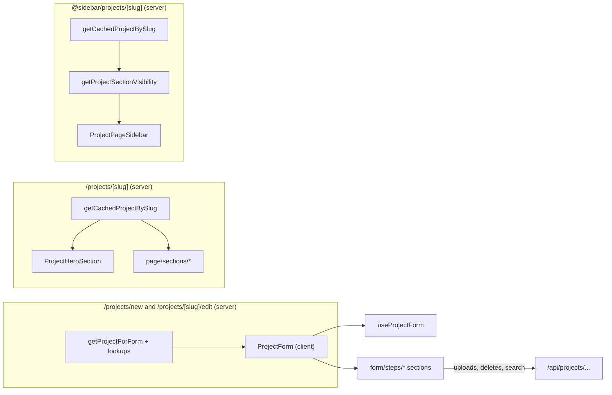

`src/components/projects/` covers four surfaces:

- **Feeds and cards** (`ProjectsInfiniteFeed`, `pages/dashboard/PrivateProjectsInfiniteFeed`, `cards/`). Public feeds render `ProjectCard` on desktop and `CondensedProjectCard` on mobile. Dashboard feeds render `MyProjectCard` with Edit/View/Delete actions.
- **The create/edit form** (`form/`). `ProjectForm` is one long client form split into eleven numbered `FormSectionCard`s. Each section lives in `form/steps/`, and the repeatable items it renders live in `form/parts/`. State, autosave and publish come from the `useProjectForm` hook.
- **The public project page** (`page/`). The hero, the nav slot, the table-of-contents sidebar and one component per page section. Every section reads from a single `ProjectWithRelations` object, and the pure helpers in `page/section-data.ts` decide what each section shows.
- **Shared dialogs** (`ProjectDeleteDialog`, `ProjectsFilterDialog`).

Server pages fetch the data and pass it down. The client components then call `/api/projects/...` routes for mutations.



The card components, `ProjectHeroSection` and `ProjectCard` all wrap the cover image in a `ViewTransition` named `project-cover-{id}` with `share="morph"`. This lets the cover morph between a feed and the project page.

## Root

### ProjectsInfiniteFeed

The public infinite-scrolling project feed. It wraps `GenericInfiniteFeed` with `entity="projects"` and switches card variants by viewport.

- **Source:** [src/components/projects/ProjectsInfiniteFeed.tsx](https://github.com/ozeaon/ozeaon-v2/blob/0a4f1a95824db87782f1221a4108019d174df3d9/src/components/projects/ProjectsInfiniteFeed.tsx)
- **Kind:** Client component (`"use client"`)
- **Used in:** `src/app/(main)/(feed)/(public)/projects/page.tsx`, `src/app/(main)/(profile)/organizations/[slug]/(tabs)/projects/page.tsx`, `src/app/(main)/(profile)/profiles/[username]/projects/page.tsx`

| Prop | Type | Default | Description |
|---|---|---|---|
| `initial` | `ProjectWithAuthor[]` | — | First page of projects, fetched server-side. |
| `limit` | `number` | — | Page size passed to `GenericInfiniteFeed`. |
| `userId` | `string` | — | Optional. Sent as an extra query param to scope the feed to one user. |
| `organizationId` | `string` | — | Optional. Sent as an extra query param to scope the feed to one organization. |

Notable behaviour:

- Uses `useIsMobile()`. Mobile renders `CondensedProjectCard` (with an explicit `ProjectStatusBadge`, `className="w-full"` and `headingLevel="h2"`). Desktop renders `ProjectCard`. Only one variant is mounted per row, so each `project-cover-${id}` view transition name is unique. SSR renders the desktop variant.
- A local `toCondensed()` maps `ProjectWithAuthor` to `CondensedProjectCardData` and flattens `project_resource_subcategories` into `resource_subcategories`.
- `extraParams` is `undefined` unless `userId` or `organizationId` is set.

```tsx
<ProjectsInfiniteFeed
  initial={projects}
  limit={FEED_PAGE_LIMIT}
  organizationId={orgId}
/>
```

### ProjectDeleteDialog

A destructive `ConfirmDialog` preset that asks before a project is deleted. The caller performs the deletion.

- **Source:** [src/components/projects/ProjectDeleteDialog.tsx](https://github.com/ozeaon/ozeaon-v2/blob/0a4f1a95824db87782f1221a4108019d174df3d9/src/components/projects/ProjectDeleteDialog.tsx)
- **Kind:** Client component (`"use client"`)
- **Used in:** `src/components/projects/cards/MyProjectCard.tsx`, `src/components/projects/form/ProjectForm.tsx`

| Prop | Type | Default | Description |
|---|---|---|---|
| `open` | `boolean` | — | Controlled open state. |
| `onOpenChange` | `(open: boolean) => void` | — | Open state setter. |
| `onConfirm` | `() => void \| Promise<unknown>` | — | Runs when "Delete Project" is clicked. |
| `isLoading` | `boolean` | — | Passed to `ConfirmDialog` to show the pending state. |

```tsx
<ProjectDeleteDialog
  open={showDeleteDialog}
  onOpenChange={setShowDeleteDialog}
  onConfirm={handleDelete}
  isLoading={isDeleting}
/>
```

### ProjectsFilterDialog

A filter button and dialog for the project feed. Filters are project duration, project type, SDGs and categories, and they are stored in the URL query string.

- **Source:** [src/components/projects/ProjectsFilterDialog.tsx](https://github.com/ozeaon/ozeaon-v2/blob/0a4f1a95824db87782f1221a4108019d174df3d9/src/components/projects/ProjectsFilterDialog.tsx)
- **Kind:** Client component (`"use client"`)
- **Used in:** no live call sites. It only appears in commented-out code in `src/app/(main)/(feed)/(public)/projects/layout.tsx`, pending product sign-off.

| Prop | Type | Default | Description |
|---|---|---|---|
| `className` | `string` | — | Extra classes for the trigger button. |
| `categories` | `CategoryWithSubcategories[]` | `[]` | Category options. Only top-level `id`/`name` are used. |
| `sdgs` | `SDG[]` | `[]` | SDG options, labelled `SDG {id}: {title}`. |
| `projectTypes` | `ProjectType[]` | `[]` | Project type options. |

Notable behaviour:

- Reads applied filters from `useSearchParams()`: repeated `category`, `sdg` and `type` params, plus single `from`/`to` dates. The trigger shows a count badge with the number of applied filters.
- The form uses React Hook Form with `zodResolver(projectFiltersSchema)` (fields `categories`, `sdgs`, `projectTypeIds`, `from`, `to`). Opening the dialog resets the form to the currently applied URL values.
- Submitting rebuilds the query string and calls `router.replace(..., { scroll: false })`, then closes the dialog. "Reset all" clears the form but does not touch the URL until you apply.
- Each `FilterSection` has its own clear action.

## pages/dashboard

### PrivateProjectsInfiniteFeed

The dashboard "My Projects" feed. It shows status filter tabs above an infinite list of `MyProjectCard`s, or an empty state with a "Create new project" link.

- **Source:** [src/components/projects/pages/dashboard/PrivateProjectsInfiniteFeed.tsx](https://github.com/ozeaon/ozeaon-v2/blob/0a4f1a95824db87782f1221a4108019d174df3d9/src/components/projects/pages/dashboard/PrivateProjectsInfiniteFeed.tsx)
- **Kind:** Client component (`"use client"`)
- **Used in:** `src/app/(main)/(dashboard)/settings/(personal)/my-projects/page.tsx`, `src/app/(main)/(dashboard)/settings/(organizations)/projects/page.tsx`

| Prop | Type | Default | Description |
|---|---|---|---|
| `initial` | `DashboardProjectCardEntry[]` | — | First page of projects for the current filter. |
| `limit` | `number` | — | Page size. |
| `userId` | `string` | — | Optional. Scopes the feed to a user. |
| `organizationId` | `string` | — | Optional. Scopes the feed to an organization. |
| `filter` | `ProjectStatusFilter` | — | The active status tab. |

Notable behaviour:

- Tabs come from `PROJECT_STATUS_FILTER_TABS`. Changing a tab pushes `?filter=<value>` with `useTransitionRouter` and keeps the other params. The server page re-fetches `initial`.
- `GenericInfiniteFeed` is keyed by `filter`, so it remounts on tab change. Its `extraParams` are `{ filter, dashboard: "true" }` plus `userId`/`organizationId` when set.
- The list or the empty state is wrapped in `role="tabpanel"` with `id="filter-tabpanel-{filter}"` and `aria-labelledby="filter-tab-{filter}"`.

```tsx
<PrivateProjectsInfiniteFeed
  limit={12}
  initial={projects}
  userId={user.id}
  filter={filter}
/>
```

## cards

`cards/index.ts` exports `CondensedProjectCard`, `MyProjectCard`, `SmallProjectSkeletonCard`, `ProjectStatusBadge`, `ProjectTimer`, `ProjectCard`, `ProjectSkeleton` and `ProjectListSkeleton`. `ProjectCardActions` and `ProjectCardCategories` are internal to `ProjectCard` and are not exported.

### ProjectCard

The full-width feed card: byline, relative date, status badge, title, tagline, category chips and a cover image on the right (hidden below `sm`). An actions footer with collapsible comments sits underneath.

- **Source:** [src/components/projects/cards/ProjectCard.tsx](https://github.com/ozeaon/ozeaon-v2/blob/0a4f1a95824db87782f1221a4108019d174df3d9/src/components/projects/cards/ProjectCard.tsx)
- **Kind:** Server component (no directive). Its footer, `ProjectCardActions`, is a client component.
- **Used in:** `src/components/projects/ProjectsInfiniteFeed.tsx`, `src/components/search/SearchResultsFeed.tsx`, `src/app/(main)/(feed)/(public)/projects/(tabs)/latest/page.tsx`

| Prop | Type | Default | Description |
|---|---|---|---|
| `project` | `ProjectWithAuthor` | — | Project row with author, authoring organization, status, cover, subcategories and stats. |
| `index` | `number` | `0` | Position in the list. Index `0` loads the cover with `fetchPriority="high"` and `loading="eager"`. Every other index loads lazily. |

Notable behaviour:

- Status falls back to `"unscheduled"` when `project_status` is null.
- The date shown is `updated_at` (relative format).
- The cover link has `tabIndex={-1}`. When there is no `cover_image.path`, a plain `bg-bg-sunken` box is shown.

```tsx
<ProjectCard key={project.id} project={project} index={index} />
```

### ProjectSkeleton / ProjectListSkeleton

Loading placeholders that match `ProjectCard`'s layout. `ProjectListSkeleton` stacks three `ProjectSkeleton`s. Neither takes props.

- **Source:** [src/components/projects/cards/ProjectCard.tsx](https://github.com/ozeaon/ozeaon-v2/blob/0a4f1a95824db87782f1221a4108019d174df3d9/src/components/projects/cards/ProjectCard.tsx)
- **Kind:** Server component (no directive)
- **Used in:** `src/app/(main)/(feed)/(public)/projects/page.tsx`, `src/app/(main)/(feed)/(public)/projects/(tabs)/trending/page.tsx`, `src/app/(main)/(feed)/(public)/projects/(tabs)/latest/page.tsx`

```tsx
<Suspense fallback={<ProjectListSkeleton />}>
```

### ProjectCardActions

`ProjectCard`'s footer: a comment toggle, a `ProjectTimer` and a "View Project" button. Underneath is a collapsible `EntityComments` thread.

- **Source:** [src/components/projects/cards/ProjectCardActions.tsx](https://github.com/ozeaon/ozeaon-v2/blob/0a4f1a95824db87782f1221a4108019d174df3d9/src/components/projects/cards/ProjectCardActions.tsx)
- **Kind:** Client component (`"use client"`)
- **Used in:** `src/components/projects/cards/ProjectCard.tsx`

| Prop | Type | Default | Description |
|---|---|---|---|
| `projectId` | `string` | — | Entity ID for the comments thread. |
| `slug` | `ProjectWithAuthor["slug"]` | — | Used for the `/projects/{slug}` link. |
| `status` | `ProjectStatus` | — | Passed to `ProjectTimer`. |
| `dates` | `Pick<ProjectWithAuthor, "start_date" \| "end_date">` | — | Passed to `ProjectTimer`. |
| `commentsEnabled` | `ProjectWithAuthor["comments_enabled"]` | — | Whether new comments are allowed. |
| `initialCommentCount` | `number` | — | Seed for the local comment count. |

Notable behaviour:

- Keeps `commentCount` and `commentsOpen` in local state. `EntityComments` updates the count through `onCommentCountChange`.
- The toggle and thread are hidden when `shouldHideCommentSection(commentsEnabled, commentCount)` is true.
- The current user comes from `useAuth()`.

### ProjectCardCategories

Category chips, deduped from subcategories, that fit on one line with a show more/less toggle. It is a thin preset over `CategoryChipRow` with the project card chip style.

- **Source:** [src/components/projects/cards/ProjectCardCategories.tsx](https://github.com/ozeaon/ozeaon-v2/blob/0a4f1a95824db87782f1221a4108019d174df3d9/src/components/projects/cards/ProjectCardCategories.tsx)
- **Kind:** Client component (`"use client"`)
- **Used in:** `src/components/projects/cards/ProjectCard.tsx`

| Prop | Type | Default | Description |
|---|---|---|---|
| `subcategories` | `Subcategory[]` | — | `Pick<Tables<"resource_subcategories">, "id" \| "name">` plus a `category` of `{ id, name, slug }`. |
| `className` | `string` | — | Wrapper classes. |

```tsx
<ProjectCardCategories
  className="relative z-1 mt-5"
  subcategories={project.project_resource_subcategories
    .map(({ resource_subcategories: sub }) => sub)
    .filter((sub) => sub !== null)}
/>
```

### CondensedProjectCard

A compact vertical card built on the shared `CondensedCard*` primitives. It shows the cover with category chips and a badge, then a byline, a relative date, a title, a tagline, a `ProjectTimer` and a view action. It is used in carousels, on mobile feeds and on organization profiles.

- **Source:** [src/components/projects/cards/CondensedProjectCard.tsx](https://github.com/ozeaon/ozeaon-v2/blob/0a4f1a95824db87782f1221a4108019d174df3d9/src/components/projects/cards/CondensedProjectCard.tsx)
- **Kind:** Server component (no directive)
- **Used in:** `src/app/(main)/(feed)/(public)/(home)/page.tsx`, `src/components/profiles/organizations/sections/ActiveProjectsSection.tsx`, `src/components/projects/page/sections/RelatedContentSection.tsx`

| Prop | Type | Default | Description |
|---|---|---|---|
| `project` | `CondensedProjectCardData` | — | Condensed project shape. |
| `badge` | `ReactNode` | — | Overrides the cover badge. If omitted, published projects get a `ProjectStatusBadge` and unpublished ones get none. Any value other than `undefined`, including `null`, replaces the default. |
| `className` | `string` | — | Extra classes on the card shell. |
| `headingLevel` | `"h2" \| "h3"` | `"h3"` | Element used for the title. |

Notable behaviour:

- Category chips are the parent category names, deduped from `resource_subcategories` by `dedupeSubcategoriesToCategories`.
- Always renders a static "Funding - Soon" badge in the header row.
- `ProjectTimer` is rendered with `showIcon={false}`.

```tsx
<CondensedProjectCard key={project.id} project={project} />
```

### MyProjectCard

The dashboard card for a project you own. It shows a status badge, the project type, the title, a timer and Edit / View / Delete actions.

- **Source:** [src/components/projects/cards/MyProjectCard.tsx](https://github.com/ozeaon/ozeaon-v2/blob/0a4f1a95824db87782f1221a4108019d174df3d9/src/components/projects/cards/MyProjectCard.tsx)
- **Kind:** Client component (`"use client"`)
- **Used in:** `src/components/projects/pages/dashboard/PrivateProjectsInfiniteFeed.tsx`

| Prop | Type | Default | Description |
|---|---|---|---|
| `project` | `DashboardProjectCardEntry` | — | Dashboard project entry. |

Notable behaviour:

- Links depend on `published`. A published project edits at `/projects/{slug}/edit` and views at `/projects/{slug}`. A draft edits at `/projects/new?draft={id}` and has no View button. The title links to the view URL, or to the edit URL when there is none.
- Delete opens `ProjectDeleteDialog`. Confirming sends `DELETE /api/projects/{id}` through `useAsyncAction`, which shows success/error toasts, then calls `router.refresh()` from `useTransitionRouter`.
- The action buttons sit in a `role="group"` with `aria-label="Actions"`. The Delete button sets `aria-haspopup="dialog"`.

```tsx
renderItem={(project) => <MyProjectCard project={project} />}
```

### ProjectStatusBadge

A small badge with a coloured dot and a label for a project status.

- **Source:** [src/components/projects/cards/ProjectStatusBadge.tsx](https://github.com/ozeaon/ozeaon-v2/blob/0a4f1a95824db87782f1221a4108019d174df3d9/src/components/projects/cards/ProjectStatusBadge.tsx)
- **Kind:** Server component (no directive)
- **Used in:** `src/components/projects/page/ProjectHeroSection.tsx`, `src/components/articles/cards/ArticleCard.tsx`, `src/components/projects/ProjectsInfiniteFeed.tsx`

| Prop | Type | Default | Description |
|---|---|---|---|
| `status` | `ProjectStatus` | — | Key into `PROJECT_STATUS_BADGES`. |
| `className` | `string` | — | Extra badge classes. |

Notable behaviour:

- `PROJECT_STATUS_BADGES` defines `live` ("Live"), `scheduled` ("Starting soon"), `archived` ("Completed") and `draft` ("Draft"). Any status without an entry, such as `unscheduled`, renders `null`.
- The dot is `aria-hidden`.

```tsx
<ProjectStatusBadge
  status={status}
  className="absolute top-4 left-4 md:top-5 md:right-5 md:left-auto"
/>
```

### ProjectTimer

A one-line timing label with an optional clock icon: "Starts in …", "Ends in …" or "Ended {date}".

- **Source:** [src/components/projects/cards/ProjectTimer.tsx](https://github.com/ozeaon/ozeaon-v2/blob/0a4f1a95824db87782f1221a4108019d174df3d9/src/components/projects/cards/ProjectTimer.tsx)
- **Kind:** Server component (no directive)
- **Used in:** `src/components/projects/cards/MyProjectCard.tsx`, `src/components/projects/cards/CondensedProjectCard.tsx`, `src/components/projects/cards/ProjectCardActions.tsx`

| Prop | Type | Default | Description |
|---|---|---|---|
| `status` | `ProjectStatus` | — | Chooses the label and which date to use. |
| `project` | `{ start_date: string \| null; end_date: string \| null }` | — | Project dates. |
| `showIcon` | `boolean` | `true` | Show the `Clock` icon. |

Notable behaviour:

- `archived` renders "Ended" plus `end_date` in long format, or nothing if there is no end date.
- `scheduled` renders "Starts in {countdown}" from `start_date`. Every other status renders "Ends in {countdown}" from `end_date`.
- Renders `null` when the date is missing or `formatCountdown` returns nothing.

```tsx
<ProjectTimer status={status} project={project} showIcon={false} />
```

### SmallProjectSkeletonCard

A loading placeholder shaped like `MyProjectCard`.

- **Source:** [src/components/projects/cards/SmallProjectSkeletonCard.tsx](https://github.com/ozeaon/ozeaon-v2/blob/0a4f1a95824db87782f1221a4108019d174df3d9/src/components/projects/cards/SmallProjectSkeletonCard.tsx)
- **Kind:** Server component (no directive)
- **Used in:** `src/app/(main)/(dashboard)/settings/(personal)/my-projects/page.tsx`, `src/app/(main)/(dashboard)/settings/(organizations)/projects/page.tsx`

| Prop | Type | Default | Description |
|---|---|---|---|
| `...props` | `React.HTMLAttributes<HTMLDivElement>` | — | Spread onto the outer `Skeleton`. A passed `className` is overwritten by the component's fixed `className`. |

```tsx
<SmallProjectSkeletonCard key={`key-${i}-skeleton`} />
```

## form

### ProjectForm

The full project create/edit form. It contains eleven numbered sections (plus a twelfth Delete section once a project exists), a sticky section sidebar, and Save Draft / Publish controls in the nav bar.

- **Source:** [src/components/projects/form/ProjectForm.tsx](https://github.com/ozeaon/ozeaon-v2/blob/0a4f1a95824db87782f1221a4108019d174df3d9/src/components/projects/form/ProjectForm.tsx)
- **Kind:** Client component (`"use client"`)
- **Used in:** `src/app/(main)/(editor)/projects/new/page.tsx`, `src/app/(main)/(editor)/projects/[slug]/edit/page.tsx`

| Prop | Type | Default | Description |
|---|---|---|---|
| `categories` | `CategoryWithSubcategories[]` | — | Passed to `CategoriesSection`. |
| `projectTypes` | `ProjectType[]` | — | Passed to `ProjectTypeSection` and `ContentSection`. Also used to name the selected type in the Content section description. |
| `sdgs` | `SDG[]` | — | Passed to `CategoriesSection`. |
| `systemSectionTypes` | `SystemSectionType[]` | — | Passed to `ContentSection`. |
| `effectiveDraftId` | `string` | — | Draft ID from `?draft=`, passed to `useProjectForm` as `draftId`. |
| `initialDraftData` | `Record<string, unknown> \| null` | — | Initial form values (from `mapApiDataToFormData`). |
| `initialProjectId` | `string \| null` | — | Existing project ID, if any. |
| `isEditingPublished` | `boolean` | `false` | Hides "Save Draft" and relabels Publish as "Update Project" / "Update". |
| `backHref` | `string` | `"/"` | Fallback target for `safeRouterBack` when leaving the form. |

Notable behaviour:

- `useProjectForm({ draftId, initialDraftData, initialProjectId })` provides the RHF `form`, saving state, `lastSaved`, `completedSections`, `handleSaveDraft`, `saveDraftSilent`, `handlePublish`, `projectId`, the page error and the moderation dialog props. `saveDraftSilent` is passed to the sections that upload files, so a draft row exists before the upload.
- `FormNavSlot` shows the title "Create New Project" (in both create and edit mode), the save status and a memoised right slot with Save Draft / Publish `LoadingButton`s. The buttons call through refs, which are updated in `useLayoutEffect`, so the memoised slot always runs the latest handlers.
- Back navigation opens a `ConfirmDialog` when there are unsaved changes. Its wording changes depending on whether a draft has been saved. A `beforeunload` listener blocks unload while `hasUnsavedChanges` is true.
- The active sidebar section follows `focusin`/`pointerdown` events, using `closest()` against the section IDs. Clicking a sidebar entry smooth-scrolls to that section.
- The form is wrapped in `RequiredFieldsProvider` with the keys of `REQUIRED_FIELD_MESSAGES`. Sections 1–3 are marked `required`.
- Delete (shown only when `projectId` exists) sends `DELETE /api/projects/{projectId}` and then pushes `/settings/my-projects`.
- Renders `FormErrorBanner` for `pageError` and `ModerationRejectedDialog` for moderation rejections.

```tsx
<ProjectForm
  key={projectData.id as string}
  categories={transformedCategories}
  projectTypes={projectTypes}
  sdgs={sdgs}
  systemSectionTypes={systemSectionTypes}
  initialDraftData={mapApiDataToFormData(projectData)}
  initialProjectId={projectData.id as string}
  isEditingPublished
  backHref={`/projects/${slug}`}
/>
```

## form/steps

Each step component reads and writes the parent `ProjectForm`'s React Hook Form context through `useFormContext`. They must be rendered inside a `<Form>` provider.

### ProjectTypeSection

Section 1: a single `InputSelect` bound to `project_type_id`.

- **Source:** [src/components/projects/form/steps/ProjectTypeSection.tsx](https://github.com/ozeaon/ozeaon-v2/blob/0a4f1a95824db87782f1221a4108019d174df3d9/src/components/projects/form/steps/ProjectTypeSection.tsx)
- **Kind:** Client component (`"use client"`)
- **Used in:** `src/components/projects/form/ProjectForm.tsx`

| Prop | Type | Default | Description |
|---|---|---|---|
| `projectTypes` | `ProjectType[]` | — | Mapped to `{ value: id, label: name }` options. |

```tsx
<ProjectTypeSection projectTypes={projectTypes} />
```

### ProjectIdentitySection

Section 2: title, tagline, cover image, logo, location and the start/end timeline.

- **Source:** [src/components/projects/form/steps/ProjectIdentitySection.tsx](https://github.com/ozeaon/ozeaon-v2/blob/0a4f1a95824db87782f1221a4108019d174df3d9/src/components/projects/form/steps/ProjectIdentitySection.tsx)
- **Kind:** Client component (`"use client"`)
- **Used in:** `src/components/projects/form/ProjectForm.tsx`

| Prop | Type | Default | Description |
|---|---|---|---|
| `projectId` | `string \| null` | — | Declared in the props type but not read by the component. |
| `saveDraftSilent` | `() => Promise<string \| null>` | — | Saves the draft before an image upload and returns the project ID. |

Notable behaviour:

- `title` and `tagline` use `PROJECT_FIELD_LIMITS` for min/max length and show the remaining characters.
- Cover and logo use `FormImageUpload`. `onBeforeUpload` calls `saveDraftSilent()` and resolves to `/api/projects/{id}/image?type=cover` or `?type=logo`. On success it sets `cover_image_url`/`cover_image_id` or `logo_url`/`logo_image_id` as dirty, and removing an image nulls both fields.
- `start_date` and `end_date` are `InputDate`s that limit each other: dates after the end date are disabled for the start picker, and dates before the start date are disabled for the end picker.
- `location` uses `InputSearchLocation`.

```tsx
<ProjectIdentitySection
  projectId={projectId}
  saveDraftSilent={saveDraftSilent}
/>
```

### CategoriesSection

Section 3: a grouped multi-select of subcategories, an SDG checkbox group and a tag input.

- **Source:** [src/components/projects/form/steps/CategoriesSection.tsx](https://github.com/ozeaon/ozeaon-v2/blob/0a4f1a95824db87782f1221a4108019d174df3d9/src/components/projects/form/steps/CategoriesSection.tsx)
- **Kind:** Client component (`"use client"`)
- **Used in:** `src/components/projects/form/ProjectForm.tsx`

| Prop | Type | Default | Description |
|---|---|---|---|
| `categories` | `CategoryWithSubcategories[]` | — | Flattened into subcategory options grouped by category name. |
| `sdgs` | `SDG[]` | — | Options labelled `SDG {id}`, with the SDG title as the description. |
| `maxTags` | `number` | `PROJECT_FIELD_LIMITS.tags` | Maximum number of tags. |
| `maxTagLength` | `number` | `PROJECT_FIELD_LIMITS.tagLength` | Maximum length of one tag. |
| `description` | `{ categories?: string; sdgs?: string; tags?: string }` | — | Overrides the default helper text for each field. |

Notable behaviour:

- Writes to the form fields `subcategories` (subcategory IDs), `sdgs` (SDG IDs as strings) and `tags`.

```tsx
<CategoriesSection categories={categories} sdgs={sdgs} />
```

### ConfigurationSection

Section 4: the funding and donations toggles (both disabled, marked "Coming soon") and the organization connection picker.

- **Source:** [src/components/projects/form/steps/ConfigurationSection.tsx](https://github.com/ozeaon/ozeaon-v2/blob/0a4f1a95824db87782f1221a4108019d174df3d9/src/components/projects/form/steps/ConfigurationSection.tsx)
- **Kind:** Client component (`"use client"`)
- **Used in:** `src/components/projects/form/ProjectForm.tsx`

Notable behaviour:

- `organizationConnectMode` is an `InputRadioTiles` with three options: "Connect Existing" (`connect`), "Don't Connect" (`skip`) and "Auto-create Org Profile" (`auto`). The `auto` option is disabled, badged "Soon" and hidden below `sm`. Changing the mode resets `linked_organization_id` to `null`.
- When the mode is `connect`, `ShowWhen` reveals an `InputSearchSelectWithChip` bound to `linked_organization_id`, which searches `/api/organizations/search`.
- The chip's initial label and avatar come from `form.getValues("organization_name")` and `form.getValues("organization_logo_url")`. These are display-only values from the draft and are never registered as fields.

```tsx
<ConfigurationSection />
```

### ContentSection

Section 5: a drag-sortable list of content sections. The list is built from the system section types allowed for the selected project type, followed by up to `PROJECT_FIELD_LIMITS.customSections` custom sections.

- **Source:** [src/components/projects/form/steps/ContentSection.tsx](https://github.com/ozeaon/ozeaon-v2/blob/0a4f1a95824db87782f1221a4108019d174df3d9/src/components/projects/form/steps/ContentSection.tsx)
- **Kind:** Client component (`"use client"`)
- **Used in:** `src/components/projects/form/ProjectForm.tsx`

| Prop | Type | Default | Description |
|---|---|---|---|
| `projectTypes` | `ProjectType[]` | — | Used to resolve the selected type's slug. |
| `systemSectionTypes` | `SystemSectionType[]` | — | All system section definitions. |
| `projectId` | `string \| null` | — | Needed to delete persisted sections and section images. |
| `saveDraftSilent` | `() => Promise<string \| null>` | — | Passed to each `ContentSectionCard` for image uploads. |

Notable behaviour:

- `sections` is a `useFieldArray`. On first mount, sections that are already loaded keep their database order. After that, the list is rebuilt only when `project_type_id` changes. A rebuild keeps the `intro`/`body` of matching slugs, appends existing custom sections, and renumbers `sort_order`.
- Visibility by project type slug is hard-coded in `SECTION_VISIBILITY`: `roadmap` and `tokenomics` → `dao-experiment`; `education` → `open-education`; `community` → `community-cultural`; `hypothesis` → `research`, `citizen-science`; `aims` → `research`, `citizen-science`, `campaign-advocacy`. Section types not listed show for every type. `overview` is the only required section.
- Reordering uses `@dnd-kit` (`PointerSensor`, `closestCenter`, vertical strategy) and rewrites `sort_order`.
- Removing a section shows an undo toast. When the toast commits and `projectId` is set, it sends `DELETE /api/projects/{projectId}/sections/{slug}`.
- Custom sections get `slug: crypto.randomUUID()` and `is_custom: true`. The name input accepts Enter to add and Escape to cancel, and shows a character count capped at `PROJECT_FIELD_LIMITS.sectionName`.

```tsx
<ContentSection
  projectTypes={projectTypes}
  systemSectionTypes={systemSectionTypes}
  projectId={projectId}
  saveDraftSilent={saveDraftSilent}
/>
```

### TeamSection

Section 6: a repeatable list of `TeamMemberCard`s with an "Add Team Member" button.

- **Source:** [src/components/projects/form/steps/TeamSection.tsx](https://github.com/ozeaon/ozeaon-v2/blob/0a4f1a95824db87782f1221a4108019d174df3d9/src/components/projects/form/steps/TeamSection.tsx)
- **Kind:** Client component (`"use client"`)
- **Used in:** `src/components/projects/form/ProjectForm.tsx`

Notable behaviour:

- Uses `useFieldArray` on `team_members`. New members start from `{ id: undefined, user_id: null, name: null, role: null, bio: null }`.
- Watches only each member's `user_id`, so typing in other fields does not re-render the whole list. Each card receives the other members' user IDs as `excludeUserIds`, so the same user can't be linked twice.
- Selecting a linked user copies `meta.name`, `meta.username`, `meta.bio` and `meta.role_descriptor` (into `role`) when they are present.
- Removing a member shows an undo toast that re-inserts the member at the same index.

```tsx
<TeamSection />
```

### DocumentsSection

Section 7: a document dropzone and the list of uploaded project documents.

- **Source:** [src/components/projects/form/steps/DocumentsSection.tsx](https://github.com/ozeaon/ozeaon-v2/blob/0a4f1a95824db87782f1221a4108019d174df3d9/src/components/projects/form/steps/DocumentsSection.tsx)
- **Kind:** Client component (`"use client"`)
- **Used in:** `src/components/projects/form/ProjectForm.tsx`

| Prop | Type | Default | Description |
|---|---|---|---|
| `projectId` | `string \| null` | — | When set, existing documents are loaded and can be deleted. |
| `saveDraftSilent` | `() => Promise<string \| null>` | — | Creates the draft before the first upload when there is no `projectId`. |

Notable behaviour:

- Documents live in local state and are mirrored into the form field `documents` with `shouldDirty: false`. When `projectId` changes, they are loaded with `GET /api/projects/{projectId}/documents`.
- Uploads are checked against `DOCUMENT_CONFIG.maxSizeMB` and then sent as `multipart/form-data` (`file`) with `POST /api/projects/{id}/documents`. The dropzone is set to `multiple`, but only the first dropped file is uploaded.
- Deletion is optimistic: it sends `DELETE /api/projects/{projectId}/documents` with `{ documentId }` and restores the item if the request fails.
- Upload and delete errors appear in a `role="alert"` paragraph.

```tsx
<DocumentsSection projectId={projectId} saveDraftSilent={saveDraftSilent} />
```

### FAQSection

Section 8: a repeatable list of `FAQItemCard`s with an "Add Question" button.

- **Source:** [src/components/projects/form/steps/FAQSection.tsx](https://github.com/ozeaon/ozeaon-v2/blob/0a4f1a95824db87782f1221a4108019d174df3d9/src/components/projects/form/steps/FAQSection.tsx)
- **Kind:** Client component (`"use client"`)
- **Used in:** `src/components/projects/form/ProjectForm.tsx`

Notable behaviour:

- Uses `useFieldArray` on `faqs`. New items start as `{ id: undefined, question: "", answer: "", sort_order: undefined }`.
- Removing an item shows an undo toast that names the question when there is one.

```tsx
<FAQSection />
```

### ContactSection

Section 9: a contact email field with an inline public/private selector, plus a website URL field.

- **Source:** [src/components/projects/form/steps/ContactSection.tsx](https://github.com/ozeaon/ozeaon-v2/blob/0a4f1a95824db87782f1221a4108019d174df3d9/src/components/projects/form/steps/ContactSection.tsx)
- **Kind:** Client component (`"use client"`)
- **Used in:** `src/components/projects/form/ProjectForm.tsx`

Notable behaviour:

- Binds `contact_email`, `contact_is_public` (via `InputInlineSelect`, with options `{ public: true, private: false }`) and `website_url`. The public project sidebar shows the email only when `contact_is_public` is true.

```tsx
<ContactSection />
```

### RelatedSection

Section 10: a combined article/project search that attaches related content to the project.

- **Source:** [src/components/projects/form/steps/RelatedSection.tsx](https://github.com/ozeaon/ozeaon-v2/blob/0a4f1a95824db87782f1221a4108019d174df3d9/src/components/projects/form/steps/RelatedSection.tsx)
- **Kind:** Client component (`"use client"`)
- **Used in:** `src/components/projects/form/ProjectForm.tsx`

| Prop | Type | Default | Description |
|---|---|---|---|
| `projectId` | `Project["id"] \| null` | — | Optional. Excluded from project search results. |

Notable behaviour:

- A local `useUnifiedSearch` hook waits until the query has at least 3 characters, debounces for 500 ms, then fetches `/api/articles/search?q=…&limit=5` and `/api/projects/search?q=…&limit=5[&exclude={projectId}]` in parallel. Failed responses count as empty results.
- Selected items are written to `related_articles` and `related_projects` as `{ id, title }` arrays. Results that are already selected are filtered out, and selecting an item clears and refocuses the input.
- Any selected item without a `title` (for example, loaded from a draft) has its title fetched from `/api/articles/{id}` or `/api/projects/{id}`.

```tsx
<RelatedSection projectId={projectId} />
```

### CommentsSection

Section 11: one `InputBoolean` bound to `comments_enabled`. The article form also uses it.

- **Source:** [src/components/projects/form/steps/CommentsSection.tsx](https://github.com/ozeaon/ozeaon-v2/blob/0a4f1a95824db87782f1221a4108019d174df3d9/src/components/projects/form/steps/CommentsSection.tsx)
- **Kind:** Client component (`"use client"`)
- **Used in:** `src/components/projects/form/ProjectForm.tsx`, `src/components/articles/form/ArticleForm.tsx`

| Prop | Type | Default | Description |
|---|---|---|---|
| `description` | `string` | `"Allow registered users to leave comments on your project page."` | Helper text under the toggle. |

```tsx
<CommentsSection description="Allow registered users to leave comments on your article. Existing comments stay readable when turned off." />
```

## form/parts

The item cards rendered by the repeatable steps. Each is its own component so it can call `useWatch` for its own index without calling hooks inside `.map()`. All three are built on `CollapsibleCard`.

### ContentSectionCard

One sortable content section: a drag handle, the section label, intro and body inputs, and a media upload.

- **Source:** [src/components/projects/form/parts/ContentSectionCard.tsx](https://github.com/ozeaon/ozeaon-v2/blob/0a4f1a95824db87782f1221a4108019d174df3d9/src/components/projects/form/parts/ContentSectionCard.tsx)
- **Kind:** Client component (`"use client"`)
- **Used in:** `src/components/projects/form/steps/ContentSection.tsx`

| Prop | Type | Default | Description |
|---|---|---|---|
| `id` | `string` | — | Field array item ID, used as the `useSortable` ID. |
| `index` | `number` | — | Position in `sections`. |
| `isRequired` | `boolean` | — | Marks `intro`/`body` as required, shows a "Required" tag and hides the remove action. |
| `onRemove` | `() => void` | — | Remove handler. Its confirmation warns that the content will be lost. |
| `projectId` | `string \| null` | — | Used to delete an uploaded section image. |
| `saveDraftSilent` | `() => Promise<string \| null>` | — | Saves the draft before an upload. |

Notable behaviour:

- `intro` and `body` are limited by `PROJECT_FIELD_LIMITS.sectionIntro` and `sectionBody`.
- Image upload resolves to `/api/projects/{id}/section-image` and sets `sections.{i}.image_url` and `image_id`. Removing the image sends `DELETE /api/projects/{projectId}/section-image?imageId={imageId}` without waiting for it (failures are logged) and nulls both fields.
- A hidden `sr-only` input registers the `image_url` field, so validation state can attach to it.

```tsx
<ContentSectionCard
  key={field.id}
  id={field.id}
  index={index}
  isRequired={REQUIRED_SECTIONS.has(sectionData.slug)}
  onRemove={() => handleRemoveSection(index)}
  projectId={projectId ?? null}
  saveDraftSilent={saveDraftSilent}
/>
```

### TeamMemberCard

One team member: an optional OZEAON user link, name, role and bio.

- **Source:** [src/components/projects/form/parts/TeamMemberCard.tsx](https://github.com/ozeaon/ozeaon-v2/blob/0a4f1a95824db87782f1221a4108019d174df3d9/src/components/projects/form/parts/TeamMemberCard.tsx)
- **Kind:** Client component (`"use client"`)
- **Used in:** `src/components/projects/form/steps/TeamSection.tsx`

| Prop | Type | Default | Description |
|---|---|---|---|
| `index` | `number` | — | Position in `team_members`. |
| `excludeUserIds` | `string[]` | `[]` | User IDs to leave out of the user search. |
| `onRemove` | `() => void` | — | Remove handler (with confirmation). |
| `onUserSelect` | `(index: number, meta: Record<string, string \| null>) => void` | — | Called with the selected user's `meta`. |

Notable behaviour:

- The header reads "Project Owner" when `is_owner` is true, and "Team Member {n}" otherwise.
- Hidden inputs register `id`, `user_id` and `username`. The user picker searches `/api/users/search?exclude={ids}`, showing `display_name` as the title and `username` as the sub-label.
- `bio` is limited by `PROJECT_FIELD_LIMITS.teamMemberBio`.

```tsx
<TeamMemberCard
  key={field.id}
  index={index}
  excludeUserIds={excludeUserIds}
  onRemove={() => handleRemove(index)}
  onUserSelect={handleUserSelect}
/>
```

### FAQItemCard

One FAQ entry with question and answer inputs. The header shows the trimmed question, or "Question {n}" when it is empty.

- **Source:** [src/components/projects/form/parts/FAQItemCard.tsx](https://github.com/ozeaon/ozeaon-v2/blob/0a4f1a95824db87782f1221a4108019d174df3d9/src/components/projects/form/parts/FAQItemCard.tsx)
- **Kind:** Client component (`"use client"`)
- **Used in:** `src/components/projects/form/steps/FAQSection.tsx`

| Prop | Type | Default | Description |
|---|---|---|---|
| `index` | `number` | — | Position in `faqs`. |
| `onRemove` | `() => void` | — | Remove handler (with confirmation). |

```tsx
<FAQItemCard key={field.id} index={index} onRemove={() => handleRemove(index)} />
```

## page

`page/index.ts` re-exports `ProjectHeroSection`, `ProjectNavSlot` and all eight components from `page/sections`. `ProjectPageSidebar`, `ProjectHeroCta`, `HeroCategoryBadges` and `section-data` are imported by path.

The public page `src/app/(main)/(reader)/projects/[slug]/page.tsx` fetches the project once with `getCachedProjectBySlug` and passes it to every component:

```tsx
<ProjectNavSlot project={project} />
<ProjectHeroSection project={project} />
<div className="flex flex-col gap-10">
  <OverviewSection project={project} />
  <ProposalSection project={project} />
  <TeamSection project={project} />
  <FundingSection />
  <DocumentsSection project={project} />
  <FAQsSection project={project} />
  <RelatedContentSection project={project} />
  <CommentsSection project={project} />
</div>
```

### ProjectHeroSection

The project page hero: the cover image (or a brand gradient) with type and status badges. On `md+` an overlay on the cover holds the categories, byline, dates, title, tagline, linked organization, location and CTA. Below `md` the same content is stacked under the cover. SDGs follow.

- **Source:** [src/components/projects/page/ProjectHeroSection.tsx](https://github.com/ozeaon/ozeaon-v2/blob/0a4f1a95824db87782f1221a4108019d174df3d9/src/components/projects/page/ProjectHeroSection.tsx)
- **Kind:** Server component (no directive)
- **Used in:** `src/app/(main)/(reader)/projects/[slug]/page.tsx`

| Prop | Type | Default | Description |
|---|---|---|---|
| `project` | `ProjectWithRelations` | — | The full project with relations. |

Notable behaviour:

- The cover `Image` uses `priority`. The project type label comes from `getDisplayProjectType(project)`.
- The byline uses `authoring_org` when set, otherwise the creator, and links to `/profiles/{username}/projects`. The date shown is `start_date ?? created_at` (relative). When `end_date` is set, it shows "Ended" (archived) or "Ends" with the long date.
- `linked_organization` is shown as a second `AuthorByline` with a building icon.

```tsx
<ProjectHeroSection project={project} />
```

### ProjectHeroCta

The hero call to action. Users who can manage the project see an "Edit Project" link. Everyone else sees a static "Fund - Coming Soon" pill.

- **Source:** [src/components/projects/page/ProjectHeroCta.tsx](https://github.com/ozeaon/ozeaon-v2/blob/0a4f1a95824db87782f1221a4108019d174df3d9/src/components/projects/page/ProjectHeroCta.tsx)
- **Kind:** Client component (`"use client"`)
- **Used in:** `src/components/projects/page/ProjectHeroSection.tsx`

| Prop | Type | Default | Description |
|---|---|---|---|
| `slug` | `string` | — | Used for `/projects/{slug}/edit`. |
| `ownerId` | `string \| null` | — | User owner of the project, if any. |
| `organizationId` | `string \| null` | — | Owning organization, used when there is no `ownerId`. |

Notable behaviour:

- The check is cosmetic only. If `ownerId` is set, the active account must be type `user` with `user.id === ownerId`. Otherwise the active account must be type `org` with `id === organizationId`. The edit route and the mutations check management rights again on the server with `canManageProject`.
- Reads `useAuth()` and `useActiveAccount()` because the page itself prerenders without reading auth.

```tsx
<ProjectHeroCta
  slug={project.slug}
  ownerId={project.owner_id}
  organizationId={project.organization_id}
/>
```

### HeroCategoryBadges

Single-line category badges, deduped from subcategories, with a show more/less toggle. It is `CategoryChipRow` styled with the `scrim` badge variant.

- **Source:** [src/components/projects/page/HeroCategoryBadges.tsx](https://github.com/ozeaon/ozeaon-v2/blob/0a4f1a95824db87782f1221a4108019d174df3d9/src/components/projects/page/HeroCategoryBadges.tsx)
- **Kind:** Client component (`"use client"`)
- **Used in:** `src/components/projects/page/ProjectHeroSection.tsx` (both the mobile and desktop layouts)

| Prop | Type | Default | Description |
|---|---|---|---|
| `subcategories` | `ProjectSubcategory[]` | — | The project's subcategories. |
| `className` | `string` | — | Wrapper classes. |

```tsx
<HeroCategoryBadges subcategories={allSubcategories} className="px-4" />
```

### ProjectNavSlot

Puts a back button and the project title into the top nav's left slot (`md+` only). It renders nothing itself.

- **Source:** [src/components/projects/page/ProjectNavSlot.tsx](https://github.com/ozeaon/ozeaon-v2/blob/0a4f1a95824db87782f1221a4108019d174df3d9/src/components/projects/page/ProjectNavSlot.tsx)
- **Kind:** Client component (`"use client"`)
- **Used in:** `src/app/(main)/(reader)/projects/[slug]/page.tsx`

| Prop | Type | Default | Description |
|---|---|---|---|
| `project` | `ProjectWithRelations` | — | Only `title` is used. |

Notable behaviour:

- Calls `setLeftSlot` from `useNavSlot()` inside `useLayoutEffect`, so the nav fills in the same paint as the page, and clears it on unmount.
- Back runs `safeRouterBack(router, "/projects")` inside `startTransition`.

```tsx
<ProjectNavSlot project={project} />
```

### ProjectPageSidebar

The project page's table of contents ("Contents"), with scroll-spy highlighting and optional contact email and website links.

- **Source:** [src/components/projects/page/ProjectPageSidebar.tsx](https://github.com/ozeaon/ozeaon-v2/blob/0a4f1a95824db87782f1221a4108019d174df3d9/src/components/projects/page/ProjectPageSidebar.tsx)
- **Kind:** Client component (`"use client"`)
- **Used in:** `src/app/(main)/(reader)/@sidebar/projects/[slug]/page.tsx`

| Prop | Type | Default | Description |
|---|---|---|---|
| `sections` | `{ id: string; label: string }[]` | — | Section anchors to list, in order. |
| `contactEmail` | `string \| null` | — | Rendered as a `mailto:` link when set. |
| `websiteUrl` | `string \| null` | — | Rendered as an external link (`target="_blank"`, `rel="noopener noreferrer"`). |

Notable behaviour:

- An `IntersectionObserver` (`rootMargin: "-30% 0px -60% 0px"`) marks the most-visible section as active. Clicking an entry smooth-scrolls to it with `scrollIntoView` and makes it active.
- The sidebar route builds `sections` from its own `SECTION_NAV` list, filtered by `getProjectSectionVisibility`. It passes `contactEmail` only when `contact_is_public` is true.

```tsx
<ProjectPageSidebar
  sections={sections}
  contactEmail={project.contact_is_public ? project.contact_email : null}
  websiteUrl={project.website_url}
/>
```

### section-data

Not a component. A module of pure helpers that the page sections and the sidebar route use to derive content from `ProjectWithRelations`.

- **Source:** [src/components/projects/page/section-data.ts](https://github.com/ozeaon/ozeaon-v2/blob/0a4f1a95824db87782f1221a4108019d174df3d9/src/components/projects/page/section-data.ts)
- **Used in:** every `page/sections/*` component, `src/app/(main)/(reader)/@sidebar/projects/[slug]/page.tsx`

| Export | Returns |
|---|---|
| `SECTION_ANCHOR_CLASS` | `"scroll-mt-32"`, applied to every section so its heading clears the sticky topbar. |
| `getOverviewContent(project)` | `{ intro, body }` from the `overview` section, falling back to `project.description` / `project.content` when blank. |
| `getProposalBlocks(project)` | Non-overview sections that have an intro, a body or an image, sorted by `sort_order`. |
| `getSortedTeam(project)` | `project.team` sorted by `sort_order`. |
| `teamMemberToUserCard(member, fallbackId)` | The linked `user_profile`, or a `UserCardData` built from the team row (`display_name` defaults to "Team Member"). |
| `getSortedDocuments(project)` | `project.documents` sorted by `sort_order`. |
| `getSortedFaqs(project)` | `project.faqs` sorted by `sort_order`. |
| `getRelatedProjects(project)` / `getRelatedArticles(project)` | Non-null related projects / articles. |
| `getRelatedContent(project)` | Projects first, then articles, as `RelatedContentEntry[]`, capped at `RELATED_CONTENT_LIMIT`. |
| `getProjectSectionVisibility(project)` | `{ overview, proposal, team, funding, documents, faqs, related }` booleans. `funding` is always `true`. |

## page/sections

`page/sections/index.ts` exports `CommentsSection`, `DocumentsSection`, `FAQsSection`, `FundingSection`, `OverviewSection`, `ProposalSection`, `RelatedContentSection` and `TeamSection`.

Each section renders a `<section id="section-…">` with `SECTION_ANCHOR_CLASS`. Each returns `null` when it has nothing to show, except `FundingSection`, which always renders. All except `FundingSection` take a single `project: ProjectWithRelations` prop, and all are used only in `src/app/(main)/(reader)/projects/[slug]/page.tsx`.

| Prop | Type | Default | Description |
|---|---|---|---|
| `project` | `ProjectWithRelations` | — | The full project with relations. |

### OverviewSection

The "Overview" heading, the intro (large body text), the body (`whitespace-pre-line`) and the project's tags (`Tags` with `ariaLabel="Project Keywords"`).

- **Source:** [src/components/projects/page/sections/OverviewSection.tsx](https://github.com/ozeaon/ozeaon-v2/blob/0a4f1a95824db87782f1221a4108019d174df3d9/src/components/projects/page/sections/OverviewSection.tsx)
- **Kind:** Server component (no directive)
- **Anchor:** `section-overview`. Returns `null` when both intro and body are empty (see `getOverviewContent`).

### ProposalSection

The "Proposal" heading and one block per non-overview content section (label, intro, body and optional image), separated by `Separator`s.

- **Source:** [src/components/projects/page/sections/ProposalSection.tsx](https://github.com/ozeaon/ozeaon-v2/blob/0a4f1a95824db87782f1221a4108019d174df3d9/src/components/projects/page/sections/ProposalSection.tsx)
- **Kind:** Server component (no directive)
- **Anchor:** `section-proposal`. Returns `null` when `getProposalBlocks` is empty.

Notable behaviour:

- Image blocks alternate sides on `md+`. Counting only blocks that have images, the first has its image on the right, the second on the left, and so on. Blocks without an image render text only.
- Images use `next/image` with `fill`, `quality={85}` and a 4:3 aspect ratio. Their alt text falls back to the section label.

### TeamSection

The "Team" heading and a one- or two-column `GridLayout` of `UserCard`s with each member's `role` and `bio`. Rows are mapped with `teamMemberToUserCard`.

- **Source:** [src/components/projects/page/sections/TeamSection.tsx](https://github.com/ozeaon/ozeaon-v2/blob/0a4f1a95824db87782f1221a4108019d174df3d9/src/components/projects/page/sections/TeamSection.tsx)
- **Kind:** Server component (no directive)
- **Anchor:** `section-team`. Returns `null` when the team is empty.

### FundingSection

A static "Funding Rounds & Rewards" placeholder with a "Coming Soon" badge and an "in development" panel. It takes no props.

- **Source:** [src/components/projects/page/sections/FundingSection.tsx](https://github.com/ozeaon/ozeaon-v2/blob/0a4f1a95824db87782f1221a4108019d174df3d9/src/components/projects/page/sections/FundingSection.tsx)
- **Kind:** Server component (no directive)
- **Anchor:** `section-funding`. Always rendered.

### DocumentsSection

The "Documents" heading and a one- or two-column grid of downloadable `AttachedItemCard`s with `DocumentMetadata` (attachment type and file size).

- **Source:** [src/components/projects/page/sections/DocumentsSection.tsx](https://github.com/ozeaon/ozeaon-v2/blob/0a4f1a95824db87782f1221a4108019d174df3d9/src/components/projects/page/sections/DocumentsSection.tsx)
- **Kind:** Client component (`"use client"`)
- **Anchor:** `section-documents`. Returns `null` when there are no documents.

Notable behaviour:

- Each entry is `{ document, attachment_type }`. The title is `document.title ?? document.filename`, and the download link is `getImageUrlFromKey(document.path)`.

### FAQsSection

"Frequently Asked Questions" shown as a single-open, collapsible shadcn `Accordion`, with one item per FAQ.

- **Source:** [src/components/projects/page/sections/FAQsSection.tsx](https://github.com/ozeaon/ozeaon-v2/blob/0a4f1a95824db87782f1221a4108019d174df3d9/src/components/projects/page/sections/FAQsSection.tsx)
- **Kind:** Server component (no directive)
- **Anchor:** `section-faqs`. Returns `null` when there are no FAQs.

### RelatedContentSection

A "Related Content" `CarouselSection` that mixes `CondensedProjectCard` and `CondensedArticleCard`, in the order returned by `getRelatedContent`.

- **Source:** [src/components/projects/page/sections/RelatedContentSection.tsx](https://github.com/ozeaon/ozeaon-v2/blob/0a4f1a95824db87782f1221a4108019d174df3d9/src/components/projects/page/sections/RelatedContentSection.tsx)
- **Kind:** Server component (no directive)
- **Anchor:** `section-related` (it uses `aria-label`, not a heading ID). Returns `null` when there is no related content.

### CommentsSection

The "Comments" heading and the `EntityComments` thread for the project.

- **Source:** [src/components/projects/page/sections/CommentsSection.tsx](https://github.com/ozeaon/ozeaon-v2/blob/0a4f1a95824db87782f1221a4108019d174df3d9/src/components/projects/page/sections/CommentsSection.tsx)
- **Kind:** Client component (`"use client"`)
- **Anchor:** `section-comments`. It is not listed in the sidebar's `SECTION_NAV`.

Notable behaviour:

- Returns `null` when `shouldHideCommentSection(project.comments_enabled, comment_count)` is true. The current user comes from `useAuth()`.
