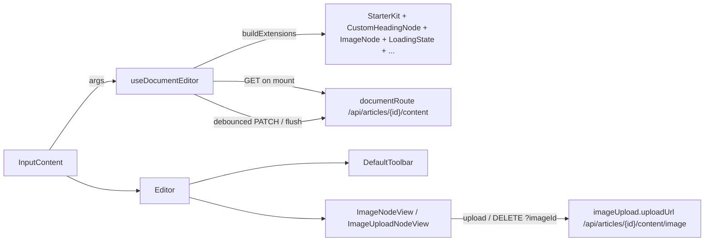

`src/components/tiptap/` is the rich-text editor used for article bodies. Import from `@/components/tiptap` — everything else in the module is internal and may change without notice. See [Tiptap Editor Core & Extensions](../../editor/tiptap-core/) for the extension architecture and lifecycle hook, and [Toolbar, Upload Registry & Editor API](../../editor/toolbar-and-api/) for the toolbar and upload registry.

**Source:** [src/components/tiptap/](https://github.com/ozeaon/ozeaon-v2/blob/0a4f1a95824db87782f1221a4108019d174df3d9/src/components/tiptap)

## Public Surface

The barrel [`index.ts`](https://github.com/ozeaon/ozeaon-v2/blob/0a4f1a95824db87782f1221a4108019d174df3d9/src/components/tiptap/index.ts) exports: `Editor`, `DefaultToolbar`, `ToolbarButton`, `ToolbarSeparator`, `useDocumentEditor`, `createIDBUploadRegistry`, `buildExtensions`, `toolbarStateSelector`, `isMarkActive`, `isNodeActive`, `canRunChain`, `renderDocumentHTML`, `getDocumentText`, and the types `UseDocumentEditorArgs`, `IDBUploadRegistry`, `ToolbarState`, `ImageUploadConfig`, `ImageMetadata`, `DocumentPayload`, `DocumentFetchResult`, `SaveResult`, `SaveTrigger`, `EditorErrorHandler`, `ErrorScope`.

## Consumer

The only call site in the app is `InputContent` ([src/components/ui/forms/hook-form/InputContent.tsx](https://github.com/ozeaon/ozeaon-v2/blob/0a4f1a95824db87782f1221a4108019d174df3d9/src/components/ui/forms/hook-form/InputContent.tsx)), the React Hook Form field used in the [article authoring](../../articles/articles-authoring/) form's `ContentSection`. `InputContent` builds an `imageUploadConfig` when `objectId` is set (5 MB per file, 50 MB total, 10 images, png/jpeg/webp, upload URL `/api/articles/{id}/content/image`) and exposes a `save(id)` method that calls `flush(id)` — forwarding the new article ID — to persist the body for a record created after the editor mounted.

## Key Design Decisions

- **`immediatelyRender: false`** — Tiptap's `useEditor` must not run on the server; this flag prevents SSR hydration mismatches.
- **`File` objects live in IndexedDB, not in node attrs** — ProseMirror state must serialize to JSON, so upload nodes carry an opaque `tempId` string; the registry resolves it to the real file and its blob preview URL.
- **`flush(routeOverride)`** — the editor mounts before a draft record is created, so `InputContent.save(id)` calls `flush` with the new article ID to save the body to the correct route.
- **Image node removal is server-gated** — deleting an image node emits `imageDeleteRequested`, which the node view intercepts and confirms with the server. The node is removed from the document only after the server DELETE succeeds.

## Gotchas

- **Heading levels are 2–4, not 1–3.** The doc comment in `BuildExtensions.ts` says levels 1–3; `CustomHeadingNode` configures `[2, 3, 4]`.
- **`parseHTML` does parse tagged images.** The `ImageNode` doc comment says `parseHTML` is empty; the code accepts `img[data-image-id]`.
- **Drop fills the node, it does not start the upload.** Dropping a file creates an upload node in the `picking` phase; the user still has to click Upload. The README says drop starts the upload.
- **`characterCount` is always `undefined`.** `toolbarStateSelector` reads `editor.storage.characterCount`, but `buildExtensions` does not register a CharacterCount extension.
- **`minLength` is not read.** The arg is declared on `UseDocumentEditorArgs` but the hook never gates saves on it; minimum length is enforced by the article schema at publish time.

## Related Links

- [Tiptap Editor Core & Extensions](../../editor/tiptap-core/)
- [Toolbar, Upload Registry & Editor API](../../editor/toolbar-and-api/)
- [UI Forms](../ui/forms/) — `InputContent` lives in `hook-form/`
- [Article Authoring & Publishing](../../articles/articles-authoring/) — the article form that uses `InputContent`
