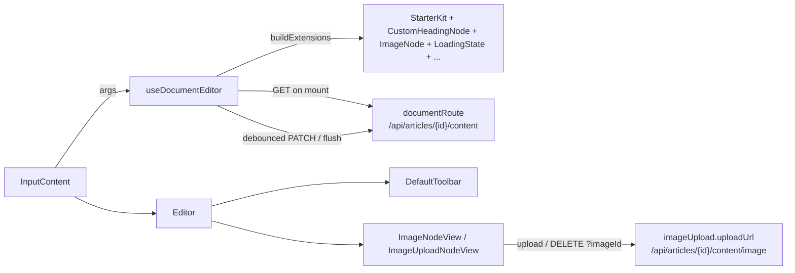

`src/components/tiptap/` is the rich-text editor used for article bodies. Its public surface is `index.ts`. The rest of the module is internal.

The model is short. `useDocumentEditor` builds the Tiptap instance and owns fetching, debounced autosave and teardown. `<Editor editor={editor} />` only renders it. The one consumer in the app is the form field `InputContent` (`src/components/ui/forms/hook-form/InputContent.tsx`), which `ContentSection` in the [article form](../articles/) uses.



The module's own `README.md` describes the intended design. Where it disagrees with the source, this page follows the source and says so.

## Barrels

- `index.ts` (public) exports:
  - components: `Editor`, `DefaultToolbar`, `ToolbarButton`, `ToolbarSeparator`
  - hooks and factories: `useDocumentEditor`, `createIDBUploadRegistry`, `buildExtensions`
  - helpers: `toolbarStateSelector`, `isMarkActive`, `isNodeActive`, `canRunChain`, `renderDocumentHTML`, `getDocumentText`
  - types: `UseDocumentEditorArgs`, `IDBUploadRegistry`, `ToolbarState`, `ImageUploadConfig`, `ImageMetadata`, `DocumentPayload`, `DocumentFetchResult`, `SaveResult`, `SaveTrigger`, `EditorErrorHandler`, `ErrorScope`
- `hooks/index.ts` exports `useDocumentEditor`, `createIDBUploadRegistry` and `createTempId`, plus the `UseDocumentEditorArgs`, `IDBUploadRegistry` and `UploadEntry` types.
- `lib/index.ts` exports:
  - API helpers: `fetchDocument`, `saveDocument`, `uploadImage`, `deleteImage`
  - render helpers: `renderDocumentHTML`, `getDocumentText`
  - validation helpers: `validateFile`, `checkBudget`, `splitNameAndExtension`
  - types: `ValidationResult` and all `lib/types.ts` types
- `toolbar/index.ts` exports `DefaultToolbar`, `ToolbarButton`, `ToolbarSeparator`, the four selectors and `ToolbarState`.

## Editor

The presentational shell. It renders a pulsing skeleton while `editor` is `null`, then the toolbar and `EditorContent` (whose height is capped by `max-h-150` with scrolling).

- **Source:** [src/components/tiptap/Editor.tsx](https://github.com/ozeaon/ozeaon-v2/blob/0a4f1a95824db87782f1221a4108019d174df3d9/src/components/tiptap/Editor.tsx)
- **Kind:** Client component (`"use client"`)
- **Used in:** `src/components/ui/forms/hook-form/InputContent.tsx`

| Prop | Type | Default | Description |
|---|---|---|---|
| `editor` | `Editor \| null` (Tiptap) | — | The instance from `useDocumentEditor`. While it is `null`, the skeleton renders. |
| `toolbar` | `ReactNode \| false` | `DefaultToolbar` | Replacement toolbar, or `false` for no toolbar. |
| `className` | `string` | — | Merged onto the bordered wrapper. |
| `fullScreenToggle` | `() => void` | — | Forwarded to `DefaultToolbar` as `toggleFullScreen`. When set, the toolbar shows a full-screen button. |

```tsx
<Editor editor={editor} className={cn(fieldState.invalid && "bg-error-surface")} />
```

## hooks/

### useDocumentEditor

Builds the Tiptap editor and runs the document lifecycle: fetch, init, autosave, teardown. It returns `Editor | null`.

- **Source:** [src/components/tiptap/hooks/use-document-editor.ts](https://github.com/ozeaon/ozeaon-v2/blob/0a4f1a95824db87782f1221a4108019d174df3d9/src/components/tiptap/hooks/use-document-editor.ts)
- **Kind:** Client hook (`"use client"`)
- **Used in:** `src/components/ui/forms/hook-form/InputContent.tsx`

| Arg | Type | Default | Description |
|---|---|---|---|
| `disabled` | `boolean` | — | Sets `editable: !disabled`. It is re-applied through `setEditable` whenever it changes. |
| `objectId` | `string` | — | Owner record id. The initial fetch and autosave run only when this is set. |
| `documentId` | `string` | — | Sent in the save body. Reserved for future revision routing. |
| `documentRoute` | `string` | — | Document endpoint, e.g. `/api/articles/{id}/content`. |
| `imageUpload` | `ImageUploadConfig` | — | Enables uploads. Must be a stable reference. |
| `debounceMs` | `number` | `30000` | Autosave debounce. A falsy value disables autosave. |
| `saveMethod` | `"POST" \| "PATCH"` | `"PATCH"` | HTTP method for saves. |
| `onSaved` | `(value: unknown) => void` | — | Called after each successful save, with the saved JSON. |
| `onLoaded` | `(value: unknown, text: string) => void` | — | Called after the initial fetch, with the JSON and plain text. |
| `onChanged` | `(value: string \| null) => void` | — | Called with the plain text on every update that changes the document. |
| `onBlur` | `React.FocusEventHandler<HTMLInputElement>` | — | Called on editor blur, but only when the text is within `maxLength`. |
| `onError` | `EditorErrorHandler` | `toast.error` | Receives document fetch and save errors. |
| `triggerRef` | `RefObject<SaveTrigger \| null>` | — | Receives `{ flush(routeOverride?) }`. |
| `placeholder` | `string` | `"Type something..."` (from `buildExtensions`) | Placeholder text. |
| `minLength` | `number` | — | Declared but not read by the hook. Minimum length is enforced by the article schema at publish time. |
| `maxLength` | `number` | — | When the trimmed text is longer than this, autosave is skipped and any pending timer is dropped. |

Notable behaviour:

- **Creation.** `useEditor` is called with `immediatelyRender: false`, which SSR requires. The editor is rebuilt when `objectId`, `documentRoute` or whether `imageUpload` is set changes.
- **Upload registry.** With `imageUpload` set, the hook creates an IndexedDB registry named `OZNArticleImagesDatabase` and passes it to `buildExtensions`.
- **Initial fetch.** `fetchDocument(documentRoute)` runs and applies the result with `setContent(json, { emitUpdate: false })`. The hook then calls `onLoaded`, not `onChanged`, so loading does not count as a user edit. A 404 is treated as an empty document.
- **Autosave.** Every update that changes the document clears the stored etag and restarts the debounce timer. Each save sends `{ documentId, json, html, etag }` and toggles the `LoadingState` command, which drives the toolbar spinner.
- **`flush(routeOverride?)`.** Clears the timer, waits for any in-flight save, then saves again. With `routeOverride` set, it saves to that route and omits the etag. This is how `InputContent.save(id)` persists a body for a record created after the editor mounted.
- **Unmount.** Clears the timer, aborts any in-flight request, and calls `registry.clear()`.

```tsx
const editor = useDocumentEditor({
  disabled: disabled || isLoading,
  objectId: objectId || undefined,
  documentId: getValues("content_file_id") ?? "",
  saveMethod: "PATCH",
  imageUpload: imageUploadConfig,
  debounceMs,
  documentRoute: `/api/articles/${objectId}/content`,
  maxLength,
  minLength,
  onSaved,
  onBlur,
  onChanged: handleChanged,
  onLoaded: handleLoaded,
  triggerRef,
  placeholder,
});
```

`InputContent` builds `imageUploadConfig` only when `objectId` is set: 5 MB per file, 50 MB in total, 10 images, png/jpeg/webp, and `uploadUrl` `/api/articles/{id}/content/image`.

### createIDBUploadRegistry / createTempId

`ProseMirror` node attrs cannot hold `File` objects. Instead, upload nodes carry a `tempId`, and the file lives in this registry: an IndexedDB object store (`uploads`) with an in-memory cache of `{ file, previewUrl }`.

- **Source:** [src/components/tiptap/hooks/upload-registry.ts](https://github.com/ozeaon/ozeaon-v2/blob/0a4f1a95824db87782f1221a4108019d174df3d9/src/components/tiptap/hooks/upload-registry.ts)
- **Kind:** Plain module (uses browser `indexedDB` and `URL.createObjectURL`)
- **Used in:** `src/components/tiptap/hooks/use-document-editor.ts`, `src/components/tiptap/extensions/plugins/ImageDropPaste.ts`, `src/components/tiptap/extensions/nodes/ImageUploadNodeView.tsx`

`createIDBUploadRegistry(dbName)` returns an `IDBUploadRegistry` with these members:

| Member | Description |
|---|---|
| `ready` | Resolves once the database is open. |
| `set(tempId, file)` | Caches the file, writes it to IndexedDB, and resolves with the blob preview URL. |
| `get(tempId)` | Returns the entry from the cache, or reads it from IndexedDB and creates a new preview URL. |
| `release(tempId)` | Revokes the preview URL and deletes the entry. |
| `clear()` | Revokes all preview URLs and clears the store. |
| `keys()` | Returns all stored temp ids. |

`createTempId()` returns `tmp_{base36 timestamp}_{base36 counter}`.

### countNonInlineBlocksDetailed

A debug helper. It counts non-inline nodes in Tiptap JSON and returns `{ total, breakdown }`. Paragraphs directly inside `listItem` are not counted.

- **Source:** [src/components/tiptap/hooks/block-counter.ts](https://github.com/ozeaon/ozeaon-v2/blob/0a4f1a95824db87782f1221a4108019d174df3d9/src/components/tiptap/hooks/block-counter.ts)
- **Kind:** Plain module
- **Used in:** `src/components/tiptap/hooks/use-document-editor.ts` (debug logging on update only)

## extensions/

### buildExtensions

Assembles the extension list for the editor and for server rendering.

- **Source:** [src/components/tiptap/extensions/BuildExtensions.ts](https://github.com/ozeaon/ozeaon-v2/blob/0a4f1a95824db87782f1221a4108019d174df3d9/src/components/tiptap/extensions/BuildExtensions.ts)
- **Kind:** Plain module
- **Used in:** `src/components/tiptap/hooks/use-document-editor.ts`, `src/components/tiptap/lib/render.ts`

| Arg | Type | Default | Description |
|---|---|---|---|
| `imageUpload` | `{ config: ImageUploadConfig; registry: IDBUploadRegistry } \| "render" \| null` | — | Pass an object for editor mode with uploads, `"render"` for read-only or server rendering, or `null` for editor mode without uploads. |
| `placeholder` | `string` | `"Type something..."` | Text for the `Placeholder` extension (`showOnlyCurrent: true`). |

Notable behaviour:

- **Always registered:**
  - `StarterKit`, with `heading`, `underline`, `code`, `codeBlock`, `horizontalRule` and `trailingNode` disabled, and a 1px dropcursor in `var(--text-primary)`
  - `CustomHeadingNode`
  - `Underline`
  - `TextAlign`, applied to `heading` and `paragraph` only
  - `ImageNode`
  - `LoadingState`
  - `Placeholder`
- **Only when an upload object is passed:** `ImageUploadNode` and `ImageDropPaste`.
- **Heading levels.** The doc comment says levels are limited to 1–3, but `CustomHeadingNode` actually configures levels 2, 3 and 4.

### CustomHeadingNode

Extends `@tiptap/extension-heading` with levels `[2, 3, 4]`. Each heading renders with the design-system class `font-h{level}`. A heading with an unsupported level renders as the first allowed level (`h2`).

- **Source:** [src/components/tiptap/extensions/nodes/CustomHeadingNode.ts](https://github.com/ozeaon/ozeaon-v2/blob/0a4f1a95824db87782f1221a4108019d174df3d9/src/components/tiptap/extensions/nodes/CustomHeadingNode.ts)
- **Kind:** Tiptap node
- **Used in:** `src/components/tiptap/extensions/BuildExtensions.ts`

### ImageNode

The saved image node (`name: "image"`). It is an atomic, draggable, isolating, selectable block, rendered through `ImageNodeView` inside a `<figure>`.

- **Source:** [src/components/tiptap/extensions/nodes/ImageNode.ts](https://github.com/ozeaon/ozeaon-v2/blob/0a4f1a95824db87782f1221a4108019d174df3d9/src/components/tiptap/extensions/nodes/ImageNode.ts)
- **Kind:** Tiptap node
- **Used in:** `src/components/tiptap/extensions/BuildExtensions.ts`

Attributes (`ImageAttrs`):

| Attribute | Type | Description |
|---|---|---|
| `imageId` | `string` | Server image id. |
| `src` | `string` | Image URL. |
| `name` | `string` | Display file name. |
| `extension` | `string` | File extension. |
| `size` | `number` | Size in bytes. Used for the document-wide budget. |
| `naturalWidth` | `number` | Intrinsic width. |
| `naturalHeight` | `number` | Intrinsic height. |
| `width` | `number \| null` | Display width. Resizing changes only `width` and `height`. |
| `height` | `number \| null` | Display height. |
| `alt` | `string \| null` | Alt text. Falls back to `name`. |

Notable behaviour:

- **HTML output.** `renderHTML` emits ``. `parseHTML` accepts only `img[data-image-id]`. The doc comment says `parseHTML` is empty; the code does parse tagged images.
- **Command.** `insertImage(attrs)`.
- **Keyboard deletion.** Backspace and Delete are intercepted in three cases: when the image is selected, Backspace with the cursor directly after it, and Delete with the cursor directly before it. Instead of deleting the node, the editor emits `imageDeleteRequested { imageId }`, which the node view turns into its confirmation overlay.

### ImageNodeView

The React node view for `ImageNode`. It renders the image, a delete button while selected, drag-resize handles, and a confirm/deleting overlay.

- **Source:** [src/components/tiptap/extensions/nodes/ImageNodeView.tsx](https://github.com/ozeaon/ozeaon-v2/blob/0a4f1a95824db87782f1221a4108019d174df3d9/src/components/tiptap/extensions/nodes/ImageNodeView.tsx)
- **Kind:** Client component (`"use client"`). It receives Tiptap `NodeViewProps`.
- **Used in:** `src/components/tiptap/extensions/nodes/ImageNode.ts` (`ReactNodeViewRenderer`)

Notable behaviour:

- **Deletion.** Confirming calls `deleteImage(config.uploadUrl, imageId)`. The node is removed only after the server succeeds; on failure a toast shows. `config` is read from `editor.storage.imageDropPaste`, which exists only when uploads are enabled.
- **Resizing.** Resizing keeps the aspect ratio. Width is clamped between 150px and `min(naturalWidth, container width)`. The new width is committed once, on `pointerup`, so each resize is a single undo step.
- **Container width.** A `ResizeObserver` tracks the parent width.
- **Read-only.** When the editor is not editable, the wrapper gets `pointer-events-none`.

### ImageUploadNode

A transient upload block (`name: "imageUpload"`). It is not atomic, not draggable, and is never parsed from HTML. If one leaks into saved HTML, it renders as `<div data-image-upload="true">`.

- **Source:** [src/components/tiptap/extensions/nodes/ImageUploadNode.ts](https://github.com/ozeaon/ozeaon-v2/blob/0a4f1a95824db87782f1221a4108019d174df3d9/src/components/tiptap/extensions/nodes/ImageUploadNode.ts)
- **Kind:** Tiptap node
- **Used in:** `src/components/tiptap/extensions/BuildExtensions.ts`

| Attribute | Type | Description |
|---|---|---|
| `tempId` | `string` | Upload registry key. Not rendered. |
| `hasFile` | `boolean` | Whether a file was attached at insert time. Not rendered. |

Commands:

- `insertImageUploadEmpty()` is used by the toolbar's "Add image" button.
- `insertImageUploadWithFile(tempId)` is used by drop and paste.

### ImageUploadNodeView

The React node view for `ImageUploadNode`. It moves through four phases: `picking` (dropzone or file picker), `editing` (preview plus an editable file name), `uploading`, and `error`.

- **Source:** [src/components/tiptap/extensions/nodes/ImageUploadNodeView.tsx](https://github.com/ozeaon/ozeaon-v2/blob/0a4f1a95824db87782f1221a4108019d174df3d9/src/components/tiptap/extensions/nodes/ImageUploadNodeView.tsx)
- **Kind:** Client component (`"use client"`). It receives Tiptap `NodeViewProps`.
- **Used in:** `src/components/tiptap/extensions/nodes/ImageUploadNode.ts` (`ReactNodeViewRenderer`)

Notable behaviour:

- **Setup.** Reads `config` and `registry` from `editor.storage.imageDropPaste`. Without a config it shows "Image uploads are not configured."
- **Missing file.** If the node has a `tempId` but the registry has no entry for it (for example after a reload), the node removes itself.
- **Picking a file.** Each file is checked with `validateFile`.
- **Uploading.** Nothing uploads until the user clicks Upload. The node first checks `checkBudget` against the current document, then calls `uploadImage(uploadUrl, file, "{name}.{ext}")`. The README says a drop starts the upload; in the code, a drop only fills in the node.
- **Success.** The upload node is replaced by an `image` node in one chain, and the temp entry is released.
- **Moderation rejection.** Shows an inline error with a report link (`MODERATION_REPORT_URL`) and opens `ModerationRejectedDialog`. The button changes to "Retry".
- **Cancel.** Releases the temp entry, aborts the upload, and deletes the node.

### ImageDropPaste

An extension (`name: "imageDropPaste"`) that adds a ProseMirror plugin to intercept dropped and pasted image files. It also stores `{ config, registry }` in `editor.storage.imageDropPaste` for the node views.

- **Source:** [src/components/tiptap/extensions/plugins/ImageDropPaste.ts](https://github.com/ozeaon/ozeaon-v2/blob/0a4f1a95824db87782f1221a4108019d174df3d9/src/components/tiptap/extensions/plugins/ImageDropPaste.ts)
- **Kind:** Tiptap extension
- **Used in:** `src/components/tiptap/extensions/BuildExtensions.ts`

| Option | Type | Default | Description |
|---|---|---|---|
| `config` | `ImageUploadConfig \| null` | `null` | Upload config. When it is `null`, no plugin is registered. |
| `registry` | `IDBUploadRegistry \| null` | `null` | Temp-file registry. |

Notable behaviour:

- Only the first file is handled.
- The file goes through `validateFile` and `checkBudget`; a failure shows a toast and the event is consumed.
- On success, the file is registered and `insertImageUploadWithFile(tempId)` runs.
- Pasting HTML that contains ` void` | — | When set, shows the "Toggle FullScreen" button. |

Notable behaviour:

- **State.** One `useEditorState({ selector: toolbarStateSelector })` subscription drives the active and disabled state of every button. The internal `HeadingDropdown` and `AlignDropdown` each subscribe as well.
- **"Add image".** Shown only when the editor can run `insertImageUploadEmpty`, which means uploads are enabled.
- **Undo and redo.** These buttons pass `canUndo` / `canRedo` as their `active` value.

### ToolbarButton / ToolbarSeparator

`ToolbarButton` is a shadcn `Button` styled for the toolbar. It sets `aria-label` and `title` from `label`, and `aria-pressed` from `active`. `ToolbarSeparator` is a 1px vertical divider and takes no props.

- **Source:** [src/components/tiptap/toolbar/ToolbarButton.tsx](https://github.com/ozeaon/ozeaon-v2/blob/0a4f1a95824db87782f1221a4108019d174df3d9/src/components/tiptap/toolbar/ToolbarButton.tsx)
- **Kind:** Client component (`"use client"`)
- **Used in:** `src/components/tiptap/toolbar/Toolbar.tsx`

| Prop | Type | Default | Description |
|---|---|---|---|
| `label` | `string` | — | Accessible label and tooltip title. |
| `children` | `ReactNode` | — | Usually an icon. |
| `active` | `boolean` | — | Active styling and `aria-pressed`. |
| `disabled` | `boolean` | — | Disables the button. |
| `onClick` | `(e?: MouseEvent) => void` | — | Click handler. |
| `onMouseDown` | `(e: MouseEvent) => void` | — | Mouse-down handler. |
| `asChild` | `boolean` | — | Radix `asChild`. Used to wrap a `DropdownMenuTrigger`. |
| `className` | `string` | `"min-w-7"` | Extra classes. Passing a value replaces the default. |

```tsx
<ToolbarButton
  onClick={() => chain().toggleBold().run()}
  active={state.bold}
  disabled={!state.canBold}
  label="Bold"
>
  <BoldIcon />
</ToolbarButton>
```

### Selectors

Functions for `useEditorState` that return primitives, so shallow equality can skip re-renders.

- **Source:** [src/components/tiptap/toolbar/selectors.ts](https://github.com/ozeaon/ozeaon-v2/blob/0a4f1a95824db87782f1221a4108019d174df3d9/src/components/tiptap/toolbar/selectors.ts)
- **Kind:** Plain module
- **Used in:** `src/components/tiptap/toolbar/Toolbar.tsx`

| Export | Description |
|---|---|
| `isMarkActive(mark)` | Selector for `editor.isActive(mark)`. |
| `isNodeActive(node, attrs?)` | Selector for `editor.isActive(node, attrs)`. |
| `canRunChain(fn)` | Runs `fn(editor.can().chain().focus())` and returns `false` if it throws. |
| `toolbarStateSelector` | Collects everything the toolbar needs: undo and redo availability, active marks and nodes (including `h2`, `h3`, `h4` and the alignments), can-run flags for each command, `imagesEnable`, and `characterCount`. |
| `ToolbarState` | Type: the return type of `toolbarStateSelector`. |

`characterCount` reads `editor.storage.characterCount`, but `buildExtensions` does not register a CharacterCount extension, so the value is `undefined`.

## lib/

### api

The fetch helpers used by the hook and the node views.

- **Source:** [src/components/tiptap/lib/api.ts](https://github.com/ozeaon/ozeaon-v2/blob/0a4f1a95824db87782f1221a4108019d174df3d9/src/components/tiptap/lib/api.ts)
- **Kind:** Plain module
- **Used in:** `src/components/tiptap/hooks/use-document-editor.ts`, `src/components/tiptap/extensions/nodes/ImageNodeView.tsx`, `src/components/tiptap/extensions/nodes/ImageUploadNodeView.tsx`

| Function | Request | Returns |
|---|---|---|
| `fetchDocument(route, signal?)` | `GET route` | `DocumentFetchResult` (`{ json, etag, imageIds? }`) |
| `saveDocument(route, documentId, payload, method = "PATCH", signal?)` | `POST`/`PATCH route` with JSON `{ documentId, json, html, etag? }` | `SaveResult` (`{ etag?, skipped? }`) |
| `uploadImage(uploadUrl, file, displayName, signal?)` | `uploadModeratedImage` with field `name` | `ModeratedUploadResult<ImageMetadata>` (`uploaded` / `rejected` / failed) |
| `deleteImage(uploadUrl, imageId, signal?)` | `DELETE uploadUrl?imageId=` | `void` |

Every helper except `uploadImage` throws `ApiError.fromResponse(res)` when the response is not OK.

### render

Builds HTML or plain text from stored JSON, using `buildExtensions({ imageUpload: "render" })`.

- **Source:** [src/components/tiptap/lib/render.ts](https://github.com/ozeaon/ozeaon-v2/blob/0a4f1a95824db87782f1221a4108019d174df3d9/src/components/tiptap/lib/render.ts)
- **Kind:** Plain module (safe to run on the server)
- **Used in:** `src/app/api/articles/route.ts` (`getDocumentText`). No call sites for `renderDocumentHTML` outside the module were found.

| Function | Description |
|---|---|
| `renderDocumentHTML(json)` | `generateHTML(json, extensions)`. |
| `getDocumentText(json)` | `generateText(json, extensions)`. |

### validation

Client-side upload checks.

- **Source:** [src/components/tiptap/lib/validation.ts](https://github.com/ozeaon/ozeaon-v2/blob/0a4f1a95824db87782f1221a4108019d174df3d9/src/components/tiptap/lib/validation.ts)
- **Kind:** Plain module
- **Used in:** `src/components/tiptap/extensions/plugins/ImageDropPaste.ts`, `src/components/tiptap/extensions/nodes/ImageUploadNodeView.tsx`

| Function | Description |
|---|---|
| `validateFile(file, config)` | Checks the MIME type against `config.mimeTypes` and the size against `maxFileSize`. |
| `checkBudget(json, incomingFile, config)` | Walks the document's `image` nodes. Fails when the count plus one would exceed `maxUploads`, or when the summed `size` plus the new file would exceed `maxTotalSize`. |
| `splitNameAndExtension(filename)` | Splits on the last dot and returns `{ base, ext }`, with `ext` lower-cased. |

All three checks return `ValidationResult`: `{ ok: true }` or `{ ok: false, message }`.

### types

- **Source:** [src/components/tiptap/lib/types.ts](https://github.com/ozeaon/ozeaon-v2/blob/0a4f1a95824db87782f1221a4108019d174df3d9/src/components/tiptap/lib/types.ts)

| Type | Shape |
|---|---|
| `ImageMetadata` | `{ imageId, url, name, extension, size, width, height, alt }`, the upload response. |
| `ImageUploadConfig` | `{ uploadUrl, maxFileSize, maxTotalSize, maxUploads, mimeTypes }`. `DELETE` uses `uploadUrl?imageId=`. |
| `ErrorScope` | `"document" \| "image"`. |
| `EditorErrorHandler` | `(err: { scope, message, description? }) => void`. |
| `DocumentPayload` | `{ json, html, etag? }`. |
| `SaveResult` | `{ etag?, skipped? }`. |
| `SaveTrigger` | `{ flush(routeOverride?: string): Promise<void> }`. |
| `DocumentFetchResult` | `{ json, etag, imageIds? }`. |
