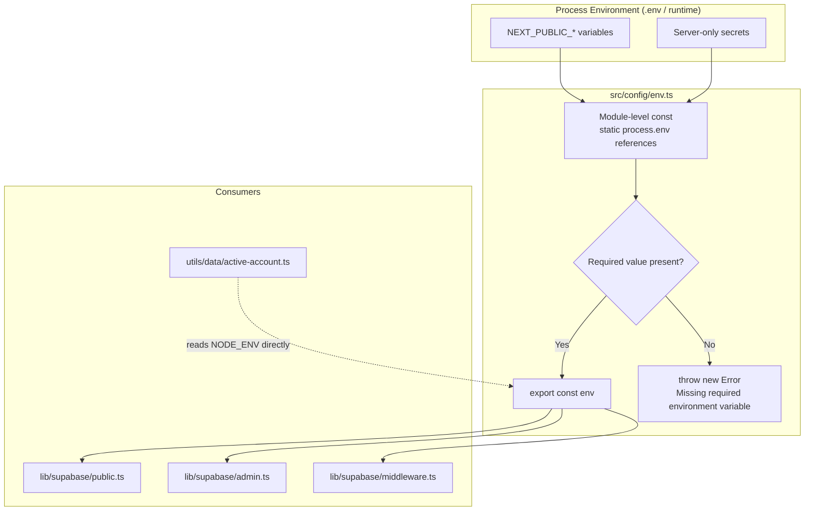
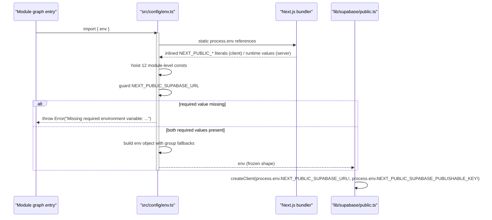

Centralized, type-safe access to environment variables and shared constants for the ozeaon-v2 Next.js application. This page documents `src/config/env.ts` — the single module every other layer reads runtime configuration from — the `src/config` and `src/config/constants` barrels, and the constant modules that encode upload limits, feed sizes, navigation, metadata, and domain-specific invariants.

## Purpose and Scope

This page covers:

- `src/config/env.ts` — the environment-variable aggregation module, its static-reference pattern, its fail-fast validation, and the exact shape of the exported `env` object.
- The rationale for the `NEXT_PUBLIC_` naming split between browser-visible and server-only secrets.
- `src/components/ui/layout/constants.ts` — shared layout/measurement constants that act as compile-time configuration for the reader and feed grids.
- `src/config/index.ts` and `src/config/constants/index.ts` — the two barrels that make `@/config` the single import path.
- The application constant modules under `src/config/constants/` (`feeds`, `posts`, `password`, `privacy`, `image`, `documents`, `attachments`, `categories`, `metadata`, `navigation`, `articles`) — every exported constant, its value, and its consumers.
- The two root helpers beside `env.ts`: `src/config/connectionConfig.ts` (connection-request timing) and `src/config/reaction-types.ts` (cached reaction-type lookup).
- How the `env` module is consumed downstream (Supabase clients, middleware, cookie security flags).

Intentionally **left to sibling pages**:

- **Logging configuration** (`src/lib/logger/config.ts`, `clientLoggingConfig`, `src/instrumentation.ts`, `src/instrumentation-client.ts`) — the LogTape setup pipeline is a separate concern; only its relationship to configuration loading is referenced here.
- **Build and deployment configuration** (`next.config.ts`, `open-next.config.ts`) — Next.js/OpenNext build wiring and headers/CSP derivation belong to the build & deployment page.
- **Supabase client construction and auth flows** — only the configuration inputs they consume are described here.

## Overview

Next.js applications traditionally scatter `process.env.X` reads across server actions, route handlers, and components. That approach is hard to audit: nothing tells you whether a variable is required, what its fallback is, or whether it is safe to read from the browser.

The ozeaon-v2 repository resolves this by funneling **every** environment read through one module, `src/config/env.ts`. The module is deliberately simple and its design encodes three separate invariants:

1. **Static reference for inlining.** Next.js performs dead-code elimination and text substitution on `process.env.NEXT_PUBLIC_*` only when the reference is statically analyzable. Destructuring `process.env` or using computed keys (`process.env[name]`) breaks that substitution. The module therefore hoists each variable into a module-level `const` with a literal, dotted access path.
2. **Fail-fast on required values.** Variables with no sane default below which the app cannot function (`NEXT_PUBLIC_SUPABASE_URL`, `NEXT_PUBLIC_SUPABASE_PUBLISHABLE_KEY`) throw at module-evaluation time rather than producing confusing downstream runtime failures.
3. **Explicit optionality.** Every non-required variable is coerced with a fallback (`|| ""`, or a concrete default), so the exported object has a stable, non-`undefined` shape that callers can use without null checks.

Key terminology used below:

| Term | Meaning in this codebase |
| --- | --- |
| `NEXT_PUBLIC_` prefix | Variable is substituted into the browser bundle at build time; treat as public. |
| Server-only variable | Variable without the prefix; must only be read in server runtime paths. |
| Fail-fast guard | Top-level `if (!X) throw` executed at import time. |
| Static reference | Module-level `const X = process.env.X` that preserves Next.js inlining. |

## Architecture

The configuration layer sits beneath every runtime layer. Both server-only and browser paths import the same module, but only the `NEXT_PUBLIC_`-derived fields survive into the client bundle.



The diagram shows the two-input boundary (public vs. secret variables), the guard stage, and the four known consumers. `src/lib/supabase/admin.ts`, `src/lib/supabase/middleware.ts`, and `src/lib/supabase/public.ts` all read `process.env` values for URL and key directly, while `src/utils/data/active-account.ts` reads `NODE_ENV` directly for cookie security — both patterns coexist with the centralized `env` object, which is worth noting as a consistency caveat.

> Source: [env.ts](https://github.com/ozeaon/ozeaon-v2/blob/0a4f1a95824db87782f1221a4108019d174df3d9/src/config/env.ts)

## Main Content

### The Static Reference Block and Why It Exists

The module opens with a single comment stating the design contract, then hoists twelve variables into module-scope constants.

```typescript
// Env access with static references so Next.js can inline the NEXT_PUBLIC_ values at build time.
// Server secrets live here too - they stay server-only because nothing without a NEXT_PUBLIC_
// prefix is exposed to the browser bundle. Never read one of them from a client component.
const SUPABASE_URL = process.env.NEXT_PUBLIC_SUPABASE_URL;
const SUPABASE_PUBLISHABLE_KEY =
  process.env.NEXT_PUBLIC_SUPABASE_PUBLISHABLE_KEY;
const GOOGLE_CLIENT_ID = process.env.NEXT_PUBLIC_GOOGLE_CLIENT_ID;
const BASE_URL = process.env.NEXT_PUBLIC_BASE_URL;
const STORAGE_URL = process.env.NEXT_PUBLIC_STORAGE_URL;
const RESEND_API_KEY = process.env.RESEND_API_KEY;
const RESEND_SENDER_EMAIL = process.env.RESEND_SENDER_EMAIL;
const MAILCHIMP_API_KEY = process.env.MAILCHIMP_API_KEY;
const MAILCHIMP_AUDIENCE_ID = process.env.MAILCHIMP_AUDIENCE_ID;
const ACCESS_TOKEN = process.env.ACCESS_TOKEN;
const OPENAI_API_KEY = process.env.OPENAI_API_KEY;
const FEATURE_NOTIFICATIONS = process.env.NEXT_PUBLIC_FEATURE_NOTIFICATIONS;
```

> Source: [env.ts](https://github.com/ozeaon/ozeaon-v2/blob/0a4f1a95824db87782f1221a4108019d174df3d9/src/config/env.ts#L1-L16)

Design intent: `process.env.NEXT_PUBLIC_SUPABASE_URL` written as a literal dotted member expression is the only form the Next.js compiler can statically replace with a string literal in the browser bundle. Writing `const { NEXT_PUBLIC_SUPABASE_URL } = process.env;` would compile but silently produce `undefined` in client code — a class of bug that is very hard to diagnose. Hoisting into `const`s also gives every downstream reference a single source of truth and one place to change.

### Fail-Fast Validation of Required Variables

Only two variables are treated as hard requirements, guarded immediately after the hoist block:

```typescript
if (!SUPABASE_URL) {
  throw new Error(
    "Missing required environment variable: NEXT_PUBLIC_SUPABASE_URL",
  );
}
if (!SUPABASE_PUBLISHABLE_KEY) {
  throw new Error(
    "Missing required environment variable: NEXT_PUBLIC_SUPABASE_PUBLISHABLE_KEY",
  );
}
```

> Source: [env.ts](https://github.com/ozeaon/ozeaon-v2/blob/0a4f1a95824db87782f1221a4108019d174df3d9/src/config/env.ts#L18-L27)

These two are required because Supabase is the data and authentication backbone: without a URL and publishable key, no client can be constructed and essentially no page can render. Throwing at module-evaluation time converts a silent misconfiguration into an immediate, named failure — the error message contains the exact variable name, so the fix is unambiguous.

Note that this guard runs wherever the module is first imported. Because the checks reference `SUPABASE_URL` (already narrowed to `string` by the `if (!...) throw`), the subsequent object literal can assign `url: SUPABASE_URL` without a non-null assertion or type cast.

### The Exported `env` Object: Grouping and Fallbacks

```typescript
export const env = {
  supabase: {
    url: SUPABASE_URL,
    pubKey: SUPABASE_PUBLISHABLE_KEY,
  },
  resend: {
    apiKey: RESEND_API_KEY || "",
    email: RESEND_SENDER_EMAIL || "",
  },
  mailchimp: {
    apiKey: MAILCHIMP_API_KEY || "",
    audienceId: MAILCHIMP_AUDIENCE_ID || "",
  },
  openai: {
    apiKey: OPENAI_API_KEY || "",
  },
  google: {
    clientId: GOOGLE_CLIENT_ID || "",
  },
  features: {
    // Short-lived release toggle, removed with the last notifications ticket.
    // Optional and off when absent, so builds that never set it still pass.
    notifications: FEATURE_NOTIFICATIONS === "true",
  },
  accessToken: ACCESS_TOKEN || "",
  baseUrl: BASE_URL || "http://localhost:3000",
  storageUrl: STORAGE_URL,
  isDevelopment: process.env.NODE_ENV === "development",
  isProduction: process.env.NODE_ENV === "production",
};
```

> Source: [env.ts](https://github.com/ozeaon/ozeaon-v2/blob/0a4f1a95824db87782f1221a4108019d174df3d9/src/config/env.ts#L29-L58)

The object is organized into two tiers:

**Vendor-namespaced groups** (`supabase`, `resend`, `mailchimp`, `openai`, `google`) mirror the third-party integrations. This makes call sites read naturally (`env.resend.apiKey`) and groups credentials that routinely change together.

**Flat application-level fields** (`accessToken`, `baseUrl`, `storageUrl`, `features`, `isDevelopment`, `isProduction`) cover concerns that are not tied to a vendor.

Fallback policy is deliberate and worth internalizing when adding new variables:

| Pattern | Applied to | Consequence |
| --- | --- | --- |
| Hard guard (`throw`) | `supabase.url`, `supabase.pubKey` | App refuses to start without it. |
| `\|\| ""` empty-string fallback | `resend.*`, `mailchimp.*`, `openai.apiKey`, `google.clientId`, `accessToken` | Shape is always `string`; feature degrades when unset. |
| Explicit literal default | `baseUrl` → `"http://localhost:3000"` | Local development works with zero configuration. |
| Strict `=== "true"` comparison | `features.notifications` | Anything other than the exact string `"true"` (including unset) is `false`. |
| Derived boolean | `isDevelopment`, `isProduction` | Read from `NODE_ENV`; both can be `false` (e.g. in test). |

The `features.notifications` comment records a decision that is easy to lose track of: it is an intentionally **short-lived release toggle** that should be deleted along with the last notifications ticket. Its `=== "true"` comparison means the toggle is off by default, so CI builds that never define `NEXT_PUBLIC_FEATURE_NOTIFICATIONS` still succeed.

`storageUrl` is the one exported field with **no** fallback — it is assigned the raw `STORAGE_URL` value, so its type is `string | undefined`. Consumers must handle the absent case themselves. This is a deliberate inconsistency worth flagging for anyone adding typed access to it.

### Section-by-Section Field Reference

| Path | Source variable | Fallback | Notes |
| --- | --- | --- | --- |
| `env.supabase.url` | `NEXT_PUBLIC_SUPABASE_URL` | required (throws) | Browser-visible Supabase project URL. |
| `env.supabase.pubKey` | `NEXT_PUBLIC_SUPABASE_PUBLISHABLE_KEY` | required (throws) | Publishable (anon) key; safe in the browser. |
| `env.resend.apiKey` | `RESEND_API_KEY` | `""` | Server-only email provider credential. |
| `env.resend.email` | `RESEND_SENDER_EMAIL` | `""` | From-address for outgoing mail. |
| `env.mailchimp.apiKey` | `MAILCHIMP_API_KEY` | `""` | Server-only marketing credential. |
| `env.mailchimp.audienceId` | `MAILCHIMP_AUDIENCE_ID` | `""` | Target list/audience identifier. |
| `env.openai.apiKey` | `OPENAI_API_KEY` | `""` | Server-only AI provider credential. |
| `env.google.clientId` | `NEXT_PUBLIC_GOOGLE_CLIENT_ID` | `""` | Public OAuth client id for Google sign-in. |
| `env.features.notifications` | `NEXT_PUBLIC_FEATURE_NOTIFICATIONS` | `"true"` → `false` | Release toggle, off unless explicitly `"true"`. |
| `env.accessToken` | `ACCESS_TOKEN` | `""` | Server-only internal/session token. |
| `env.baseUrl` | `NEXT_PUBLIC_BASE_URL` | `"http://localhost:3000"` | Canonical origin; used for absolute links. |
| `env.storageUrl` | `NEXT_PUBLIC_STORAGE_URL` | none (`string \| undefined`) | Asset/object storage origin. |
| `env.isDevelopment` | `NODE_ENV` | derived | `true` only when `NODE_ENV === "development"`. |
| `env.isProduction` | `NODE_ENV` | derived | `true` only when `NODE_ENV === "production"`. |

### Layout Constants: Compile-Time Design Tokens

`src/components/ui/layout/constants.ts` holds the layout invariants shared by the reader and feed grids. These are Tailwind class fragments exported as constants so that multiple components cannot drift apart.

```typescript
/** Reading-measure cap for the content column, shared by the reader and feed grids. */
export const CONTENT_MAX_WIDTH_CLASS = "max-w-[1048px]";

/**
 * Horizontal gutter between the 232px nav rail (and the reader's 232px entity
 * rail, where present) and the content column. Measured rail-box to
 * content-box; each rail supplies its own 24px inner padding on top.
 */
export const CONTENT_GUTTER_CLASS = "px-4 md:px-11";

/**
 * Sticky offset for side rails: below the 3.5rem topbar, capped so the rail
 * never runs under the 3.5rem footer. `ASIDE` pairs with `h-fit` content that
 * scrolls only when it overflows; `NAV` claims the full remaining height.
 */
export const STICKY_ASIDE_CLASS =
  "sticky top-14 z-10 max-h-[calc(100svh-7rem)]";
export const STICKY_NAV_CLASS = "sticky top-14 z-10 h-[calc(100svh-7rem)]";
```

> Source: [constants.ts](https://github.com/ozeaon/ozeaon-v2/blob/0a4f1a95824db87782f1221a4108019d174df3d9/src/components/ui/layout/constants.ts#L1-L18)

These constants document real geometry constraints that are otherwise invisible:

- **`CONTENT_MAX_WIDTH_CLASS`** (`max-w-[1048px]`) is the reading-measure cap. Because the feed grid uses the same constant, a feed card and a reader paragraph always align to the same column — a shared-constant guarantee rather than a duplicated magic number.
- **`CONTENT_GUTTER_CLASS`** (`px-4 md:px-11`) encodes a two-breakpoint gutter (mobile vs. the 232px rail layout at `md` and above) and the measured relationship to the 232px nav rail and 232px entity rail.
- **`STICKY_ASIDE_CLASS`** vs. **`STICKY_NAV_CLASS`** differ only in their height rule: `max-h-…` for `h-fit` content that scrolls only on overflow (sidebars), versus `h-…` for a rail that claims the full remaining height (navigation). Both share `top-14` (below the `3.5rem` topbar) and the `calc(100svh - 7rem)` cap that reserves `3.5rem` for the footer, and both pin `z-10`.

Using `svh` (small viewport height) instead of `vh` keeps the rail correctly sized on mobile browsers where the dynamic toolbar changes the viewport height.

### The `src/config` Barrel

`src/config/index.ts` is the entry point for the whole layer — two re-exports that make `@/config` the single import path for configuration:

```typescript
export { env } from "./env";
export * from "./constants";
```

> Source: [index.ts](https://github.com/ozeaon/ozeaon-v2/blob/0a4f1a95824db87782f1221a4108019d174df3d9/src/config/index.ts)

Most consumers import through this barrel (`components/nav/DashboardSidebar.tsx` takes `DASHBOARD_NAV_ITEMS`, `components/ui/forms/AvatarUpload.tsx` takes `IMAGE_CONFIG`/`IMAGE_ERROR_MESSAGES`, `types/shared.ts` takes the `ContentVisibility` type). Three constant modules sit outside it and are imported by direct path instead: `src/config/constants/articles.ts`, `src/config/constants/organizations.ts`, and `src/config/constants/profile.ts`, plus the two root modules documented below.

### `src/config/constants/index.ts` — The Constants Barrel

The constants barrel re-exports every shared constant module except the three direct-path ones named above:

| Re-exported module | Exported names |
| --- | --- |
| `feeds.ts` | `FEED_PAGE_LIMIT`, `SEARCH_PAGE_LIMIT`, `SEARCH_MIN_QUERY_LENGTH`, `SEARCH_AUTHOR_MATCH_CAP` |
| `comments.ts` | `COMMENT_MAX_LENGTH`, `COMMENT_BATCH_SIZE`, `REPLY_FOLD_THRESHOLD`, `REPLY_EXPANDED_LIMIT`, `MAX_COMMENT_LIMIT` |
| `categories.ts` | `CATEGORY_DOT_COLORS`, `CATEGORY_CHIP_BORDER`, `CATEGORY_CHIP_BORDER_DARK` |
| `documents.ts` | `DOCUMENT_CONFIG`, `DOCUMENT_ERROR_MESSAGES` |
| `image.ts` | `IMAGE_CONFIG`, `IMAGE_ERROR_MESSAGES`, `MAX_IMAGES_PER_POST` |
| `password.ts` | `PASSWORD_REQUIREMENTS`, `validatePassword`, `checkPasswordStrength` |
| `privacy.ts` | `VISIBILITY_OPTIONS`, type `ContentVisibility` |
| `postgres.ts` | `PG_ERROR_CODES` |
| `metadata.ts` | `NO_INDEX_ROBOTS`, `AUTHOR_OZEAON` |
| `projects.ts` | `PROJECT_STATUS_FILTERS`, `PROJECT_STATUS_FILTER_TABS`, `isProjectStatusFilter`, type `ProjectStatusFilter` |
| `attachments.ts` | `EDIT_GRACE_DAYS`, `ATTACHMENT_MIME`, `ATTACHMENT_EXTENSIONS`, `ATTACHMENT_LIMITS`, `ATTACHMENT_STORAGE_PREFIX` |
| `moderation.ts` | `MODERATION_REPORT_URL`, `MODERATION_MODEL`, `MODERATION_TIMEOUT_MS`, `MODERATION_RETRY_DELAY_MS` |
| `posts.ts` | `MAX_MESSAGE_LENGTH` |
| `notifications.ts` | `NOTIFICATION_BATCH_SIZE`, `NOTIFICATION_REREAD_DEBOUNCE_MS` |
| `navigation.ts` | `DASHBOARD_NAV_ITEMS`, type `DashboardNavItem` |

> Source: [index.ts](https://github.com/ozeaon/ozeaon-v2/blob/0a4f1a95824db87782f1221a4108019d174df3d9/src/config/constants/index.ts)

The barrel covers functions as well as constants (`validatePassword`, `checkPasswordStrength`, `isProjectStatusFilter`), so `@/config` is a mixed surface. The sibling modules it omits (`articles.ts`, `organizations.ts`, `profile.ts`) are all consumed only through their validation-adjacent call sites, which import `@/config/constants/<name>` directly.

### `src/config/connectionConfig.ts` — Connection Request Timing

Encodes the two timing windows for the user-to-user connection request flow, in minutes, plus the two helpers that turn them into timestamp strings.

| Constant | Value | Purpose |
| --- | --- | --- |
| `CONNECTION_CONFIG` | `{ request: { expirationMinutes: 30, cancelCooldownMinutes: 30 } }` (`as const`) | Pending connection requests expire after 30 minutes; a cancelled requester must wait 30 minutes before re-requesting. |
| `getConnectionRequestExpiration` | `() => string` (ISO timestamp) | `Date.now() + expirationMinutes`; written to `expires_at` when a request is created. |
| `getConnectionRequestCooldownEnd` | `() => string` (ISO timestamp) | `Date.now() + cancelCooldownMinutes`; written to `cooldown_until` when a request is cancelled. |

Both helpers are evaluated at call time (not module load), so each request gets its own deadline. The single consumer is `lib/supabase/queries/profile.ts`, which writes `expires_at` on request creation and `cooldown_until` on cancellation.

> Source: [connectionConfig.ts](https://github.com/ozeaon/ozeaon-v2/blob/0a4f1a95824db87782f1221a4108019d174df3d9/src/config/connectionConfig.ts)

### `src/config/reaction-types.ts` — Cached Reaction-Type Lookup

Despite living in `src/config`, this module exports a function, not a constant: `getReactionTypeId(slug, supabase): Promise<string | undefined>`. It resolves a reaction slug (e.g. a post like) to its `reaction_types.id` using a module-level cache:

```typescript
let cache: Record<string, string> | null = null;

export async function getReactionTypeId(
  slug: string,
  supabase: SupabaseClient,
): Promise<string | undefined> {
  if (!cache) {
    const { data } = await supabase.from("reaction_types").select("id, slug");
    cache = Object.fromEntries((data ?? []).map((r) => [r.slug, r.id]));
  }
  return cache![slug];
}
```

> Source: [reaction-types.ts](https://github.com/ozeaon/ozeaon-v2/blob/0a4f1a95824db87782f1221a4108019d174df3d9/src/config/reaction-types.ts)

The first call in a process fetches the whole `reaction_types` table (`id`, `slug`) and builds a `slug → id` record; every later call is a synchronous dictionary hit. Two consequences: the cache is **never invalidated**, so reaction types added after process start are invisible until restart, and an unknown slug returns `undefined` rather than erroring. Consumers are `app/api/posts/[id]/like/route.ts` and `lib/supabase/queries/reactions.ts`.

### `src/config/constants/feeds.ts` — Feed and Search Page Limits

| Constant | Value | Purpose |
| --- | --- | --- |
| `FEED_PAGE_LIMIT` | `5` | Page size for the profile and organisation tab feeds (posts/articles/projects tabs). |
| `SEARCH_PAGE_LIMIT` | `10` | Page size for merged search results. |
| `SEARCH_MIN_QUERY_LENGTH` | `2` | Shorter queries are treated as too broad to be worth a round trip. |
| `SEARCH_AUTHOR_MATCH_CAP` | `50` | Cap on author name matches feeding the search author filter; keeps the author set identical on every page and bounds the `in.(…)` filter list that rides in the request URL. |

Consumers: the profile/organisation tab pages and the posts/projects/articles feed components for `FEED_PAGE_LIMIT`; `app/api/search/route.ts`, `lib/supabase/queries/search.ts`, and `app/(main)/(feed)/(public)/search/page.tsx` for the search constants.

> Source: [feeds.ts](https://github.com/ozeaon/ozeaon-v2/blob/0a4f1a95824db87782f1221a4108019d174df3d9/src/config/constants/feeds.ts)

### `src/config/constants/posts.ts` — Post Composer Limits

A one-line module: `export const MAX_MESSAGE_LENGTH = 3000;` — the character cap for the post composer, enforced by `components/posts/create-form/parts/ComposerTextarea.tsx` and `MobileComposer.tsx`.

> Source: [posts.ts](https://github.com/ozeaon/ozeaon-v2/blob/0a4f1a95824db87782f1221a4108019d174df3d9/src/config/constants/posts.ts)

### `src/config/constants/password.ts` — Password Policy

| Export | Shape | Purpose |
| --- | --- | --- |
| `PASSWORD_REQUIREMENTS` | `{ minLength: 8, minLowercase: 1, minUppercase: 1, minNumbers: 1, minSymbols: 1 }` (`as const`) | Options object passed straight to `validator.isStrongPassword`. |
| `validatePassword` | `(password: string) => string \| null` | Returns a user-facing error message when the password fails policy, `null` when it passes. |
| `checkPasswordStrength` | `(password: string) => number` | Scores 0–4 (length, lowercase, uppercase, digit, symbol — one point each) for strength meters, without validating. |

The only consumer is `utils/validators/password.ts`, which re-exports both functions through `utils/validators/index.ts` for the sign-up and password forms.

> Source: [password.ts](https://github.com/ozeaon/ozeaon-v2/blob/0a4f1a95824db87782f1221a4108019d174df3d9/src/config/constants/password.ts)

### `src/config/constants/privacy.ts` — Content Visibility

```typescript
export const VISIBILITY_OPTIONS = [
  { value: "public", label: "Public", description: "Anyone can see" },
  { value: "connections", label: "Connections", description: "Only your connections can see" },
  { value: "private", label: "Private", description: "Only you can see" },
] as const;

export type ContentVisibility = (typeof VISIBILITY_OPTIONS)[number]["value"];
```

> Source: [privacy.ts](https://github.com/ozeaon/ozeaon-v2/blob/0a4f1a95824db87782f1221a4108019d174df3d9/src/config/constants/privacy.ts)

`ContentVisibility` is the union `"public" | "connections" | "private"`, derived from the options array so the value list cannot drift from the labels. It is the visibility vocabulary used by `types/shared.ts` (`UserSettings.privacy`) and `components/profiles/users/PrivateContentMessage.tsx`. The `VISIBILITY_OPTIONS` array itself currently has no consumers outside the config layer — it is exported and re-exported but no longer rendered anywhere.

### `src/config/constants/image.ts` — Image Upload Configuration

| Constant | Value | Purpose |
| --- | --- | --- |
| `IMAGE_CONFIG.allowedTypes` | `["png", "jpg", "jpeg", "webp"]` | Accepted extensions (lowercase, no dot). |
| `IMAGE_CONFIG.allowedMimeTypes` | `["image/png", "image/jpg", "image/jpeg", "image/webp"]` | Accepted MIME types for server-side checks. |
| `IMAGE_CONFIG.maxSizes` | `{ avatar: 2, coverImage: 10, default: 5 }` (MB) | Per-slot size caps. |
| `IMAGE_ERROR_MESSAGES.invalidType` | `(types) => "File must be …"` | Message builder for extension failures. |
| `IMAGE_ERROR_MESSAGES.tooLarge` | `(maxMB) => "File must be under …MB"` | Message builder for size failures. |
| `MAX_IMAGES_PER_POST` | `5` | Per-post image cap, shared between the composer's client-side check (`hooks/use-post-images.ts`, attachment UI) and the create route's server-side one (`app/api/posts/route.ts`). |

`IMAGE_CONFIG` is the most widely imported constant in the codebase (avatar uploads, cover images, Tiptap image nodes, form upload components), consumed both directly from `@/config/constants/image.ts` and via the barrel.

> Source: [image.ts](https://github.com/ozeaon/ozeaon-v2/blob/0a4f1a95824db87782f1221a4108019d174df3d9/src/config/constants/image.ts)

### `src/config/constants/documents.ts` — Document Upload Configuration

| Constant | Value | Purpose |
| --- | --- | --- |
| `DOCUMENT_CONFIG.allowedExtensions` | `[".pdf", ".docx", ".xlsx", ".pptx", ".txt", ".md"]` | Accepted document extensions (dotted). |
| `DOCUMENT_CONFIG.maxSizeMB` | `25` | Single-file size cap. |
| `DOCUMENT_ERROR_MESSAGES.tooLarge` | `(maxMB) => "File must be under …MB"` | Message builder mirroring the image one. |

Consumed by `components/projects/form/steps/DocumentsSection.tsx` and `app/api/projects/[id]/documents/route.ts` — the project document upload path.

> Source: [documents.ts](https://github.com/ozeaon/ozeaon-v2/blob/0a4f1a95824db87782f1221a4108019d174df3d9/src/config/constants/documents.ts)

### `src/config/constants/attachments.ts` — Article Attachment Rules

The article attachment model has three kinds — `pdf` (the paper itself), `annex` (supplementary files), and `image` (the gallery). One local table per kind (`PDF_MIME`, `ANNEX_MIME`, `IMAGE_MIME`) is the source of truth; the exported constants derive from it.

| Constant | Value | Purpose |
| --- | --- | --- |
| `ATTACHMENT_LIMITS` | `pdf: 1 file / 25 MB`, `annex: 10 files / 15 MB`, `image: 10 files / 5 MB`, `combined: 20 files / 100 MB` | Per-kind and overall upload caps. |
| `EDIT_GRACE_DAYS` | `7` | Days after publication during which an article can still be edited. |
| `ATTACHMENT_MIME` | `{ pdf, annex, image }` → `Object.values(...)` of the MIME tables | Accepted MIME lists per kind (annex accepts pdf, doc(x), xls(x), csv, ppt(x), txt). |
| `ATTACHMENT_EXTENSIONS` | `{ pdf, annex, image }` → `Object.keys(...)` of the same tables | Accepted extensions per kind; the extension spelling is canonical and the MIME list is derived. |
| `ATTACHMENT_STORAGE_PREFIX` | `{ pdf: "pdf", annex: "attachment", image: "attachment" }` | Storage key prefix per kind. |

`EDIT_GRACE_DAYS` is consumed by the article form, the edit button, `MyArticleCard`, `utils/validators/attachments.ts`, and `app/api/articles/route.ts`; the attachment constants by the three upload sections (`ArticlePaperUpload`, `ArticleAnnexesUpload`, `ArticleGalleryUpload`), the validators, and `app/api/articles/[id]/attachment/route.ts`.

> Source: [attachments.ts](https://github.com/ozeaon/ozeaon-v2/blob/0a4f1a95824db87782f1221a4108019d174df3d9/src/config/constants/attachments.ts)

### `src/config/constants/categories.ts` — Category Chip Styling

| Constant | Value | Purpose |
| --- | --- | --- |
| `CATEGORY_DOT_COLORS` | `Record<string, string>` mapping eight category slugs (`ecosystem-services`, `health-biotechnology`, `food`, `economy-industry`, `design-biomaterials`, `social-empowerment`, `regulations`, `warnings`) to `bg-category-*-main` Tailwind classes | Per-category dot colours; the colours themselves are CSS variables defined in `globals.css`. |
| `CATEGORY_CHIP_BORDER` | `"border-green-400/50"` | Shared accent border for category chips on covers. |
| `CATEGORY_CHIP_BORDER_DARK` | `"border-green-800/40"` | Darker accent for chips on light surfaces. |

The chip borders are consumed by `components/ui/cards/CardCategoryBadges.tsx` via `@/config`. `CATEGORY_DOT_COLORS` currently has no consumers outside the config layer — it is exported and re-exported but no component reads it.

> Source: [categories.ts](https://github.com/ozeaon/ozeaon-v2/blob/0a4f1a95824db87782f1221a4108019d174df3d9/src/config/constants/categories.ts)

### `src/config/constants/metadata.ts` — Next.js Metadata Fragments

Two fragments typed against Next.js's own `Metadata` type with `satisfies`, so they stay valid if Next changes the shape:

| Constant | Value | Purpose |
| --- | --- | --- |
| `NO_INDEX_ROBOTS` | `{ index: false, follow: false, googleBot: { index: false, follow: false } }` (`satisfies Metadata["robots"]`) | Robots directive that keeps a page out of search indexes. |
| `AUTHOR_OZEAON` | `{ name: "Ozeaon", url: "https://ozeaon.com" }` (`satisfies Metadata["authors"]`) | Site-level author attribution. |

`NO_INDEX_ROBOTS` is applied in `app/layout.tsx`, `app/not-found.tsx`, and the public search page; `AUTHOR_OZEAON` in `app/layout.tsx`.

> Source: [metadata.ts](https://github.com/ozeaon/ozeaon-v2/blob/0a4f1a95824db87782f1221a4108019d174df3d9/src/config/constants/metadata.ts)

### `src/config/constants/navigation.ts` — Dashboard Navigation

```typescript
export type DashboardNavItem = {
  href: string;
  icon: LucideIcon;
  label: string;
};

export const DASHBOARD_NAV_ITEMS: Record<
  ActiveAccount["type"],
  readonly DashboardNavItem[]
> = { org: [...], user: [...] } as const;
```

> Source: [navigation.ts](https://github.com/ozeaon/ozeaon-v2/blob/0a4f1a95824db87782f1221a4108019d174df3d9/src/config/constants/navigation.ts)

`DASHBOARD_NAV_ITEMS` is keyed by active-account type and is the single source of truth for three surfaces: the dashboard sidebar, the desktop account dropdown, and the mobile profile menu. The `org` variant links to `/settings/projects`, `/settings/articles`, `/settings/members`, and `/settings` (Org Settings); the `user` variant links to `/settings/my-projects`, `/settings/my-articles`, `/settings/organizations`, and `/settings` (Profile Settings). Icons mix `lucide-react` icons with the custom `EditLightIcon`/`ProjectSymlinkIcon`. Consumers: `components/nav/DashboardSidebar.tsx`, `components/nav/components/UserDropdown.tsx`, `components/nav/components/DashboardMobileMenu.tsx`.

### `src/config/constants/articles.ts` — Article Form Constants

Not re-exported through the barrel: the article validation schemas and form components import `@/config/constants/articles` directly (`zod/articles/*`, `hooks/use-article-validation.ts`, `components/articles/form/*`).

| Constant | Value | Purpose |
| --- | --- | --- |
| `VALIDATION_MESSAGES` | Field → message map covering the four form steps (basic info, access & licensing, authorship & provenance, content) | Required-field error copy, referenced by key from the Zod article schemas. |
| `ARTICLE_TYPE_REQUIRED_FIELDS` | Article type code → required field list (e.g. `research: ["abstract", "tags", "pdf_or_text"]`, `project_log: ["linked_project"]`) | Per-type required-field matrix. Currently dead — no consumer reads it. |
| `ISO_LANGUAGE_CODES` | `{ en: "English", fr: "French", de: "German", it: "Italian", pt: "Portuguese", es: "Spanish", uk: "Ukrainian" }` | Publication language picker options. The only export in the file declared **without** `as const`. |
| `ARTICLE_FIELD_LIMITS` | `title 3–120`, `subtitle 50–120`, `summary 300–1500`, `abstract 800–3000`, `content 2000–30000` characters; `tags: { maxTags: 10, maxTagLength: 20 }` | Min/max lengths shared by the Zod schemas (`zod/articles/combined.ts`), the form sections, and the client validation hook. |
| `DELETE_ARTICLE_DIALOG` | `{ title, body, question, confirmLabel, cancelLabel }` | Confirmation dialog copy for article deletion (`components/articles/ArticleDeleteDialog.tsx`). |

> Source: [articles.ts](https://github.com/ozeaon/ozeaon-v2/blob/0a4f1a95824db87782f1221a4108019d174df3d9/src/config/constants/articles.ts)

## Core Flow

The following sequence shows what happens the first time any module imports `src/config/env.ts` — in practice, this occurs very early because the Supabase clients and middleware depend on it.



The critical property is that validation happens **once**, at first import, and the resulting object is referentially stable for the lifetime of the process. There is no re-reading of `process.env` and therefore no possibility of a value changing between requests.

## Usage Examples

### Consuming the `env` Object

The exported object is the intended entry point for configuration:

```typescript
import { env } from "@/config/env";

// Browser-safe values (NEXT_PUBLIC_ derived)
const supabaseUrl = env.supabase.url;
const supabaseKey = env.supabase.pubKey;

// Server-only values — must not be reached from a client component
const resendKey = env.resend.apiKey;
const openaiKey = env.openai.apiKey;

// Derived environment flags
if (env.isProduction) {
  // production-only behaviour
}
```

> Source: [env.ts](https://github.com/ozeaon/ozeaon-v2/blob/0a4f1a95824db87782f1221a4108019d174df3d9/src/config/env.ts#L29-L58)

### Feature Toggle Guard

The boolean coercion makes the toggle safe to use directly in conditionals without string comparison at the call site:

```typescript
features: {
  // Short-lived release toggle, removed with the last notifications ticket.
  // Optional and off when absent, so builds that never set it still pass.
  notifications: FEATURE_NOTIFICATIONS === "true",
},
```

> Source: [env.ts](https://github.com/ozeaon/ozeaon-v2/blob/0a4f1a95824db87782f1221a4108019d174df3d9/src/config/env.ts#L48-L52)

### Direct `process.env` Reads (Coexisting Pattern)

Several modules bypass the `env` object and read `process.env` directly. These are the actual call sites a maintainer must keep in sync when renaming variables:

```typescript
export function createAdminClient() {
  const supabaseUrl = process.env.NEXT_PUBLIC_SUPABASE_URL!;
  const supabaseServiceKey = process.env.SUPABASE_SERVICE_ROLE_KEY!;
```

> Source: [admin.ts](https://github.com/ozeaon/ozeaon-v2/blob/0a4f1a95824db87782f1221a4108019d174df3d9/src/lib/supabase/admin.ts#L5-L7)

```typescript
  const supabase = createServerClient(
    process.env.NEXT_PUBLIC_SUPABASE_URL!,
    process.env.NEXT_PUBLIC_SUPABASE_PUBLISHABLE_KEY!,
```

> Source: [middleware.ts](https://github.com/ozeaon/ozeaon-v2/blob/0a4f1a95824db87782f1221a4108019d174df3d9/src/lib/supabase/middleware.ts#L11-L13)

```typescript
  return createClient<Database, "public">(
    process.env.NEXT_PUBLIC_SUPABASE_URL!,
    process.env.NEXT_PUBLIC_SUPABASE_PUBLISHABLE_KEY!,
```

> Source: [public.ts](https://github.com/ozeaon/ozeaon-v2/blob/0a4f1a95824db87782f1221a4108019d174df3d9/src/lib/supabase/public.ts#L7-L9)

Note that `SUPABASE_SERVICE_ROLE_KEY` is read **only** here and is never surfaced through `env`. That is a meaningful access-control decision: the service-role key bypasses row-level security, so deliberately excluding it from the shared object reduces the chance it is accidentally imported into a bundle. The `!` non-null assertions mean a missing service-role key fails at the Supabase call rather than at import time — the opposite trade-off from the `env.ts` guard strategy.

### Environment-Dependent Cookie Flags

`NODE_ENV` is also read directly where cookie security depends on it:

```typescript
    secure: process.env.NODE_ENV === "production",
```

> Source: [active-account.ts](https://github.com/ozeaon/ozeaon-v2/blob/0a4f1a95824db87782f1221a4108019d174df3d9/src/utils/data/active-account.ts#L31)

This mirrors `env.isProduction` but does not use it. Functionally equivalent and correct, but a consistency note for future refactoring.

## Configuration Options

### Required (build/runtime will throw if absent)

| Variable | Scope | Consumed as | Failure behaviour |
| --- | --- | --- | --- |
| `NEXT_PUBLIC_SUPABASE_URL` | Public | `env.supabase.url` | `throw` at import of `src/config/env.ts` |
| `NEXT_PUBLIC_SUPABASE_PUBLISHABLE_KEY` | Public | `env.supabase.pubKey` | `throw` at import of `src/config/env.ts` |

### Optional (safe to omit; degrade gracefully)

| Variable | Scope | Default | Used by |
| --- | --- | --- | --- |
| `NEXT_PUBLIC_GOOGLE_CLIENT_ID` | Public | `""` | Google OAuth sign-in |
| `NEXT_PUBLIC_BASE_URL` | Public | `"http://localhost:3000"` | Absolute URL construction |
| `NEXT_PUBLIC_STORAGE_URL` | Public | `undefined` | Asset/object storage origin |
| `NEXT_PUBLIC_FEATURE_NOTIFICATIONS` | Public | `false` (unless `"true"`) | Notifications release toggle |
| `RESEND_API_KEY` | Server-only | `""` | Transactional email |
| `RESEND_SENDER_EMAIL` | Server-only | `""` | Email from-address |
| `MAILCHIMP_API_KEY` | Server-only | `""` | Marketing/audience sync |
| `MAILCHIMP_AUDIENCE_ID` | Server-only | `""` | Marketing audience target |
| `OPENAI_API_KEY` | Server-only | `""` | AI features |
| `ACCESS_TOKEN` | Server-only | `""` | Internal token |
| `SUPABASE_SERVICE_ROLE_KEY` | Server-only | none (asserted `!`) | `lib/supabase/admin.ts` only — never exposed via `env` |
| `NODE_ENV` | Runtime | platform default | `env.isDevelopment`, `env.isProduction`, cookie `secure` flag |

## API Reference

### `env`

A read-only, statically shaped configuration object exported from `src/config/env.ts`.

**Type shape (derived from the source literal):**

```typescript
{
  supabase:  { url: string; pubKey: string };
  resend:    { apiKey: string; email: string };
  mailchimp: { apiKey: string; audienceId: string };
  openai:    { apiKey: string };
  google:    { clientId: string };
  features:  { notifications: boolean };
  accessToken: string;
  baseUrl: string;
  storageUrl: string | undefined;
  isDevelopment: boolean;
  isProduction: boolean;
}
```

**Guarantees:**
- `supabase.url` and `supabase.pubKey` are non-empty when the module successfully loads; otherwise the module throws.
- Every other `string` field is at worst `""` (except `storageUrl`, which may be `undefined`).
- `features.notifications` is `true` only when `NEXT_PUBLIC_FEATURE_NOTIFICATIONS === "true"`.

**Throws:**
- `Error("Missing required environment variable: NEXT_PUBLIC_SUPABASE_URL")` — thrown at module evaluation when the Supabase URL is unset or empty.
- `Error("Missing required environment variable: NEXT_PUBLIC_SUPABASE_PUBLISHABLE_KEY")` — thrown at module evaluation when the publishable key is unset or empty.

> Source: [env.ts](https://github.com/ozeaon/ozeaon-v2/blob/0a4f1a95824db87782f1221a4108019d174df3d9/src/config/env.ts#L18-L58)

### `CONTENT_MAX_WIDTH_CLASS`

`const CONTENT_MAX_WIDTH_CLASS: string` — reading-measure cap (`"max-w-[1048px]"`) for the content column, shared by the reader and feed grids.

> Source: [constants.ts](https://github.com/ozeaon/ozeaon-v2/blob/0a4f1a95824db87782f1221a4108019d174df3d9/src/components/ui/layout/constants.ts#L1-L2)

### `CONTENT_GUTTER_CLASS`

`const CONTENT_GUTTER_CLASS: string` — responsive horizontal gutter (`"px-4 md:px-11"`) between the 232px nav rail (and the reader's 232px entity rail) and the content column.

> Source: [constants.ts](https://github.com/ozeaon/ozeaon-v2/blob/0a4f1a95824db87782f1221a4108019d174df3d9/src/components/ui/layout/constants.ts#L4-L9)

### `STICKY_ASIDE_CLASS` / `STICKY_NAV_CLASS`

`const STICKY_ASIDE_CLASS: string` — sticky offset for side rails with `h-fit` content (`"sticky top-14 z-10 max-h-[calc(100svh-7rem)]"`).

`const STICKY_NAV_CLASS: string` — sticky offset for a rail claiming the full remaining height (`"sticky top-14 z-10 h-[calc(100svh-7rem)]"`).

> Source: [constants.ts](https://github.com/ozeaon/ozeaon-v2/blob/0a4f1a95824db87782f1221a4108019d174df3d9/src/components/ui/layout/constants.ts#L11-L18)

## Failure Modes, Edge Cases & Concurrency

**Import-time failure is global and total.** Because the guards live at module top level, a missing required variable fails on the *first* import anywhere in the graph — including during static analysis / build. There is no partial-degradation path: you either have a working Supabase config or the process throws. This is intentional (misconfiguration should be loud), but it means the module must never be imported from a context where throwing is unacceptable.

**Client bundle leakage risk.** The file-level comment states the rule explicitly: *"Never read one of them from a client component."* Nothing in the code enforces this — the type system cannot distinguish `NEXT_PUBLIC_*` from server-only fields on the same object. The safety property depends entirely on the `NEXT_PUBLIC_` prefix convention: variables without that prefix are simply not substituted into the browser bundle, so a client-side read yields `undefined` rather than a secret. Importing `env` into a client component therefore does not leak `resend.apiKey`, but it *does* silently return `""` for it, which can mask bugs.

**`storageUrl` is the only unguarded export.** It is assigned without a fallback, so `env.storageUrl` is `string | undefined`. Callers need their own handling. Every other string field is guaranteed to be a `string`.

**Two `NODE_ENV` read paths.** `env.isProduction` and the cookie's `secure` flag are computed from `NODE_ENV` independently. They agree today; if cookie logic ever needs to treat preview deployments as secure, both sites must change.

**Concurrency is a non-issue by design.** The `env` object is built once at module evaluation and never mutated, so concurrent requests cannot observe differing configuration. There is no caching, no lazy re-read, and no synchronization needed.

**Fallback-triggered silent degradation.** The `|| ""` pattern means a missing `RESEND_API_KEY` produces an empty string, not an error. Integrations must validate at their own boundary; otherwise a misconfigured deployment can start successfully and fail only when an email is sent.

> Sources:
> - [env.ts](https://github.com/ozeaon/ozeaon-v2/blob/0a4f1a95824db87782f1221a4108019d174df3d9/src/config/env.ts#L1-L58)
> - [active-account.ts](https://github.com/ozeaon/ozeaon-v2/blob/0a4f1a95824db87782f1221a4108019d174df3d9/src/utils/data/active-account.ts#L30-L32)

## Performance & Operational Notes

- **Zero runtime cost.** The module does a fixed amount of work (twelve assignments, two truthiness checks, one object literal) exactly once per process. There is no I/O, no parsing, and no lazy accessor.
- **Bundle-size benefit on the client.** Because only statically referenced `NEXT_PUBLIC_*` values are substituted, the other twelve hoisted constants resolve to `undefined` in client code and are removed by minification. Writing them as static references is what makes this elimination reliable.
- **Operational checklist when adding a variable:** (1) add the hoisted `const` with a literal `process.env.X` reference for inlining; (2) decide the tier — hard guard, `|| ""`, explicit default, or derived boolean; (3) place it in the right vendor group or flat field; (4) document the scope (public vs. server-only) in the naming via the `NEXT_PUBLIC_` prefix; (5) update this page's tables.
- **Secrets discipline.** `SUPABASE_SERVICE_ROLE_KEY` is intentionally reachable only from `src/lib/supabase/admin.ts`. Preserve that isolation when refactoring — do not promote it into the shared `env` object.
- **Build compatibility.** The `features.notifications` comment notes the toggle is designed so "builds that never set it still pass" — a deliberate requirement for CI and preview environments.

## Extension Points

- **Add a new vendor group.** Extend the `env` literal with a new namespaced key (e.g. `analytics: { ... }`) and add the corresponding hoisted `const`s in the same file, keeping the static-reference form.
- **Promote a toggle to permanent.** When the notifications ticket completes, remove `features.notifications`, the `FEATURE_NOTIFICATIONS` hoist, and the `NEXT_PUBLIC_FEATURE_NOTIFICATIONS` variable together — the comment in the source marks this as the intended lifecycle.
- **Replace direct `process.env` reads.** `lib/supabase/admin.ts`, `lib/supabase/middleware.ts`, and `lib/supabase/public.ts` currently bypass `env` and rely on `!` assertions. Routing them through `env` (or a dedicated validated superset) would centralize validation; `SUPABASE_SERVICE_ROLE_KEY` would need a separate, admin-only accessor to preserve the current isolation.
- **Centralize layout tokens.** Additional Tailwind class fragments used by more than one component belong in `src/components/ui/layout/constants.ts` rather than being duplicated, following the `CONTENT_*` / `STICKY_*` precedent.

## Related Links

- [src/config/env.ts](https://github.com/ozeaon/ozeaon-v2/blob/0a4f1a95824db87782f1221a4108019d174df3d9/src/config/env.ts) — the environment aggregation module
- [src/config/index.ts](https://github.com/ozeaon/ozeaon-v2/blob/0a4f1a95824db87782f1221a4108019d174df3d9/src/config/index.ts) — the `@/config` barrel
- [src/config/constants/index.ts](https://github.com/ozeaon/ozeaon-v2/blob/0a4f1a95824db87782f1221a4108019d174df3d9/src/config/constants/index.ts) — the constants barrel
- [src/config/connectionConfig.ts](https://github.com/ozeaon/ozeaon-v2/blob/0a4f1a95824db87782f1221a4108019d174df3d9/src/config/connectionConfig.ts) — connection-request timing constants and helpers
- [src/config/reaction-types.ts](https://github.com/ozeaon/ozeaon-v2/blob/0a4f1a95824db87782f1221a4108019d174df3d9/src/config/reaction-types.ts) — cached reaction-type lookup
- [src/config/constants/feeds.ts](https://github.com/ozeaon/ozeaon-v2/blob/0a4f1a95824db87782f1221a4108019d174df3d9/src/config/constants/feeds.ts) · [posts.ts](https://github.com/ozeaon/ozeaon-v2/blob/0a4f1a95824db87782f1221a4108019d174df3d9/src/config/constants/posts.ts) · [password.ts](https://github.com/ozeaon/ozeaon-v2/blob/0a4f1a95824db87782f1221a4108019d174df3d9/src/config/constants/password.ts) · [privacy.ts](https://github.com/ozeaon/ozeaon-v2/blob/0a4f1a95824db87782f1221a4108019d174df3d9/src/config/constants/privacy.ts) · [image.ts](https://github.com/ozeaon/ozeaon-v2/blob/0a4f1a95824db87782f1221a4108019d174df3d9/src/config/constants/image.ts) · [documents.ts](https://github.com/ozeaon/ozeaon-v2/blob/0a4f1a95824db87782f1221a4108019d174df3d9/src/config/constants/documents.ts) · [attachments.ts](https://github.com/ozeaon/ozeaon-v2/blob/0a4f1a95824db87782f1221a4108019d174df3d9/src/config/constants/attachments.ts) · [categories.ts](https://github.com/ozeaon/ozeaon-v2/blob/0a4f1a95824db87782f1221a4108019d174df3d9/src/config/constants/categories.ts) · [metadata.ts](https://github.com/ozeaon/ozeaon-v2/blob/0a4f1a95824db87782f1221a4108019d174df3d9/src/config/constants/metadata.ts) · [navigation.ts](https://github.com/ozeaon/ozeaon-v2/blob/0a4f1a95824db87782f1221a4108019d174df3d9/src/config/constants/navigation.ts) · [articles.ts](https://github.com/ozeaon/ozeaon-v2/blob/0a4f1a95824db87782f1221a4108019d174df3d9/src/config/constants/articles.ts) — the documented constant modules
- [src/components/ui/layout/constants.ts](https://github.com/ozeaon/ozeaon-v2/blob/0a4f1a95824db87782f1221a4108019d174df3d9/src/components/ui/layout/constants.ts) — shared layout constants
- [src/lib/supabase/admin.ts](https://github.com/ozeaon/ozeaon-v2/blob/0a4f1a95824db87782f1221a4108019d174df3d9/src/lib/supabase/admin.ts) — service-role client (reads `SUPABASE_SERVICE_ROLE_KEY`)
- [src/lib/supabase/middleware.ts](https://github.com/ozeaon/ozeaon-v2/blob/0a4f1a95824db87782f1221a4108019d174df3d9/src/lib/supabase/middleware.ts) — Supabase session middleware
- [src/lib/supabase/public.ts](https://github.com/ozeaon/ozeaon-v2/blob/0a4f1a95824db87782f1221a4108019d174df3d9/src/lib/supabase/public.ts) — public/browser Supabase client
- [src/utils/data/active-account.ts](https://github.com/ozeaon/ozeaon-v2/blob/0a4f1a95824db87782f1221a4108019d174df3d9/src/utils/data/active-account.ts) — environment-dependent cookie flags
- [src/middleware.ts](https://github.com/ozeaon/ozeaon-v2/blob/0a4f1a95824db87782f1221a4108019d174df3d9/src/middleware.ts) — Next.js middleware entry with its route `matcher` configuration
- [src/instrumentation.ts](https://github.com/ozeaon/ozeaon-v2/blob/0a4f1a95824db87782f1221a4108019d174df3d9/src/instrumentation.ts) — server instrumentation entry point
- [src/instrumentation-client.ts](https://github.com/ozeaon/ozeaon-v2/blob/0a4f1a95824db87782f1221a4108019d174df3d9/src/instrumentation-client.ts) — client instrumentation entry point
- [next.config.ts](https://github.com/ozeaon/ozeaon-v2/blob/0a4f1a95824db87782f1221a4108019d174df3d9/next.config.ts) — build configuration and headers/CSP derivation
- [open-next.config.ts](https://github.com/ozeaon/ozeaon-v2/blob/0a4f1a95824db87782f1221a4108019d174df3d9/open-next.config.ts) — OpenNext/Cloudflare deployment configuration
