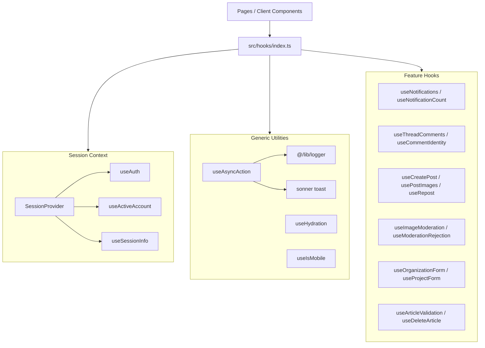

`src/hooks` is the repository-wide collection of reusable React hooks that encapsulate cross-cutting client behaviour: session and auth access, async action orchestration, SSR hydration detection, notifications, comments, moderation, and form workflows. Everything is imported from `@/hooks` ([`src/hooks/index.ts`](https://github.com/ozeaon/ozeaon-v2/blob/0a4f1a95824db87782f1221a4108019d174df3d9/src/hooks/index.ts)), except `useArticleValidation`, whose sole consumer imports it directly from `@/hooks/use-article-validation`.

## Overview

The library exists to keep client-side stateful behaviour out of page components. The directory is deliberately flat and file-per-hook (`use-<concept>.ts(x)`), with a single barrel re-exporting the public surface. Hooks that touch context, `useState`, or browser APIs carry `"use client"`. Two provider components (`SessionProvider`, `RepostProvider`) are exported alongside their consumer hooks so the two cannot drift apart.

The library mixes two categories:

| Category | Examples |
|---|---|
| Generic infrastructure | `useAsyncAction`, `useHydration`, `useIsMobile`, `useTransitionRouter`, `useUnsavedChangesGuard` |
| Feature / domain | `useNotifications`, `useThreadComments`, `useCreatePost`, `useRepost`, `useOrganizationForm`, `useProjectForm`, `useProfileImageUpload`, `useDeleteArticle`, `useArticleValidation`, `useImageModeration`, `useModerationRejection`, `useAccountSwitch`, `useCommentIdentity` |

## Architecture

The library is layered: a context layer provides session state, a generic utility layer provides orchestration primitives, and a feature layer composes both.

## Session Context Layer

[`use-auth.tsx`](https://github.com/ozeaon/ozeaon-v2/blob/0a4f1a95824db87782f1221a4108019d174df3d9/src/hooks/use-auth.tsx) defines a single `SessionContext`, a memoized provider, and three narrowly-scoped public hooks. The key design decision is **subset projection**: each public hook returns only the fields it needs from the context, so a component subscribing to only the active account cannot accidentally depend on `client` or `hydrate`. The context value is memoized on all its own members so that a provider re-render does not cascade to all consumers.

`user` is display-only by explicit invariant — it must not be used for authorization decisions client-side. The private `useSession()` accessor throws `"useSession must be used within SessionProvider"` rather than returning `null`, so the provider requirement is enforced once for all three public hooks rather than at each call site.

## Generic Infrastructure Hooks

### `useAsyncAction`

[`use-async-action.ts`](https://github.com/ozeaon/ozeaon-v2/blob/0a4f1a95824db87782f1221a4108019d174df3d9/src/hooks/use-async-action.ts) wraps an arbitrary async function with loading state, toast feedback, and logging. Its key design point is the **envelope convention**: if the wrapped function resolves with `{ success: false }`, the hook re-interprets it as a failure and throws, so server actions can return structured error results without each call site writing its own check.

Details worth knowing when extending it:

- **Error-message precedence is asymmetric.** Inside `catch`, a real `Error`'s `.message` wins and the `errorMessage` option is ignored; only non-`Error` throws fall back to `errorMessage`.
- **`actionName` is required for useful logs.** Call sites pass inline arrow functions whose `.name` is empty — without an explicit label, every failure logs as `"Async action error"`.
- **`isLoading` clears in `finally`**, so it resets on both success and error paths.
- **Return type is `Promise<T | undefined>`** — the error path returns nothing; callers must guard against `undefined`.

### `useHydration`

[`use-hydration.tsx`](https://github.com/ozeaon/ozeaon-v2/blob/0a4f1a95824db87782f1221a4108019d174df3d9/src/hooks/use-hydration.tsx) uses `useSyncExternalStore` to return `false` during server rendering and `true` after client hydration. The noop `subscribe` signals "this store never changes", avoiding extra render passes and hydration mismatch warnings that come with ad-hoc `mounted` flags. `useIsMobile` follows the same pattern.

### Other Generic Hooks

`useTransitionRouter` wraps navigation to coordinate view transitions; `useUnsavedChangesGuard` provides a reusable guard for forms with unsaved changes (see [Drafts, Saving & Publishing](../../forms/saving-and-publishing/#leaving-with-unsaved-changes)). Both are in [`src/hooks/`](https://github.com/ozeaon/ozeaon-v2/tree/0a4f1a95824db87782f1221a4108019d174df3d9/src/hooks) and exported from the barrel.

## Feature Hooks

Notifications, comments, posting, moderation, and form hooks are documented on their feature pages: [Notifications](../../community/notifications/), [Comments & Reactions](../../community/comments-and-reactions/), [Posts](../../posts/posts/). The form hooks (`useProjectForm`, `useOrganizationForm`, `useModerationRejection`) are covered in [Forms & Validation](../../forms/form-architecture/). Three hooks are described here because they sit at the intersection of multiple features or have unusual conventions.

### `useArticleValidation`

[`use-article-validation.ts`](https://github.com/ozeaon/ozeaon-v2/blob/0a4f1a95824db87782f1221a4108019d174df3d9/src/hooks/use-article-validation.ts) backs the article editor's per-section completeness checks. Despite the hook name, it registers no React state, effects, or refs — it returns a single `validateSection(section, data)` function that returns every violated rule as a `{ field, message, code }` error. The hook wrapper is call-site ergonomics only.

Gotchas before extending it:

- **Alignment failures share one code.** Missing tags, SDGs, and subcategories all emit `MISSING_CATEGORIES` — only the `field` property distinguishes them.
- **Corresponding-author errors are per-index.** When no corresponding author is set the error appears on every author row, not a single summary.
- **Content rules are article-type-dependent.** `isResearchOrIP(article_type?.code)` decides whether a PDF is mandatory. All limits and messages come from `@/config/constants/articles`.
- **Not in the barrel.** Its sole consumer, `ArticleFormSidebar.tsx`, imports directly from `@/hooks/use-article-validation`.
- **It isn't Zod.** Its rules overlap with `articlePublishSchema` but don't match it. See [Sections, Progress & Completion](../../forms/sections-and-progress/#articles-hand-written-rules-only-after-a-save).

### `useDeleteArticle`

[`use-delete-article.ts`](https://github.com/ozeaon/ozeaon-v2/blob/0a4f1a95824db87782f1221a4108019d174df3d9/src/hooks/use-delete-article.ts) is shared by `ArticleForm.tsx` and `MyArticleCard.tsx` so both surfaces use the same copy and server-error detail. A non-OK response is converted with `ApiError.fromResponse`; the toast prefers `error.details` over `error.message` so the API's structured detail reaches the user. `isDeleting` resets only on the error path — on success, both consumers navigate away or unmount inside `onDeleted()` before a reset would matter. A future consumer that stays mounted after deletion would be left with a stuck loading state.

### `useRepost` / `RepostProvider`

[`use-repost.tsx`](https://github.com/ozeaon/ozeaon-v2/blob/0a4f1a95824db87782f1221a4108019d174df3d9/src/hooks/use-repost.tsx) models reposting as **composer pre-fill**: `RepostProvider` carries "which post is being reposted" from `RepostButton` to the post composer, which appends `post_tag` to the submitted FormData. `requestRepost(post)` stores the post, opens the form, and increments `repostRequestId`. The counter exists because the open flag alone cannot signal a second repost click on an already-open composer — `DesktopComposer.tsx` keys its scroll-to-top effect on the request id for this reason.

The hook also returns `handleRepost(postId)`, which only logs the call and returns `{ status: true }`. It performs no request and has no call sites anywhere in the repository — it is dead scaffolding and should not be confused with the live repost path, which goes through `useCreatePost`'s submit.

## Failure Modes & Edge Cases

- All three session hooks throw outside `SessionProvider`; `useRepost` throws outside `RepostProvider`. Both providers are mounted in `app/layout.tsx`.
- `useDeleteArticle`: `isDeleting` stays `true` after a successful delete. A consumer that stays mounted after `onDeleted()` would be left with a stuck loading state.
- `useAsyncAction` returns `Promise<T | undefined>` — the error path returns nothing. Callers must handle `undefined`.
- `useRepost`'s `handleRepost(postId)` is dead code; do not call it.

## Extension Points

- Add a generic hook by creating `use-<concept>.ts(x)` and exporting from `src/hooks/index.ts`.
- Feature hooks that need a context follow the `SessionProvider` / `useAuth` pattern: provider and consumer in the same module, both exported from the barrel.
- Hooks with a single, domain-specific consumer follow the `useArticleValidation` pattern: not exported from the barrel, imported by direct path.

## Related Links

- [`src/hooks/index.ts`](https://github.com/ozeaon/ozeaon-v2/blob/0a4f1a95824db87782f1221a4108019d174df3d9/src/hooks/index.ts) — barrel export contract
- [Notifications](../../community/notifications/) — `useNotifications`, `useNotificationCount`
- [Comments & Reactions](../../community/comments-and-reactions/) — `useThreadComments`, `useCommentIdentity`
- [Posts](../../posts/posts/) — `useCreatePost`, `usePostImages`, `useRepost`
- [Logging & Observability](../../operations/logging-observability/) — logger consumed by `useAsyncAction`
- [Forms & Validation](../../forms/form-architecture/) — `useProjectForm`, `useOrganizationForm`, `useModerationRejection`, `useUnsavedChangesGuard`
