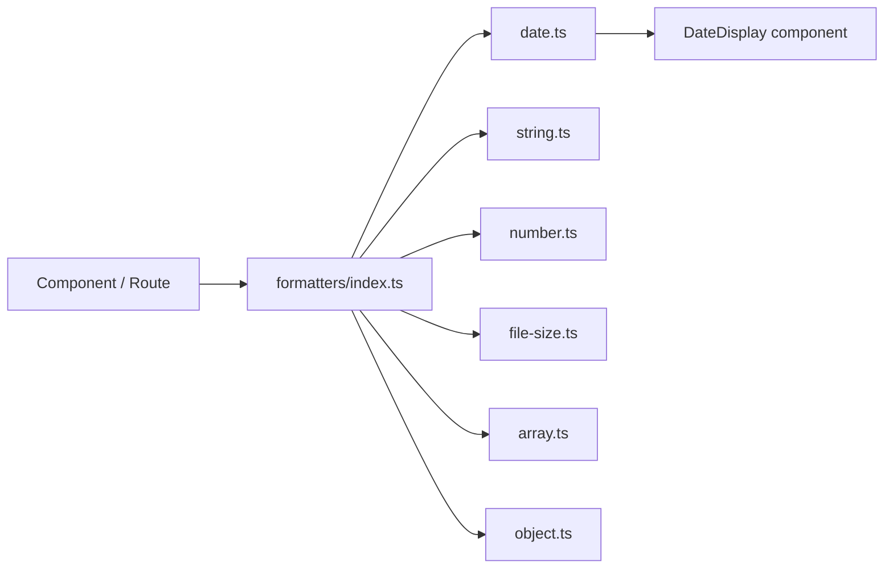
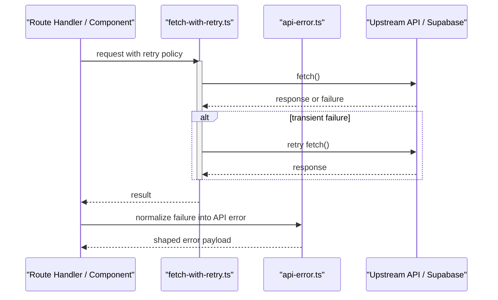
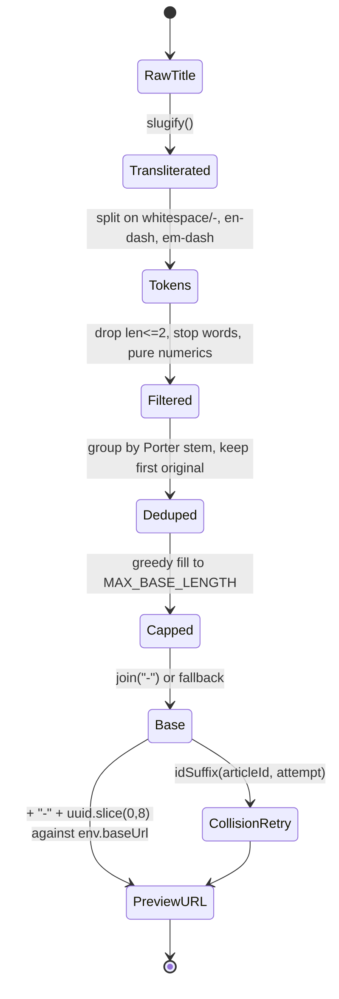

A shared, dependency-light layer of pure helper modules under `src/utils/` that centralizes formatting (dates, numbers, file sizes, strings, arrays, objects), slug/URL and identifier generation, input validation, article HTML sanitisation, notification copy, retry-aware fetching, and API error normalization for the rest of the application.

## Purpose and Scope

This page documents the **utility layer** of the repository: the modules under `src/utils/` that provide reusable, side-effect-free (or narrowly-scoped) helpers consumed across UI, route handlers, and data access code.

Covered here:

- The directory layout of `src/utils/` and the role of each group (`formatters/`, `generators/`, `validators/`, `url/`, `data/`, `form/`, plus top-level helpers).
- The **slug/keyword generator** (`src/utils/generators/generate-slug.ts`) in full detail — tokenization, stop-word removal, Porter stemming, length budgeting, and URL construction.
- The **other generators** — relative dates (`date.ts`), unique usernames (`username.ts`), upload storage keys (`storage-key.ts`), and the static-params placeholder contract (`static-params.ts`).
- The **formatter barrel** (`src/utils/formatters/index.ts`) and its categories (array, date, file-size, number, object, string).
- The **input validators** (`src/utils/validators/`) — email, password, generic file size/type, image files, and the article attachment quota rules.
- The **MIME lookup and document-type query** helpers (`src/utils/url/`).
- The **stateless data helpers** — gzip JSON compression and comment-thread shaping — and the **sidebar-state cookie pair** (`sidebar-state.ts` + `sidebar-state.server.ts`) under `src/utils/data/`.
- The **shadcn class-merge helper** `cn` in `src/utils/shadcn/utils.ts`.
- The **top-level helpers** — category dedupe, PDF page counting, project display/filters, article HTML sanitisation, undo/error toasts, in-app navigation history with safe back-navigation, and the notification copy catalogue.
- The retry/error helpers `fetch-with-retry.ts` and `api-error.ts` at the utility boundary.

Intentionally left to sibling pages:

- **Configuration and environment plumbing** (`src/config`, `env`, `next.config.ts` image/PWA settings) — see the parent *Config and Utils* section's configuration pages.
- **Supabase-facing data-access modules** (`src/utils/data/account.ts` and `active-account.ts`, re-exported through `data/index.ts`) — those belong to the data-layer catalog pages; here the `data/` coverage is limited to the stateless members (compression, comments) and the cookie-backed sidebar-state pair, with `data/index.ts` documented as their barrel.
- **Logging/redaction conventions** — see the logging conventions documentation referenced in `docs/logging-conventions.md`.

> Note on source coverage: some individual formatter files (e.g. `array.ts`, `number.ts`, `object.ts`) were enumerated but their bodies were not read within this page's source budget. Their existence, paths, and grouping are confirmed from the directory listing; their internal signatures are **not** asserted here.

## Overview

Utility code in this codebase is deliberately organized by *concern* rather than by *consumer*. Eight structural groupings exist under `src/utils/`:

| Group | Path | Purpose |
|-------|------|---------|
| Top-level helpers | `src/utils/*.ts` | Cross-cutting primitives that do not fit a sub-folder (article/category/project helpers, HTML sanitisation, toasts, navigation history, notification copy, error shaping, retry wrapper) |
| `formatters/` | `src/utils/formatters/*.ts` | Presentation-shaping functions: dates, numbers, file sizes, strings, arrays, objects, with an `index.ts` barrel |
| `generators/` | `src/utils/generators/*.ts` | Deterministic value construction — slugs and public URLs, relative dates, unique usernames, upload storage keys, and static-params placeholders, with an `index.ts` barrel |
| `validators/` | `src/utils/validators/*.ts` | Input validation — email, password, generic file size/type, image files, and article attachment quotas, with an `index.ts` barrel |
| `url/` | `src/utils/url/*.ts` | Filename-to-MIME lookup, document-type queries, and image/search URL helpers, with an `index.ts` barrel |
| `data/` | `src/utils/data/*.ts` | Data-fetch/cache/state helpers, including a server/client split (`sidebar-state.server.ts` vs `sidebar-state.ts`) and stateless gzip/comment helpers |
| `form/` | `src/utils/form/*.ts` | Form value shaping and normalization helpers (see the *UI Forms* component page for `data.ts`) |
| `shadcn/` | `src/utils/shadcn/utils.ts` | Framework/UI-library glue (`cn`) |

The design intent behind this layout is separation of **pure transformation** (formatters, generators) from **I/O-bearing helpers** (data, fetch, api-error). Pure modules are safe to import from both Client Components and Server Components in the Next.js App Router model, whereas I/O helpers must respect the server/client boundary — which is why `sidebar-state` is explicitly split into a `.server.ts` variant.

A second design intent is **single-source-of-truth formatting**. The component library documentation (`docs/component-library.md`) mandates that dates render through the `DateDisplay` component rather than ad-hoc formatting, which is backed by the formatter module rather than scattered `toLocaleDateString` calls. Similarly, slug creation is centralized in `generate-slug.ts` and documented as the canonical mapper for hook-form slug fields (`docs/hook-form-components.md`).

On top of the group barrels sits a root barrel, [`src/utils/index.ts`](https://github.com/ozeaon/ozeaon-v2/blob/0a4f1a95824db87782f1221a4108019d174df3d9/src/utils/index.ts#L1-L12), which re-exports `validators`, `formatters`, `generators`, `url`, `data`, `form`, `zod-to-db`, `api-error`, `fetch-with-retry`, `sanitize`, `toast`, and `shadcn/utils`. Most call sites import from `@/utils` rather than a group barrel, so anything added to a group barrel is automatically part of the flat public surface — including `attachments.ts` only if it is ever added to `validators/index.ts` (it currently is not; see [Validators](#validators)).

## Architecture

```mermaid
flowchart TD
    subgraph sg_Consumers["Consumers"]
        UI["Client / Server Components"]
        Routes["Route Handlers / API Layer"]
        DataLayer["src/utils/data/*"]
        Layouts["Root / Section Layouts"]
    end

    subgraph sg_Utils["src/utils"]
        subgraph sg_Formatters["formatters/"]
            FIndex["index.ts (barrel)"]
            FDate["date.ts"]
            FString["string.ts"]
            FNum["number.ts"]
            FSize["file-size.ts"]
            FArr["array.ts"]
            FObj["object.ts"]
        end
        subgraph sg_Generators["generators/"]
            GSlug["generate-slug.ts"]
            GDate["date.ts"]
            GUser["username.ts"]
            GKey["storage-key.ts"]
            GStatic["static-params.ts"]
        end
        subgraph sg_Validators["validators/"]
            VIndex["index.ts (barrel)"]
            VEmail["email.ts"]
            VPassword["password.ts"]
            VFile["file.ts"]
            VImage["image.ts"]
            VAttach["attachments.ts"]
        end
        subgraph sg_Url["url/"]
            UIndex["index.ts (barrel)"]
            UType["content-type.ts"]
        end
        subgraph sg_Data["data/ (documented here)"]
            DCompression["compression.ts"]
            DComments["comments.ts"]
            DSidebar["sidebar-state.ts + sidebar-state.server.ts"]
        end
        ShadcnUtils["shadcn/utils.ts (cn)"]
        FetchRetry["fetch-with-retry.ts"]
        ApiError["api-error.ts"]
        Articles["articles.ts"]
        Categories["categories.ts"]
        Documents["documents.ts"]
        Project["project.ts"]
        Sanitize["sanitize.ts"]
        Toast["toast.ts"]
        Notifications["notifications.ts"]
        NavHistory["nav-history.ts + safe-router-back.ts"]
    end

    subgraph sg_External["External Dependencies"]
        Translit["transliteration (slugify)"]
        Natural["natural (PorterStemmer)"]
        Config["@/config (env.baseUrl, IMAGE_CONFIG, PASSWORD_REQUIREMENTS)"]
        AttachConfig["@/config/constants/attachments"]
        TW["clsx + tailwind-merge"]
        Xss["xss (FilterXSS)"]
    end

    UI --> FIndex
    UI --> ShadcnUtils
    UI --> GSlug
    UI --> GUser
    UI --> VIndex
    UI --> Toast
    UI --> Notifications
    UI --> NavHistory
    UI --> DComments
    UI --> DSidebar
    Routes --> ApiError
    Routes --> FetchRetry
    Routes --> GKey
    Routes --> GStatic
    Routes --> VIndex
    Routes --> UIndex
    Routes --> Sanitize
    Routes --> DCompression
    Layouts --> DSidebar
    DataLayer --> FetchRetry
    DataLayer --> ApiError
    DataLayer --> Articles
    DataLayer --> Categories
    DataLayer --> Documents

    FIndex --> FDate
    FIndex --> FString
    FIndex --> FNum
    FIndex --> FSize
    FIndex --> FArr
    FIndex --> FObj

    GSlug --> Translit
    GSlug --> Natural
    GSlug --> Config
    GUser --> Config
    VIndex --> VEmail
    VIndex --> VPassword
    VIndex --> VImage
    VIndex --> VFile
    VImage --> VFile
    VImage --> Config
    VPassword --> Config
    VAttach --> AttachConfig
    VFile --> UType
    Sanitize --> Xss
    ShadcnUtils --> TW
```



The diagram reflects only verified relationships: `formatters/index.ts` acts as a barrel over the sibling formatter files (confirmed by the directory listing), `generate-slug.ts` imports `slugify` from `transliteration`, `PorterStemmer` from `natural`, and `env` from `@/config` (confirmed by reading the file), and `shadcn/utils.ts` composes `clsx` with `twMerge` (confirmed by the grep hit at `src/utils/shadcn/utils.ts#L8-L9`). The extended groups are equally source-verified: `validators/image.ts` composes `file.ts` with `IMAGE_CONFIG`, `validators/file.ts` reuses `url/content-type.ts` for MIME matching, `validators/attachments.ts` reads its limits from `@/config/constants/attachments`, and `sanitize.ts` wraps `FilterXSS` from the `xss` package.

## The Slug & URL Generator

`src/utils/generators/generate-slug.ts` is the most substantial generator module and the canonical place where article/category identifiers become URL path segments. It is designed around a fixed URL-length contract and uses NLP-lite techniques (stop words + stemming) to keep slugs short and meaningful without external service calls.

### Length Contract and Constants

```typescript
const MAX_SLUG_LENGTH = 89;
const ID_SUFFIX_LENGTH = 8;
const MAX_BASE_LENGTH = MAX_SLUG_LENGTH - 1 - ID_SUFFIX_LENGTH; // 80
```

> Source: [generate-slug.ts](https://github.com/ozeaon/ozeaon-v2/blob/0a4f1a95824db87782f1221a4108019d174df3d9/src/utils/generators/generate-slug.ts#L5-L7)

The arithmetic encodes the final slug shape: `base` + `-` (1 char) + an 8-character id suffix must fit within 89 characters. Because the separator and the suffix are reserved up front, the human-readable base is greedily capped at **80 characters** — the `// 80` comment makes the derived constant explicit. This ordering matters: truncating the composed string afterwards would risk cutting the id suffix and breaking uniqueness assumptions made by consumers.

### Stop-Word Removal

```typescript
const STOP_WORDS = new Set([
  "a", "an", "the", "and", "or", "but", "nor", "so", "yet", "for",
  "of", "in", "on", "at", "to", "by", "up", "as", "is", "it", "its",
  "be", "was", "are", "were", "been", "with", "from", "into",
  "that", "this", "than", "then", "when", "where", "which", "who",
  "how", "what", "not", "no", "can", "will", "do", "has", "had",
  "have", "may",
]);
```

> Source: [generate-slug.ts](https://github.com/ozeaon/ozeaon-v2/blob/0a4f1a95824db87782f1221a4108019d174df3d9/src/utils/generators/generate-slug.ts#L9-L58)

The set is a hand-curated English function-word list (articles, conjunctions, prepositions, auxiliaries, and question words) stored as a `Set` for O(1) lookup. Removing these words is what allows a long editorial title to be compressed to a readable 80-character base while preserving the semantically load-bearing nouns. The list is intentionally English-only; for non-Latin scripts the `slugify` transliteration step runs first (see below), which converts scripts to Latin before the stop-word filter is applied.

### Keyword Extraction: Tokenize → Stem → Dedup

```typescript
function extractKeywords(title: string): string[] {
  // 1. Tokenize — split on whitespace/hyphens/dashes, strip non-word chars
  const tokens = title
    .split(/[\s\-–—]+/)
    .map((token) => token.replace(/\W/g, "").toLowerCase())
    .filter(
      (token) =>
        token.length > 2 && !STOP_WORDS.has(token) && !/^\d+$/.test(token),
    );

  // 2. Stem and dedup — keep first occurrence (preserves original title order)
  const seen = new Set<string>();
  const deduped: string[] = [];
  for (const token of tokens) {
    const stem = PorterStemmer.stem(token);
    if (!seen.has(stem)) {
      seen.add(stem);
      deduped.push(token);
    }
  }

  return deduped;
}
```

> Source: [generate-slug.ts](https://github.com/ozeaon/ozeaon-v2/blob/0a4f1a95824db87782f1221a4108019d174df3d9/src/utils/generators/generate-slug.ts#L60-L82)

Three filtering rules run during tokenization: a **length floor** (`token.length > 2` drops one- and two-character noise), a **stop-word check**, and a **pure-numeric rejection** (`/^\d+$/`) that prevents meaningless numeric runs from occupying slug budget. The split regex `[\s\-–—]+` covers whitespace plus hyphen, en-dash, and em-dash — important because titles pasted from word processors often use typographic dashes.

The deduplication step is subtle and deliberate: tokens are grouped by their **Porter stem** but the **original token** is retained in the output. This means `"running"` and `"runs"` collapse to a single entry without mutating the human-readable word — the comment `preserves original title order` documents that first-occurrence ordering is a requirement, not an accident.

### Base Construction with Greedy Word-Boundary Fill

```typescript
export function buildSlugBase(title: string, fallback = "item"): string {
  const tokens = extractKeywords(slugify(title));

  const seen = new Set<string>();
  const words: string[] = [];

  for (const token of tokens) {
    if (STOP_WORDS.has(token)) continue;
    const root = PorterStemmer.stem(token);
    if (seen.has(root)) continue;
    seen.add(root);
    words.push(token);
  }

  // Greedy word-boundary fill to MAX_BASE_LENGTH
  const kept: string[] = [];
  let len = 0;
  for (const word of words) {
    const next = len === 0 ? word.length : len + 1 + word.length;
    if (next > MAX_BASE_LENGTH) break;
    kept.push(word);
    len = next;
  }

  return kept.join("-") || fallback;
}
```

> Source: [generate-slug.ts](https://github.com/ozeaon/ozeaon-v2/blob/0a4f1a95824db87782f1221a4108019d174df3d9/src/utils/generators/generate-slug.ts#L84-L109)

`buildSlugBase` composes the transliteration (`slugify`) with the keyword extractor, then **re-applies** the stop-word and stem-dedup filters. That second pass is not redundant: `slugify` can emit tokens that were not present in the raw title (or alter them) so the filters are re-run on the transliterated string to guarantee the invariant holds on whatever actually flows into the slug.

The fill loop is a classic **greedy knapsack approximation**: it walks words in order and stops at the first word that would overflow `MAX_BASE_LENGTH`, using `break` rather than `continue` to preserve word contiguity and avoid a mid-phrase gap. The `len === 0 ? word.length : len + 1 + word.length` expression accounts for the hyphen separator only after the first word. The `|| fallback` guard ensures the function never returns an empty string, defaulting to `"item"` — which is why `fallback` is a parameter (callers can pass a domain-specific prefix as we see next).

### Public URL Construction

```typescript
export function generateSlugPreview(
  prefix: string,
  title: string,
  uuid: string | null,
): string {
  const uuidPart = uuid || crypto.randomUUID();
  const parts = [buildSlugBase(title, prefix), uuidPart.slice(0, 8)];
  return new URL(parts.join("-"), `${env.baseUrl}/${prefix}/`).toString();
}

export function generatePublishedUrl(prefix: string, slug: string): string {
  return new URL(slug, `${env.baseUrl}/${prefix}/`).toString();
}
```

> Source: [generate-slug.ts](https://github.com/ozeaon/ozeaon-v2/blob/0a4f1a95824db87782f1221a4108019d174df3d9/src/utils/generators/generate-slug.ts#L111-L123)

Two entry points exist because the system distinguishes **preview/draft** URLs from **published** URLs:

- `generateSlugPreview` builds a *candidate* URL for client-side previews. It accepts a nullable `uuid` and falls back to `crypto.randomUUID()` (the Web Crypto API, available in both browsers and Cloudflare Workers) so a preview can be rendered before the record is persisted. The `fallback` argument of `buildSlugBase` is passed as `prefix`, meaning a title that reduces to zero keywords still yields a prefix-based base rather than the generic `"item"`.
- `generatePublishedUrl` takes an already-decided slug and simply resolves it against the canonical base. It performs **no** slugification — by the time this is called the slug is authoritative (typically read from the database), so re-processing it would risk drift between the stored slug and the generated link.

Both functions route through `new URL(..., base)` rather than string concatenation, which normalizes separators and guarantees an absolute URL. The base is `env.baseUrl` imported from `@/config`, confirming that URL shape is environment-driven (local, preview, production) rather than hardcoded.

`uuidPart.slice(0, 8)` is consistent with `ID_SUFFIX_LENGTH = 8`, so the length contract holds for both the base and the composed slug.

### Slug Recovery: `extractSlugPath`

```typescript
export function extractSlugPath(
  value: string | null | undefined,
): string | null {
  if (!value) return null;
  try {
    return new URL(value).pathname.split("/").filter(Boolean).pop() ?? null;
  } catch {
    return value.split("/").filter(Boolean).pop() ?? null;
  }
}
```

> Source: [generate-slug.ts](https://github.com/ozeaon/ozeaon-v2/blob/0a4f1a95824db87782f1221a4108019d174df3d9/src/utils/generators/generate-slug.ts#L131-L140)

This function exists to absorb **data-shape drift**. The doc comment states it handles "values that are still full preview URLs (legacy client submissions or stale DB rows) as well as already-bare slugs," and the contract is explicit: *"Never throws."* The control flow is a two-branch fallback:

1. Try `new URL(value)` — if `value` is an absolute URL, take its `pathname`, split on `/`, drop empty segments (`.filter(Boolean)` handles the leading and trailing slashes), and return the last segment.
2. If `new URL` throws (relative or bare slug), fall back to splitting on `/` directly.

The `.filter(Boolean)` in both branches is what makes `"/a/b/"` and `"/a/b"` behave identically, and the `?? null` guards against an empty input producing `undefined` from `.pop()`.

### Collision Avoidance: `idSuffix`

```typescript
export function idSuffix(articleId: string, attempt: number): string {
  const clean = articleId.replace(/-/g, "");
  const offset =
    (attempt * ID_SUFFIX_LENGTH) % (clean.length - ID_SUFFIX_LENGTH + 1);
  return clean.slice(offset, offset + ID_SUFFIX_LENGTH);
}
```

> Source: [generate-slug.ts](https://github.com/ozeaon/ozeaon-v2/blob/0a4f1a95824db87782f1221a4108019d174df3d9/src/utils/generators/generate-slug.ts#L142-L147)

`idSuffix` is the uniqueness strategy when two records produce the same slug base. Instead of appending a random value, it **slides a window** across the record's UUID: hyphens are stripped, and the window start is computed as `(attempt * 8) % (uuidLength - 8 + 1)`.

Design consequences worth noting:

- It is **deterministic** — the same `(articleId, attempt)` always yields the same suffix, so slug generation is reproducible and does not need randomness for collision retries.
- It is **bounded** — the modulo keeps the window inside the string, so `slice` can never return a short string; every attempt yields exactly `ID_SUFFIX_LENGTH` (8) characters for a standard 32-char hyphen-stripped UUID.
- It is **cyclically exhausted** — after `clean.length - ID_SUFFIX_LENGTH + 1` attempts (25 for a 32-char UUID), the offset wraps. For a full 32-character UUID the total entropy per attempt is the window size, so the retry space is finite; with 25 distinct windows of 8 hex characters, that is 25 possible suffixes before the first one repeats.

## Other Generators

Beyond slugs, `src/utils/generators/` holds four smaller value-construction modules, surfaced through a barrel:

```typescript
export { generateUniqueUsername } from "./username";
export { generateUniqueKey } from "./storage-key";
export {
  generateSlugPreview,
  generatePublishedUrl,
  extractSlugPath,
} from "./generate-slug";
export {
  staticSlugParams,
  staticParams,
  SLUG_PLACEHOLDER,
  notFoundIfPlaceholder,
} from "./static-params";
export { isDateOlderThan } from "./date";
```

> Source: [index.ts](https://github.com/ozeaon/ozeaon-v2/blob/0a4f1a95824db87782f1221a4108019d174df3d9/src/utils/generators/index.ts#L1-L14)

The barrel re-exports only `isDateOlderThan` from `date.ts`; `monthFromNow`, `monthBoundaries`, and `getPassedDate` are reachable only via the deep path (or the root `@/utils` barrel, which re-exports `generators/index.ts` and therefore not those three either).

### Relative-Date Helpers (`date.ts`)

| Export | Signature | Purpose |
|--------|-----------|---------|
| `monthFromNow` | `(number: number, position?: "start" \| "end" \| "today") => Date` | Today shifted by `number` months (negative for the past), optionally snapped to the start or end of that month |
| `isDateOlderThan` | `(date: Date \| string \| number, days: number) => boolean` | True when `date` plus `days` is already in the past |
| `monthBoundaries` | `() => { thisMonthStart: string; lastMonthStart: string }` | ISO timestamps for the start of the current and previous month, for month-over-month range queries |
| `getPassedDate` | `(days: number) => string` | ISO timestamp `days` days ago — **no call sites found in the repository** |

> Source: [date.ts](https://github.com/ozeaon/ozeaon-v2/blob/0a4f1a95824db87782f1221a4108019d174df3d9/src/utils/generators/date.ts#L8-L43)

All four are thin compositions over `date-fns` (`addMonths`, `addDays`, `startOfMonth`, `endOfMonth`). `isDateOlderThan` is the barrel export and the workhorse: its four consumers (the article form, its licensing section, the home activity slot, and the articles API route) use it to expire drafts and activity windows. `monthFromNow`/`monthBoundaries` feed the same components' default date ranges.

### `generateUniqueUsername` (`username.ts`)

The only async, I/O-bearing generator: it derives a candidate username from a display name and confirms uniqueness against the database.

- **Slugification** lowercases, strips every character outside `[a-z0-9]` (characters are *removed*, not replaced — `"Jack C-Jones"` becomes `"jackcjones"`), and caps the result at **15 characters**.
- **Collision loop** runs up to **5 attempts**. Each attempt appends a random 5-digit zero-padded numeric suffix (00000–99999) and queries `user_profiles` with `.eq("username", candidate).single()`. A query that finds no row is treated as "username free" and the candidate is returned.
- **Exhaustion throws**: if all five candidates collide, it throws `new Error("Failed to generate unique username after 5 attempts")`.

> Source: [username.ts](https://github.com/ozeaon/ozeaon-v2/blob/0a4f1a95824db87782f1221a4108019d174df3d9/src/utils/generators/username.ts#L13-L50)

Consumers: [`GoogleSignIn.tsx`](https://github.com/ozeaon/ozeaon-v2/blob/0a4f1a95824db87782f1221a4108019d174df3d9/src/components/auth/GoogleSignIn.tsx) (OAuth sign-ups need a username the display name does not provide) and [`src/lib/supabase/actions.ts`](https://github.com/ozeaon/ozeaon-v2/blob/0a4f1a95824db87782f1221a4108019d174df3d9/src/lib/supabase/actions.ts). Note that the uniqueness check and the later insert are not atomic — two concurrent sign-ups can observe the same free username; whatever unique constraint the `user_profiles.username` column carries is the real backstop.

### `generateUniqueKey` (`storage-key.ts`)

Builds collision-resistant storage keys for file uploads:

```
{prefix}/{timestamp}-{randomSuffix}-{baseName}.{extension}
```

- `prefix` is the folder segment (`"avatars"`, `"documents"`, …).
- `timestamp` is `Date.now()` — keys sort chronologically within a prefix.
- `randomSuffix` is 6 base36 characters from `Math.random()` (not `crypto`).
- `baseName` is the original filename minus its extension, with every character outside `[a-zA-Z0-9-_]` replaced by `-`.
- `extension` is everything after the last dot, case preserved.

> Source: [storage-key.ts](https://github.com/ozeaon/ozeaon-v2/blob/0a4f1a95824db87782f1221a4108019d174df3d9/src/utils/generators/storage-key.ts#L8-L17)

It has eight consumers, all on upload paths (the project/article/organization/profile image routes, the attachment route, `src/lib/images/upload.ts`, and `src/lib/storage/r2-binding.ts`) — see the *Storage (R2)* and *Media and Images* pages for how the keys are used against object storage.

### Static Params and the Placeholder Contract (`static-params.ts`)

`generateStaticParams` must return a non-empty array even when the table is empty or the fetch fails, so this module pairs a sentinel value with a page-side 404 helper:

```typescript
export const SLUG_PLACEHOLDER = "__placeholder__";

export async function staticParams<K extends string>(
  key: K,
  fetchFn: () => Promise<Array<Record<K, string>> | null>,
): Promise<Array<Record<K, string>>> {
  const placeholder = { [key]: SLUG_PLACEHOLDER } as Record<K, string>;
  try {
    const rows = await fetchFn();
    return rows && rows.length > 0 ? rows : [placeholder];
  } catch (error) {
    logError(logger, "staticParams failed to fetch rows", error, {
      fetchFn: fetchFn.name,
    });
    return [placeholder];
  }
}

export function notFoundIfPlaceholder(param: string): void {
  if (param === SLUG_PLACEHOLDER) notFound();
}
```

> Source: [static-params.ts](https://github.com/ozeaon/ozeaon-v2/blob/0a4f1a95824db87782f1221a4108019d174df3d9/src/utils/generators/static-params.ts#L6-L31)

Three behaviours matter:

- **Failure and emptiness collapse to the placeholder.** A `null` row set, an empty array, or a thrown error all return `[placeholder]`, so the route still prerenders one dynamic entry; the error path also logs through `getLogger(["utils", "generators"])` with the fetch function's name.
- **`staticSlugParams`** is a convenience alias pinning `key` to `"slug"` — the common `[slug]` segment. Its four consumers are the reader/profile article and project layouts and pages.
- **`notFoundIfPlaceholder`** is the other half of the contract: pages and layouts call it with the route param so the sentinel entry renders as a 404 (via `next/navigation`'s `notFound()`) instead of a bogus document. Nine files call it.

## Formatters

The `src/utils/formatters/` directory holds presentation-shaping functions grouped by value domain, surfaced through a barrel module:



The barrel pattern matters for two reasons: consumers import from a single stable path (`@/utils/formatters`) rather than deep file paths, which keeps the internal file split refactorable; and it makes the formatter surface discoverable in one place for the component-library rules that mandate centralized formatting.

### Date Formatting

The date formatter exposes a nullable-in / nullable-out contract, as evidenced by its signature:

```typescript
export function formatDate(dateString: string | null): string | null {
  if (!dateString) return null;
```

> Source: [date.ts](https://github.com/ozeaon/ozeaon-v2/blob/0a4f1a95824db87782f1221a4108019d174df3d9/src/utils/formatters/date.ts#L7-L8)

The `string | null` → `string | null` shape is a deliberate decision to keep **falsy propagation** at the utility level: a missing date returns `null` rather than `""`, `"Invalid Date"`, or `"—"`. That pushes the placeholder decision up to the presentation layer, where `DateDisplay` can render the appropriate empty state.

The corresponding UI contract, from the component library rules, is that dates must be rendered through a shared component with a **format selector**:

> `DateDisplay` — all dates; formats: `"relative"` / `"short"` / `"long"`
>
> Source: [component-library.md](https://github.com/ozeaon/ozeaon-v2/blob/0a4f1a95824db87782f1221a4108019d174df3d9/docs/component-library.md#L9)

This three-way format enum is the reason date formatting is a utility concern rather than inline JSX: the same underlying instant gets rendered differently depending on context (relative for activity feeds, short for tables, long for detail headers) without each call site reimplementing the logic.

### Number and File-Size Formatting

`number.ts` and `file-size.ts` are separate modules rather than one "format" module, which reflects that they answer different questions: numeric formatting concerns precision, grouping, and unit suffixes for abstract quantities, while file-size formatting handles **binary/decimal unit scaling and unit selection** (`B`, `KB`, `MB`, `GB`). They live alongside each other under `formatters/` and are re-exported from the barrel.

> The internal implementations of `array.ts`, `number.ts`, `object.ts`, and `file-size.ts` were not read within this page's source budget, so their exact signatures and thresholds are not asserted here. Their paths and grouping are confirmed by the directory listing of `src/utils/formatters/`.

### String Formatting

`string.ts` holds the label-shaping helpers used by select options, cards, and metrics:

| Export | Signature | Purpose |
|--------|-----------|---------|
| `toTitleCase` | `(str: string) => string` | Splits on underscores, hyphens, and whitespace (`[_\-\s]+`), capitalizes the first letter of each word and lowercases the rest, joins with spaces |
| `toLabel` | `(str: string) => string` | Replaces runs of underscores/hyphens with spaces; no casing change |
| `capitalize` | `(str: string) => string` | Uppercases the first character only; the rest is untouched |
| `truncateText` | `(text: string, length: number) => string` | Slices to `length`, trims trailing whitespace, appends `"..."` only when the text was actually longer |
| `pluralizeMetric` | `(count: number, word: string) => string` | `` `${count} ${word}${count === 1 ? "" : "s"}` `` — naive English plural |

> Source: [string.ts](https://github.com/ozeaon/ozeaon-v2/blob/0a4f1a95824db87782f1221a4108019d174df3d9/src/utils/formatters/string.ts#L9-L50)

The first three guard `!str` and return `""`, so `null`-ish slugs degrade to an empty label rather than throwing. `truncateText`'s `text.length > length` test means a string exactly `length` long gets no ellipsis. `toTitleCase` is also used at module scope in `src/config/constants/projects.ts` to build project-type select labels, and `InputInlineSelect`/`ArticleCard` use the module for display text.

## The `cn` Class-Merge Helper

```typescript
export function cn(...inputs: ClassValue[]) {
  return twMerge(clsx(inputs));
}
```

> Source: [utils.ts](https://github.com/ozeaon/ozeaon-v2/blob/0a4f1a95824db87782f1221a4108019d174df3d9/src/utils/shadcn/utils.ts#L8-L9)

`cn` is the standard shadcn/ui class-composition helper. Its two-stage design is what makes conditional Tailwind classes correct: `clsx` first flattens the variadic `ClassValue[]` input (strings, arrays, and `{ className: condition }` objects) into a single class string, then `twMerge` resolves **Tailwind conflicts** so that a later utility in the same group wins over an earlier one.

This matters because without the `twMerge` stage, `cn("px-2", condition && "px-4")` would emit both `px-2` and `px-4`, and the rendered result would depend on stylesheet order rather than call order. With `twMerge`, the last-declared class in a conflict group deterministically wins — which is exactly the semantic component authors expect when they allow a `className` prop to override a default.

## Validators

`src/utils/validators/` centralizes input validation so client forms and API routes enforce the same rules and emit the same copy. Four of the five modules are exported through a barrel:

```typescript
export { validateEmail } from "./email";
export { validatePassword, checkPasswordStrength } from "./password";
export { validateImageFile, validateImageFiles } from "./image";
export { validateFileSize, validateFileType } from "./file";
```

> Source: [index.ts](https://github.com/ozeaon/ozeaon-v2/blob/0a4f1a95824db87782f1221a4108019d174df3d9/src/utils/validators/index.ts#L1-L4)

`attachments.ts` is deliberately **not** in the barrel: its two consumers (the attachment hook `useArticleAttachments` and the attachment API route) import it by its deep path, keeping article-specific attachment policy out of the generic validation surface.

Error conventions differ by module: `email.ts` and `password.ts` return **an error string, or `null` when valid**; `file.ts` returns booleans; `image.ts` returns a **discriminated union** (`{ valid: false; error: string } | { valid: true }`); `attachments.ts` returns error strings or `null` like email/password.

### Email Validation (`email.ts`)

`validateEmail(email: string): string | null` layers three checks, each with its own message:

1. Required: empty input returns `"Email is required"`.
2. Format: the trimmed value must pass `validator.isEmail` (the `validator` npm package).
3. Domain shape: splitting on `@` must yield exactly two parts with at least one `.` after the `@` — an explicit extra check beyond the library's, rejecting single-label domains.

> Source: [email.ts](https://github.com/ozeaon/ozeaon-v2/blob/0a4f1a95824db87782f1221a4108019d174df3d9/src/utils/validators/email.ts#L7-L25)

Note the function validates the **trimmed** copy; the original (possibly whitespace-padded) string is what the caller keeps. Sole consumer: `src/lib/supabase/actions.ts` (server-side auth actions).

### Password Validation (`password.ts`)

- `validatePassword(password: string): string | null` — required check, then `validator.isStrongPassword(password, PASSWORD_REQUIREMENTS)`, where `PASSWORD_REQUIREMENTS` (`minLength: 8`, one lowercase, one uppercase, one number, one symbol) is imported from `@/config`.
- `checkPasswordStrength(password: string): number` — an additive 0–4 score (one point each for length ≥ `minLength`, lowercase, uppercase, digit, special character) for progress UIs, without failing anything.

> Source: [password.ts](https://github.com/ozeaon/ozeaon-v2/blob/0a4f1a95824db87782f1221a4108019d174df3d9/src/utils/validators/password.ts#L8-L33)

**Dead duplicate:** `src/config/constants/password.ts` contains a byte-identical copy of both functions (defining `PASSWORD_REQUIREMENTS` itself, which is also what `@/config` re-exports). Every `validatePassword`/`checkPasswordStrength` reference in the repository resolves to the constants copy, so the `validators/password.ts` module currently has **no call sites** — it is an unused twin, not the live validator.

### File Size and Type Guards (`file.ts`)

| Export | Signature | Purpose |
|--------|-----------|---------|
| `validateFileSize` | `(size: number, maxSizeMB: number) => boolean` | `size <= maxSizeMB * 1024 * 1024` — bytes against a megabyte cap |
| `validateFileType` | `(filename: string, allowedTypes: readonly string[]) => boolean` | Matches the entry against the lowercased extension, the MIME type from `getContentType`, or a wildcard (`image/*` becomes a `startsWith("image/")` check) |

> Source: [file.ts](https://github.com/ozeaon/ozeaon-v2/blob/0a4f1a95824db87782f1221a4108019d174df3d9/src/utils/validators/file.ts#L10-L34)

`validateFileType` is the glue between callers that think in extensions and the MIME table in `url/content-type.ts` (it is the one import that crosses from `validators/` into `url/`). Each consumer passes its own allowlist — image routes allow `IMAGE_CONFIG.allowedTypes`, the attachment route allows the per-type `ATTACHMENT_MIME` entries — so the policy stays at the call site while the matching logic is shared. Both exports have seven consumers each across upload routes and `src/lib`.

### Image Validation (`image.ts`)

```typescript
type ValidationResult = { valid: false; error: string } | { valid: true };
```

`validateImageFile(file: File, maxSizeMB = IMAGE_CONFIG.maxSizes.default)` checks type first (against `IMAGE_CONFIG.allowedTypes`, via `validateFileType`), then size (via `validateFileSize`), returning a field-level error message naming the offending file and the limit. `validateImageFiles(files, maxFiles, maxSizeMB = ...)` adds the batch checks — empty input and over-count — before delegating per file.

> Source: [image.ts](https://github.com/ozeaon/ozeaon-v2/blob/0a4f1a95824db87782f1221a4108019d174df3d9/src/utils/validators/image.ts#L15-L57)

`validateImageFile` is consumed by the `usePostImages` hook; `validateImageFiles` has **no call sites** outside its own module and barrel.

### Attachment Quotas (`attachments.ts`)

The policy module for article attachments, built on the constants in `@/config/constants/attachments` (`ATTACHMENT_MIME`, `ATTACHMENT_EXTENSIONS`, `ATTACHMENT_LIMITS`, `EDIT_GRACE_DAYS`). It distinguishes three attachment types — `pdf`, `annex`, `image` — and enforces per-file, per-type, and combined budgets.

| Export | Signature | Purpose |
|--------|-----------|---------|
| `computeTotals` | `(attachments: ArticleAttachment[]) => AttachmentTotals` | Buckets existing attachments by type into counts and byte sums, plus `combined` (annex + image) and `total` (all three) aggregates |
| `isAttachmentType` | `(value: unknown) => value is AttachmentType` | Type guard for the three allowed type literals |
| `validateAttachmentFile` | `(file: ValidationFile, type: AttachmentType) => string \| null` | Per-file MIME allowlist then per-file byte cap, with user-facing copy naming the file and the accepted extensions or MB limit |
| `validateAttachmentBatch` | `(files, type, totals, opts?: { willReplacePdf?: boolean }) => string \| null` | Batch gate: per-file validation first, then type-specific count rules and the combined count/byte caps |
| `isGracePeriodExpired` | `(publishedAt: string \| null \| undefined) => boolean` | True once more than `EDIT_GRACE_DAYS` have elapsed since publication; `false` for unpublished articles |
| `canUploadMore` | `(type, totals, isPublished, publishedAt?) => boolean` | Upload-allowed gate mirroring the same limits, used to disable the upload UI |

> Source: [attachments.ts](https://github.com/ozeaon/ozeaon-v2/blob/0a4f1a95824db87782f1221a4108019d174df3d9/src/utils/validators/attachments.ts#L9-L167)

Behavioural details worth knowing:

- **`ValidationFile` is duck-typed** to `{ name, size, type }`, so the same validator accepts both browser `File` objects and serialized attachment rows from the database.
- **The PDF branch of `validateAttachmentBatch` is special-cased**: exactly one file per upload, at most one PDF per article, and `opts.willReplacePdf` zeroes the existing PDF count so a replace flow passes the `maxFiles` check. The client computes that flag (`type === "pdf" && totals.pdfCount > 0`) before calling.
- **Annexes and images share a combined budget**: beyond their own `maxFiles`, the pair together must respect `ATTACHMENT_LIMITS.combined.maxFiles` and `combined.maxBytes`, which is why `computeTotals` maintains `combinedCount`/`combinedBytes` alongside the per-type figures.
- **The publish grace period gates editing, not quotas**: `canUploadMore` refuses further PDF uploads outright once published, and refuses annex/image uploads once `isGracePeriodExpired(publishedAt)` — the grace window is the only post-publication editing allowance.
- **Missing sizes count as zero**: `computeTotals` defaults `file_size_bytes ?? 0`, so legacy rows without the byte column do not poison the totals.

The module is consumed exactly twice — [`useArticleAttachments.ts`](https://github.com/ozeaon/ozeaon-v2/blob/0a4f1a95824db87782f1221a4108019d174df3d9/src/components/articles/form/sections/attachments/useArticleAttachments.ts) (client-side pre-validation) and [`src/app/api/articles/[id]/attachment/route.ts`](https://github.com/ozeaon/ozeaon-v2/blob/0a4f1a95824db87782f1221a4108019d174df3d9/src/app/api/articles/[id]/attachment/route.ts) (server-side enforcement) — so the client preview and the server rejection use the same limits and identical error copy.

## Data-Boundary Helpers

Three top-level utility modules sit at the I/O boundary rather than in the pure-transformation groups:

- **`src/utils/fetch-with-retry.ts`** — a fetch wrapper that adds retry behavior. It is consumed by the `src/utils/data/*` modules, which is why the retry concern lives at the utility layer instead of inside each data module.
- **`src/utils/api-error.ts`** — shapes/normalizes API errors so route handlers and clients agree on an error representation.
- **`src/utils/articles.ts`, `categories.ts`, `documents.ts`** — domain-specific helpers for those entities, kept top-level because they span more than one concern (slug handling, serialization, validation) and are used by both data modules and route handlers.

> The bodies of `fetch-with-retry.ts` and `api-error.ts` were not read within this page's source budget; retry counts, backoff strategy, and error-envelope field names are therefore **not** documented here. Treat them as confirmed entry points, not as confirmed behavior.



This sequence depicts only the module-level relationships verified from the file listing and the architecture diagram — the retry decision points are illustrative of the module's stated responsibility (`fetch-with-retry`), and the concrete retry predicate is not asserted.

Two of those domain modules are documented here in full:

### `documents.ts` — PDF Page Counting

`extractPdfPageCount(file: File): Promise<number | null>` counts the pages of a PDF **heuristically**:

- Anything whose MIME is not exactly `application/pdf` returns `null` immediately — no throw.
- The file's bytes are decoded with `TextDecoder("latin1")` (a lossless byte-to-codepoint mapping, so no decode failure) and scanned with `/\/Type\s*\/Page[^s]/g`; the `[^s]` excludes the document-level `/Pages` node.
- The match count is returned; `null` when there are no matches or the read throws.

> Source: [documents.ts](https://github.com/ozeaon/ozeaon-v2/blob/0a4f1a95824db87782f1221a4108019d174df3d9/src/utils/documents.ts#L1-L11)

Because the scan sees only uncompressed PDF object text, PDFs that store page objects inside compressed object streams can under-count or return `null`. Consumers treat `null` as "unknown" rather than as an error: the article attachment route (which stores the count on the attachment row) and `src/lib/documents/upload.ts`.

### `categories.ts` — Subcategory → Category Dedupe

`dedupeSubcategoriesToCategories<C extends { id: string }>(subcategories: { category: C }[]): C[]` collapses the parent category joined through each subcategory row into a unique list:

- Keyed by `category.id` through a `Map`, so **first-occurrence order is preserved** (Map iteration order).
- Null categories are skipped; an empty input short-circuits to `[]`.

> Source: [categories.ts](https://github.com/ozeaon/ozeaon-v2/blob/0a4f1a95824db87782f1221a4108019d174df3d9/src/utils/categories.ts#L1-L11)

Consumers are the card components (`ArticleCard`, `CondensedArticleCard`, `CondensedProjectCard`, `CategoryChipRow`), which receive subcategory joins from the API but render one chip per parent category.

## Top-Level Helpers

### `project.ts` — Project Display Shaping and Filter Parsing

| Export | Signature | Purpose |
|--------|-----------|---------|
| `parseProjectFilters` | `(params: Record<string, string \| string[] \| undefined>) => ProjectFilters` | Normalizes the repeated `category` / `sdg` / `type` query params into arrays (`[value].flat().filter(Boolean)`) and passes `from` / `to` through only when they are strings |
| `updateDraftUrl` | `(draftId: string) => void` | Rewrites the address bar to `/projects/new?draft=<id>` via `history.replaceState` with the App Router state shape (`{ ...state, as, url }`) — no navigation, no history entry |
| `getDisplayProjectType` | `(project) => string` | `project_type_data.name`, or `"General"` when absent |
| `getDisplayCurrency` | `(project) => string` | `currency_data.code`, or `"USD"` — **no call sites found** |
| `getDisplayCurrencySymbol` | `(project) => string` | `currency_data.symbol`, or `"$"` — **no call sites found** |
| `formatFundingAmount` | `(project, amount) => string` | `` `${symbol}${amount.toLocaleString()}` ``, or `"N/A"` for null — **no call sites found** |
| `getProjectTags` | `(project) => string[]` | Tag strings from the `project_tags` junction — **no call sites found** |
| `getSubcategoryIds` | `(project) => string[]` | Subcategory IDs — **no call sites found** |
| `getSDGIds` | `(project) => number[]` | SDG IDs from the `sdgs` relation — **no call sites found** |

> Source: [project.ts](https://github.com/ozeaon/ozeaon-v2/blob/0a4f1a95824db87782f1221a4108019d174df3d9/src/utils/project.ts#L4-L82)

`parseProjectFilters` is the bridge between the projects feed URLs and the typed `ProjectFilters` from `src/zod/projects` (see the *Zod Validation* page for that schema); its consumers are the project form hook, `ProjectHeroSection`, and the trending/latest/[slug] project pages. `updateDraftUrl` is client-only (`window.history`). The six "no call sites" accessors are unused as of the pinned commit — presumably retained for display surfaces that no longer exist.

### `sanitize.ts` — Article HTML Allowlist

`sanitizeArticleHtml(html: string): string` runs the input through a module-singleton `FilterXSS` (from the `xss` package) whose allowlist **mirrors the exact output of the TipTap editor extensions** (StarterKit + CustomHeadingNode + Underline + TextAlign + ImageNode, per the module doc comment):

- **Structural tags**: `p`, `h2`–`h4` (with `class`/`style`), `blockquote`, `ul`/`ol`/`li`, `br`, and the inline set `strong`/`b`/`em`/`i`/`s`/`u`.
- **`a`** keeps only `href`, `target`, `rel`.
- **`img`** keeps `src`, `alt`, `width`, `height`, and the editor's data attributes (`data-image-id`, `data-name`, `data-extension`, `data-size`, `data-natural-width`, `data-natural-height`).
- **CSS whitelist is a single property**: `text-align` — the only inline style that survives.
- **`stripIgnoreTag: true`** removes any tag outside the allowlist, and **`stripIgnoreTagBody: ["script", "style", "iframe", "object", "embed"]`** strips those five tags *together with their contents* rather than leaving the body as escaped text.

> Source: [sanitize.ts](https://github.com/ozeaon/ozeaon-v2/blob/0a4f1a95824db87782f1221a4108019d174df3d9/src/utils/sanitize.ts#L9-L49)

The module is deliberately isomorphic: it runs on the Workers runtime in the article content API route (write path — content is sanitised before being stored) and in the browser in `CollapsibleContent` (render path — sanitised again at render). Sanitising at both ends means a legacy or tampered row still cannot inject markup at render time. Editor-side behaviour of the tags this allowlist accepts is covered by the *Editor* section pages.

### `toast.ts` — Undo and Error Toasts

Thin wrappers over `sonner` that standardise the confirm/cancel semantics the forms rely on:

| Export | Signature | Purpose |
|--------|-----------|---------|
| `showUndoToast` | `({ message, icon?, onUndo, onCommit?, duration? = 5000, className? }) => void` | Toast with an Undo action; `onCommit` fires only if the toast auto-closes or is dismissed **without** Undo |
| `getValidationErrors` | `(errors?: Record<string, unknown>) => string[]` | Flattens the error map's values into a flat, truthy-filtered string array |
| `showValidationError` | `(errors?, fallbackMessage? = "Please fill in all required fields.") => void` | `"Cannot save draft"` toast whose description joins the extracted messages, else the fallback |
| `showErrorToast` | `(title, error?, fallback? = "An error occurred") => void` | Error toast; description is `error.message` for `Error` instances, else `fallback`; omitted when no error is passed |

> Source: [toast.ts](https://github.com/ozeaon/ozeaon-v2/blob/0a4f1a95824db87782f1221a4108019d174df3d9/src/utils/toast.ts#L13-L81)

`showUndoToast` is the interesting contract. A closure-local `undone` flag is set when the Undo action is clicked; `commit` (wired to both `onAutoClose` and `onDismiss`) calls `onCommit` only when that flag is still false. That makes Undo a **true cancellation** — the destructive action must be deferred until `onCommit` — and makes the flag idempotent against whichever close path fires after an Undo. `getValidationErrors` has no call sites outside `showValidationError` itself. Consumers: the form hooks (`use-project-form`, `use-organization-form`, `use-delete-article`) and the project/article form step sections.

### Navigation History and Safe Back-Navigation (`nav-history.ts` + `safe-router-back.ts`)

These two modules solve one question together: *does pressing Back lead to one of our pages?*

`nav-history.ts` (marked `import "client-only"`) maintains a **per-document in-app navigation depth** stamped into `history.state` under the key `__ozeaonNavDepth`. Its doc comment rules out the obvious alternatives: `document.referrer` never updates across App Router soft navigations, `window.history.length` counts entries from before the user reached the site, and a counter incremented on `popstate` cannot distinguish back from forward. Stamping each entry with its own depth is correct in both directions and survives a reload.

- `initNavHistory()` — called once on mount: stamps the load entry as depth 0 (an unstamped entry gets `replaceState`d) and then, guarded by a module-level `patched` flag, wraps `history.pushState` / `history.replaceState` so every later entry carries the current depth (incremented only on push).
- `syncNavigation()` — called from a `popstate` listener; adopts the depth stamped on the entry landed on, and leaves unstamped entries alone rather than guessing.
- `hasInAppHistory()` — `depth > 0`.

> Source: [nav-history.ts](https://github.com/ozeaon/ozeaon-v2/blob/0a4f1a95824db87782f1221a4108019d174df3d9/src/utils/nav-history.ts#L49-L89)

The module's own comment documents its one fragility: the patch works because the App Router installs its own `pushState` wrapper from an effect *after* this patch and delegates to the then-current implementation. If a future Next version captured the native at module scope, depth would silently stop incrementing — `safeRouterBack` would still work, just always via the fallback.

`safe-router-back.ts` exposes `safeRouterBack(router: AppRouterInstance, fallback: string)`: on the server it pushes `fallback`; in the browser it calls `router.back()` when `hasInAppHistory()` **or** `document.referrer` is same-origin (the referrer covers a hard navigation between two app pages, which starts a fresh document at depth 0), and otherwise pushes `fallback`. A malformed referrer (the try/catch around `new URL`) falls through to the fallback push.

> Source: [safe-router-back.ts](https://github.com/ozeaon/ozeaon-v2/blob/0a4f1a95824db87782f1221a4108019d174df3d9/src/utils/safe-router-back.ts#L15-L34)

Wiring: `NavHistoryTracker` (a null-rendering component mounted once in the main layout) calls `initNavHistory()` and subscribes `syncNavigation` to `popstate` — see the *Nav* component page. `safeRouterBack`'s consumers are `ProjectForm`, `ProjectNavSlot`, and `MobileSearchBar`.

### `notifications.ts` — the Notification Copy Catalogue

The render half of the CONV-05 notification catalogue. A module-level `CATALUE` — `Record<NotificationType, CatalogueEntry>` covering all 28 notification types, grouped into posts/comments, projects, articles, membership-told-to-member, and membership-told-to-organization — maps each type to:

- `text(vars)` — the sentence template. Three interpolated values: `{actor}` is `actor_name` snapshotted at creation (the organization name when the actor acted as an organization), `{organisation}` is the account the reader is acting as, and `{role}` is available only to the three `ROLE_TYPES` (`project_team_added`, `org_invite_received`, `org_role_changed`), which carry the role in their `snippet` field and render no snippet line of their own.
- `snippet` — how NO-CO-5.3 presents the stored source text: `"quoted"` (wrapped in curly quotes), `"plain"`, `"none"`, or a function (`org_article_published` renders *“{title}” is now live for you to read.*).

> Source: [notifications.ts](https://github.com/ozeaon/ozeaon-v2/blob/0a4f1a95824db87782f1221a4108019d174df3d9/src/utils/notifications.ts#L26-L161)

Two functions read the catalogue:

- `notificationText(notification, organisationName)` — builds NO-CO-5.2; pulls the role out of `notification.snippet` for `ROLE_TYPES` and falls back to `"your organisation"` when no organisation name is supplied.
- `notificationSnippet(notification)` — returns NO-CO-5.3 text or `null`: null when the type has no snippet, when the sentence already consumed it (the role types), or when the trimmed source is empty.

> Source: [notifications.ts](https://github.com/ozeaon/ozeaon-v2/blob/0a4f1a95824db87782f1221a4108019d174df3d9/src/utils/notifications.ts#L176-L204)

Sole consumer: [`NotificationRow.tsx`](https://github.com/ozeaon/ozeaon-v2/blob/0a4f1a95824db87782f1221a4108019d174df3d9/src/components/notifications/NotificationRow.tsx); the notification system around it is documented on the *Notifications* feature page.

## The `data/` Directory: Compression, Comments, and Sidebar State

`src/utils/data/` mixes Supabase-facing account helpers (`account.ts`, `active-account.ts`) — documented with the data-layer catalog — with stateless helpers and one cookie-backed state pair, all surfaced through a barrel:

```typescript
export { compressJSON, decompressJSON } from "./compression";
export {
  buildCommentThreads,
  commentDisplayName,
  shouldHideCommentSection,
} from "./comments";
export {
  canManageArticle,
  canManagePost,
  canManageProject,
  resolveOrgId,
  resolveUserAvatarUrl,
} from "./account";
```

> Source: [data/index.ts](https://github.com/ozeaon/ozeaon-v2/blob/0a4f1a95824db87782f1221a4108019d174df3d9/src/utils/data/index.ts#L1-L13)

`active-account.ts` (the `oz_active_account` cookie reader behind account switching) is not re-exported here; it is imported by deep path.

### gzip JSON Compression (`compression.ts`)

| Export | Signature | Purpose |
|--------|-----------|---------|
| `compressJSON` | `(data: object \| string) => Promise<ArrayBuffer>` | `JSON.stringify` (unless already a string) → `TextEncoder` → `CompressionStream("gzip")` → `Response(readable).arrayBuffer()` |
| `decompressJSON<T>` | `(buffer: ArrayBuffer) => Promise<T \| null>` | Inverse via `DecompressionStream("gzip")`; `JSON.parse` failure resolves `null` instead of throwing |

> Source: [compression.ts](https://github.com/ozeaon/ozeaon-v2/blob/0a4f1a95824db87782f1221a4108019d174df3d9/src/utils/data/compression.ts#L11-L43)

Both are built on the Web Compression Streams API, which is why they run on the edge/Workers runtime with no Node zlib. Consumers are the article content paths: `src/app/api/articles/[id]/content/route.ts` decompresses the stored `{ json, html }` document and recompresses it on update, and `src/app/api/articles/route.ts` decompresses content metadata and compresses content stubs. Note the asymmetry in error handling: malformed JSON resolves `null`, but a corrupt gzip payload still **rejects** — only the parse step is guarded.

### Comment Thread Shaping (`comments.ts`)

| Export | Signature | Purpose |
|--------|-----------|---------|
| `shouldHideCommentSection` | `(commentsEnabled: boolean, commentCount: number) => boolean` | True only when commenting is disabled **and** no comments exist — a thread nobody can add to and that holds nothing is dropped rather than rendered |
| `commentDisplayName` | `(comment: AuthoredComment) => string` | Authoring organization name, else `author.display_name`, else `@username`, else `"Deleted user"` |
| `buildCommentThreads` | `<T extends CommentThreadFields>(comments: T[]) => CommentThreadNode<T>[]` | Groups a flat list into level-1 comments each carrying level-2 replies; both levels sorted newest first |

> Source: [data/comments.ts](https://github.com/ozeaon/ozeaon-v2/blob/0a4f1a95824db87782f1221a4108019d174df3d9/src/utils/data/comments.ts#L13-L56)

`buildCommentThreads` encodes the spec's two-level nesting limit structurally: roots are collected first, then each reply is attached to its parent **only if the parent is in the same batch** — replies whose parent is missing are dropped silently, not promoted to top level. Consumers: the comment UI primitives (`CommentThread`/`CommentItem`/`CommentList`), the project/article comment sections, and the card/post action components; the surrounding system is documented on the *Comments and Reactions* feature page.

### Sidebar State: the `.server.ts` / Client Pair (`sidebar-state.ts` + `sidebar-state.server.ts`)

Sidebar open/closed preference is stored in **a cookie rather than localStorage** so the server can render the correct layout in the initial HTML — reading after hydration would mount or unmount the sidebar column on first paint and shift the page. The pair splits cleanly:

**`sidebar-state.ts` (shared + client writer)**

- `SidebarPageType` is `"feed" | "single-entity" | "settings"`; only `feed` and `single-entity` are **persisted** — the dashboard layout pins `settings` closed and never reads a stored value.
- `STATE_COOKIE = "oz_sidebar_state"` holds every page type as `feed:open,single-entity:closed`; `serialiseSidebarState` emits page types in a fixed order so the value stays stable, and `parseSidebarState` is **total by design** — unknown page types and values are dropped, never thrown, because the cookie is not `httpOnly` and any segment can be junk.
- `defaultOpenForPageType` returns `true` only for `feed`.
- `persistSidebarOpen(pageType, open)` is the client writer: it refuses non-persisted types, reads the existing cookie first so one page type's write does not discard the others, and writes with `path=/; samesite=lax`, `secure` on HTTPS, and a **one-year** `max-age`.

> Source: [sidebar-state.ts](https://github.com/ozeaon/ozeaon-v2/blob/0a4f1a95824db87782f1221a4108019d174df3d9/src/utils/data/sidebar-state.ts#L23-L91)

**`sidebar-state.server.ts` (server reader)** exposes a single React-`cache`d function:

```typescript
export const getSidebarOpen = cache(
  async (pageType: SidebarPageType): Promise<boolean> => {
    const fallback = defaultOpenForPageType(pageType);
    if (!isPersistedPageType(pageType)) return fallback;

    const jar = await cookies();
    const state = parseSidebarState(jar.get(STATE_COOKIE)?.value);

    return state[pageType] ?? fallback;
  },
);
```

> Source: [sidebar-state.server.ts](https://github.com/ozeaon/ozeaon-v2/blob/0a4f1a95824db87782f1221a4108019d174df3d9/src/utils/data/sidebar-state.server.ts#L17-L27)

The `cookies()` call is what opts the calling route into dynamic rendering — the doc comment says so explicitly. Consumers: the feed, reader, and profile layouts read via `getSidebarOpen`; `src/components/ui/sidebar.tsx` writes via `persistSidebarOpen`.

## The `url/` Directory: MIME Lookup and URL Helpers

```typescript
export { getContentType, getDocumentType } from "./content-type";
export { searchHref, SEARCH_PATHNAME } from "./search";
export {
  getImageUrl,
  getImageUrlFromKey,
  getBlurDataUrl,
  downloadFile,
} from "./image";
```

> Source: [url/index.ts](https://github.com/ozeaon/ozeaon-v2/blob/0a4f1a95824db87782f1221a4108019d174df3d9/src/utils/url/index.ts#L1-L8)

`content-type.ts` is the file-metadata half of the group:

| Export | Signature | Purpose |
|--------|-----------|---------|
| `getContentType` | `(filename: string) => string` | Maps the lowercased extension through a ~25-entry table (images, office documents, text formats, archives, audio/video); falls back to `"application/octet-stream"` |
| `getDocumentType` | `(extension: string, supabase: SupabaseClient<Database, "public">) => Promise<object \| null>` | Looks the extension up in the `document_types` table (`.single()`); returns `null` on a query error, which is logged with the extension |

> Source: [content-type.ts](https://github.com/ozeaon/ozeaon-v2/blob/0a4f1a95824db87782f1221a4108019d174df3d9/src/utils/url/content-type.ts#L13-L74)

`getContentType` answers "what MIME header should this upload carry" and is the matching engine behind `validateFileType` (see [Validators](#validators)); `getDocumentType` answers "which configured document category is this extension" and feeds the article attachment route's type resolution. The barrel's other two modules are documented with their feature pages: `search.ts` (`searchHref`, `SEARCH_PATHNAME`) on the *Search* page, and `image.ts` (`getImageUrl`, `getImageUrlFromKey`, `getBlurDataUrl`, `downloadFile`) on the *Media and Images* page.

## The `form/` Directory: Request and Form-Value Shaping

```typescript
export * from "./data";
```

> Source: [form/index.ts](https://github.com/ozeaon/ozeaon-v2/blob/0a4f1a95824db87782f1221a4108019d174df3d9/src/utils/form/index.ts#L1)

`form/index.ts` is a pure pass-through barrel over `data.ts`, which normalizes both directions of the API/form boundary:

| Export | Signature | Purpose |
|--------|-----------|---------|
| `jsonToFormData` | `(json: Record<string, unknown>) => FormData` | Converts a JSON object to `FormData` (arrays JSON-stringified, booleans/other values stringified, null/undefined skipped) for routes accepting both content types |
| `mapApiDataToFormData` | `(apiData: Record<string, unknown>) => Record<string, unknown>` | Shapes API rows into RHF `defaultValues`: `sdgs` → `string[]`, `tags`/`article_tags` → comma-separated string, `linked_organization` name→title, `authors` avatar URLs resolved via `getImageUrl` |
| `mapArticleToFormData` | `(apiData) => ArticleFormData` | Thin cast over `coerceEmptySchemaObject` from `formatters/object` |
| `UnsupportedContentTypeError` | `class extends Error` | Carries the offending `contentType` so routes can answer 400 instead of a generic 500 |
| `parseRequestBody` | `(request: NextRequest \| Response) => Promise<any>` | Reads JSON, text, or form bodies by `content-type`; throws `UnsupportedContentTypeError` for anything else |

> Source: [form/data.ts](https://github.com/ozeaon/ozeaon-v2/blob/0a4f1a95824db87782f1221a4108019d174df3d9/src/utils/form/data.ts#L13-L126)

The field-shaping conventions here (SDG string arrays, comma-separated tags) are what the form field components documented on the *UI Forms* page expect; the validation side of those forms is covered by the *Zod Validation* page.

## Usage Examples

### Slug Preview in a Form Field

The hook-form documentation shows the slug generator wired into a form field as a `map` transform, truncating the source title before slugifying:

```typescript
map: (val: string) => slugify(val?.substring(0, 50) ?? ""),
```

> Source: [hook-form-components.md](https://github.com/ozeaon/ozeaon-v2/blob/0a4f1a95824db87782f1221a4108019d174df3d9/docs/hook-form-components.md#L42)

This excerpt shows the consumption pattern: the source field value is defensively optional-chained and coerced to `""`, truncated to 50 characters, and passed to `slugify`. It is a live example of how slug-shaped inputs are derived from titles at the form boundary.

### Building a Preview URL from a Title and UUID

Based on the verified signature of `generateSlugPreview(prefix, title, uuid)`, a caller passes a route prefix, the human title, and either an existing record UUID or `null` to get a full preview URL:

```typescript
export function generateSlugPreview(
  prefix: string,
  title: string,
  uuid: string | null,
): string {
  const uuidPart = uuid || crypto.randomUUID();
  const parts = [buildSlugBase(title, prefix), uuidPart.slice(0, 8)];
  return new URL(parts.join("-"), `${env.baseUrl}/${prefix}/`).toString();
}
```

> Source: [generate-slug.ts](https://github.com/ozeaon/ozeaon-v2/blob/0a4f1a95824db87782f1221a4108019d174df3d9/src/utils/generators/generate-slug.ts#L111-L119)

Note that passing `null` for `uuid` on a not-yet-persisted record is a supported path — the function generates a UUID so the preview is complete before the database row exists.

### Recovering a Slug from Mixed Data

When reading legacy rows or client-submitted values that may be either a full URL or a bare slug, `extractSlugPath` normalizes both shapes:

```typescript
export function extractSlugPath(
  value: string | null | undefined,
): string | null {
  if (!value) return null;
  try {
    return new URL(value).pathname.split("/").filter(Boolean).pop() ?? null;
  } catch {
    return value.split("/").filter(Boolean).pop() ?? null;
  }
}
```

> Source: [generate-slug.ts](https://github.com/ozeaon/ozeaon-v2/blob/0a4f1a95824db87782f1221a4108019d174df3d9/src/utils/generators/generate-slug.ts#L131-L140)

## API Reference

All signatures below are transcribed from source; anything not read within the source budget is explicitly marked.

### `generate-slug.ts`

#### `buildSlugBase(title: string, fallback = "item"): string`

Transliterates, tokenizes, stop-word filters, stems, dedups, and greedily fills a hyphen-joined base to `MAX_BASE_LENGTH` (80) characters.

- **Parameters**
  - `title` (string): Raw human title. Passed through `slugify` before keyword extraction.
  - `fallback` (string, optional, default `"item"`): Returned when no keywords survive filtering.
- **Returns:** Word-boundary-truncated hyphen-joined keyword base, or `fallback`.
- **Throws:** No explicit throws. `slugify` and `PorterStemmer.stem` are pure string operations.

#### `generateSlugPreview(prefix: string, title: string, uuid: string | null): string`

Builds an absolute preview URL as `{env.baseUrl}/{prefix}/{base}-{idSuffix}`.

- **Parameters**
  - `prefix` (string): Route segment, also used as the `fallback` base for `buildSlugBase`.
  - `title` (string): Human title.
  - `uuid` (string | null): Existing record id, or `null` to generate one via `crypto.randomUUID()`.
- **Returns:** Absolute URL string (`new URL(...).toString()`).
- **Throws:** `new URL` can throw if `env.baseUrl` or `prefix` produce an unparseable base — the base string is interpolated directly.

#### `generatePublishedUrl(prefix: string, slug: string): string`

Resolves an authoritative slug against the canonical base. Performs no slugification.

- **Parameters:** `prefix` (string) route segment; `slug` (string) already-final path segment.
- **Returns:** Absolute URL string.
- **Throws:** `new URL` if `env.baseUrl` / `prefix` form an invalid base.

#### `extractSlugPath(value: string | null | undefined): string | null`

Reduces a full preview URL or a bare slug to its final path segment. Explicitly documented as **never throwing**.

- **Parameters:** `value` (string | null | undefined).
- **Returns:** Final non-empty path segment, or `null` for falsy input or a segment-less path.
- **Throws:** Never — the `new URL` parsing failure is caught and falls back to plain string splitting.

#### `idSuffix(articleId: string, attempt: number): string`

Deterministically slides an 8-character window across the hyphen-stripped id to produce a per-attempt uniqueness suffix.

- **Parameters:** `articleId` (string); `attempt` (number, 0-based retry counter).
- **Returns:** Exactly `ID_SUFFIX_LENGTH` (8) characters.
- **Throws:** No explicit throws. Behavior is degenerate for `articleId` shorter than 9 characters after hyphen stripping, where `(clean.length - ID_SUFFIX_LENGTH + 1)` is ≤ 0 and the modulo yields a non-progressing offset.

### `shadcn/utils.ts`

#### `cn(...inputs: ClassValue[]): string`

- **Parameters:** `inputs` (`ClassValue[]`) — variadic clsx-compatible class values.
- **Returns:** `twMerge(clsx(inputs))` — a single merged Tailwind class string.
- **Throws:** None.

### `formatters/date.ts`

#### `formatDate(dateString: string | null): string | null`

- **Parameters:** `dateString` (string | null) — ISO/AI date string.
- **Returns:** Formatted string, or `null` when the input is falsy (verified by the early `if (!dateString) return null;` guard).
- **Throws:** Not verified within source budget; the guard means falsy inputs never reach date parsing.

### `sanitize.ts`

#### `sanitizeArticleHtml(html: string): string`

- **Parameters:** `html` — TipTap-generated article HTML (or any string; everything outside the allowlist is stripped either way).
- **Returns:** Sanitised HTML from the module-singleton `FilterXSS`.
- **Throws:** None expected; `FilterXSS.process` is total.

### `generators/date.ts`

#### `monthFromNow(number: number, position?: "start" | "end" | "today"): Date`

- **Parameters:** `number` — months to add (negative for the past); `position` — snap the result to the month's `startOfMonth`/`endOfMonth`, default exact time.
- **Returns:** The shifted `Date`.

#### `isDateOlderThan(date: Date | string | number, days: number): boolean`

- **Returns:** `addDays(date, days).getTime() < Date.now()`.

#### `monthBoundaries(): { thisMonthStart: string; lastMonthStart: string }`

- **Returns:** ISO timestamps for the start of the current and previous month.

#### `getPassedDate(days: number): string`

- **Returns:** `addDays(Date.now(), -days).toISOString()`. No call sites in the repository.

### `generators/username.ts`

#### `generateUniqueUsername(displayName: string, supabase: SupabaseClient): Promise<string>`

- **Parameters:** `displayName` — lowercased, non-`[a-z0-9]` stripped, capped at 15 chars; `supabase` — client used for the `user_profiles` collision queries.
- **Returns:** `{slugified}{5-digit random suffix}` confirmed unique, up to 5 attempts.
- **Throws:** `Error("Failed to generate unique username after 5 attempts")` when every candidate collides.

### `generators/storage-key.ts`

#### `generateUniqueKey(prefix: string, filename: string): string`

- **Returns:** `` `${prefix}/${Date.now()}-${6 base36 chars}-${sanitizedBaseName}.${extension}` ``; base-name characters outside `[a-zA-Z0-9-_]` become `-`.
- **Throws:** None. Randomness is `Math.random()`, not `crypto`.

### `generators/static-params.ts`

#### `SLUG_PLACEHOLDER: "__placeholder__"`

Module-level sentinel value; pages call `notFoundIfPlaceholder` to 404 it.

#### `staticParams<K extends string>(key: K, fetchFn: () => Promise<Array<Record<K, string>> | null>): Promise<Array<Record<K, string>>>`

- **Returns:** The fetched rows, or `[{ [key]: SLUG_PLACEHOLDER }]` when the fetch returns null/empty **or throws** (logged with the fetch function's name).
- **Throws:** Never — the catch converts failures to the placeholder.

#### `staticSlugParams(fetchSlugs): Promise<{ slug: string }[]>`

Convenience alias for `staticParams("slug", …)`.

#### `notFoundIfPlaceholder(param: string): void`

- **Throws:** Calls `notFound()` from `next/navigation` when `param === SLUG_PLACEHOLDER` (which throws Next's 404 signal).

### `url/content-type.ts`

#### `getContentType(filename: string): string`

- **Returns:** MIME type from a ~25-entry extension map (images, documents, text, archives, audio/video), lowercased extension, fallback `"application/octet-stream"`.

#### `getDocumentType(extension: string, supabase: SupabaseClient<Database, "public">): Promise<object | null>`

- **Returns:** The matching `document_types` row, or `null` when the query errors (logged with the extension).
- **Throws:** Query errors are caught; network-level failures from the Supabase client still propagate.

### `validators/email.ts` / `password.ts` / `file.ts` / `image.ts`

#### `validateEmail(email: string): string | null`

Error string or `null`; validates the trimmed copy through `validator.isEmail` plus an explicit domain-dot check.

#### `validatePassword(password: string): string | null`

Error string or `null` via `validator.isStrongPassword(password, PASSWORD_REQUIREMENTS)`. No call sites — the live copy is `src/config/constants/password.ts`.

#### `checkPasswordStrength(password: string): number`

Additive 0–4 score (length / lowercase / uppercase / digit / special). Also only reachable via the constants duplicate.

#### `validateFileSize(size: number, maxSizeMB: number): boolean`

Bytes against `maxSizeMB * 1024 * 1024`.

#### `validateFileType(filename: string, allowedTypes: readonly string[]): boolean`

Extension, MIME, or wildcard match (`image/*` → prefix match) against the lowercased entries.

#### `validateImageFile(file: File, maxSizeMB?: number): ValidationResult`

Type check then size check; `maxSizeMB` defaults to `IMAGE_CONFIG.maxSizes.default`. Returns `{ valid: true }` or `{ valid: false, error }`.

#### `validateImageFiles(files: File[], maxFiles: number, maxSizeMB?: number): ValidationResult`

Empty-input and count gates, then per-file `validateImageFile`. No call sites outside its module.

### `validators/attachments.ts`

#### `computeTotals(attachments: ArticleAttachment[]): AttachmentTotals`

Per-type count/byte buckets plus `combined` (annex + image) and `total` aggregates; `file_size_bytes ?? 0`.

#### `isAttachmentType(value: unknown): value is AttachmentType`

Type guard for `"pdf" | "annex" | "image"`.

#### `validateAttachmentFile(file: ValidationFile, type: AttachmentType): string | null`

MIME allowlist (`ATTACHMENT_MIME[type]`) then per-file cap (`ATTACHMENT_LIMITS[type].maxBytesPerFile`); error copy names the file and the accepted extensions/MB.

#### `validateAttachmentBatch(files: ValidationFile[], type: AttachmentType, totals: AttachmentTotals, opts?: { willReplacePdf?: boolean }): string | null`

Per-file validation, then: PDF requires exactly one file and no prior PDF (`willReplacePdf` zeroes the existing count); annex/image check their own `maxFiles` **and** the combined `maxFiles`/`maxBytes` budgets. Returns the first violated rule's message, else `null`.

#### `isGracePeriodExpired(publishedAt: string | null | undefined): boolean`

True once `EDIT_GRACE_DAYS` have elapsed since `publishedAt`; `false` when unpublished.

#### `canUploadMore(type: AttachmentType, totals: AttachmentTotals, isPublished: boolean, publishedAt?: string | null): boolean`

PDF: only pre-publication and under `maxFiles`. Annex/image: blocked after the grace period, else under per-type and combined caps.

### `data/compression.ts`

#### `compressJSON(data: object | string): Promise<ArrayBuffer>`

Gzips the JSON text through `CompressionStream("gzip")`; rejects on stream failure.

#### `decompressJSON<T = object>(buffer: ArrayBuffer): Promise<T | null>`

Decompresses via `DecompressionStream("gzip")`; resolves `null` on malformed JSON, still rejects on a corrupt gzip payload.

### `data/comments.ts`

#### `shouldHideCommentSection(commentsEnabled: boolean, commentCount: number): boolean`

True only for disabled **and** empty threads.

#### `commentDisplayName(comment: AuthoredComment): string`

Organization name → `display_name` → `@username` → `"Deleted user"`.

#### `buildCommentThreads<T extends CommentThreadFields>(comments: T[]): CommentThreadNode<T>[]`

Two-level grouping, newest first at both levels; orphaned replies (parent not in the batch) are dropped.

### `data/sidebar-state.ts` and `sidebar-state.server.ts`

#### `STATE_COOKIE: "oz_sidebar_state"`

Cookie name; value shape `feed:open,single-entity:closed` in a fixed page-type order.

#### `defaultOpenForPageType(pageType: SidebarPageType): boolean`

`true` only for `"feed"`.

#### `isPersistedPageType(value: string): value is PersistedSidebarPageType`

Narrows to the persisted types (`feed`, `single-entity`); `settings` is never persisted.

#### `parseSidebarState(raw: string | undefined): SidebarState`

Total parser: splits on `,` then `:`, drops unknown page types and values; never throws.

#### `serialiseSidebarState(state: SidebarState): string`

Emits only the present page types, in fixed order, as `type:open|closed`.

#### `persistSidebarOpen(pageType: SidebarPageType, open: boolean): void`

Client writer: read-modify-write of the shared cookie, 1-year `max-age`, `samesite=lax`, `secure` on HTTPS; no-op for non-persisted types.

#### `getSidebarOpen(pageType: SidebarPageType): Promise<boolean>` (server)

React-`cache`d reader over `cookies()`; stored value else page-type default. The `cookies()` call opts the route into dynamic rendering.

### `categories.ts`

#### `dedupeSubcategoriesToCategories<C extends { id: string }>(subcategories: { category: C }[]): C[]`

Unique parent categories by `id`, first-occurrence order, nulls skipped.

### `documents.ts`

#### `extractPdfPageCount(file: File): Promise<number | null>`

Regex heuristic over latin1-decoded bytes; `null` for non-PDFs, zero-match PDFs, and read failures.

### `project.ts`

#### `parseProjectFilters(params: Record<string, string | string[] | undefined>): ProjectFilters`

Repeated query params to typed filter arrays plus `from`/`to` strings-or-null.

#### `updateDraftUrl(draftId: string): void`

`history.replaceState` to `/projects/new?draft=<id>`; client-only, creates no history entry.

#### Display accessors

`getDisplayProjectType` (used), `getDisplayCurrency`, `getDisplayCurrencySymbol`, `formatFundingAmount`, `getProjectTags`, `getSubcategoryIds`, `getSDGIds` (all with fallback defaults; the latter five currently uncalled).

### `toast.ts`

#### `showUndoToast({ message, icon?, onUndo, onCommit?, duration? = 5000, className? }): void`

Undo action cancels the commit via a closure flag; `onCommit` runs only on auto-close/dismiss without Undo.

#### `getValidationErrors(errors?: Record<string, unknown>): string[]`

Flattened, truthy-filtered message list; internal helper of `showValidationError`.

#### `showValidationError(errors?, fallbackMessage? = "Please fill in all required fields."): void`

`"Cannot save draft"` toast; description joins messages or falls back.

#### `showErrorToast(title: string, error?: unknown, fallback?: string | ReactNode): void`

`error.message` for `Error` instances, else `fallback`; no description when no error passed.

### `nav-history.ts` / `safe-router-back.ts`

#### `initNavHistory(): void`

Stamps the load entry as depth 0, then (once) wraps `history.pushState`/`replaceState` so entries carry `__ozeaonNavDepth`. Client-only.

#### `syncNavigation(): void`

Adopts the depth stamped on the entry landed on during `popstate`; ignores unstamped entries.

#### `hasInAppHistory(): boolean`

`depth > 0`.

#### `safeRouterBack(router: AppRouterInstance, fallback: string): void`

`router.back()` when in-app depth or a same-origin referrer exists, else `router.push(fallback)`; server renders always push the fallback.

### `notifications.ts`

#### `notificationText(notification: NotificationListItem, organisationName: string | null): string`

NO-CO-5.2 sentence from the type's catalogue template; role types read the role from `snippet`; `organisationName` defaults to `"your organisation"`.

#### `notificationSnippet(notification: NotificationListItem): string | null`

NO-CO-5.3 presentation of the stored source text, or `null` when the type has none, the sentence consumed it, or the trimmed source is empty.

### Modules confirmed to exist but not signature-verified

| Module | Path | Status |
|--------|------|--------|
| `formatters/array.ts` | `src/utils/formatters/array.ts` | Exists (listing); signatures not read |
| `formatters/number.ts` | `src/utils/formatters/number.ts` | Exists (listing); signatures not read |
| `formatters/object.ts` | `src/utils/formatters/object.ts` | Exists (listing); signatures not read |
| `formatters/file-size.ts` | `src/utils/formatters/file-size.ts` | Exists (listing); signatures not read |
| `fetch-with-retry.ts` | `src/utils/fetch-with-retry.ts` | Exists (listing); retry policy not read |
| `api-error.ts` | `src/utils/api-error.ts` | Exists (listing); envelope shape not read |

## Configuration Options

The utility layer itself has almost no runtime configuration — which is a design feature, since pure helpers should not need wiring. The exceptions are constant values and one environment dependency:

| Constant / Input | Location | Value | Description |
|------------------|----------|-------|-------------|
| `MAX_SLUG_LENGTH` | [generate-slug.ts](https://github.com/ozeaon/ozeaon-v2/blob/0a4f1a95824db87782f1221a4108019d174df3d9/src/utils/generators/generate-slug.ts#L5) | `89` | Total slug budget including separator and id suffix |
| `ID_SUFFIX_LENGTH` | [generate-slug.ts](https://github.com/ozeaon/ozeaon-v2/blob/0a4f1a95824db87782f1221a4108019d174df3d9/src/utils/generators/generate-slug.ts#L6) | `8` | Characters taken from the UUID for the suffix |
| `MAX_BASE_LENGTH` | [generate-slug.ts](https://github.com/ozeaon/ozeaon-v2/blob/0a4f1a95824db87782f1221a4108019d174df3d9/src/utils/generators/generate-slug.ts#L7) | `80` | Derived: `89 - 1 - 8`; cap for the human-readable base |
| `STOP_WORDS` | [generate-slug.ts](https://github.com/ozeaon/ozeaon-v2/blob/0a4f1a95824db87782f1221a4108019d174df3d9/src/utils/generators/generate-slug.ts#L9-L58) | 53 entries | English function words excluded from slugs |
| `buildSlugBase` fallback | [generate-slug.ts](https://github.com/ozeaon/ozeaon-v2/blob/0a4f1a95824db87782f1221a4108019d174df3d9/src/utils/generators/generate-slug.ts#L84) | `"item"` | Default base when all keywords are filtered out |
| `env.baseUrl` | imported from `@/config` in [generate-slug.ts](https://github.com/ozeaon/ozeaon-v2/blob/0a4f1a95824db87782f1221a4108019d174df3d9/src/utils/generators/generate-slug.ts#L1) | environment-dependent | Origin used for all generated absolute URLs |
| `SLUG_PLACEHOLDER` | [static-params.ts](https://github.com/ozeaon/ozeaon-v2/blob/0a4f1a95824db87782f1221a4108019d174df3d9/src/utils/generators/static-params.ts#L6) | `"__placeholder__"` | Sentinel row returned by `staticParams`; 404'd via `notFoundIfPlaceholder` |
| Username shape | [username.ts](https://github.com/ozeaon/ozeaon-v2/blob/0a4f1a95824db87782f1221a4108019d174df3d9/src/utils/generators/username.ts#L17-L21) | ≤15 slug chars + 5-digit suffix | Display name slug capped, then random numeric suffix |
| Username collision attempts | [username.ts](https://github.com/ozeaon/ozeaon-v2/blob/0a4f1a95824db87782f1221a4108019d174df3d9/src/utils/generators/username.ts#L26) | `5` | Retries before throwing |
| `STATE_COOKIE` | [sidebar-state.ts](https://github.com/ozeaon/ozeaon-v2/blob/0a4f1a95824db87782f1221a4108019d174df3d9/src/utils/data/sidebar-state.ts#L23) | `"oz_sidebar_state"` | Per-page-type sidebar open/closed values |
| Sidebar cookie lifetime | [sidebar-state.ts](https://github.com/ozeaon/ozeaon-v2/blob/0a4f1a95824db87782f1221a4108019d174df3d9/src/utils/data/sidebar-state.ts#L90) | 1 year (`max-age=31536000`) | Persisted preference; `samesite=lax`, `secure` on HTTPS |
| `DEPTH_KEY` | [nav-history.ts](https://github.com/ozeaon/ozeaon-v2/blob/0a4f1a95824db87782f1221a4108019d174df3d9/src/utils/nav-history.ts#L27) | `"__ozeaonNavDepth"` | `history.state` key carrying per-entry in-app depth |
| Undo toast duration | [toast.ts](https://github.com/ozeaon/ozeaon-v2/blob/0a4f1a95824db87782f1221a4108019d174df3d9/src/utils/toast.ts#L18) | `5000` ms | Default window before `onCommit` fires |
| MIME fallback | [content-type.ts](https://github.com/ozeaon/ozeaon-v2/blob/0a4f1a95824db87782f1221a4108019d174df3d9/src/utils/url/content-type.ts#L55) | `"application/octet-stream"` | Returned by `getContentType` for unknown extensions |
| `PASSWORD_REQUIREMENTS` | imported from `@/config` in [password.ts](https://github.com/ozeaon/ozeaon-v2/blob/0a4f1a95824db87782f1221a4108019d174df3d9/src/utils/validators/password.ts#L3) | minLength 8, 1 lower/upper/number/symbol | Passed to `validator.isStrongPassword` |
| `IMAGE_CONFIG.maxSizes.default` | imported from `@/config` in [image.ts](https://github.com/ozeaon/ozeaon-v2/blob/0a4f1a95824db87782f1221a4108019d174df3d9/src/utils/validators/image.ts#L1) | from `@/config` | Default per-image size cap |
| `ATTACHMENT_LIMITS` / `EDIT_GRACE_DAYS` | imported from `@/config/constants/attachments` in [attachments.ts](https://github.com/ozeaon/ozeaon-v2/blob/0a4f1a95824db87782f1221a4108019d174df3d9/src/utils/validators/attachments.ts#L1-L6) | from config | Per-type and combined attachment budgets; post-publish edit window |
| FilterXSS CSS whitelist | [sanitize.ts](https://github.com/ozeaon/ozeaon-v2/blob/0a4f1a95824db87782f1221a4108019d174df3d9/src/utils/sanitize.ts#L40-L42) | `text-align` only | The sole inline CSS property that survives sanitisation |

> `MAX_SLUG_LENGTH`, `ID_SUFFIX_LENGTH`, and `MAX_BASE_LENGTH` are module-private `const`s — they are not exported, so they cannot be overridden by callers. Changing slug length requires editing this file, which keeps the length contract single-sourced.

## Failure Modes, Edge Cases & Concurrency

The generators were written defensively, and the reader should know exactly which cases are handled by design versus which are latent risks.

### Handled by design

| Case | Behavior | Mechanism |
|------|----------|-----------|
| Falsy date input | Returns `null`, no throw | Early guard in `formatDate` |
| Title with no surviving keywords | Returns `fallback` (`"item"` or the route prefix) | `kept.join("-") \|\| fallback` |
| Repeated words after stemming | Only first occurrence kept | `seen` set on stems, original token retained |
| Typographic dashes in titles | Split correctly | Character class `[\s\-–—]+` avoids `range` misinterpretation |
| Numeric-only tokens | Dropped from slug | `/^\d+$/` filter |
| Legacy full-URL values passed as slugs | Reduced to final path segment | `extractSlugPath` try/catch |
| Slug computed before record exists | UUID generated on the fly | `uuid \|\| crypto.randomUUID()` |
| Conflicting Tailwind classes | Later class wins deterministically | `twMerge` after `clsx` |
| Junk segments in the sidebar cookie | Dropped silently | `parseSidebarState` skips unknown page types and values |
| Malformed `document.referrer` | Falls through to `router.push(fallback)` | try/catch around `new URL` in `safeRouterBack` |
| Non-PDF or unreadable file | `extractPdfPageCount` returns `null` | MIME guard + try/catch |
| Disallowed tags in article HTML | Tag removed; `script`/`style`/`iframe`/`object`/`embed` bodies stripped too | `stripIgnoreTag` + `stripIgnoreTagBody` in the FilterXSS config |
| Corrupt JSON in a gzip buffer | `decompressJSON` resolves `null` | try/catch around `JSON.parse` |
| Empty or failed fetch during prerender | `staticParams` returns a placeholder row and logs | try/catch + `SLUG_PLACEHOLDER` |
| Second PDF upload attempted | Rejected with explanatory copy | PDF branch of `validateAttachmentBatch` |
| Undo clicked before auto-close | `onCommit` never runs | `undone` closure flag in `showUndoToast` |
| `settings` sidebar value written anyway | Ignored by reader and writer | `isPersistedPageType` guard on both sides |

### Latent risks and boundary cases

- **Short `articleId` in `idSuffix`.** The modulo divisor is `clean.length - ID_SUFFIX_LENGTH + 1`. For an id whose hyphen-stripped length is **less than 9**, the divisor is zero or negative; JavaScript's `%` with a zero divisor yields `NaN`, and `slice(NaN, NaN)` returns `""`. This is a boundary case, not an observed production path — standard UUIDs are 32 characters after hyphen removal, making the divisor 25.
- **Finite retry space in `idSuffix`.** Because offsets are `(attempt * 8) % divisor` with divisor 25, offsets repeat after the least common multiple of the step and the divisor — so the available distinct suffixes are bounded (up to 25 distinct windows for a 32-char id). Callers relying on `attempt` for collision resolution must be prepared for the suffix set to wrap rather than grow indefinitely.
- **`generatePublishedUrl` does no validation.** It trusts the incoming `slug` completely. Passing a non-slug-shaped value (e.g. a full URL) produces a URL joined against `${env.baseUrl}/${prefix}/`, not the intended destination — use `extractSlugPath` first when the input's provenance is uncertain.
- **`buildSlugBase` drops trailing words wholesale.** The fill loop uses `break`, not `continue`. A single very long keyword near the front of a title can consume the budget and leave later (possibly more descriptive) words out. This is the intended trade-off — contiguity over optimal packing — but it changes output noticeably for titles with one long early token.
- **Stop-word filtering is English-only.** `STOP_WORDS` is a fixed English set; non-English function words survive. `slugify` handles the script conversion, but semantic redundancy in non-English titles is not removed. The same applies to `PorterStemmer`, which is an English stemmer — for non-English input the dedup step is effectively a case-insensitive exact-match dedup.
- **`extractPdfPageCount` is a heuristic, not a parser.** It counts `/Type /Page` objects visible in the uncompressed byte stream. PDFs using compressed object streams can under-count or match nothing (returning `null`), and the count is never validated against a real PDF structure. Consumers must treat the result as best-effort metadata.
- **`generateUniqueUsername` has a check-then-insert race.** The uniqueness query and the later profile insert are not atomic; two concurrent sign-ups can both observe a candidate as free. The database's own uniqueness constraint (if the column carries one) is the real guarantee — the 5-attempt loop handles random collisions, not races.
- **`generateUniqueKey` uses `Math.random()`, not `crypto`.** Combined with the millisecond timestamp, collisions are unlikely but not cryptographically improbable; fine for storage keys, but do not reuse the pattern where unpredictability matters.
- **The sidebar cookie is client-writable by design.** It is deliberately not `httpOnly` (the toggle is a client component), so any client script can forge values — mitigated by `parseSidebarState` being total, so the worst case is a wrong open/closed preference, never an error.
- **`nav-history`'s patch is permanent and global.** Once `initNavHistory` wraps `pushState`/`replaceState`, nothing unwraps them for the document's lifetime, and the module-level `depth`/`patched` state is shared across the whole app. The module's comment documents the failure mode if a future App Router stops delegating to the patched implementation.
- **Six of `project.ts`'s ten exports currently have no call sites** (`getDisplayCurrency`, `getDisplayCurrencySymbol`, `formatFundingAmount`, `getProjectTags`, `getSubcategoryIds`, `getSDGIds`), and `validators/password.ts` plus `validateImageFiles`, `getPassedDate`, and `getValidationErrors` are similarly uncalled (password validation live-runs from a byte-identical duplicate in `src/config/constants/password.ts`). Dead exports are flagged here rather than assumed to be consumed.
- **`buildCommentThreads` drops orphaned replies silently.** A reply whose `parent_comment_id` is not in the batch disappears rather than being promoted to top level — correct for the spec, surprising if a caller ever fetches replies without their parents.

### Concurrency and purity

`buildSlugBase`, `extractSlugPath`, `idSuffix`, and `cn` are **pure functions with no shared mutable state** — the `seen` sets and `kept`/`words` arrays are allocated per call, so they are safe under concurrent React rendering and parallel route handling. `generateSlugPreview` is also safe: `crypto.randomUUID()` draws from the platform CSPRNG and holds no module-level state.

The only shared object is the module-level `STOP_WORDS` set, which is **read-only by convention** — nothing in the module mutates it after initialization. Because it is a `Set` (mutable by type), a future change that added a `STOP_WORDS.add(...)` call would introduce cross-request state; the read-only usage is a load-bearing invariant of the module.



This state walk mirrors the exact statement order in `extractKeywords` → `buildSlugBase` → `generateSlugPreview` / `idSuffix`, including the two places where a retry or fallback can divert the flow.

## Performance & Operational Notes

- **Imports are cheap but not free.** `generate-slug.ts` pulls in `transliteration` and `natural`'s Porter stemmer. `natural` is a comparatively large dependency, so this module should be imported where slug generation actually happens rather than being re-exported from a broadly-imported barrel — otherwise the stemmer can end up in client bundles that only need formatting.
- **`crypto.randomUUID()` requires a secure context.** It is available in modern browsers (HTTPS/localhost), Node 19+, and Cloudflare Workers. Environments lacking it will throw inside `generateSlugPreview` when `uuid` is `null` — pass a real UUID when running in such an environment.
- **Bounded output size is an operational guarantee.** Because `MAX_BASE_LENGTH` is enforced before composition, no slug can exceed 89 characters. This is what allows the slug to be treated as a fixed-size indexed column and keeps URLs predictable for caching layers.
- **Determinism aids caching and testing.** `buildSlugBase` and `idSuffix` are deterministic given their inputs, so generated slugs are stable across runs — a property that makes snapshot tests of slug output reliable and makes slug-based cache keys reproducible.
- **Compression buffers whole payloads in memory.** `compressJSON`/`decompressJSON` materialise the full JSON text and the full gzip buffer as one `ArrayBuffer` — fine for article documents, not a streaming path. The `CompressionStream`/`DecompressionStream` construction is per call, so there is no shared state, but also no reuse.
- **`articleHtmlFilter` is a module singleton.** The `FilterXSS` instance (with its compiled allowlist) is created once and reused across every request and render call — construction cost is paid once, but the instance is shared, so it must stay configuration-only (it does; nothing mutates it after creation).
- **`extractPdfPageCount` reads the entire file into memory** (`file.arrayBuffer()`) before scanning — bounded by the attachment size limit, but not a partial read.
- **`getSidebarOpen` is `cache()`d per request**, so multiple layout reads of the same page type cost one cookie parse; the cookie itself is tiny (one segment per persisted page type).

## Extension Points

| Extension | Where | How |
|-----------|-------|-----|
| Add/remove noise words | `STOP_WORDS` set | Insert entries at [generate-slug.ts#L9-L58](https://github.com/ozeaon/ozeaon-v2/blob/0a4f1a95824db87782f1221a4108019d174df3d9/src/utils/generators/generate-slug.ts#L9-L58); affects both extraction passes |
| Change slug length contract | `MAX_SLUG_LENGTH` / `ID_SUFFIX_LENGTH` | Edit the module-private consts at [generate-slug.ts#L5-L7](https://github.com/ozeaon/ozeaon-v2/blob/0a4f1a95824db87782f1221a4108019d174df3d9/src/utils/generators/generate-slug.ts#L5-L7); `MAX_BASE_LENGTH` recomputes automatically |
| Different collision strategy | `idSuffix` | Replace the sliding-window implementation, keeping the "exactly 8 chars, deterministic" return contract |
| Add a formatter domain | `src/utils/formatters/*.ts` | Add a module and re-export from `formatters/index.ts` so consumers keep importing the barrel path |
| Add a UI format variant | `DateDisplay` component | The `"relative" \| "short" \| "long"` set documented in [component-library.md](https://github.com/ozeaon/ozeaon-v2/blob/0a4f1a95824db87782f1221a4108019d174df3d9/docs/component-library.md#L9) is the extension surface for date presentation |

The deliberate absence of constructor injection, configuration objects, or class instances across `formatters/` and `generators/` is itself the extension philosophy: these modules are extended by editing a constant or adding a sibling file, not by wiring. I/O-bound behavior is deliberately pushed into `data/`, `fetch-with-retry.ts`, and `api-error.ts` so that the formatter/generator layer stays trivially testable.

## Tests

No test files under `src/utils/` were confirmed within this page's source budget, so this page does not assert a specific test suite for the utility layer. The determinism properties documented above (`buildSlugBase` and `idSuffix` being pure functions of their inputs, `formatDate` returning `null` for falsy input, `cn` resolving Tailwind conflicts) are the natural unit-test boundaries if coverage is added.

## Related Links

- Slug field integration in forms: [hook-form-components.md](https://github.com/ozeaon/ozeaon-v2/blob/0a4f1a95824db87782f1221a4108019d174df3d9/docs/hook-form-components.md#L42)
- Date rendering rules and format variants: [component-library.md](https://github.com/ozeaon/ozeaon-v2/blob/0a4f1a95824db87782f1221a4108019d174df3d9/docs/component-library.md#L9)
- Logging formatter and redaction conventions: [logging-conventions.md](https://github.com/ozeaon/ozeaon-v2/blob/0a4f1a95824db87782f1221a4108019d174df3d9/docs/logging-conventions.md#L101-L110)
- Slug generator source: [generate-slug.ts](https://github.com/ozeaon/ozeaon-v2/blob/0a4f1a95824db87782f1221a4108019d174df3d9/src/utils/generators/generate-slug.ts)
- Formatter barrel: [index.ts](https://github.com/ozeaon/ozeaon-v2/blob/0a4f1a95824db87782f1221a4108019d174df3d9/src/utils/formatters/index.ts)
- Class-merge helper: [utils.ts](https://github.com/ozeaon/ozeaon-v2/blob/0a4f1a95824db87782f1221a4108019d174df3d9/src/utils/shadcn/utils.ts#L8-L9)
- Retry wrapper: [fetch-with-retry.ts](https://github.com/ozeaon/ozeaon-v2/blob/0a4f1a95824db87782f1221a4108019d174df3d9/src/utils/fetch-with-retry.ts)
- API error shaping: [api-error.ts](https://github.com/ozeaon/ozeaon-v2/blob/0a4f1a95824db87782f1221a4108019d174df3d9/src/utils/api-error.ts)
- Validators barrel: [validators/index.ts](https://github.com/ozeaon/ozeaon-v2/blob/0a4f1a95824db87782f1221a4108019d174df3d9/src/utils/validators/index.ts)
- Attachment quota rules: [attachments.ts](https://github.com/ozeaon/ozeaon-v2/blob/0a4f1a95824db87782f1221a4108019d174df3d9/src/utils/validators/attachments.ts)
- HTML sanitiser: [sanitize.ts](https://github.com/ozeaon/ozeaon-v2/blob/0a4f1a95824db87782f1221a4108019d174df3d9/src/utils/sanitize.ts)
- Sidebar-state pair: [sidebar-state.ts](https://github.com/ozeaon/ozeaon-v2/blob/0a4f1a95824db87782f1221a4108019d174df3d9/src/utils/data/sidebar-state.ts) / [sidebar-state.server.ts](https://github.com/ozeaon/ozeaon-v2/blob/0a4f1a95824db87782f1221a4108019d174df3d9/src/utils/data/sidebar-state.server.ts)
- gzip JSON helpers: [compression.ts](https://github.com/ozeaon/ozeaon-v2/blob/0a4f1a95824db87782f1221a4108019d174df3d9/src/utils/data/compression.ts)
- Notification copy catalogue: [notifications.ts](https://github.com/ozeaon/ozeaon-v2/blob/0a4f1a95824db87782f1221a4108019d174df3d9/src/utils/notifications.ts)
- Navigation history: [nav-history.ts](https://github.com/ozeaon/ozeaon-v2/blob/0a4f1a95824db87782f1221a4108019d174df3d9/src/utils/nav-history.ts) / [safe-router-back.ts](https://github.com/ozeaon/ozeaon-v2/blob/0a4f1a95824db87782f1221a4108019d174df3d9/src/utils/safe-router-back.ts)
- Attachment limit constants: [config/constants/attachments](https://github.com/ozeaon/ozeaon-v2/blob/0a4f1a95824db87782f1221a4108019d174df3d9/src/config/constants/attachments)
