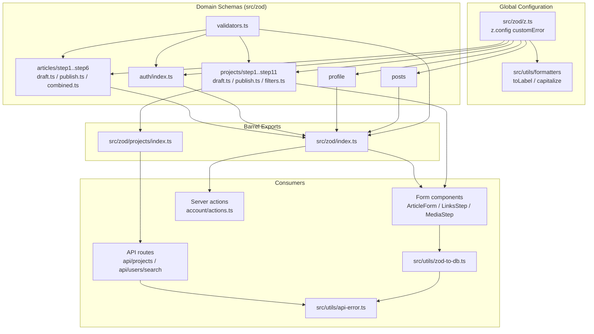
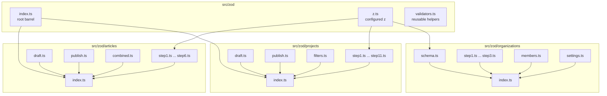
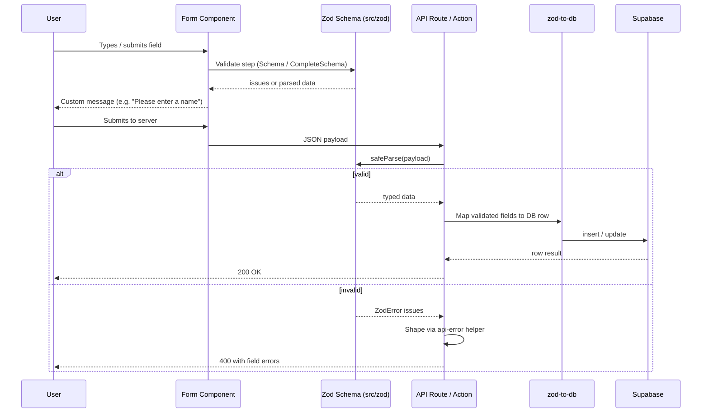

A centralized, modular Zod schema layer that validates every user-facing form and API request in the application, organized by domain with a shared global error-message configuration.

## Purpose and Scope

This page documents the Zod validation subsystem: where schemas live, how the global `z.config(...)` custom-error hook works, how domain schemas are composed for multi-step forms, and how the same schema objects are reused across client forms and server-side API routes.

Covered here:

- The shared `z` instance and its global `customError` behavior in `src/zod/z.ts`.
- The schema directory layout and per-domain barrel exports (`src/zod/index.ts`, `src/zod/projects/index.ts`, `src/zod/articles/index.ts`, etc.).
- The *draft / complete / publish / schemaObject* schema quartet used by multi-step form wizards.
- Reusable validator helpers exported from `src/zod/validators.ts`.
- The bridge between validated form data and database rows (`src/utils/zod-to-db.ts`) and API error shaping (`src/utils/api-error.ts`).

Related topics intentionally left to sibling pages:

- For general formatting/utility helpers such as `toLabel` and `capitalize` used by the error hook, see the other pages under `9-config-and-utils`.
- For the Supabase-generated `TablesUpdate` types consumed by the database mapping layer, see the database/types pages.
- For the form components that consume these schemas (`ArticleForm`, `ProjectIdentitySection`, `LinksStep`, `MediaStep`), see the component/form pages.

## Overview

Rather than scattering inline `z.object({...})` definitions across UI components, the codebase centralizes every validation contract under `src/zod/`. This produces three concrete benefits:

1. **Single source of truth.** A field's length limits, enum membership, and URL/email formats are declared once and reused by both the client-side form resolver and the server-side API route handler.
2. **Consistent user-facing copy.** A single global configuration intercepts Zod's low-level issue codes (`invalid_type`, `too_big`, `too_small`) and rewrites them into human sentence fragments such as `Please enter a first name` or `Bio cannot exceed 500 characters`. Without this, each schema would have to hand-write every message.
3. **Per-domain, per-step composition.** Large flows (project creation with 11 steps, article creation with 6 steps) are split into one file per step, then recombined into draft/publish schemas so that a partially-filled wizard can be persisted early while a final submission is strictly validated.

The terminology below is used throughout this page:

| Term | Meaning |
| --- | --- |
| `z` | The customized Zod instance re-exported from `src/zod/z.ts`; every schema file imports this, not `zod` directly. |
| `customError` | The global error-message callback registered via `z.config(...)`. |
| `*SchemaObject` | A raw `z.object` shape (a plain object of Zod fields) that can be `.extend()`ed or `.pick()`ed by other schemas. |
| `*Schema` | A runnable `ZodObject` schema, typically produced from the corresponding `*SchemaObject`. |
| `*CompleteSchema` | A schema requiring that every field be provided (used to gate step completion). |
| `*PublishSchema` | A stricter schema applied at final submission time. |

## Architecture

The subsystem has four layers: a global configuration layer, a domain-schema layer, a composition/barrel layer, and a set of consumers (forms, API routes, DB mapping).



Each arrow above corresponds to a verified import: the schema files import the customized `z` instance from `src/zod/z.ts`, the domain barrels re-export step files, and consumers import either the domain barrel (`@/zod/projects`, `@/zod/organizations`) or the root barrel.

> Sources:
> - [z.ts](https://github.com/ozeaon/ozeaon-v2/blob/0a4f1a95824db87782f1221a4108019d174df3d9/src/zod/z.ts#L1-L37)
> - [index.ts](https://github.com/ozeaon/ozeaon-v2/blob/0a4f1a95824db87782f1221a4108019d174df3d9/src/zod/index.ts#L1-L17)
> - [index.ts](https://github.com/ozeaon/ozeaon-v2/blob/0a4f1a95824db87782f1221a4108019d174df3d9/src/zod/projects/index.ts#L1-L95)
> - [api-error.ts](https://github.com/ozeaon/ozeaon-v2/blob/0a4f1a95824db87782f1221a4108019d174df3d9/src/utils/api-error.ts#L1-L2)

## The Global `z` Instance and Custom Error Messages

Every schema in the repository imports `z` from the internal module rather than from the `zod` package, because that module registers a **global** error-message strategy at import time. This is the single most important design decision in the subsystem: it lets individual schemas stay terse (no per-field `message` strings) while still producing fully-formed English sentences in the UI.

```typescript
import { z } from "zod";
import { toLabel, capitalize } from "@/utils/formatters";

z.config({
  customError: (iss) => {
    if (
      iss.code === "invalid_type" &&
      (iss.input === undefined || iss.input === null)
    ) {
      const name = iss.path?.at(-1);
      if (typeof name === "string") {
        const label = toLabel(name);
        const article = /^[aeiou]/i.test(label) ? "an" : "a";
        return `Please enter ${article} ${label}`;
      }
      return "This field is required";
    }

    if (iss.code === "too_big" && iss.origin === "string") {
      const name = iss.path?.at(-1);
      if (typeof name === "string") {
        return `${capitalize(toLabel(name))} cannot exceed ${iss.maximum} characters`;
      }
      return `Cannot exceed ${iss.maximum} characters`;
    }

    if (iss.code === "too_small" && iss.origin === "string") {
      const name = iss.path?.at(-1);
      if (typeof name === "string") {
        return `${capitalize(toLabel(name))} must be at least ${iss.minimum} characters`;
      }
      return `Must be at least ${iss.minimum} characters`;
    }
  },
});

export { z };
```

> Source: [z.ts](https://github.com/ozeaon/ozeaon-v2/blob/0a4f1a95824db87782f1221a4108019d174df3d9/src/zod/z.ts#L1-L37)

### How the hook builds a message

The callback receives a single Zod issue (`iss`) and returns a string or `undefined`. Returning `undefined` tells Zod to fall back to its built-in message for that issue. The three handled branches are:

| Issue code | Guard | Derived field name | Produced message |
| --- | --- | --- | --- |
| `invalid_type` | `iss.input` is `undefined` or `null` | `iss.path.at(-1)` | `Please enter a first name` / `Please enter an email` (article chosen by vowel test) |
| `too_big` | `iss.origin === "string"` | `iss.path.at(-1)` | `Bio cannot exceed 500 characters` |
| `too_small` | `iss.origin === "string"` | `iss.path.at(-1)` | `Bio must be at least 10 characters` |

Key implementation details worth noting for anyone extending this:

1. **The field name comes from the last path segment.** `iss.path?.at(-1)` intentionally reads only the *leaf* key. For a nested field such as `socials.linkedin`, the message says "Linkedin …" rather than the full dotted path — a deliberate choice to keep messages short because each form label already provides context.
2. **A/an is computed, not hardcoded.** `/^[aeiou]/i.test(label)` selects the indefinite article, so `email` renders "Please enter an email" while `name` renders "Please enter a name".
3. **Missing-name fallbacks exist.** If the path is empty or the leaf key is not a string (e.g. an array index in a list field), the branch falls back to generic copy: `This field is required`, `Cannot exceed N characters`, or `Must be at least N characters`.
4. **Only string origins are rewritten for size errors.** `too_big`/`too_small` issues on numbers, arrays, or dates fall through to `undefined` and therefore keep Zod's default wording. This prevents nonsensical "cannot exceed 3 characters" copy on a numeric field.
5. **The hook returns `undefined` implicitly** for all other codes (e.g. `invalid_format`, `invalid_enum_value`, `custom`), so schemas that need specific `refine`/`regex` messages must still supply them locally.

### Why a global hook instead of per-field messages

The alternative — attaching `message:` to every `.min()`/`.max()` call — would duplicate near-identical strings hundreds of times across the domain schema files. The global hook collapses that into roughly 30 lines and guarantees that changing the tone of the copy is a one-file change. The trade-off is that the hook is *path-shape sensitive*: field keys are converted to labels mechanically by `toLabel`, so a schema key like `linkedinUrl` produces the label "Linkedin Url" unless `toLabel` handles the casing.

## Schema Directory Layout and Organization

Schemas are grouped by **domain**, and within a domain by **wizard step**, with dedicated files for the draft/publish variants.



> Sources:
> - [index.ts](https://github.com/ozeaon/ozeaon-v2/blob/0a4f1a95824db87782f1221a4108019d174df3d9/src/zod/index.ts#L1-L17)
> - [index.ts](https://github.com/ozeaon/ozeaon-v2/blob/0a4f1a95824db87782f1221a4108019d174df3d9/src/zod/projects/index.ts#L1-L95)
> - [z.ts](https://github.com/ozeaon/ozeaon-v2/blob/0a4f1a95824db87782f1221a4108019d174df3d9/src/zod/z.ts#L37)
> - [LinksStep.tsx](https://github.com/ozeaon/ozeaon-v2/blob/0a4f1a95824db87782f1221a4108019d174df3d9/src/components/organizations/form/steps/LinksStep.tsx#L8-L9)

## The Four-Variant Schema Pattern

The most distinctive convention in this codebase is that **every wizard step exports four related symbols** with a predictable naming scheme. The projects barrel makes the contract explicit:

```typescript
// Step 1 schemas (project type)
export {
  projectStep1Schema,
  projectStep1CompleteSchema,
  projectStep1PublishSchema,
  projectStep1SchemaObject,
} from "./step1";
```

> Source: [index.ts](https://github.com/ozeaon/ozeaon-v2/blob/0a4f1a95824db87782f1221a4108019d174df3d9/src/zod/projects/index.ts#L7-L13)

That same quartet is repeated for steps 1 through 11, which lets the form wizard ask different questions at different moments without maintaining parallel schema copies:

| Symbol suffix | Purpose | Validation posture |
| --- | --- | --- |
| `...SchemaObject` | The raw `z.object` field map. Exported so other schemas can `.extend()` or `.pick()` individual fields without re-declaring them. | None on its own — a shape, not a validator. |
| `...Schema` | The step's default schema. Used for live/partial validation as the user types or advances. | Minimal — only what must be true to keep editing. |
| `...CompleteSchema` | Requires all fields to be present. Used to decide whether a step is "done" and to enable the next-step control. | All fields required, sizes still enforced. |
| `...PublishSchema` | Applied at final submission. | Strictest — cross-field rules and format checks that are acceptable to defer during editing. |

### Why four variants rather than one

A single strict schema would make a multi-step wizard unusable: a user cannot be blocked on step 1 because a field belonging to step 9 is empty. Conversely, a single loose schema would let incomplete data reach the database. Splitting by *completeness level* gives the wizard three distinct validation moments — "can I edit this?", "is this step done?", "is the whole project submittable?" — while sharing one field definition source.

### Draft vs. publish at the aggregate level

Beyond per-step variants, each fully-built domain also exposes aggregate draft and publish schemas. The projects barrel documents this split directly in its comments:

```typescript
// Draft schema (minimal validation)
export { projectDraftSchema, type ProjectDraft } from "./draft";

// Publish schema (strict validation)
export { projectPublishSchema, type ProjectPublish } from "./publish";
```

> Source: [index.ts](https://github.com/ozeaon/ozeaon-v2/blob/0a4f1a95824db87782f1221a4108019d174df3d9/src/zod/projects/index.ts#L1-L5)

The accompanying comment on step 7 records a deliberate *absence* of schema, which is equally important to understand when wiring the wizard:

```typescript
// Step 7 (documents) has no schema — uploads are handled outside the form
```

> Source: [index.ts](https://github.com/ozeaon/ozeaon-v2/blob/0a4f1a95824db87782f1221a4108019d174df3d9/src/zod/projects/index.ts#L55)

Uploads bypass form validation entirely because file selection and storage are managed by a separate upload path, so no field in the wizard model needs to represent them.

### Deferred / detached sections

A second documented exception concerns the comments step, which is currently unwired from the wizard but whose exports are retained:

```typescript
// Step 11 schemas (comments)
// TODO: rewire after phase 0 — exports kept while the Comments section is
// detached from the project creation form.
export {
  projectStep11Schema,
  projectStep11CompleteSchema,
  projectStep11PublishSchema,
  projectStep11SchemaObject,
} from "./step11";
```

> Source: [index.ts](https://github.com/ozeaon/ozeaon-v2/blob/0a4f1a95824db87782f1221a4108019d174df3d9/src/zod/projects/index.ts#L81-L89)

Keeping the exports in place means the schema layer does not need to change when the section is reattached — only the consuming form does.

## Root Barrel and Reusable Validators

The root barrel assembles the entire schema surface into one import path and is organized as commented groups, which makes the domain inventory self-documenting:

```typescript
// Auth schemas
export * from "./auth";

// Article schemas
export * from "./articles";

// Profile schemas
export * from "./profile";

// Project schemas
export * from "./projects";

// Post schemas
export * from "./posts";

// Reusable validation helpers
export * from "./validators";
```

> Source: [index.ts](https://github.com/ozeaon/ozeaon-v2/blob/0a4f1a95824db87782f1221a4108019d174df3d9/src/zod/index.ts#L1-L17)

The final line is the notable one for this page: `validators.ts` exists specifically to hold **cross-domain** primitives (things like a shared URL or email field) so that, for example, the organization `LinksStep` and the project contact step can validate a LinkedIn URL identically instead of each defining its own regex.

### Shared field-level messages

Project field messaging is *not* defined in the schema layer at all — it is imported from constants and re-exported through the projects barrel:

```typescript
// Field configuration
export { REQUIRED_FIELD_MESSAGES } from "../../config/constants/projects";
```

> Source: [index.ts](https://github.com/ozeaon/ozeaon-v2/blob/0a4f1a95824db87782f1221a4108019d174df3d9/src/zod/projects/index.ts#L94-L95)

This means the schema layer adopts the config/constants layer's canonical copy for "required" prompts rather than duplicating strings, keeping validation messaging and display messaging in sync.

## Typed Schema Consumption in Forms

Form step components consume schemas purely as *types*, deriving their prop shapes from the schema via `z.infer`. This keeps the component signature locked to the schema: if a field is added to the schema, the component's generics change automatically.

```typescript
import type { z } from "zod";
import type { organizationSchema } from "@/zod/organizations";
```

> Source: [LinksStep.tsx](https://github.com/ozeaon/ozeaon-v2/blob/0a4f1a95824db87782f1221a4108019d174df3d9/src/components/organizations/form/steps/LinksStep.tsx#L8-L9)

```typescript
import type { z } from "zod";
import type { organizationSchema } from "@/zod/organizations";
```

> Source: [MediaStep.tsx](https://github.com/ozeaon/ozeaon-v2/blob/0a4f1a95824db87782f1221a4108019d174df3d9/src/components/organizations/form/steps/MediaStep.tsx#L11-L12)

```typescript
import type { z } from "zod";
import type { projectPublishSchema } from "@/zod/projects";
```

> Source: [ProjectIdentitySection.tsx](https://github.com/ozeaon/ozeaon-v2/blob/0a4f1a95824db87782f1221a4108019d174df3d9/src/components/projects/form/steps/ProjectIdentitySection.tsx#L20-L21)

Note the pattern: components import `z` as a **type-only** import for `z.infer<typeof schema>` and import the schema itself as a type too. This is a deliberate choice to avoid shipping the schema runtime into client bundles that only need the inferred TypeScript type. The `ArticleForm` component is the exception where the runtime `z` is imported directly, because it performs validation inline:

```typescript
import { z } from "zod";
import { EDIT_GRACE_DAYS } from "@/config/constants/attachments";
```

> Source: [ArticleForm.tsx](https://github.com/ozeaon/ozeaon-v2/blob/0a4f1a95824db87782f1221a4108019d174df3d9/src/components/articles/form/ArticleForm.tsx#L80-L81)

Careful readers should verify whether the `z` import there is constructed by the `zod` package default or by the configured instance — components that need the *customized* messages must import from `@/zod/z`, not `zod`, or the global `customError` hook will not be registered for that schema.

## Server-Side Validation in API Routes

The same schema contracts are enforced at the API boundary. Route handlers import the runtime `z` instance directly and call `safeParse` on query parameters or request bodies:

```typescript
import { NextResponse } from "next/server";
import { z } from "zod";
import { isProjectStatusFilter } from "@/config/constants";
```

> Source: [route.ts](https://github.com/ozeaon/ozeaon-v2/blob/0a4f1a95824db87782f1221a4108019d174df3d9/src/app/api/projects/route.ts#L1-L3)

```typescript
import { NextResponse } from "next/server";
import { z } from "zod";
import { getImageUrl } from "@/utils";
```

> Source: [route.ts](https://github.com/ozeaon/ozeaon-v2/blob/0a4f1a95824db87782f1221a4108019d174df3d9/src/app/api/projects/search/route.ts#L2-L4)

```typescript
import { NextResponse } from "next/server";
import { z } from "zod";
```

> Source: [route.ts](https://github.com/ozeaon/ozeaon-v2/blob/0a4f1a95824db87782f1221a4108019d174df3d9/src/app/api/users/search/route.ts#L3-L4)

Server actions follow the same convention, additionally deriving database update types from the validated shape:

```typescript
import type { TablesUpdate } from "@/types/supabase";
import type { z } from "zod";
import { getAuthUser } from "@/lib/supabase/queries/auth";
```

> Source: [actions.ts](https://github.com/ozeaon/ozeaon-v2/blob/0a4f1a95824db87782f1221a4108019d174df3d9/src/app/(main)/(feed)/(private)/account/actions.ts#L5-L7)

The `import type { z }` in the server action is type-only — the schema *values* used there come from the domain barrels, and the inferred type is fed into `TablesUpdate<...>` so that a schema change surfaces as a TypeScript error at the persistence call site rather than as a silent column mismatch.

## Request Validation Flow

The end-to-end path from a user action to a persisted row involves validation at two independent checkpoints, unified by the shared schema.



Two properties of this flow are worth emphasizing:

1. **The schemas are shared, but the `z` import source may differ.** A form component that imports `z` from the `zod` package gets Zod's *default* messages, while anything importing from `src/zod/z.ts` gets the customized copy. Correct copy on both checkpoints depends on importing the configured instance (or, better, importing the schema objects, which were already constructed with the configured instance).
2. **The DB mapping step is separate from validation.** Validation guarantees shape and size; `zod-to-db` translates the validated object into the column names Supabase expects. These are distinct concerns and distinct files.

## Data Mapping and Error Shaping

Two utilities sit immediately downstream of validation:

| Utility | File | Role |
| --- | --- | --- |
| `zod-to-db` | [zod-to-db.ts](https://github.com/ozeaon/ozeaon-v2/blob/0a4f1a95824db87782f1221a4108019d174df3d9/src/utils/zod-to-db.ts) | Converts a validated form object into the database row shape (snake_case columns, dropped UI-only fields). |
| `api-error` | [api-error.ts](https://github.com/ozeaon/ozeaon-v2/blob/0a4f1a95824db87782f1221a4108019d174df3d9/src/utils/api-error.ts) | Converts a `ZodError` (or generic error) into a structured API response, using the logger for diagnostics. |

The error utility imports both a Zod type and the application logger, confirming that validation failures are logged server-side while a sanitized message is returned to the client:

```typescript
import type { z } from "zod";
import { getLogger, logError } from "@/lib/logger";
```

> Source: [api-error.ts](https://github.com/ozeaon/ozeaon-v2/blob/0a4f1a95824db87782f1221a4108019d174df3d9/src/utils/api-error.ts#L1-L2)

## Failure Modes and Edge Cases

The following behaviors follow directly from the implementation of the global hook and the schema layout:

| Scenario | Behavior | Where it comes from |
| --- | --- | --- |
| Field is missing or `null` | Message becomes `Please enter a/an <label>`; article chosen by vowel test | `invalid_type` branch, [z.ts](https://github.com/ozeaon/ozeaon-v2/blob/0a4f1a95824db87782f1221a4108019d174df3d9/src/zod/z.ts#L6-L17) |
| Field key has no usable leaf name (e.g. array index) | Falls back to `This field is required` | `typeof name === "string"` guard, [z.ts](https://github.com/ozeaon/ozeaon-v2/blob/0a4f1a95824db87782f1221a4108019d174df3d9/src/zod/z.ts#L11-L16) |
| String exceeds `max()` | `<Label> cannot exceed N characters` | `too_big` branch, [z.ts](https://github.com/ozeaon/ozeaon-v2/blob/0a4f1a95824db87782f1221a4108019d174df3d9/src/zod/z.ts#L19-L25) |
| String below `min()` | `<Label> must be at least N characters` | `too_small` branch, [z.ts](https://github.com/ozeaon/ozeaon-v2/blob/0a4f1a95824db87782f1221a4108019d174df3d9/src/zod/z.ts#L27-L33) |
| Number/array/date size violation | Zod's default message, because `iss.origin !== "string"` | Guard clauses in [z.ts](https://github.com/ozeaon/ozeaon-v2/blob/0a4f1a95824db87782f1221a4108019d174df3d9/src/zod/z.ts#L19-L33) |
| Invalid format (email, url, uuid) | Zod's default message — no branch handles it | Hook returns `undefined`, [z.ts](https://github.com/ozeaon/ozeaon-v2/blob/0a4f1a95824db87782f1221a4108019d174df3d9/src/zod/z.ts#L4-L35) |
| Invalid enum value | Zod's default message | Same as above |
| Schema built without the configured `z` | Custom copy is lost; comments/steps differ | Import-source dependency, [z.ts](https://github.com/ozeaon/ozeaon-v2/blob/0a4f1a95824db87782f1221a4108019d174df3d9/src/zod/z.ts#L37) |
| Step 7 (documents) validation | No schema exists; uploads validated elsewhere | Comment in [index.ts](https://github.com/ozeaon/ozeaon-v2/blob/0a4f1a95824db87782f1221a4108019d174df3d9/src/zod/projects/index.ts#L55) |
| Step 11 (comments) validation | Exports exist but are unwired from the wizard | TODO in [index.ts](https://github.com/ozeaon/ozeaon-v2/blob/0a4f1a95824db87782f1221a4108019d174df3d9/src/zod/projects/index.ts#L81-L83) |

### Concurrency and statefulness

`z.config(...)` mutates **global** Zod state and executes at module-evaluation time in `src/zod/z.ts`. Consequences:

- The hook must be registered before any schema is constructed for the custom messages to apply to it. Because schemas import `z` from the same module, evaluation order within that module graph guarantees the config runs first.
- There is exactly one hook; later `z.config` calls elsewhere in the codebase would overwrite it. Search results show no second `z.config` call, so the invariant currently holds.
- Schemas are pure value objects and are safe to share across concurrent requests; only the global config is mutated, and only once.

## Extension Points

| To add… | Do this | Evidence |
| --- | --- | --- |
| A new wizard step | Create `stepN.ts` exporting the four-symbol quartet, then add an `export { ... } from "./stepN"` block to the domain barrel | Pattern in [index.ts](https://github.com/ozeaon/ozeaon-v2/blob/0a4f1a95824db87782f1221a4108019d174df3d9/src/zod/projects/index.ts#L7-L89) |
| A field reused across domains | Add it to `src/zod/validators.ts`; it is already public via the root barrel | `export * from "./validators"` in [index.ts](https://github.com/ozeaon/ozeaon-v2/blob/0a4f1a95824db87782f1221a4108019d174df3d9/src/zod/index.ts#L16-L17) |
| A new domain | Add the folder, then add a commented `export * from "./domain"` group to the root barrel | Grouped exports in [index.ts](https://github.com/ozeaon/ozeaon-v2/blob/0a4f1a95824db87782f1221a4108019d174df3d9/src/zod/index.ts#L1-L15) |
| Better global copy | Edit the `customError` callback in `src/zod/z.ts` | [z.ts](https://github.com/ozeaon/ozeaon-v2/blob/0a4f1a95824db87782f1221a4108019d174df3d9/src/zod/z.ts#L4-L35) |
| A message for a code not yet handled | Add a new `iss.code` branch before the function returns `undefined` | Current three branches in [z.ts](https://github.com/ozeaon/ozeaon-v2/blob/0a4f1a95824db87782f1221a4108019d174df3d9/src/zod/z.ts#L6-L33) |
| A schema that reuses another step's fields | Import the `*SchemaObject` and `.extend()`/`.pick()` it | Object variants exported per step, [index.ts](https://github.com/ozeaon/ozeaon-v2/blob/0a4f1a95824db87782f1221a4108019d174df3d9/src/zod/projects/index.ts#L12) |

## API Reference

### `z.config(options)`

Registers global Zod behavior. In this codebase it is called exactly once, at module load, with a `customError` callback.

**Parameters:**

- `options.customError` (`(iss: z.core.$ZodIssue) => string | undefined`): Receives a Zod issue and returns a message override, or `undefined` to defer to Zod's default.

**Returns:** `void`.

**Recognized issue codes (by this implementation):**

| `iss.code` | Extra guard | Uses `iss.path`, `iss.input`, `iss.maximum`, `iss.minimum` |
| --- | --- | --- |
| `invalid_type` | `iss.input === undefined \|\| iss.input === null` | `path`, `input` |
| `too_big` | `iss.origin === "string"` | `path`, `maximum` |
| `too_small` | `iss.origin === "string"` | `path`, `minimum` |

> Source: [z.ts](https://github.com/ozeaon/ozeaon-v2/blob/0a4f1a95824db87782f1221a4108019d174df3d9/src/zod/z.ts#L1-L37)

### Exported schema symbols (projects domain)

For each step `N` in `1..6` and `8..11`:

- `projectStepNSchema`
- `projectStepNCompleteSchema`
- `projectStepNPublishSchema`
- `projectStepNSchemaObject`

Aggregate schemas:

- `projectDraftSchema` / type `ProjectDraft` — minimal validation, for early persistence.
- `projectPublishSchema` / type `ProjectPublish` — strict validation, for final submission.
- `projectFiltersSchema` / type `ProjectFilters` — query-parameter filtering.

> Source: [index.ts](https://github.com/ozeaon/ozeaon-v2/blob/0a4f1a95824db87782f1221a4108019d174df3d9/src/zod/projects/index.ts#L1-L92)

#### `src/zod/projects/step1.ts` — project type

Single field; optional for navigation, required for completion.

| Field | Schema | Notes |
| --- | --- | --- |
| `project_type_id` | `uuidField()` | `""`/`undefined` preprocessed to `null`, then `z.uuid()`. |

`projectStep1Schema` is `.partial()`. `projectStep1CompleteSchema` adds a `superRefine` that fails with `REQUIRED_FIELD_MESSAGES.project_type_id` ("Please select a project type") when the id is empty. `projectStep1PublishSchema` is an alias of the complete schema.

Consumers: `use-project-form.ts` gates the Basic Info section with `projectStep1CompleteSchema.safeParse(...)`; the schema object is merged into the draft and publish aggregates.

> Source: [step1.ts](https://github.com/ozeaon/ozeaon-v2/blob/0a4f1a95824db87782f1221a4108019d174df3d9/src/zod/projects/step1.ts#L1-L35)

#### `src/zod/projects/step2.ts` — project identity

| Field | Schema | Notes |
| --- | --- | --- |
| `title` | `safeString({ profanity: true }).min(3).max(100)`, optional/nullable | Local min message; max from `PROJECT_FIELD_LIMITS.title` |
| `tagline` | `safeString({ profanity: true }).max(140)`, optional/nullable | |
| `location` | `safeString().max(255)`, nullable/optional | |
| `latitude` / `longitude` | `z.number().nullable().optional()` | |
| `cover_image_url` / `logo_url` | `urlField()` | `""` preprocessed to `null` |
| `cover_image_id` / `logo_image_id` | `uuidField()` | |

`projectStep2Schema` is `.partial()`. `projectStep2CompleteSchema` and `projectStep2PublishSchema` are two separate declarations of the same `superRefine`: `title` and `tagline` must be non-empty after trimming (`REQUIRED_FIELD_MESSAGES.title` / `.tagline`).

Consumers: `use-project-form.ts` gates the Details section with the complete schema; `ProjectIdentitySection` derives its prop types from `projectPublishSchema`.

> Source: [step2.ts](https://github.com/ozeaon/ozeaon-v2/blob/0a4f1a95824db87782f1221a4108019d174df3d9/src/zod/projects/step2.ts#L1-L84)

#### `src/zod/projects/step3.ts` — categories, SDGs & tags

| Field | Schema | Notes |
| --- | --- | --- |
| `subcategories` | `jsonArrayField(z.uuid({ message: "Invalid category selected" }))` | Accepts native arrays or nullable/optional |
| `sdgs` | `jsonArrayField(z.coerce.number().int().min(1).max(17))` | Explicit "must be between 1 and 17" bounds |
| `tags` | `refiners.tags({ maxCount: 50, maxLength: 100, charset: false })` | Comma-separated string; the charset restriction is disabled here, the per-tag profanity check stays on |

`projectStep3Schema` is `.partial()`. `projectStep3CompleteSchema` and `projectStep3PublishSchema` are identical `superRefine`s requiring at least one subcategory and a non-empty `tags` string.

> The step's doc comment says completion requires "sdgs >= 1", but the refinement never checks `sdgs` — SDGs are optional at completion and at publish time.

Consumers: `use-project-form.ts` gates the Categories section with the complete schema.

> Source: [step3.ts](https://github.com/ozeaon/ozeaon-v2/blob/0a4f1a95824db87782f1221a4108019d174df3d9/src/zod/projects/step3.ts#L1-L77)

#### `src/zod/projects/step4.ts` — project configuration

| Field | Schema | Notes |
| --- | --- | --- |
| `funding_enabled` / `rounds_enabled` / `donations_enabled` / `organisation_enabled` | `z.boolean().optional().default(false)` | Feature toggles |
| `currency_id` | `uuidField()` | |
| `funding_goal` | preprocess of `""`/`null`/`undefined` to `null`, then `z.number().positive().nullable().optional()` | Lets an empty input clear a previously set goal |
| `linked_organization_id` | `uuidField()` | |
| `organizationConnectMode` | `z.enum(["connect", "skip", "auto"]).optional()` | UI-only choice for organisation linking; seeded in `use-project-form` default values |

All four variants are `.partial()` — the section is never treated as complete; the complete schema is exported only to satisfy the section map type (per its doc comment).

> Source: [step4.ts](https://github.com/ozeaon/ozeaon-v2/blob/0a4f1a95824db87782f1221a4108019d174df3d9/src/zod/projects/step4.ts#L1-L36)

#### `src/zod/projects/step5.ts` — project content

Each entry of the `sections` array is a `sectionItemSchema`:

| Field | Schema | Notes |
| --- | --- | --- |
| `slug` | `safeString()` | Stable key; the publish aggregate looks up `slug === "overview"` |
| `label` | `safeString({ profanity: true })` | No length cap applied — `PROJECT_FIELD_LIMITS.sectionName` (150) is unused here |
| `intro` | `safeString().max(120)`, nullable/optional | |
| `body` | `safeString().max(3000)`, nullable/optional | |
| `sort_order` | `z.number().int().default(0)` | |
| `is_custom` | `z.boolean().default(false)` | |
| `image_id` / `image_url` | `uuidField()` / `urlField()` | |

The step object adds `start_date` / `end_date` (`z.string().nullable().optional()`) and `sections` (optional array). `projectStep5PublishSchema` and `projectStep5CompleteSchema` are both `applyDateValidations(...)`: dates must parse, fall between 1900 and the current year + 10, and `end_date` cannot precede `start_date` (issue reported at `end_date`); dates remain optional. Type export: `SectionItem`, imported by `use-project-form.ts`.

> Source: [step5.ts](https://github.com/ozeaon/ozeaon-v2/blob/0a4f1a95824db87782f1221a4108019d174df3d9/src/zod/projects/step5.ts#L1-L49)

#### `src/zod/projects/step6.ts` — team members

Each entry of the optional `team_members` array (maps to the `project_team` table):

| Field | Schema | Notes |
| --- | --- | --- |
| `id` / `user_id` | `uuidField()` | `user_id` links a registered user |
| `name` | `safeString({ profanity: true }).max(200)`, nullable/optional | Required per item — "Please enter the member's name" |
| `username` | `safeString()`, nullable/optional | Fallback handle for non-users |
| `role` | `safeString({ profanity: true }).max(200)`, nullable/optional | Required per item — "Please enter the member's role" |
| `bio` | `safeString().max(3000)`, nullable/optional | |
| `is_owner` | `z.boolean().optional()` | Display-only; derived server-side on read, never written back |
| `sort_order` | `z.number().int().optional()` | |

The per-item `name`/`role` requirements come from running `applyRequiredValidations` on the item schema before it is wrapped in the array. All three step variants are `.partial()`. Type export: `TeamMember`.

> Source: [step6.ts](https://github.com/ozeaon/ozeaon-v2/blob/0a4f1a95824db87782f1221a4108019d174df3d9/src/zod/projects/step6.ts#L1-L52)

#### `src/zod/projects/step8.ts` — FAQs

Each entry of the optional `faqs` array:

| Field | Schema | Notes |
| --- | --- | --- |
| `id` | `uuidField()` | |
| `question` | `safeString()` | Required per item — "Please enter a question" |
| `answer` | `safeString()` | Required per item — "Please enter an answer" |
| `sort_order` | `z.number().int().optional()` | |

All three step variants are `.partial()`. Type export: `FAQItem`.

> Source: [step8.ts](https://github.com/ozeaon/ozeaon-v2/blob/0a4f1a95824db87782f1221a4108019d174df3d9/src/zod/projects/step8.ts#L1-L40)

#### `src/zod/projects/step9.ts` — contact information

| Field | Schema | Notes |
| --- | --- | --- |
| `contact_email` | `emailField()` | `""` preprocessed to `null`, then `z.email()` |
| `contact_is_public` | `z.boolean().optional().default(true)` | Public/private visibility of the email |
| `website_url` | `urlField({ profanity: true })` | |

All three step variants are `.partial()`.

> Source: [step9.ts](https://github.com/ozeaon/ozeaon-v2/blob/0a4f1a95824db87782f1221a4108019d174df3d9/src/zod/projects/step9.ts#L1-L26)

#### `src/zod/projects/step10.ts` — related content

| Field | Schema | Notes |
| --- | --- | --- |
| `related_articles` | `z.array(relatedItemSchema).optional()` | Item: `{ id: z.uuid(), title?: string }` |
| `related_projects` | same item schema, optional | |

All three step variants are `.partial()`. Type export: `RelatedItem`.

> Source: [step10.ts](https://github.com/ozeaon/ozeaon-v2/blob/0a4f1a95824db87782f1221a4108019d174df3d9/src/zod/projects/step10.ts#L1-L31)

#### `src/zod/projects/step11.ts` — comments settings

| Field | Schema | Notes |
| --- | --- | --- |
| `comments_enabled` | `z.boolean().optional().default(false)` | The article equivalent (step 6) defaults to `true` |

All three step variants are `.partial()`. The section is detached from the wizard — see the step 11 note under "The Four-Variant Schema Pattern".

> Source: [step11.ts](https://github.com/ozeaon/ozeaon-v2/blob/0a4f1a95824db87782f1221a4108019d174df3d9/src/zod/projects/step11.ts#L1-L23)

#### Projects draft, publish and filters aggregates

`projectDraftSchema` (type `ProjectDraft`, `src/zod/projects/draft.ts`): merges every step schema object — including the detached step 11 — applies `.partial()`, wraps with `applyDateValidations`, then requires `title` and `tagline`. Consumed by `use-project-form.ts` for draft saves and by the `api/projects` and `api/projects/[id]` routes, which pick `isPublishing ? projectPublishSchema : projectDraftSchema`.

`projectPublishSchema` (type `ProjectPublish`, `src/zod/projects/publish.ts`): the same flat merge without `.partial()` — its doc comment explains the flat shape avoids intersection-type field access problems in API routes — then `applyDateValidations`, `applyRequiredValidations` for `project_type_id` / `title` / `tagline`, and a final `superRefine` requiring at least one subcategory, a non-empty `tags` string, and a `sections` entry with `slug === "overview"` whose `intro` and `body` are non-empty (issues reported at `sections.<idx>.intro` / `.body`). Consumed as the `zodResolver` in `use-project-form.ts`, which also derives its `z.input`/`z.output` form types from it; `ProjectIdentitySection` imports it type-only.

`projectFiltersSchema` (type `ProjectFilters`, `src/zod/projects/filters.ts`): fields `categories`, `sdgs`, `projectTypeIds` (string arrays) and `from` / `to` (nullable strings), wrapped with the date-field validators for both dates plus the range check ("End date cannot be before start date"). Consumed by `ProjectsFilterDialog` as its `zodResolver`.

> Sources:
> - [draft.ts](https://github.com/ozeaon/ozeaon-v2/blob/0a4f1a95824db87782f1221a4108019d174df3d9/src/zod/projects/draft.ts#L1-L56)
> - [publish.ts](https://github.com/ozeaon/ozeaon-v2/blob/0a4f1a95824db87782f1221a4108019d174df3d9/src/zod/projects/publish.ts#L1-L86)
> - [filters.ts](https://github.com/ozeaon/ozeaon-v2/blob/0a4f1a95824db87782f1221a4108019d174df3d9/src/zod/projects/filters.ts#L1-L24)

### Exported schema symbols (articles domain)

Articles follow the same split, with per-step files plus `draft.ts`, `publish.ts`, and `combined.ts`, surfaced through `src/zod/articles/index.ts`. The `combined.ts` module holds the shared sub-schemas (article type, content file, autosave payload, author) plus a flat whole-article reference schema; the aggregate draft/publish composition lives in `draft.ts` and `publish.ts` as in projects.

> Source: [index.ts](https://github.com/ozeaon/ozeaon-v2/blob/0a4f1a95824db87782f1221a4108019d174df3d9/src/zod/index.ts#L4-L5)

Unlike the projects domain, each article step exports only a two-symbol pair — `articleStepNSchemaObject` and `articleStepNPublishSchema`. There are no per-step `...Schema` / `...CompleteSchema` exports (step 6 defines them, but the barrel does not re-export them), so step-completion gating lives in the `ArticleForm` component rather than in the schema layer.

#### `src/zod/articles/combined.ts` — shared sub-schemas

| Export | Shape | Notes |
| --- | --- | --- |
| `articleTypeSchema` | `{ id: uuid, name (max 255), description (max 255, nullable), slug (max 50), code (max 50) }` | Embedded row for `article_type` |
| `contentFileSchema` | `{ id: uuid, path: string }` | Uploaded content file reference |
| `contentAutosaveSchema` | `{ documentId, json (Tiptap doc), html (1–500,000 chars), etag? }` | Editor autosave request; a matching `etag` lets the server skip the upload |
| `authorSchema` | `{ user_id (uuidField), display_name (max 100 + proper-name chars), orcid (optional, ORCID format), role (required), is_corresponding (default false) }` | Item of the `authors` array |
| `articleCombinedSchema` | Flat whole-article object, field groups commented by step | Reference/typing shape; the publish path composes per-step schemas instead |

Two type guards, `isResearchOrIP` and `isVolunteeringOrField`, encode the article-type groupings the refinements branch on. `articleTextFieldsSchema` picks the 16 free-text fields from `articleCombinedSchema` and runs a `superRefine` over every non-empty value: malicious-content patterns are rejected (an issue on `content_text` is remapped to `content`), and every field except `title`/`subtitle` must start with a letter or number.

Consumers: `ArticleForm` parses with `articleTextFieldsSchema` and imports from this module directly; `api/articles/[id]/content/route.ts` validates autosave bodies with `contentAutosaveSchema`; `ContentSection` imports `isResearchOrIP`; `articles/step1.ts` and `articles/step4.ts` build on `articleTypeSchema`, `contentFileSchema` and `authorSchema`.

> Source: [combined.ts](https://github.com/ozeaon/ozeaon-v2/blob/0a4f1a95824db87782f1221a4108019d174df3d9/src/zod/articles/combined.ts#L1-L278)

#### `src/zod/articles/step1.ts` — core identity & content

The largest schema in the subsystem:

| Field | Schema | Notes |
| --- | --- | --- |
| `title` | `safeString({ profanity: true }).trim().min(3).max(120)` + `titleChars` + `hasAlphaNum` | Local messages: min length, "Title is too long. Recommended length is 50-70 symbols", allowed-punctuation and at-least-one-alphanumeric |
| `slug` | `z.string().nullable()` | Not optional |
| `subtitle` | `safeString({ profanity: true }).max(120)`, optional/nullable | Character set + alphanumeric refines; `superRefine` requires 50 chars when provided ("Recommended length ~80 symbols") |
| `article_type_id` | `z.uuid(VALIDATION_MESSAGES.article_type_id)` | |
| `article_type` | `articleTypeSchema` | Drives the type-conditional refinements below |
| `linked_project_id` / `linked_project` | `z.uuid()` + display object (`title`, `logo_image.path`), optional/nullable | Display object is UI-only |
| `linked_organization_id` / `linked_organization` | same pattern | |
| `external_organization_name` / `external_organization_url` | string / URL refine | "Invalid URL format for external organization" |
| `external_publish_date` | `z.coerce.date()` + not-in-future refine | "Publishing cannot be in the future" |
| `journal_publisher` / `external_publish_url` | string / URL refine | "Invalid URL format for external publication" |
| `summary` | `safeString().max(1500)` + `superRefine` | Min 300 chars when provided ("…for better indexing") |
| `abstract` | `safeString().min(800).max(3000)`, optional/nullable | Strengthened cross-field for research/IP types |
| `content` | Tiptap doc `{ type: "doc", content: [] }`, optional/nullable | The rendered editor value |
| `content_text` | plain `z.string()`, optional/nullable | Deliberately *not* `safeString()` — see `refineContentText` |
| `content_file` | `contentFileSchema`, optional/nullable | |
| `text_only_publication` | `z.coerce.boolean().optional()` | |
| `pdf_file_url` | `z.string()`, optional/nullable | Its own URL refine is commented out; the requirement is enforced cross-field instead |
| `geographic_scope` / `geographic_scope_country` | strings, optional/nullable | |
| `location_details` | `z.string().max(255)` | |
| `language` | `z.string()` + `refiners.bcp47` | "Language must be selected from the list" |
| `doi` | `refiners.doi` | "Expecting '10.1000/xyz123'" |

> Note: `z.coerce.boolean()` coerces via `Boolean()`, so any non-empty string — including `"false"` — parses as `true`. This applies to `text_only_publication` here and to the boolean fields of steps 5–6.

The step also exports two reusable refinement functions and keeps four private ones, all attached only at publish time:

| Refinement | Checks | Error (path) |
| --- | --- | --- |
| `refineContentLength` (exported) | Word count ≤ 5,000; length ≤ 30,000 (`content.max`); length ≥ 2,000 (`content.min`) when checked | "Content text must be under 5,000 words" etc. (`content`) |
| `refineContentText` (exported) | Malicious-content patterns and profanity in `content_text` | Remapped to `content`, the field the form renders |
| `refineAbstract` | Research/IP types require an `abstract` of at least 800 chars | "Abstract is required for \<type\> type" (`abstract`) |
| `refineContentAndUrl` | Content caps; non-research/IP need ≥ 2,000 chars; research/IP in non-text-only mode need a PDF; text-only mode needs a body | "Article paper must be uploaded…" (`pdf_file_url`), content messages (`content`) |
| `refineLocation` | Field-insight/volunteering need a `local`/`regional` scope and location details | Issues on both `geographic_scope_country` and `location_details` |
| `refineLinkedProject` | `project_log` type requires `linked_project_id` | "You must link existing project…" (`linked_project_id`) |

`articleStep1PublishSchema` = `applyRequiredValidations` for `title`, `summary` and `article_type_id`, then the six `superRefine`s in the order linked project → abstract → content/URL → content length → location → content text.

> Source: [step1.ts](https://github.com/ozeaon/ozeaon-v2/blob/0a4f1a95824db87782f1221a4108019d174df3d9/src/zod/articles/step1.ts#L1-L403)

#### `src/zod/articles/step2.ts` — alignment & indexing

| Field | Schema | Notes |
| --- | --- | --- |
| `subcategories` | `jsonArrayField(z.uuid(...))` | "Invalid category selected, please try again" |
| `tags` | `refiners.tags()` | Uses the `strings.ts` defaults (20 tags × 50 chars), not `ARTICLE_FIELD_LIMITS.tags` (10 × 20) which `combined.ts` applies |
| `sdgs` | `jsonArrayField(z.coerce.number().int().min(1).max(17))` | |

`articleStep2PublishSchema` requires `subcategories` via `applyRequiredValidations`, then a `superRefine` requiring non-empty `subcategories`, `sdgs` and `tags` (messages from `VALIDATION_MESSAGES.categories` / `.sdgs` / `.tags`).

> Source: [step2.ts](https://github.com/ozeaon/ozeaon-v2/blob/0a4f1a95824db87782f1221a4108019d174df3d9/src/zod/articles/step2.ts#L1-L51)

#### `src/zod/articles/step3.ts` — access & license

| Field | Schema | Notes |
| --- | --- | --- |
| `license_type_id` / `license_type` | `uuidField()` + row `{ id (nonoptional), name, description, url, is_custom }` | |
| `custom_license` | string, optional/nullable | Its required-when-custom check is commented out pending a validation spec review |
| `access_level_id` / `access_level` | `uuidField()` + row `{ id, name, description, requires_embargo_date }` | |
| `embargo_end_date` | string, optional/nullable | Required cross-field (below) |
| `commercial_use_allowed` / `derivatives_allowed` | `z.coerce.boolean().default(true)` | |
| `attribution_text` | string, optional/nullable | |
| `jurisdiction_notes` | `z.string().max(255)` | |

`articleStep3PublishSchema` requires `license_type_id` and `access_level_id`, then requires `embargo_end_date` when the selected access level's `requires_embargo_date` is set (`VALIDATION_MESSAGES.embargo_date`, path `embargo_end_date`).

> Source: [step3.ts](https://github.com/ozeaon/ozeaon-v2/blob/0a4f1a95824db87782f1221a4108019d174df3d9/src/zod/articles/step3.ts#L1-L64)

#### `src/zod/articles/step4.ts` — authors & relations

| Field | Schema | Notes |
| --- | --- | --- |
| `authors` | `jsonArrayField(authorSchema)` | |
| `funding_source_id` / `funding_source` | `uuidField()` + `{ id, name, description?, code }` (`.exactOptional()`, nullable) | |
| `funding_details` | string, optional/nullable | |

`articleStep4PublishSchema` requires `authors`, then a `superRefine` enforcing: at least one author; at least one flagged `is_corresponding` (path `authors.0.is_corresponding`); every author has a `display_name` (path `authors.<idx>.display_name`); `funding_details` when `funding_source.code === "other"`; and `funding_source_id` whenever `funding_details` is provided.

> Source: [step4.ts](https://github.com/ozeaon/ozeaon-v2/blob/0a4f1a95824db87782f1221a4108019d174df3d9/src/zod/articles/step4.ts#L1-L77)

#### `src/zod/articles/step5.ts` — media & publishing

| Field | Schema | Notes |
| --- | --- | --- |
| `cover_image_url` | string, nullable/optional | |
| `published` | `z.coerce.boolean()` | |
| `indigenous_knowledge_flag` | `z.coerce.boolean().default(false)` | |
| `indigenous_macro_region_id` | `uuidField()` | |
| `indigenous_sub_region` / `indigenous_peoples_nations` / `indigenous_local_territory` | strings, optional/nullable | |

The `superRefine` here is attached to the schema object itself, so it applies to every variant, not just publish: when `indigenous_knowledge_flag` is set, `indigenous_macro_region_id` ("Please select macro region") and `indigenous_sub_region` ("Please provide sub region name") become required. `articleStep5PublishSchema` is a direct alias of the schema object.

> Source: [step5.ts](https://github.com/ozeaon/ozeaon-v2/blob/0a4f1a95824db87782f1221a4108019d174df3d9/src/zod/articles/step5.ts#L1-L34)

#### `src/zod/articles/step6.ts` — comments settings

| Field | Schema | Notes |
| --- | --- | --- |
| `comments_enabled` | `z.boolean().optional().default(true)` | Defaults to `true`, unlike the project equivalent (step 11, `false`) |

All three variants defined in the file (`articleStep6Schema`, `articleStep6CompleteSchema`, `articleStep6PublishSchema`) are `.partial()`; only the publish schema and the schema object are re-exported by the barrel.

> Source: [step6.ts](https://github.com/ozeaon/ozeaon-v2/blob/0a4f1a95824db87782f1221a4108019d174df3d9/src/zod/articles/step6.ts#L1-L23)

#### Articles draft and publish aggregates

`articleDraftSchema` (type `ArticleDraft`, `src/zod/articles/draft.ts`): merges the six step schema objects, applies `.partial()`, wraps with `applyDateValidations`, requires only `title` and `article_type_id`, then applies `refineContentText` and `.describe("Article Draft Schema")`.

> The date validations are currently inert here: `applyDateValidations` inspects `start_date` / `end_date`, which the merged article object never defines, so those checks pass vacuously — the file's doc comment advertises date validation the shape cannot trigger.

`articlePublishSchema` (type `ArticlePublish`, `src/zod/articles/publish.ts`): an `.and()` intersection of all six per-step publish schemas, described as "Article Publication Schema". `articlePublishParserSchema` (type `ArticlePublishParser`) is instead a flat merge of the six schema objects with thirteen UI-only fields omitted (`article_type`, `access_level`, `license_type`, `funding_source`, `content_text`, `content_file`, `linked_project`, `linked_organization`, and the five `indigenous_*` fields) — the payload shape the API route parses before DB mapping.

Consumers: `ArticleForm` resolves against `articlePublishSchema` or `articleDraftSchema` depending on mode; `ArticleCoverUpload` imports the draft schema; `api/articles/route.ts` picks draft vs publish the same way and parses the persistable payload with `articlePublishParserSchema` (the route also borrows `z.infer<typeof articleStep4SchemaObject>["authors"]` for its author typing); `zod-to-db.ts` documents the hand-off from the parser schema.

> Sources:
> - [draft.ts](https://github.com/ozeaon/ozeaon-v2/blob/0a4f1a95824db87782f1221a4108019d174df3d9/src/zod/articles/draft.ts#L1-L57)
> - [publish.ts](https://github.com/ozeaon/ozeaon-v2/blob/0a4f1a95824db87782f1221a4108019d174df3d9/src/zod/articles/publish.ts#L1-L51)

### Organizations domain (`src/zod/organizations/`)

The domain barrel (`src/zod/organizations/index.ts`) re-exports `step1`–`step3`, `schema.ts`, `settings.ts` and `members.ts`. It is consumed via the `@/zod/organizations` deep path and is not part of the root barrel. Organizations export no `...PublishSchema` variants — submission-time strictness comes from `organizationSchema`, and step completion from the `...CompleteSchema` exports.

#### `src/zod/organizations/step1.ts` — details

| Field | Schema | Notes |
| --- | --- | --- |
| `name` | `safeString({ profanity: true }).max(120)` | Required |
| `slug` | `safeString({ profanity: true }).max(120)` + `refiners.slugChars` | "Slug may only contain lowercase letters, numbers, and hyphens"; required |
| `organization_type_id` | `uuidField()` | Required |
| `mission` | `safeString().max(120)` | Required |
| `description` | `safeString().max(3000)`, optional/nullable | |
| `contact_email` | `emailField()` | |
| `location` | `safeString().max(255)`, optional/nullable | |
| `latitude` / `longitude` | `z.number().nullable().optional()` | |

`organizationStep1Schema` is `.partial()`; `organizationStep1CompleteSchema` is `applyRequiredValidations` with `ORG_REQUIRED_FIELD_MESSAGES` (name, slug, type, mission). Consumed by `use-organization-form.ts`, which gates the section with the complete schema.

> Source: [step1.ts](https://github.com/ozeaon/ozeaon-v2/blob/0a4f1a95824db87782f1221a4108019d174df3d9/src/zod/organizations/step1.ts#L1-L34)

#### `src/zod/organizations/step2.ts` — media

| Field | Schema | Notes |
| --- | --- | --- |
| `logo_image_id` / `cover_image_id` | `uuidField()` | |

`organizationStep2Schema` is `.partial()`; `organizationStep2CompleteSchema` is the full object, so both image ids are required for completion.

> Source: [step2.ts](https://github.com/ozeaon/ozeaon-v2/blob/0a4f1a95824db87782f1221a4108019d174df3d9/src/zod/organizations/step2.ts#L1-L11)

#### `src/zod/organizations/step3.ts` — links

| Field | Schema | Notes |
| --- | --- | --- |
| `website_url` / `linkedin_url` | `urlField({ profanity: true })` | |
| `custom_links` | array of `{ id?: uuid, url: requiredUrlField({ profanity: true }) }`, optional/nullable | Each link URL is mandatory |

`organizationStep3Schema` is `.partial()`; `organizationStep3CompleteSchema` is the full object. Type export: `OrganizationCustomLink`.

> Source: [step3.ts](https://github.com/ozeaon/ozeaon-v2/blob/0a4f1a95824db87782f1221a4108019d174df3d9/src/zod/organizations/step3.ts#L1-L19)

#### `src/zod/organizations/schema.ts` — the aggregate

`organizationSchema` (type `Organization`) merges the three step objects and applies `applyRequiredValidations` with `ORG_REQUIRED_FIELD_MESSAGES`. Consumed by `use-organization-form.ts` (resolver plus `z.input`/`z.output` form types), type-only by `MediaStep` and `LinksStep`, and by `api/organizations/route.ts` to `safeParse` the create payload.

> Source: [schema.ts](https://github.com/ozeaon/ozeaon-v2/blob/0a4f1a95824db87782f1221a4108019d174df3d9/src/zod/organizations/schema.ts#L1-L17)

#### `src/zod/organizations/settings.ts` — settings form

`organizationSettingsSchemaObject` picks the nine step 1 fields and extends them with `logo_image_id`, `cover_image_id`, `website_url`, `linkedin_url` and `custom_links`. `organizationSettingsSchema` applies `ORG_REQUIRED_FIELD_MESSAGES`; note its `custom_links` entries use the optional `urlField`, whereas the step 3 creation-form links use `requiredUrlField`. Types: `OrganizationSettings`, `OrgCustomLink`. Consumed by `OrganizationSettingsForm` (resolver) and `api/organizations/[id]/route.ts` (`safeParse` on update).

> Source: [settings.ts](https://github.com/ozeaon/ozeaon-v2/blob/0a4f1a95824db87782f1221a4108019d174df3d9/src/zod/organizations/settings.ts#L1-L37)

#### `src/zod/organizations/members.ts` — membership mutations

| Export | Shape | Consumers |
| --- | --- | --- |
| `InviteBodySchema` | `{ user_id: uuid, role: "admin" \| "member" (default "member") }` | `InviteMemberModal`, `settings/(organizations)/members/actions.ts` |
| `JoinRequestBodySchema` | `{ message?: safeString max 500 }` | No consumers outside the schema layer today |
| `MemberRoleUpdateSchema` | `{ role: "admin" \| "member" }` | `api/organizations/[id]/members/[userId]/route.ts` |

> Source: [members.ts](https://github.com/ozeaon/ozeaon-v2/blob/0a4f1a95824db87782f1221a4108019d174df3d9/src/zod/organizations/members.ts#L1-L15)

### Auth domain (`src/zod/auth/index.ts`)

All auth schemas are re-exported through the root barrel. Field-level schemas are shared so every flow that accepts an address or sets a password agrees:

| Export | Shape / rules | Consumers |
| --- | --- | --- |
| `emailSchema` | `z.email("Please enter a valid email address")`, max 254 | Login/signup/forgot/reset forms, `ChangeEmailDialog`, `settings/actions.ts` |
| `passwordSchema` | 8–64 chars plus four `regex` checks: lowercase, uppercase, digit, special character | Signup and reset password schemas |
| `newPasswordSchema` | `superRefine` cascade: length, then uppercase, then one combined message for the remaining classes — ordered per the CP-7 / PS-MSG-13/14/15 rules noted in the doc comment | `ChangePasswordDialog`, `settings/actions.ts` |
| `loginSchema` (+ `LoginFormData`) | `{ email, password (min 1) }` | `LoginPageForm` |
| `signupSchema` (+ `SignupFormData`) | `{ display_name (2–100), email, access_token (exactly 16 chars — invite token), password }` | `SignupPageForm` |
| `forgotPasswordSchema` (+ `ForgotPasswordFormData`) | `{ email }` | Forgot-password page |
| `resetPasswordSchema` (+ `ResetPasswordFormData`) | `{ password, confirmPassword }` + match `.refine` reported at `confirmPassword` ("Passwords do not match") | `ResetPasswordPageForm` |

The difference between `passwordSchema` (per-class `.regex` messages, chained in schema order) and `newPasswordSchema` (a `superRefine` cascade that reports one failure at a time in a mandated order) is deliberate and documented in the file.

> Source: [index.ts](https://github.com/ozeaon/ozeaon-v2/blob/0a4f1a95824db87782f1221a4108019d174df3d9/src/zod/auth/index.ts#L1-L83)

### Comments domain (`src/zod/comments/index.ts`)

`COMMENT_MAX_LENGTH` is 500, imported from the shared config constants.

| Export | Shape | Consumers |
| --- | --- | --- |
| `commentSchema` (+ `CommentFormData`) | `{ comment: safeString().trim().min(1).max(500) }` | `CommentForm` (feed comment box) |
| `commentContentSchema` | `{ content: safeString().trim().min(1).max(500) }` with an explicit over-length message | `lib/api/comments/item-routes.ts` (edit/delete bodies, shared by post, project and article comment routes) |
| `commentBodySchema` | `commentContentSchema` + `reply_to_comment_id: z.uuid().nullish()` | `lib/api/comments/thread-routes.ts` (comment creation) |

`parent_comment_id` is never accepted from a request body — per the file's comment it is derived from `reply_to_comment_id` by the `trg_<entity>_comment_set_parent` database triggers.

> Source: [index.ts](https://github.com/ozeaon/ozeaon-v2/blob/0a4f1a95824db87782f1221a4108019d174df3d9/src/zod/comments/index.ts#L1-L35)

### Events domain (`src/zod/events/index.ts`)

| Export | Shape | Consumers |
| --- | --- | --- |
| `newEventSchema` (+ `NewEventFormData`) | `{ title: safeString({ profanity: true }).trim(), date: z.string() }` | `NewEventDialog` |

> Source: [index.ts](https://github.com/ozeaon/ozeaon-v2/blob/0a4f1a95824db87782f1221a4108019d174df3d9/src/zod/events/index.ts#L1-L12)

### Posts domain (`src/zod/posts/index.ts`)

`createPostSchema` validates the feed composer: `message` (`z.string().trim().min(1)`, must start with a letter or number), plus three toggles defaulting to `false` — `comments_enabled`, `allow_repost`, `allow_recommend`. A `superRefine` runs `containsMaliciousContent` over the message and reports at `message`. The module exports both ends of the coercion: `CreatePostFormInput` (`z.input`) and `CreatePostFormData` (`z.output`). Consumed by `use-create-post.ts`.

> Source: [index.ts](https://github.com/ozeaon/ozeaon-v2/blob/0a4f1a95824db87782f1221a4108019d174df3d9/src/zod/posts/index.ts#L1-L30)

### Profile domain (`src/zod/profile/`)

`src/zod/profile/index.ts` (re-exported through the root barrel) holds the bio/education/experience forms:

| Export | Shape | Notes |
| --- | --- | --- |
| `bioSchema` (+ `BioPayload`) | `{ bio: safeString().max(500) }` | No consumers outside the schema layer today |
| `educationSchema` (+ `EducationPayload`) | `{ title, education_provider, course_type_id (min 1), year_completed (yearField: 1900–current year + 10), description (max 1000, optional), is_current }` | `is_current` is preprocessed from `"on"`/`true` to a boolean; a `.refine` requires `year_completed` unless `is_current` |
| `experienceSchema` (+ `ExperiencePayload`) | `{ job_title, company_or_org, start_date, end_date, is_current, location?, description? (max 2000) }` | Required titles/provider/start date; `end_date` preprocessed from `""` to `null`; wrapped with `applyDateValidations` |

`ExperiencePayload` is inferred from the base object before the date wrappers are applied, so the exported type does not carry them. None of the three schemas currently has a consumer outside the schema layer — the profile education/experience API routes do not parse bodies with them.

> Source: [index.ts](https://github.com/ozeaon/ozeaon-v2/blob/0a4f1a95824db87782f1221a4108019d174df3d9/src/zod/profile/index.ts#L1-L62)

`src/zod/profile/profileSettings.ts` is imported by deep path (it is not re-exported by `profile/index.ts`). `profileSettingsSchema` validates the account settings form:

| Field | Schema | Notes |
| --- | --- | --- |
| `display_name` | `safeString({ profanity: true }).trim().min(1).max(100)` + two refines | Allowed-character regex includes the curly apostrophe so iOS/macOS substitution passes; must contain at least one letter or digit |
| `role_descriptor` | `safeString({ profanity: true }).trim().min(1)` | Message from `PROFILE_REQUIRED_FIELD_MESSAGES` |
| `location` | `safeString()`, optional/nullable | |
| `bio` | `safeString().max(3000)`, optional/nullable | |
| `website_url` / `linkedin_url` / `github_url` | `urlField({ profanity: true })` | |
| `custom_links` | array of `{ id?: uuid, title (max 80, default ""), url: requiredUrlField({ profanity: true }) }`, default `[]` | |

Types: `ProfileSettingsInput` (`z.input`), `ProfileSettingsOutput` (`z.output`), `UserCustomLink`. Consumed by `ProfileSettings.tsx` (resolver) and `account/actions.ts`.

> Source: [profileSettings.ts](https://github.com/ozeaon/ozeaon-v2/blob/0a4f1a95824db87782f1221a4108019d174df3d9/src/zod/profile/profileSettings.ts#L1-L44)

### Shared string helpers (`src/zod/strings.ts`)

Not a schema file but the substrate most schemas above are built on. Exports:

| Export | Behaviour |
| --- | --- |
| `safeString({ profanity? })` | Drop-in replacement for `z.string()` that rejects injection patterns via `containsMaliciousContent`, and (with `profanity: true`) hard-blocks profanity. Intended for display copy — names, titles, taglines, slugs, tags, links; the doc comment steers posts, comments, long-form content and geographic names away from it (place names trip the word list) |
| `containsMaliciousContent(value)` | Returns the first matching pattern's message or `null`. Patterns: `<script>` tags, `javascript:`/`vbscript:`/`data:text/html` URIs, tag-scoped inline event handlers (`<tag on…=`), embedded HTML elements (`iframe`, `object`, `embed`, `applet`, `base`, `form`, `link`, `meta`, `svg`), and `url(javascript…)` CSS vectors. Scoped deliberately: React escapes text and Supabase parameterises queries, so inert-text patterns (SQL keywords, `eval(`) are not matched |
| `containsProfanity(value)` | `obscenity` English dataset behind a lazy singleton; normalises leetspeak (`!`→`i`, `@`→`a`, `$`→`s`) and collapses separators to spaces so `example.com/analysis` is not read as one word |
| `PROFANITY_ERROR` | "Contains inappropriate language" |
| `startsWithAlphaNum(value)` | First character must be a Unicode letter or digit |
| `refiners` | Named predicates: `titleChars` (display text incl. currency, emoji, regional indicators), `subtitleChars`, `hasAlphaNum`, `notEmpty`, `locationChars` (adds `°`, `/`), `slugChars` (lowercase hyphen groups), `properNameChars` (adds `&`, apostrophes), `bcp47` (language tags), `geographicScope` (membership in the `GeographicScope` enum), `iso3166_2`, `url` (lenient syntax check, non-HTTP allowed), `doi` (`10.<publisher>/<item>`) |
| `refiners.tags({ maxLength = 50, maxCount = 20, charset = true, profanity = true })` | Comma-separated tag string; transforms by trimming, dropping empties and de-duplicating, then enforces per-tag length, optional charset, optional profanity, and a count cap reported as a `too_big` issue |

All the character-set refiners treat empty values as valid, so they compose with `.optional().nullable()`.

> Source: [strings.ts](https://github.com/ozeaon/ozeaon-v2/blob/0a4f1a95824db87782f1221a4108019d174df3d9/src/zod/strings.ts#L1-L267)

## Operational Notes

- **Bundle impact.** Form components prefer `import type { z } from "zod"` and `import type { schema }`, which keeps the schema runtime out of client-only code paths where typing alone is needed.
- **Copy consistency.** Because most messages are generated, a rename of a schema key automatically renames the message label. Verify that `toLabel` produces acceptable output for camelCase and compound keys before renaming widely.
- **Coverage checkpoints.** Validation exists at three levels — step schema, step complete schema, publish schema — plus the API boundary. When debugging a "field disappeared" bug, confirm which level dropped it: draft schemas intentionally omit strict rules, so data can survive a draft save and be rejected later at publish time.

## Related Links

- [Zod global configuration](https://github.com/ozeaon/ozeaon-v2/blob/0a4f1a95824db87782f1221a4108019d174df3d9/src/zod/z.ts)
- [Root schema barrel](https://github.com/ozeaon/ozeaon-v2/blob/0a4f1a95824db87782f1221a4108019d174df3d9/src/zod/index.ts)
- [Projects schema barrel](https://github.com/ozeaon/ozeaon-v2/blob/0a4f1a95824db87782f1221a4108019d174df3d9/src/zod/projects/index.ts)
- [Projects draft schema](https://github.com/ozeaon/ozeaon-v2/blob/0a4f1a95824db87782f1221a4108019d174df3d9/src/zod/projects/draft.ts)
- [Projects publish schema](https://github.com/ozeaon/ozeaon-v2/blob/0a4f1a95824db87782f1221a4108019d174df3d9/src/zod/projects/publish.ts)
- [Projects filters schema](https://github.com/ozeaon/ozeaon-v2/blob/0a4f1a95824db87782f1221a4108019d174df3d9/src/zod/projects/filters.ts)
- [Articles schema barrel](https://github.com/ozeaon/ozeaon-v2/blob/0a4f1a95824db87782f1221a4108019d174df3d9/src/zod/articles/index.ts)
- [Articles combined schemas](https://github.com/ozeaon/ozeaon-v2/blob/0a4f1a95824db87782f1221a4108019d174df3d9/src/zod/articles/combined.ts)
- [Organizations schema barrel](https://github.com/ozeaon/ozeaon-v2/blob/0a4f1a95824db87782f1221a4108019d174df3d9/src/zod/organizations/index.ts)
- [Auth schemas](https://github.com/ozeaon/ozeaon-v2/blob/0a4f1a95824db87782f1221a4108019d174df3d9/src/zod/auth/index.ts)
- [Comment schemas](https://github.com/ozeaon/ozeaon-v2/blob/0a4f1a95824db87782f1221a4108019d174df3d9/src/zod/comments/index.ts)
- [Event schemas](https://github.com/ozeaon/ozeaon-v2/blob/0a4f1a95824db87782f1221a4108019d174df3d9/src/zod/events/index.ts)
- [Post schemas](https://github.com/ozeaon/ozeaon-v2/blob/0a4f1a95824db87782f1221a4108019d174df3d9/src/zod/posts/index.ts)
- [Profile schemas](https://github.com/ozeaon/ozeaon-v2/blob/0a4f1a95824db87782f1221a4108019d174df3d9/src/zod/profile/index.ts)
- [Shared string helpers](https://github.com/ozeaon/ozeaon-v2/blob/0a4f1a95824db87782f1221a4108019d174df3d9/src/zod/strings.ts)
- [Validated form → DB mapping](https://github.com/ozeaon/ozeaon-v2/blob/0a4f1a95824db87782f1221a4108019d174df3d9/src/utils/zod-to-db.ts)
- [API error shaping](https://github.com/ozeaon/ozeaon-v2/blob/0a4f1a95824db87782f1221a4108019d174df3d9/src/utils/api-error.ts)
- [Projects API route](https://github.com/ozeaon/ozeaon-v2/blob/0a4f1a95824db87782f1221a4108019d174df3d9/src/app/api/projects/route.ts)
- [Users search API route](https://github.com/ozeaon/ozeaon-v2/blob/0a4f1a95824db87782f1221a4108019d174df3d9/src/app/api/users/search/route.ts)
- [Account server actions](https://github.com/ozeaon/ozeaon-v2/blob/0a4f1a95824db87782f1221a4108019d174df3d9/src/app/(main)/(feed)/(private)/account/actions.ts)
