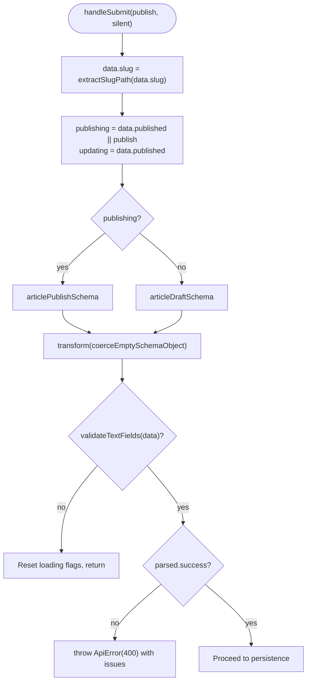
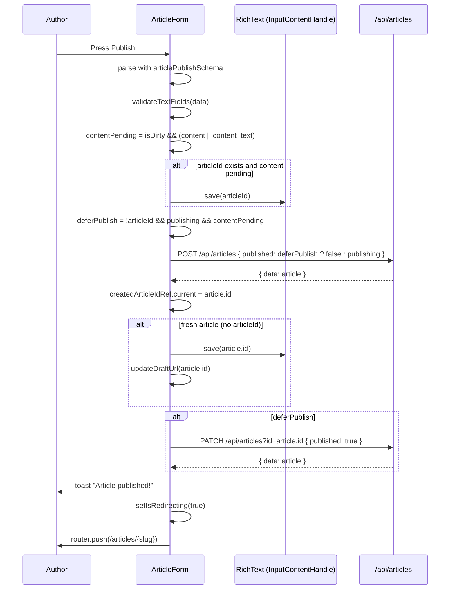
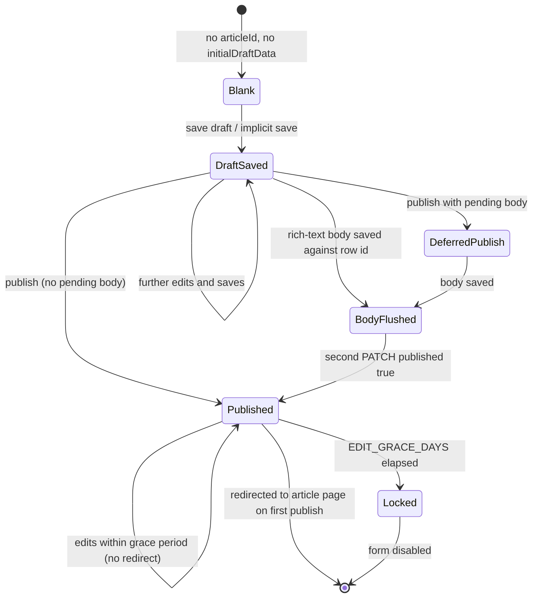
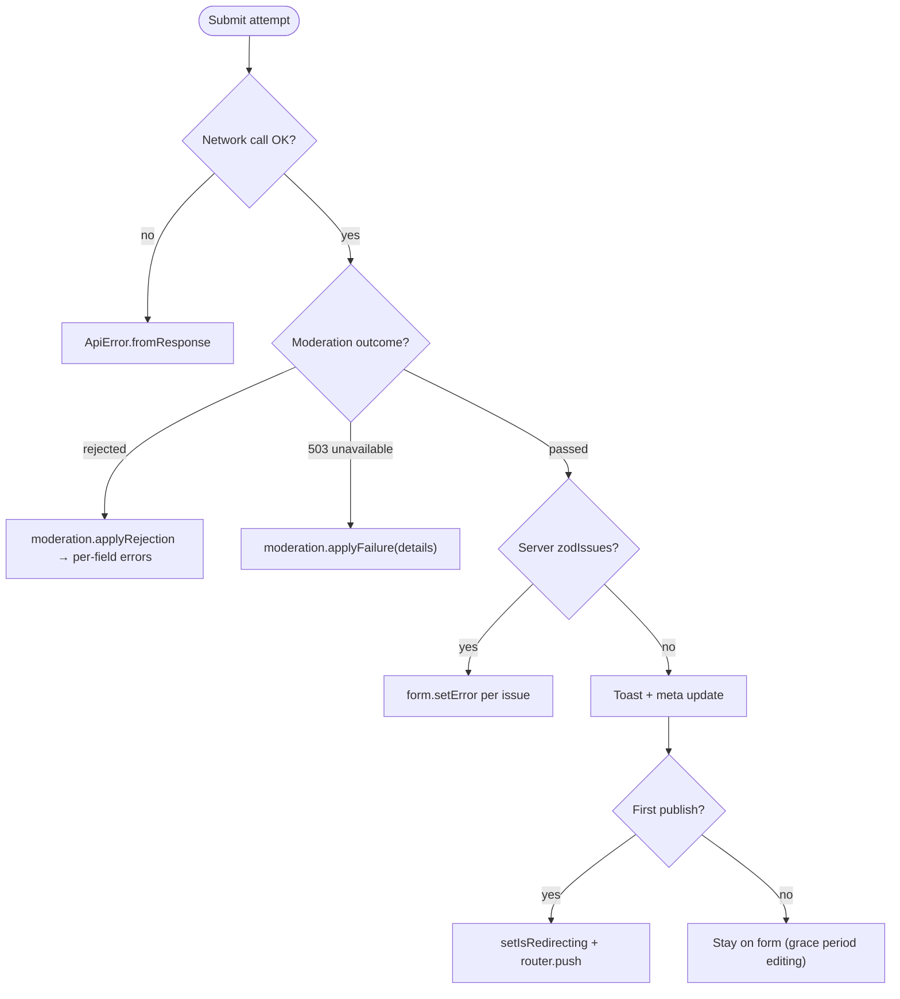

The end-to-end workflow through which a contributor creates, validates, saves, and publishes an article on the OZEAON platform — from the type-aware authoring form and its draft/publish validation schemas, through attachment uploads and moderation, to the persistence calls that produce a live article.

## Purpose and Scope

This page documents the **article authoring and publication workflow** as a coherent system capability. It covers:

- The authoring entry point (`ArticleForm`) and how it is composed from section components.
- The dual validation model (`articleDraftSchema` vs `articlePublishSchema`) and how a single form serves both.
- The draft lifecycle, including implicit draft creation triggered by uploads and autosave.
- The publish lifecycle, including the deferred-publish ("create draft, then publish") pattern and the one-time post-publish edit grace period.
- Attachment upload rules, the type-dependent visible/required field matrix, and edit-window locking.
- Moderation rejection handling and error surfacing.
- Rich-text body persistence and slug generation.

**Out of scope (sibling pages):** the read-only consumption surfaces — article feeds, cards, and detail pages — are separate catalog topics. Likewise, the repository-wide shared form primitives (`InputText`, `InputSelect`, `FormSectionCard`, `ShowWhen`, etc.) and the platform's base UI layer are not re-documented here; this page only describes how the article workflow composes them.

The authoritative field-by-field specification lives in the repository's own reference document, which is the primary source for the field tables below.

## Overview

The article workflow is deliberately built around **one form serving two lifecycle outcomes**. A contributor fills in a single screen; whether the result becomes a *draft* or a *published article* depends entirely on which schema is applied at submission time and which persistence call is made.

The design is shaped by three core constraints, each visible in the source:

1. **Article type determines the field surface.** The `article_type_id` selection controls which additional content fields appear (e.g. `abstract` for Research and Intellectual Property), implemented through a `ShowWhen` mechanism combined with schema-level conditional registration.

2. **Draft content must be loose; published content must be strict.** The draft schema permits partial data so autosave and implicit saves work. The publish schema tightens the same fields to require a complete, publishable record.

3. **A live article must never exist without its body.** Because the rich-text body is stored at a route keyed by the article id, a fresh article cannot persist its body until the database row exists. The workflow therefore *defers* publication: it creates the row as a draft, writes the body, then issues a second PATCH to set `published: true`.

### Key terminology

| Term | Meaning |
| --- | --- |
| **Draft** | A saved-but-unpublished article row. `published: false`. Validated by `articleDraftSchema`. |
| **Publish** | Setting `published: true`, which makes the article publicly visible. Validated by `articlePublishSchema`. |
| **Implicit draft save** | A draft create/save triggered by an upload action rather than an explicit "Save" — carried out with `silent = true` so no duplicate toast appears. |
| **Deferred publish** | Creating as a draft and publishing in a second step, used when a fresh article has unpersisted body content. |
| **Edit grace period** | A window of `EDIT_GRACE_DAYS` (7) days after publication during which the article remains editable. |
| **Text-only publication** | A flag (`text_only_publication`) that suppresses the PDF URL field for text-only articles. |

## Architecture

The workflow spans presentation components, a schema layer, and an API boundary. The diagram below reflects the actual module structure: `ArticleForm` orchestrates sections imported from `@/components/articles/form/sections`, the schema from `@/zod/articles`, and persistence via `fetch` to `/api/articles`.

```mermaid
flowchart TD
    subgraph sg_FormLayer["Form Layer (@/components/articles/form)"]
        ArticleForm["ArticleForm"]
        ArticleFormNav["ArticleFormNav"]
        ArticleFormSidebar["ArticleFormSidebar"]
        ContentSection["ContentSection"]
        AuthorInput["AuthorInput"]
        LicensingAccessSection["LicensingAccessSection"]
        ProvenanceSection["ProvenanceSection"]
        CoverUpload["ArticleCoverUpload / attachment uploaders"]
    end

    subgraph sg_SharedSections["Shared Project Sections"]
        CategoriesSection["CategoriesSection"]
        CommentsSection["CommentsSection"]
    end

    subgraph sg_Validation["Validation (@/zod/articles)"]
        DraftSchema["articleDraftSchema"]
        PublishSchema["articlePublishSchema"]
        CombinedHelpers["combined helpers: articleTextFieldsSchema<br/>isResearchOrIP, isVolunteeringOrField"]
        Coerce["coerceEmptySchemaObject"]
    end

    subgraph sg_API["API Boundary"]
        ArticlesApi["/api/articles"]
        RichText["InputContentHandle.save() (rich-text body to R2)"]
    end

    subgraph sg_Support["Cross-cutting Hooks"]
        Moderation["useModerationRejection"]
        Hydration["useHydration"]
        TransitionRouter["useTransitionRouter"]
    end

    ArticleForm --> ArticleFormNav
    ArticleForm --> ArticleFormSidebar
    ArticleForm --> ContentSection
    ArticleForm --> AuthorInput
    ArticleForm --> LicensingAccessSection
    ArticleForm --> ProvenanceSection
    ArticleForm --> CoverUpload
    ArticleForm --> CategoriesSection
    ArticleForm --> CommentsSection
    ArticleForm --> DraftSchema
    ArticleForm --> PublishSchema
    ArticleForm --> CombinedHelpers
    ArticleForm --> Coerce
    ArticleForm --> Moderation
    ArticleForm --> Hydration
    ArticleForm --> TransitionRouter
    ArticleForm -->|"POST / PATCH"| ArticlesApi
    ArticleForm --> RichText
```



**Why this shape:** `ArticleForm` is intentionally the single orchestrator. Section components are dumb presentation units that receive field wiring through `react-hook-form` context, while all lifecycle decisions — which schema to apply, whether to defer publish, when to flush the rich-text body — are centralized in `ArticleForm.handleSubmit`. This keeps the branching logic auditable in one place rather than distributed across upload widgets and buttons.

## Form Composition and Initialization

`ArticleForm` is a client component that receives all lookup data as props and builds the entire authoring experience.

```tsx
interface ArticleFormProps {
  sdgs: SDG[];
  categories: CategoryWithSubcategories[];
  articleTypes: ArticleType[];
  accessLevels: ArticleAccessLevel[];
  licenseTypes: ArticleLicenseType[];
  fundingSources: ArticleFundingSource[];
  attachments: ArticleAttachment[];
  initialDraftData: ArticleFormData | null;
  initialArticleId: string | null;
}
```

> Source: [ArticleForm.tsx](https://github.com/ozeaon/ozeaon-v2/blob/0a4f1a95824db87782f1221a4108019d174df3d9/src/components/articles/form/ArticleForm.tsx#L85-L95)

The prop contract encodes the workflow's two entry modes:

- **Blank authoring** — `initialDraftData` and `initialArticleId` are `null`; the form falls back to the `initialData` defaults.
- **Resuming an existing draft or editing a published article** — both are populated, and `react-hook-form` initializes from `initialDraftData` instead.

### Default values and the default article type

When no draft exists, the form seeds itself with a complete baseline. Every default is deliberate: booleans that default to permissive values (`comments_enabled`, `derivatives_allowed`, `commercial_use_allowed` all default `true`), a `geographic_scope` of `"global"`, `language` of `"en"`, and a single pre-seeded lead author with `role: "Primary Author"` and `is_corresponding: true`.

```tsx
const initialData: Partial<FormInput> = {
  published: false,
  comments_enabled: true,
  derivatives_allowed: true,
  commercial_use_allowed: true,
  text_only_publication: false,
  slug: "",
  tags: "",
  title: "",
  subtitle: "",
  summary: "",
  subcategories: [],
  sdgs: [],
  article_type_id: defaultArticleType.id,
  article_type: defaultArticleType,
  access_level_id: accessLevels[0].id,
  access_level: accessLevels[0],
  license_type_id: licenseTypes[0].id,
  license_type: licenseTypes[0],
  attribution_text: "",
  language: "en",
  content: null,
  content_text: "",
  geographic_scope: "global",
  geographic_scope_country: "",
  authors: [
    {
      user_id: "",
      display_name: "",
      is_corresponding: true,
      role: "Primary Author",
      orcid: "",
    },
  ],
};
```

> Source: [ArticleForm.tsx](https://github.com/ozeaon/ozeaon-v2/blob/0a4f1a95824db87782f1221a4108019d174df3d9/src/components/articles/form/ArticleForm.tsx#L165-L199)

The default article type is resolved by code, falling back to the first available type if the blog type is not present:

```tsx
const defaultArticleType =
  articleTypes.find((t) => t.code === ArticleTypeCode.blog) ??
  articleTypes[0];
```

> Source: [ArticleForm.tsx](https://github.com/ozeaon/ozeaon-v2/blob/0a4f1a95824db87782f1221a4108019d174df3d9/src/components/articles/form/ArticleForm.tsx#L116-L118)

Language options are derived from `ISO_LANGUAGE_CODES`, and all languages other than `"en"` are disabled — the workflow currently supports English authoring only:

```tsx
const languageOptions = useMemo(
  () =>
    Object.entries(ISO_LANGUAGE_CODES).map(([key, name]) => ({
      value: key,
      label: name,
      disabled: key !== "en",
    })),
  [],
);
```

> Source: [ArticleForm.tsx](https://github.com/ozeaon/ozeaon-v2/blob/0a4f1a95824db87782f1221a4108019d174df3d9/src/components/articles/form/ArticleForm.tsx#L131-L139)

### Form configuration decisions

The `useForm` call contains three non-obvious choices that materially affect behaviour:

```tsx
const form = useForm<FormInput, unknown, FormOutput>({
  resolver: zodResolver(SelectedSchema),
  // NOTE: shouldUnregister: false is required — ShowWhen fields must retain their
  // values when hidden, and unregistered fields (slug) must be readable via useWatch.
  shouldUnregister: false,
  shouldFocusError: true,
  disabled: initialDraftData?.published_at
    ? isDateOlderThan(initialDraftData.published_at, EDIT_GRACE_DAYS)
    : false,
  criteriaMode: "all",
  defaultValues: initialDraftData
    ? {
        ...initialDraftData,
        // content is loaded async by the rich-text editor; null is the clean baseline
        content: null,
        content_text: "",
        slug: meta.isPublished
          ? generatePublishedUrl("articles", initialDraftData.slug)
          : generateSlugPreview(
              "articles",
              initialDraftData.title,
              initialArticleId,
            ),
      }
    : initialData,
  mode: initialArticleId ? "onBlur" : "onSubmit",
  reValidateMode: "onChange",
});
```

> Source: [ArticleForm.tsx](https://github.com/ozeaon/ozeaon-v2/blob/0a4f1a95824db87782f1221a4108019d174df3d9/src/components/articles/form/ArticleForm.tsx#L211-L238)

| Setting | Value | Rationale |
| --- | --- | --- |
| `shouldUnregister` | `false` | Conditional `ShowWhen` fields must keep their values when hidden, and the unregistered `slug` field must remain readable via `useWatch`. |
| `disabled` | `isDateOlderThan(published_at, EDIT_GRACE_DAYS)` | Once the grace period lapses, the entire form is locked for published articles. |
| `criteriaMode` | `"all"` | Collect all validation issues per field, not just the first — needed because the publish schema enforces many cross-field requirements. |
| `mode` | `"onBlur"` if editing, else `"onSubmit"` | An existing article validates as the author edits; a fresh one waits until submit to avoid premature error noise. |
| `reValidateMode` | `"onChange"` | After the first validation, errors clear immediately as the author types. |

**Design intent:** `criteriaMode: "all"` combined with the schema-level refinements means a contributor who submits an incomplete article receives the complete list of missing publish requirements in one pass, rather than discovering them one at a time across repeated submissions.

## The Dual Validation Model

The heart of the workflow is the distinction between the draft and publish schemas, and the dynamic application of one or the other at submit time.

### Schema selection at submit

`ArticleForm` declares the draft schema as the resolver's schema (`const SelectedSchema = articleDraftSchema;`) so that ordinary interaction validates loosely. At submission, however, it re-parses explicitly against whichever schema matches the intended outcome:

```tsx
const publishing = data.published || publish;
const updating = data.published;
const selectedSchema = publishing
  ? articlePublishSchema
  : articleDraftSchema;

const parsed = selectedSchema
  .transform(coerceEmptySchemaObject)
  .safeParse(data);

if (!validateTextFields(data)) {
  setIsLoading(false);
  setIsPublishing(false);
  return;
}

if (!parsed.success) {
  throw new ApiError(400, {
    error: "Please complete all required fields",
    message: parsed.error.message,
    errors: parsed.error.issues,
  });
}
```

> Source: [ArticleForm.tsx](https://github.com/ozeaon/ozeaon-v2/blob/0a4f1a95824db87782f1221a4108019d174df3d9/src/components/articles/form/ArticleForm.tsx#L303-L325)

Two boolean flags disambiguate the four possible submit intents:

- `publishing` = `data.published || publish` → true if the stored record is already published **or** the user pressed the explicit publish action.
- `updating` = `data.published` → true only when the row was *already* published before this submission.
- `deferPublish` (computed later) handles the fresh-article body constraint.

This yields three observable outcomes: **save draft**, **first publish**, and **update published article**. The `publish` argument to `handleSubmit` is what distinguishes a publish-button press from an autosave/save press.

### Validation flow



The ordering matters: `validateTextFields(data)` runs before schema failure is thrown, and both run **before** any network call or rich-text flush. The source comment states the reason explicitly — flushing earlier would persist under-minimum content for published articles (whose only save path is that flush) even when the submission is about to be rejected.

```tsx
// Validation passed — only now flush rich-text to R2 and cancel autosave
// timers. Flushing earlier would persist under-min content for published
// articles (whose sole save path is this flush) even when the submission is
// about to be rejected. `data.content_text` is already current here via the
// synchronous onChanged → setValue, so validation never needs the flush.
const contentPending = Boolean(
  isDirty && (dirtyFields.content || dirtyFields.content_text),
);
```

> Source: [ArticleForm.tsx](https://github.com/ozeaon/ozeaon-v2/blob/0a4f1a95824db87782f1221a4108019d174df3d9/src/components/articles/form/ArticleForm.tsx#L327-L334)

### Field limits enforced by the schemas

The limits below are drawn from the repository's article form reference, which cites the constants and zod modules as the source of truth. They apply across the client schema and the API layer.

| Field | Limits | Notes |
| --- | --- | --- |
| `title` | 3–120 characters | Allowed punctuation: `: ' ( ) & / — –`; profanity-checked. |
| `subtitle` | 50–120 characters | Minimum only enforced when a value is provided. |
| `content` | 2,000–30,000 characters | Plain-text extraction `content_text` independently capped at 5,000 words. |
| `abstract` | 800–3,000 characters | Research / Intellectual Property types only; hidden and unregistered otherwise. |
| `summary` | 300–1,500 characters | Optional in draft, required for publish. |
| `tags` | max 10 tags × 20 characters | Comma-separated, deduplicated, trimmed, profanity-checked. |
| `subcategories` | ≥ 1 on publish | No maximum. |
| `sdgs` | ≥ 1 on publish, each integer 1–17 | No count maximum. |
| `authors` | 1–10 | UI-enforced only (`useFieldArray`); no count bound in the zod schema. |
| `orcid` | max 19 chars, `XXXX-XXXX-XXXX-XXXX` | Last character may be `X`. |
| `doi` | format `10.<4–9 digits>/<item>` | Format-only validation. |
| `jurisdiction_notes` | max 255 characters | Optional. |
| `location_details` | max 255 characters | Regex-restricted to location punctuation. |

**Design intent:** the asymmetric treatment of `subcategories`, `sdgs`, and `tags` — required for publish but unconstrained in draft — is what makes incremental authoring possible. An author can save a skeleton draft with none of these and still resume it later.

## The Draft Lifecycle

### Implicit draft creation from uploads

A contributor who uploads a cover image before ever saving explicitly still receives a persisted row. The workflow achieves this by having upload widgets call `handleSubmit(false, true)` — save-as-draft with `silent = true`. The `silent` flag exists specifically so the implicit save does not produce a duplicate toast:

```tsx
} else if (!silent) {
  // An implicit save exists only to give an upload a row to attach to, and the
  // upload reports itself — a second toast for one drop reads as two actions.
  toast.success("Draft saved", {
    description: "Your article has been saved as a draft.",
  });
}
```

> Source: [ArticleForm.tsx](https://github.com/ozeaon/ozeaon-v2/blob/0a4f1a95824db87782f1221a4108019d174df3d9/src/components/articles/form/ArticleForm.tsx#L420-L426)

The publish button is deliberately insulated from implicit saves. `isPublishing` is tracked separately from `isLoading` for exactly this reason:

```tsx
// Tracked separately from isLoading so an implicit draft save — triggered by an
// upload the author never framed as a save — leaves the publish button alone.
if (publish) {
  setIsPublishing(true);
}
```

> Source: [ArticleForm.tsx](https://github.com/ozeaon/ozeaon-v2/blob/0a4f1a95824db87782f1221a4108019d174df3d9/src/components/articles/form/ArticleForm.tsx#L296-L300)

### Concurrency guards for in-flight creates

Two refs protect against duplicate row creation, which is a real hazard because several independent callers (autosave, upload handlers, submit) can race to create the first row:

```tsx
const richTextRef = useRef<InputContentHandle>(null);
// Holds the row a submit created before meta caught up, so a retry updates it.
const createdArticleIdRef = useRef<string | null>(initialArticleId);
// In-flight implicit draft create, shared by every caller waiting on the id.
const createdDraftRef = useRef<Promise<string | null> | null>(null);
const [isLoading, setIsLoading] = useState(false);
const [isPublishing, setIsPublishing] = useState(false);
// Never cleared — the form unmounts once the article page renders.
const [isRedirecting, setIsRedirecting] = useState(false);
```

> Source: [ArticleForm.tsx](https://github.com/ozeaon/ozeaon-v2/blob/0a4f1a95824db87782f1221a4108019d174df3d9/src/components/articles/form/ArticleForm.tsx#L201-L209)

| Ref / state | Purpose |
| --- | --- |
| `createdArticleIdRef` | Retains the id a submit created before `meta` state caught up, so a **retry after a failed body write** PATCHes the existing row instead of creating a second article. |
| `createdDraftRef` | Shares a single in-flight draft-create promise across every caller waiting on an id. |
| `isLoading` | Generic save-in-progress flag. |
| `isPublishing` | Publish-specific flag, kept separate so an implicit save does not disable the publish button. |
| `isRedirecting` | Never cleared; the form unmounts once the article page renders. Also disarms the unsaved-changes warning. |

The retry-id resolution is explicit in the submit path:

```tsx
// A retry after a failed body write reuses the row the failed attempt left
// behind, rather than creating a second article.
const articleId = meta.articleId ?? createdArticleIdRef.current;
```

> Source: [ArticleForm.tsx](https://github.com/ozeaon/ozeaon-v2/blob/0a4f1a95824db87782f1221a4108019d174df3d9/src/components/articles/form/ArticleForm.tsx#L336-L338)

### Unsaved-changes guard

A `beforeunload` listener is registered whenever the form is dirty, but deliberately disarmed during redirection:

```tsx
useEffect(() => {
  // Disarmed while redirecting: the form is dirty against a baseline it will
  // never adopt, so the warning would fire over changes that are published.
  if (isRedirecting || !isDirty || !Object.keys(dirtyFields).length) return;

  logger.info("ArticleForm dirty effect", dirtyFields);
  const handler = (e: BeforeUnloadEvent) => {
    e.preventDefault();
  };
  window.addEventListener("beforeunload", handler);
  return () => window.removeEventListener("beforeunload", handler);
}, [isDirty, dirtyFields, isRedirecting]);
```

> Source: [ArticleForm.tsx](https://github.com/ozeaon/ozeaon-v2/blob/0a4f1a95824db87782f1221a4108019d174df3d9/src/components/articles/form/ArticleForm.tsx#L253-L264)

**Design intent:** without the `isRedirecting` guard, a successful publish would immediately trigger a native "unsaved changes" prompt over content that had in fact just been published — a confusing false positive caused by the dirty baseline not yet having been reset.

## The Publication Lifecycle

### The deferred-publish pattern (core flow)

This is the workflow's most important mechanism. The full sequence, including the body-flush ordering and the second PATCH, is:



The decisive condition, and the comment that explains it:

```tsx
// The body lives at a route keyed by the article id, so on a fresh article it
// cannot be stored until the row exists. Create as a draft and publish in a
// second step so a live article never exists without its body.
const deferPublish = !articleId && publishing && contentPending;

const url = articleId
  ? `/api/articles?id=${articleId}`
  : "/api/articles";

const res = await fetch(url, {
  method: articleId ? "PATCH" : "POST",
  body: JSON.stringify({
    ...parsed.data,
    published: deferPublish ? false : publishing,
  }),
  headers: { "Content-Type": "application/json" },
});
```

> Source: [ArticleForm.tsx](https://github.com/ozeaon/ozeaon-v2/blob/0a4f1a95824db87782f1221a4108019d174df3d9/src/components/articles/form/ArticleForm.tsx#L347-L363)

**Design intent:** the invariant "a live article never exists without its body" is enforced structurally rather than by hoping the body upload succeeds first. If the body write fails, the article remains a visible draft rather than a broken published page.

### Body flush and id binding

For a fresh article, the editor mounted without an id, so its own save route cannot reach the newly created row. The workflow therefore writes the body explicitly after creation, and binds the form to the row in a `finally` block so the draft stays reachable even if the body write fails:

```tsx
if (!articleId) {
  // The editor mounted without an id, so its own save path cannot reach the
  // new row. Store the body first: binding the form to the row rebuilds the
  // editor against that id, and the rebuild re-fetches what is persisted here.
  try {
    if (contentPending && richTextRef.current) {
      await richTextRef.current.save(article.id);
    }
  } finally {
    // Bound even when the body write fails, so the author keeps a reachable
    // draft rather than an orphan row the form knows nothing of.
    updateDraftUrl(article.id);
  }
}
```

> Source: [ArticleForm.tsx](https://github.com/ozeaon/ozeaon-v2/blob/0a4f1a95824db87782f1221a4108019d174df3d9/src/components/articles/form/ArticleForm.tsx#L377-L390)

`updateDraftUrl` rewrites the browser history entry in place — no navigation, no reload — and lifts the id into form state:

```tsx
const updateDraftUrl = (id: string) => {
  const newUrl = `/articles/new?articleId=${id}`;
  window.history.replaceState(
    { ...window.history.state, as: newUrl, url: newUrl },
    "",
    newUrl,
  );
  setMeta((prev) => ({ ...prev, articleId: id }));
};
```

> Source: [ArticleForm.tsx](https://github.com/ozeaon/ozeaon-v2/blob/0a4f1a95824db87782f1221a4108019d174df3d9/src/components/articles/form/ArticleForm.tsx#L271-L279)

### The deferred publish PATCH

If publication was deferred, a second PATCH completes it:

```tsx
if (deferPublish) {
  const publishRes = await fetch(`/api/articles?id=${article.id}`, {
    method: "PATCH",
    body: JSON.stringify({ ...parsed.data, published: true }),
    headers: { "Content-Type": "application/json" },
  });

  if (!publishRes.ok) {
    throw await ApiError.fromResponse(publishRes);
  }

  ({ data: article } = await publishRes.json<{ data: Article }>());
  logger.info("Published article response {articleId}", {
    articleId: article.id,
    variant: "success",
  });
}
```

> Source: [ArticleForm.tsx](https://github.com/ozeaon/ozeaon-v2/blob/0a4f1a95824db87782f1221a4108019d174df3d9/src/components/articles/form/ArticleForm.tsx#L392-L408)

### Outcome differentiation: publish, update, redirect

The workflow distinguishes three outcomes for toasts, and redirects only on **first** publish:

```tsx
if (publishing) {
  if (updating) {
    toast.success("Published article updated!", {
      description: "Your article has been updated successfully.",
    });
  } else {
    toast.success("Article published!", {
      description: "Your article has been published successfully.",
    });
  }
} else if (!silent) {
  toast.success("Draft saved", { /* ... */ });
}

// Redirect on first publish only — updating a live article keeps the
// author on the form for the remainder of the edit grace period.
if (publishing && !updating) {
  // Held until the article page takes over: the destination has no loading
  // boundary, so without it the form goes idle and reads as "nothing happened".
  setIsRedirecting(true);
  router.push(article.slug ? `/articles/${article.slug}` : "/articles");
  return article.id;
}
```

> Source: [ArticleForm.tsx](https://github.com/ozeaon/ozeaon-v2/blob/0a4f1a95824db87782f1221a4108019d174df3d9/src/components/articles/form/ArticleForm.tsx#L410-L436)

**Design intent:** staying on the form after updating a published article is what makes the edit grace period usable — the author can make several rounds of corrections without being bounced back to the article page each time.

## Form State Model

`ArticleForm` maintains two pieces of state that drive conditional rendering and lock behaviour: the `meta` object and React Hook Form's own dirty tracking.

### The `meta` state object

```tsx
const [meta, setMeta] = useState<ArticleFormMeta>({
  title: initialDraftData?.title ?? null,
  articleId: initialArticleId,
  lastSavedDate: initialDraftData?.updated_at,
  isPublished: initialDraftData?.published ?? false,
  publishedAt: initialDraftData?.published_at ?? null,
  articleAttachments: attachments,
  editGracePeriodEnded: Boolean(
    initialDraftData?.published &&
    initialDraftData.published_at &&
    isDateOlderThan(initialDraftData.published_at, EDIT_GRACE_DAYS),
  ),
});
```

> Source: [ArticleForm.tsx](https://github.com/ozeaon/ozeaon-v2/blob/0a4f1a95824db87782f1221a4108019d174df3d9/src/components/articles/form/ArticleForm.tsx#L143-L155)

`meta` is updated in two places: after a successful submit (from the server response), and by `updateDraftUrl` when a fresh row is created. The post-submit update always re-derives `editGracePeriodEnded` from the server's `published_at`, so the lock state is never guessed client-side.

### Dirty baseline reset

After every successful save, the form resets its dirty baseline from the **server response**, not the client submission. This is essential because the server generates `slug`, `published_at`, and `attribution_text`:

```tsx
// TODO remove extra fields from API response
// Use the server response so server-generated fields (slug, published_at,
// attribution_text) become the new dirty baseline, not the client submission.
form.resetDefaultValues(
  {
    ...mapArticleToFormData(mapApiDataToFormData(article)),
    slug: article.published
      ? generatePublishedUrl("articles", article.slug)
      : generateSlugPreview("articles", article.title, article.id),
    content: form.getValues("content"),
    content_text: form.getValues("content_text"),
  },
  { keepDirty: false },
);
```

> Source: [ArticleForm.tsx](https://github.com/ozeaon/ozeaon-v2/blob/0a4f1a95824db87782f1221a4108019d174df3d9/src/components/articles/form/ArticleForm.tsx#L452-L465)

**Design intent:** the body fields (`content`, `content_text`) are carried over from current form values rather than the response, because the rich-text editor holds them and re-mapping them from the API response would desynchronize the editor from the form.

### State and lifecycle diagram



## Attachments, Cover Image and the Rich-Text Body

The attachment surfaces are the reason implicit draft saves exist at all: an upload needs a parent row. Attachment rules are enforced per type:

| Type | Max files | Max size per file | Allowed formats |
| --- | --- | --- | --- |
| `pdf` | 1 | 25 MB | `.pdf` |
| `annex` | 10 | 15 MB | `.pdf .doc .docx .xls .xlsx .csv .ppt .pptx .txt` |
| `image` | 10 | 5 MB | `.jpg .jpeg .png .webp` |
| `combined` | 20 (annex + image, **not** pdf) | 100 MB total | — |

> Source: [article-form-reference.md](https://github.com/ozeaon/ozeaon-v2/blob/0a4f1a95824db87782f1221a4108019d174df3d9/docs/article-form/article-form-reference.md#L274-L279)

The cover image is a publish requirement, with its own limits:

| Property | Value |
| --- | --- |
| Max size | 10 MB |
| Formats | `png/jpg/jpeg/webp` |
| Recommended | 1200×630 (16:9) |

> Source: [article-form-reference.md](https://github.com/ozeaon/ozeaon-v2/blob/0a4f1a95824db87782f1221a4108019d174df3d9/docs/article-form/article-form-reference.md#L256-L263)

### Attachment edit-window rules

Attachment mutability is time-bound after publication — and notably, the PDF is treated more strictly than everything else:

- Annex and image attachments become locked for editing **7 days** after the article is published (`EDIT_GRACE_DAYS = 7`).
- The PDF **cannot be replaced or deleted at all** once the article is published — this holds regardless of the grace period.

> Source: [article-form-reference.md](https://github.com/ozeaon/ozeaon-v2/blob/0a4f1a95824db87782f1221a4108019d174df3d9/docs/article-form/article-form-reference.md#L281-L283)

**Design intent:** the PDF is the immutable record of the work as published; allowing it to be swapped after publication would silently change what readers and citations point at. Annexes and gallery images are treated as supplementary and therefore granted a grace window.

### The rich-text body

The body is submitted as a structured object rather than plain HTML, so the editor's document model round-trips losslessly:

```tsx
// The body lives under the "content" field in the form, though the
// server reports it as "content_text".
const moderation = useModerationRejection(
  form,
  (field) =>
    (field === "content_text" ? "content" : field) as keyof FormInput,
);
```

> Source: [ArticleForm.tsx](https://github.com/ozeaon/ozeaon-v2/blob/0a4f1a95824db87782f1221a4108019d174df3d9/src/components/articles/form/ArticleForm.tsx#L240-L246)

| Aspect | Value |
| --- | --- |
| Form value shape | `{ blocks: JSON.stringify(editorSchemaWithValues); html: editorHTML; }` |
| Editor HTML limit | 2,000–30,000 characters |
| Plain-text extraction | `content_text`, capped at 5,000 words, enforced in both `step1.ts` and `combined.ts` |
| Storage | R2, at a route keyed by the article id |

> Source: [article-form-reference.md](https://github.com/ozeaon/ozeaon-v2/blob/0a4f1a95824db87782f1221a4108019d174df3d9/docs/article-form/article-form-reference.md#L89-L97)

The **field-name mismatch** between client and server (`content` vs `content_text`) is handled by an explicit mapper passed to the moderation hook, rather than by renaming either side. This is why moderation rejections targeting the body map back onto the correct form field.

## Type-Dependent Field Visibility and Requirements

Article type is the single most influential field: it gates both visibility and requirement of several other fields. The conditional logic is expressed through combined helper predicates.

```tsx
import {
  articleTextFieldsSchema,
  isResearchOrIP,
  isVolunteeringOrField,
} from "@/zod/articles/combined";
```

> Source: [ArticleForm.tsx](https://github.com/ozeaon/ozeaon-v2/blob/0a4f1a95824db87782f1221a4108019d174df3d9/src/components/articles/form/ArticleForm.tsx#L71-L75)

The predicates map directly onto the field rules:

| Condition | Affected fields | Behaviour |
| --- | --- | --- |
| Research / Intellectual Property | `abstract` | Required; 800–3,000 chars. Hidden and unregistered for all other types. |
| Research / IP without text-only | `pdf_url` | Required; `content` becomes optional (but must still be ≥2,000 chars if supplied). |
| `text_only_publication` enabled | `pdf_url` | Hidden entirely. |
| Project Log (`project_log`) | `linked_project_id` | Required; searched via project autocomplete. |
| `field_insight` / `volunteering` | `geographic_scope` | Must be `local` or `regional` (not `global`), and either `location_details` or `geographic_scope_country` must be filled. |
| Embargoed access level | `embargo_end_date` | Required. |
| Custom license type | `custom_license` | Required. |
| Funding source `Other` | `funding_details` | Required. |
| `indigenous_knowledge_flag` enabled | `indigenous_macro_region_id`, `indigenous_sub_region`, `indigenous_peoples_nations`, `indigenous_local_territory` | All become visible/relevant. |

> Source: [article-form-reference.md](https://github.com/ozeaon/ozeaon-v2/blob/0a4f1a95824db87782f1221a4108019d174df3d9/docs/article-form/article-form-reference.md#L89-L128) and [article-form-reference.md](https://github.com/ozeaon/ozeaon-v2/blob/0a4f1a95824db87782f1221a4108019d174df3d9/docs/article-form/article-form-reference.md#L398-L466)

### Publish-required vs. draft-optional

The clearest expression of the dual-schema model is the requirement set:

| Field | Draft | Publish |
| --- | --- | --- |
| `title` | required | required |
| `content` | conditionally required | required (unless Research/IP with PDF) |
| `summary` | optional | required |
| `subcategories` | optional | ≥ 1 required |
| `sdgs` | optional | ≥ 1 required (1–17) |
| `tags` | optional | required (max 10) |
| `authors` | optional | ≥ 1 with `is_corresponding` |
| `cover_image_url` | optional | required |
| `access_level_id` | required | required |
| `license_type_id` | required | required |
| `language` | required (default `en-US`) | required |

> Source: [article-form-reference.md](https://github.com/ozeaon/ozeaon-v2/blob/0a4f1a95824db87782f1221a4108019d174df3d9/docs/article-form/article-form-reference.md#L112-L166)

### Author list specifics

The author model has several behaviours worth noting because they are not obvious from the UI:

- `role` is **not user-editable**; it is set programmatically to `"Primary Author"` for the lead author and `"Co-Author"` for subsequently added authors, then submitted as a hidden field.
- Author index 0 ("Lead Author") **cannot be removed** from the UI.
- The 1–10 author bound is **UI-enforced only** via `useFieldArray` rules — there is no corresponding bound in the zod schema.
- Publish requires **at least one** author flagged `is_corresponding`. The schema check is "at least one", not "exactly one"; it reads as exactly one in practice only because of the UI's single-select toggle behaviour.
- There is **no duplicate-user guard**: the same registered user can be added twice.

> Source: [article-form-reference.md](https://github.com/ozeaon/ozeaon-v2/blob/0a4f1a95824db87782f1221a4108019d174df3d9/docs/article-form/article-form-reference.md#L177-L191)

## Moderation and Error Handling

The workflow wires a dedicated moderation hook into the form, with a field-name mapper, and resets attempt state on every submission:

```tsx
moderation.resetBeforeAttempt();
```

> Source: [ArticleForm.tsx](https://github.com/ozeaon/ozeaon-v2/blob/0a4f1a95824db87782f1221a4108019d174df3d9/src/components/articles/form/ArticleForm.tsx#L294)

### Error dispatch

The catch block classifies errors into four distinct handling paths:

```tsx
} catch (error: unknown) {
  if (error instanceof ApiError) {
    if (error.isModerationRejection) {
      moderation.applyRejection(error.moderation ?? []);
    } else if (error.status === 503) {
      moderation.applyFailure(error.details);
    } else if (error.zodIssues?.length) {
      error.zodIssues?.forEach((issue, index) => {
        form.setError(issue.path[0] as keyof FormInput, {
          message: issue.message,
        });
        if (index === 0) {
          // ...
```

> Source: [ArticleForm.tsx](https://github.com/ozeaon/ozeaon-v2/blob/0a4f1a95824db87782f1221a4108019d174df3d9/src/components/articles/form/ArticleForm.tsx#L468-L480)

| Error condition | Detection | Handling |
| --- | --- | --- |
| Client-side schema failure | `parsed.success === false` | Throws `ApiError(400)` with `error: "Please complete all required fields"` and the full issue list. |
| Moderation rejection | `ApiError.isModerationRejection` | `moderation.applyRejection(error.moderation)` — flags specific fields. |
| Moderation service unavailable | `error.status === 503` | `moderation.applyFailure(error.details)`. |
| Server-side zod validation | `error.zodIssues?.length` | Each issue is mapped onto its form field via `form.setError`; the first issue additionally receives focus treatment. |
| Non-OK HTTP response | `!res.ok` | `throw await ApiError.fromResponse(res)`. |
| Failed publish PATCH | `!publishRes.ok` | `throw await ApiError.fromResponse(publishRes)`. |

**Design intent:** moderation is treated as a first-class, field-addressable outcome rather than an opaque failure. Because rejection payloads carry field identifiers, the form can highlight exactly which fields need revision, and the 503 path is separated so an unavailable moderation service is not misreported as a content problem.

### Failure-mode flow



## API Reference

### `ArticleForm(props)`

Client component rendering the full authoring experience.

**Props:**

- `sdgs: SDG[]` — available Sustainable Development Goals for selection.
- `categories: CategoryWithSubcategories[]` — categories with nested subcategories for the grouped multi-select.
- `articleTypes: ArticleType[]` — available article types; drives the type-dependent field surface.
- `accessLevels: ArticleAccessLevel[]` — access level options; first entry is the default.
- `licenseTypes: ArticleLicenseType[]` — license options; first entry is the default.
- `fundingSources: ArticleFundingSource[]` — funding source options for provenance.
- `attachments: ArticleAttachment[]` — pre-existing attachments for the resumed draft.
- `initialDraftData: ArticleFormData | null` — populated when resuming an existing draft or editing a published article.
- `initialArticleId: string | null` — the article id when editing; `null` for blank authoring.

> Source: [ArticleForm.tsx](https://github.com/ozeaon/ozeaon-v2/blob/0a4f1a95824db87782f1221a4108019d174df3d9/src/components/articles/form/ArticleForm.tsx#L85-L95)

### `handleSubmit(publish: boolean, silent = false)`

Curried submit factory returning an async handler for `FormOutput`.

| Parameter | Type | Default | Description |
| --- | --- | --- | --- |
| `publish` | `boolean` | — | If `true`, forces the publish path (`isPublishing` is set and the publish schema is applied when combined with `data.published`). |
| `silent` | `boolean` | `false` | Suppresses the "Draft saved" toast for implicit saves triggered by uploads. |

**Returns:** `Promise<string | undefined>` — resolves to the article id on success (returned explicitly on first publish, and at the end of the happy path); `undefined` or no value when the submission is aborted before persistence.

**Side effects:** sets `isLoading`/`isPublishing`, resets moderation attempt state, may flush the rich-text body to R2, may issue POST then PATCH to `/api/articles`, updates `meta` from the server response, resets the RHF dirty baseline, and may redirect on first publish.

> Source: [ArticleForm.tsx](https://github.com/ozeaon/ozeaon-v2/blob/0a4f1a95824db87782f1221a4108019d174df3d9/src/components/articles/form/ArticleForm.tsx#L281-L467)

### `updateDraftUrl(id: string): void`

Rewrites the current history entry to `/articles/new?articleId={id}` without navigating, and lifts the id into `meta`.

> Source: [ArticleForm.tsx](https://github.com/ozeaon/ozeaon-v2/blob/0a4f1a95824db87782f1221a4108019d174df3d9/src/components/articles/form/ArticleForm.tsx#L271-L279)

### Persistence endpoints used by the workflow

| Method | URL | Body | When |
| --- | --- | --- | --- |
| `POST` | `/api/articles` | `{ ...parsed.data, published }` | First save of a fresh article. |
| `PATCH` | `/api/articles?id={id}` | `{ ...parsed.data, published }` | Subsequent saves and updates. |
| `PATCH` | `/api/articles?id={id}` | `{ ...parsed.data, published: true }` | Deferred publish second step. |
| Rich-text save | `InputContentHandle.save(articleId)` | Editor body | After validation passes and an id is available. |

> Source: [ArticleForm.tsx](https://github.com/ozeaon/ozeaon-v2/blob/0a4f1a95824db87782f1221a4108019d174df3d9/src/components/articles/form/ArticleForm.tsx#L352-L397)

## Configuration and Constants

| Constant / config | Source module | Role |
| --- | --- | --- |
| `ARTICLE_FIELD_LIMITS` | `src/config/constants/articles.ts` | Central field length limits. |
| `ISO_LANGUAGE_CODES` | `src/config/constants/articles.ts` | Language options; only `en` enabled. |
| `EDIT_GRACE_DAYS` | `src/config/constants/attachments.ts` | 7-day post-publication edit window for annex/image attachments and form locking. |
| Attachment limits | `src/config/constants/attachments.ts` | Per-type file counts, sizes and formats. |
| Image limits | `src/config/constants/image.ts` | Cover image size and format rules. |
| `articleDraftSchema` | `src/zod/articles` | Lenient draft validation. |
| `articlePublishSchema` | `src/zod/articles` | Strict publish validation. |
| `articleTextFieldsSchema`, `isResearchOrIP`, `isVolunteeringOrField` | `src/zod/articles/combined` | Type-conditional field requirements. |
| `coerceEmptySchemaObject` | `src/utils/formatters` | Normalizes empty schema objects before parsing. |
| `extractSlugPath`, `generatePublishedUrl`, `generateSlugPreview`, `isDateOlderThan` | `src/utils/generators` | Slug and URL handling plus grace-period date math. |
| `mapApiDataToFormData`, `mapArticleToFormData` | `src/utils` | Server → form shape conversion. |

> Source: [article-form-reference.md](https://github.com/ozeaon/ozeaon-v2/blob/0a4f1a95824db87782f1221a4108019d174df3d9/docs/article-form/article-form-reference.md#L7-L9)

## Edge Cases, Concurrency and Operational Notes

### Slug immutability

The slug is auto-generated from the first 50 characters of the title and shown as a read-only URL preview. Once published, it is **locked**:

```tsx
const slugDescription = useMemo(
  () =>
    meta.isPublished
      ? "Url is locked after publishing to maintain URL stability."
      : "Url is automatically generated based on Article's Title.",
  [meta.isPublished],
);
```

> Source: [ArticleForm.tsx](https://github.com/ozeaon/ozeaon-v2/blob/0a4f1a95824db87782f1221a4108019d174df3d9/src/components/articles/form/ArticleForm.tsx#L157-L163)

**Design intent:** URL stability protects inbound links, search-engine ranking, and citations. The description text changes in place so the author understands *why* the preview is no longer editable.

Before submission, the slug value is reduced to just its path segment:

```tsx
data.slug = extractSlugPath(data.slug);
```

> Source: [ArticleForm.tsx](https://github.com/ozeaon/ozeaon-v2/blob/0a4f1a95824db87782f1221a4108019d174df3d9/src/components/articles/form/ArticleForm.tsx#L290)

### Retry idempotency

If the body write fails after the row was created, the next submit resolves `articleId` from `meta.articleId ?? createdArticleIdRef.current` and issues a PATCH — never a second POST. The rich-text save is also passed the id explicitly on retry, because the editor may not have been rebuilt against the row yet:

```tsx
// Passed explicitly: on a retry the row exists but the editor has not been
// rebuilt against it, so its own route still points at no article. The id is
// ignored when it already matches the editor's, which keeps the flush path.
if (articleId && richTextRef.current && contentPending) {
  await richTextRef.current.save(articleId);
}
```

> Source: [ArticleForm.tsx](https://github.com/ozeaon/ozeaon-v2/blob/0a4f1a95824db87782f1221a4108019d174df3d9/src/components/articles/form/ArticleForm.tsx#L340-L345)

### Body-pending detection

`contentPending` is computed from dirty tracking, not from content length, so a body that was edited but coincidentally matches a previous length is still flushed:

```tsx
const contentPending = Boolean(
  isDirty && (dirtyFields.content || dirtyFields.content_text),
);
```

> Source: [ArticleForm.tsx](https://github.com/ozeaon/ozeaon-v2/blob/0a4f1a95824db87782f1221a4108019d174df3d9/src/components/articles/form/ArticleForm.tsx#L332-L334)

### Orphan prevention

The `finally` block around the body write guarantees `updateDraftUrl(article.id)` runs even when the body write throws. Without it, a created row would exist server-side with no reference held by the form — an orphan draft the author could not reach.

### Unsupported/removed fields

The reference document explicitly records two corrections that matter for anyone extending the workflow:

- There is **no `affiliation` field** — it has been removed; `role` is its de facto replacement.
- There is **no `thumbnail_image_url` field** — no such column exists on the `articles` table or in `IMAGE_CONFIG`. The only `thumbnail_image_id` in the codebase belongs to the unrelated `educational_resources` table.

> Source: [article-form-reference.md](https://github.com/ozeaon/ozeaon-v2/blob/0a4f1a95824db87782f1221a4108019d174df3d9/docs/article-form/article-form-reference.md#L189-L191) and [article-form-reference.md](https://github.com/ozeaon/ozeaon-v2/blob/0a4f1a95824db87782f1221a4108019d174df3d9/docs/article-form/article-form-reference.md#L285-L289)

### Logging

The form uses a namespaced logger and emits structured events at the key lifecycle points — on submission (`"Submitting article {slug}"`), on save success, on publish success, and in the dirty-warning effect:

```tsx
const logger = getLogger(["components", "articles"]);
...
logger.info("Saved article response {articleId}", {
  articleId: article.id,
  variant: "success",
});
```

> Source: [ArticleForm.tsx](https://github.com/ozeaon/ozeaon-v2/blob/0a4f1a95824db87782f1221a4108019d174df3d9/src/components/articles/form/ArticleForm.tsx#L83) and [ArticleForm.tsx](https://github.com/ozeaon/ozeaon-v2/blob/0a4f1a95824db87782f1221a4108019d174df3d9/src/components/articles/form/ArticleForm.tsx#L372-L375)

## Extension Points

| To change... | Modify |
| --- | --- |
| Which fields a type requires or shows | `src/zod/articles/combined.ts` (`isResearchOrIP`, `isVolunteeringOrField`, `articleTextFieldsSchema`) plus the matching `ShowWhen` conditions in the section components. |
| Draft vs. publish strictness | `articleDraftSchema` / `articlePublishSchema` in `src/zod/articles`. |
| Field length limits | `ARTICLE_FIELD_LIMITS` in `src/config/constants/articles.ts`. |
| The edit grace window | `EDIT_GRACE_DAYS` in `src/config/constants/attachments.ts` — note this affects both form locking and attachment mutability. |
| Attachment type rules | `src/config/constants/attachments.ts`. |
| Supported authoring languages | `languageOptions` in `ArticleForm` (currently all non-`en` entries are disabled). |
| Error presentation | The `catch` dispatch block in `handleSubmit` and the `useModerationRejection` hook. |

## Related Links

- [Article form field and validation reference](https://github.com/ozeaon/ozeaon-v2/blob/0a4f1a95824db87782f1221a4108019d174df3d9/docs/article-form/article-form-reference.md) — the authoritative per-field specification.
- [ArticleForm.tsx](https://github.com/ozeaon/ozeaon-v2/blob/0a4f1a95824db87782f1221a4108019d174df3d9/src/components/articles/form/ArticleForm.tsx) — the orchestrating component.
- [ArticleFormNav.tsx](https://github.com/ozeaon/ozeaon-v2/blob/0a4f1a95824db87782f1221a4108019d174df3d9/src/components/articles/form/ArticleFormNav.tsx) — navigation controls within the form.
- [ArticleFormSidebar.tsx](https://github.com/ozeaon/ozeaon-v2/blob/0a4f1a95824db87782f1221a4108019d174df3d9/src/components/articles/form/ArticleFormSidebar.tsx) — sidebar (save status, navigation).
- [ContentSection.tsx](https://github.com/ozeaon/ozeaon-v2/blob/0a4f1a95824db87782f1221a4108019d174df3d9/src/components/articles/form/sections/ContentSection.tsx) — the rich-text body section.
- [ArticleDeleteDialog.tsx](https://github.com/ozeaon/ozeaon-v2/blob/0a4f1a95824db87782f1221a4108019d174df3d9/src/components/articles/ArticleDeleteDialog.tsx) — deletion flow for authored articles.
- [ArticleCoverUpload.tsx](https://github.com/ozeaon/ozeaon-v2/blob/0a4f1a95824db87782f1221a4108019d174df3d9/src/components/articles/form/sections/attachments/ArticleCoverUpload.tsx) — cover image upload surface.
- [useArticleAttachments.ts](https://github.com/ozeaon/ozeaon-v2/blob/0a4f1a95824db87782f1221a4108019d174df3d9/src/components/articles/form/sections/attachments/useArticleAttachments.ts) — attachment state management.
- [CategoriesSection.tsx](https://github.com/ozeaon/ozeaon-v2/blob/0a4f1a95824db87782f1221a4108019d174df3d9/src/components/projects/form/steps/CategoriesSection.tsx) — shared category/subcategory selector.
- [CommentsSection.tsx](https://github.com/ozeaon/ozeaon-v2/blob/0a4f1a95824db87782f1221a4108019d174df3d9/src/components/projects/form/steps/CommentsSection.tsx) — shared comments configuration section.
