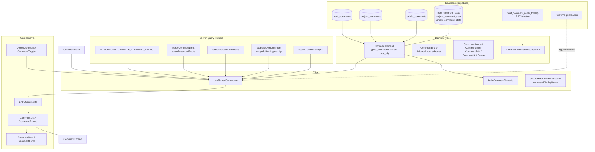
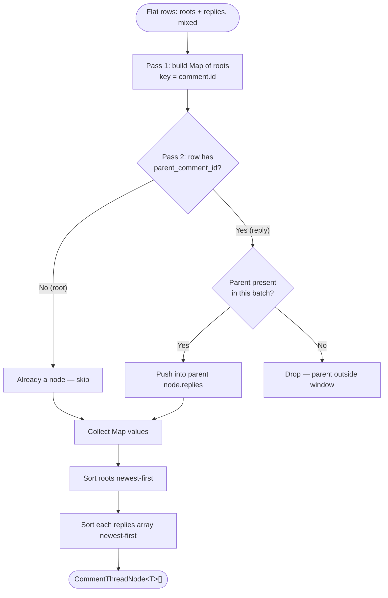
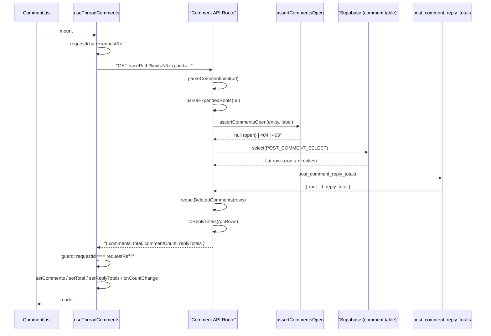
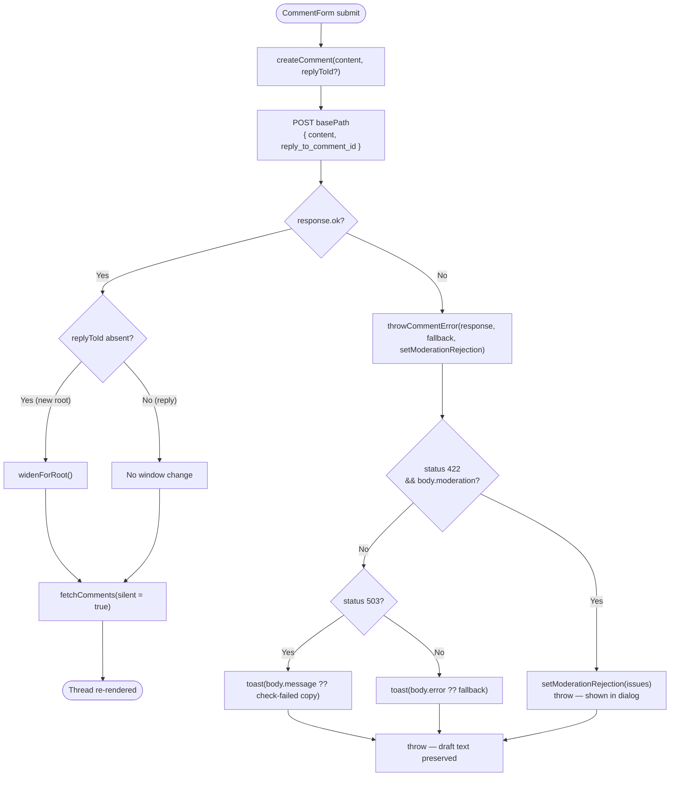
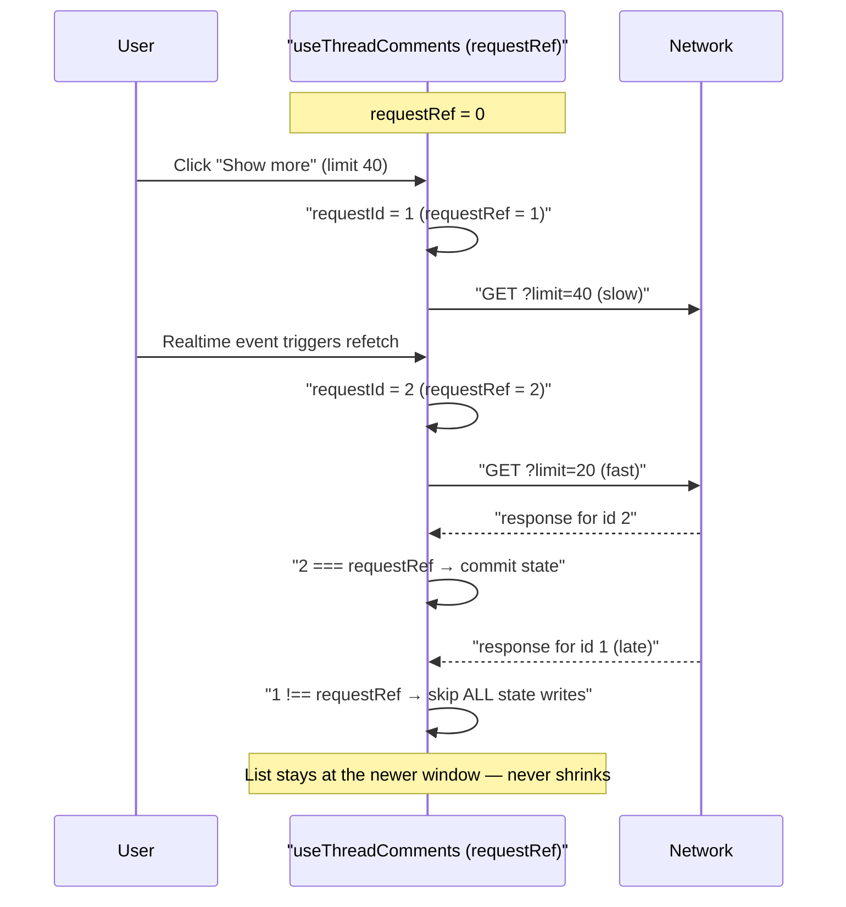
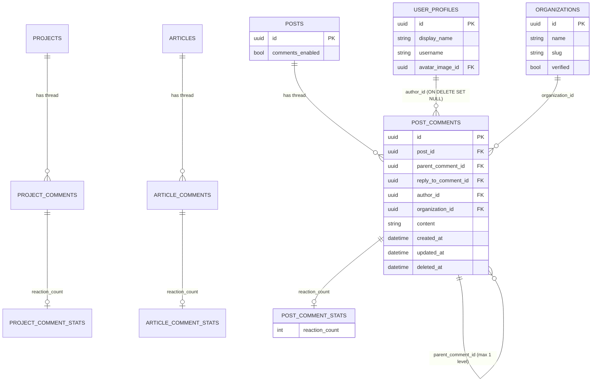

A shared, entity-agnostic comment system that powers threaded discussions — with reactions and reply folds — for posts, projects and articles through a single code path.

## Purpose and Scope

This page documents the cross-entity commenting subsystem of ozeaon-v2: how a thread is fetched, nested into two levels, mutated (create / edit / soft-delete), redacted, scoped to the acting identity, folded and expanded, and how reactions are tracked and applied optimistically on the client.

It covers:

- The shared TypeScript comment domain types and how they are derived from the generated Supabase schema (`src/types/comments.ts`).
- The server-side query helpers that build the per-entity `select` strings, clamp pagination, redact deleted comments, and enforce posting identity (`src/lib/supabase/queries/comments.ts`).
- The thread assembly algorithm that turns a flat row list into Level 1 comments with Level 2 replies (`src/utils/data/comments.ts`).
- The client hook that owns thread state, request sequencing, reply folding and optimistic reactions (`src/hooks/use-thread-comments.ts`).
- The React component surface under `src/components/ui/comments/`.
- The database tables, stats tables, reply-total function and realtime publication involved.

**Out of scope (sibling pages).** The generic post/project/article detail pages that *host* a thread, the article editor that renders one, and the moderation pipeline that gates writes (only its 422/503 contract is described here) are documented on their own pages. The `EntityComments` wrapper and each entity's `CommentsSection` are covered here only to the extent that they wire the thread into a host page.

## Overview

Commenting is deliberately **one implementation, three entities**. Rather than three parallel features, the codebase treats the comment thread as an entity-agnostic capability:

- The schema holds one comment table per commentable entity (`post_comments`, `project_comments`, `article_comments`), each with its own statistics side-table (`post_comment_stats`, `project_comment_stats`, `article_comment_stats`).
- The TypeScript layer collapses those tables back into a single shared shape. `ThreadComment` is defined as `post_comments` **minus its `post_id` foreign key**, so entity-specific types re-add only their own FK column.
- The entity list itself is *inferred from the generated database types* instead of being hardcoded, so adding a fourth comment table extends the union automatically.

Key terminology used throughout this page:

| Term | Meaning |
| --- | --- |
| **Level 1 comment** (`root`) | A comment with `parent_comment_id === null`. Also called a "root". |
| **Level 2 reply** | A comment whose `parent_comment_id` points at a root. The spec allows exactly two nesting levels. |
| **Thread** | One root plus all of its replies, produced by `buildCommentThreads`. |
| **Reaction** | A like stored in the entity's `*_comment_stats` row, surfaced as `reaction_count`. |
| **Reply total** | The *server-side* number of replies held under a root, counting rows the client has not loaded (from `post_comment_reply_totals`). |
| **Posting identity** | The hat a writer wore — either the acting user or an organisation. Editing/deleting requires the *same* hat. |
| **Soft delete** | A row is kept and stamped with `deleted_at`; its content is redacted but its author, timestamp and like count remain visible. |

Two design decisions explain most of the code that follows:

1. **The thread window is a single request shape.** The client always renders the newest `limit` Level 1 comments, so every refresh — a mutation, a realtime event, or "Show more" — is the same request with only `limit` and `expand` changed. This is why the hook keeps `limitRef` and `expandedRef` as mutable refs rather than state.
2. **Reactions move locally, the thread moves by refetch.** A like updates the heart and its tally in one `setComments` call, because reading a single integer back from the server would refetch the entire thread and leave the number trailing the icon by a round trip.

## Architecture

The subsystem is layered from schema, through type derivation, to server query helpers, to a client hook, to presentational components.



The diagram shows the deliberate separation of concerns: schema-level tables are never referenced directly by components, the type layer flattens them, the server helpers own validation/redaction/scoping, and only `useThreadComments` knows how to talk to the API. Components remain presentational and receive their behaviour from the hook.

### Binding one hook to three entities

The hook takes a `basePath` and a `fetchLiked` callback, which is the entire mechanism by which one implementation serves three routes:

```typescript
interface UseThreadCommentsOptions {
  basePath: string;
  fetchLiked: (commentIds: string[]) => Promise<string[]>;
  onCountChange?: (count: number) => void;
}
```

> Source: [use-thread-comments.ts](https://github.com/ozeaon/ozeaon-v2/blob/0a4f1a95824db87782f1221a4108019d174df3d9/src/hooks/use-thread-comments.ts#L49-L53)

Everything else — create, update, delete, paginate, expand replies — is expressed as HTTP verbs against `${basePath}` and `${basePath}/${id}`, so a new commentable entity only needs a route that speaks the same protocol.

## The Shared Comment Shape

`ThreadComment` is the single row shape every entity's comment list is projected onto. Its definition is worth reading closely because it demonstrates the codebase's "derive, don't duplicate" approach:

```typescript
export type ThreadComment = Omit<Tables<"post_comments">, "post_id"> & {
  author: UserProfileForJoin | null;
  authoring_org:
    | (Pick<Tables<"organizations">, "id" | "name" | "slug" | "verified"> & {
        logo_image: Pick<Tables<"images">, "path"> | null;
      })
    | null;
  stats: Pick<Tables<"post_comment_stats">, "reaction_count"> | null;
};
```

> Source: [comments.ts](https://github.com/ozeaon/ozeaon-v2/blob/0a4f1a95824db87782f1221a4108019d174df3d9/src/types/comments.ts#L12-L20)

Three details carry design intent:

- **`Omit<..., "post_id">`** removes the *only* column that differs between the three comment tables. Each entity's concrete type re-adds its own FK, so `post_id` / `project_id` / `article_id` never leak into shared code.
- **`author` is nullable** because the `author_id` foreign key is `ON DELETE SET NULL`. A deleted profile does not delete the comment; it leaves an anonymous-looking row.
- **`stats` is nullable** and narrowed to `reaction_count` alone, so shared code can never accidentally depend on a per-entity stats column that only one entity defines.

### The entity list is inferred, not declared

Rather than a hand-maintained union of three string literals, the entity type is computed from the generated schema:

```typescript
export type CommentEntity =
  Extract<
    keyof Database["public"]["Tables"],
    `${string}_comments`
  > extends infer Table
    ? Table extends `${infer Entity}_comments`
      ? Entity
      : never
    : never;
```

> Source: [comments.ts](https://github.com/ozeaon/ozeaon-v2/blob/0a4f1a95824db87782f1221a4108019d174df3d9/src/types/comments.ts#L24-L32)

This template-literal inference scans `Database["public"]["Tables"]` for keys ending in `_comments` and strips the suffix. The practical consequence: **regenerating the Supabase types after adding `listing_comments` makes `CommentEntity` include `"listing"` with no source edit.** The comment beside it states this explicitly — "a fourth comment table joins the union on its own."

A companion type expresses the *gate* rather than the table:

```typescript
export type CommentableEntity =
  | Pick<Tables<"posts">, "comments_enabled">
  | Pick<Tables<"projects">, "comments_enabled">
  | Pick<Tables<"articles">, "comments_enabled">;
```

> Source: [comments.ts](https://github.com/ozeaon/ozeaon-v2/blob/0a4f1a95824db87782f1221a4108019d174df3d9/src/types/comments.ts#L34-L38)

This is the union `assertCommentsOpen` consumes: it needs only to know whether the entity exists and whether `comments_enabled` is true.

### Narrow intersection types for specific jobs

Rather than passing whole `ThreadComment` objects around, each operation receives the smallest type it actually needs. This makes illegal states unrepresentable and documents precisely which columns each layer touches:

| Type | Composed from | Purpose |
| --- | --- | --- |
| `RedactableComment` | `content \| deleted_at \| updated_at` | Columns a soft-deleted comment strips before leaving the API |
| `RoutableComment` | `RedactableComment & id` | Columns the comment route *factories* touch on any entity's row |
| `AuthoredComment` | `author \| authoring_org` | Whichever identity a comment is credited to, for the display name |
| `CommentOwnership` | `author_id \| organization_id` | Columns deciding whether the acting identity may edit/delete |
| `CommentThreadFields` | `id \| parent_comment_id \| created_at` | The minimum threading needs: identity, nesting, ordering |
| `CommentRealtimeRow` | `parent_comment_id \| deleted_at` | Columns a realtime payload is read for |
| `ReplyTotalRow` | `post_comment_reply_totals` return row | One `{ root_id, reply_total }` pair |

> Source: [comments.ts](https://github.com/ozeaon/ozeaon-v2/blob/0a4f1a95824db87782f1221a4108019d174df3d9/src/types/comments.ts#L40-L66)

The comment on `CommentRealtimeRow` is telling: *"Columns a realtime payload is read for; the row itself arrives untyped."* Realtime frames are not runtime-validated, so the codebase documents the two fields it trusts and ignores the rest.

### Generic threading types

Threading is expressed generically so it works for any entity's concrete comment type:

```typescript
export type CommentThreadNode<T extends CommentThreadFields> = {
  comment: T;
  replies: T[];
};
```

> Source: [comments.ts](https://github.com/ozeaon/ozeaon-v2/blob/0a4f1a95824db87782f1221a4108019d174df3d9/src/types/comments.ts#L68-L71)

Because `buildCommentThreads<T extends CommentThreadFields>` only reads `id`, `parent_comment_id` and `created_at`, it is fully reusable across `ThreadComment` variants with their entity-specific FK intact.

### The response envelope

Every thread endpoint returns the same four-field envelope:

```typescript
export interface CommentThreadResponse<T> {
  comments: T[];
  /** Level 1 comments in the thread, used to size the Show more control. */
  total: number;
  /** Every live comment and reply in the thread (CO-05). */
  commentCount: number;
  /** Replies held per Level 1 comment; the loaded rows are capped below it. */
  replyTotals: Record<string, number>;
}
```

> Source: [comments.ts](https://github.com/ozeaon/ozeaon-v2/blob/0a4f1a95824db87782f1221a4108019d174df3d9/src/types/comments.ts#L85-L93)

The two counters exist because they answer different questions. `total` counts **Level 1 comments present in the response** and sizes the "Show more" control. `commentCount` is the count of **every live comment and reply** and drives the host page's header badge. `replyTotals` is separate again, because replies are capped server-side — the loaded rows literally *cannot* tell the client how many replies exist.

### Mutation input types

Create, edit and delete share a nested composition so scoping rules are enforced by the type system:

```typescript
export type CommentInsert = Pick<
  TablesInsert<"post_comments">,
  "content" | "reply_to_comment_id" | "organization_id"
> & {
  entityId: string;
  /** Never null here: a comment is written under the acting user, and only a
   * later profile deletion can strip `author_id` off the stored row. */
  authorId: string;
};

/** Narrows a comment mutation to one comment and the identity allowed to make it. */
export type CommentScope = Pick<CommentInsert, "entityId" | "authorId"> & {
  commentId: string;
  activeAccount: ActiveAccount;
};

export type CommentEdit = CommentScope & Pick<CommentInsert, "content">;

export type CommentSoftDelete = CommentScope & {
  deletedAt: NonNullable<Tables<"post_comments">["deleted_at"]>;
};
```

> Source: [comments.ts](https://github.com/ozeaon/ozeaon-v2/blob/0a4f1a95824db87782f1221a4108019d174df3d9/src/types/comments.ts#L95-L117)

Note the asymmetry the comment highlights: `CommentInsert.authorId` is **non-nullable**, while the stored column is nullable. A comment is always *written* under the acting user; only a later profile deletion can strip `author_id` off the stored row. The type therefore models the write path, not the read path.

`CommentSoftDelete` requires `deletedAt` to be `NonNullable<...>`, forcing the delete route to supply a real timestamp rather than passing `null` to a column that means "not deleted".

## Server Query Layer

`src/lib/supabase/queries/comments.ts` is the server-side toolbox shared by all three comment routes. It deliberately exports **literal** select strings rather than a builder function:

```typescript
// Kept as literal strings — Supabase infers row types from the select text, so a
// dynamically built select would collapse to an untyped result.
export const POST_COMMENT_SELECT = `
  *,
  author:user_profiles(id,display_name,username,avatar_image_id,avatar_image:images!avatar_image_id(id,path,alt)),
  authoring_org:organizations!post_comments_organization_id_fkey(id,name,slug,verified,logo_image:images!organizations_logo_image_id_fkey(path)),
  stats:post_comment_stats(reaction_count)
` as const;
```

> Source: [comments.ts](https://github.com/ozeaon/ozeaon-v2/blob/0a4f1a95824db87782f1221a4108019d174df3d9/src/lib/supabase/queries/comments.ts#L12-L19)

This is a significant trade-off, documented in the source comment itself. Supabase's type inference works by parsing the select string *at compile time*; concatenating pieces or interpolating a table name would erase the inferred types. The cost is three near-identical constants. The benefit is that `data.comments[i].author.display_name` is type-checked end to end.

The three selects differ only in their FK constraint names, which is exactly the entity-specific part:

| Constant | Entity FK | Stats table |
| --- | --- | --- |
| `POST_COMMENT_SELECT` | `post_comments_organization_id_fkey` | `post_comment_stats` |
| `PROJECT_COMMENT_SELECT` | `project_comments_organization_id_fkey` | `project_comment_stats` |
| `ARTICLE_COMMENT_SELECT` | `article_comments_organization_id_fkey` | `article_comment_stats` |

> Source: [comments.ts](https://github.com/ozeaon/ozeaon-v2/blob/0a4f1a95824db87782f1221a4108019d174df3d9/src/lib/supabase/queries/comments.ts#L14-L33)

Each select embeds three joined resources matching the `ThreadComment` shape exactly: `author` (profile plus nested avatar image), `authoring_org` (organisation plus nested logo), and `stats` narrowed to `reaction_count`. The `!constraint_name` syntax disambiguates the FK when a table has more than one route to `organizations`.

### Pagination clamping

```typescript
/** Number of Level 1 comments a thread request may load, clamped to a sane range. */
export function parseCommentLimit(url: string) {
  const requested = Number(new URL(url).searchParams.get("limit"));
  if (!Number.isFinite(requested) || requested < COMMENT_BATCH_SIZE) {
    return COMMENT_BATCH_SIZE;
  }
  return Math.min(Math.trunc(requested), MAX_COMMENT_LIMIT);
}
```

> Source: [comments.ts](https://github.com/ozeaon/ozeaon-v2/blob/0a4f1a95824db87782f1221a4108019d174df3d9/src/lib/supabase/queries/comments.ts#L35-L42)

The clamp is **one-sided and ratcheting**: any value below `COMMENT_BATCH_SIZE` (including `NaN`, negatives, and the absent-parameter `Number(null) === 0` case) collapses to the batch size, while values above `MAX_COMMENT_LIMIT` are truncated. `Math.trunc` rejects fractional limits. This prevents a client from requesting `limit=1000000` and forcing an unbounded scan.

### Expanding roots

```typescript
/** Level 1 comments whose replies the client is currently showing in full. */
export function parseExpandedRoots(url: string): string[] {
  const raw = new URL(url).searchParams.get("expand");
  if (!raw) return [];

  return raw.split(",").filter(isUuid).slice(0, MAX_COMMENT_LIMIT);
}
```

> Source: [comments.ts](https://github.com/ozeaon/ozeaon-v2/blob/0a4f1a95824db87782f1221a4108019d174df3d9/src/lib/supabase/queries/comments.ts#L116-L122)

The `expand` parameter carries root IDs whose replies should be returned in full. The `.filter(isUuid)` step is a security-relevant guard: these strings are **interpolated into a query filter**, so admitting arbitrary text would be an injection vector. Rejecting non-UUIDs before the value reaches the query builder is the mitigation. The `.slice(0, MAX_COMMENT_LIMIT)` mirrors the limit clamp, bounding query width.

### Soft-delete redaction

```typescript
/**
 * Drops the content of a deleted comment. Its author, timestamp and like count
 * are still shown alongside the placeholder (AC-23), and the row itself is kept
 * so replies stay anchored and can render "Reply to deleted comment".
 */
export function redactDeletedComments<T extends RedactableComment>(
  comments: T[],
): T[] {
  return comments.map((comment) =>
    comment.deleted_at
      ? { ...comment, content: "", updated_at: null }
      : comment,
  );
}
```

> Source: [comments.ts](https://github.com/ozeaon/ozeaon-v2/blob/0a4f1a95824db87782f1221a4108019d174df3d9/src/lib/supabase/queries/comments.ts#L44-L57)

Redaction happens **in the API layer, not in SQL**, and is intentionally shallow: only `content` is emptied and `updated_at` nulled. The author, timestamp and reaction count survive so a deleted comment still renders as a tombstone with its identity and tally. The row itself is never removed — keeping it preserves reply anchoring, which is what allows a child to render "Reply to deleted comment" instead of orphaning.

Because the function is generic over `T extends RedactableComment`, it works on any entity's row type without casting.

### Identity scoping — the two-hat rule

This is the most subtle correctness rule in the subsystem. A user may post a comment *as themselves* or *as an organisation they administer*. Authorship alone is insufficient to authorize an edit, because that would let someone wearing a different hat mutate a comment:

```typescript
/**
 * Narrows a comment mutation to the identity that posted it. Authorship alone is
 * not enough: someone commenting for an organisation must be wearing the same hat
 * to edit or delete it, so the acting organisation joins the filter.
 */
export function scopeToPostingIdentity<
  Q extends {
    eq(column: "organization_id", value: string): Q;
    is(column: "organization_id", value: null): Q;
  },
>(query: Q, activeAccount: ActiveAccount): Q {
  return activeAccount.type === "org"
    ? query.eq("organization_id", activeAccount.id)
    : query.is("organization_id", null);
}
```

> Source: [comments.ts](https://github.com/ozeaon/ozeaon-v2/blob/0a4f1a95824db87782f1221a4108019d174df3d9/src/lib/supabase/queries/comments.ts#L59-L73)

The `Q` type parameter is a **structural constraint** rather than a Supabase import. It asserts only that the builder chain supports `eq` and `is` on `organization_id` and returns `Q`. This keeps the helper decoupled from the generated query-builder types while preserving fluent chaining and type inference at each call site.

Composition happens in the second helper:

```typescript
export function scopeToOwnComment<
  Q extends {
    eq(column: "id", value: string): Q;
    eq(column: "author_id", value: string): Q;
    eq(column: "organization_id", value: string): Q;
    is(column: "organization_id", value: null): Q;
  },
>(query: Q, { commentId, authorId, activeAccount }: CommentScope): Q {
  return scopeToPostingIdentity(
    query.eq("id", commentId).eq("author_id", authorId),
    activeAccount,
  );
}
```

> Source: [comments.ts](https://github.com/ozeaon/ozeaon-v2/blob/0a4f1a95824db87782f1221a4108019d174df3d9/src/lib/supabase/queries/comments.ts#L75-L92)

The full authorization predicate for a mutation is therefore the conjunction of three conditions: `id = commentId` **AND** `author_id = authorId` **AND** (`organization_id = activeAccount.id` **OR** `organization_id IS NULL`). A mismatch on any clause yields zero affected rows.

The comment notes why the entity FK is *not* included here: *"The entity's own foreign key is left to the caller — it is the one column of the four that is named differently in every comment table."* This is the seam that keeps the helper entity-agnostic.

### The commenting gate

```typescript
/**
 * Rejects a write when the entity is missing or has commenting turned off,
 * keeping the two apart so a bad id never reads as a disabled thread (AC-48).
 */
export function assertCommentsOpen(
  entity: CommentableEntity | null,
  label: string,
): NextResponse | null {
  if (!entity) {
    return NextResponse.json({ error: "Not found" }, { status: 404 });
  }

  if (!entity.comments_enabled) {
    return NextResponse.json(
      { error: `Comments are disabled for this ${label}` },
      { status: 403 },
    );
  }

  return null;
}
```

> Source: [comments.ts](https://github.com/ozeaon/ozeaon-v2/blob/0a4f1a95824db87782f1221a4108019d174df3d9/src/lib/supabase/queries/comments.ts#L94-L114)

The return-null-on-success convention lets a route write `const gate = assertCommentsOpen(...); if (gate) return gate;` as a guard clause. The 404/403 split matters: a nonexistent entity must return `404 Not found`, while an existing entity with commenting disabled returns `403`. Merging them would let a bad ID masquerade as a disabled thread, which the source explicitly calls out (AC-48).

### Reply totals

```typescript
/**
 * Replies held per Level 1 comment, which is what the "Show {N} more replies"
 * control counts against — the loaded rows are capped and cannot tell it.
 */
export function toReplyTotals(rows: ReplyTotalRow[]): Record<string, number> {
  return Object.fromEntries(
    rows.map(({ root_id, reply_total }) => [root_id, reply_total]),
  );
}
```

> Source: [comments.ts](https://github.com/ozeaon/ozeaon-v2/blob/0a4f1a95824db87782f1221a4108019d174df3d9/src/lib/supabase/queries/comments.ts#L124-L132)

This converts the `post_comment_reply_totals` RPC result into the `Record<string, number>` the response envelope expects — a lookup keyed by root ID, so a rendered thread can ask "how many replies does this root really hold?" in O(1).

## Threading Algorithm

Turning a flat, newest-first row list into a two-level structure is `buildCommentThreads` in `src/utils/data/comments.ts`:

```typescript
const newestFirst = (a: CommentThreadFields, b: CommentThreadFields) =>
  new Date(b.created_at).getTime() - new Date(a.created_at).getTime();

export function buildCommentThreads<T extends CommentThreadFields>(
  comments: T[],
): CommentThreadNode<T>[] {
  const nodes = new Map<string, CommentThreadNode<T>>();

  for (const comment of comments) {
    if (!comment.parent_comment_id) {
      nodes.set(comment.id, { comment, replies: [] });
    }
  }

  for (const comment of comments) {
    if (!comment.parent_comment_id) continue;
    nodes.get(comment.parent_comment_id)?.replies.push(comment);
  }

  const threads = [...nodes.values()];
  threads.sort((a, b) => newestFirst(a.comment, b.comment));
  for (const thread of threads) thread.replies.sort(newestFirst);

  return threads;
}
```

> Source: [comments.ts](https://github.com/ozeaon/ozeaon-v2/blob/0a4f1a95824db87782f1221a4108019d174df3d9/src/utils/data/comments.ts#L27-L56)

The algorithm is a **two-pass grouping over a single `Map`**, which makes it O(n) in the number of comments:

1. **Pass 1 — collect roots.** Every comment without `parent_comment_id` becomes a node keyed by its own `id`, with an empty `replies` array.
2. **Pass 2 — attach replies.** Every comment *with* a parent is pushed onto its parent's node using optional chaining.

The optional chaining on `nodes.get(comment.parent_comment_id)?.replies.push(comment)` implements an intentional policy: **replies whose parent is not in the batch are silently dropped.** This is not a bug — it is what makes a *capped* batch self-consistent. When the server returns only the newest N roots plus replies for the expanded subset, a reply belonging to a root outside the window has nowhere to attach and must be discarded rather than rendered as an orphan.

Both passes share a `newestFirst` comparator that subtracts epoch millisecond values, and sorting is applied **independently at both levels** — roots newest-first, and each root's replies newest-first.



### Display name resolution

Crediting a comment is a three-way fallback, with organisation taking precedence over user:

```typescript
/** Name shown on a comment: the authoring organisation, else the user. */
export function commentDisplayName(comment: AuthoredComment) {
  if (comment.authoring_org) return comment.authoring_org.name;
  if (!comment.author) return "Deleted user";
  return comment.author.display_name || `@${comment.author.username}`;
}
```

> Source: [comments.ts](https://github.com/ozeaon/ozeaon-v2/blob/0a4f1a95824db87782f1221a4108019d174df3d9/src/utils/data/comments.ts#L20-L25)

The ordering encodes the two-hat model: if a comment was posted *as an organisation*, the organisation name is shown, because that is the identity the writer chose to speak as. The `"Deleted user"` branch handles the `ON DELETE SET NULL` case, and the final line falls back to an `@username` when a profile has no `display_name`.

### Hiding an empty disabled thread

```typescript
/**
 * A thread nobody may add to and that holds nothing has nothing to show, so the
 * section is dropped entirely rather than inviting comments it cannot accept.
 * The spec's disabled-thread rules (AC-46..48) all concern comments that already
 * exist, which is the case where the author switched commenting off later.
 */
export function shouldHideCommentSection(
  commentsEnabled: boolean,
  commentCount: number,
) {
  return !commentsEnabled && commentCount === 0;
}
```

> Source: [comments.ts](https://github.com/ozeaon/ozeaon-v2/blob/0a4f1a95824db87782f1221a4108019d174df3d9/src/utils/data/comments.ts#L7-L18)

This is a two-condition predicate, and both conditions are essential. A disabled thread **with** existing comments must remain visible (read-only) — that is the common case where an author turns commenting off after discussion has happened. Only the intersection of *disabled* and *empty* warrants hiding the section, since it has nothing to show and nothing to accept.

## Client-Side Thread State: `useThreadComments`

The hook in `src/hooks/use-thread-comments.ts` is the single owner of thread state. It holds eight pieces of state:

```typescript
const [comments, setComments] = useState<T[]>([]);
const [total, setTotal] = useState(0);
const [replyTotals, setReplyTotals] = useState<Record<string, number>>({});
const [likedComments, setLikedComments] = useState<string[]>([]);
const [isLoading, setIsLoading] = useState(false);
const [isLoadingMore, setIsLoadingMore] = useState(false);
const [moderationRejection, setModerationRejection] = useState<
  ApiModerationIssue[] | null
>(null);
```

> Source: [use-thread-comments.ts](https://github.com/ozeaon/ozeaon-v2/blob/0a4f1a95824db87782f1221a4108019d174df3d9/src/hooks/use-thread-comments.ts#L60-L68)

### Three mutable refs that must not be state

The subtle design of this hook lives in its refs:

```typescript
// The thread always renders the newest `limit` level 1 comments, so every
// refresh — including the one after a mutation — is the same single request.
const limitRef = useRef(COMMENT_BATCH_SIZE);
const expandedRef = useRef<string[]>([]);

// Mutations, realtime and Show more all refetch the same window. Without a
// sequence number a slow reply can land after a newer one and shrink the list
// back under the reader.
const requestRef = useRef(0);
```

> Source: [use-thread-comments.ts](https://github.com/ozeaon/ozeaon-v2/blob/0a4f1a95824db87782f1221a4108019d174df3d9/src/hooks/use-thread-comments.ts#L74-L82)

Each ref exists for a distinct reason:

- **`limitRef`** stores the current window size. It is a ref, not state, so that reading it inside `fetchComments` never requires it in the dependency array — which would otherwise rebuild the callback (and every callback derived from it) on every "Show more" click.
- **`expandedRef`** stores the set of roots currently showing all replies. Same rationale: `fetchComments` must build the `expand` query string without becoming dependent on a state value.
- **`requestRef`** is a monotonic sequence number implementing **stale-response rejection**. This is the concurrency guard, and its absence would cause a real, visible bug: "Show more" fires a request for 40 comments, a concurrent realtime-triggered refetch fires for 20, the *slow* 40-response lands first, then the fast 20-response overwrites it — and the list visibly **shrinks back under the reader**.

### The unified fetch

Every read path funnels through one function, parameterised only by `silent` (whether to show the loading spinner):

```typescript
const fetchComments = useCallback(
  async (silent: boolean) => {
    const requestId = ++requestRef.current;
    if (!silent) setIsLoading(true);

    try {
      const expand = expandedRef.current.length
        ? `&expand=${expandedRef.current.join(",")}`
        : "";
      const response = await fetch(
        `${basePath}?limit=${limitRef.current}${expand}`,
      );

      if (!response.ok) {
        const error: { error?: string } = await response.json();
        throw new Error(error.error || "Failed to fetch comments");
      }

      const data: CommentThreadResponse<T> = await response.json();
      if (requestId !== requestRef.current) return data.comments;

      setComments(data.comments);
      setTotal(data.total);
      setReplyTotals(data.replyTotals);
      onCountChange?.(data.commentCount);
      return data.comments;
    } catch (err) {
      const error = err instanceof Error ? err : new Error("Unknown error");
      toast.error(error.message);
      return [];
    } finally {
      if (requestId === requestRef.current) setIsLoading(false);
    }
  },
  [basePath, onCountChange],
);
```

> Source: [use-thread-comments.ts](https://github.com/ozeaon/ozeaon-v2/blob/0a4f1a95824db87782f1221a4108019d174df3d9/src/hooks/use-thread-comments.ts#L84-L119)

Four things are worth extracting:

1. **`const requestId = ++requestRef.current`** captures this request's sequence number *before* the await. Any later request increments the counter, so it will fail the guard.
2. **`if (requestId !== requestRef.current) return data.comments;`** is the staleness check. A superseded response still returns its data to the *caller* (so `createComment` can await a resolved promise) but **skips all state writes**. This is why the list never shrinks.
3. **All four state setters move together.** `comments`, `total`, `replyTotals` and the `onCountChange` callback fire as a unit, so the response envelope is applied atomically from the reader's perspective. `onCountChange` is how the host page's header badge learns `commentCount` without prop-drilling.
4. **`finally` re-checks the guard** before clearing `isLoading`, so an overtaken request cannot clear the spinner owned by a newer one.

Errors are toasted and **swallowed into an empty array** rather than rethrown, meaning a failed refresh leaves the previous thread on screen rather than blanking the section.

### Pagination, expansion and folding

```typescript
const loadMoreComments = useCallback(async () => {
  setIsLoadingMore(true);
  limitRef.current += COMMENT_BATCH_SIZE;
  await fetchComments(true);
  setIsLoadingMore(false);
}, [fetchComments]);

/** Loads every reply under one Level 1 comment, for RL-02. */
const expandReplies = useCallback(
  async (rootId: string) => {
    if (expandedRef.current.includes(rootId)) return;
    expandedRef.current = [...expandedRef.current, rootId];
    await fetchComments(true);
  },
  [fetchComments],
);

const collapseReplies = useCallback((rootId: string) => {
  expandedRef.current = expandedRef.current.filter((id) => id !== rootId);
}, []);
```

> Source: [use-thread-comments.ts](https://github.com/ozeaon/ozeaon-v2/blob/0a4f1a95824db87782f1221a4108019d174df3d9/src/hooks/use-thread-comments.ts#L121-L140)

`loadMoreComments` uses a separate `isLoadingMore` flag so the "Show more" button can show its own spinner without blanking the existing list (`fetchComments(true)` is silent). `expandReplies` is **idempotent** — the `includes` check prevents duplicate IDs from accumulating in the query string — and mutates the ref *before* awaiting the refetch so the new request includes the root being expanded.

Note the asymmetry on collapse:

```typescript
/** Keeps a newly arrived Level 1 comment from pushing the oldest one out. */
const widenForRoot = useCallback(() => {
  limitRef.current += 1;
}, []);

const narrowForRoot = useCallback(() => {
  limitRef.current = Math.max(COMMENT_BATCH_SIZE, limitRef.current - 1);
}, []);
```

> Source: [use-thread-comments.ts](https://github.com/ozeaon/ozeaon-v2/blob/0a4f1a95824db87782f1221a4108019d174df3d9/src/hooks/use-thread-comments.ts#L142-L149)

`collapseReplies` deliberately **does not refetch**. Collapsing is purely a ref removal; the next fetch will simply stop mentioning that root, and until then the already-loaded replies remain in memory. `widenForRoot` / `narrowForRoot` implement a window-adjustment invariant: because the client always shows the *newest* `limit` roots, posting a new root would otherwise push the oldest visible one out of the window. Widening by one before the refetch keeps the reader's view stable. `narrowForRoot` is clamped at `COMMENT_BATCH_SIZE` so deleting roots can never shrink the window below the minimum useful size.

### Mutations

```typescript
const createComment = useCallback(
  async (content: string, replyToId?: string) => {
    const response = await fetch(basePath, {
      method: "POST",
      headers: { "Content-Type": "application/json" },
      body: JSON.stringify({
        content,
        reply_to_comment_id: replyToId ?? null,
      }),
    });

    if (!response.ok) {
      await throwCommentError(
        response,
        "Failed to post comment",
        setModerationRejection,
      );
    }

    if (!replyToId) widenForRoot();
    await fetchComments(true);
  },
  [basePath, fetchComments, widenForRoot],
);
```

> Source: [use-thread-comments.ts](https://github.com/ozeaon/ozeaon-v2/blob/0a4f1a95824db87782f1221a4108019d174df3d9/src/hooks/use-thread-comments.ts#L151-L174)

The `if (!replyToId) widenForRoot()` line is precise: only a **new root** occupies a slot in the Level 1 window. Posting a reply changes the root count not at all, so it must not widen. Note also `replyToId ?? null` — the API receives an explicit `null` rather than an absent key, matching the column's meaning.

`updateComment` issues a `PATCH` to `${basePath}/${id}` with only `content`, and `deleteComment` an unfiltered `DELETE`:

```typescript
const deleteComment = useCallback(
  async (id: string, isRoot: boolean) => {
    const response = await fetch(`${basePath}/${id}`, { method: "DELETE" });

    if (!response.ok) {
      toast.error("Failed to delete comment");
      throw new Error("Failed to delete comment");
    }

    if (isRoot) {
      narrowForRoot();
      collapseReplies(id);
    }
    await fetchComments(true);
  },
  [basePath, fetchComments, narrowForRoot, collapseReplies],
);
```

> Source: [use-thread-comments.ts](https://github.com/ozeaon/ozeaon-v2/blob/0a4f1a95824db87782f1221a4108019d174df3d9/src/hooks/use-thread-comments.ts#L197-L213)

`deleteComment` takes an `isRoot` flag because deleting a root frees one slot in the Level 1 window (so the window narrows) and makes that root's expansion entry meaningless (so it collapses). Deleting a reply needs neither adjustment.

### Distinguishing moderation failures from generic errors

```typescript
/**
 * Shared failure branch for createComment/updateComment. A moderation
 * rejection (422) sets state for the dialog instead of toasting; a moderation
 * failure (503) toasts the ticket's page-level copy; anything else keeps the
 * existing generic toast. Always throws so the caller's composer keeps its
 * draft text (CommentForm.handleFormSubmit swallows the rejection).
 */
async function throwCommentError(
  response: Response,
  fallback: string,
  setModerationRejection: (rejection: ApiModerationIssue[] | null) => void,
): Promise<never> {
  const body = await response
    .json<CommentErrorBody>()
    .catch(() => ({}) as CommentErrorBody);

  if (response.status === 422 && body.moderation) {
    setModerationRejection(body.moderation);
    throw new Error(body.error || "Moderation rejected");
  }

  const message =
    response.status === 503
      ? body.message ||
        "We couldn't complete the content check. Please try again."
      : body.error || fallback;

  toast.error(message);
  throw new Error(message);
}
```

> Source: [use-thread-comments.ts](https://github.com/ozeaon/ozeaon-v2/blob/0a4f1a95824db87782f1221a4108019d174df3d9/src/hooks/use-thread-comments.ts#L18-L47)

This function encodes a three-way error contract:

| Status | Branch | User-visible behaviour |
| --- | --- | --- |
| `422` with `moderation` payload | Sets `moderationRejection` state | Rendered **in the dialog**, not a toast, so the writer can see which issue was flagged |
| `503` | Toasts `body.message` or a page-level fallback | Moderation *service* is unavailable — retryable |
| Anything else | Toasts `body.error` or the caller's `fallback` string | Generic failure |

Two deliberate choices: `.catch(() => ({}))` makes a non-JSON error body non-fatal (the code degrades to the fallback message rather than throwing a JSON parse error), and the function's return type is `Promise<never>` — it **always** throws. That is what preserves the writer's draft: the rejection propagates to `CommentForm.handleFormSubmit`, which swallows it and keeps the textarea populated.

`clearModerationRejection` is exposed as a stable `useCallback` with an empty dependency array so the dialog can reset the banner without re-rendering children.

### Optimistic reactions

```typescript
/**
 * Moves the heart and its tally together. Reading the new count back from the
 * server would refetch the whole thread for one integer and leave the number
 * trailing the icon by a round trip.
 */
const applyLocalLike = useCallback((commentId: string, liked: boolean) => {
  setLikedComments((prev) =>
    liked ? [...prev, commentId] : prev.filter((id) => id !== commentId),
  );
  setComments((prev) =>
    prev.map((comment) =>
      comment.id === commentId
        ? {
            ...comment,
            stats: {
              reaction_count: Math.max(
                (comment.stats?.reaction_count ?? 0) + (liked ? 1 : -1),
                0,
              ),
            },
          }
        : comment,
    ),
  );
}, []);
```

> Source: [use-thread-comments.ts](https://github.com/ozeaon/ozeaon-v2/blob/0a4f1a95824db87782f1221a4108019d174df3d9/src/hooks/use-thread-comments.ts#L215-L239)

This implements an **optimistic update**, and the source comment explains the trade-off: a server round-trip to read back one integer would refetch the whole thread and make the number visibly lag the icon. Instead both the membership set (`likedComments`) and the displayed count move in the *same synchronous batch*, so React renders them together and the heart never appears out of sync with its tally.

Two defensive details:

- **`Math.max(..., 0)`** clamps the count so a spurious unlike on a zero-count comment cannot render a negative number.
- **`comment.stats?.reaction_count ?? 0`** handles the nullable `stats` relation from `ThreadComment` — a comment whose stats row has not loaded yet is treated as zero rather than throwing.

`likedComments` is a `string[]` rather than a `Set` because it is React state, and a new array reference is what triggers re-render. The `applyLocalLike` callback has an **empty dependency array** — it uses only functional state updaters, so it is referentially stable for the lifetime of the component and can be safely passed to memoised children.

Reaction state is seeded by the injected `fetchLiked(commentIds)` callback, which the host route supplies, since "which comments has *this viewer* liked?" is entity-specific and not part of the thread envelope.

## Core Flows

### Reading a thread



### Posting a comment (with moderation branches)



The key property of this flow is that **every failure branch throws**. That is what guarantees the composer retains its draft; the rejection is swallowed one level up by `CommentForm.handleFormSubmit`.

### Concurrent refresh protection



## Data Model

The persistence layer follows a **table-per-entity plus stats-table-per-entity** pattern. Each commentable entity gets a comment table and a statistics table, and a shared RPC aggregates reply counts.



Column semantics that matter to the application logic:

| Column | Role in the subsystem |
| --- | --- |
| `parent_comment_id` | `NULL` ⇒ Level 1 root; non-null ⇒ Level 2 reply. Drives `buildCommentThreads` and `CommentRealtimeRow`. |
| `reply_to_comment_id` | The explicit "replying to" target sent at insert time (`CommentInsert`), distinct from nesting. |
| `author_id` | `ON DELETE SET NULL` — the reason `ThreadComment.author` is nullable and `commentDisplayName` has a `"Deleted user"` branch. |
| `organization_id` | The *posting identity* hat. Its `IS NULL` / `= id` distinction is the core of `scopeToPostingIdentity`. |
| `deleted_at` | Soft-delete stamp. Non-null triggers `redactDeletedComments` and the tombstone render. |
| `content` | Emptied (`""`) on redaction; the only field actually cleared. |
| `comments_enabled` | Per-entity gate consumed by `assertCommentsOpen` and `shouldHideCommentSection`. |
| `reaction_count` | The only stats column projected into `ThreadComment.stats`. |

### Realtime

The repository contains `supabase/migrations/20260707000000_realtime_comments_publication.sql`, which adds the comment tables to the Supabase realtime publication. The client's consumption of this is indirect: a realtime frame is **not merged into React state**. Instead it triggers the same `fetchComments` path, which is precisely why `requestRef` exists — realtime events, user mutations and "Show more" all compete to refetch the *same window*.

## Failure Modes, Edge Cases & Concurrency

### Failure modes and their handling

| Failure | Detected by | Handling |
| --- | --- | --- |
| Entity does not exist | `assertCommentsOpen` returns `null` entity | `404 Not found` |
| Commenting disabled | `assertCommentsOpen` sees `comments_enabled === false` | `403` with a label-specific message |
| Viewer is not the comment's author, or wears a different hat | `scopeToOwnComment` predicate matches zero rows | Mutation affects nothing; the optimistic UI is corrected by the refetch |
| Moderation rejects content | `422` with `body.moderation` | Sets `moderationRejection` state for the dialog; throws so the draft survives |
| Moderation service unavailable | `503` | Toasts the page-level retry copy |
| Malformed error body (non-JSON) | `.catch(() => ({}))` in `throwCommentError` | Degrades gracefully to the fallback message |
| Thread fetch fails | `!response.ok` in `fetchComments` | Toasts and returns `[]`; previous thread stays on screen |
| Stale/out-of-order response | `requestId !== requestRef.current` | All state writes skipped; list cannot shrink |
| Reply whose parent is outside the batch | Optional chaining in `buildCommentThreads` pass 2 | Reply silently dropped |
| Realtime row missing expected fields | None — payload is untyped | Only `parent_comment_id` / `deleted_at` are read (`CommentRealtimeRow`) |

### Edge cases encoded in the helpers

- **`limit` absent or malformed.** `Number(null) === 0`, which is below `COMMENT_BATCH_SIZE`, so it collapses to the batch size rather than returning nothing. `NaN` and negatives are treated identically.
- **Duplicate expansion requests.** `expandReplies` returns early if the root is already in `expandedRef`, so double-clicking "Show replies" cannot append a duplicate ID.
- **Unlike below zero.** `Math.max(..., 0)` in `applyLocalLike` clamps the tally.
- **Missing stats relation.** `comment.stats?.reaction_count ?? 0` treats an unloaded stats row as zero.
- **Deleted comment with replies.** The row is retained, so `buildCommentThreads` still finds a parent for its children and the thread does not fragment.
- **Disabled thread with existing comments.** `shouldHideCommentSection` returns `false`, so history remains readable.

### Concurrency

The only concurrency hazard in this subsystem is **overlapping thread reads**, and it is handled exclusively by the monotonic `requestRef` counter. Because all three refresh triggers (mutation, realtime, pagination) hit the same URL shape, out-of-order responses are a routine occurrence rather than a rare race. The guard is applied at two points — before the state commit and in the `finally` block before clearing `isLoading` — so a superseded request can neither overwrite newer data nor clear a spinner it does not own.

The second concurrency-relevant mechanism is **optimistic updating**. Reactions are applied locally and never read back, so there is no read-modify-write race on `reaction_count` from the client's perspective; the authoritative value is reconciled on the next full thread refetch.

## Configuration Options

| Constant | Used by | Purpose |
| --- | --- | --- |
| `COMMENT_BATCH_SIZE` | `parseCommentLimit`, `useThreadComments` initial `limitRef`, `loadMoreComments` increment, `narrowForRoot` floor | Number of Level 1 comments loaded per request, and the page increment for "Show more" |
| `MAX_COMMENT_LIMIT` | `parseCommentLimit` upper clamp, `parseExpandedRoots` slice bound | Hard ceiling on requested rows and on the number of expanded roots |

> Source: [comments.ts](https://github.com/ozeaon/ozeaon-v2/blob/0a4f1a95824db87782f1221a4108019d174df3d9/src/lib/supabase/queries/comments.ts#L1) and [use-thread-comments.ts](https://github.com/ozeaon/ozeaon-v2/blob/0a4f1a95824db87782f1221a4108019d174df3d9/src/hooks/use-thread-comments.ts#L3)

Both are imported from `@/config`, so the batch size is defined once and shared by client and server. This is what allows the client's `limitRef` to start at exactly the value the server would default to.

The `expand` query parameter is a configuration surface in its own right:

| Parameter | Format | Example | Constraint |
| --- | --- | --- | --- |
| `limit` | Integer string | `?limit=20` | Clamped to `[COMMENT_BATCH_SIZE, MAX_COMMENT_LIMIT]` |
| `expand` | Comma-separated UUIDs | `?expand=<uuid>,<uuid>` | Non-UUIDs filtered out; capped at `MAX_COMMENT_LIMIT` entries |

> Source: [comments.ts](https://github.com/ozeaon/ozeaon-v2/blob/0a4f1a95824db87782f1221a4108019d174df3d9/src/lib/supabase/queries/comments.ts#L116-L122)

## API Reference

The client hook communicates with a route family mounted at `basePath`, with all entity-specific behaviour selected by that path.

### `useThreadComments(options)`

Initialises thread state and returns the action set.

**Parameters:**

- `options.basePath` (`string`): Route prefix for the entity's thread, e.g. the post/project/article comment collection. Used verbatim as the fetch URL base.
- `options.fetchLiked` (`(commentIds: string[]) => Promise<string[]>`): Resolves which of the supplied comment IDs the current viewer has liked. Injected because "liked by me" is entity-specific and outside the thread envelope.
- `options.onCountChange` (`(count: number) => void`, optional): Invoked with `commentCount` on every successful fetch, letting a host page keep a header badge in sync.

**Returns:** State (`comments`, `total`, `replyTotals`, `likedComments`, `isLoading`, `isLoadingMore`, `moderationRejection`) plus actions `loadMoreComments`, `expandReplies`, `collapseReplies`, `createComment`, `updateComment`, `deleteComment`, `applyLocalLike`, `clearModerationRejection`, and a refetch.

> Source: [use-thread-comments.ts](https://github.com/ozeaon/ozeaon-v2/blob/0a4f1a95824db87782f1221a4108019d174df3d9/src/hooks/use-thread-comments.ts#L49-L59)

### `createComment(content: string, replyToId?: string): Promise<void>`

`POST {basePath}` with `{ content, reply_to_comment_id: replyToId ?? null }`. Widens the Level 1 window when posting a root, then silently refetches. Throws on failure via `throwCommentError`, preserving the composer's draft.

> Source: [use-thread-comments.ts](https://github.com/ozeaon/ozeaon-v2/blob/0a4f1a95824db87782f1221a4108019d174df3d9/src/hooks/use-thread-comments.ts#L151-L174)

### `updateComment(id: string, content: string): Promise<void>`

`PATCH {basePath}/{id}` with `{ content }`, then silently refetches.

> Source: [use-thread-comments.ts](https://github.com/ozeaon/ozeaon-v2/blob/0a4f1a95824db87782f1221a4108019d174df3d9/src/hooks/use-thread-comments.ts#L176-L195)

### `deleteComment(id: string, isRoot: boolean): Promise<void>`

`DELETE {basePath}/{id}`. When `isRoot` is true, narrows the window and collapses that root's replies. Throws and toasts on failure.

> Source: [use-thread-comments.ts](https://github.com/ozeaon/ozeaon-v2/blob/0a4f1a95824db87782f1221a4108019d174df3d9/src/hooks/use-thread-comments.ts#L197-L213)

### `applyLocalLike(commentId: string, liked: boolean): void`

Optimistically toggles membership in `likedComments` and adjusts `stats.reaction_count` by ±1, clamped at zero. Performs no network request.

> Source: [use-thread-comments.ts](https://github.com/ozeaon/ozeaon-v2/blob/0a4f1a95824db87782f1221a4108019d174df3d9/src/hooks/use-thread-comments.ts#L215-L239)

### Server helpers (summary)

| Helper | Signature | Contract |
| --- | --- | --- |
| `parseCommentLimit` | `(url: string) => number` | Never below `COMMENT_BATCH_SIZE`, never above `MAX_COMMENT_LIMIT`, integer |
| `parseExpandedRoots` | `(url: string) => string[]` | UUID-only, capped |
| `redactDeletedComments` | `<T extends RedactableComment>(comments: T[]) => T[]` | Clears `content`, nulls `updated_at` |
| `scopeToPostingIdentity` | `<Q>(query: Q, activeAccount: ActiveAccount) => Q` | Adds org-equals or org-is-null clause |
| `scopeToOwnComment` | `<Q>(query: Q, scope: CommentScope) => Q` | Adds `id` + `author_id` + posting identity |
| `assertCommentsOpen` | `(entity: CommentableEntity \| null, label: string) => NextResponse \| null` | `null` on pass, else `404`/`403` |
| `toReplyTotals` | `(rows: ReplyTotalRow[]) => Record<string, number>` | Keyed by `root_id` |
| `buildCommentThreads` | `<T extends CommentThreadFields>(comments: T[]) => CommentThreadNode<T>[]` | Two-level, newest-first, orphan replies dropped |
| `commentDisplayName` | `(comment: AuthoredComment) => string` | Org, else profile, else `"Deleted user"` |
| `shouldHideCommentSection` | `(commentsEnabled: boolean, commentCount: number) => boolean` | True only when disabled *and* empty |

## Extension Points

The subsystem is designed so that **adding a commentable entity is largely mechanical**:

1. **Add the tables.** Create `<entity>_comments` and `<entity>_comment_stats` mirroring `post_comments` / `post_comment_stats`. The `<entity>_comments` naming is not cosmetic — it is the contract `CommentEntity` pattern-matches on.
2. **Regenerate Supabase types.** Because `CommentEntity` is derived via template-literal inference over `Database["public"]["Tables"]`, the new entity enters the union with no source edit. The source comment makes this explicit: *"a fourth comment table joins the union on its own."*
3. **Add a select constant.** Add `<ENTITY>_COMMENT_SELECT` alongside the existing three, supplying the new FK constraint names. It must be a **literal string**, not a builder, or type inference collapses.
4. **Mount routes** that speak the established protocol: `GET {basePath}` returning `CommentThreadResponse`, `POST {basePath}`, `PATCH|DELETE {basePath}/{id}`. Reuse `assertCommentsOpen`, `parseCommentLimit`, `parseExpandedRoots`, `redactDeletedComments`, `scopeToOwnComment` and `toReplyTotals` unchanged.
5. **Provide `fetchLiked`** for the new entity's like table.
6. **Render** the existing `EntityComments` / `CommentList` surface with the new `basePath`.

The helpers being generic over `Q` (structurally constrained) and `T extends RedactableComment` / `T extends CommentThreadFields` is what makes step 4 possible without touching shared code.

Notable **non-extension points**, i.e. things intentionally fixed:

- **Nesting is capped at two levels.** `buildCommentThreads` initially populates nodes only from comments with `parent_comment_id === null`, so a reply-to-a-reply would not become a node and would be attached as a sibling reply under the same root. Deep nesting is not merely unsupported by the UI — the data structure cannot represent it.
- **Redaction is shallow by design.** Only `content` and `updated_at` are cleared; author, timestamp and reaction count survive.
- **Reactions are not paginated or listed**, only counted via `reaction_count`.

## Related Links

- Domain types: [comments.ts](https://github.com/ozeaon/ozeaon-v2/blob/0a4f1a95824db87782f1221a4108019d174df3d9/src/types/comments.ts) — `ThreadComment`, `CommentEntity`, `CommentScope`, `CommentThreadResponse`
- Server query helpers: [comments.ts](https://github.com/ozeaon/ozeaon-v2/blob/0a4f1a95824db87782f1221a4108019d174df3d9/src/lib/supabase/queries/comments.ts) — select strings, clamps, redaction, identity scoping
- Thread assembly and display logic: [comments.ts](https://github.com/ozeaon/ozeaon-v2/blob/0a4f1a95824db87782f1221a4108019d174df3d9/src/utils/data/comments.ts) — `buildCommentThreads`, `commentDisplayName`, `shouldHideCommentSection`
- Client hook: [use-thread-comments.ts](https://github.com/ozeaon/ozeaon-v2/blob/0a4f1a95824db87782f1221a4108019d174df3d9/src/hooks/use-thread-comments.ts) — state, request sequencing, optimistic reactions
- Comment identity: [use-comment-identity.ts](https://github.com/ozeaon/ozeaon-v2/blob/0a4f1a95824db87782f1221a4108019d174df3d9/src/hooks/use-comment-identity.ts)
- Comment source resolution: [comment-sources.ts](https://github.com/ozeaon/ozeaon-v2/blob/0a4f1a95824db87782f1221a4108019d174df3d9/src/lib/supabase/queries/comment-sources.ts)
- Shared constants: [comments.ts](https://github.com/ozeaon/ozeaon-v2/blob/0a4f1a95824db87782f1221a4108019d174df3d9/src/config/constants/comments.ts)
- Component surface: [EntityComments.tsx](https://github.com/ozeaon/ozeaon-v2/blob/0a4f1a95824db87782f1221a4108019d174df3d9/src/components/ui/comments/EntityComments.tsx), [CommentList.tsx](https://github.com/ozeaon/ozeaon-v2/blob/0a4f1a95824db87782f1221a4108019d174df3d9/src/components/ui/comments/CommentList.tsx), [CommentThread.tsx](https://github.com/ozeaon/ozeaon-v2/blob/0a4f1a95824db87782f1221a4108019d174df3d9/src/components/ui/comments/CommentThread.tsx), [CommentItem.tsx](https://github.com/ozeaon/ozeaon-v2/blob/0a4f1a95824db87782f1221a4108019d174df3d9/src/components/ui/comments/CommentItem.tsx), [CommentForm.tsx](https://github.com/ozeaon/ozeaon-v2/blob/0a4f1a95824db87782f1221a4108019d174df3d9/src/components/ui/comments/CommentForm.tsx), [DeleteComment.tsx](https://github.com/ozeaon/ozeaon-v2/blob/0a4f1a95824db87782f1221a4108019d174df3d9/src/components/ui/comments/DeleteComment.tsx), [CommentToggle.tsx](https://github.com/ozeaon/ozeaon-v2/blob/0a4f1a95824db87782f1221a4108019d174df3d9/src/components/ui/comments/CommentToggle.tsx), [CardComments.tsx](https://github.com/ozeaon/ozeaon-v2/blob/0a4f1a95824db87782f1221a4108019d174df3d9/src/components/ui/comments/CardComments.tsx)
- Host integrations: [ArticleCommentsSection.tsx](https://github.com/ozeaon/ozeaon-v2/blob/0a4f1a95824db87782f1221a4108019d174df3d9/src/components/articles/pages/ArticleCommentsSection.tsx), [CommentsSection.tsx](https://github.com/ozeaon/ozeaon-v2/blob/0a4f1a95824db87782f1221a4108019d174df3d9/src/components/projects/page/sections/CommentsSection.tsx), [CommentsSection.tsx](https://github.com/ozeaon/ozeaon-v2/blob/0a4f1a95824db87782f1221a4108019d174df3d9/src/components/projects/form/steps/CommentsSection.tsx)
- Migrations: [20260707000000_realtime_comments_publication.sql](https://github.com/ozeaon/ozeaon-v2/blob/0a4f1a95824db87782f1221a4108019d174df3d9/supabase/migrations/20260707000000_realtime_comments_publication.sql), [20260817000000_comments_spec_alignment.sql](https://github.com/ozeaon/ozeaon-v2/blob/0a4f1a95824db87782f1221a4108019d174df3d9/supabase/migrations/20260817000000_comments_spec_alignment.sql)
