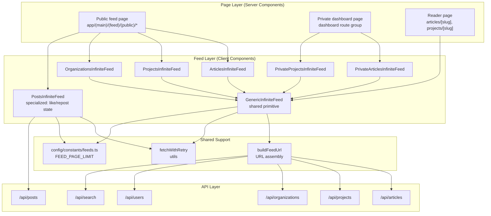
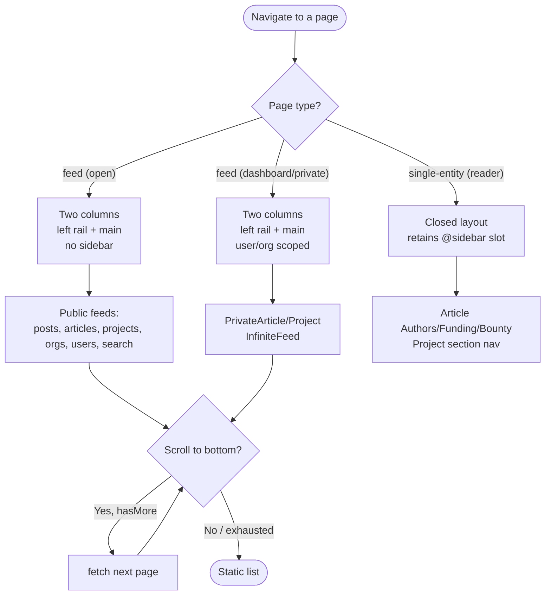

A source-backed reference for how Ozeaon renders paginated content feeds (posts, articles, projects, organizations, users) and their infinite-scroll loading behavior, plus the single-entity "reader" page layout that hosts them.

## Purpose and Scope

This page documents the feed subsystem: the shared infinite-scroll primitive (`GenericInfiniteFeed`), the entity-specific feed wrappers (`PostsInfiniteFeed`, `ArticlesInfiniteFeed`, `ProjectsInfiniteFeed`, `OrganizationsInfiniteFeed`), the page-size constants that govern paging, and the conceptual split between **public feed views** (global, open), **private feed views** (dashboard-scoped, per user/organization), and **reader views** (single-entity pages with a retained sidebar slot).

In scope:

- The paging contract (`page`, `limit`, `orderBy`, `orderDir`, entity routing) implemented in [`GenericInfiniteFeed.tsx`](https://github.com/ozeaon/ozeaon-v2/blob/0a4f1a95824db87782f1221a4108019d174df3d9/src/components/ui/layout/GenericInfiniteFeed.tsx).
- The dedup/idempotency and request-key invalidation logic that makes scroll-loading safe.
- The feed-specific constants in [`feeds.ts`](https://github.com/ozeaon/ozeaon-v2/blob/0a4f1a95824db87782f1221a4108019d174df3d9/src/config/constants/feeds.ts).
- The feed/private/reader page-type distinction documented in [`DESIGN-CONSISTENCY-PLAN.md`](https://github.com/ozeaon/ozeaon-v2/blob/0a4f1a95824db87782f1221a4108019d174df3d9/DESIGN-CONSISTENCY-PLAN.md).

Out of scope (covered by sibling pages):

- The API endpoints (`/api/posts`, `/api/articles`, …) and their database query internals — see the API and data-access pages.
- Row Level Security and visibility rules that decide which rows are *visible* at all — see the security/Supabase pages. `feeds` only renders what the API returns.
- Card rendering internals (`PostCard`, `ArticleCard`) — see the component-library page.

## Overview

Ozeaon's feed is a **server-rendered first page + client-side infinite scroll** pattern. The server component fetches the first page of results and passes it as `initial`; a client component then observes a sentinel element with `IntersectionObserver` and fetches subsequent pages from the REST API when the user scrolls near the bottom.

This design exists for three reasons:

1. **First-paint speed.** The first page is in the HTML — no spinner, no layout shift before the user sees content.
2. **No redundant fetches.** Because the first page is already rendered, the client never re-requests page 1.
3. **Uniform behavior across entities.** Articles, projects, organizations, users, and search all reuse one primitive (`GenericInfiniteFeed`), so paging semantics are identical everywhere. Posts predate the generalization and keep a specialized component with extra interaction state (like/repost sets).

The three "views" in this page's title map onto the actual page-type taxonomy in the design system:

| View | Meaning | Layout | Examples |
| --- | --- | --- | --- |
| **Feed (public)** | Open, global lists | Two columns (left rail + main), no sidebar | `/`, `/projects`, `/articles`, `/community`, `/organisations` |
| **Feed (private/dashboard)** | Same mechanics, scoped to the signed-in user or an organization they manage | Two columns, dashboard route group | `PrivateArticlesInfiniteFeed`, `PrivateProjectsInfiniteFeed` |
| **Reader (single-entity)** | One article/project/organization/profile, with entity-specific context | Closed, retains a parallel `@sidebar` route slot | `/projects/[slug]`, `/articles/[slug]`, `/organisations/[handle]`, `/profile/[handle]` |

> Source: [DESIGN-CONSISTENCY-PLAN.md](https://github.com/ozeaon/ozeaon-v2/blob/0a4f1a95824db87782f1221a4108019d174df3d9/DESIGN-CONSISTENCY-PLAN.md#L114-L119)

## Architecture

The feed subsystem has three layers: the **page** (server component that fetches page 1 and chooses the view type), the **feed component** (client, handles scroll + paging), and the **API** (REST endpoint filtered by `entity` and `extraParams`).



**Why this shape.** The generic primitive is deliberately entity-agnostic: it knows only an `entity` string and renders whatever `renderItem` returns. Entity-specific concerns (which card to render, which `orderBy` field, which extra filter params) live in thin wrappers. This keeps the paging/dedup/observer logic in exactly one place, while allowing each feed to declare its own query shape. `PostsInfiniteFeed` is the one exception — it carries per-post interaction state (`likedPosts`, `repostedPosts`) that the generic primitive does not model, so it reimplements the same paging loop locally.

## The Shared Paging Primitive: `GenericInfiniteFeed`

`GenericInfiniteFeed` is the core of the feed subsystem. It is a client component (`"use client"`) generic over any item shape that has a string `id`.

### URL construction

All paging requests are built by `buildFeedUrl`, which composes `/api/{entity}` with the paging and ordering params. Note that `page` and `limit` are always present; `orderBy`/`orderDir` are only set when `orderBy` is provided.

```typescript
function buildFeedUrl(
  entity: string,
  page: number,
  limit: number,
  orderBy: string | undefined,
  orderDir: "asc" | "desc",
  extraParams: Record<string, string | number | boolean> | undefined,
) {
  const url = new URL(`/api/${entity}`, env.baseUrl);
  url.searchParams.set("page", String(page));
  url.searchParams.set("limit", String(limit));
  if (orderBy) {
    url.searchParams.set("orderBy", orderBy);
    url.searchParams.set("orderDir", orderDir);
  }
  if (extraParams) {
    for (const [key, value] of Object.entries(extraParams)) {
      url.searchParams.set(key, String(value));
    }
  }
  return url;
}
```

> Source: [GenericInfiniteFeed.tsx](https://github.com/ozeaon/ozeaon-v2/blob/0a4f1a95824db87782f1221a4108019d174df3d9/src/components/ui/layout/GenericInfiniteFeed.tsx#L7-L28)

The `URL` constructor with `env.baseUrl` produces an absolute URL. This matters for the API-route fetch below, since the component runs on the client and the request must be resolvable regardless of the current page's origin.

### Props contract

| Prop | Type | Default | Purpose |
| --- | --- | --- | --- |
| `initial` | `T[]` | required | Page 1, server-rendered. Resets internal state when it changes. |
| `entity` | `"articles" \| "projects" \| "organizations" \| "search" \| "users"` | required | Selects the `/api/{entity}` endpoint. |
| `renderItem` | `(item: T) => React.ReactNode` | required | Renders each item; each is wrapped in a keyed `Fragment`. |
| `limit` | `number` | `5` | Page size. Must match the server's page-1 size or scroll detection misbehaves. |
| `orderBy` | `string` | `undefined` | Sort column; when absent, no ordering params are sent. |
| `orderDir` | `"asc" \| "desc"` | `"desc"` | Sort direction. |
| `extraParams` | `Record<string, string \| number \| boolean>` | `undefined` | Entity filters, applied verbatim as query params. |
| `wrapperClassName` | `string` | `"flex flex-col gap-4 mt-3"` | Container classes. |
| `wrapperProps` | `Omit<React.HTMLAttributes<HTMLDivElement>, "className">` | `undefined` | Extra attributes for the container. |

> Source: [GenericInfiniteFeed.tsx](https://github.com/ozeaon/ozeaon-v2/blob/0a4f1a95824db87782f1221a4108019d174df3d9/src/components/ui/layout/GenericInfiniteFeed.tsx#L30-L52)

The generic bound `T extends { id: string }` is what makes dedup possible: the component can always identify an item by `id`.

### State and the request-key guard

The component keeps five pieces of state plus three refs:

- `items` — accumulated results.
- `page` — the last requested page.
- `loading` — drives the "Loading more…" indicator.
- `hasMore` — whether another page likely exists.
- `observerRef`, `pageQueuedRef`, `fetchingRef` — the sentinel DOM node, a "page already queued" latch, and an "in-flight request" latch.

Crucially it computes a **request key** — a stringified snapshot of `entity`, `limit`, `orderBy`, `orderDir`, and `extraParams` — and mirrors it into `activeRequestKeyRef` on every render:

```typescript
const extraParamsKey = JSON.stringify(extraParams ?? {});
const requestKey = JSON.stringify({
  entity,
  limit,
  orderBy,
  orderDir,
  extraParams: extraParamsKey,
});

const activeRequestKeyRef = useRef(requestKey);
// eslint-disable-next-line
activeRequestKeyRef.current = requestKey;
```

> Source: [GenericInfiniteFeed.tsx](https://github.com/ozeaon/ozeaon-v2/blob/0a4f1a95824db87782f1221a4108019d174df3d9/src/components/ui/layout/GenericInfiniteFeed.tsx#L60-L71)

After an awaited fetch, the response is discarded unless the key still matches:

```typescript
const res = await fetchWithRetry(url);
const data: T[] = await res.json();
if (activeRequestKeyRef.current !== requestKey) return;
```

> Source: [GenericInfiniteFeed.tsx](https://github.com/ozeaon/ozeaon-v2/blob/0a4f1a95824db87782f1221a4108019d174df3d9/src/components/ui/layout/GenericInfiniteFeed.tsx#L100-L102)

**Design intent.** When the user switches tabs or changes filters, the query changes underneath an in-flight request. Without this guard, a late response from the *old* query would be appended to the *new* list — a classic stale-response race. The key comparison drops stale responses entirely instead of appending them.

### Deduplication on append

Even with the guard, rows can repeat across pages when data shifts between requests (new content pushed in, or the sort key is non-unique). The append step filters out any item whose `id` is already present:

```typescript
setItems((prev) => {
  const existingIds = new Set(prev.map((p) => p.id));
  const newItems = data.filter((p) => !existingIds.has(p.id));
  return newItems.length ? [...prev, ...newItems] : prev;
});
setHasMore(data.length === limit);
```

> Source: [GenericInfiniteFeed.tsx](https://github.com/ozeaon/ozeaon-v2/blob/0a4f1a95824db87782f1221a4108019d174df3d9/src/components/ui/layout/GenericInfiniteFeed.tsx#L109-L114)

Two details are deliberate:

- **Returning `prev` unchanged when there is nothing new** avoids an unnecessary re-render and, more importantly, avoids changing the array identity when the page was entirely duplicates.
- **`hasMore` is derived from `data.length === limit`**, not from an explicit total count. This is the cheap heuristic: a full page implies there is probably more. It costs one wasted request when the last page happens to be exactly `limit` long (that request returns empty and flips `hasMore` to `false`), which is the standard trade-off for avoiding a `COUNT(*)` query per page.

### Reset semantics

When `initial` or `limit` changes — which happens after a `router.refresh()` or when navigating to a differently-scoped feed — the component resets to the server-provided page 1:

```typescript
useEffect(() => {
  setItems(initial ?? []);
  setPage(1);
  setHasMore(initial.length === limit);
  pageQueuedRef.current = false;
}, [initial, limit]);
```

> Source: [GenericInfiniteFeed.tsx](https://github.com/ozeaon/ozeaon-v2/blob/0a4f1a95824db87782f1221a4108019d174df3d9/src/components/ui/layout/GenericInfiniteFeed.tsx#L73-L78)

`hasMore` is seeded as `initial.length === limit` — the same "full page implies more" rule applied to the server-rendered first page. If the server returns fewer than `limit` items, no client fetch ever fires.

## Core Flow: Scroll-Triggered Paging

The loading loop is split across three cooperating effects and one callback. This is the flow in source order.

```mermaid
sequenceDiagram
    participant U as User
    participant Sent as Sentinel div (observerRef)
    participant IO as IntersectionObserver
    participant Eff as page-change effect
    participant FP as fetchPage
    participant API as /api/{entity}

    Note over U,API: Initial render — server already supplied page 1
    U->>Sent: Scrolls near bottom (rootMargin 100px)
    Sent->>IO: Intersection callback fires
    IO->>IO: Check fetchingRef and pageQueuedRef
    IO->>Eff: pageQueuedRef = true; setPage(p + 1)
    Eff->>FP: fetchPage(nextPage)
    FP->>FP: fetchingRef = true; setLoading(true)
    FP->>API: GET /api/{entity}?page&limit&orderBy&orderDir&extraParams
    API-->>FP: JSON array of items
    FP->>FP: Discard if activeRequestKey !== requestKey
    FP->>FP: Filter new items by id, append to items
    FP->>FP: setHasMore(data.length === limit)
    FP->>FP: fetchingRef = false; setLoading(false)
    FP-->>U: New cards rendered
```

### Step 1 — The sentinel and the observer

At the bottom of the DOM the component renders a sentinel `<div ref={observerRef}>`. An effect attaches an `IntersectionObserver` to it, but only while `hasMore` is true and no request is in flight:

```typescript
useEffect(() => {
  const el = observerRef.current;
  if (!el || !hasMore || loading) return;

  const obs = new IntersectionObserver(
    (entries) => {
      if (
        entries[0].isIntersecting &&
        !fetchingRef.current &&
        !pageQueuedRef.current
      ) {
        pageQueuedRef.current = true;
        setPage((p) => p + 1);
      }
    },
    { rootMargin: "100px", threshold: 0 },
  );

  obs.observe(el);
  return () => obs.disconnect();
}, [hasMore, loading]);
```

> Source: [GenericInfiniteFeed.tsx](https://github.com/ozeaon/ozeaon-v2/blob/0a4f1a95824db87782f1221a4108019d174df3d9/src/components/ui/layout/GenericInfiniteFeed.tsx#L125-L145)

Three concurrency guards are layered here, and each addresses a distinct failure:

| Guard | Kind | Prevents |
| --- | --- | --- |
| `!hasMore \|\| loading` (effect early-return) | Declarative | Observing at all once exhausted or mid-fetch; also disconnects the old observer on every relevant state change. |
| `pageQueuedRef.current` | Synchronous latch | A burst of intersection callbacks queueing the same increment twice. The latch is reset inside `fetchPage`, so exactly one page is queued per fetch. |
| `fetchingRef.current` | Synchronous latch | An overlapping fetch. `pageQueuedRef` is set before React re-renders, so `loading` state alone would be too late to catch same-tick duplicates. |

`rootMargin: "100px"` prefetches slightly before the sentinel is truly visible, so content is usually ready by the time the user reaches the bottom. `threshold: 0` fires on any intersection.

### Step 2 — Page state triggers the fetch

`setPage` is the single trigger for loading. The fetch effect ignores the initial value so page 1 is never re-requested:

```typescript
useEffect(() => {
  if (page === 1) return;
  fetchPage(page);
}, [page, fetchPage]);
```

> Source: [GenericInfiniteFeed.tsx](https://github.com/ozeaon/ozeaon-v2/blob/0a4f1a95824db87782f1221a4108019d174df3d9/src/components/ui/layout/GenericInfiniteFeed.tsx#L147-L150)

This is why the server-rendered first page matters: `page` starts at `1` and the effect is a no-op until the observer bumps it.

### Step 3 — `fetchPage` executes the request

`fetchPage` re-checks the in-flight latch (defensive, since `page` is public state), clears the queue latch, and performs the request through `fetchWithRetry`:

```typescript
const fetchPage = useCallback(
  async (nextPage: number) => {
    if (fetchingRef.current) return;

    fetchingRef.current = true;
    pageQueuedRef.current = false;
    setLoading(true);
    try {
      const requestExtraParams = JSON.parse(extraParamsKey) as Record<
        string,
        string | number | boolean
      >;
      const url = buildFeedUrl(
        entity,
        nextPage,
        limit,
        orderBy,
        orderDir,
        requestExtraParams,
      );
      const res = await fetchWithRetry(url);
      const data: T[] = await res.json();
      // ... key guard, dedup, hasMore as shown above
    } catch {
      if (activeRequestKeyRef.current === requestKey) setHasMore(false);
    } finally {
      fetchingRef.current = false;
      setLoading(false);
    }
  },
  [entity, extraParamsKey, limit, orderBy, orderDir, requestKey],
);
```

> Source: [GenericInfiniteFeed.tsx](https://github.com/ozeaon/ozeaon-v2/blob/0a4f1a95824db87782f1221a4108019d174df3d9/src/components/ui/layout/GenericInfiniteFeed.tsx#L80-L123)

**Error handling intent.** On failure the feed *stops paginating* (`setHasMore(false)`) rather than retrying forever. Combined with `fetchWithRetry`'s internal retry, this means transient failures are absorbed upstream, and a persistent one degrades to "the feed is as long as it got" instead of an infinite retry loop against a failing endpoint. The guard `activeRequestKeyRef.current === requestKey` prevents a failed *stale* request from flipping `hasMore` off for the newly-selected query.

`extraParams` is re-parsed from `extraParamsKey` inside the callback rather than closed over directly, so the callback's dependency list stays referentially stable on the JSON string instead of a new object identity each render.

### Rendering

The output is intentionally minimal — the list container plus an always-present sentinel and status row:

```typescript
return (
  <>
    <div {...wrapperProps} className={wrapperClassName}>
      {items.map((item) => (
        <Fragment key={item.id}>{renderItem(item)}</Fragment>
      ))}
    </div>

    <div ref={observerRef} className="py-3 text-center empty:py-0">
      {loading && <span className="animate-pulse">Loading more…</span>}
    </div>
  </>
);
```

> Source: [GenericInfiniteFeed.tsx](https://github.com/ozeaon/ozeaon-v2/blob/0a4f1a95824db87782f1221a4108019d174df3d9/src/components/ui/layout/GenericInfiniteFeed.tsx#L152-L164)

The sentinel and the loading label share one element, so the `intersection` target is always in the DOM and never needs re-observation. The `empty:py-0` utility collapses the padding when there is no loading text.

## Entity Feed Wrappers

Each wrapper is a thin adapter that fixes the entity, sort field, and filter params for `GenericInfiniteFeed`. `ArticlesInfiniteFeed` is representative:

```typescript
export function ArticlesInfiniteFeed({
  initial,
  limit,
  userId,
  organizationId,
}: ArticlesInfiniteFeedProps) {
  return (
    <GenericInfiniteFeed
      initial={initial}
      entity="articles"
      limit={limit}
      orderBy="published_at"
      orderDir="desc"
      extraParams={
        userId || organizationId
          ? {
              ...(userId && { userId }),
              ...(organizationId && { organizationId }),
            }
          : undefined
      }
      renderItem={(article) => <ArticleCard article={article} />}
    />
  );
}
```

> Source: [ArticlesInfiniteFeed.tsx](https://github.com/ozeaon/ozeaon-v2/blob/0a4f1a95824db87782f1221a4108019d174df3d9/src/components/articles/ArticlesInfiniteFeed.tsx#L14-L37)

The `extraParams` construction uses conditional spread so that a falsy `userId`/`organizationId` produces **no key at all** rather than `userId=undefined`. This keeps the request key (`JSON.stringify`) stable across renders where the prop is absent, preventing spurious state resets and needless re-fetches.

### Feed component inventory

| Component | Entity | Sort | Scope params | Notes |
| --- | --- | --- | --- | --- |
| [`ArticlesInfiniteFeed`](https://github.com/ozeaon/ozeaon-v2/blob/0a4f1a95824db87782f1221a4108019d174df3d9/src/components/articles/ArticlesInfiniteFeed.tsx) | `articles` | `published_at desc` | `userId`, `organizationId` | Wraps the generic primitive. |
| [`ProjectsInfiniteFeed`](https://github.com/ozeaon/ozeaon-v2/blob/0a4f1a95824db87782f1221a4108019d174df3d9/src/components/projects/ProjectsInfiniteFeed.tsx) | `projects` | — | — | Wraps the generic primitive. |
| [`OrganizationsInfiniteFeed`](https://github.com/ozeaon/ozeaon-v2/blob/0a4f1a95824db87782f1221a4108019d174df3d9/src/components/organizations/OrganizationsInfiniteFeed.tsx) | `organizations` | — | — | Wraps the generic primitive. |
| [`NetworkInfiniteFeed`](https://github.com/ozeaon/ozeaon-v2/blob/0a4f1a95824db87782f1221a4108019d174df3d9/src/components/users/NetworkInfiniteFeed.tsx) | `users` | — | — | Profile network lists. |
| [`SearchResultsFeed`](https://github.com/ozeaon/ozeaon-v2/blob/0a4f1a95824db87782f1221a4108019d174df3d9/src/components/search/SearchResultsFeed.tsx) | `search` | — | query params | Uses the search page limits below. |
| [`OrgPostsFeed`](https://github.com/ozeaon/ozeaon-v2/blob/0a4f1a95824db87782f1221a4108019d174df3d9/src/components/profiles/organizations/sections/OrgPostsFeed.tsx) | `posts` | — | `organizationId` | Organization-scoped posts. |
| [`PostsInfiniteFeed`](https://github.com/ozeaon/ozeaon-v2/blob/0a4f1a95824db87782f1221a4108019d174df3d9/src/components/posts/PostsInfiniteFeed.tsx) | `posts` | — | `followed`, `userId`, `organizationId` | Specialized; see below. |
| [`PrivateArticlesInfiniteFeed`](https://github.com/ozeaon/ozeaon-v2/blob/0a4f1a95824db87782f1221a4108019d174df3d9/src/components/articles/pages/dashboard/PrivateArticlesInfiniteFeed.tsx) | `articles` | — | user-scoped | Private dashboard feed. |
| [`PrivateProjectsInfiniteFeed`](https://github.com/ozeaon/ozeaon-v2/blob/0a4f1a95824db87782f1221a4108019d174df3d9/src/components/projects/pages/dashboard/PrivateProjectsInfiniteFeed.tsx) | `projects` | — | user-scoped | Private dashboard feed. |

> Sources:
> - [component-library.md](https://github.com/ozeaon/ozeaon-v2/blob/0a4f1a95824db87782f1221a4108019d174df3d9/docs/component-library.md#L20-L27)
> - [feeds.ts](https://github.com/ozeaon/ozeaon-v2/blob/0a4f1a95824db87782f1221a4108019d174df3d9/src/config/constants/feeds.ts#L1-L3)

## `PostsInfiniteFeed`: The Specialized Feed

Posts need per-item interaction state — whether the signed-in user has liked or reposted each post — which the generic primitive does not model. `PostsInfiniteFeed` therefore reimplements the paging loop, but with two intentional differences and one shared convention.

```typescript
type PostsInfiniteFeedProps = {
  initialPosts: PublicPost[];
  likedPosts: string[];
  repostedPosts: string[];
  filterFollowed?: boolean;
  userId?: string;
  organizationId?: string;
};

const LIMIT = FEED_PAGE_LIMIT;

export default function PostsInfiniteFeed({
  likedPosts,
  initialPosts,
  filterFollowed,
  repostedPosts,
  userId,
  organizationId,
}: PostsInfiniteFeedProps) {
  const [posts, setPosts] = useState<PublicPost[]>(initialPosts ?? []);
  const [page, setPage] = useState(1);
  const [loading, setLoading] = useState(false);
  const [hasMore, setHasMore] = useState(initialPosts.length === LIMIT);
  const observerRef = useRef<HTMLDivElement | null>(null);

  // Use Sets for O(1) lookup performance
  const likedSet = useMemo(() => new Set(likedPosts), [likedPosts]);
  const repostedSet = useMemo(() => new Set(repostedPosts), [repostedPosts]);
```

> Source: [PostsInfiniteFeed.tsx](https://github.com/ozeaon/ozeaon-v2/blob/0a4f1a95824db87782f1221a4108019d174df3d9/src/components/posts/PostsInfiniteFeed.tsx#L11-L38)

**Why Sets.** `likedPosts`/`repostedPosts` arrive as arrays from the server. The render path calls `.has(post.id)` once per card, so converting to `Set` once per prop change (via `useMemo`) turns an O(n) array scan per card into an O(1) hash lookup. The comment in source marks this explicitly as a performance decision.

### Request assembly

Posts use the same `page`/`limit` convention as the generic primitive, plus a `followed` flag and optional entity scoping:

```typescript
const params = new URLSearchParams({
  page: String(nextPage),
  limit: String(LIMIT),
  followed: String(!!filterFollowed),
});
if (userId) params.set("userId", userId);
if (organizationId) params.set("organizationId", organizationId);

const res = await fetchWithRetry(`/api/posts?${params}`);
const data: PublicPost[] = await res.json();
```

> Source: [PostsInfiniteFeed.tsx](https://github.com/ozeaon/ozeaon-v2/blob/0a4f1a95824db87782f1221a4108019d174df3d9/src/components/posts/PostsInfiniteFeed.tsx#L51-L60)

`followed` is always sent (as the string `"true"`/`"false"`), unlike the generic primitive's `orderBy` which is conditionally omitted. This is fine because the value is stable for a given mount, so the URL does not thrash.

### Behavioral differences from the generic primitive

| Aspect | `GenericInfiniteFeed` | `PostsInfiniteFeed` |
| --- | --- | --- |
| Observer `rootMargin` | `100px` | `200px` (earlier prefetch) |
| Observer `threshold` | `0` | `0.5` (sentinel must be half-visible) |
| Duplicate-queue latch | `pageQueuedRef` + `fetchingRef` | None — relies on `loading` in the effect dependency |
| Stale-response guard | `requestKey` comparison | None |
| Append when page is fully duplicate | Returns `prev` (no state change) | Always spreads into a new array |
| Dedup by `id` | Yes | Yes |
| `initial` reset effect deps | `[initial, limit]` | `[initialPosts]` |

`PostsInfiniteFeed`'s observer has no explicit duplicate-queue latch, so the effect's `[hasMore, loading]` dependency is what re-arms it: once a fetch starts, `loading` becomes `true`, the effect early-returns, and the observer is disconnected. The narrower `threshold: 0.5` further reduces the chance of an early fire.

The dedup append is otherwise identical in spirit:

```typescript
setPosts((prev) => {
  const existingIds = new Set(prev.map((p) => p.id));
  const newItems = data.filter((p) => !existingIds.has(p.id));
  return [...prev, ...newItems];
});
setHasMore(data.length === LIMIT);
```

> Source: [PostsInfiniteFeed.tsx](https://github.com/ozeaon/ozeaon-v2/blob/0a4f1a95824db87782f1221a4108019d174df3d9/src/components/posts/PostsInfiniteFeed.tsx#L66-L71)

### Rendering with interaction state

Each card receives its like/repost status resolved from the memoized sets:

```typescript
return (
  <div className="flex flex-col gap-3 mt-3">
    {posts.map((post) => (
      <PostCard
        key={post.id}
        post={post}
        liked={likedSet.has(post.id)}
        reposted={repostedSet.has(post.id)}
      />
    ))}

    <div ref={observerRef} className="m-0" aria-hidden="true" />

    <div className="py-3 text-center empty:py-1">
      {loading && <span className="animate-pulse">Loading more…</span>}
    </div>
  </div>
);
```

> Source: [PostsInfiniteFeed.tsx](https://github.com/ozeaon/ozeaon-v2/blob/0a4f1a95824db87782f1221a4108019d174df3d9/src/components/posts/PostsInfiniteFeed.tsx#L103-L120)

The sentinel here is a **separate zero-size element** marked `aria-hidden="true"` (purely a scroll trigger), distinct from the loading row. The generic primitive merges the two. Both approaches work; posts separate them to keep the observer target out of the accessible loading announcement.

## Page-Type Taxonomy: Feed, Private Feed, Reader

The view split is a first-class part of the routing layer, described by the design system's page-type table. Every page in the app belongs to exactly one of these types, and the type determines the column model.

| Type | Routes | Access | Sidebar | Content width |
| --- | --- | --- | --- | --- |
| `feed` | `/`, `/projects`, `/articles`, `/community`, `/organisations` | Open | None | 1048px |
| `single-entity` | `/projects/[slug]`, `/articles/[slug]`, `/organisations/[handle]`, `/profile/[handle]` | Closed | Retained (reader `@sidebar` slot) | 1048px |

> Source: [DESIGN-CONSISTENCY-PLAN.md](https://github.com/ozeaon/ozeaon-v2/blob/0a4f1a95824db87782f1221a4108019d174df3d9/DESIGN-CONSISTENCY-PLAN.md#L114-L115)

The layout rules that follow from this:

> Feed, settings, and editor page types are two columns (left rail + main). Single-entity (reader) retains its parallel `@sidebar` route slot for entity-specific context (article Authors / Funding / Bounty, project section nav). Removing the reader right rail is out of scope for TOZN-370/393/394/396.

> Source: [DESIGN-CONSISTENCY-PLAN.md](https://github.com/ozeaon/ozeaon-v2/blob/0a4f1a95824db87782f1221a4108019d174df3d9/DESIGN-CONSISTENCY-PLAN.md#L119)

**Why reader views keep their sidebar.** A feed is a homogeneous stream — every row is the same kind of object, and the left rail handles global navigation. A reader view is about *one* entity, and that entity has its own contextual facets (authors, funding, bounty, section navigation). Those facets are rendered through a Next.js parallel route slot (`@sidebar`), which is why the reader layout cannot simply be flattened into the feed's two-column model. The content width matches the feed (1048px) so the reading column does not jump when navigating from a list into an item.



Reader pages reuse the same scroll mechanics when they embed a related-content list (for example, "more from this author"), which is why `GenericInfiniteFeed` is reachable from the reader layout as well as the feed layouts.

## Configuration Options

Feed paging behavior is governed by constants in one module, so all feeds share a single page size.

```typescript
export const FEED_PAGE_LIMIT = 5;

export const SEARCH_PAGE_LIMIT = 10;

/** Below this, the query is too broad to be worth a round trip. */
export const SEARCH_MIN_QUERY_LENGTH = 2;

/**
 * How many name matches can feed the author filter, and so how deep people
 * results page. Fixed rather than page-derived: the author set has to be
 * identical on every page or the merged search list shifts underneath it. Also
 * bounds the `in.(…)` list, which rides in the request URL.
 */
export const SEARCH_AUTHOR_MATCH_CAP = 50;
```

> Source: [feeds.ts](https://github.com/ozeaon/ozeaon-v2/blob/0a4f1a95824db87782f1221a4108019d174df3d9/src/config/constants/feeds.ts#L1-L14)

| Constant | Type | Value | Applies to | Rationale |
| --- | --- | --- | --- | --- |
| `FEED_PAGE_LIMIT` | `number` | `5` | All entity feeds | Default `limit` for `GenericInfiniteFeed` and hard-coded `LIMIT` in `PostsInfiniteFeed`. |
| `SEARCH_PAGE_LIMIT` | `number` | `10` | Search results | Search rows are lighter than feed cards, so a larger page is acceptable. |
| `SEARCH_MIN_QUERY_LENGTH` | `number` | `2` | Search input | Guards against firing one-character queries that match nearly everything. |
| `SEARCH_AUTHOR_MATCH_CAP` | `number` | `50` | Search author filter | Must be **fixed, not page-derived**, or the merged result list would shift between pages; also bounds the `in.(…)` list length in the request URL. |

`FEED_PAGE_LIMIT` is the load-bearing constant: the generic primitive's default `limit = 5` and `PostsInfiniteFeed`'s `LIMIT = FEED_PAGE_LIMIT` must stay in step with what the server components pass to the API for page 1. If the server renders a different count than `limit`, the `initial.length === limit` seed either suppresses valid pagination (server returns fewer than `limit` while more rows exist) or triggers an immediate extra fetch (server returns more than `limit`).

## API Reference

### `GenericInfiniteFeed<T extends { id: string }>(props)`

Client component rendering a server-seeded, infinitely paginated list.

**Props:**
- `initial` (`T[]`, required): Server-rendered first page. Drives `hasMore` seeding and resets state on change.
- `entity` (`"articles" | "projects" | "organizations" | "search" | "users"`, required): API path segment; the request URL becomes `/api/{entity}`.
- `renderItem` (`(item: T) => React.ReactNode`, required): Item renderer, wrapped in a keyed `Fragment`.
- `limit` (`number`, optional, default `5`): Page size sent as the `limit` query param.
- `orderBy` (`string`, optional): Sort column; omitted from the request when not provided.
- `orderDir` (`"asc" | "desc"`, optional, default `"desc"`): Sort direction; only sent when `orderBy` is set.
- `extraParams` (`Record<string, string | number | boolean>`, optional): Additional query params, stringified per value.
- `wrapperClassName` (`string`, optional, default `"flex flex-col gap-4 mt-3"`).
- `wrapperProps` (`Omit<React.HTMLAttributes<HTMLDivElement>, "className">`, optional).

**Returns:** A React fragment containing the items container and the sentinel/loading element.

**Side effects:** Issues `GET` requests to `/api/{entity}` for pages `2..n` via `fetchWithRetry`; sets `hasMore = false` on any unguarded fetch error.

> Source: [GenericInfiniteFeed.tsx](https://github.com/ozeaon/ozeaon-v2/blob/0a4f1a95824db87782f1221a4108019d174df3d9/src/components/ui/layout/GenericInfiniteFeed.tsx#L30-L52)

### `buildFeedUrl(entity, page, limit, orderBy, orderDir, extraParams)`

Internal URL builder. Returns a `URL` on `env.baseUrl` with `page` and `limit` always set, `orderBy`/`orderDir` set only when `orderBy` is truthy, and each `extraParams` entry stringified.

> Source: [GenericInfiniteFeed.tsx](https://github.com/ozeaon/ozeaon-v2/blob/0a4f1a95824db87782f1221a4108019d174df3d9/src/components/ui/layout/GenericInfiniteFeed.tsx#L7-L28)

### `PostsInfiniteFeed(props)`

Specialized posts feed with interaction state.

**Props:**
- `initialPosts` (`PublicPost[]`, required): Server-rendered first page.
- `likedPosts` (`string[]`, required): Post IDs the viewer has liked; converted to a `Set`.
- `repostedPosts` (`string[]`, required): Post IDs the viewer has reposted; converted to a `Set`.
- `filterFollowed` (`boolean`, optional): Sent as the `followed` query param.
- `userId` (`string`, optional): Scopes the feed to one author.
- `organizationId` (`string`, optional): Scopes the feed to one organization.

**Returns:** A `div` containing `PostCard` items, a hidden observer sentinel, and the loading row.

**Side effects:** `GET /api/posts?page=&limit=&followed=[&userId=][&organizationId=]`; sets `hasMore = false` on error.

> Source: [PostsInfiniteFeed.tsx](https://github.com/ozeaon/ozeaon-v2/blob/0a4f1a95824db87782f1221a4108019d174df3d9/src/components/posts/PostsInfiniteFeed.tsx#L11-L120)

### `ArticlesInfiniteFeed(props)`

Wrapper over `GenericInfiniteFeed` for articles, fixing `entity="articles"`, `orderBy="published_at"`, `orderDir="desc"`.

**Props:** `initial` (`ArticleCardEntry[]`), `limit` (optional), `userId` (optional), `organizationId` (optional).

> Source: [ArticlesInfiniteFeed.tsx](https://github.com/ozeaon/ozeaon-v2/blob/0a4f1a95824db87782f1221a4108019d174df3d9/src/components/articles/ArticlesInfiniteFeed.tsx#L7-L37)

## Failure Modes, Edge Cases & Concurrency

The feed runs entirely in the browser, against a network endpoint, while the user scrolls. Every one of the following was addressed deliberately in the source.

### Stale responses after a filter change

**Symptom:** items from a previously-selected query appear in the current list. **Cause:** two requests in flight, responses arriving out of order. **Mitigation:** the `activeRequestKeyRef` / `requestKey` comparison after `await res.json()`, which discards any response whose originating query no longer matches the current props. The reset effect also clears `pageQueuedRef` so a queued page from the old query does not immediately fetch against the new one.

### Duplicate intersection callbacks

**Symptom:** the same page fetched twice, producing duplicate items or zero-progress loops. **Cause:** `IntersectionObserver` can fire repeatedly while the sentinel remains in view, and React state updates are asynchronous. **Mitigation:** `pageQueuedRef` is set *synchronously* inside the callback before `setPage`; `fetchingRef` is set synchronously at the top of `fetchPage`. Both latches are cleared only when the request settles or is queued.

### Duplicate rows across pages

**Symptom:** the same card rendered twice. **Cause:** rows shifting between page requests (new inserts, non-unique sort keys, or an off-by-one at a page boundary). **Mitigation:** append-time filtering against a `Set` of existing `id`s. The generic primitive additionally returns `prev` unchanged when a page contributes nothing new, which prevents a pointless re-render.

One consequence: if a page is *entirely* duplicates but the server still has more rows, `hasMore` stays `true` (the raw response length equals `limit`) and the next scroll fetches the following page. This is correct — the alternative would prematurely end the feed.

### Terminal detection and the "wasted" final request

`hasMore` is inferred from `data.length === limit`. When the total row count is an exact multiple of `limit`, the last fetch returns an empty array; the component then sets `hasMore = false` and stops. The cost is one extra request; the benefit is avoiding a `COUNT(*)` per page. The same heuristic is applied to the server-rendered first page via `initial.length === limit`.

### Empty and short first pages

If the server returns fewer than `limit` items, `hasMore` starts `false`, the observer effect early-returns, and **no client fetch is ever issued**. An empty feed renders an empty container with the sentinel present but inert.

### Fetch errors

Both feed components catch and set `hasMore = false`. Transient errors are absorbed by `fetchWithRetry` before they reach the catch block. The generic primitive guards the error path with the request-key check so a stale failure cannot terminate a freshly-selected feed. There is no user-facing error state in these components — a failed feed simply appears shorter than it could be.

### Prop identity and re-fetch churn

`extraParams` is a fresh object literal on every render in the wrappers (for example `ArticlesInfiniteFeed`). Passing it directly into a dependency list would re-create `fetchPage` every render. The generic primitive sidesteps this by keying on `extraParamsKey = JSON.stringify(extraParams ?? {})` and by re-parsing inside the callback. The wrappers cooperate by omitting falsy keys entirely (conditional spread), so `undefined` and a missing key produce the same serialized form.

### Server/client contract coupling

The most fragile invariant in the subsystem is **`limit` agreement between the server page and the client feed**. The server must fetch exactly the page size the feed expects; otherwise:

- Server returns **fewer** than `limit` while more rows exist → `hasMore` seeds `false`, pagination silently never starts.
- Server returns **more** than `limit` → page 1 contains extra rows, and the first scroll re-requests a page that overlaps already-rendered rows (harmless due to dedup, but wasteful).

## Performance & Operational Notes

- **First page is free of client work.** No fetch, no spinner, no `IntersectionObserver` activity until a page change is queued. The initial HTML contains all page-1 items.
- **`rootMargin` tuning is a latency dial.** `100px` in the generic primitive and `200px` in `PostsInfiniteFeed` control how early prefetch begins. Larger margins hide latency on fast scroll; smaller margins avoid speculative requests from a user who barely scrolls.
- **O(1) interaction lookups.** `PostsInfiniteFeed` converts `likedPosts` and `repostedPosts` to `Set`s via `useMemo`, so card rendering does not scan arrays per item.
- **Dedup cost is linear in accumulated items.** Each append builds a `Set` from all current items and filters the incoming page. For very long feeds this grows with the scroll depth; it is simple and allocation-light relative to the network round trip that precedes it.
- **Observer lifecycle is tied to state.** The observer is disconnected and recreated whenever `hasMore` or `loading` changes, and disconnected on unmount via the effect cleanup. There is no long-lived observer on a removed DOM node.
- **`aria-hidden="true"` on the posts sentinel** keeps a purely mechanical scroll trigger out of the accessibility tree; the loading text lives in its own row.
- **Logging category derivation.** Route groups are stripped when deriving log categories — a feed page under `app/(main)/(feed)/(public)/(home)/page.tsx` logs as `["app", "feed"]`, not `["app", "home"]` — so feed-related telemetry groups correctly even though the route uses grouped folders.

> Source: [logging-conventions.md](https://github.com/ozeaon/ozeaon-v2/blob/0a4f1a95824db87782f1221a4108019d174df3d9/docs/logging-conventions.md#L9)

## Extension Points

### Adding a new generic feed

1. Confirm the entity is (or can be) exposed at `/api/{entity}` and add its literal to the `entity` union in `GenericInfiniteFeedProps`.
2. Create a thin wrapper that fixes `entity`, `orderBy`/`orderDir`, and any `extraParams`, and passes a `renderItem`.
3. In the server page, fetch page 1 with a `limit` matching what the client will use (typically `FEED_PAGE_LIMIT`) and pass it as `initial`.

No changes to the paging, observer, or dedup logic are required — that is the point of the abstraction.

### Specializing a feed

When a feed needs per-item state the generic primitive does not carry (as posts do with likes/reposts), the pattern is to copy the paging loop as `PostsInfiniteFeed` does. The reusable parts to preserve are: the `page`/`limit` query convention, the "page 1 comes from the server" rule, the `data.length === limit` terminal heuristic, and `id`-based dedup on append.

### Repository components to reuse

Per the project's component conventions, new feed UI must reuse existing primitives rather than raw markup — notably `EmptyState` for empty feeds and `GridLayout` for grid arrangements. Feed components render their own loading state and must not be wrapped in `<Suspense>`.

> Source: [component-library.md](https://github.com/ozeaon/ozeaon-v2/blob/0a4f1a95824db87782f1221a4108019d174df3d9/docs/component-library.md#L20-L27)

## Key Invariants (Checklist)

| Invariant | Where enforced |
| --- | --- |
| Page 1 is always server-rendered and never re-fetched on the client | `if (page === 1) return` in the page-change effect |
| `hasMore` is `true` only when a full page was returned | `initial.length === limit` and `data.length === limit` |
| Items are identified only by `id` | `T extends { id: string }` generic bound |
| No duplicate items rendered | `Set`-based filter on append |
| No duplicate page fetched | `pageQueuedRef` + `fetchingRef` synchronous latches |
| Stale responses never mutate state | `activeRequestKeyRef` vs `requestKey` |
| A failed fetch stops pagination rather than looping | `catch { setHasMore(false) }` |
| Fetch failures never crash the feed | Errors swallowed into the `hasMore` flag |
| Reader views retain their `@sidebar` slot | Page-type taxonomy (`single-entity`, layout: closed) |

## Related Links

- [GenericInfiniteFeed.tsx](https://github.com/ozeaon/ozeaon-v2/blob/0a4f1a95824db87782f1221a4108019d174df3d9/src/components/ui/layout/GenericInfiniteFeed.tsx) — the shared paging primitive.
- [PostsInfiniteFeed.tsx](https://github.com/ozeaon/ozeaon-v2/blob/0a4f1a95824db87782f1221a4108019d174df3d9/src/components/posts/PostsInfiniteFeed.tsx) — specialized posts feed with interaction state.
- [ArticlesInfiniteFeed.tsx](https://github.com/ozeaon/ozeaon-v2/blob/0a4f1a95824db87782f1221a4108019d174df3d9/src/components/articles/ArticlesInfiniteFeed.tsx) — example entity wrapper.
- [feeds.ts](https://github.com/ozeaon/ozeaon-v2/blob/0a4f1a95824db87782f1221a4108019d174df3d9/src/config/constants/feeds.ts) — page-size and search constants.
- [DESIGN-CONSISTENCY-PLAN.md](https://github.com/ozeaon/ozeaon-v2/blob/0a4f1a95824db87782f1221a4108019d174df3d9/DESIGN-CONSISTENCY-PLAN.md#L114-L119) — feed / single-entity / reader page-type taxonomy.
- [docs/component-library.md](https://github.com/ozeaon/ozeaon-v2/blob/0a4f1a95824db87782f1221a4108019d174df3d9/docs/component-library.md#L20-L27) — feed component inventory and usage conventions.
- [docs/logging-conventions.md](https://github.com/ozeaon/ozeaon-v2/blob/0a4f1a95824db87782f1221a4108019d174df3d9/docs/logging-conventions.md#L9) — route-group stripping for feed telemetry categories.

For API endpoint and query internals, see the API reference pages. For visibility and RLS rules that determine which rows the API returns, see the security pages. For card rendering, see the component library.
