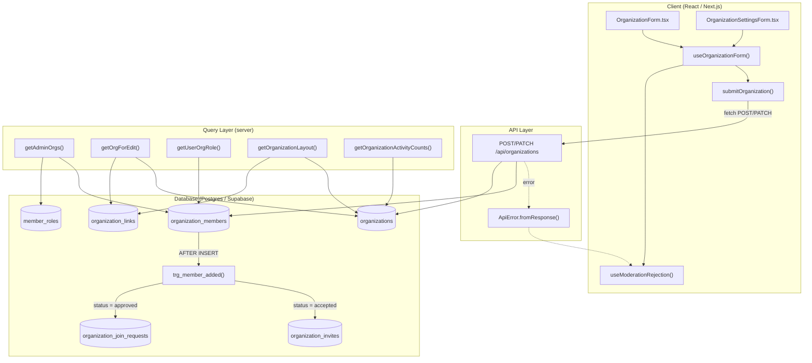
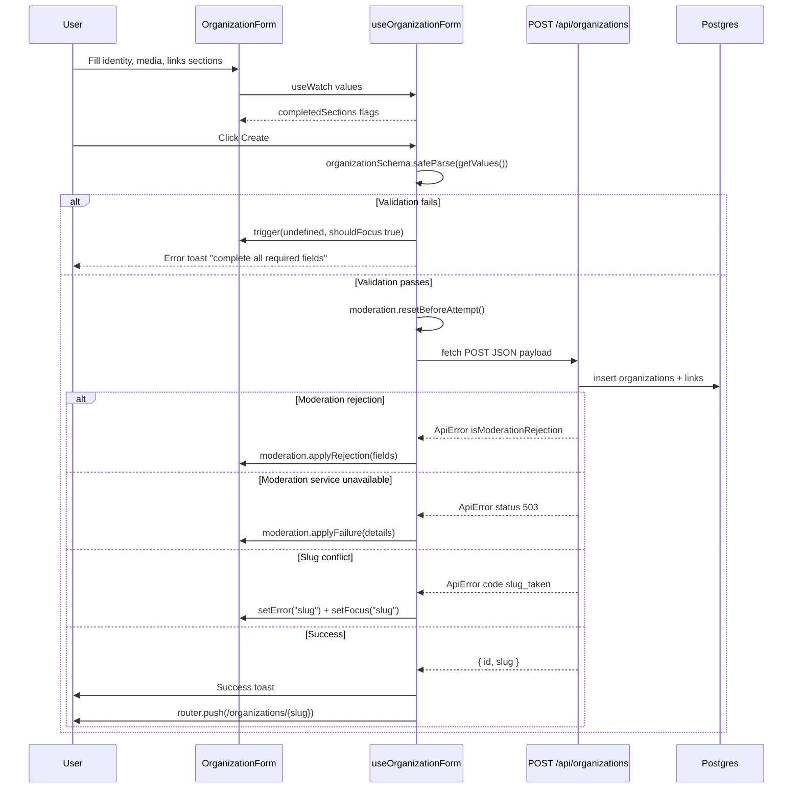
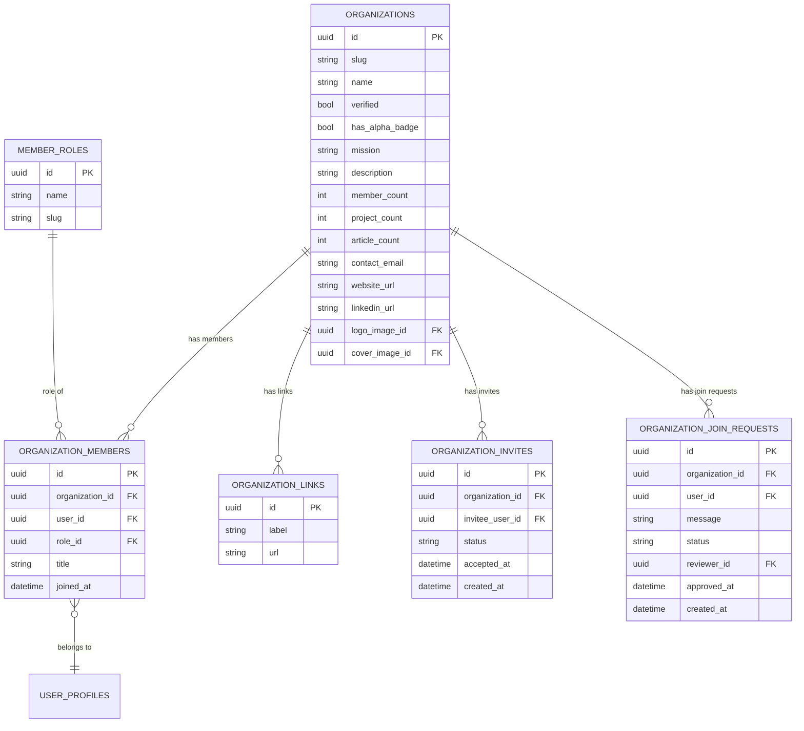
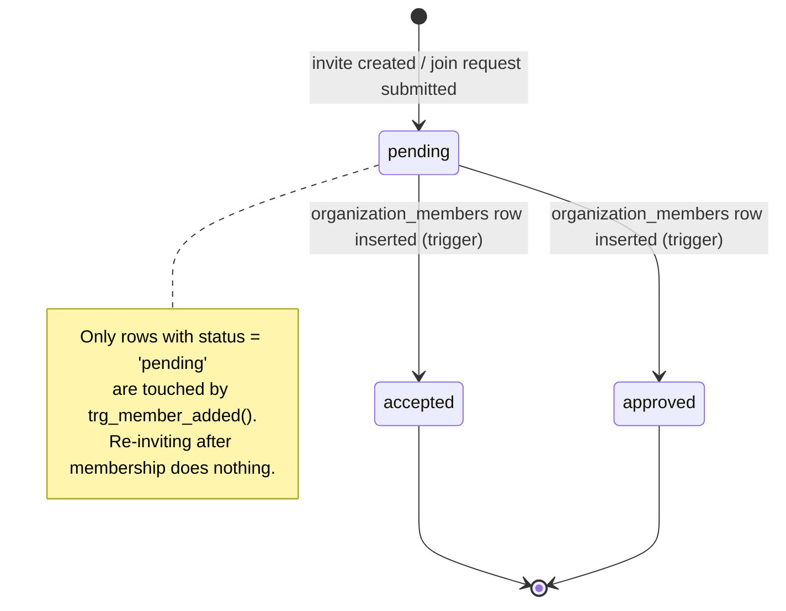

End-to-end documentation of how organizations are created, onboarded, staffed with members, and governed through roles, invites, and join requests in the Ozeaon platform.

## Purpose and Scope

This page covers the **organization onboarding and team-management capability** of Ozeaon:

- The organization creation/onboarding form flow (`useOrganizationForm`, `OrganizationForm`) and its client-side submission contract.
- The organization data model and read paths (`organizations`, `organization_members`, `member_roles`, `organization_invites`, `organization_join_requests`, `organization_links`).
- The membership model — how members become members, how roles (`owner` / `admin` / `member`) are resolved, and how pending invites and join requests are reconciled by the database when a membership row is created.
- The admin/team views exposed through typed query functions such as `getAdminOrgs`, `getOrgForEdit`, and `getUserOrgRole`.

Related topics that intentionally live on sibling pages and are **not** deep-dived here:

- Post/comment authorship under an organization identity (see the posts and comments authoring pages) — this capability only touches it through the `organization_id` column on content tables.
- Project ↔ organization linking and the `linked_organization_id` project workflow (see the projects catalog pages).
- Moderation of organization-supplied text is only described here to the extent that the onboarding form consumes `useModerationRejection`.
- Platform verification/badges (`verified`, `has_alpha_badge`) are treated as data fields, not as their own workflow.

## Overview

An "organization" in Ozeaon is a first-class authoring and collaboration entity. It is distinct from a `user_profile`: users can belong to many organizations, organizations can own projects and articles, and content can be attributed to an organization rather than an individual.

The capability has three cooperating concerns:

1. **Onboarding** — a structured, multi-section creation form that validates identity, media, and links before POSTing to `/api/organizations`.
2. **Membership** — the `organization_members` table is the source of truth. A user's relationship to an org is a row in that table, with a foreign key into `member_roles`.
3. **Invitations and join requests** — `organization_invites` and `organization_join_requests` act as *audit records* describing how a membership came to be. They are reconciled against the membership automatically by a database trigger rather than by application code.

The key design decision, stated directly in the migration header, is that **`organization_members` is the first-class entity** while invite and join-request tables are historical records:

```sql
-- organization_members is the first-class entity.
-- Invite and join-request tables are audit records.
-- A single AFTER INSERT trigger on organization_members stamps whichever
-- pending invite or join request led to the membership.
```

> Source: [20260520000000_organization_add_member_triggers.sql](https://github.com/ozeaon/ozeaon-v2/blob/0a4f1a95824db87782f1221a4108019d174df3d9/supabase/migrations/20260520000000_organization_add_member_triggers.sql#L1-L4)

This inverts the naive "accept the invite, then create the member" workflow: instead of the invite being the driver, any write that produces a membership row is the driver, and the audit rows are back-stamped. That makes the membership invariant impossible to violate from any entry point (UI acceptance, admin tooling, or a direct SQL insert) because the reconciliation is enforced in one place.

### Key concepts and terminology

| Term | Meaning |
|------|---------|
| `organizations` | The organization entity; has `slug`, `name`, `verified`, `has_alpha_badge`, `mission`, denormalized `member_count` / `project_count`, and links. |
| `organization_members` | The membership join row between a `user_profile` and an organization, carrying `role_id`, `title`, `joined_at`. |
| `member_roles` | Reference table of roles; the application only recognizes the slugs `owner`, `admin`, `member`. |
| `organization_invites` | An outbound invitation to a specific user; has `status`, `accepted_at`. |
| `organization_join_requests` | An inbound request from a user to join; has `status`, `message`, `reviewer_id`, `approved_at`. |
| `organization_links` | Arbitrary outbound links attached to an org profile (`label`, `url`). |
| `OrgMemberRole` | The TypeScript union `"owner" \| "admin" \| "member"` used across read models. |

## Architecture

The capability is layered as a Next.js application: React client forms and hooks drive a REST API route, which writes to Supabase/Postgres, where a `SECURITY DEFINER` trigger maintains audit reconciliation.



The diagram reflects the actual module boundaries: the client hooks live under `src/hooks`, read models are typed in `src/types/organizations.ts`, and all server-side reads are centralized in `src/lib/supabase/queries/organizations.ts`. Note that `trg_member_added()` is the only path that mutates invite/join-request status — the application layer never writes those status transitions directly.

### Why the trigger owns reconciliation

The trigger is declared `SECURITY DEFINER` with `SET search_path TO ''`, and its execute privilege is revoked from `PUBLIC`, `anon`, and `authenticated`:

```sql
CREATE OR REPLACE FUNCTION public.trg_member_added()
RETURNS trigger
LANGUAGE plpgsql
SECURITY DEFINER
SET search_path TO ''
AS $$
BEGIN
  UPDATE public.organization_invites
  SET status = 'accepted', accepted_at = now()
  WHERE organization_id = NEW.organization_id
    AND invitee_user_id = NEW.user_id
    AND status = 'pending';

  UPDATE public.organization_join_requests
  SET status = 'approved', approved_at = now(), reviewer_id = auth.uid()
  WHERE organization_id = NEW.organization_id
    AND user_id = NEW.user_id
    AND status = 'pending';

  RETURN NEW;
END;
$$;
```

> Source: [20260520000000_organization_add_member_triggers.sql](https://github.com/ozeaon/ozeaon-v2/blob/0a4f1a95824db87782f1221a4108019d174df3d9/supabase/migrations/20260520000000_organization_add_member_triggers.sql#L15-L41)

The empty `search_path` forces every table reference to be schema-qualified (`public.organization_invites`), eliminating `search_path` hijacking as an attack vector in a `SECURITY DEFINER` function. Revoking `EXECUTE` from `authenticated` means a signed-in user cannot call the function directly to mass-approve their own pending invites — only the trigger context can run it. `reviewer_id = auth.uid()` records who actually performed the insert; for self-service joins this is the joining user, and for admin-driven joins it is the admin.

The same migration also normalizes ambiguous audit column names to make the reviewer explicit:

```sql
ALTER TABLE public.organization_join_requests
  RENAME COLUMN reviewed_by TO reviewer_id;
ALTER TABLE public.organization_join_requests
  RENAME COLUMN reviewed_at TO approved_at;
```

> Source: [20260520000000_organization_add_member_triggers.sql](https://github.com/ozeaon/ozeaon-v2/blob/0a4f1a95824db87782f1221a4108019d174df3d9/supabase/migrations/20260520000000_organization_add_member_triggers.sql#L6-L13)

## Onboarding Flow

Onboarding is a single client hook driving a multi-section form. The hook `useOrganizationForm()` owns form state, section-completion tracking, submission, and error routing.

### Form state and validation

The form is built on `react-hook-form` with a Zod resolver, using the shared `organizationSchema` as the single source of truth for validation on both client and (via the API) server:

```typescript
export function useOrganizationForm() {
  const router = useTransitionRouter();
  const [isSubmitting, setIsSubmitting] = useState(false);

  const form = useForm<OrganizationFormValues, unknown, OrganizationFormOutput>(
    {
      mode: "onBlur",
      resolver: zodResolver(organizationSchema),
      shouldUnregister: false,
      defaultValues: { custom_links: [] },
    },
  );

  const moderation = useModerationRejection(form);

  const values = useWatch({ control: form.control });
```

> Source: [use-organization-form.ts](https://github.com/ozeaon/ozeaon-v2/blob/0a4f1a95824db87782f1221a4108019d174df3d9/src/hooks/use-organization-form.ts#L39-L54)

Three details carry design intent:

- `mode: "onBlur"` validates a field only when the user leaves it, avoiding the noisy "error while typing" experience on a long form.
- `shouldUnregister: false` keeps values from unmounted step sections in the form state. Because onboarding is paginated into sections, the earlier sections' inputs unmount when the user advances; unregistering them would silently drop `logo_image_id` or identity fields from the final payload.
- `useWatch` drives live section-completion computation without re-rendering the whole form on every keystroke via `form.watch()`.

### Section completion tracking

The form's progress UI is not driven by an index counter but by re-parsing the current values against per-section schemas — the same predicate the submit path uses:

```typescript
  const completedSections: Record<string, boolean> = {
    "section-identity":
      organizationStep1CompleteSchema.safeParse(values).success,
    "section-media": !!(values.logo_image_id || values.cover_image_id),
    "section-links": !!(
      values.website_url ||
      values.linkedin_url ||
      (values.custom_links && values.custom_links.length > 0)
    ),
  };
```

> Source: [use-organization-form.ts](https://github.com/ozeaon/ozeaon-v2/blob/0a4f1a95824db87782f1221a4108019d174df3d9/src/hooks/use-organization-form.ts#L56-L65)

Two different strategies are visible here, and the difference is deliberate. Identity uses a dedicated schema (`organizationStep1CompleteSchema`) because "complete" for identity means several required fields must be jointly satisfied. Media and links use cheap truthiness checks because their completion semantics are disjunctive ("any one of these is enough") and a schema would add ceremony without adding correctness.

### The submission contract

The write path is a plain `fetch` wrapper that normalizes non-OK responses into a typed `ApiError`, letting the caller branch on error semantics rather than on HTTP plumbing:

```typescript
export async function submitOrganization(
  url: string,
  method: "POST" | "PATCH",
  data: unknown,
): Promise<{ id: string; slug: string }> {
  const res = await fetch(url, {
    method,
    headers: { "Content-Type": "application/json" },
    body: JSON.stringify(data),
  });
  if (!res.ok) {
    throw await ApiError.fromResponse(res);
  }
  const { data: responseData } = (await res.json()) as {
    data: { id: string; slug: string };
  };
  return responseData;
}
```

> Source: [use-organization-form.ts](https://github.com/ozeaon/ozeaon-v2/blob/0a4f1a95824db87782f1221a4108019d174df3d9/src/hooks/use-organization-form.ts#L20-L37)

Supporting both `POST` and `PATCH` through one function is what allows the same hook to back both the onboarding form and the settings form (`OrganizationSettingsForm`) — the only difference is the URL and method chosen by the caller.

### Create handler and error routing

`handleCreate` re-validates before submitting, then dispatches to four distinct outcomes based on `ApiError` structure:

```typescript
  const handleCreate = async () => {
    const result = organizationSchema.safeParse(form.getValues());
    if (!result.success) {
      // shouldFocus scrolls the first invalid field into view, since the create
      // button sits in the nav slot outside the form and never focuses one itself.
      await form.trigger(undefined, { shouldFocus: true });
      toast.error("Please complete all required fields", {
        description: "Check all steps for missing required information",
      });
      return;
    }
    moderation.resetBeforeAttempt();
    setIsSubmitting(true);
    try {
      const data = await submitOrganization(
        "/api/organizations",
        "POST",
        result.data,
      );
      toast.success("Organisation created!", {
        description: "Your organisation is now live.",
      });
      router.push(`/organizations/${data.slug}`);
    } catch (error) {
      if (error instanceof ApiError && error.isModerationRejection) {
        moderation.applyRejection(error.moderation ?? []);
      } else if (error instanceof ApiError && error.status === 503) {
        moderation.applyFailure(error.details);
      } else if (error instanceof ApiError && error.code === "slug_taken") {
        form.setError("slug", { type: "server", message: error.message });
        form.setFocus("slug");
        toast.error(error.message, { description: error.details });
      } else {
        showErrorToast("Failed to create organisation", error);
      }
    } finally {
      setIsSubmitting(false);
    }
  };
```

> Source: [use-organization-form.ts](https://github.com/ozeaon/ozeaon-v2/blob/0a4f1a95824db87782f1221a4108019d174df3d9/src/hooks/use-organization-form.ts#L67-L105)

Note the explicit `form.trigger(undefined, { shouldFocus: true })` call. This exists because the create button lives in the page's navigation slot *outside* the `<form>` element; without an explicit trigger, the browser cannot focus the first invalid field, and the user would see a generic toast with no indication of which section is incomplete. The comment in source documents exactly this constraint.

The `slug_taken` branch is the only server error mapped back onto a specific field, because the slug is the one user-editable value with a hard uniqueness requirement. `503` is treated as a moderation-service failure and routed through `useModerationRejection` rather than shown as a generic failure, which distinguishes "your content was rejected" from "the moderation check could not run".

### Onboarding request flow



## Data Model

The organization capability spans six tables. The relationships below are drawn from the actual select clauses in the query layer and the migration DDL.



### Denormalized counters

`organizations` carries `member_count`, `project_count`, and `article_count` directly on the row. These are read cheaply for feed and profile cards without aggregate joins — visible in `OrganizationForLayout` and `OrgFeedRow`:

```typescript
export type OrgFeedRow = Pick<
  Tables<"organizations">,
  | "id"
  | "slug"
  | "name"
  | "mission"
  | "member_count"
  | "project_count"
  | "article_count"
> & {
  logo_image: Pick<Tables<"images">, "path" | "alt"> | null;
  viewer_role: OrgMemberRole | null;
};
```

> Source: [organizations.ts](https://github.com/ozeaon/ozeaon-v2/blob/0a4f1a95824db87782f1221a4108019d174df3d9/src/types/organizations.ts#L165-L177)

`OrgFeedRow` additionally carries `viewer_role`, a computed per-viewer field rather than a stored column — the feed needs to render different affordances for an owner versus an anonymous visitor, and resolving that at read time avoids leaking role state into the organizations table.

### Relationship resolution through `member_roles`

Membership rows never store a role string; they store `role_id` and resolve the slug through `member_roles`. The layout read model demonstrates the nested select:

```typescript
const ORG_MEMBER_SELECT = `
  id, role_id, title, joined_at,
  member_role:member_roles!role_id(id, name, slug),
  user_profile:user_profiles!user_id(${USER_CARD_SELECT})
`;
```

> Source: [organizations.ts](https://github.com/ozeaon/ozeaon-v2/blob/0a4f1a95824db87782f1221a4108019d174df3d9/src/lib/supabase/queries/organizations.ts#L76-L80)

`USER_CARD_SELECT` is imported and reused from `profile-reads`, so the shape of an embedded member profile is guaranteed to match the shape used everywhere else a user card is rendered. This is the mechanism preventing card/profile drift between pages.

## Role Model and Membership Resolution

Roles are constrained to three slugs at the type level:

```typescript
export type OrgMemberRole = "owner" | "admin" | "member";
```

> Source: [organizations.ts](https://github.com/ozeaon/ozeaon-v2/blob/0a4f1a95824db87782f1221a4108019d174df3d9/src/types/organizations.ts#L163)

### Resolving a user's role in an organization

`getUserOrgRole` is the canonical authorization lookup. It queries the membership row and narrows the role slug defensively:

```typescript
export async function getUserOrgRole(
  supabase: SupabaseClient,
  orgId: string,
  userId: string,
): Promise<"owner" | "admin" | "member" | null> {
  const { data, error } = await supabase
    .from("organization_members")
    .select("member_roles!role_id(slug)")
    .eq("organization_id", orgId)
    .eq("user_id", userId)
    .maybeSingle();

  if (error) throw error;

  const slug = (
    data as { member_roles: Pick<Tables<"member_roles">, "slug"> | null } | null
  )?.member_roles?.slug;
  if (slug === "owner" || slug === "admin" || slug === "member") return slug;
  return null;
}
```

> Source: [organizations.ts](https://github.com/ozeaon/ozeaon-v2/blob/0a4f1a95824db87782f1221a4108019d174df3d9/src/lib/supabase/queries/organizations.ts#L211-L230)

The final guard is important: the function does not trust the database to only contain known role slugs. Any unexpected slug (from a future role, a data migration, or manual insertion) degrades to `null` — i.e. "no recognized role" — rather than propagating an untyped value into authorization checks. `maybeSingle()` is used rather than `single()` because "no membership" is a normal, expected state and should not throw.

### Elevating only privileged memberships

`getAdminOrgs` returns the organizations a given user can *administer*, filtering to `owner` and `admin` after fetching all memberships:

```typescript
export const getAdminOrgs = cache(
  async (supabase: SupabaseClient, userId: string): Promise<AdminOrg[]> => {
    const { data, error } = await supabase
      .from("organization_members")
      .select(
        `
      role:member_roles!role_id(slug),
      organization:organizations!organization_id(
        id, name, slug,
        logo_image:images!logo_image_id(path)
      )
    `,
      )
      .eq("user_id", userId);

    if (error || !data) return [];

    return (data as unknown as AdminMembershipRow[])
      .filter((m) => {
        const slug = m.role?.slug;
        return slug === "owner" || slug === "admin";
      })
      .flatMap((m) => {
        const org = m.organization;
        if (!org) return [];
        return [
          {
            id: org.id,
            name: org.name,
            slug: org.slug,
            logo_path: org.logo_image?.path ?? null,
          },
        ];
      });
  },
);
```

> Source: [organizations.ts](https://github.com/ozeaon/ozeaon-v2/blob/0a4f1a95824db87782f1221a4108019d174df3d9/src/lib/supabase/queries/organizations.ts#L39-L74)

Design intent worth noting:

- The filter runs **after** the query rather than as a `.in("member_roles.slug", ["owner","admin"])` filter. PostgREST embedded-resource filtering on a related table is awkward and version-sensitive; filtering in application code keeps the query portable and lets an empty result degrade gracefully.
- `flatMap` is used instead of `map` so that memberships whose embedded `organization` failed to resolve (RLS-denied or orphaned) are silently dropped rather than producing `null` entries that crash the caller.
- Failures return `[]`, never throw. This query backs a navigation/menu component; a transient database error should collapse that menu, not blow up the whole page render.

### Caching semantics

`getAdminOrgs` and `getOrganizationActivityCounts` are both wrapped in React's `cache()`. This deduplicates calls within a single server render pass — e.g. a layout and a page both asking for the same admin-org list issue one query. It is per-request memoization, **not** persistent caching, so role changes take effect on the next request.

## Read Models and Query Reference

All server-side organization reads live in one module and return `{ data, error }` tuples or plain values. The distinction matters: reads used from layouts/pages that must degrade take the tuple form, while reads used where absence is genuinely exceptional throw.

### `getOrgIdBySlugOrNotFound(slug: string): Promise<string>`

Resolves a public organization slug to its id, invoking Next.js `notFound()` when the slug is absent — the standard 404 path for any `/organizations/[slug]` route.

```typescript
export async function getOrgIdBySlugOrNotFound(slug: string): Promise<string> {
  notFoundIfPlaceholder(slug);
  const supabase = createPublicClient();
  const { data, error } = await supabase
    .from("organizations")
    .select("id")
    .eq("slug", slug)
    .maybeSingle();

  if (error) throw new Error(error.message);
  if (!data) notFound();
  return data.id;
}
```

> Source: [organizations.ts](https://github.com/ozeaon/ozeaon-v2/blob/0a4f1a95824db87782f1221a4108019d174df3d9/src/lib/supabase/queries/organizations.ts#L82-L94)

`notFoundIfPlaceholder(slug)` runs first to intercept reserved/placeholder slugs (such as route-segment markers) before hitting the database. Notably, a genuine database error **throws**, while a missing row calls `notFound()`. These are deliberately different: a missing slug is a legitimate 404, whereas a database failure should surface as a 500 so it appears in monitoring rather than being masked as "organization doesn't exist".

### `getOrganizationLayout(slug: string)`

Fetches the full public profile data for the organization layout — identity, badges, denormalized counts, contact fields, embedded images, and all `organization_links`:

```typescript
export async function getOrganizationLayout(
  slug: string,
): Promise<{ data: OrganizationForLayout | null; error: Error | null }> {
  const supabase = createPublicClient();
  const { data, error } = await supabase
    .from("organizations")
    .select(
      `
      id, slug, name, verified, has_alpha_badge, mission, member_count, project_count,
      contact_email, website_url, linkedin_url,
      logo_image:images!logo_image_id(path, alt),
      cover_image:images!cover_image_id(path, alt),
      links:organization_links(id, label, url)
    `,
    )
    .eq("slug", slug)
    .single();

  return {
    data: data as OrganizationForLayout | null,
    error: error as Error | null,
  };
}
```

> Source: [organizations.ts](https://github.com/ozeaon/ozeaon-v2/blob/0a4f1a95824db87782f1221a4108019d174df3d9/src/lib/supabase/queries/organizations.ts#L96-L118)

The aliased embeds (`logo_image:images!logo_image_id(...)`) use the foreign-key constraint name to disambiguate, because `organizations` has *two* foreign keys into `images` (logo and cover). Without the `!logo_image_id` hint, PostgREST cannot determine which relationship to embed. Image embeds request `(path, alt)` only — never the full row — because the layout only needs to construct a URL and alt text.

### `getOrganizationActivityCounts(orgId: string)`

Produces the activity summary shown on an organization profile: published project and article totals plus a month-over-month trend.

```typescript
function computeOrgTrend(thisMonth: number, lastMonth: number) {
  if (lastMonth > 0) {
    const pct = Math.round(((thisMonth - lastMonth) / lastMonth) * 100);
    return { value: `${pct >= 0 ? "+" : ""}${pct}%`, positive: pct >= 0 };
  }
  if (thisMonth > 0) return { value: "+100%", positive: true };
  return { value: "+0%", positive: true };
}
```

> Source: [organizations.ts](https://github.com/ozeaon/ozeaon-v2/blob/0a4f1a95824db87782f1221a4108019d174df3d9/src/lib/supabase/queries/organizations.ts#L126-L133)

The trend function handles the divide-by-zero case explicitly. When the previous month had zero activity there is no meaningful percentage, so the function reports `+100%` if there was any activity this month and `+0%` otherwise, always marking the trend `positive`. This is a presentation choice: a brand-new organization should not be shown a misleading "-100%" or a nonsensical infinite growth figure.

The count queries are issued in a single `Promise.all` of six head-requests:

```typescript
    const projectsBase = () =>
      supabase
        .from("projects")
        .select("id", { count: "exact", head: true })
        .eq("organization_id", orgId)
        .eq("published", true);

    const articlesBase = () =>
      supabase
        .from("articles")
        .select("id", { count: "exact", head: true })
        .eq("organization_id", orgId)
        .eq("published", true);

    const [
      projectsTotal,
      projectsThisMonth,
      projectsLastMonth,
      articlesTotal,
      articlesThisMonth,
      articlesLastMonth,
    ] = await Promise.all([ /* ... */ ]);
```

> Source: [organizations.ts](https://github.com/ozeaon/ozeaon-v2/blob/0a4f1a95824db87782f1221a4108019d174df3d9/src/lib/supabase/queries/organizations.ts#L150-L182)

Three deliberate optimizations are visible:

1. `head: true` with `count: "exact"` performs a `HEAD`-style count without transferring rows — six count queries transfer essentially no payload.
2. Both `projects` and `articles` are constrained to `published = true`. Draft and unpublished content is excluded from the public activity numbers, so an organization cannot inflate its visible profile by creating drafts.
3. Only one direction on `organization_id` is filtered; the month windows are applied via `published_at` ranges (`.gte(thisMonthStart)`, and `.gte(lastMonthStart).lt(thisMonthStart)` for the previous month).

Errors are aggregated rather than thrown — the first error is logged with context and the function still returns counts (defaulting missing counts to `0`):

```typescript
    const errors = [
      projectsTotal.error,
      /* ... */
    ].filter(Boolean);
    if (errors.length > 0) {
      logError(logger, "getOrganizationActivityCounts failed", errors[0], {
        orgId,
      });
    }
```

> Source: [organizations.ts](https://github.com/ozeaon/ozeaon-v2/blob/0a4f1a95824db87782f1221a4108019d174df3d9/src/lib/supabase/queries/organizations.ts#L184-L196)

This is a "render what we have" policy: a partial failure on one of the six counters should not blank the organization profile.

### `getOrgForEdit(supabase, slug)`

Returns the editable projection of an organization, including the raw image ids (`logo_image_id`, `cover_image_id`) rather than only resolved image objects. The settings form needs the ids to pre-populate media pickers and to send unchanged media back on PATCH.

```typescript
export type OrgForEdit = Pick<
  Tables<"organizations">,
  | "id"
  | "name"
  | "slug"
  | "organization_type_id"
  | "mission"
  | "description"
  | "contact_email"
  | "location"
  | "logo_image_id"
  | "cover_image_id"
  | "website_url"
  | "linkedin_url"
> & {
  logo_image: Image | null;
  cover_image: Image | null;
  links: Pick<Tables<"organization_links">, "id" | "url" | "label">[];
};
```

> Source: [organizations.ts](https://github.com/ozeaon/ozeaon-v2/blob/0a4f1a95824db87782f1221a4108019d174df3d9/src/types/organizations.ts#L79-L97)

Contrast this with `OrganizationForLayout`, which exposes `verified` and `has_alpha_badge` but **not** `organization_type_id` or `logo_image_id`. The split is intentional: trust signals are public, while editable foreign keys are only needed by the settings surface. Note this function takes an explicit `supabase: SupabaseClient` argument rather than constructing a public client internally — it operates against the caller's authenticated session so RLS can enforce that only an owner/admin can read the edit projection.

## Invite and Join-Request Lifecycle

Both audit tables move through the same lifecycle, terminated by the membership trigger rather than by application code.



Because the trigger's `WHERE` clause includes `AND status = 'pending'`, the operation is idempotent with respect to already-resolved records: inserting a membership row when the invite was already accepted matches zero rows and is a no-op. There is no error and no double-stamping of `accepted_at`.

### Typed views over the audit tables

Each audit table has both an organization-facing and a user-facing projection, because the same row is rendered from two very different screens.

| Type | Perspective | Key fields |
|------|-------------|------------|
| `OrgInvite` | Admin viewing pending invites for their org | `id`, `status`, `created_at`, `role` (name/slug), `invitee` (`UserProfileForJoin`) |
| `OrgJoinRequest` | Admin reviewing inbound requests | `id`, `message`, `status`, `created_at`, `user` (`UserProfileForJoin`) |
| `UserInvite` | User viewing invites they received | `id`, `created_at`, `role` (name), `organization` (`OrgForInviteCard`) |
| `UserJoinRequest` | User viewing requests they sent | `id`, `message`, `created_at`, `organization` |
| `UserMembership` | User viewing orgs they belong to | `id`, `joined_at`, `role` (name/slug), `organization` |

```typescript
export type OrgInvite = Pick<
  Tables<"organization_invites">,
  "id" | "status" | "created_at"
> & {
  role: Pick<Tables<"member_roles">, "name" | "slug"> | null;
  invitee: UserProfileForJoin | null;
};
```

> Source: [organizations.ts](https://github.com/ozeaon/ozeaon-v2/blob/0a4f1a95824db87782f1221a4108019d174df3d9/src/types/organizations.ts#L118-L124)

The org-facing invite omits `accepted_at` even though the column exists, confirming that the admin list view only renders pending items — the trigger's history is not surfaced to the org side. Complementarily, `UserInvite` omits `status` entirely (it selects only `id` and `created_at`), meaning the user-facing invite list is implicitly the *pending* list. This is a type-level encoding of a query filter rather than a runtime one.

## Usage Examples

### Creating an organization from the onboarding form

The create button lives outside the `<form>` element in the page navigation slot, so submission is triggered imperatively:

```typescript
  const handleCreate = async () => {
    const result = organizationSchema.safeParse(form.getValues());
    if (!result.success) {
      // shouldFocus scrolls the first invalid field into view, since the create
      // button sits in the nav slot outside the form and never focuses one itself.
      await form.trigger(undefined, { shouldFocus: true });
      toast.error("Please complete all required fields", {
        description: "Check all steps for missing required information",
      });
      return;
    }
    moderation.resetBeforeAttempt();
    setIsSubmitting(true);
    try {
      const data = await submitOrganization(
        "/api/organizations",
        "POST",
        result.data,
      );
      toast.success("Organisation created!", {
        description: "Your organisation is now live.",
      });
      router.push(`/organizations/${data.slug}`);
    } catch (error) {
      /* error routing — see Onboarding Flow */
    } finally {
      setIsSubmitting(false);
    }
  };
```

> Source: [use-organization-form.ts](https://github.com/ozeaon/ozeaon-v2/blob/0a4f1a95824db87782f1221a4108019d174df3d9/src/hooks/use-organization-form.ts#L67-L105)

### Resolving an organization id from a route slug

Server components that need the id (for scoped queries) use the not-found-aware resolver rather than querying directly:

```typescript
export async function getOrgIdBySlugOrNotFound(slug: string): Promise<string> {
  notFoundIfPlaceholder(slug);
  const supabase = createPublicClient();
  const { data, error } = await supabase
    .from("organizations")
    .select("id")
    .eq("slug", slug)
    .maybeSingle();

  if (error) throw new Error(error.message);
  if (!data) notFound();
  return data.id;
}
```

> Source: [organizations.ts](https://github.com/ozeaon/ozeaon-v2/blob/0a4f1a95824db87782f1221a4108019d174df3d9/src/lib/supabase/queries/organizations.ts#L82-L94)

### Checking whether the current viewer may administer an organization

```typescript
export async function getUserOrgRole(
  supabase: SupabaseClient,
  orgId: string,
  userId: string,
): Promise<"owner" | "admin" | "member" | null> {
  const { data, error } = await supabase
    .from("organization_members")
    .select("member_roles!role_id(slug)")
    .eq("organization_id", orgId)
    .eq("user_id", userId)
    .maybeSingle();

  if (error) throw error;

  const slug = (
    data as { member_roles: Pick<Tables<"member_roles">, "slug"> | null } | null
  )?.member_roles?.slug;
  if (slug === "owner" || slug === "admin" || slug === "member") return slug;
  return null;
}
```

> Source: [organizations.ts](https://github.com/ozeaon/ozeaon-v2/blob/0a4f1a95824db87782f1221a4108019d174df3d9/src/lib/supabase/queries/organizations.ts#L211-L230)

### Listing the organizations a user can administer

```typescript
    return (data as unknown as AdminMembershipRow[])
      .filter((m) => {
        const slug = m.role?.slug;
        return slug === "owner" || slug === "admin";
      })
      .flatMap((m) => {
        const org = m.organization;
        if (!org) return [];
        return [
          {
            id: org.id,
            name: org.name,
            slug: org.slug,
            logo_path: org.logo_image?.path ?? null,
          },
        ];
      });
```

> Source: [organizations.ts](https://github.com/ozeaon/ozeaon-v2/blob/0a4f1a95824db87782f1221a4108019d174df3d9/src/lib/supabase/queries/organizations.ts#L56-L72)

## Configuration Options

The capability has no dedicated runtime configuration file; its behavior is governed by schema contracts and database-side settings.

| Option | Location | Type | Default | Description |
|--------|----------|------|---------|-------------|
| `mode` | `useOrganizationForm` | `"onBlur"` | `"onBlur"` | Validation trigger mode for the onboarding form. |
| `shouldUnregister` | `useOrganizationForm` | `boolean` | `false` | Retains values from unmounted section fields; required for multi-section onboarding. |
| `defaultValues.custom_links` | `useOrganizationForm` | `array` | `[]` | Seeds the dynamic links array so the field is always iterable. |
| `organizationSchema` | `src/zod/organizations` | Zod schema | — | Single validation contract shared by the client form and (per the module's usage) the API route. |
| `organizationStep1CompleteSchema` | `src/zod/organizations` | Zod schema | — | Partial schema used purely to compute identity-section completion. |
| `status` (invites) | `organization_invites` | `text` | `pending` | Transitions to `accepted` only via `trg_member_added()`. |
| `status` (join requests) | `organization_join_requests` | `text` | `pending` | Transitions to `approved` only via `trg_member_added()`. |
| `search_path` | `trg_member_added()` | `text` | `''` (empty) | Forces fully-qualified table references inside the `SECURITY DEFINER` function. |

### Recognized role slugs

| Slug | Meaning in code | Privileged? |
|------|-----------------|-------------|
| `owner` | Highest authority; returned by `getUserOrgRole`, included by `getAdminOrgs`. | Yes |
| `admin` | Administrative authority; returned by `getUserOrgRole`, included by `getAdminOrgs`. | Yes |
| `member` | Ordinary membership; returned by `getUserOrgRole`, excluded by `getAdminOrgs`. | No |
| anything else | Unrecognized; `getUserOrgRole` returns `null`. | No |

## API Reference

### `submitOrganization(url, method, data)`

Client-side submission helper used by both onboarding and settings flows.

**Parameters:**
- `url` (`string`): Target endpoint, e.g. `/api/organizations`.
- `method` (`"POST" | "PATCH"`): `POST` for creation, `PATCH` for updates.
- `data` (`unknown`): Already-validated payload from `organizationSchema`.

**Returns:** `Promise<{ id: string; slug: string }>` — the created/updated organization's identity, used to navigate to the profile.

**Throws:** `ApiError` (via `ApiError.fromResponse(res)`), carrying `status`, `code`, `details`, `isModerationRejection`, and `moderation` fields consumed by the caller's error routing.

> Source: [use-organization-form.ts](https://github.com/ozeaon/ozeaon-v2/blob/0a4f1a95824db87782f1221a4108019d174df3d9/src/hooks/use-organization-form.ts#L20-L37)

### `useOrganizationForm()`

**Returns:** an object combining `react-hook-form` state and onboarding controls.

| Field | Type | Description |
|-------|------|-------------|
| `form` | `UseFormReturn` | The underlying form instance; exposes `getValues`, `trigger`, `setError`, `setFocus`, `control`. |
| `isSubmitting` | `boolean` | True during the network round-trip; drives button disabled state. |
| `completedSections` | `Record<string, boolean>` | Per-section completion flags keyed by `section-identity`, `section-media`, `section-links`. |
| `handleCreate` | `() => Promise<void>` | Validates, submits, routes errors, and navigates on success. |
| `...moderation` | spread | Members from `useModerationRejection` (including `resetBeforeAttempt`, `applyRejection`, `applyFailure`). |

> Source: [use-organization-form.ts](https://github.com/ozeaon/ozeaon-v2/blob/0a4f1a95824db87782f1221a4108019d174df3d9/src/hooks/use-organization-form.ts#L107-L113)

### `getAdminOrgs(supabase, userId)`

**Parameters:** `supabase` (`SupabaseClient`), `userId` (`string`).

**Returns:** `Promise<AdminOrg[]>` where `AdminOrg` is `{ id, name, slug, logo_path }`. Returns `[]` on error or when no privileged membership exists. Wrapped in `cache()`.

> Source: [organizations.ts](https://github.com/ozeaon/ozeaon-v2/blob/0a4f1a95824db87782f1221a4108019d174df3d9/src/lib/supabase/queries/organizations.ts#L26-L74)

### `getOrganizationActivityCounts(orgId)`

**Returns:** `Promise<OrganizationActivityCounts>` — `{ projectCount, articleCount, trend: { value: string; positive: boolean } }`. Errors are logged, not thrown; failed counters default to `0`. Wrapped in `cache()`.

> Source: [organizations.ts](https://github.com/ozeaon/ozeaon-v2/blob/0a4f1a95824db87782f1221a4108019d174df3d9/src/lib/supabase/queries/organizations.ts#L120-L209)

### `getUserOrgRole(supabase, orgId, userId)`

**Returns:** `Promise<"owner" | "admin" | "member" | null>`.

**Throws:** propagates the Supabase error object when the membership query fails.

> Source: [organizations.ts](https://github.com/ozeaon/ozeaon-v2/blob/0a4f1a95824db87782f1221a4108019d174df3d9/src/lib/supabase/queries/organizations.ts#L211-L230)

## Failure Modes, Edge Cases & Concurrency

### Failure modes

| Failure | Where handled | Behavior |
|---------|---------------|----------|
| Incomplete form | `handleCreate` | `form.trigger(undefined, { shouldFocus: true })` focuses and scrolls to the first invalid field; error toast shown; no request sent. |
| Slug already taken | `handleCreate` → `ApiError.code === "slug_taken"` | Error attached to the `slug` field via `setError`, focus moved to `slug`, toast with server message. |
| Moderation rejected content | `handleCreate` → `error.isModerationRejection` | `moderation.applyRejection(error.moderation ?? [])` maps server-rejected fields back onto the form. |
| Moderation service unavailable | `handleCreate` → `error.status === 503` | `moderation.applyFailure(error.details)` — treated as an infrastructure failure, distinct from a content rejection. |
| Any other API error | `handleCreate` fallback | Generic `showErrorToast("Failed to create organisation", error)`. |
| Organization slug not found | `getOrgIdBySlugOrNotFound` | `notFound()` — renders the Next.js 404 route. |
| Database error resolving slug | `getOrgIdBySlugOrNotFound` | Throws, so it surfaces as a server error rather than a false 404. |
| Membership query error | `getUserOrgRole` | Rethrows the Supabase error. |
| Membership list error | `getAdminOrgs` | Returns `[]` — the admin menu collapses instead of failing the render. |
| Activity count error | `getOrganizationActivityCounts` | Logged via `logError` with `orgId` context; counts fall back to `0`. |

### Edge cases

- **Unrecognized role slug**: `getUserOrgRole` returns `null` for any slug outside the three known values. A user with an unknown role is treated as having no role rather than as a member.
- **Orphaned membership embed**: if the embedded `organization` fails to resolve in `getAdminOrgs`, `flatMap` drops that entry — the org simply does not appear in the admin list.
- **Zero previous-month activity**: `computeOrgTrend` avoids division by zero, reporting `+100%` (any activity) or `+0%` (none) instead of a degenerate percentage.
- **Placeholder slugs**: `notFoundIfPlaceholder(slug)` short-circuits reserved slugs before any database access.
- **Duplicate invite resolution**: an INSERT into `organization_members` when no matching `pending` invite exists updates zero rows — membership creation is never blocked by the absence of an invite.

### Concurrency and consistency

The membership trigger is the concurrency-control point of this capability. Because it is an `AFTER INSERT ... FOR EACH ROW` trigger, every membership creation observed by the database is reconciled in the same transaction as the insert. Two concurrent acceptance attempts for the same invite cannot both succeed: the first INSERT creates the membership row and stamps the invite to `accepted`; the second INSERT either violates the membership uniqueness constraint (if one exists on organization+user) or creates a duplicate row whose trigger update matches no `pending` invite and is therefore a no-op. The `AND status = 'pending'` predicate is what makes the reconciliation convergent rather than error-prone.

A secondary consistency concern is the relationship between `organization_members` and the denormalized `member_count` on `organizations`. Since `member_count` is a stored column read directly by `OrganizationForLayout` and `OrgFeedRow`, it must be kept in sync with actual membership rows by whatever write path performs the insert; the trigger shown in the migration explicitly does **not** update it (it only touches the audit tables). Any change to the membership model must therefore account for `member_count` separately.

## Performance and Operational Notes

- **Per-request memoization**: `getAdminOrgs` and `getOrganizationActivityCounts` are wrapped in React `cache()`, deduplicating identical calls within a single server render. This is not a persistent cache — a role change is visible on the next request.
- **Count-only queries**: activity statistics use `.select("id", { count: "exact", head: true })`, transferring no row data across six parallel requests.
- **Parallelism**: the six activity queries execute in one `Promise.all`, so profile render latency is bounded by the slowest single count rather than their sum.
- **Narrow projections**: public reads select explicit column lists, and image embeds select only `(path, alt)` or `(path)` — never full image rows.
- **`search_path` hardening**: `trg_member_added()` runs with an empty `search_path` and revoked `EXECUTE` grants, so its `SECURITY DEFINER` privilege cannot be abused by `authenticated` or `anon` roles.
- **Graceful degradation**: navigation-level reads (`getAdminOrgs`) return empty arrays on failure, while authoritative reads (`getOrgIdBySlugOrNotFound`, `getUserOrgRole`) throw. The split is chosen by whether a failure should be visible or invisible.

## Extension Points

| Extension | How to do it safely |
|-----------|---------------------|
| Add a new role | Insert into `member_roles` **and** extend the `OrgMemberRole` union plus the guard in `getUserOrgRole` — otherwise the new slug silently resolves to `null`. Decide explicitly whether it belongs in `getAdminOrgs`'s privilege predicate. |
| Add an onboarding section | Add a `completedSections` key in `useOrganizationForm` and either a dedicated `...CompleteSchema` (if completion is conjunctive) or a truthiness check (if disjunctive). Extend `organizationSchema` so the section is enforced on submit. |
| Add a field to the public profile | Extend `OrganizationForLayout` and the explicit select in `getOrganizationLayout`; do **not** switch to `select("*")`, which would leak fields like `logo_image_id`. |
| Add a field to the settings form | Extend `OrgForEdit` and `getOrgForEdit`, and ensure the field round-trips through `submitOrganization` with method `PATCH`. |
| Add a new audit path to membership | Extend `trg_member_added()` with another `UPDATE ... WHERE status = 'pending'` block. Keep the standard library `SECURITY DEFINER` + empty `search_path` + revoked `EXECUTE` pattern. |
| Change moderation error semantics | Modify the `ApiError` branch order in `handleCreate`; note `isModerationRejection` and `status === 503` are checked before the generic fallback. |

## Related Links

- [Organization query layer](https://github.com/ozeaon/ozeaon-v2/blob/0a4f1a95824db87782f1221a4108019d174df3d9/src/lib/supabase/queries/organizations.ts) — all server-side reads for the capability.
- [Organization types](https://github.com/ozeaon/ozeaon-v2/blob/0a4f1a95824db87782f1221a4108019d174df3d9/src/types/organizations.ts) — `OrganizationMember`, `OrgForEdit`, `OrgInvite`, `OrgJoinRequest`, `UserInvite`, `UserJoinRequest`, `UserMembership`, `OrgMemberRole`, `OrgFeedRow`.
- [Onboarding form hook](https://github.com/ozeaon/ozeaon-v2/blob/0a4f1a95824db87782f1221a4108019d174df3d9/src/hooks/use-organization-form.ts) — client-side creation, validation, and error routing.
- [Membership trigger migration](https://github.com/ozeaon/ozeaon-v2/blob/0a4f1a95824db87782f1221a4108019d174df3d9/supabase/migrations/20260520000000_organization_add_member_triggers.sql) — `trg_member_added()` and audit column renames.
- [Organization content linkage migration](https://github.com/ozeaon/ozeaon-v2/blob/0a4f1a95824db87782f1221a4108019d174df3d9/supabase/migrations/20260507000000_add_organization_id_to_content_tables.sql) — how content tables reference organizations.
- [Project ↔ organization linkage](https://github.com/ozeaon/ozeaon-v2/blob/0a4f1a95824db87782f1221a4108019d174df3d9/supabase/migrations/20260511000000_projects_linked_organization_id.sql) — `linked_organization_id` on projects.
- [Organization card component](https://github.com/ozeaon/ozeaon-v2/blob/0a4f1a95824db87782f1221a4108019d174df3d9/src/components/organizations/cards/OrganizationCard.tsx) and [feed](https://github.com/ozeaon/ozeaon-v2/blob/0a4f1a95824db87782f1221a4108019d174df3d9/src/components/organizations/OrganizationsInfiniteFeed.tsx) — the read-side UI consuming `OrgFeedRow`.
- [Organization settings form](https://github.com/ozeaon/ozeaon-v2/blob/0a4f1a95824db87782f1221a4108019d174df3d9/src/components/organizations/form/OrganizationSettingsForm.tsx) — the `PATCH` consumer of the same hook and schema.
