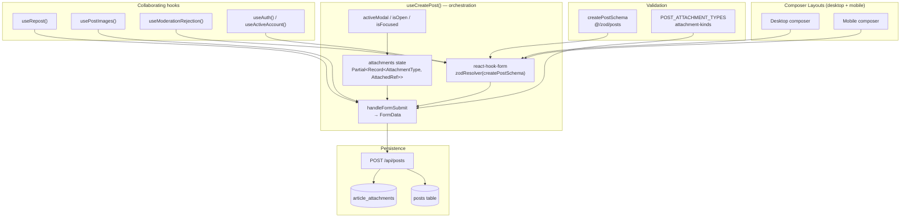
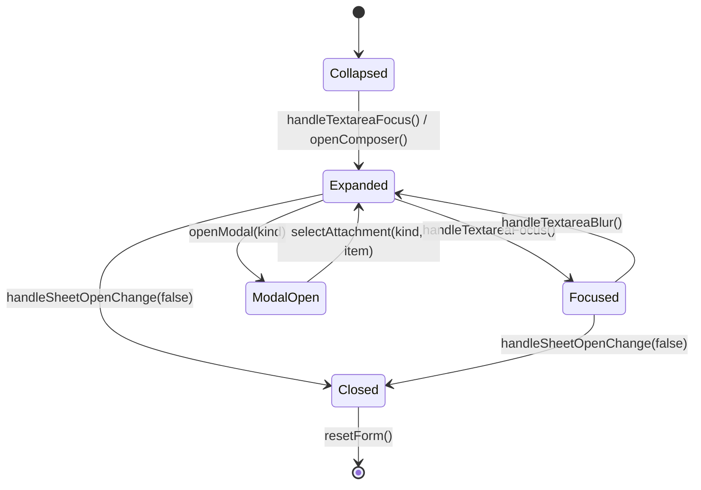
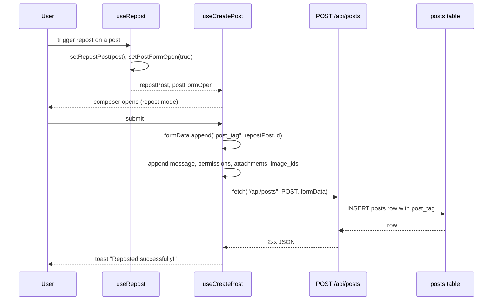
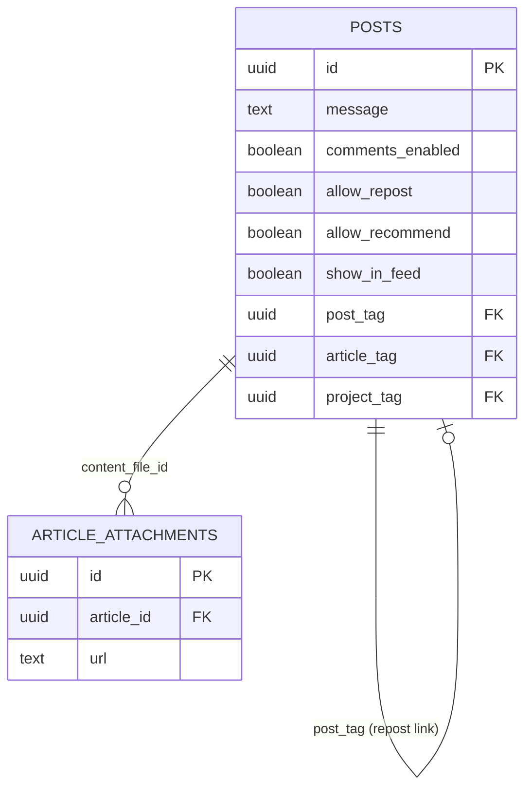

The post composer subsystem that lets an authenticated user write a post, attach referenced content (articles, projects, events, etc.), upload images, and publish either a brand-new post or a repost of an existing one — all through a single orchestration hook that funnels composer state into a `multipart/form-data` request to `POST /api/posts`.

## Purpose and Scope

This page documents the **post creation workflow** end to end: the client-side composer orchestration (`useCreatePost`), how attachments are collected and encoded as tag fields, how images are linked at publish time, and how reposts are expressed as a `post_tag` link on the created row.

In scope:

- The `useCreatePost` orchestration hook and its `FormData` submit contract.
- The composer form shape (`createPostSchema` / `CreatePostFormInput` / `CreatePostFormData`) and its defaults.
- The attachment model: `AttachmentType`, `AttachedRef`, `POST_ATTACHMENT_TYPES`, and the `tagField` mapping to `post_tag`.
- Image linking via `image_ids` produced by `usePostImages`.
- Repost creation (opening the composer with an existing post via `useRepost`).
- Moderation rejection handling shared with other forms (`useModerationRejection`).
- The `article_attachments` storage model and its Row Level Security policies, since attachments reuse that storage/authorization pattern.

Out of scope (see sibling pages):

- **Article form internals** — the rich article editor, cover/gallery/annex uploads, and its own reference material. See `docs/article-form/article-form-reference.md` and the `src/components/articles/form/**` tree.
- **Feed rendering and cards** — how published posts and articles are displayed. The catalog's feed pages cover `ArticlesInfiniteFeed`, `ArticleCard`, and friends.
- **Authentication and session handling** — `useAuth`, `useActiveAccount`, and `/api/session`. See the auth/session pages.
- **Moderation engine internals** — this page only documents how the composer *reacts* to moderation verdicts.

## Overview

The composer is deliberately layered. A single hook — `useCreatePost` — owns every piece of state the composer needs, and both the desktop and mobile layouts render identical behaviour by consuming that one hook's return value. The file documents this intent directly:

```typescript
/**
 * Single orchestration hook for the post composer: react-hook-form, the
 * remaining composer state, image sub-state (via {@link usePostImages}),
 * attachment/modal state, and the submit → FormData flow. Layouts and parts
 * consume its return value; the two layouts render identical behaviour.
 */
export function useCreatePost() {
```

> Source: [use-create-post.ts](https://github.com/ozeaon/ozeaon-v2/blob/0a4f1a95824db87782f1221a4108019d174df3d9/src/hooks/use-create-post.ts#L45-L51)

Three key concepts govern the design:

1. **The form is schema-first.** Validation is delegated to `createPostSchema` through `zodResolver`, and the hook distinguishes an *input* type from an *output* type (`CreatePostFormInput` → `CreatePostFormData`), which is why `useForm` and `ComposerForm` are both parameterised with `unknown` as the error type. This is the canonical react-hook-form pattern for forms whose validated output differs from raw field values.

2. **Attachments are references, not uploads.** An attachment is an `AttachedRef` — a pointer to an already-existing entity (identified by `id`) — keyed by an `AttachmentType`. Selecting an attachment does not upload anything; it stores the reference in local state and the `id` is written into a tag field at submit time.

3. **Images are uploaded before publish.** The comment in `handleFormSubmit` is explicit that by the time the form is submitted, each image id is already "uploaded, moderated and stored while the composer was open, so publishing only has to link them." Publishing is therefore a linking operation, not a transfer.

Reposts reuse this entire pipeline. A repost is not a separate endpoint — it is a normal post creation with `post_tag` set to the reposted post's id. The migration file confirms this contract:

```sql
-- posts.post_tag is the repost link — useCreatePost sends the reposted post's
-- id in it. Every other tag column on posts (article_tag, project_tag,
```

> Source: [20260819120100_repost_link_on_delete.sql](https://github.com/ozeaon/ozeaon-v2/blob/0a4f1a95824db87782f1221a4108019d174df3d9/supabase/migrations/20260819120100_repost_link_on_delete.sql#L3-L4)

## Architecture

The composer sits between the UI layouts (which render it) and the `/api/posts` route (which persists it). Its collaborators are four hooks plus a form schema.



The diagram reflects the actual dependency set imported by the hook: `useActiveAccount`, `useAuth`, `useIsMobile`, `useModerationRejection`, and `useRepost` from `@/hooks`, the `createPostSchema` and its two types from `@/zod/posts`, and `POST_ATTACHMENT_TYPES` / `AttachedRef` / `AttachmentType` from `@/components/posts/create-form/attachment-kinds`.

```typescript
import {
  useActiveAccount,
  useAuth,
  useIsMobile,
  useModerationRejection,
  useRepost,
} from "@/hooks";
import {
  createPostSchema,
  type CreatePostFormData,
  type CreatePostFormInput,
} from "@/zod/posts";
import type { ApiModerationIssue } from "@/utils/api-error";

import {
  POST_ATTACHMENT_TYPES,
  type AttachedRef,
  type AttachmentType,
} from "@/components/posts/create-form/attachment-kinds";
import { usePostImages } from "./use-post-images";
import { getImageUrl } from "@/utils";
```

> Source: [use-create-post.ts](https://github.com/ozeaon/ozeaon-v2/blob/0a4f1a95824db87782f1221a4108019d174df3d9/src/hooks/use-create-post.ts#L13-L33)

The layering matters because the two layouts must not diverge. By hoisting all behaviour into the hook, the desktop and mobile composers become pure renderings of the same state machine — a maintenance property, not an accident.

## Form State and Defaults

The form is created with `useForm` parameterised by input type `CreatePostFormInput`, `unknown` for the error type, and output type `CreatePostFormData`. It is also wired to `disabled: isLoading`, meaning the entire form is engine-level disabled during submission — react-hook-form handles this natively rather than the UI needing to add `disabled` to every field.

```typescript
const form = useForm<CreatePostFormInput, unknown, CreatePostFormData>({
  resolver: zodResolver(createPostSchema),
  disabled: isLoading,
  defaultValues: {
    message: "",
    comments_enabled: true,
    allow_repost: true,
    allow_recommend: true,
  },
});
```

> Source: [use-create-post.ts](https://github.com/ozeaon/ozeaon-v2/blob/0a4f1a95824db87782f1221a4108019d174df3d9/src/hooks/use-create-post.ts#L78-L87)

The defaults encode three social-interaction permissions that default to **permissive**:

| Field | Default | Meaning |
|-------|---------|---------|
| `message` | `""` | The post body text. |
| `comments_enabled` | `true` | Whether replies are allowed on the post. |
| `allow_repost` | `true` | Whether others may repost this post. |
| `allow_recommend` | `true` | Whether others may recommend this post. |

The design intent is opt-out rather than opt-in: a user must actively disable interaction, which matches the expected default posture of a social post. The `allow_repost` default is particularly relevant to this page — it is the permission that governs whether *other* users can create a repost pointing at this post via `post_tag`.

The form instance is exported as a named type so layouts and parts can accept it without re-deriving the generic parameters:

```typescript
/** The composer's react-hook-form instance (input → output transform). */
export type ComposerForm = UseFormReturn<
  CreatePostFormInput,
  unknown,
  CreatePostFormData
>;
```

> Source: [use-create-post.ts](https://github.com/ozeaon/ozeaon-v2/blob/0a4f1a95824db87782f1221a4108019d174df3d9/src/hooks/use-create-post.ts#L38-L43)

The hook's return type is likewise derived rather than hand-written, so it stays in sync automatically:

```typescript
export type UseCreatePostReturn = ReturnType<typeof useCreatePost>;
```

> Source: [use-create-post.ts](https://github.com/ozeaon/ozeaon-v2/blob/0a4f1a95824db87782f1221a4108019d174df3d9/src/hooks/use-create-post.ts#L392)

## Attachment Model

Attachments are the mechanism by which a post points at other content. The state is a sparse map keyed by attachment kind, so at most one attachment of each kind can exist on a post at a time:

```typescript
const [attachments, setAttachments] = useState<
  Partial<Record<AttachmentType, AttachedRef>>
>({});
const [activeModal, setActiveModal] = useState<AttachmentType | null>(null);
```

> Source: [use-create-post.ts](https://github.com/ozeaon/ozeaon-v2/blob/0a4f1a95824db87782f1221a4108019d174df3d9/src/hooks/use-create-post.ts#L73-L76)

`Partial<Record<AttachmentType, AttachedRef>>` is the load-bearing type here. It gives the composer three properties for free:

- **Type safety per kind** — only declared `AttachmentType` values are valid keys.
- **Sparsity** — kinds that have no attachment are simply absent, so the submit loop can test truthiness.
- **Single-valuedness** — the map cannot express "two article attachments", so the invariant that a post carries at most one reference per kind is enforced by the type, not by convention.

The three attachment operations are all trivial, referentially-stable callbacks:

```typescript
const openModal = useCallback((kind: AttachmentType) => {
  setActiveModal(kind);
}, []);

const selectAttachment = useCallback(
  (kind: AttachmentType, item: AttachedRef) => {
    setAttachments((prev) => ({ ...prev, [kind]: item }));
    setIsOpen(true);
  },
  [],
);

const removeAttachment = useCallback((kind: AttachmentType) => {
  setAttachments((prev) => {
    const next = { ...prev };
    delete next[kind];
    return next;
  });
}, []);
```

> Source: [use-create-post.ts](https://github.com/ozeaon/ozeaon-v2/blob/0a4f1a95824db87782f1221a4108019d174df3d9/src/hooks/use-create-post.ts#L121-L140)

Two details are worth calling out as deliberate design:

- `selectAttachment` sets `setIsOpen(true)`. Selecting an attachment re-opens (and keeps open) the composer, because the user picked something and the composer must remain visible to show it.
- `removeAttachment` copies before deleting rather than using `delete prev[kind]`. This preserves immutability so React's state comparison sees a new object.

### Attachment → tag field mapping

`POST_ATTACHMENT_TYPES` is an array of `{ type, tagField }` pairs. The `tagField` is the *column name* on the `posts` row that stores the reference. This is what makes the attachment system open-ended: adding a new attachable content kind is a matter of adding an entry to `POST_ATTACHMENT_TYPES` plus the corresponding tag column, with no change to the submit loop.

The repost link is the same mechanism with a fixed field name — `post_tag` — which is why the migration comment describes `post_tag` as "the repost link" alongside `article_tag` and `project_tag` as sibling tag columns.

## Image Handling

Images are handled by a dedicated sub-hook, `usePostImages`, which is instantiated with two callbacks. This is a notable separation of concerns: `useCreatePost` orchestrates, but it does not implement upload, progress, or moderation of images itself.

```typescript
const images = usePostImages({
  onError: showError,
  onRejected: moderation.applyImageRejection,
});
const {
  reset: resetImages,
  discardUploads,
  imageIds,
  isUploadingImages,
} = images;
```

> Source: [use-create-post.ts](https://github.com/ozeaon/ozeaon-v2/blob/0a4f1a95824db87782f1221a4108019d174df3d9/src/hooks/use-create-post.ts#L101-L110)

The two injected callbacks route failures to the correct channel:

| Callback | Wired to | Purpose |
|----------|----------|---------|
| `onError` | `showError` | Transient composer error banner (auto-clears). |
| `onRejected` | `moderation.applyImageRejection` | Per-image moderation rejection surfaced on the image itself. |

This split is important: a network error on upload and a moderation rejection of an image are different failures with different UI treatments, and the hook boundary is where that routing decision is made.

`imageIds` is the *only* thing the submit path needs from this sub-hook. The composer keeps the images out of the `FormData` as files — it sends ids of already-stored images instead. That is the key architectural decision for images: **upload while composing, link while publishing.**

The exposed `isUploadingImages` is consumed by the layout to disable publishing until uploads settle, and `discardUploads` is the cancel path (see below).

## Composer Open / Focus State Machine

The composer has a small but meaningful open/focus state machine. Three booleans — `isOpen`, `isFocused`, `activeModal` — are driven by named handlers rather than ad-hoc `setState` calls scattered through the layouts.

```typescript
const handleTextareaFocus = useCallback(() => {
  setIsOpen(true);
  setIsFocused(true);
}, []);

const handleTextareaBlur = useCallback(() => {
  setIsFocused(false);
}, []);

const handleSheetOpenChange = useCallback((open: boolean) => {
  setIsOpen(open);
  setIsFocused(open);
  if (!open) setActiveModal(null);
}, []);

const openComposer = useCallback(() => {
  setIsOpen(true);
}, []);

const setCollapsibleOpen = useCallback((open: boolean) => {
  setIsOpen(open);
}, []);
```

> Source: [use-create-post.ts](https://github.com/ozeaon/ozeaon-v2/blob/0a4f1a95824db87782f1221a4108019d174df3d9/src/hooks/use-create-post.ts#L142-L164)



Note that `handleSheetOpenChange(false)` is the *only* path that clears `activeModal`, and that `openModal` does not itself open the composer — opening the composer is the caller's responsibility. This keeps modal selection orthogonal to composer visibility.

## Core Flow: Submit to Publish

The publish path is `handleFormSubmit`, which receives already-validated `CreatePostFormData` (react-hook-form runs `createPostSchema` before calling it). It builds a `FormData` and POSTs it to `/api/posts`.

```typescript
const handleFormSubmit = useCallback(
  async (data: CreatePostFormData) => {
    setIsLoading(true);
    setErrorMessage("");
    moderation.resetBeforeAttempt();

    const formData = new FormData();
    formData.append("message", data.message);
    formData.append("comments_enabled", String(data.comments_enabled));
    formData.append("allow_repost", String(data.allow_repost));
    formData.append("allow_recommend", String(data.allow_recommend));
    formData.append("show_in_feed", "true");

    for (const { type, tagField } of POST_ATTACHMENT_TYPES) {
      const attached = attachments[type];
      if (attached) formData.append(tagField, attached.id);
    }
    if (repostPost) formData.append("post_tag", repostPost.id);

    // Each id is an image already uploaded, moderated and stored while the
    // composer was open, so publishing only has to link them.
    for (const imageId of imageIds) {
      formData.append("image_ids", imageId);
    }
```

> Source: [use-create-post.ts](https://github.com/ozeaon/ozeaon-v2/blob/0a4f1a95824db87782f1221a4108019d174df3d9/src/hooks/use-create-post.ts#L186-L209)

### Field encoding rules

| FormData key | Source | Encoding | Notes |
|--------------|--------|----------|-------|
| `message` | `data.message` | Raw string | Post body. |
| `comments_enabled` | `data.comments_enabled` | `String(...)` | Booleans are stringified because `FormData` is text-only. |
| `allow_repost` | `data.allow_repost` | `String(...)` | Permission for others to repost. |
| `allow_recommend` | `data.allow_recommend` | `String(...)` | Permission for others to recommend. |
| `show_in_feed` | **hard-coded** | `"true"` | Not user-configurable in the composer. |
| `<tagField>` | `attachments[type].id` | string id | One per present attachment kind. |
| `post_tag` | `repostPost.id` | string id | Present **only** for a repost. |
| `image_ids` | `imageIds` | repeated | Appended once per image id. |

Three design decisions stand out:

1. **`show_in_feed` is hard-coded to `"true"`.** The server API supports the field, but the composer always publishes visible. This keeps the composer to a single meaningful publish mode and avoids a privacy footgun.

2. **Attachment ids are appended under their own tag column name.** The loop iterates `POST_ATTACHMENT_TYPES` and writes `attached.id` into `tagField`. Absent attachments contribute nothing, so the server sees only the tag fields that were actually set. This means the API contract is *additive* — a new attachable kind needs no client-side `if` branches.

3. **`image_ids` is repeated, not comma-joined.** Repeating the key lets the server parse a genuine list without inventing a delimiter or worrying about ids containing delimiters.

The single line that makes this page's title accurate is:

```typescript
if (repostPost) formData.append("post_tag", repostPost.id);
```

> Source: [use-create-post.ts](https://github.com/ozeaon/ozeaon-v2/blob/0a4f1a95824db87782f1221a4108019d174df3d9/src/hooks/use-create-post.ts#L203)

A repost is therefore **not** a distinct operation. It is a post whose `post_tag` points at another post. `repostPost` comes from `useRepost()`, which also owns the global composer visibility flag `postFormOpen`.

### The repost trigger path

`useRepost` is the shared state that lets any surface in the app open the composer *pre-loaded as a repost*. The hook destructures five values:

```typescript
const {
  postFormOpen,
  repostPost,
  repostRequestId,
  setPostFormOpen,
  setRepostPost,
} = useRepost();
```

> Source: [use-create-post.ts](https://github.com/ozeaon/ozeaon-v2/blob/0a4f1a95824db87782f1221a4108019d174df3d9/src/hooks/use-create-post.ts#L54-L60)

`repostRequestId` is not used in the composer's submit path. Its presence indicates that the repost state carries a request identity used elsewhere (e.g. to key or de-duplicate the open-composer request when a repost is triggered repeatedly). Since the composer only reads `repostPost`, the composer is idempotent with respect to repeated repost requests — it simply renders whatever `repostPost` currently is.



### Response handling and status discrimination

The hook parses the JSON body into a narrow shape and dispatches on HTTP status rather than on message text:

```typescript
const response = await fetch("/api/posts", {
  method: "POST",
  body: formData,
});

const result = (await response.json()) as {
  data?: unknown;
  error?: string;
  message?: string;
  moderation?: ApiModerationIssue[];
};

if (!response.ok) {
  if (response.status === 422 && result.moderation) {
    moderation.applyRejection(result.moderation);
  } else if (response.status === 503) {
    moderation.applyFailure(result.message);
  } else {
    showError(
      result.error || result.message || "Failed to create post",
    );
  }
  setIsLoading(false);
  return;
}

const successMessage = repostPost
  ? "Reposted successfully!"
  : "Your post has been published";
```

> Source: [use-create-post.ts](https://github.com/ozeaon/ozeaon-v2/blob/0a4f1a95824db87782f1221a4108019d174df3d9/src/hooks/use-create-post.ts#L211-L240)

| Status | Condition | Handling |
|--------|-----------|----------|
| `422` **and** `moderation` present | Content rejected by moderation | `moderation.applyRejection(result.moderation)` — field/image-level errors |
| `503` | Moderation service unavailable | `moderation.applyFailure(result.message)` — composer-level failure banner |
| Any other non-2xx | Generic failure | `showError(result.error \|\| result.message \|\| "Failed to create post")` |
| 2xx | Success | Toast, using a **different message for reposts** |

Two behavioural guarantees fall out of this:

- **`422` requires the `moderation` array to be present.** A bare 422 without a `moderation` payload falls through to the generic error branch. This is defensive: it avoids rendering an empty rejection UI.
- **The error branch always resets `setIsLoading(false)` before returning.** Combined with `disabled: isLoading` on the form, the user regains the ability to edit and retry. The `return` is essential — without it, execution would fall through into the success path.

`ApiModerationIssue[]` is imported from `@/utils/api-error`, and the moderation behaviour itself is centralised in `useModerationRejection`. That hook's docstring explains why, noting that a duplicate copy of this logic previously lived in `use-project-form`, `ArticleForm`, `useCreatePost`, `use-thread-comments`, `use-organization-form`, and `OrganizationSettingsForm`.

## Reset and Cancel Semantics

Two teardown paths exist, and their difference is the single most important lifecycle detail on this page: **cancel must clean up orphaned images, but a successful publish must not.**

```typescript
const resetForm = useCallback(() => {
  resetImages();
  setIsFocused(false);
  setIsLoading(false);
  setErrorMessage("");
  moderation.resetBeforeAttempt();
  setIsOpen(false);
  setAttachments({});
  setActiveModal(null);
  form.reset();
  setRepostPost(null);
  setPostFormOpen(false);
}, [resetImages, form, moderation, setRepostPost, setPostFormOpen]);

/** Cancel, unlike a successful publish, leaves no post to own the images. */
const cancelForm = useCallback(() => {
  discardUploads();
  resetForm();
}, [discardUploads, resetForm]);
```

> Source: [use-create-post.ts](https://github.com/ozeaon/ozeaon-v2/blob/0a4f1a95824db87782f1221a4108019d174df3d9/src/hooks/use-create-post.ts#L166-L184)

The inline comment states the rationale precisely: images uploaded during composing are stored *before* a post exists to own them. If the user publishes, the post adopts them. If the user cancels, there is no owner — so `discardUploads()` deletes the orphaned uploads, and only then is `resetForm()` run. `resetForm()` calls `resetImages()` (clearing local image state) but not `discardUploads()` (deleting storage objects), which is exactly right for the post-publish case.

Every mutation in `resetForm` corresponds to a piece of composer state:

| Action | Cleared state |
|--------|---------------|
| `resetImages()` | Image sub-state (`usePostImages`) |
| `setIsFocused(false)` | Focus flag |
| `setIsLoading(false)` | In-flight submit flag (re-enables form) |
| `setErrorMessage("")` | Transient error banner |
| `moderation.resetBeforeAttempt()` | Moderation rejection state |
| `setIsOpen(false)` | Composer expanded flag |
| `setAttachments({})` | All attachment references |
| `setActiveModal(null)` | Open attachment picker modal |
| `form.reset()` | react-hook-form values back to defaults |
| `setRepostPost(null)` | **Repost mode** — the composer is no longer a repost |
| `setPostFormOpen(false)` | Global composer visibility |

Clearing `setRepostPost(null)` is what makes the composer reusable: after a repost is published (or cancelled), the next open is a plain new post rather than another repost of the same target.

## Timers, Errors, and Auto-Cleanup

Two timing constants govern transient UI, and both have dedicated refs so they can be cancelled:

```typescript
const ERROR_DISPLAY_DURATION = 3000;
const SUCCESS_CLEANUP_DELAY = 2000;
```

> Source: [use-create-post.ts](https://github.com/ozeaon/ozeaon-v2/blob/0a4f1a95824db87782f1221a4108019d174df3d9/src/hooks/use-create-post.ts#L35-L36)

```typescript
const showError = useCallback((error: string) => {
  setErrorMessage(error);
  if (errorTimeoutRef.current) clearTimeout(errorTimeoutRef.current);
  errorTimeoutRef.current = setTimeout(() => {
    if (isMountedRef.current) setErrorMessage("");
  }, ERROR_DISPLAY_DURATION);
}, []);
```

> Source: [use-create-post.ts](https://github.com/ozeaon/ozeaon-v2/blob/0a4f1a95824db87782f1221a4108019d174df3d9/src/hooks/use-create-post.ts#L93-L99)

The pattern here is a debounced self-clearing error banner: each new error cancels the pending timeout before scheduling its own, so rapid successive errors do not cause the banner to disappear prematurely. The `isMountedRef` guard prevents a state update after unmount.

Unmount cleanup clears both timers, and the mounted flag is set in the same effect:

```typescript
useEffect(() => {
  isMountedRef.current = true;
  return () => {
    isMountedRef.current = false;
    if (errorTimeoutRef.current) clearTimeout(errorTimeoutRef.current);
    if (successTimeoutRef.current) clearTimeout(successTimeoutRef.current);
  };
}, []);
```

> Source: [use-create-post.ts](https://github.com/ozeaon/ozeaon-v2/blob/0a4f1a95824db87782f1221a4108019d174df3d9/src/hooks/use-create-post.ts#L112-L119)

### Refs used for imperative and lifecycle concerns

| Ref | Purpose |
|-----|---------|
| `formRef` | `RefObject<HTMLFormElement>` — imperative handle to the `<form>` element. |
| `isMountedRef` | Guards post-unmount state updates from timers. |
| `errorTimeoutRef` | Cancellable handle for the error auto-clear timer. |
| `successTimeoutRef` | Cancellable handle for the delayed success cleanup. |

`SUCCESS_CLEANUP_DELAY` (2000 ms) pairs with the success path: after a successful publish the composer is left briefly intact so the user sees the toast, then cleanup runs. Because it is a ref-held timer, navigating away mid-delay does not leak a pending update — the unmount effect clears it.

## Data Model and Persistence

Two storage layers back the composer: the `posts` row (which holds tag references) and `article_attachments` (which holds uploaded files). The composer never talks to either directly — `/api/posts` mediates — but the shape of both is determined by what the composer sends.



The `posts` row receives one value per submit field. The tag columns — `post_tag`, `article_tag`, `project_tag`, and siblings — are the persistence side of `POST_ATTACHMENT_TYPES`' `tagField` mapping; `post_tag` doubles as the repost pointer.

### Attachment storage and the content-key migration

The `article_attachments` table is the authoritative store for uploaded bodies. A migration makes this explicit and shows the ownership model for a content file:

```sql
--   1. DROP content — body is now stored as a gzipped file in R2;
--      the article_attachments row is the source of truth.
--      ⚠️  Destructive: existing content values are lost on apply.
--
--   2. ADD content_file_id — FK to article_attachments(id).
--      Nullable: articles without a saved content file remain valid.
--      ON DELETE SET NULL: deleting the attachment row does not cascade
--      to the article.
```

> Source: [20260331104653_article_content_key.sql](https://github.com/ozeaon/ozeaon-v2/blob/0a4f1a95824db87782f1221a4108019d174df3d9/supabase/migrations/20260331104653_article_content_key.sql#L4-L11)

Two properties matter for post/attachment interactions:

- **`content_file_id` is nullable** — a post or article without a saved content file is still valid. This mirrors the composer's sparse attachment map: absence of an attachment is a legal state, not an error.
- **`ON DELETE SET NULL`, not `CASCADE`** — deleting the attachment does not delete the owning post. This is the deliberate choice of *dangling gracefully* over *cascading destruction*: losing a file should not silently destroy user-authored text.

### Storage hosts and absolute URLs

Because uploaded content stores absolute URLs, the application must allow both the staging and production storage hosts regardless of which environment performed the upload:

```typescript
/**
 * Article content and attachments store absolute URLs against whichever
 * environment uploaded them, so both storage hosts must be allowed regardless
 */
```

> Source: [next.config.ts](https://github.com/ozeaon/ozeaon-v2/blob/0a4f1a95824db87782f1221a4108019d174df3d9/next.config.ts#L25-L27)

This is an operational implication of the upload-early design: an image uploaded in one environment and referenced by a persisted absolute URL must remain renderable when the records are read in another. Hence the allow-list covers both hosts.

### Row Level Security for attachments

`article_attachments` uses Row Level Security with policies split by operation. The read policy is the interesting one because it encodes the *visibility* model in SQL:

```sql
CREATE POLICY "Anyone can read attachments of published articles" ON public.article_attachments FOR SELECT
  USING ((EXISTS ( SELECT 1 FROM public.articles WHERE ((articles.id = article_attachments.article_id) AND ((articles.published = true) OR (articles.author_id = (SELECT auth.uid())))))));
```

> Source: [20260420000002_fix_rls_performance.sql](https://github.com/ozeaon/ozeaon-v2/blob/0a4f1a95824db87782f1221a4108019d174df3d9/supabase/migrations/20260420000002_fix_rls_performance.sql#L14-L15)

The `USING` clause grants read access when **either** the owning article is `published = true` **or** the requester is the author. The author clause is what allows a composer to display an attachment on a draft that is not yet publicly visible — without it, uploading images to an unpublished post would render broken previews.

The write policies are all author-only and all use the same `EXISTS` subquery against `articles.author_id = auth.uid()`:

```sql
CREATE POLICY "Author manages their article attachments" ON public.article_attachments FOR INSERT TO authenticated
  WITH CHECK ((EXISTS ( SELECT 1 FROM public.articles WHERE ((articles.id = article_attachments.article_id) AND (articles.author_id = (SELECT auth.uid()))))));
CREATE POLICY "Author updates their article attachments" ON public.article_attachments FOR UPDATE TO authenticated
  USING ((EXISTS ( SELECT 1 FROM public.articles WHERE ((articles.id = article_attachments.article_id) AND (articles.author_id = (SELECT auth.uid()))))))
  WITH CHECK ((EXISTS ( SELECT 1 FROM public.articles WHERE ((articles.id = article_attachments.article_id) AND (articles.author_id = (SELECT auth.uid()))))));
CREATE POLICY "Author deletes their article attachments" ON public.article_attachments FOR DELETE TO authenticated
  USING ((EXISTS ( SELECT 1 FROM public.articles WHERE ((articles.id = article_attachments.article_id) AND (articles.author_id = (SELECT auth.uid()))))));
```

> Source: [20260420000002_fix_rls_performance.sql](https://github.com/ozeaon/ozeaon-v2/blob/0a4f1a95824db87782f1221a4108019d174df3d9/supabase/migrations/20260420000002_fix_rls_performance.sql#L16-L22)

| Policy | Operation | Role | Check |
|--------|-----------|------|-------|
| Anyone can read attachments of published articles | `SELECT` | (all) | Published **or** author |
| Author manages their article attachments | `INSERT` | `authenticated` | Author only |
| Author updates their article attachments | `UPDATE` | `authenticated` | Author only (`USING` + `WITH CHECK`) |
| Author deletes their article attachments | `DELETE` | `authenticated` | Author only |

The migration file's header comment explains why these were rewritten — the original set had separate `SELECT` and `ALL` policies whose overlap caused RLS performance problems, so they were merged into one `SELECT` policy plus per-operation author policies:

```sql
-- article_attachments
-- Merge SELECT: "Anyone can read attachments of published articles" + "Author manages their article attachments" (ALL)
DROP POLICY IF EXISTS "Anyone can read attachments of published articles" ON public.article_attachments;
DROP POLICY IF EXISTS "Author manages their article attachments" ON public.article_attachments;
```

> Source: [20260420000002_fix_rls_performance.sql](https://github.com/ozeaon/ozeaon-v2/blob/0a4f1a95824db87782f1221a4108019d174df3d9/supabase/migrations/20260420000002_fix_rls_performance.sql#L10-L13)

Using a single merged `SELECT` policy instead of overlapping `SELECT` + `ALL` policies is a well-known Postgres RLS optimisation: overlapping permissive policies are evaluated together per row, so collapsing them reduces per-row predicate evaluation.

## Usage Examples

### Attaching content and publishing

```typescript
const formData = new FormData();
formData.append("message", data.message);
formData.append("comments_enabled", String(data.comments_enabled));
formData.append("allow_repost", String(data.allow_repost));
formData.append("allow_recommend", String(data.allow_recommend));
formData.append("show_in_feed", "true");

for (const { type, tagField } of POST_ATTACHMENT_TYPES) {
  const attached = attachments[type];
  if (attached) formData.append(tagField, attached.id);
}
if (repostPost) formData.append("post_tag", repostPost.id);

// Each id is an image already uploaded, moderated and stored while the
// composer was open, so publishing only has to link them.
for (const imageId of imageIds) {
  formData.append("image_ids", imageId);
}
```

> Source: [use-create-post.ts](https://github.com/ozeaon/ozeaon-v2/blob/0a4f1a95824db87782f1221a4108019d174df3d9/src/hooks/use-create-post.ts#L192-L209)

### Publishing a repost

The repost case differs from a plain post by exactly one appended field. Notice the success message is also branched, so the user is told which action completed:

```typescript
if (repostPost) formData.append("post_tag", repostPost.id);
```

> Source: [use-create-post.ts](https://github.com/ozeaon/ozeaon-v2/blob/0a4f1a95824db87782f1221a4108019d174df3d9/src/hooks/use-create-post.ts#L203)

```typescript
const successMessage = repostPost
  ? "Reposted successfully!"
  : "Your post has been published";
```

> Source: [use-create-post.ts](https://github.com/ozeaon/ozeaon-v2/blob/0a4f1a95824db87782f1221a4108019d174df3d9/src/hooks/use-create-post.ts#L238-L240)

### Cancelling a composer and reclaiming uploads

```typescript
/** Cancel, unlike a successful publish, leaves no post to own the images. */
const cancelForm = useCallback(() => {
  discardUploads();
  resetForm();
}, [discardUploads, resetForm]);
```

> Source: [use-create-post.ts](https://github.com/ozeaon/ozeaon-v2/blob/0a4f1a95824db87782f1221a4108019d174df3d9/src/hooks/use-create-post.ts#L180-L184)

### Subscribing to the post body for character counting

`useWatch` subscribes the hook to a single field so the layout can react to typing without re-rendering on every other field change:

```typescript
const messageValue = useWatch({ name: "message", control: form.control });
```

> Source: [use-create-post.ts](https://github.com/ozeaon/ozeaon-v2/blob/0a4f1a95824db87782f1221a4108019d174df3d9/src/hooks/use-create-post.ts#L91)

### Authorising attachment access in SQL

```sql
CREATE POLICY "Anyone can read attachments of published articles" ON public.article_attachments FOR SELECT
  USING ((EXISTS ( SELECT 1 FROM public.articles WHERE ((articles.id = article_attachments.article_id) AND ((articles.published = true) OR (articles.author_id = (SELECT auth.uid())))))));
```

> Source: [20260420000002_fix_rls_performance.sql](https://github.com/ozeaon/ozeaon-v2/blob/0a4f1a95824db87782f1221a4108019d174df3d9/supabase/migrations/20260420000002_fix_rls_performance.sql#L14-L15)

## API Reference

### `useCreatePost()`

The single orchestration hook for the post composer.

**Parameters:** none.

**Returns (`UseCreatePostReturn`):** the composer's full state and handler surface. Verified members include:

| Member | Kind | Description |
|--------|------|-------------|
| `form` | `ComposerForm` | The react-hook-form instance (`UseFormReturn<CreatePostFormInput, unknown, CreatePostFormData>`). |
| `isLoading` | `boolean` | In-flight submit flag; also drives `disabled` on the form. |
| `isFocused` | `boolean` | Textarea focus flag. |
| `isOpen` | `boolean` | Composer expanded flag. |
| `errorMessage` | `string` | Transient error text, auto-cleared after `ERROR_DISPLAY_DURATION`. |
| `attachments` | `Partial<Record<AttachmentType, AttachedRef>>` | Currently attached references by kind. |
| `activeModal` | `AttachmentType \| null` | Which attachment picker is open. |
| `images` | `usePostImages` return | Image sub-state (also destructured internally as `resetImages`, `discardUploads`, `imageIds`, `isUploadingImages`). |
| `messageValue` | `string` | Watched `message` field value. |
| `moderation` | `useModerationRejection` return | Moderation state and actions. |
| `openModal(kind)` | `(kind: AttachmentType) => void` | Open the picker for an attachment kind. |
| `selectAttachment(kind, item)` | `(kind: AttachmentType, item: AttachedRef) => void` | Store a reference and open the composer. |
| `removeAttachment(kind)` | `(kind: AttachmentType) => void` | Drop the reference for a kind. |
| `handleTextareaFocus()` | `() => void` | Focus handler. |
| `handleTextareaBlur()` | `() => void` | Blur handler. |
| `handleSheetOpenChange(open)` | `(open: boolean) => void` | Mobile sheet open/close; clears `activeModal` on close. |
| `openComposer()` | `() => void` | Expand the composer. |
| `setCollapsibleOpen(open)` | `(open: boolean) => void` | Collapsible open/close. |
| `resetForm()` | `() => void` | Full reset including clearing `repostPost`. |
| `cancelForm()` | `() => void` | `discardUploads()` then `resetForm()`. |
| `handleFormSubmit(data)` | `(data: CreatePostFormData) => Promise<void>` | Builds `FormData` and POSTs to `/api/posts`. |

**Side effects:**

- `fetch("/api/posts", { method: "POST", body: formData })`.
- Sets a success timer (`SUCCESS_CLEANUP_DELAY`) on success.
- On cancel, deletes previously uploaded images via `discardUploads()`.

**Note:** the return list above covers the members verified from the hook body and the exported type aliases. Members added conditionally or returned by spread from a sub-hook may exist beyond those read; the return type is derived via `ReturnType<typeof useCreatePost>`, so consumers always see the exact surface.

### `POST /api/posts`

| Aspect | Value |
|--------|-------|
| Method | `POST` |
| Body | `multipart/form-data` |
| Called from | `handleFormSubmit` in `useCreatePost` |
| Success | 2xx; toast "Reposted successfully!" for reposts, otherwise "Your post has been published" |
| `422` | Content moderation rejection; expected to carry a `moderation: ApiModerationIssue[]` array |
| `503` | Moderation unavailable; body `message` rendered via the composer-level failure banner |

The JSON response is typed client-side as `{ data?: unknown; error?: string; message?: string; moderation?: ApiModerationIssue[] }`.

## Configuration Options

### Composer form defaults

| Option | Type | Default | Description |
|--------|------|---------|-------------|
| `message` | `string` | `""` | Post body text. |
| `comments_enabled` | `boolean` | `true` | Allow replies on the post. |
| `allow_repost` | `boolean` | `true` | Allow others to repost this post. |
| `allow_recommend` | `boolean` | `true` | Allow others to recommend this post. |

> Source: [use-create-post.ts](https://github.com/ozeaon/ozeaon-v2/blob/0a4f1a95824db87782f1221a4108019d174df3d9/src/hooks/use-create-post.ts#L81-L86)

### Module-level constants

| Constant | Type | Value | Description |
|----------|------|-------|-------------|
| `ERROR_DISPLAY_DURATION` | `number` (ms) | `3000` | How long a transient composer error stays visible. |
| `SUCCESS_CLEANUP_DELAY` | `number` (ms) | `2000` | Delay before success-path cleanup runs. |

> Source: [use-create-post.ts](https://github.com/ozeaon/ozeaon-v2/blob/0a4f1a95824db87782f1221a4108019d174df3d9/src/hooks/use-create-post.ts#L35-L36)

### Fixed submit values

| FormData key | Value | Configurable |
|--------------|-------|--------------|
| `show_in_feed` | `"true"` | No — hard-coded in the composer. |

> Source: [use-create-post.ts](https://github.com/ozeaon/ozeaon-v2/blob/0a4f1a95824db87782f1221a4108019d174df3d9/src/hooks/use-create-post.ts#L197)

## Failure Modes, Edge Cases & Concurrency

### Failure mode matrix

| Failure | Detection | Composer response |
|---------|-----------|-------------------|
| Schema validation failure | `zodResolver(createPostSchema)` | Submit handler is never invoked; react-hook-form surfaces field errors. |
| Image upload error | `usePostImages` `onError` → `showError` | Transient error banner, auto-clears after 3 s. |
| Image rejected by moderation | `usePostImages` `onRejected` → `moderation.applyImageRejection` | Rejection attached to the image, not the banner. |
| Content rejected at publish | HTTP `422` with `moderation` array | `moderation.applyRejection(...)`; field-level messages. |
| Moderation service down | HTTP `503` | `moderation.applyFailure(result.message)`; composer-level banner. |
| Any other non-2xx | Response not `ok` | `showError(result.error \|\| result.message \|\| "Failed to create post")`. |
| Network/parse failure | `fetch` or `response.json()` throws | Caught by the surrounding `try` block; loading state is not left set by the success path. |
| Cancel with pending uploads | `cancelForm()` | `discardUploads()` reclaims storage before `resetForm()`. |
| Unmount during pending timers | Effect cleanup | `isMountedRef` set to `false`; both timeouts cleared. |

### Edge cases encoded in the design

- **`422` without a `moderation` array.** The check is `response.status === 422 && result.moderation`, so a malformed 422 degrades to the generic error path instead of rendering an empty rejection UI.
- **Sparse attachments are normal.** Because `attachments` is a `Partial<Record<...>>` and the submit loop tests `if (attached)`, a post with zero attachments simply omits every tag field. No sentinel or empty-string value is sent.
- **Repost plus attachments coexist.** `post_tag` is appended independently of the `POST_ATTACHMENT_TYPES` loop, so a repost can also carry its own attachments and images. The composer does not restrict reposts to text-only.
- **`post_tag` is a plain FK with a defined delete behaviour.** The dedicated migration `20260819120100_repost_link_on_delete.sql` exists to define what happens to a repost when the original post is deleted — confirming that the repost link is treated as a first-class relationship, not an opaque string.
- **Cancelled uploads versus published uploads.** `resetForm()` deliberately does *not* discard uploads; only `cancelForm()` does. Calling the wrong one either leaks storage (cancel without discard) or breaks a published post's images (discard after publish).
- **Repeated repost requests.** The composer reads `repostPost` idempotently; `repostRequestId` from `useRepost` is not consumed by the submit path.

### Concurrency considerations

- **Single in-flight submit.** `setIsLoading(true)` at the top of the handler combines with `disabled: isLoading` on the form and the loading flag on the publish control, so a second submit cannot be initiated while one is in flight. The error branch explicitly restores `setIsLoading(false)` so the form does not lock out permanently after a failure.
- **Timer races.** `showError` cancels any pending error timeout before scheduling a new one, so two rapid errors cannot cause the banner to clear after the second one's window has started.
- **Upload/moderate/publish ordering.** Image uploads complete while the composer is open, so publish is a fast linking operation. `isUploadingImages` is exposed so layouts can gate publishing on upload completion; a publish that races an upload would otherwise reference an id before its storage object exists.
- **Cross-environment URL validity.** Because absolute URLs are persisted at upload time, concurrent access from a different environment requires both storage hosts to be allowed — enforced in `next.config.ts`.

## Performance and Operational Notes

- **Publish is lightweight by design.** Because images are uploaded and moderated while composing, `handleFormSubmit` only writes ids and tag references. The expensive work is moved off the critical publish path, which shortens the perceived publish latency and reduces the window in which a partial failure can occur.
- **`useWatch` on a single field.** Subscribing only to `message` avoids re-rendering the hook on changes to the three boolean permission fields, which is relevant because the composer renders a live character counter against `messageValue`.
- **Referentially stable callbacks.** Every handler in the hook is wrapped in `useCallback` with accurate dependency arrays (`[]` for pure setters). This keeps the many composer sub-components from re-rendering on unrelated state changes.
- **RLS predicate cost.** The attachment policies embed an `EXISTS` subquery against `articles` per row-matching attempt, and the rewrite in `20260420000002_fix_rls_performance.sql` collapsed overlapping permissive policies specifically to reduce per-row predicate evaluation. Any future attachment policy should follow the same single-`SELECT`-policy pattern.
- **Deletion safety.** `content_file_id` uses `ON DELETE SET NULL` rather than `CASCADE`, so storage cleanup (e.g. `discardUploads`) cannot destroy authored text. Storage reclamation and content deletion are deliberately decoupled.

## Extension Points

| Extension | How |
|-----------|-----|
| Add a new attachable content kind | Add an entry to `POST_ATTACHMENT_TYPES` in `@/components/posts/create-form/attachment-kinds`, providing `type` and `tagField`, plus the matching tag column on `posts`. The submit loop needs no change. |
| Add a new composer field | Extend `createPostSchema` in `@/zod/posts`; the input/output generic pair on `useForm` keeps validation and submit types synchronised. |
| Change image upload/moderation behaviour | Modify `usePostImages` — the composer only depends on its `onError`, `onRejected`, `reset`, `discardUploads`, `imageIds`, and `isUploadingImages` surface. |
| Change moderation UX | Modify `useModerationRejection`; it is already shared across the project form, `ArticleForm`, `useCreatePost`, thread comments, and the organisation forms, so a change is applied consistently. |
| Open the composer in repost mode from anywhere | Use `useRepost()`'s `setRepostPost(post)` + `setPostFormOpen(true)`; the composer picks up `repostPost` and appends `post_tag`. |
| Alter the published payload | Edit the `FormData` construction in `handleFormSubmit`; note that `show_in_feed` is currently hard-coded to `"true"`. |

## Related Links

- [use-create-post.ts](https://github.com/ozeaon/ozeaon-v2/blob/0a4f1a95824db87782f1221a4108019d174df3d9/src/hooks/use-create-post.ts) — the composer orchestration hook.
- [use-repost.ts](https://github.com/ozeaon/ozeaon-v2/blob/0a4f1a95824db87782f1221a4108019d174df3d9/src/hooks/use-repost.ts) — repost state shared across surfaces.
- [use-post-images.ts](https://github.com/ozeaon/ozeaon-v2/blob/0a4f1a95824db87782f1221a4108019d174df3d9/src/hooks/use-post-images.ts) — image upload, moderation, and cleanup.
- [use-moderation-rejection.ts](https://github.com/ozeaon/ozeaon-v2/blob/0a4f1a95824db87782f1221a4108019d174df3d9/src/hooks/use-moderation-rejection.ts) — shared moderation rejection handling.
- [attachment-kinds.ts](https://github.com/ozeaon/ozeaon-v2/blob/0a4f1a95824db87782f1221a4108019d174df3d9/src/components/posts/create-form/attachment-kinds.ts) — `AttachmentType`, `AttachedRef`, `POST_ATTACHMENT_TYPES`.
- [posts.ts](https://github.com/ozeaon/ozeaon-v2/blob/0a4f1a95824db87782f1221a4108019d174df3d9/src/zod/posts.ts) — `createPostSchema`, `CreatePostFormInput`, `CreatePostFormData`.
- [hooks/index.ts](https://github.com/ozeaon/ozeaon-v2/blob/0a4f1a95824db87782f1221a4108019d174df3d9/src/hooks/index.ts#L23-L24) — public exports of `useCreatePost` and its return type.
- [route.ts (api/posts)](https://github.com/ozeaon/ozeaon-v2/blob/0a4f1a95824db87782f1221a4108019d174df3d9/src/app/api/posts/route.ts) — the server-side post creation endpoint.
- [20260819120100_repost_link_on_delete.sql](https://github.com/ozeaon/ozeaon-v2/blob/0a4f1a95824db87782f1221a4108019d174df3d9/supabase/migrations/20260819120100_repost_link_on_delete.sql) — `post_tag` repost link semantics.
- [20260331104653_article_content_key.sql](https://github.com/ozeaon/ozeaon-v2/blob/0a4f1a95824db87782f1221a4108019d174df3d9/supabase/migrations/20260331104653_article_content_key.sql) — content stored as a file with `content_file_id`.
- [20260420000002_fix_rls_performance.sql](https://github.com/ozeaon/ozeaon-v2/blob/0a4f1a95824db87782f1221a4108019d174df3d9/supabase/migrations/20260420000002_fix_rls_performance.sql) — attachment RLS policies.
- [next.config.ts](https://github.com/ozeaon/ozeaon-v2/blob/0a4f1a95824db87782f1221a4108019d174df3d9/next.config.ts#L25-L27) — storage host allow-list for absolute attachment URLs.
- `docs/article-form/article-form-reference.md` — the sibling article form reference.
- `docs/component-library.md` — `repostedPosts`/`likedPosts` component props.
