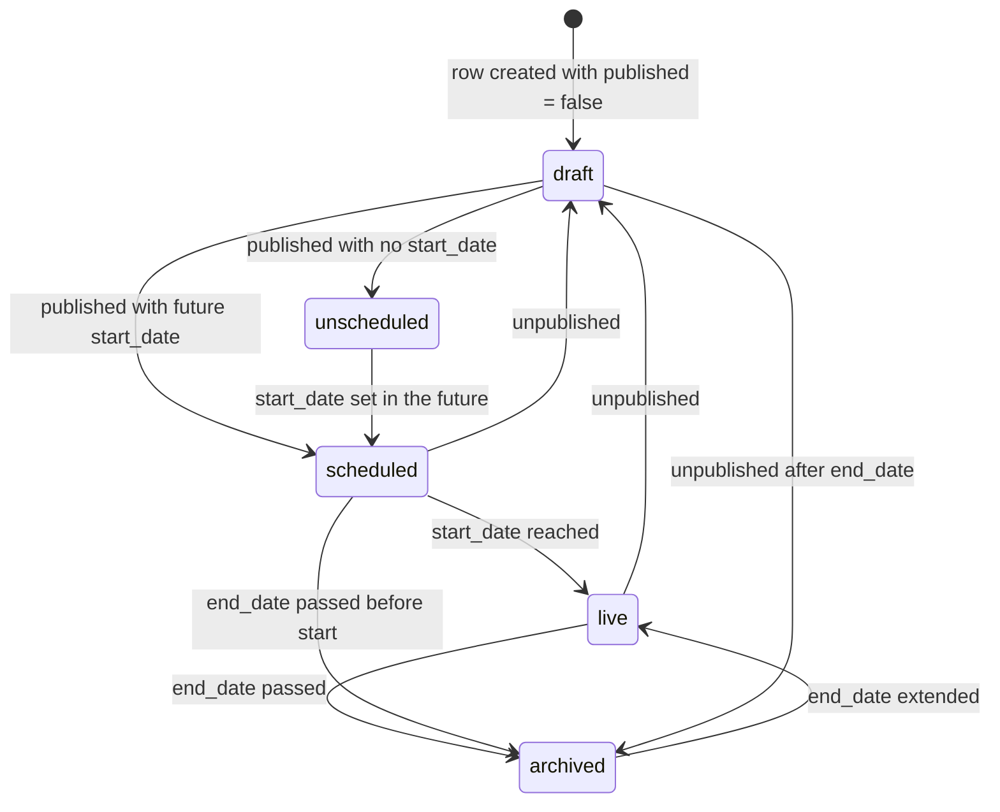
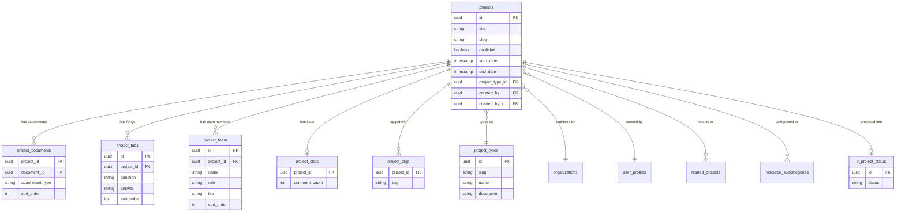
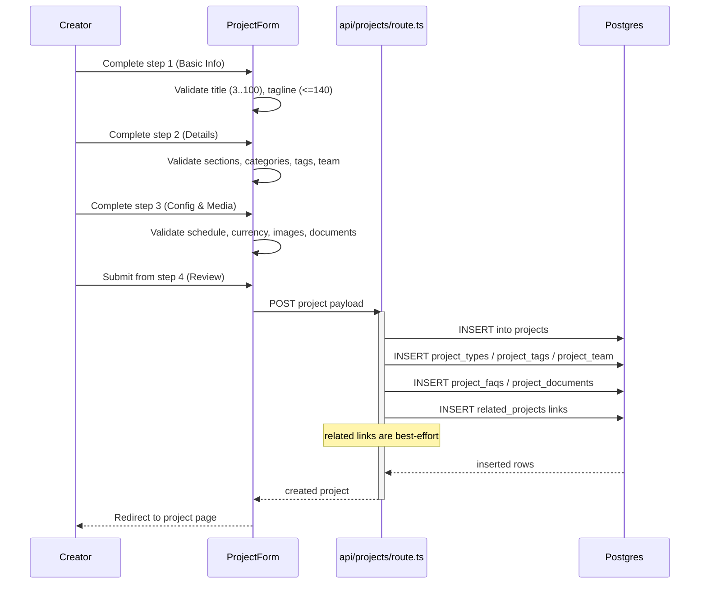

The end-to-end lifecycle of a project entity in Ozeaon — from draft creation through publishing, scheduled start, live status, and archival — including the persistence model, status derivation, and the form/validation rules that govern creation.

## Purpose and Scope

This page documents how a **project** is created, validated, persisted, and how it transitions through its operational lifecycle states. It covers:

- The project data model and its related tables (types, tags, categories, team, documents, FAQs, stats).
- The lifecycle **status** vocabulary (`live`, `scheduled`, `unscheduled`, `archived`, `draft`) and how it is derived and presented.
- The four-step creation form and the field-level validation limits that constrain a new project.
- The status filter taxonomy used by dashboard feeds.

**Out of scope / sibling pages:**

- Article authoring and publishing lifecycle — see the article workflow pages.
- Organisation membership and ownership transfer semantics — covered with the organisations/content-ownership pages.
- Row-Level Security policy mechanics beyond the project-specific predicates — see the database/security pages.

## Overview

A project is the primary "entity" content type in Ozeaon, alongside articles and organisations. Unlike an article, a project has a **lifecycle** rather than a simple published/unpublished flag: it carries `start_date` / `end_date` and is projected into a computed status by the `v_project_status` database view. This lets a single row describe a project that has not started yet, is currently running, or has completed, without any background job mutating the row.

Two orthogonal concepts coexist and are frequently confused:

| Concept | Column/Field | Meaning |
|---|---|---|
| Publication flag | `projects.published` | Whether the project is visible to anonymous readers (RLS-driven). |
| Lifecycle status | `v_project_status.status` (computed) | Where the project sits in time: `scheduled`, `live`, `unscheduled`, `archived`, or `draft`. |

A project can therefore be *published* but *scheduled* (visible, not yet started), or *unpublished* and thus a `draft` regardless of dates. This separation is the central design idea of the lifecycle: **visibility is a stored flag, while temporal state is derived.**

The creation surface is a four-step wizard defined by `PROJECT_FORM_STEPS`, with a single source of truth for required fields and their error copy in `REQUIRED_FIELD_MESSAGES`, and numeric length limits in `PROJECT_FIELD_LIMITS`. Sharing these constants between the form and the status badges ensures the tab a user filters by in the dashboard always reads the same word as the badge on the card.

## Architecture

The lifecycle spans a form layer, an API/mutation layer, a query layer, and a database projection view. The diagram below reflects the concrete modules and constants found in the repository.

```mermaid
flowchart TD
    subgraph sg_Form["Form Layer (client)"]
        ProjectForm["ProjectForm.tsx"]
        Step1["ProjectIdentitySection"]
        Step2["ProjectTypeSection"]
        StepsCfg["PROJECT_FORM_STEPS"]
        FieldLimits["PROJECT_FIELD_LIMITS"]
        RequiredMsgs["REQUIRED_FIELD_MESSAGES"]
    end

    subgraph sg_Api["API Layer"]
        ApiRoute["app/api/projects/route.ts"]
    end

    subgraph sg_Query["Query Layer"]
        QueriesProject["lib/supabase/queries/projects.ts"]
        QueriesOrg["lib/supabase/queries/organizations.ts"]
        QueriesArticle["lib/supabase/queries/articles.ts"]
    end

    subgraph sg_Data["Data Layer (Postgres / Supabase)"]
        ProjectsTbl[("projects")]
        ProjectStatusView[("v_project_status")]
        ProjectTypeTbl[("project_types")]
        ProjectTagsTbl[("project_tags")]
        ProjectFaqsTbl[("project_faqs")]
        ProjectDocsTbl[("project_documents")]
        ProjectTeamTbl[("project_team")]
        ProjectStatsTbl[("project_stats")]
    end

    subgraph sg_Present["Presentation Constants"]
        Statuses["PROJECT_STATUSES"]
        StatusBadges["PROJECT_STATUS_BADGES"]
        StatusTabs["PROJECT_STATUS_FILTER_TABS"]
    end

    ProjectForm --> Step1
    ProjectForm --> Step2
    ProjectForm --> StepsCfg
    ProjectForm --> FieldLimits
    ProjectForm --> RequiredMsgs
    ProjectForm -->|"submit"| ApiRoute
    ApiRoute --> ProjectsTbl
    ApiRoute --> ProjectTypeTbl
    ApiRoute --> ProjectTagsTbl
    ApiRoute --> ProjectFaqsTbl
    ApiRoute --> ProjectDocsTbl
    ApiRoute --> ProjectTeamTbl
    QueriesProject --> ProjectStatusView
    QueriesProject --> ProjectsTbl
    QueriesOrg --> ProjectStatusView
    QueriesArticle --> ProjectStatusView
    ProjectStatusView --> ProjectsTbl
    ProjectStatusView --> Statuses
    Statuses --> StatusBadges
    StatusBadges --> StatusTabs
    ProjectStatsTbl --> ProjectsTbl
```



Each subgraph corresponds to a real repository location: the form components under `src/components/projects/form/`, the write path in `src/app/api/projects/route.ts`, the read projections in `src/lib/supabase/queries/`, and the presentation vocabulary in `src/config/constants/projects.ts`.

### Why the status view matters

Read paths do not compute status in application code. The dashboard query explicitly states the intent:

```ts
    // Dashboard queries include drafts; use the authed client so RLS on unpublished
    // projects applies. v_project_status carries the projects columns alongside the
    // computed status, so the card data and its status come back in one request and
```

> Source: [projects.ts](https://github.com/ozeaon/ozeaon-v2/blob/0a4f1a95824db87782f1221a4108019d174df3d9/src/lib/supabase/queries/projects.ts#L714-L716)

This is a deliberate design decision: because the view carries the `projects` columns *alongside* the computed status, a card feed needs exactly one round trip — no second query to resolve status, and no risk of the card and its status disagreeing. It also keeps the status rules in one place (SQL), so the client, the dashboard, and the public page cannot drift apart.

The same view is reused for cross-entity aggregates. Organisation queries count projects by status over the same base builder (`projectsBase()`), and article queries embed a project status object into the article payload, proving the view is the single contract for project status across all read paths:

```ts
            project_status: projectStatus
              ? { status: projectStatus as ProjectStatus }
              : null,
```

> Source: [articles.ts](https://github.com/ozeaon/ozeaon-v2/blob/0a4f1a95824db87782f1221a4108019d174df3d9/src/lib/supabase/queries/articles.ts#L515-L517)

## Lifecycle States

The complete status vocabulary is declared as a const tuple, which simultaneously serves as a runtime list and a TypeScript union type source:

```ts
export const PROJECT_STATUSES = [
  "live",
  "scheduled",
  "unscheduled",
  "archived",
  "draft",
] as const;
```

> Source: [projects.ts](https://github.com/ozeaon/ozeaon-v2/blob/0a4f1a95824db87782f1221a4108019d174df3d9/src/config/constants/projects.ts#L22-L28)

The derived type is consumed by the shared type module, so every consumer speaks the same union:

```ts
export type ProjectStatus = (typeof PROJECT_STATUSES)[number];
```

> Source: [projects.ts](https://github.com/ozeaon/ozeaon-v2/blob/0a4f1a95824db87782f1221a4108019d174df3d9/src/types/projects.ts#L14)

And it is embedded in the public project payload as a nullable computed relation:

```ts
  // Computed status from v_project_status view
  project_status?: { status: ProjectStatus } | null;
```

> Source: [projects.ts](https://github.com/ozeaon/ozeaon-v2/blob/0a4f1a95824db87782f1221a4108019d174df3d9/src/types/projects.ts#L76-L77)

Note the nullability: `project_status` is optional *and* nullable because a project row fetched without joining the view has no status, and the view itself may not match a row. Consumers must treat "no status" as a distinct case from "status present".

### State transition model

Status is derived from `published` plus the `start_date` / `end_date` window carried by the project row. The transitions below are the states a project progresses through; each is entered by a data change (publishing the row, or time crossing a date boundary), not by an explicit state-machine API.



The two non-obvious paths are worth calling out:

1. **`live → draft` and `scheduled → draft`.** Because visibility is a stored flag rather than a temporal fact, unpublishing a running or future project removes it from public view but does not erase its dates. The project therefore becomes a `draft` for public readers while its temporal window is untouched. This is intentional — unpublishing must be reversible without losing the schedule.
2. **`scheduled → archived`.** A project whose `end_date` passes before its `start_date` is reachable only through bad data (or a retroactively edited schedule), but the derived model allows it because no application code validates the ordering at status level.

### Status presentation

Statuses map to user-facing labels through `PROJECT_STATUS_BADGES`. Critically, `unscheduled` is deliberately absent from this map:

```ts
/**
 * Status values that surface a hero/card pill, on both the public project page
 * and the dashboard feeds. `unscheduled` is absent and renders no badge, so a
 * project with no start date isn't mislabelled as Live.
 */
export const PROJECT_STATUS_BADGES: Partial<
  Record<ProjectStatusKey, StatusBadge>
> = {
  live: { label: "Live", variant: "green-pastel", dot: "bg-green-400" },
  scheduled: {
    label: "Starting soon",
    variant: "subtle",
    dot: "bg-secondary",
  },
  archived: { label: "Completed", variant: "old-lace", dot: "bg-secondary" },
  draft: { label: "Draft", variant: "subtle", dot: "bg-subtle" },
};
```

> Source: [projects.ts](https://github.com/ozeaon/ozeaon-v2/blob/0a4f1a95824db87782f1221a4108019d174df3d9/src/config/constants/projects.ts#L56-L72)

Three design decisions are encoded here:

- The map is typed `Partial<Record<...>>` rather than a complete record — the type system permits `unscheduled` to be missing, and the runtime lookup returns `undefined`, which the rendering layer treats as "no badge".
- The label for `archived` is **"Completed"**, not "Archived". The lifecycle term is internal; the user-facing word is the outcome. Similarly `scheduled` renders as "Starting soon".
- `draft` has a real badge, unlike `unscheduled`. A draft is an actionable author state a creator needs to see; `unscheduled` is merely an absence of schedule information.

## Filter Taxonomy

Dashboard feeds use a distinct, narrower list that includes an `"all"` pseudo-filter and omits `unscheduled`:

```ts
/**
 * User-facing project status filters for dashboard feeds. Includes an "all"
 * pseudo-filter and omits `unscheduled` (not a filter option).
 */
export const PROJECT_STATUS_FILTERS = [
  "all",
  "live",
  "scheduled",
  "draft",
  "archived",
] as const;
```

> Source: [projects.ts](https://github.com/ozeaon/ozeaon-v2/blob/0a4f1a95824db87782f1221a4108019d174df3d9/src/config/constants/projects.ts#L30-L40)

Because this list arrives from the URL (a query parameter), it needs a runtime guard rather than a compile-time type. `isProjectStatusFilter` performs that narrowing:

```ts
export function isProjectStatusFilter(
  value: unknown,
): value is ProjectStatusFilter {
  return (
    typeof value === "string" &&
    (PROJECT_STATUS_FILTERS as readonly string[]).includes(value)
  );
}
```

> Source: [projects.ts](https://github.com/ozeaon/ozeaon-v2/blob/0a4f1a95824db87782f1221a4108019d174df3d9/src/config/constants/projects.ts#L44-L51)

The filter tabs are then **derived** from the filter list and the badge labels, so the two can never disagree:

```ts
export const PROJECT_STATUS_FILTER_TABS: FilterTab<ProjectStatusFilter>[] =
  PROJECT_STATUS_FILTERS.map((value) => {
    const badge = value === "all" ? undefined : PROJECT_STATUS_BADGES[value];
    return { value, label: badge?.label ?? toTitleCase(value) };
  });
```

> Source: [projects.ts](https://github.com/ozeaon/ozeaon-v2/blob/0a4f1a95824db87782f1221a4108019d174df3d9/src/config/constants/projects.ts#L79-L83)

The derivation has two fallbacks worth noting: `"all"` deliberately bypasses the badge map (it has no status), and any filter without a badge falls back to `toTitleCase(value)`. That fallback is why `scheduled` would render as "Scheduled" if it were ever added as a filter without a badge — but because it *does* have a badge labelled "Starting soon", the tab reads "Starting soon", matching the pills inside it. This is the concrete payoff of deriving tabs rather than hand-writing them.

## Data Model

A project fans out into a set of child tables. The relationships below reflect the foreign keys and junction tables referenced by the types, queries, and RLS policies.



### Ownership columns

Ownership is expressed through two distinct columns that appear in migrations and policies: `created_by` and `created_by_id`. The ownership migration `20260812000000_project_ownership.sql` introduces an immutability trigger `trg_projects_created_by_id_immutable` that locks the column against change, and it is explicitly cited as the precedent for identical guards on articles:

```sql
-- trg_projects_created_by_id_immutable in 20260812000000_project_ownership.sql already
-- guards the identical column with `NEW.created_by_id IS NOT NULL AND ...`. This is the
```

> Source: [20260819120500_article_ownership_lock_allows_deletion.sql](https://github.com/ozeaon/ozeaon-v2/blob/0a4f1a95824db87782f1221a4108019d174df3d9/supabase/migrations/20260819120500_article_ownership_lock_allows_deletion.sql#L13-L14)

The guard permits `NULL` assignment, which is what makes account deletion and organisation deletion viable: the FK is declared `ON DELETE SET NULL` rather than `CASCADE` precisely so that removing an owner account does not destroy the content it authored:

```sql
-- ON DELETE SET NULL, not CASCADE: deleting an account must not delete the
-- organisation's articles. Matches projects_created_by_id_fkey.
```

> Source: [20260815090000_consolidate_article_rls_policies.sql](https://github.com/ozeaon/ozeaon-v2/blob/0a4f1a95824db87782f1221a4108019d174df3d9/supabase/migrations/20260815090000_consolidate_article_rls_policies.sql#L140-L141)

**Design intent:** ownership immutability and `ON DELETE SET NULL` are a matched pair. Immutability stops silent ownership rewrites, while `SET NULL` guarantees that a deleted account leaves orphaned-but-intact content instead of cascading deletes. A `NULL` `created_by_id` is therefore a meaningful lifecycle state — "ownership was vacated" — and is exactly why the immutability trigger must special-case `IS NOT NULL`.

### Access control on child tables

Project child tables inherit their access rules from the parent row rather than duplicating an ownership column. The FAQ policies show the canonical pattern: public read is gated on the parent being published, and owner write access is gated on `created_by` matching the authenticated user.

```sql
CREATE POLICY "Anyone can read FAQs of published projects" ON public.project_faqs FOR SELECT USING ((EXISTS ( SELECT 1 FROM public.projects WHERE ((projects.id = project_faqs.project_id) AND (projects.published = true)))));
CREATE POLICY "Project owner has full access to project FAQs" ON public.project_faqs TO authenticated USING ((EXISTS ( SELECT 1 FROM public.projects WHERE ((projects.id = project_faqs.project_id) AND (projects.created_by = ( SELECT auth.uid() AS uid)))))) WITH CHECK ((EXISTS ( SELECT 1 FROM public.projects WHERE ((projects.id = project_faqs.project_id) AND (projects.created_by = ( SELECT auth.uid() AS uid))))));
```

> Source: [20260414000000_project_faqs.sql](https://github.com/ozeaon/ozeaon-v2/blob/0a4f1a95824db87782f1221a4108019d174df3d9/supabase/migrations/20260414000000_project_faqs.sql#L15-L16)

## Creation Flow

Creation is a four-step wizard. The step numbers and labels are a single source of truth so the progress indicator, the review screen, and any step-routing logic stay consistent:

```ts
/**
 * Project form step configuration
 * Single source of truth for step numbers and labels
 */
export const PROJECT_FORM_STEPS = [
  { number: 1, label: "Basic Info" },
  { number: 2, label: "Details" },
  { number: 3, label: "Config & Media" },
  { number: 4, label: "Review" },
] as const;
```

> Source: [projects.ts](https://github.com/ozeaon/ozeaon-v2/blob/0a4f1a95824db87782f1221a4108019d174df3d9/src/config/constants/projects.ts#L103-L112)

The four steps map onto the data model deliberately: step 1 collects identity (title, tagline, type), step 2 collects the narrative and relational content (sections, categories, tags, team, FAQs), step 3 collects schedule, currency, images and documents, and step 4 performs the terminal review. This ordering means the expensive relational writes (team members, FAQs, sections) are gathered before the schedule that determines the project's initial lifecycle status.

### End-to-end creation sequence



The sequence highlights the one non-fatal branch: related-project link insertion is logged and tolerated rather than failing the whole creation. The API route contains an explicit `"Related projects insert failed"` log call at the point where that error is swallowed, which confirms related links are treated as an optional enrichment:

```ts
              logger,
              "Related projects insert failed",
              relProjectError,
```

> Source: [route.ts](https://github.com/ozeaon/ozeaon-v2/blob/0a4f1a95824db87782f1221a4108019d174df3d9/src/app/api/projects/route.ts#L526-L528)

**Design intent:** a project is fully useful without its related-content links, so a failure there must not roll back a successfully created project. Logging the error preserves observability while keeping the primary write atomic in effect.

### Tenant/partner variations

Projects are also surfaced through organisation profiles. The organisation query layer builds a project status-count base and enriches project lists with computed statuses before returning them, which means an organisation dashboard displays the same lifecycle vocabulary as the personal dashboard:

```ts
  const projectsWithStatus = await withStatuses(supabase, projects ?? []);
```

> Source: [organizations.ts](https://github.com/ozeaon/ozeaon-v2/blob/0a4f1a95824db87782f1221a4108019d174df3d9/src/lib/supabase/queries/organizations.ts#L553)

Organisation project activity is additionally measured with a time-windowed filter on `published_at`, used for "new this month" style aggregates:

```ts
      projectsBase(),
      projectsBase().gte("published_at", thisMonthStart),
      projectsBase()
```

> Source: [organizations.ts](https://github.com/ozeaon/ozeaon-v2/blob/0a4f1a95824db87782f1221a4108019d174df3d9/src/lib/supabase/queries/organizations.ts#L172-L174)

Note that this aggregate keys off `published_at`, **not** `start_date`. Publication time and lifecycle start time are different axes: `published_at` measures editorial activity (when the record became public), whereas `start_date` drives the lifecycle status. Reporting on "projects published this month" therefore does not drift when a creator edits a project's schedule.

## Validation Rules

Field limits are declared as a single frozen constant object, which serves as the enforcement table for both the form and any server-side checks:

```ts
export const PROJECT_FIELD_LIMITS = {
  title: { min: 3, max: 100 },
  tagline: 140,
  location: 255,
  sectionName: 150,
  sectionIntro: 120,
  sectionBody: 3000,
  customSections: 5,
  teamMemberBio: 3000,
  teamMemberName: 200,
  teamMemberRole: 200,
  tags: 50,
  tagLength: 100,
} as const;
```

> Source: [projects.ts](https://github.com/ozeaon/ozeaon-v2/blob/0a4f1a95824db87782f1221a4108019d174df3d9/src/config/constants/projects.ts#L7-L20)

| Field | Constraint | Notes |
|---|---|---|
| `title` | min 3, max 100 | The only field with both a minimum and a maximum. |
| `tagline` | max 140 | Matches a tweet-length summary constraint. |
| `location` | max 255 | Typical single-byte column width. |
| `sectionName` | max 150 | Per custom section. |
| `sectionIntro` | max 120 | Short lead-in sentence. |
| `sectionBody` | max 3000 | Per section body. |
| `customSections` | max 5 | Cardinality cap, not a length. |
| `teamMemberName` | max 200 | |
| `teamMemberRole` | max 200 | |
| `teamMemberBio` | max 3000 | Matches `sectionBody`. |
| `tags` | max 50 | Cardinality cap on the `project_tags` junction. |
| `tagLength` | max 100 | Per-tag length. |

### Required fields

Required-field enforcement and its error copy live together, so a missing field always produces a deliberate, human-readable message rather than a generic fallback:

```ts
export const REQUIRED_FIELD_MESSAGES = {
  title: "Please enter a project title",
  tagline: "Please enter a tagline",
  project_type_id: "Please select a project type",
  subcategories: "Please select at least one category",
  tags: "Please enter at least one tag",
  "team_members.name": "Please enter the member's name",
  "team_members.role": "Please enter the member's role",
  "faqs.question": "Please enter a question",
  "faqs.answer": "Please enter an answer",
  "sections.overview.intro": "Please fill in the Overview intro sentence",
  "sections.overview.body": "Please fill in the Overview main description",
} as const;
```

> Source: [projects.ts](https://github.com/ozeaon/ozeaon-v2/blob/0a4f1a95824db87782f1221a4108019d174df3d9/src/config/constants/projects.ts#L85-L101)

The key format reveals how validation traverses the payload. Scalar fields use a bare key (`title`); nested collections use dotted paths (`team_members.name`, `faqs.question`). This means the validator walks into arrays and applies the message to each offending element, so an empty row in the team repeater gets the same targeted error as the top-level title. `sections.overview.intro` / `sections.overview.body` are fixed nested paths rather than wildcards, indicating the Overview section is structurally fixed while additional sections are optional up to `customSections`.

The required set also documents an important asymmetry: `project_type_id` and `subcategories` are mandatory, but `start_date` is **not**. That is exactly what makes the `unscheduled` lifecycle state reachable from a valid submission — a project can be published without any schedule, and the UI must therefore render no badge rather than defaulting to "Live".

## Usage Examples

### Declaring a typed project payload

The shared type module composes the full public shape from the generated Supabase types plus an explicit set of joined relations, rather than hand-writing field lists for each relation:

```ts
export type Project = Tables<"projects">;

// Minimal project shape for list/card display
export type ProjectListItem = Pick<
  Project,
  "id" | "title" | "slug" | "created_at" | "published"
>;
```

> Source: [projects.ts](https://github.com/ozeaon/ozeaon-v2/blob/0a4f1a95824db87782f1221a4108019d174df3d9/src/types/projects.ts#L17-L28)

`Project` is aliased directly from the generated schema type so it tracks migrations automatically, while `ProjectListItem` narrows it via `Pick` — the list/card path only ever needs five columns, and encoding that in the type prevents accidental over-fetching.

### Composing the aggregate project shape

```ts
export type ProjectWithRelations = Project & {
  // FK relationships (new schema)
  project_type_data?: ProjectType | null;
  currency_data?: Currency | null;

  // Image FKs joined
  cover_image?: Image | null;
  logo_image?: Image | null;

  // Computed status from v_project_status view
  project_status?: { status: ProjectStatus } | null;

  // Related entities
  authoring_org?: OrganizationForJoin | null;
  linked_organization?: OrganizationForJoin | null;
  creator?: UserProfileForJoin | null;

  // Junction tables transformed to arrays
  resource_subcategories?: ProjectSubcategory[];
  sdgs?: SDG[];
  project_tags?: ProjectTag[];
  sections?: ProjectSection[];
```

> Source: [projects.ts](https://github.com/ozeaon/ozeaon-v2/blob/0a4f1a95824db87782f1221a4108019d174df3d9/src/types/projects.ts#L67-L88)

The comments partition the shape by provenance — FK joins, image joins, the computed-status view, related entities, and junction tables transformed to arrays. This matters for lifecycle reasoning: only `project_status` is *derived*; everything else is stored and joined. A consumer can therefore cache or re-fetch the stored relations safely, but must re-read `project_status` whenever time has passed.

### The compact dashboard shape

```ts
// Compact shape returned by the dashboard/My Projects feed. Excludes cover
// image, categories, and stats — the card only needs title, type, dates,
// author/org, and the computed status.
export type DashboardProjectCardEntry = Pick<
  Tables<"projects">,
  "id" | "slug" | "title" | "published" | "start_date" | "end_date"
> & {
  project_type: Pick<Tables<"project_types">, "id" | "name" | "slug"> | null;
  authoring_org: Pick<Tables<"organizations">, "id" | "name" | "slug"> | null;
  project_status?: { status: ProjectStatus } | null;
};
```

> Source: [projects.ts](https://github.com/ozeaon/ozeaon-v2/blob/0a4f1a95824db87782f1221a4108019d174df3d9/src/types/projects.ts#L108-L118)

This is the most lifecycle-relevant type in the codebase. It selects exactly `published`, `start_date`, and `end_date` from the base row — the three inputs that determine status — plus the derived `project_status`. The authoring organisation and project type are reduced to their display identifiers. The comment explicitly enumerates the exclusions (cover image, categories, stats), documenting that the dashboard feed is optimised for the card contract rather than reusing the full relations shape.

## API Reference

### `GET /api/projects` (collection route)

The collection endpoint is implemented as a Next.js route handler at `src/app/api/projects/route.ts`. In addition to handling list reads, it performs the multi-table creation write and emits the best-effort related-project insert log described above.

**Behavioural notes verified from source:**

- Related-project link insertion is non-fatal; failures are logged with `"Related projects insert failed"` rather than propagated.
- Creation writes fan out across `projects` and its child tables in a single handler.

**Full request/response schema:** not read within this page's source budget — the handler body beyond the related-project error branch was not retrieved. Refer to the route file directly for the exact payload contract.

### Constants API

| Export | Type | Purpose |
|---|---|---|
| `PROJECT_STATUSES` | `readonly ["live","scheduled","unscheduled","archived","draft"]` | Canonical status union source. |
| `PROJECT_STATUS_FILTERS` | `readonly ["all","live","scheduled","draft","archived"]` | Dashboard filter vocabulary. |
| `PROJECT_STATUS_FILTER_TABS` | `FilterTab<ProjectStatusFilter>[]` | Derived tab labels for filter UI. |
| `PROJECT_STATUS_BADGES` | `Partial<Record<ProjectStatusKey, StatusBadge>>` | Label/variant/dot per status; `unscheduled` absent. |
| `PROJECT_FORM_STEPS` | `readonly {number,label}[]` | Four-step wizard definition. |
| `PROJECT_FIELD_LIMITS` | `const` object | Per-field length and cardinality caps. |
| `REQUIRED_FIELD_MESSAGES` | `const` object | Required fields plus error copy, dotted paths for nested items. |
| `RELATED_CONTENT_LIMIT` | `5` | Cap on related projects/articles rendered. |

`RELATED_CONTENT_LIMIT` is declared alongside the other project constants and bounds the related-content fan-out on a project page:

```ts
export const RELATED_CONTENT_LIMIT = 5;
```

> Source: [projects.ts](https://github.com/ozeaon/ozeaon-v2/blob/0a4f1a95824db87782f1221a4108019d174df3d9/src/config/constants/projects.ts#L5)

### `isProjectStatusFilter(value: unknown): value is ProjectStatusFilter`

Narrows an untrusted value (typically a search parameter) to the filter union.

**Parameters:**
- `value` (`unknown`): The candidate value to test.

**Returns:** `true` if `value` is a string present in `PROJECT_STATUS_FILTERS`, otherwise `false`.

**Notes:** The runtime check casts the frozen tuple to `readonly string[]` for the `.includes` call — the array is never mutated. Because it is a type predicate, a `true` result narrows the caller's variable, eliminating a redundant cast at the call site.

## Failure Modes, Edge Cases & Concurrency

### Partial-write tolerance in creation

The creation handler writes to multiple tables. Only one branch is explicitly tolerant: related-project links. The presence of the `"Related projects insert failed"` log and the absence of any rethrow at that site indicate a deliberate split between **core project data** (must succeed) and **relational enrichment** (best effort). Anyone extending creation should preserve this distinction — adding a new *required* child table means adding it to the fatal path, not the logged path.

### Derived status and read consistency

Because `project_status` is computed by `v_project_status`, a status value is only as fresh as the read. Two consequences follow:

- **No state-machine writes.** There is no code path that flips a row from `scheduled` to `live`. The transition happens because the clock crossed `start_date` and the view re-evaluates. There is consequently no audit trail of transitions and no event emitted on transition.
- **Cached statuses can go stale.** Any consumer that caches a `DashboardProjectCardEntry` (which includes `project_status`) across a date boundary will display an outdated badge. The correct mitigation is to treat `start_date` / `end_date` as the authoritative inputs and re-derive, or to avoid caching past a boundary — the type deliberately includes both dates so re-derivation is possible without a refetch.

### Nullable status

`project_status` is `?: { status: ProjectStatus } | null` in every shape it appears in. Three distinct cases collapse into "no status": the row was fetched without the view join, the view produced no matching row, and the status is genuinely `unscheduled` (which renders no badge anyway). Consumers must not treat `null` as `draft` — the unpublished state is `published === false` on the row itself and is independently available in `DashboardProjectCardEntry`.

### Untrusted filter input

Status filter values arrive from the URL and are therefore attacker-controlled. The codebase handles this with `isProjectStatusFilter` rather than casting. Bypassing that guard and casting directly would let an arbitrary string reach the filter-tab lookup, where it would resolve to `undefined` and either throw or silently produce an empty tab. The guard is the intended boundary; new filter-consuming code should call it.

### Ownership deletion semantics

Deleting the owning account sets `projects.created_by_id` to `NULL` rather than cascading. Combined with the immutability trigger that only blocks non-`NULL` rewrites, the system reaches a consistent end state: content survives, ownership is visibly vacated, and no further silent reassignment is possible. The edge case to be aware of is that `created_by` and `created_by_id` are separate columns and the RLS predicates on child tables reference `created_by`; a vacated owner will therefore affect child-table write policies.

### Concurrency

Two writers touching the same project concurrently are arbitrated by Postgres, not by application-level locking — no advisory locks, optimistic-concurrency columns, or version fields appear in the project model. `sort_order` on `project_team`, `project_faqs`, and `project_documents` is a plain integer without a uniqueness constraint visible in the referenced schema, so concurrent reorders can interleave. For the lifecycle specifically, concurrency is largely moot: status is read-only and derived, so the only contention is on the stored `published` flag and date columns.

## Performance & Operational Notes

### View-based status to save a round trip

The stated rationale for `v_project_status` is performance as much as consistency — the view carries the project columns alongside the computed status so card data and status arrive in a single request. For a feed of N project cards, the alternative design (fetch rows, then resolve each status) would be N+1 queries. Preserving this property means new card fields should be added to the view's projection rather than fetched separately.

### Indexed RLS predicates

Child-table policies wrap every check in `EXISTS (SELECT 1 FROM public.projects WHERE projects.id = ... AND ...)`. The migrations show explicit performance remediation of exactly this shape, and the consolidated policies apply the same subquery-plus-`auth.uid()` pattern:

```sql
CREATE POLICY "Anyone can read documents of published projects" ON public.project_documents FOR SELECT
  USING ((EXISTS ( SELECT 1 FROM public.projects WHERE ((projects.id = project_documents.project_id) AND ((projects.published = true) OR (projects.created_by = (SELECT auth.uid())))))));
```

> Source: [20260420000002_fix_rls_performance.sql](https://github.com/ozeaon/ozeaon-v2/blob/0a4f1a95824db87782f1221a4108019d174df3d9/supabase/migrations/20260420000002_fix_rls_performance.sql#L319-L320)

Two optimisations are visible in this single predicate. First, the `EXISTS` subquery is correlated on `project_documents.project_id`, which requires an index on the child table's `project_id` column to avoid a sequential scan per evaluated row. Second, `auth.uid()` is wrapped in a scalar subquery — `(SELECT auth.uid())` — which lets Postgres treat it as a stable, once-evaluated expression rather than a per-row function call. This is a meaningful throughput difference on large result sets and should be replicated in any new policy.

Note also the relaxed read predicate here: documents are readable when the project is published **or** the reader is the creator. That is broader than the FAQ policy (published-only), which is why per-table policies must be read individually rather than assumed uniform.

### Related-content cap

`RELATED_CONTENT_LIMIT = 5` bounds the related-content fan-out rendered on a project page, keeping the join depth and payload size predictable. The query layer comments that related `projects` and `articles` carry no in-query `published` filter because RLS on the parent tables ("Anyone can read published…") already enforces it:

```ts
 * `related_projects` and `related_articles` have no in-query `published`
 * filter — RLS on `projects` / `articles` (\"Anyone can read published…\")
```

> Source: [projects.ts](https://github.com/ozeaon/ozeaon-v2/blob/0a4f1a95824db87782f1221a4108019d174df3d9/src/lib/supabase/queries/projects.ts#L58-L60)

This is a deliberate reliance on the database as the single enforcement point: filtering in both the query and the policy would duplicate logic and risk the two diverging, so the query layer trusts RLS. The trade-off is that anonymous and authenticated readers receive *different* result sets from the identical query text — the related-content list is filtered by the caller's identity, not by the query.

### Seed and fixture data

Seeding resolves foreign keys by subquery rather than hardcoding IDs, because migrations own the identifier space:

```sql
-- project_type_id, created_by_id resolved by subquery (migrations own those ids).
```

> Source: [10-preview-fixture.sql](https://github.com/ozeaon/ozeaon-v2/blob/0a4f1a95824db87782f1221a4108019d174df3d9/supabase/seeds/10-preview-fixture.sql#L175-L176)

Preview fixtures also set `published = true` deliberately, with the comment noting that RLS hides unpublished projects from anonymous readers — so an unpublished fixture would appear to be missing rather than merely hidden.

## Extension Points

| Extension | Mechanism | Constraint |
|---|---|---|
| Add a lifecycle status | Append to `PROJECT_STATUSES` and extend `v_project_status` | `ProjectStatus` union updates automatically via `typeof`. |
| Add a status badge | Add an entry to `PROJECT_STATUS_BADGES` | Map is `Partial`, so omitting an entry means "no badge". |
| Add a filter tab | Append to `PROJECT_STATUS_FILTERS` | Tab label auto-derives from the badge label. |
| Add a required field | Add to `REQUIRED_FIELD_MESSAGES` with its error copy | Scalar key or dotted path for nested items. |
| Change a length cap | Edit `PROJECT_FIELD_LIMITS` | Single source consumed by form and validation. |
| Add a wizard step | Append to `PROJECT_FORM_STEPS` | `number` drives ordering; keep sequential. |
| Add a project relation | Extend `ProjectWithRelations` | Follow the existing provenance-comment grouping. |

The recurring pattern is **derive, don't duplicate**: `ProjectStatus` derives from `PROJECT_STATUSES`, filter tab labels derive from badge labels, and `ProjectListItem` / `DashboardProjectCardEntry` derive from the generated `Tables<"projects">` type via `Pick`. Following this pattern when extending keeps the form, the query layer, and the UI aligned without manual synchronisation.

## Related Links

- Project constants and lifecycle vocabulary — [src/config/constants/projects.ts](https://github.com/ozeaon/ozeaon-v2/blob/0a4f1a95824db87782f1221a4108019d174df3d9/src/config/constants/projects.ts)
- Project type definitions — [src/types/projects.ts](https://github.com/ozeaon/ozeaon-v2/blob/0a4f1a95824db87782f1221a4108019d174df3d9/src/types/projects.ts)
- Project collection API route — [src/app/api/projects/route.ts](https://github.com/ozeaon/ozeaon-v2/blob/0a4f1a95824db87782f1221a4108019d174df3d9/src/app/api/projects/route.ts)
- Project read queries and `v_project_status` usage — [src/lib/supabase/queries/projects.ts](https://github.com/ozeaon/ozeaon-v2/blob/0a4f1a95824db87782f1221a4108019d174df3d9/src/lib/supabase/queries/projects.ts)
- Organisation project aggregation — [src/lib/supabase/queries/organizations.ts](https://github.com/ozeaon/ozeaon-v2/blob/0a4f1a95824db87782f1221a4108019d174df3d9/src/lib/supabase/queries/organizations.ts)
- Project creation form — [src/components/projects/form/ProjectForm.tsx](https://github.com/ozeaon/ozeaon-v2/blob/0a4f1a95824db87782f1221a4108019d174df3d9/src/components/projects/form/ProjectForm.tsx)
- Status badge component — [src/components/projects/cards/ProjectStatusBadge.tsx](https://github.com/ozeaon/ozeaon-v2/blob/0a4f1a95824db87782f1221a4108019d174df3d9/src/components/projects/cards/ProjectStatusBadge.tsx)
- Project card actions — [src/components/projects/cards/ProjectCardActions.tsx](https://github.com/ozeaon/ozeaon-v2/blob/0a4f1a95824db87782f1221a4108019d174df3d9/src/components/projects/cards/ProjectCardActions.tsx)
- Project delete dialog — [src/components/projects/ProjectDeleteDialog.tsx](https://github.com/ozeaon/ozeaon-v2/blob/0a4f1a95824db87782f1221a4108019d174df3d9/src/components/projects/ProjectDeleteDialog.tsx)
- Ownership model migration — [supabase/migrations/20260812000000_project_ownership.sql](https://github.com/ozeaon/ozeaon-v2/blob/0a4f1a95824db87782f1221a4108019d174df3d9/supabase/migrations/20260812000000_project_ownership.sql)
- Project FAQs and RLS — [supabase/migrations/20260414000000_project_faqs.sql](https://github.com/ozeaon/ozeaon-v2/blob/0a4f1a95824db87782f1221a4108019d174df3d9/supabase/migrations/20260414000000_project_faqs.sql)
- RLS performance remediation — [supabase/migrations/20260420000002_fix_rls_performance.sql](https://github.com/ozeaon/ozeaon-v2/blob/0a4f1a95824db87782f1221a4108019d174df3d9/supabase/migrations/20260420000002_fix_rls_performance.sql)
