The Ozeaon V2 data layer is a PostgreSQL database managed by Supabase. It is defined by an ordered, transactional migration history in `supabase/migrations/`, with a consolidated reference dump generated into `docs/db/schema.sql`. This page documents the core schema shape: the lookup/reference tables, the entity tables, the enum types, and the row-level security (RLS) model that governs access.

## Purpose and Scope

This page covers:

- How the schema is organized and versioned (migrations vs. the consolidated dump).
- The **lookup / reference tables** introduced by the V2 schema (`proposal_types`, `organization_types`, `pod_types`, `notification_types`, `reaction_types`, `transaction_types`, `course_types`, `resource_types`, `difficulty_levels`, `member_roles`, `project_section_types`).
- The **PostgreSQL enum types** that constrain domain values (`image_mime_type`, `invite_status`, `request_status`, `connection_status`, `referral_status`, `vote_choice`, `visibility_type`).
- The **core entity tables** (`user_profiles`, `organizations`, `pods`, `posts`, `articles`, `projects`) and the `images` table that they reference for media.
- The **RLS policy model**: how policies are named, who they target, and the read/write split between authored content, published content, and read-only reference data.
- The **legacy V1 removal** performed by the V2 migration (tutorials, features, comments, reactions, activities, bookmarks) and what that implies for anyone reading older schema versions.

Sibling pages cover related but distinct concerns:

- For the migration tooling and local database workflow, see the Supabase local/CLI documentation (`docs/supabase-local.md`, `docs/deployment-previews.md`).
- For trigger functions, `SECURITY DEFINER` conventions, and `search_path` hardening, see the trigger/function conventions referenced in `CLAUDE.md`.
- For how the application consumes the generated schema types, see the type-generation workflow described in `CLAUDE.md` (`pnpm db:gen`).

## Overview

Ozeaon V2 is a social/collaboration platform for sustainability-oriented projects, organizations, pods, posts, and articles. The database is the single source of truth for all of these entities. Two properties of the schema matter most for anyone working with it:

1. **The schema is migration-driven and transactional.** The V2 schema migration wraps everything in a single `BEGIN; ... ` transaction and documents the intent explicitly: "Run in a single transaction — roll back the whole migration on any failure." This means a schema change either lands completely or not at all.

2. **The V2 migration is a reconciliation, not just an addition.** It drops stale triggers and functions, drops entire V1 tables, converts primary keys from `bigint` to `uuid`, replaces denormalized URL columns with FK references to a central `images` table, and normalizes text enum-ish columns into dedicated lookup tables.

Key terminology used throughout this page:

| Term | Meaning |
|------|---------|
| **Lookup table** | A small reference table with `id`, `slug`, `name`/`label`, `description`, `sort_order`, `created_at`. Publicly readable, writable only by the service role. |
| **Entity table** | A user- or author-owned domain table (`articles`, `posts`, `projects`, `organizations`, `pods`) with author-scoped RLS. |
| **Published flag** | A boolean column used by RLS to expose content to the anonymous `public` role. |
| **Denormalized URL column** | A V1 pattern (`avatar_url`, `logo_url`) replaced in V2 by an FK to `images`, with a backfill during migration. |

## Architecture

The schema separates concerns into four layers: a media layer, a reference/lookup layer, the core entity layer, and a policy layer applied on top of all tables.

```mermaid
flowchart TD
    subgraph sg_Media["Media Layer"]
        Images["images"]
        UserProfiles["user_profiles"]
        Images -->|"uploader_id FK"| UserProfiles
    end

    subgraph sg_Reference["Reference / Lookup Layer"]
        ProjectSectionTypes["project_section_types"]
        OrganizationTypes["organization_types"]
        ReactionTypes["reaction_types"]
        CourseTypes["course_types"]
        MemberRoles["member_roles"]
        DifficultyLevels["difficulty_levels"]
        ProposalTypes["proposal_types"]
        PodTypes["pod_types"]
        TransactionTypes["transaction_types"]
        NotificationTypes["notification_types"]
        ResourceTypes["resource_types"]
    end

    subgraph sg_Entity["Core Entity Layer"]
        Articles["articles"]
        Posts["posts"]
        Projects["projects"]
        Organizations["organizations"]
        Pods["pods"]
    end

    subgraph sg_Joins["Association Tables"]
        ArticleTags["article_tags"]
        ArticleSdgs["article_sdgs"]
        ProjectTags["project_tags"]
        ProjectSdgs["project_sdgs"]
    end

    subgraph sg_Policy["Policy Layer (RLS)"]
        AuthorPolicies["Author-scoped policies"]
        PublishedPolicies["Published read policies"]
        LookupPolicies["Public read policies"]
    end

    UserProfiles -->|"author_id"| Articles
    UserProfiles -->|"author_id"| Posts
    UserProfiles -->|"created_by"| Organizations
    Articles --> ArticleTags
    Articles --> ArticleSdgs
    Projects --> ProjectTags
    Projects --> ProjectSdgs
    Articles -->|"article_type_id FK"| ArticleTypes["article_types"]
    Organizations -->|"organization_type_id FK"| OrganizationTypes

    AuthorPolicies -.->|"guards"| Articles
    AuthorPolicies -.->|"guards"| Posts
    PublishedPolicies -.->|"guards"| Projects
    LookupPolicies -.->|"guards"| ProjectSectionTypes
```



**Why this shape?** Media is centralized so that every entity references one `images` row instead of duplicating storage URLs; reference data is separated so that dropdown/select options are data, not enums baked into application code; and the policy layer is uniform so that "who can read this" is answered by the database rather than by every application code path.

## Schema Organization and Migration Model

The schema is not edited in place. It evolves through ordered migration files, and a consolidated dump is generated for reference.

| Artifact | Role |
|----------|------|
| `supabase/migrations/*.sql` | The authoritative, ordered history. Files are named with a timestamp prefix, applied in lexicographic order. |
| `supabase/migrations/20260310232125_ozeaondb_v2_tables.sql` | The main V2 schema reconciliation: drops V1 objects, creates enums, lookup tables, and rebuilds entity tables. |
| `supabase/migrations/20260311112434_ozeaondb_v2_rls.sql` | The V2 RLS pass: renames policies, adds missing policies, fixes the articles domain, and locks down lookup tables. |
| `docs/db/schema.sql` | Consolidated dump used as a read-only reference for the current table definitions. |

The V2 table migration is explicitly transactional and structured into numbered steps. Each step is self-documenting via a header comment, which makes the ordering constraints visible:

```sql
-- =============================================================================
-- OZEAON V2 MIGRATION
-- Generated: 2026-03-10
-- Apply via Supabase SQL editor or supabase db push
-- Run in a single transaction — roll back the whole migration on any failure.
-- =============================================================================

BEGIN;

-- =============================================================================
-- STEP 1: DROP STALE FUNCTIONS AND TRIGGERS
-- These reference columns/tables that V2 drops. Drop before touching the tables.
-- =============================================================================

-- Triggers on posts referencing dropped count columns
DROP TRIGGER IF EXISTS trg_increment_comment_total ON public.posts;
DROP TRIGGER IF EXISTS trg_decrement_comment_total ON public.posts;
DROP TRIGGER IF EXISTS trg_update_post_like_count ON public.posts;
DROP TRIGGER IF EXISTS trg_update_repost_total ON public.posts;
```

> Source: [20260310232125_ozeaondb_v2_tables.sql](https://github.com/ozeaon/ozeaon-v2/blob/0a4f1a95824db87782f1221a4108019d174df3d9/supabase/migrations/20260310232125_ozeaondb_v2_tables.sql#L1-L19)

### Step Ordering and Why It Matters

The migration follows a strict dependency order that must be preserved when writing new migrations against this schema:

1. **Drop dependent triggers and functions first** (Step 1). Triggers reference columns that later steps drop; dropping triggers first prevents `DROP COLUMN` from failing on dependent trigger definitions.
2. **Drop dependent tables before parent tables** (Step 2). The comment states the rule directly: "Drop dependents first, then parents."
3. **Create enums** (Step 3) before any table uses them.
4. **Create lookup tables** (Step 4) before entity tables gain FKs to them.
5. **Convert `article_types` from `bigint` to `uuid`** (Step 5), backfilling `articles.article_type_id` from the old `articles.article_type` column.
6. **Rebuild `images`** (Step 6) and **add image FK columns to entity tables** (Step 7), backfilling image rows from the old URL columns.

### Legacy V1 Removal

Step 2 removes entire V1 subsystems in one block. This is important context when reading older docs or branches, because these tables no longer exist:

```sql
DROP TABLE IF EXISTS public.tutorial_step_tools_junction CASCADE;
DROP TABLE IF EXISTS public.tutorial_tools_junction CASCADE;
DROP TABLE IF EXISTS public.tutorial_comment_likes CASCADE;
DROP TABLE IF EXISTS public.tutorial_comments CASCADE;
DROP TABLE IF EXISTS public.tutorial_participants CASCADE;
DROP TABLE IF EXISTS public.tutorial_reviews CASCADE;
DROP TABLE IF EXISTS public.tutorial_steps CASCADE;
DROP TABLE IF EXISTS public.tutorial_sections CASCADE;
DROP TABLE IF EXISTS public.tutorial_categories_junction CASCADE;
DROP TABLE IF EXISTS public.tutorial_categories CASCADE;
DROP TABLE IF EXISTS public.tutorial_tools CASCADE;
DROP TABLE IF EXISTS public.tutorials CASCADE;

DROP TABLE IF EXISTS public.features_images CASCADE;
DROP TABLE IF EXISTS public.features CASCADE;

DROP TABLE IF EXISTS public.activities CASCADE;
DROP TABLE IF EXISTS public.reactions CASCADE;
DROP TABLE IF EXISTS public.comments CASCADE;
DROP TABLE IF EXISTS public.bookmarks CASCADE;
```

> Source: [20260310232125_ozeaondb_v2_tables.sql](https://github.com/ozeaon/ozeaon-v2/blob/0a4f1a95824db87782f1221a4108019d174df3d9/supabase/migrations/20260310232125_ozeaondb_v2_tables.sql#L48-L67)

**Design intent:** the V1 model had per-feature comment/like/bookmark tables (tutorials had their own comments, likes, and participants) plus generic `activities`/`reactions`/`comments`/`bookmarks` tables. V2 collapses this into a smaller set of core entities with dedicated association tables (`article_tags`, `article_sdgs`, `project_tags`, `project_sdgs`) and a `reaction_types` lookup, removing the parallel tutorial hierarchy entirely.

## Enum Types

V2 introduces seven `CREATE TYPE ... AS ENUM` declarations. Enums are used where the value set is closed and rarely extended (statuses, visibility, vote choices); lookup tables are used where values are data-like and may be seeded or extended without a schema change.

```sql
CREATE TYPE public.image_mime_type AS ENUM (
  'image/jpeg',
  'image/png',
  'image/webp',
  'image/gif',
  'image/svg+xml',
  'image/avif'
);

CREATE TYPE public.invite_status AS ENUM (
  'pending',
  'accepted',
  'declined',
  'expired'
);

CREATE TYPE public.request_status AS ENUM (
  'pending',
  'approved',
  'rejected',
  'cancelled'
);

CREATE TYPE public.connection_status AS ENUM (
  'pending',
  'accepted',
  'declined',
  'cancelled',
  'expired',
  'blocked'
);

CREATE TYPE public.referral_status AS ENUM (
  'pending',
  'completed',
  'expired'
);

CREATE TYPE public.vote_choice AS ENUM (
  'yes',
  'no',
  'abstain'
);

CREATE TYPE public.visibility_type AS ENUM (
  'public',
  'connections',
  'private'
);
```

> Source: [20260310232125_ozeaondb_v2_tables.sql](https://github.com/ozeaon/ozeaon-v2/blob/0a4f1a95824db87782f1221a4108019d174df3d9/supabase/migrations/20260310232125_ozeaondb_v2_tables.sql#L73-L121)

### Enum Reference

| Enum | Values | Used for |
|------|--------|----------|
| `image_mime_type` | `image/jpeg`, `image/png`, `image/webp`, `image/gif`, `image/svg+xml`, `image/avif` | Constraining `images.mime_type`. |
| `invite_status` | `pending`, `accepted`, `declined`, `expired` | Invitation lifecycle. |
| `request_status` | `pending`, `approved`, `rejected`, `cancelled` | Generic request/approval lifecycle. |
| `connection_status` | `pending`, `accepted`, `declined`, `cancelled`, `expired`, `blocked` | User-to-user connection state machine. |
| `referral_status` | `pending`, `completed`, `expired` | Referral tracking. |
| `vote_choice` | `yes`, `no`, `abstain` | Voting on proposals. |
| `visibility_type` | `public`, `connections`, `private` | Content visibility, driving RLS read scoping. |

**Design intent:** `connection_status` is a superset of `invite_status` plus a `blocked` state, which means a single enum can express both the invitation flow and the ongoing relationship state. `visibility_type` directly maps to the RLS predicates in the posts/articles policies ("Authors and connections see posts based on visibility settings").

## Lookup / Reference Tables

V2 introduces a family of small reference tables that share an identical column contract. This uniformity is deliberate: it lets application code treat them generically (one query shape, one RLS policy shape, one generated type shape).

### The Canonical Lookup Shape

```sql
CREATE TABLE public.proposal_types (
  id uuid PRIMARY KEY DEFAULT gen_random_uuid(),
  slug text NOT NULL UNIQUE,
  name text NOT NULL,
  description text,
  sort_order integer NOT NULL DEFAULT 0,
  created_at timestamptz NOT NULL DEFAULT now()
);

CREATE TABLE public.organization_types (
  id uuid PRIMARY KEY DEFAULT gen_random_uuid(),
  slug text NOT NULL UNIQUE,
  name text NOT NULL,
  description text,
  sort_order integer NOT NULL DEFAULT 0,
  created_at timestamptz NOT NULL DEFAULT now()
);

CREATE TABLE public.pod_types (
  id uuid PRIMARY KEY DEFAULT gen_random_uuid(),
  slug text NOT NULL UNIQUE,
  name text NOT NULL,
  description text,
  sort_order integer NOT NULL DEFAULT 0,
  created_at timestamptz NOT NULL DEFAULT now()
);

CREATE TABLE public.notification_types (
  id uuid PRIMARY KEY DEFAULT gen_random_uuid(),
  slug text NOT NULL UNIQUE,
  name text NOT NULL,
  description text,
  sort_order integer NOT NULL DEFAULT 0,
  created_at timestamptz NOT NULL DEFAULT now()
);
```

> Source: [20260310232125_ozeaondb_v2_tables.sql](https://github.com/ozeaon/ozeaon-v2/blob/0a4f1a95824db87782f1221a4108019d174df3d9/supabase/migrations/20260310232125_ozeaondb_v2_tables.sql#L127-L161)

The same six-column contract is repeated for `reaction_types`, `transaction_types`, `course_types`, `resource_types`, `difficulty_levels`, and `member_roles`.

### Column Contract

| Column | Type | Constraints | Purpose |
|--------|------|-------------|---------|
| `id` | `uuid` | `PRIMARY KEY DEFAULT gen_random_uuid()` | Surrogate key; FKs from entity tables point here. |
| `slug` | `text` | `NOT NULL UNIQUE` | Stable machine identifier used by application code and seeds. |
| `name` | `text` | `NOT NULL` | Human-readable display label. |
| `description` | `text` | nullable | Optional longer description for UI tooltips/help text. |
| `sort_order` | `integer` | `NOT NULL DEFAULT 0` | Display ordering; low numbers first. |
| `created_at` | `timestamptz` | `NOT NULL DEFAULT now()` | Audit timestamp. |

**Design intent:** the `slug` column is the contract that application code and seed data depend on, while `id` is an internal surrogate. This means the UUID can be regenerated (e.g., reseeding a fresh environment) without breaking application logic that keys off `slug`. The `UNIQUE` constraint on `slug` plus idempotent seeding via `ON CONFLICT (slug) DO NOTHING` makes reference data safe to re-run.

### Seeding Reference Data

Lookup data is seeded in the same migration, using `ON CONFLICT` to stay idempotent. Two examples show both the explicit-id style and the natural-key style:

```sql
INSERT INTO public.reaction_types (id, slug, name, sort_order)
VALUES
  (gen_random_uuid(), 'like', 'Like', 1),
  (gen_random_uuid(), 'celebrate', 'Celebrate', 2),
  (gen_random_uuid(), 'support', 'Support', 3),
  (gen_random_uuid(), 'insightful', 'Insightful', 4),
  (gen_random_uuid(), 'curious', 'Curious', 5)
ON CONFLICT (slug) DO NOTHING;
```

> Source: [20260310232125_ozeaondb_v2_tables.sql](https://github.com/ozeaon/ozeaon-v2/blob/0a4f1a95824db87782f1221a4108019d174df3d9/supabase/migrations/20260310232125_ozeaondb_v2_tables.sql#L172-L179)

```sql
INSERT INTO public.course_types (slug, name, sort_order) VALUES
  ('bachelors',        'Bachelor''s Degree',       0),
  ('masters',          'Master''s Degree',          1),
  ('phd',              'PhD / Doctorate',           2),
  ('professional',     'Professional Qualification',3),
  ('diploma',          'Diploma',                   4),
  ('certificate',      'Certificate',               5),
  ('online-course',    'Online Course',             6),
  ('bootcamp',         'Bootcamp',                  7),
  ('self-taught',      'Self-Taught',               8),
  ('other',            'Other',                     9);
```

> Source: [20260310232125_ozeaondb_v2_tables.sql](https://github.com/ozeaon/ozeaon-v2/blob/0a4f1a95824db87782f1221a4108019d174df3d9/supabase/migrations/20260310232125_ozeaondb_v2_tables.sql#L199-L209)

Note the `course_types` insert omits `id` and `created_at`, relying on the column defaults — the preferred style, since it does not pin surrogate keys.

`project_section_types` deviates slightly from the canonical shape: it uses `label` instead of `name` and adds `created_by_id` as a nullable FK to `user_profiles`, allowing user-defined section types.

```sql
CREATE TABLE public.project_section_types (
  id uuid PRIMARY KEY DEFAULT gen_random_uuid(),
  slug text NOT NULL UNIQUE,
  label text NOT NULL,
  created_by_id uuid REFERENCES public.user_profiles(id)
);

INSERT INTO public.project_section_types (slug, label) VALUES
  ('overview',      'Overview'),
  ('details',       'Details'),
  ('mission',       'Mission'),
  ('environmental', 'Environmental'),
  ('outcomes',      'Outcomes'),
  ('risks',         'Risks'),
  ('industry',      'Industry'),
  ('roadmap',       'Roadmap'),
  ('tokenomics',    'Tokenomics'),
  ('education',     'Education'),
  ('community',     'Community'),
  ('hypothesis',    'Hypothesis'),
  ('aims',          'Aims');
```

> Source: [20260310232125_ozeaondb_v2_tables.sql](https://github.com/ozeaon/ozeaon-v2/blob/0a4f1a95824db87782f1221a4108019d174df3d9/supabase/migrations/20260310232125_ozeaondb_v2_tables.sql#L238-L258)

## The `images` Table and Media Centralization

V2 replaces denormalized media URL columns (`avatar_url`, `cover_image_url`, `logo_url`) with foreign keys into a single `images` table. This is one of the largest structural changes in the migration.

### The New `images` Table

```sql
CREATE TABLE public.images_v2 (
  id uuid NOT NULL DEFAULT gen_random_uuid(),
  uploader_id uuid NOT NULL,
  path text NOT NULL,
  mime_type public.image_mime_type NOT NULL,
  alt text,
  title text,
  width integer,
  height integer,
  created_at timestamptz NOT NULL DEFAULT now(),
  CONSTRAINT images_v2_pkey PRIMARY KEY (id),
  CONSTRAINT images_v2_uploader_id_fkey FOREIGN KEY (uploader_id) REFERENCES public.user_profiles(id)
);
```

> Source: [20260310232125_ozeaondb_v2_tables.sql](https://github.com/ozeaon/ozeaon-v2/blob/0a4f1a95824db87782f1221a4108019d174df3d9/supabase/migrations/20260310232125_ozeaondb_v2_tables.sql#L321-L333)

The migration builds `images_v2` as a new table, backfills it, drops the V1 `images` table `CASCADE`, then renames `images_v2` to `images` and renames its constraints to match:

```sql
INSERT INTO public.images_v2 (id, uploader_id, path, mime_type, alt, title, created_at)
SELECT
  gen_random_uuid(),
  i.user_id,
  i.path,
  'image/jpeg'::public.image_mime_type,
  i.alt,
  i.title,
  i.created_at
FROM public.images i
WHERE i.user_id IS NOT NULL;
```

> Source: [20260310232125_ozeaondb_v2_tables.sql](https://github.com/ozeaon/ozeaon-v2/blob/0a4f1a95824db87782f1221a4108019d174df3d9/supabase/migrations/20260310232125_ozeaondb_v2_tables.sql#L335-L345)

```sql
DROP TABLE public.images CASCADE;
ALTER TABLE public.images_v2 RENAME TO images;
ALTER TABLE public.images RENAME CONSTRAINT images_v2_pkey TO images_pkey;
ALTER TABLE public.images RENAME CONSTRAINT images_v2_uploader_id_fkey TO images_uploader_id_fkey;
```

> Source: [20260310232125_ozeaondb_v2_tables.sql](https://github.com/ozeaon/ozeaon-v2/blob/0a4f1a95824db87782f1221a4108019d174df3d9/supabase/migrations/20260310232125_ozeaondb_v2_tables.sql#L354-L357)

**Design intent:** rather than `ALTER`ing the V1 table (which carried `post_id`/`user_id` FK columns tied to the old `bigint` keys), the migration creates a clean table and swaps names. This avoids drag-along legacy constraints from the V1 era. Note the deliberate backfill of `mime_type` as `'image/jpeg'` for legacy rows, since V1 did not record mime type at all.

### Path and MIME Helper Functions

Two `IMMUTABLE` helper functions support the URL-to-FK backfill. They remain part of the schema for use in subsequent migrations and data fixes.

```sql
CREATE OR REPLACE FUNCTION public.url_to_path(url text)
RETURNS text LANGUAGE sql IMMUTABLE AS $$
  SELECT regexp_replace(url, '^https://r2-app\.ozeaon\.dev/', '')
$$;

CREATE OR REPLACE FUNCTION public.url_to_mime(url text)
RETURNS public.image_mime_type LANGUAGE sql IMMUTABLE AS $$
  SELECT CASE
    WHEN url ILIKE '%.jpg'  THEN 'image/jpeg'
    WHEN url ILIKE '%.jpeg' THEN 'image/jpeg'
    WHEN url ILIKE '%.png'  THEN 'image/png'
    WHEN url ILIKE '%.webp' THEN 'image/webp'
    WHEN url ILIKE '%.gif'  THEN 'image/gif'
    WHEN url ILIKE '%.svg'  THEN 'image/svg+xml'
    WHEN url ILIKE '%.avif' THEN 'image/avif'
    ELSE 'image/jpeg'
  END::public.image_mime_type;
$$;
```

> Source: [20260310232125_ozeaondb_v2_tables.sql](https://github.com/ozeaon/ozeaon-v2/blob/0a4f1a95824db87782f1221a4108019d174df3d9/supabase/migrations/20260310232125_ozeaondb_v2_tables.sql#L366-L388)

**Semantics that matter:**

- `url_to_path` strips the R2 CDN prefix (`https://r2-app.ozeaon.dev/`) to yield a storage-relative path. It returns `NULL` for `NULL` inputs and **leaves external or empty URLs untouched** rather than nulling them — which is why callers guard with `WHERE url_to_path(col) IS NOT NULL` to skip rows that are not R2-hosted.
- `url_to_mime` infers MIME from the file extension and **defaults to `image/jpeg` when unknown**, so it never returns `NULL` and never fails the `NOT NULL` constraint on `images.mime_type`.

### Entity Media Columns

The migration adds image FK columns to entity tables and backfills them with an `INSERT ... RETURNING` + `UPDATE ... FROM` pattern that correlates rows by the derived path:

```sql
ALTER TABLE public.user_profiles
  ADD COLUMN avatar_image_id uuid REFERENCES public.images(id),
  ADD COLUMN cover_image_id  uuid REFERENCES public.images(id);

WITH inserted AS (
  INSERT INTO public.images (uploader_id, path, mime_type, created_at)
  SELECT id, url_to_path(avatar_url), url_to_mime(avatar_url), now()
  FROM public.user_profiles
  WHERE url_to_path(avatar_url) IS NOT NULL
  RETURNING id, path
)
UPDATE public.user_profiles up
SET avatar_image_id = ins.id
FROM inserted ins
WHERE url_to_path(up.avatar_url) = ins.path;
```

> Source: [20260310232125_ozeaondb_v2_tables.sql](https://github.com/ozeaon/ozeaon-v2/blob/0a4f1a95824db87782f1221a4108019d174df3d9/supabase/migrations/20260310232125_ozeaondb_v2_tables.sql#L399-L413)

For `organizations`, the same pattern is used but the `uploader_id` is taken from `created_by`, and rows with a null creator are skipped:

```sql
ALTER TABLE public.organizations
  ADD COLUMN logo_image_id  uuid REFERENCES public.images(id),
  ADD COLUMN cover_image_id uuid REFERENCES public.images(id);

WITH inserted AS (
  INSERT INTO public.images (uploader_id, path, mime_type, created_at)
  SELECT created_by, url_to_path(logo_url), url_to_mime(logo_url), now()
  FROM public.organizations
  WHERE url_to_path(logo_url) IS NOT NULL AND created_by IS NOT NULL
  RETURNING id, path
)
UPDATE public.organizations o
SET logo_image_id = ins.id
FROM inserted ins
WHERE url_to_path(o.logo_url) = ins.path;
```

> Source: [20260310232125_ozeaondb_v2_tables.sql](https://github.com/ozeaon/ozeaon-v2/blob/0a4f1a95824db87782f1221a4108019d174df3d9/supabase/migrations/20260310232125_ozeaondb_v2_tables.sql#L434-L448)

After backfill, the V1 URL columns are dropped, along with other superseded columns:

```sql
ALTER TABLE public.user_profiles
  DROP COLUMN avatar_url,
  DROP COLUMN cover_image_url,
  DROP COLUMN sdg_focus;

ALTER TABLE public.organizations
  ADD COLUMN organization_type_id uuid REFERENCES public.organization_types(id),
  DROP COLUMN logo_url,
  DROP COLUMN cover_image_url,
  DROP COLUMN sdg_alignment,
  DROP COLUMN organization_type;
```

> Sources:
> - [20260310232125_ozeaondb_v2_tables.sql](https://github.com/ozeaon/ozeaon-v2/blob/0a4f1a95824db87782f1221a4108019d174df3d9/supabase/migrations/20260310232125_ozeaondb_v2_tables.sql#L427-L430)
> - [20260310232125_ozeaondb_v2_tables.sql](https://github.com/ozeaon/ozeaon-v2/blob/0a4f1a95824db87782f1221a4108019d174df3d9/supabase/migrations/20260310232125_ozeaondb_v2_tables.sql#L462-L467)

**Note the FK count.** Because `images.uploader_id` references `user_profiles(id)` and `organizations.logo_image_id`/`cover_image_id` reference `images(id)`, deleting a `user_profiles` row cascades into image ownership constraints. Any new entity that adds media must follow this same two-step pattern (insert image, then set FK) rather than storing a URL.

### Denormalized Counters Reset to Zero

`organizations` carries `member_count` and `project_count` counters. V2 resets them to `0` and hands maintenance responsibility to triggers:

```sql
-- Reset to 0 — triggers will maintain from here
ALTER TABLE public.organizations
  ALTER COLUMN member_count SET DEFAULT 0,
  ALTER COLUMN project_count SET DEFAULT 0;
UPDATE public.organizations SET member_count = 0, project_count = 0;
```

> Source: [20260310232125_ozeaondb_v2_tables.sql](https://github.com/ozeaon/ozeaon-v2/blob/0a4f1a95824db87782f1221a4108019d174df3d9/supabase/migrations/20260310232125_ozeaondb_v2_tables.sql#L469-L473)

This is a deliberate handoff: the migration does not attempt to reconstruct accurate counts from V1 data. Instead it zeroes the counters and establishes the trigger-based maintenance path as the only writer, which guarantees consistency going forward even if historical counts are lost.

### `article_types` Primary Key Conversion

`article_types` was converted from a `bigint` primary key with a `type` column and `required_fields` JSON to the canonical lookup shape with a `uuid` key, `slug`, and `name`:

```sql
ALTER TABLE public.article_types
  ADD COLUMN id_new uuid NOT NULL DEFAULT gen_random_uuid();

ALTER TABLE public.articles
  ADD COLUMN article_type_id_new uuid;

UPDATE public.articles a
SET article_type_id_new = at.id_new
FROM public.article_types at
WHERE a.article_type = at.id;
```

> Source: [20260310232125_ozeaondb_v2_tables.sql](https://github.com/ozeaon/ozeaon-v2/blob/0a4f1a95824db87782f1221a4108019d174df3d9/supabase/migrations/20260310232125_ozeaondb_v2_tables.sql#L265-L274)

```sql
ALTER TABLE public.article_types
  RENAME COLUMN type TO name;

ALTER TABLE public.article_types
  DROP COLUMN IF EXISTS required_fields;

ALTER TABLE public.article_types
  ADD COLUMN IF NOT EXISTS slug text;

UPDATE public.article_types
SET slug = lower(regexp_replace(name, '[^a-zA-Z0-9]+', '-', 'g'))
WHERE slug IS NULL;

ALTER TABLE public.article_types
  ALTER COLUMN slug SET NOT NULL,
  ADD CONSTRAINT article_types_slug_key UNIQUE (slug);
```

> Source: [20260310232125_ozeaondb_v2_tables.sql](https://github.com/ozeaon/ozeaon-v2/blob/0a4f1a95824db87782f1221a4108019d174df3d9/supabase/migrations/20260310232125_ozeaondb_v2_tables.sql#L293-L308)

The slug derivation (`lower(regexp_replace(name, '[^a-zA-Z0-9]+', '-', 'g'))`) converts any display name into a kebab-case slug, and then the constraint is added only after the backfill. Then the FK is re-established with `NOT NULL`, completing the conversion from an optional legacy reference to a required, slug-identified reference:

```sql
ALTER TABLE public.articles
  ADD CONSTRAINT articles_article_type_id_fkey
    FOREIGN KEY (article_type_id) REFERENCES public.article_types(id),
  ALTER COLUMN article_type_id SET NOT NULL;
```

> Source: [20260310232125_ozeaondb_v2_tables.sql](https://github.com/ozeaon/ozeaon-v2/blob/0a4f1a95824db87782f1221a4108019d174df3d9/supabase/migrations/20260310232125_ozeaondb_v2_tables.sql#L310-L313)

## Row-Level Security Model

Every table in the schema participates in RLS. The V2 RLS migration establishes three policy archetypes and normalizes policy naming so that a policy's name describes its intent rather than its implementation.

### Policy Naming Convention

The migration renames legacy `snake_case` policy names to descriptive free text, with the stated purpose: "renames legacy snake_case policy names to descriptive free text." Examples that show the pattern across tables:

```sql
ALTER POLICY "blocks_hide_articles"
  ON public.articles RENAME TO "Blocked users cannot see each other's articles";

ALTER POLICY "blocks_hide_posts"
  ON public.posts RENAME TO "Blocked users cannot see each other's posts";

ALTER POLICY "blocks_hide_follows"
  ON public.user_follows RENAME TO "Blocked users cannot see each other's follows";

ALTER POLICY "posts_visibility_policy"
  ON public.posts RENAME TO "Authors and connections see posts based on visibility settings";
```

> Source: [20260311112434_ozeaondb_v2_rls.sql](https://github.com/ozeaon/ozeaon-v2/blob/0a4f1a95824db87782f1221a4108019d174df3d9/supabase/migrations/20260311112434_ozeaondb_v2_rls.sql#L27-L37)

**Design intent:** descriptive policy names make the effective access-control matrix readable directly from `pg_policies` output, which matters because policy behavior is spread across many tables and is otherwise hard to audit.

### Archetype 1 — Author-Scoped Full Access

The dominant writing pattern grants the authenticated user full `ALL` access to rows they own, with both `USING` (which rows they can see/modify) and `WITH CHECK` (which rows they can write) constrained:

```sql
CREATE POLICY "Authors have full access to their own articles"
ON public.articles AS PERMISSIVE FOR ALL
TO authenticated
USING ((SELECT auth.uid()) = author_id)
WITH CHECK ((SELECT auth.uid()) = author_id);
```

> Source: [20260311112434_ozeaondb_v2_rls.sql](https://github.com/ozeaon/ozeaon-v2/blob/0a4f1a95824db87782f1221a4108019d174df3d9/supabase/migrations/20260311112434_ozeaondb_v2_rls.sql#L16-L20)

```sql
CREATE POLICY "Organisation owner has full access to their organisation"
ON public.organizations AS PERMISSIVE FOR ALL
TO authenticated
USING ((SELECT auth.uid()) = created_by)
WITH CHECK ((SELECT auth.uid()) = created_by);
```

> Source: [20260311112434_ozeaondb_v2_rls.sql](https://github.com/ozeaon/ozeaon-v2/blob/0a4f1a95824db87782f1221a4108019d174df3d9/supabase/migrations/20260311112434_ozeaondb_v2_rls.sql#L89-L93)

Two details deserve emphasis:

1. **`WITH CHECK` is always paired with `USING`.** Without `WITH CHECK`, an owner-scoped `ALL` policy would let a user *write* a row owned by someone else as long as they cannot *read* it back. Pairing them closes that hole.
2. **`auth.uid()` is wrapped in a scalar subquery** — `(SELECT auth.uid())` rather than a bare `auth.uid()`. This is a deliberate pattern so the planner evaluates `auth.uid()` once as an InitPlan instead of per row.

### Archetype 2 — Published Read Access

Anonymous/public read is granted only through `SELECT` policies gated on a publication flag:

```sql
CREATE POLICY "Anyone can read published articles"
ON public.articles AS PERMISSIVE FOR SELECT
TO public
USING (published = true);
```

> Source: [20260311112434_ozeaondb_v2_rls.sql](https://github.com/ozeaon/ozeaon-v2/blob/0a4f1a95824db87782f1221a4108019d174df3d9/supabase/migrations/20260311112434_ozeaondb_v2_rls.sql#L22-L25)

```sql
CREATE POLICY "Anyone can read verified organisations"
ON public.organizations AS PERMISSIVE FOR SELECT
TO public USING (verified = true);
```

> Source: [20260311112434_ozeaondb_v2_rls.sql](https://github.com/ozeaon/ozeaon-v2/blob/0a4f1a95824db87782f1221a4108019d174df3d9/supabase/migrations/20260311112434_ozeaondb_v2_rls.sql#L85-L87)

Note the differing gate column per table: `articles` and `projects` gate on `published`, while `organizations` gates on `verified`. Policies are `PERMISSIVE`, so multiple policies combine with `OR` — an author's full-access policy and the public published policy coexist and the union of their predicates determines visibility.

### Archetype 3 — Public Read, Service-Role Write (Reference Tables)

All lookup tables are locked to public read only. Writes are reserved for the service role, which bypasses RLS:

```sql
ALTER TABLE public.course_types           ENABLE ROW LEVEL SECURITY;
ALTER TABLE public.difficulty_levels      ENABLE ROW LEVEL SECURITY;
ALTER TABLE public.member_roles           ENABLE ROW LEVEL SECURITY;
ALTER TABLE public.notification_types     ENABLE ROW LEVEL SECURITY;
ALTER TABLE public.organization_types     ENABLE ROW LEVEL SECURITY;
ALTER TABLE public.pod_types              ENABLE ROW LEVEL SECURITY;
ALTER TABLE public.project_section_types  ENABLE ROW LEVEL SECURITY;
ALTER TABLE public.proposal_types         ENABLE ROW LEVEL SECURITY;
ALTER TABLE public.reaction_types         ENABLE ROW LEVEL SECURITY;
ALTER TABLE public.resource_types         ENABLE ROW LEVEL SECURITY;
ALTER TABLE public.transaction_types      ENABLE ROW LEVEL SECURITY;

CREATE POLICY "Anyone can read course types"           ON public.course_types           AS PERMISSIVE FOR SELECT TO public USING (true);
CREATE POLICY "Anyone can read difficulty levels"      ON public.difficulty_levels      AS PERMISSIVE FOR SELECT TO public USING (true);
CREATE POLICY "Anyone can read member roles"           ON public.member_roles           AS PERMISSIVE FOR SELECT TO public USING (true);
CREATE POLICY "Anyone can read notification types"     ON public.notification_types     AS PERMISSIVE FOR SELECT TO public USING (true);
CREATE POLICY "Anyone can read organisation types"     ON public.organization_types     AS PERMISSIVE FOR SELECT TO public USING (true);
CREATE POLICY "Anyone can read pod types"              ON public.pod_types              AS PERMISSIVE FOR SELECT TO public USING (true);
CREATE POLICY "Anyone can read project section types"  ON public.project_section_types  AS PERMISSIVE FOR SELECT TO public USING (true);
CREATE POLICY "Anyone can read proposal types"         ON public.proposal_types         AS PERMISSIVE FOR SELECT TO public USING (true);
CREATE POLICY "Anyone can read reaction types"         ON public.reaction_types         AS PERMISSIVE FOR SELECT TO public USING (true);
CREATE POLICY "Anyone can read resource types"         ON public.resource_types         AS PERMISSIVE FOR SELECT TO public USING (true);
CREATE POLICY "Anyone can read transaction types"      ON public.transaction_types      AS PERMISSIVE FOR SELECT TO public USING (true);
```

> Source: [20260311112434_ozeaondb_v2_rls.sql](https://github.com/ozeaon/ozeaon-v2/blob/0a4f1a95824db87782f1221a4108019d174df3d9/supabase/migrations/20260311112434_ozeaondb_v2_rls.sql#L216-L238)

**Design intent:** enabling RLS *and* adding only a `SELECT` policy is the mechanism that makes a table read-only for client roles. The absence of an `INSERT`/`UPDATE`/`DELETE` policy is the enforcement — RLS defaults to deny when no permissive policy matches.

### Association Table Policies Use Existence Subqueries

For association tables (`article_tags`, `article_sdgs`), ownership is not a column on the row itself but is derived from the parent. The policies therefore use `EXISTS` subqueries against `articles`:

```sql
CREATE POLICY "Author has full access to their article tags"
ON public.article_tags AS PERMISSIVE FOR ALL
TO authenticated
USING (
  EXISTS (
    SELECT 1 FROM public.articles
    WHERE articles.id = article_tags.article_id
    AND articles.author_id = (SELECT auth.uid())
  )
)
WITH CHECK (
  EXISTS (
    SELECT 1 FROM public.articles
    WHERE articles.id = article_tags.article_id
    AND articles.author_id = (SELECT auth.uid())
  )
);

CREATE POLICY "Anyone can read tags of published articles"
ON public.article_tags AS PERMISSIVE FOR SELECT
TO public
USING (
  EXISTS (
    SELECT 1 FROM public.articles
    WHERE articles.id = article_tags.article_id
    AND articles.published = true
  )
);
```

> Source: [20260311112434_ozeaondb_v2_rls.sql](https://github.com/ozeaon/ozeaon-v2/blob/0a4f1a95824db87782f1221a4108019d174df3d9/supabase/migrations/20260311112434_ozeaondb_v2_rls.sql#L182-L209)

The `article_sdgs` policies are structurally identical but query `article_sdgs.article_id`. The migration also had to explicitly enable RLS on `article_tags`, which previously had none: `ALTER TABLE public.article_tags ENABLE ROW LEVEL SECURITY;`.

**Concurrency/consistency note:** because the authorization predicate reads `articles.author_id` from a *different* row, an update to `articles.author_id` (ownership transfer) immediately changes access to all dependent association rows. There is no cached ownership field, so there is no stale-authorization window — but it also means every association-table query carries the cost of the `EXISTS` join against `articles`.

### Policy Lifecycle in the Migration

The RLS migration follows a consistent three-move pattern for each change, which is worth understanding because it reflects the constraints of writing migrations against existing databases:

1. `DROP POLICY IF EXISTS "<old name>"` — remove the previous definition.
2. `CREATE POLICY "<New descriptive name>" ...` — introduce the V2 policy.
3. `ALTER POLICY "<old name>" RENAME TO "<New name>"` — where a policy's logic was already correct and only the name needed normalizing.

Examples of policies dropped because their logic was wrong, not just poorly named:

| Policy dropped | Table | Reason (from migration comments) |
|----------------|-------|-----------------------------------|
| `"Allow project owner full access"` | `article_tags` | "V1 policies used wrong name and role" |
| `"Allow read for published articles"` | `article_tags` | Same |
| `"Users can create their own bookmarks"` | `resource_subject_bookmarks` | "V1 policies used TO public instead of TO authenticated" |
| `"Users can delete their own bookmarks"` | `resource_subject_bookmarks` | Same |
| `"Users can view their own bookmarks"` | `resource_subject_bookmarks` | Same |
| `"Enable insert for authenticated users"` | `user_profiles` | "V1 duplicate INSERT, SELECT, and UPDATE policies" |
| `"Public profiles are viewable by everyone"` | `user_profiles` | Same, duplicate |
| `"Users can view own profile"` | `user_profiles` | Same, duplicate |
| `"Users can update their own profile"` | `user_profiles` | Same, duplicate |

> Source: [20260311112434_ozeaondb_v2_rls.sql](https://github.com/ozeaon/ozeaon-v2/blob/0a4f1a95824db87782f1221a4108019d174df3d9/supabase/migrations/20260311112434_ozeaondb_v2_rls.sql#L126-L141)

Two classes of defect are being corrected here: **wrong role target** (a `TO public` policy on a table that should require `TO authenticated`, which leaks write capability to anonymous users) and **duplicate policies** (multiple permissive policies for the same command, which is redundant and an audit hazard). This is the rationale for the whole migration: RLS was previously inconsistent across the V1/V2 transition, and this pass makes the policy set uniform.
