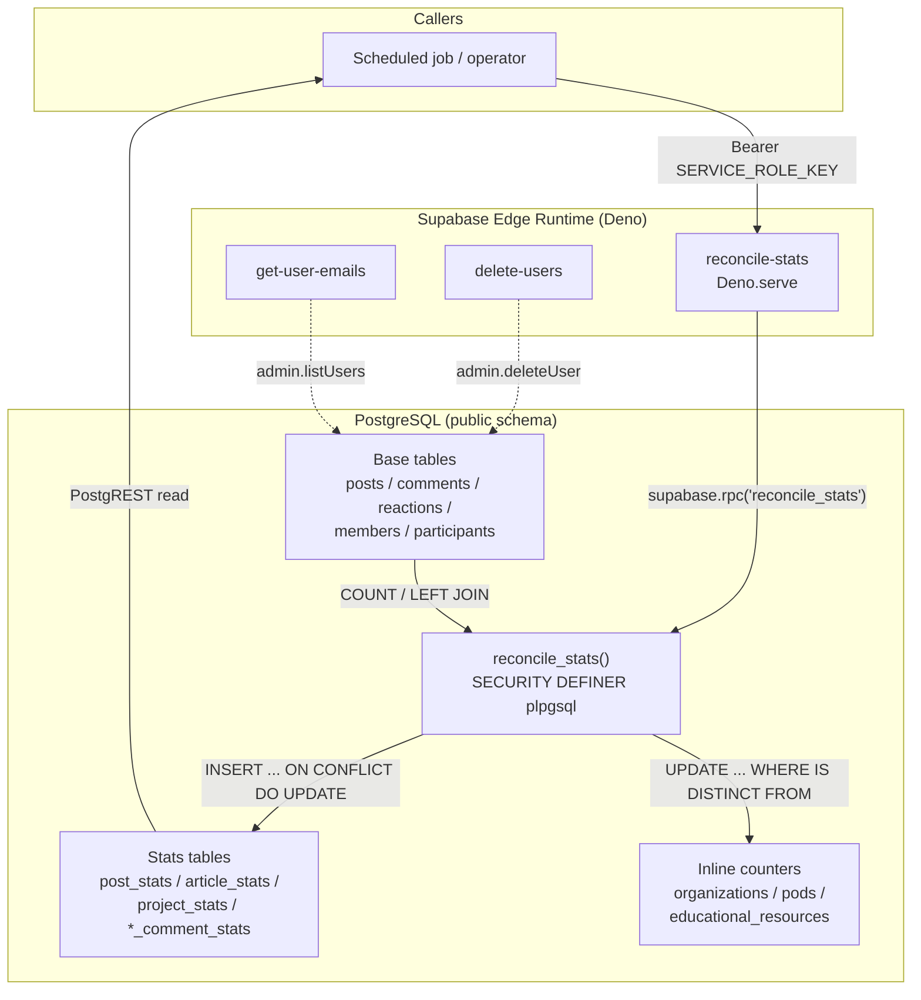
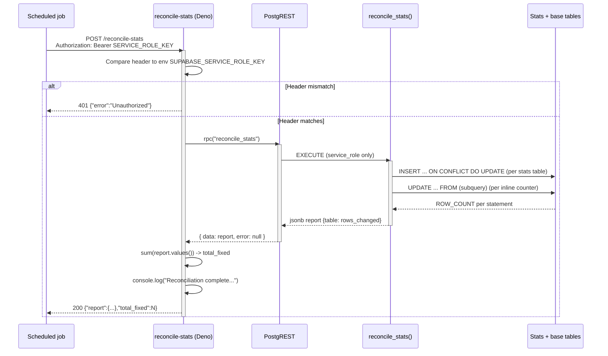
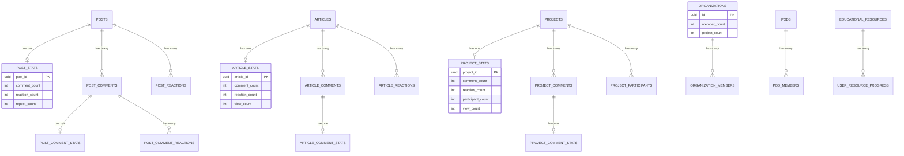

This page documents the serverless edge functions shipped in the `supabase/functions` directory and, in particular, the `reconcile-stats` function together with the `public.reconcile_stats()` database routine that it invokes to repair denormalized statistics counters across the Ozeaon v2 schema.

## Purpose and Scope

This page covers the **serverless compute layer** of the Ozeaon v2 backend and the **statistics reconciliation mechanism** that keeps denormalized counter columns consistent with their source-of-truth tables.

Specifically, it documents:

- The three Deno edge functions under `supabase/functions/`: `reconcile-stats`, `delete-users`, and `get-user-emails`
- The `reconcile_stats()` PL/pgSQL routine, its per-table reconciliation queries, and its authorization model
- The authentication/authorization contract used to protect privileged edge functions
- The denormalized statistics tables (`post_stats`, `article_stats`, `project_stats`, `*_comment_stats`) and inline counters (`organizations.member_count`, `pods.member_count`, `educational_resources.completion_count`) that the routine repairs
- The `view_count` relocation migration that defines why certain counters are deliberately *excluded* from reconciliation

The underlying relational schema, RLS policies, and application-side data access are documented on sibling pages: **for the full table/RLS model see the Data Model pages**, and **for how the frontend reads and writes these counters at runtime see the data-access/query pages**. This page stays focused on the edge-function boundary and the reconciliation routine itself.

## Overview

Ozeaon v2 runs on Supabase. Two categories of privileged operations cannot safely run inside the browser client:

1. **Administrative identity operations** — bulk user deletion and email lookup require the `service_role` key and must never be exposed to anon/authenticated users.
2. **Derived-data repair** — counters such as `comment_count`, `reaction_count`, `repost_count`, `participant_count`, and `member_count` are written incrementally by application triggers as users interact with the site. Incremental updates can drift (a failed transaction, a bulk import, a manual delete, a race between two writes). A periodic full recomputation from the base tables is needed to bring the aggregates back into agreement.

The edge functions in this repository are thin, single-purpose HTTP wrappers. They contain almost no business logic: their job is to authenticate the caller, call into the database (`supabase.rpc(...)` or the admin auth API), and return a JSON report. The real work lives in the SQL routine, which is why the routine is `SECURITY DEFINER` and granted only to `service_role`.

The `reconcile-stats` function is the canonical example: it performs three operations, in order — verify the bearer token equals the `SUPABASE_SERVICE_ROLE_KEY`, invoke the `reconcile_stats` RPC, and sum up the returned per-table fix counts into a single `total_fixed` figure for observability.

## Architecture

The diagram below shows the real components involved. The edge runtime hosts the Deno functions; the functions are the only thing allowed to hold the `service_role` credential; the SQL routine is the only thing allowed to mutate the denormalized counters; and the counters are read by the application through the same PostgREST API that serves the rest of the schema.



**Why this shape.** The edge runtime is the only place where a long-lived privileged secret can live without being shipped to browsers. The SQL routine is `SECURITY DEFINER` so that the edge function's `service_role` connection can run it while `PUBLIC` is revoked — the routine can then touch tables that ordinary callers cannot. Aggregation is done in SQL rather than in Deno so that the comparison and the update happen in one statement per table, giving a single consistent snapshot and avoiding pulling entire tables over the wire.

## Edge Function Inventory

All three functions follow the same skeleton: import the Deno/`esm.sh` runtime types, construct a Supabase client from environment variables, register a handler with `Deno.serve`, and return JSON responses. There is no shared module between them — each function is self-contained and deployed independently.

| Function | Directory | Purpose | Privileged API used |
|----------|-----------|---------|---------------------|
| `reconcile-stats` | `supabase/functions/reconcile-stats/index.ts` | Repair denormalized counters by invoking the `reconcile_stats` RPC | `rpc("reconcile_stats")` |
| `delete-users` | `supabase/functions/delete-users/index.ts` | Administrative bulk deletion of users | Supabase admin auth API |
| `get-user-emails` | `supabase/functions/get-user-emails/index.ts` | Administrative lookup of user email addresses | Supabase admin auth API |

Each function is addressed by its directory name, so `supabase/functions/reconcile-stats/index.ts` is served at the `/reconcile-stats` path of the project's functions endpoint. The local development configuration exposes the `public` and `graphql_public` schemas through the API on port `54321` and caps responses at `max_rows = 1000`, which is relevant when the stats tables are read back for reporting.

> Source: [config.toml](https://github.com/ozeaon/ozeaon-v2/blob/0a4f1a95824db87782f1221a4108019d174df3d9/supabase/config.toml#L7-L18)

## The reconcile-stats Edge Function

The function is deliberately minimal. Its entire behavior is: authenticate, call one RPC, aggregate the result, log it, return it.

```typescript
// @ts-nocheck
import "jsr:@supabase/functions-js/edge-runtime.d.ts";
import { createClient } from "https://esm.sh/@supabase/supabase-js";

const supabase = createClient(
  Deno.env.get("SUPABASE_URL"),
  Deno.env.get("SUPABASE_SERVICE_ROLE_KEY"),
);

console.info("reconcile-stats function started");

Deno.serve(async (req) => {
  const authHeader = req.headers.get("Authorization");
  if (authHeader !== `Bearer ${Deno.env.get("SUPABASE_SERVICE_ROLE_KEY")}`) {
    return new Response(JSON.stringify({ error: "Unauthorized" }), {
      status: 401,
      headers: { "Content-Type": "application/json" },
    });
  }

  try {
    const { data, error } = await supabase.rpc("reconcile_stats");

    if (error) throw error;

    const totalFixed = Object.values(data as Record<string, number>).reduce(
      (a, b) => a + b,
      0,
    );
    console.log(
      `Reconciliation complete. Total rows fixed: ${totalFixed}`,
      data,
    );

    return new Response(
      JSON.stringify({ report: data, total_fixed: totalFixed }),
      {
        headers: { "Content-Type": "application/json" },
        status: 200,
      },
    );
  } catch (err) {
    console.error("reconcile-stats error:", err);
    return new Response(JSON.stringify({ error: err.message }), {
      status: 500,
      headers: { "Content-Type": "application/json" },
    });
  }
});
```

> Source: [index.ts](https://github.com/ozeaon/ozeaon-v2/blob/0a4f1a95824db87782f1221a4108019d174df3d9/supabase/functions/reconcile-stats/index.ts#L1-L49)

### Design decisions worth highlighting

- **Direct string comparison for authentication.** The function compares the incoming `Authorization` header against `Bearer ${SUPABASE_SERVICE_ROLE_KEY}` using strict equality. This is intentionally the strongest possible gate: only a caller who already possesses the service-role secret can invoke it. The consequence is that the function is *not* usable by end users, and it cannot be used with a user JWT. A scheduled job or a server-side operator with the secret is the only viable caller.
- **Client construction at module scope.** The Supabase client is created once when the isolate boots rather than per request, so repeated invocations reuse the same connection pool inside the isolate. The service-role key is read from the environment at module load, not from the request.
- **`// @ts-nocheck`.** The file opts out of TypeScript checking because `err` in the `catch` block is typed as `unknown` and is used as `err.message`; disabling checking keeps the Deno function deployable without a shared type package.
- **`total_fixed` aggregation.** The routine returns a JSON object mapping table name to row count. The function sums the values so that a single scalar (`total_fixed`) can drive alerting: a non-zero value means drift was found and repaired, and a value of zero is a healthy no-op run.

### Request / response contract

| Aspect | Value |
|--------|-------|
| Method | Any (handler does not branch on `req.method`) |
| Required header | `Authorization: Bearer <SUPABASE_SERVICE_ROLE_KEY>` |
| Success status | `200` |
| Success body | `{ "report": { <table>: <count>, ... }, "total_fixed": <number> }` |
| Unauthorized status | `401` with `{ "error": "Unauthorized" }` |
| Failure status | `500` with `{ "error": <message> }` |
| Logging | `console.info` on boot, `console.log` on success, `console.error` on failure |

## The reconcile_stats() SQL Routine

The routine is the substantive half of the mechanism. It is defined as `SECURITY DEFINER` so it executes with the privileges of its owner rather than the caller, and it is locked down so that only `service_role` may execute it.

```sql
CREATE OR REPLACE FUNCTION public.reconcile_stats()
RETURNS jsonb
LANGUAGE plpgsql
SECURITY DEFINER
AS $$
DECLARE
  v_report jsonb := '{}';
  v_count  int;
BEGIN
  -- post_stats: comment_count, reaction_count, repost_count
  INSERT INTO public.post_stats (post_id, comment_count, reaction_count, repost_count)
  SELECT
    p.id,
    COUNT(DISTINCT pc.id)::int,
    COUNT(DISTINCT pr.id)::int,
    COUNT(DISTINCT rp.id)::int
  FROM public.posts p
  LEFT JOIN public.post_comments pc ON pc.post_id = p.id
  LEFT JOIN public.post_reactions pr ON pr.post_id = p.id
  LEFT JOIN public.posts rp ON rp.post_tag = p.id
  GROUP BY p.id
  ON CONFLICT (post_id) DO UPDATE SET
    comment_count  = EXCLUDED.comment_count,
    reaction_count = EXCLUDED.reaction_count,
    repost_count   = EXCLUDED.repost_count
  WHERE
    post_stats.comment_count  IS DISTINCT FROM EXCLUDED.comment_count  OR
    post_stats.reaction_count IS DISTINCT FROM EXCLUDED.reaction_count OR
    post_stats.repost_count   IS DISTINCT FROM EXCLUDED.repost_count;
  GET DIAGNOSTICS v_count = ROW_COUNT;
  v_report := v_report || jsonb_build_object('post_stats', v_count);

  -- ... (see source for article, project, comment and inline-counter blocks)

  RETURN v_report;
END;
$$;

REVOKE ALL ON FUNCTION public.reconcile_stats() FROM PUBLIC;
GRANT EXECUTE ON FUNCTION public.reconcile_stats() TO service_role;
```

> Source: [20260313000000_reconcile_stats_function.sql](https://github.com/ozeaon/ozeaon-v2/blob/0a4f1a95824db87782f1221a4108019d174df3d9/supabase/migrations/20260313000000_reconcile_stats_function.sql#L1-L39)

### The recompute-and-conditionally-write pattern

Every block in the routine uses the same four-part idiom, and understanding it once explains all of them:

1. **Recompute from base tables.** An `INSERT ... SELECT ... FROM <base> LEFT JOIN <children>` recomputes the aggregate from scratch. `LEFT JOIN` (rather than `INNER JOIN`) guarantees that rows with zero children still appear with a count of `0`, so a counter that drifted *upward* is correctly pulled back down — not just a counter that drifted downward.
2. **`COUNT(DISTINCT ...)::int`.** `DISTINCT` is essential because the query mixes several `LEFT JOIN`ed child tables in one `GROUP BY`. Without it, the cartesian product between comments and reactions would multiply the counts. This is why `post_stats` uses `DISTINCT` on comments, reactions, and reposts even though each is a straightforward count in isolation.
3. **`ON CONFLICT ... DO UPDATE ... WHERE ... IS DISTINCT FROM ...`.** The conflict target is the primary key (e.g. `post_stats.post_id`). The `WHERE` clause on the `DO UPDATE` is the key optimisation: if all recomputed values already match the stored values, the update is skipped entirely. `IS DISTINCT FROM` is used rather than `<>` because it is null-safe — it never silently skips an update because one side is `NULL`.
4. **`GET DIAGNOSTICS v_count = ROW_COUNT`.** After each statement, the number of rows actually inserted or updated is captured. Because of the `WHERE` guard, this count represents *rows that genuinely changed*, not rows that were visited. That is what makes `total_fixed` a meaningful drift metric instead of a table-size metric.

The routine accumulates these counts into `v_report` with `v_report := v_report || jsonb_build_object('<key>', v_count)` and returns the accumulated object.

### Reconciliation targets

The routine repairs six denormalized stats positions. Each has a distinct source-of-truth relationship:

| Report key | Target | Columns recomputed | Source of truth |
|------------|--------|--------------------|-----------------|
| `post_stats` | `public.post_stats` | `comment_count`, `reaction_count`, `repost_count` | `post_comments`, `post_reactions`, and `posts.post_tag` self-reference (reposts) |
| `post_comment_stats` | `public.post_comment_stats` | `reaction_count` | `post_comment_reactions` |
| `article_stats` | `public.article_stats` | `comment_count`, `reaction_count` | `article_comments`, `article_reactions` |
| `article_comment_stats` | `public.article_comment_stats` | `reaction_count` | `article_comment_reactions` |
| `project_stats` | `public.project_stats` | `comment_count`, `reaction_count`, `participant_count` | `project_comments`, `project_reactions`, `project_participants` |
| `project_comment_stats` | `public.project_comment_stats` | `reaction_count` | `project_comment_reactions` |
| `organizations` | `public.organizations` | `member_count`, `project_count` | `organization_members`, `projects.organization_id` |
| `pods` | `public.pods` | `member_count` | `pod_members` |
| `educational_resources` | `public.educational_resources` | `completion_count` | `user_resource_progress` filtered by `completed = true` |

> Source: [20260313000000_reconcile_stats_function.sql](https://github.com/ozeaon/ozeaon-v2/blob/0a4f1a95824db87782f1221a4108019d174df3d9/supabase/migrations/20260313000000_reconcile_stats_function.sql#L10-L175)

Note the asymmetry between the two families:

- **Dedicated stats tables** (`*_stats`) are repaired with `INSERT ... ON CONFLICT`, because a row may be missing entirely (a newly created post that has never had a counter written). The `INSERT` half of the statement is what creates the missing row.
- **Inline counters** (`organizations.member_count`, `pods.member_count`, `educational_resources.completion_count`) are repaired with a plain `UPDATE ... FROM (subquery)`, because these columns live on the entity row itself, which always exists. The pattern is a derived table joined back on the primary key.

The inline-counter shape is visible here for `educational_resources`, including the explicit rationale for what is *not* covered:

```sql
  -- educational_resources: inline completion_count
  -- view_count excluded — not trigger-managed, no source of truth to compare against
  UPDATE public.educational_resources er
  SET completion_count = sub.completion_count
  FROM (
    SELECT
      er2.id,
      COUNT(urp.id)::int AS completion_count
    FROM public.educational_resources er2
    LEFT JOIN public.user_resource_progress urp
      ON urp.resource_id = er2.id AND urp.completed = true
    GROUP BY er2.id
  ) sub
  WHERE er.id = sub.id
    AND er.completion_count IS DISTINCT FROM sub.completion_count;
  GET DIAGNOSTICS v_count = ROW_COUNT;
  v_report := v_report || jsonb_build_object('educational_resources', v_count);
```

> Source: [20260313000000_reconcile_stats_function.sql](https://github.com/ozeaon/ozeaon-v2/blob/0a4f1a95824db87782f1221a4108019d174df3d9/supabase/migrations/20260313000000_reconcile_stats_function.sql#L159-L175)

The `urp.completed = true` predicate is part of the `LEFT JOIN` condition rather than a `WHERE` clause. This is intentional and important: putting it in the `WHERE` would convert the outer join into an inner join and drop resources with no completions from the result set, leaving their `completion_count` stale instead of zeroing it.

### The security model

```sql
REVOKE ALL ON FUNCTION public.reconcile_stats() FROM PUBLIC;
GRANT EXECUTE ON FUNCTION public.reconcile_stats() TO service_role;
```

> Source: [20260313000000_reconcile_stats_function.sql](https://github.com/ozeaon/ozeaon-v2/blob/0a4f1a95824db87782f1221a4108019d174df3d9/supabase/migrations/20260313000000_reconcile_stats_function.sql#L181-L182)

Two properties combine here:

- **`REVOKE ALL ... FROM PUBLIC`** removes the implicit `EXECUTE` privilege that PostgreSQL grants to `PUBLIC` on new functions by default. Without this line, any authenticated or anon role able to reach the `public` schema (which the API exposes) could trigger a full-table reconciliation.
- **`GRANT EXECUTE ... TO service_role`** re-grants the privilege to exactly one role. `service_role` is the role the edge function assumes because it was constructed with `SUPABASE_SERVICE_ROLE_KEY`.

Because the function is `SECURITY DEFINER`, once `service_role` calls it, the body executes with the function owner's rights, which is what permits it to write every stats table regardless of the RLS policies defined for ordinary users. This is the deliberate boundary: the SQL routine is the single choke point through which denormalized counters can be rewritten wholesale, and it is reachable only via the edge function (or a direct service-role connection).

Note also the explicit schema qualification `public.reconcile_stats()`. Because the API's `extra_search_path` includes `public` and `extensions`, qualifying the schema avoids any ambiguity about which function is being resolved.

> Source: [config.toml](https://github.com/ozeaon/ozeaon-v2/blob/0a4f1a95824db87782f1221a4108019d174df3d9/supabase/config.toml#L11-L15)

## Core Flow

The end-to-end flow of a reconciliation run is short by design. The interesting part is not the function, it is the single round trip that carries all the work.



### Why the work is one RPC call

The function could have issued one query per stats table from TypeScript. It does not, for three reasons:

1. **Atomicity of perspective.** Each per-table statement in the routine compares the stored counter against a freshly computed aggregate in the same statement. Doing this from the client would require two round trips per table and introduce a window between the read and the write.
2. **Volume.** A recompute reads every row of the base tables. Pulling that to the edge runtime would be wasteful and would run into the `max_rows = 1000` API cap that applies to table reads.
3. **Privilege minimization.** Only the `service_role` key needs to reach the edge runtime; the routine itself is the only thing that needs write access to the stats tables.

### Failure semantics

The routine is a single PL/pgSQL function body, and the entire function executes inside an implicit transaction. If any statement raises — a constraint violation, a permission error, a syntax problem introduced by a migration — the whole function rolls back. The edge function's `catch` block then converts the thrown error into a `500` with the Postgres error message in the `error` field. There is no partial-completion state: either every table's counters are corrected, or none are.

On the edge side, any thrown value or non-null `error` from `supabase.rpc` follows the same path: `throw error` → `catch (err)` → `console.error("reconcile-stats error:", err)` → `500`. Because the function uses `err.message` directly, a non-`Error` throw would surface as `undefined` in the response body — a reason the file carries `// @ts-nocheck` rather than a strict catch-type narrowing.

## Data Model: The Stats Surface

The counters the routine maintains fall into two storage strategies, which is the single most important structural fact about this subsystem. The choice of strategy determines which reconciliation statement shape applies.



**Strategy 1 — dedicated `*_stats` tables.** Posts, articles, projects and their comments store their counters in a separate table keyed by the parent id (`post_id`, `article_id`, `project_id`, `comment_id`). This keeps the hot parent row narrow and isolates counter writes from content reads. The cost is that the counter row may not exist yet, which is why the routine must `INSERT`.

**Strategy 2 — inline counter columns.** Organizations, pods and educational resources carry their counters directly on the entity row (`member_count`, `project_count`, `completion_count`). These rows always exist, so the routine only ever needs `UPDATE`.

The application-side type definitions reflect this split directly — `ArticleStats` is modelled as the stats table row minus its foreign key, and it is nullable on the article type precisely because the row can be absent:

```typescript
type ArticleStats = Omit<Tables<"article_stats">, "article_id">;
```

> Source: [articles.ts](https://github.com/ozeaon/ozeaon-v2/blob/0a4f1a95824db87782f1221a4108019d174df3d9/src/types/articles.ts#L104-L123)

This nullability is the strongest argument for the `INSERT ... ON CONFLICT` half of the routine: the reconciliation is also what backfills stats rows that application code never created.

### Why `view_count` is deliberately excluded

A separate migration relocated the `view_count` column *out of* the content tables and *into* the stats tables:

```sql
BEGIN;

ALTER TABLE public.article_stats  ADD COLUMN view_count integer NOT NULL DEFAULT 0;
ALTER TABLE public.project_stats  ADD COLUMN view_count integer NOT NULL DEFAULT 0;

UPDATE public.article_stats s
SET view_count = a.view_count
FROM public.articles a
WHERE a.id = s.article_id;

UPDATE public.project_stats s
SET view_count = p.view_count
FROM public.projects p
WHERE p.id = s.project_id;

ALTER TABLE public.articles DROP COLUMN view_count;
ALTER TABLE public.projects DROP COLUMN view_count;

COMMIT;
```

> Source: [20260323000000_move_view_count.sql](https://github.com/ozeaon/ozeaon-v2/blob/0a4f1a95824db87782f1221a4108019d174df3d9/supabase/migrations/20260323000000_move_view_count.sql#L1-L19)

The migration is wrapped in an explicit transaction and copies values before dropping the source columns, so it is a data-preserving relocation rather than a schema change that discards counters.

The consequence for reconciliation is stated verbatim in the routine's own comment: `view_count excluded — not trigger-managed, no source of truth to compare against`. A view count is incremented by application writes with no dedicated child table recording individual views, so there is no table to `COUNT`. Reconciling it would require inventing an event log. The routine therefore compares only columns that are *derivable* from other rows, which is the defining property of everything it touches. `completion_count` qualifies because `user_resource_progress` rows exist; `view_count` does not.

Interestingly, `view_count` *did* get a stats-table home through this migration, which is what makes the `*_stats` tables a superset — they hold both derivable counters (reconciled) and non-derivable ones (not reconciled). A developer extending the routine must check whether a candidate column actually has a source of truth before adding it.

## Usage Examples

### Example 1 — Triggering a reconciliation run

The only supported invocation carries the service-role secret. The function does not inspect the HTTP method, so a `POST` (as used by schedulers) and a `GET` behave identically.

```bash
curl -i -X POST \
  "$SUPABASE_URL/functions/v1/reconcile-stats" \
  -H "Authorization: Bearer $SUPABASE_SERVICE_ROLE_KEY"
```

The shape of the success body is dictated by the aggregation in the function:

```json
{
  "report": {
    "post_stats": 3,
    "post_comment_stats": 0,
    "article_stats": 1,
    "article_comment_stats": 0,
    "project_stats": 2,
    "project_comment_stats": 0,
    "organizations": 0,
    "pods": 1,
    "educational_resources": 0
  },
  "total_fixed": 7
}
```

Every key in `report` is emitted by exactly one `v_report := v_report || jsonb_build_object('<key>', v_count)` line, and `total_fixed` is the sum of all of them. A run in which every key is `0` is the healthy steady state: it proves the trigger-maintained counters and the recomputed aggregates agree everywhere.

### Example 2 — Invoking the routine directly as service_role

Operators debugging drift can call the routine without the edge function, provided they connect as `service_role`. This is the same call the edge function makes, and it is the fastest way to see per-table diff counts:

```sql
SELECT public.reconcile_stats();
```

This returns the same `jsonb` report object. Because the grant is explicitly to `service_role` and revoked from `PUBLIC`, this statement will fail with a permission error for any other role — a useful way to confirm the security model is intact after a database restore.

### Example 3 — The reconciliation idiom as a template

When adding a new derivable counter to the system, the existing blocks are the template to copy. This is the complete `article_stats` block, which reconciles two counters from two child tables through one `GROUP BY`:

```sql
  -- article_stats: comment_count, reaction_count
  INSERT INTO public.article_stats (article_id, comment_count, reaction_count)
  SELECT
    a.id,
    COUNT(DISTINCT ac.id)::int,
    COUNT(DISTINCT ar.id)::int
  FROM public.articles a
  LEFT JOIN public.article_comments ac ON ac.article_id = a.id
  LEFT JOIN public.article_reactions ar ON ar.article_id = a.id
  GROUP BY a.id
  ON CONFLICT (article_id) DO UPDATE SET
    comment_count  = EXCLUDED.comment_count,
    reaction_count = EXCLUDED.reaction_count
  WHERE
    article_stats.comment_count  IS DISTINCT FROM EXCLUDED.comment_count  OR
    article_stats.reaction_count IS DISTINCT FROM EXCLUDED.reaction_count;
  GET DIAGNOSTICS v_count = ROW_COUNT;
  v_report := v_report || jsonb_build_object('article_stats', v_count);
```

> Source: [20260313000000_reconcile_stats_function.sql](https://github.com/ozeaon/ozeaon-v2/blob/0a4f1a95824db87782f1221a4108019d174df3d9/supabase/migrations/20260313000000_reconcile_stats_function.sql#L48-L65)

The two things a new block must not omit are the `DISTINCT` inside `COUNT` (required the moment a second `LEFT JOIN` is added to the same statement) and the `IS DISTINCT FROM` guard in the `WHERE` (required so that unchanged rows are not rewritten and so that `ROW_COUNT` stays meaningful).

### Example 4 — Reconciling a single comment-reaction counter

The single-column variant appears four times, once for each comment type. It reconciles against exactly one child table and needs no `DISTINCT`, making it the simplest possible instance of the pattern:

```sql
  -- post_comment_stats: reaction_count
  INSERT INTO public.post_comment_stats (comment_id, reaction_count)
  SELECT
    pc.id,
    COUNT(pcr.id)::int
  FROM public.post_comments pc
  LEFT JOIN public.post_comment_reactions pcr ON pcr.comment_id = pc.id
  GROUP BY pc.id
  ON CONFLICT (comment_id) DO UPDATE SET
    reaction_count = EXCLUDED.reaction_count
  WHERE
    post_comment_stats.reaction_count IS DISTINCT FROM EXCLUDED.reaction_count;
  GET DIAGNOSTICS v_count = ROW_COUNT;
  v_report := v_report || jsonb_build_object('post_comment_stats', v_count);
```

> Source: [20260313000000_reconcile_stats_function.sql](https://github.com/ozeaon/ozeaon-v2/blob/0a4f1a95824db87782f1221a4108019d174df3d9/supabase/migrations/20260313000000_reconcile_stats_function.sql#L33-L46)

### Example 5 — The inline-counter UPDATE variant

For counters stored on the entity row, `INSERT ... ON CONFLICT` is impossible because the row already exists. The pattern becomes a derived-table `UPDATE ... FROM`:

```sql
  -- pods: inline member_count
  UPDATE public.pods p
  SET member_count = sub.member_count
  FROM (
    SELECT
      p2.id,
      COUNT(pm.id)::int AS member_count
    FROM public.pods p2
    LEFT JOIN public.pod_members pm ON pm.pod_id = p2.id
    GROUP BY p2.id
  ) sub
  WHERE p.id = sub.id
    AND p.member_count IS DISTINCT FROM sub.member_count;
  GET DIAGNOSTICS v_count = ROW_COUNT;
  v_report := v_report || jsonb_build_object('pods', v_count);
```

> Source: [20260313000000_reconcile_stats_function.sql](https://github.com/ozeaon/ozeaon-v2/blob/0a4f1a95824db87782f1221a4108019d174df3d9/supabase/migrations/20260313000000_reconcile_stats_function.sql#L143-L157)

## Configuration Options

The edge functions are configured entirely through environment variables and repository-level Supabase configuration. There is no per-function config file.

### Environment variables consumed by the edge functions

| Variable | Consumed by | Purpose | Default |
|----------|-------------|---------|---------|
| `SUPABASE_URL` | `reconcile-stats` (and all functions) | Base URL used to construct the Supabase client | Injected by the Supabase platform |
| `SUPABASE_SERVICE_ROLE_KEY` | `reconcile-stats` (and all functions) | Both the client credential **and** the expected bearer token for inbound requests | Injected by the Supabase platform |

Both values are read with `Deno.env.get(...)` at module load. If either is absent, `createClient` receives `undefined` and the function will fail at request time rather than at boot.

> Source: [index.ts](https://github.com/ozeaon/ozeaon-v2/blob/0a4f1a95824db87782f1221a4108019d174df3d9/supabase/functions/reconcile-stats/index.ts#L5-L8)

### Repository-level settings that affect these functions

| Setting | Value | Relevance |
|---------|-------|-----------|
| `project_id` | `ozeaon-v2` | Identifies the Supabase project these functions deploy to |
| `api.enabled` | `true` | Exposes the HTTP API (functions are served alongside it) |
| `api.port` | `54321` | Local API/function endpoint port |
| `api.schemas` | `["public", "graphql_public"]` | The `public` schema is reachable, which is why the routine must revoke `PUBLIC` execute |
| `api.extra_search_path` | `["public", "extensions"]` | Explains the explicit `public.` qualification on the function and tables |
| `api.max_rows` | `1000` | Caps table reads; a reason not to pull base tables into the edge runtime |
| `db.major_version` | `17` | Postgres version the routine's PL/pgSQL must target |
| `db.migrations.enabled` | `true` | Migrations (including the one defining the routine) apply on push/reset |
| `db.seed.enabled` | `true` | Seeds run after migrations on reset |
| `db.seed.sql_paths` | `["./seeds/10-preview-fixture.sql"]` | Only the synthetic preview fixture is loaded; the real dump is gitignored |

> Source: [config.toml](https://github.com/ozeaon/ozeaon-v2/blob/0a4f1a95824db87782f1221a4108019d174df3d9/supabase/config.toml#L5-L73)

The seed comments are operationally significant for this subsystem: the real data dump (`seed.sql`) is gitignored, so preview branches load a synthetic fixture and `00-truncate.sql` is deliberately excluded because it would delete the reference data that migrations create. This means a preview environment's counters are only as meaningful as the fixture that populates them — a reconciliation run on a preview branch reports drift relative to synthetic data.

## API Reference

### `reconcile_stats()`

Full-table reconciliation of every denormalized statistic in the Ozeaon v2 schema.

**Signature**

```sql
public.reconcile_stats() RETURNS jsonb
```

**Attributes**

| Attribute | Value |
|-----------|-------|
| Language | `plpgsql` |
| Volatility | Default (`VOLATILE`) — required, the function writes |
| `SECURITY DEFINER` | Yes — executes with the owner's privileges |
| `REVOKE` / `GRANT` | `REVOKE ALL FROM PUBLIC`; `GRANT EXECUTE TO service_role` |

**Parameters:** None.

**Returns:** A `jsonb` object with one key per reconciliation target. Each value is an `integer` equal to the number of rows actually inserted or updated for that target. Keys observed in the implementation:

`post_stats`, `post_comment_stats`, `article_stats`, `article_comment_stats`, `project_stats`, `project_comment_stats`, `organizations`, `pods`, `educational_resources`.

**Side effects:** Within a single implicit transaction, inserts missing `*_stats` rows, updates drifted `*_stats` rows, and updates `organizations.member_count` / `organizations.project_count`, `pods.member_count`, and `educational_resources.completion_count`.

**Throws:** Any Postgres error raised by the underlying statements (constraint violation, permission denied, type error). Because the whole body is one transaction, any error rolls back all changes.

> Source: [20260313000000_reconcile_stats_function.sql](https://github.com/ozeaon/ozeaon-v2/blob/0a4f1a95824db87782f1221a4108019d174df3d9/supabase/migrations/20260313000000_reconcile_stats_function.sql#L1-L9)

### Edge Function Endpoint: `reconcile-stats`

**Handler:** `Deno.serve(async (req) => Response)`

**Request**

| Element | Required | Value |
|---------|----------|-------|
| `Authorization` header | Yes | `Bearer ${SUPABASE_SERVICE_ROLE_KEY}` — compared with strict `!==` |
| Body | No | Not read by the handler |
| Method | Not inspected | Any method is accepted |

**Responses**

| Status | Body | Condition |
|--------|------|-----------|
| `200` | `{ "report": {<key>: <int>, ...}, "total_fixed": <int> }` | Routine returned without error |
| `401` | `{ "error": "Unauthorized" }` | `Authorization` header did not exactly equal the service-role bearer token |
| `500` | `{ "error": "<message>" }` | `supabase.rpc` returned an error, or the call threw |

All responses set `Content-Type: application/json`.

**Logging**

| Level | Message |
|-------|---------|
| `console.info` | `reconcile-stats function started` — emitted at module load, once per isolate |
| `console.log` | `Reconciliation complete. Total rows fixed: ${totalFixed}` followed by the report object |
| `console.error` | `reconcile-stats error:` followed by the thrown value |

> Source: [index.ts](https://github.com/ozeaon/ozeaon-v2/blob/0a4f1a95824db87782f1221a4108019d174df3d9/supabase/functions/reconcile-stats/index.ts#L10-L48)

## Failure Modes, Edge Cases & Concurrency

### Failure modes

| Failure | Where it manifests | Behavior | Recovery |
|---------|--------------------|----------|----------|
| Missing/wrong `Authorization` header | Edge function, before any DB work | `401 {"error":"Unauthorized"}`; the RPC is never called | Supply the correct `SUPABASE_SERVICE_ROLE_KEY` |
| `SUPABASE_URL` or `SUPABASE_SERVICE_ROLE_KEY` unset in the runtime | `createClient` at module scope | Client is built with `undefined`; requests fail at call time | Verify function secrets are provisioned for the project |
| Routine permission error | Postgres, at `EXECUTE` | Routine is not runnable by the calling role; surfaces as a `500` | Confirm `GRANT EXECUTE ... TO service_role` survived any restore/recreate of the function |
| Postgres error inside the routine | Any statement in the body | Entire routine rolls back; no partial correction is possible | Fix the underlying constraint/schema issue and re-run |
| Non-`Error` throw reaching `catch (err)` | Edge function | `err.message` is `undefined`, so the `500` body carries an undefined `error` | Inspect `console.error` output rather than the response body |

The last row is a genuine edge case created by the `// @ts-nocheck` + `err.message` combination and is worth knowing when debugging an empty error string.

### Concurrency

The design has two concurrency-relevant properties:

1. **Whole-routine transactionality.** All reconciliation statements execute in one transaction. Two concurrent runs cannot interleave at statement granularity — the second run blocks or sees the first run's committed result, depending on isolation level. Even so, running two instances concurrently is pointless work; a scheduler should serialize runs.
2. **Read-vs-write races with live traffic.** The routine computes aggregates and updates counters from the same snapshot within each statement. If a user posts a comment between the `post_stats` statement and the `post_comment_stats` statement, the parent counter may briefly reflect a state that a later statement's snapshot no longer matches. This is acceptable because the routine is a *convergence* mechanism, not a consistent snapshot: the next run repairs any residue, and the trigger path continues to apply increments in the meantime. The `IS DISTINCT FROM` guard ensures the routine only writes genuine differences, so a convergence run against a healthy database is a pure read and takes no write locks on the stats tables.

### Idempotence

The routine is idempotent by construction. Running it twice in a row produces: first run reports the drift counts, second run reports all zeros (assuming no intervening writes). This is the direct consequence of the `WHERE ... IS DISTINCT FROM ...` guard on every `DO UPDATE` and every inline `UPDATE`. It means the function is safe to invoke defensively — for example, after a data import — without needing to know whether drift exists.

## Performance & Operational Considerations

### Cost profile

Each reconciliation block performs a full aggregation over its base tables. The routine is therefore **O(total rows across the content and interaction tables)** per invocation, and the base tables it scans (`posts`, `post_comments`, `post_reactions`, `articles`, `article_comments`, `article_reactions`, `projects`, `project_comments`, `project_reactions`, `project_participants`, `organizations`, `organization_members`, `pods`, `pod_members`, `educational_resources`, `user_resource_progress`) are exactly the tables that grow without bound in a social platform.

Practical implications:

- **Schedule it, do not front it.** This is a batch/repair job. It should run on a cron or manual operator trigger, not on a user request path.
- **The `ROW_COUNT` metric is a cheap health signal.** Because unchanged rows are filtered out by `IS DISTINCT FROM`, `total_fixed` does not scale with database size. It scales with *drift*. A monitoring rule of `total_fixed > 0` is therefore a high-signal alert that triggers are failing somewhere, and it will not fire merely because the platform grew.
- **The `LEFT JOIN` + `DISTINCT` combination is defensive rather than optimal.** `COUNT(DISTINCT ...)` forces a sort/hash of the joined rows rather than a plain count. This is the correct trade-off here: the alternative (a correlated subquery per counter) would scan the child tables once per parent row and is strictly worse at scale.

### Operational characteristics

- **Timeouts.** A full scan of large tables is bounded by the edge function's execution timeout. If the routine exceeds it, the client receives a gateway timeout rather than the structured `500` from the `catch` block, because the connection is severed before the handler can respond. Long-running reconciliations on very large datasets should be run by calling the routine directly over a direct Postgres connection instead of through the edge function.
- **Statelessness.** The edge function holds no state between invocations apart from the module-scope client. Everything needed for a run is derived from the database, so a run can be retried freely after a failure.
- **No request payload.** The handler never reads `req.body`, so there is no request-shape validation to get wrong and no way to request a partial reconciliation. Granularity is all-or-nothing by design.
- **Observability is log-only.** The function emits exactly three log lines and no metrics beyond the `total_fixed` scalar. Consumers of this subsystem must scrape `console.log` output (or capture the HTTP response body) to build a drift history.

## Extension Points

The extension surface is the SQL routine, not the edge function. The edge function is generic — it forwards whatever `reconcile_stats` returns and sums it — so **adding a new reconcilable counter requires no TypeScript change at all**. The report automatically gains the new key and `total_fixed` automatically includes it.

To add a counter, mirror the established idiom:

1. **Pick the right statement shape.** Dedicated stats table → `INSERT ... ON CONFLICT (pk) DO UPDATE SET ... WHERE ... IS DISTINCT FROM ...`. Inline column on an existing entity row → `UPDATE ... FROM (SELECT ... GROUP BY ...) sub WHERE ... AND ... IS DISTINCT FROM ...`.
2. **Verify a source of truth exists.** The `view_count` exclusion is the precedent: if no table records the individual events, the counter cannot be reconciled and must not be added.
3. **Use `LEFT JOIN`, never `INNER JOIN`.** The recompute must be able to pull a counter *down* to zero for entities that lost all their children.
4. **Add `DISTINCT` to `COUNT` as soon as a second `LEFT JOIN` joins the same statement.**
5. **Guard with `IS DISTINCT FROM`, not `<>`,** so nulls never cause a skipped update.
6. **Capture and report the count:** `GET DIAGNOSTICS v_count = ROW_COUNT;` followed by `v_report := v_report || jsonb_build_object('<key>', v_count);`. Skipping this makes the new counter invisible to monitoring even though it is reconciled.
7. **Deliver it as a new migration.** The routine is created with `CREATE OR REPLACE FUNCTION` inside a dated migration file, so the correct change is a new migration that replaces the function body — not an edit to the historical file, which has already been applied to environments.

The compile-time contract between the edge function and the routine is intentionally loose: the function treats the RPC result as `Record<string, number>` and reduces its values, so a routine that returns a non-numeric key would corrupt `total_fixed` rather than fail loudly. Any new key must therefore be an integer row count.

> Source: [index.ts](https://github.com/ozeaon/ozeaon-v2/blob/0a4f1a95824db87782f1221a4108019d174df3d9/supabase/functions/reconcile-stats/index.ts#L22-L29)

## Implementation Constraints & Gotchas

- **Every `*_stats` row is created by this routine if it is missing.** Nothing else guarantees the row exists, which is why client code must treat stats as nullable (see `ArticleStats` usage in `src/types/articles.ts`). A consumer that assumes `stats` is present will break for any entity that has never been reconciled.
- **The `posts.post_tag` self-join is the repost mechanism.** `repost_count` counts rows in `posts` whose `post_tag` points at another post, not a separate reposts table. Renaming or repurposing `post_tag` would silently corrupt `repost_count`.
- **`COUNT(...)::int` casts are explicit everywhere.** The routine deliberately narrows the bigint returned by `COUNT` to `int` so the values match the `integer` column types. `total_fixed` then reduces `number` values on the Deno side without any bigint handling.
- **Two `ALTER TABLE ... DROP COLUMN` in the view-count migration are a hard boundary.** If any code still referenced `articles.view_count` or `projects.view_count` after that migration, it broke at that commit. Read paths must go through `article_stats.view_count` / `project_stats.view_count`.
- **`view_count` columns are `NOT NULL DEFAULT 0`.** The migration backfills them from the dropped columns and then enforces non-null, so a stats row can always be read without null checks for views.

## Related Links

### Edge function sources
- [`supabase/functions/reconcile-stats/index.ts`](https://github.com/ozeaon/ozeaon-v2/blob/0a4f1a95824db87782f1221a4108019d174df3d9/supabase/functions/reconcile-stats/index.ts) — the reconciliation HTTP wrapper and its auth gate
- [`supabase/functions/delete-users/index.ts`](https://github.com/ozeaon/ozeaon-v2/blob/0a4f1a95824db87782f1221a4108019d174df3d9/supabase/functions/delete-users/index.ts) — administrative user deletion
- [`supabase/functions/get-user-emails/index.ts`](https://github.com/ozeaon/ozeaon-v2/blob/0a4f1a95824db87782f1221a4108019d174df3d9/supabase/functions/get-user-emails/index.ts) — administrative email lookup

### Migrations defining the mechanism
- [`20260313000000_reconcile_stats_function.sql`](https://github.com/ozeaon/ozeaon-v2/blob/0a4f1a95824db87782f1221a4108019d174df3d9/supabase/migrations/20260313000000_reconcile_stats_function.sql) — defines `public.reconcile_stats()` and its grants
- [`20260323000000_move_view_count.sql`](https://github.com/ozeaon/ozeaon-v2/blob/0a4f1a95824db87782f1221a4108019d174df3d9/supabase/migrations/20260323000000_move_view_count.sql) — relocates `view_count` into the stats tables

### Configuration
- [`supabase/config.toml`](https://github.com/ozeaon/ozeaon-v2/blob/0a4f1a95824db87782f1221a4108019d174df3d9/supabase/config.toml) — API schemas, search path, `max_rows`, seed strategy

### Types reflecting the stats surface
- [`src/types/articles.ts`](https://github.com/ozeaon/ozeaon-v2/blob/0a4f1a95824db87782f1221a4108019d174df3d9/src/types/articles.ts) — `ArticleStats` and its nullable placement on `Article`
- [`src/types/projects.ts`](https://github.com/ozeaon/ozeaon-v2/blob/0a4f1a95824db87782f1221a4108019d174df3d9/src/types/projects.ts) — `ProjectStats`
- [`src/types/supabase.ts`](https://github.com/ozeaon/ozeaon-v2/blob/0a4f1a95824db87782f1221a4108019d174df3d9/src/types/supabase.ts) — generated row/relationship types for `article_stats`, `article_comment_stats`, and the rest of the schema
- [`src/types/comments.ts`](https://github.com/ozeaon/ozeaon-v2/blob/0a4f1a95824db87782f1221a4108019d174df3d9/src/types/comments.ts) — comment stats type used by the reading hooks

### Sibling catalog topics
- **Data Model** — full relational schema, foreign keys, and RLS policies for the tables reconciled here
- **Data Access / Hooks** — the application-side reads and incremental writes that produce the drift this page repairs
