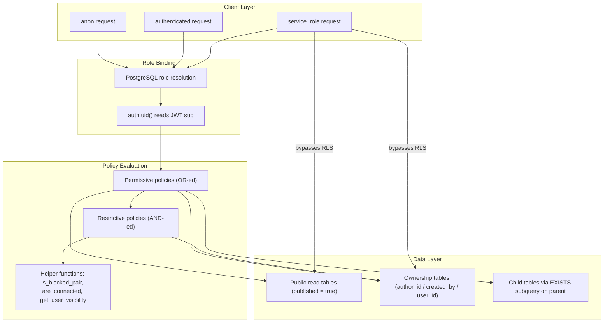
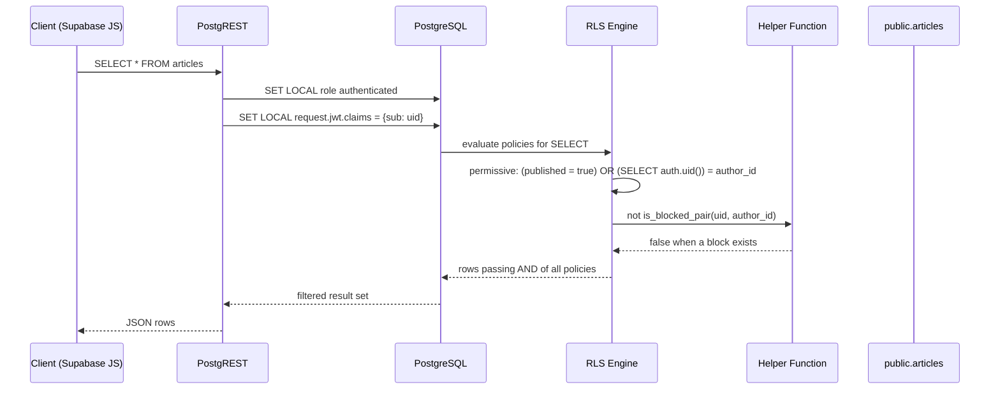
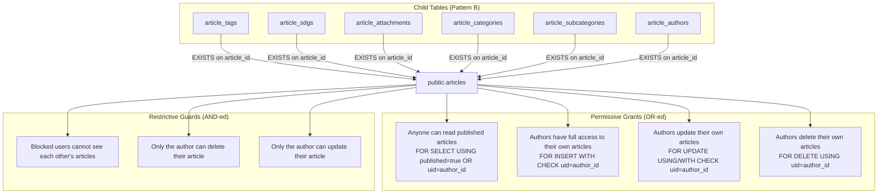
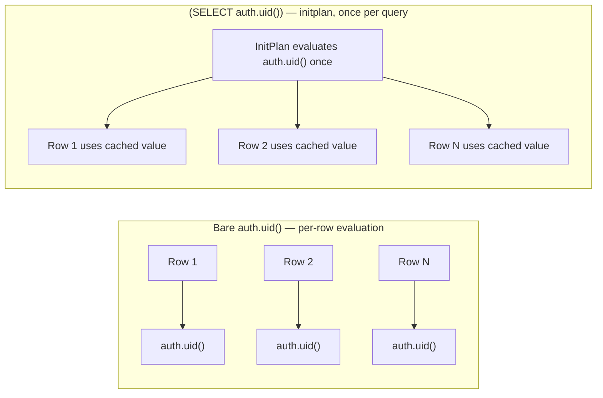
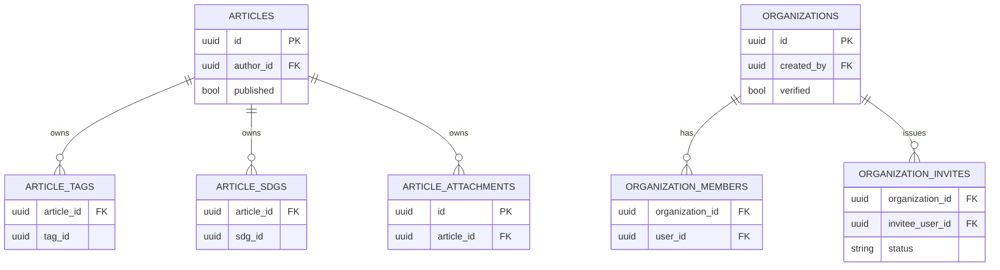

Row Level Security (RLS) is the database-enforced authorization layer of Ozeaon V2. Instead of relying solely on application code, PostgreSQL policies attached to every table decide which rows `anon`, `authenticated`, and service roles may read or mutate.

## Purpose and Scope

This page documents the Row Level Security subsystem of the Ozeaon V2 Supabase/PostgreSQL backend:

- How RLS is enabled and policed across the `public` schema.
- The permission model (permissive vs. restrictive policies) and the role matrix (`public`/`anon`, `authenticated`, service role).
- The recurring ownership patterns (author-scoped, organisation-scoped, pod-scoped, self-scoped) expressed as `USING` / `WITH CHECK` clauses.
- The shared helper functions embedded in `USING` clauses (`is_blocked_pair`, and related visibility helpers).
- The performance hardening work (`(SELECT auth.uid())` initplan optimization, one-policy-per-role/action consolidation).
- Migration history: the V2 RLS baseline, the performance fix, and the consolidation pass.

**Out of scope.** The physical table/composite definitions and column types are covered by the schema/data-model pages. Frontend data-access code (Next.js server components / Supabase client queries) is covered by the application pages. This page focuses strictly on the SQL-level policy layer and why it is shaped the way it is.

> Note: file-level links below use the reference base URL supplied at runtime; when the base URL is empty the links resolve relative to the repository root.

## Overview

Ozeaon V2 is a Next.js 16 application backed by Supabase, described in the project README as:

```markdown
- **Backend**: Supabase (PostgreSQL + Row Level Security + Real-time subscriptions)
```

> Source: [README.md](https://github.com/ozeaon/ozeaon-v2/blob/0a4f1a95824db87782f1221a4108019d174df3d9/README.md#L165)

The RLS layer is delivered entirely through versioned SQL migrations under `supabase/migrations/`. Three migrations form the spine of the subsystem:

| Migration | Role in the subsystem |
|---|---|
| `20260311112434_ozeaondb_v2_rls.sql` | V2 baseline: enables RLS on unprotected tables, rewrites the articles domain, renames legacy snake_case policies to descriptive free text, drops superseded V1 policies. |
| `20260420000002_fix_rls_performance.sql` | Performance hardening: `(SELECT auth.uid())` initplan wrapping and one-policy-per-(role, action) consolidation. |
| `20260815090000_consolidate_article_rls_policies.sql` | Further article-domain consolidation and documentation of `NULL` semantics in restrictive policies. |

### Key concepts

- **Permissive policy (`AS PERMISSIVE`, the default):** multiple permissive policies for the same action are OR-ed together — a row is visible if *any* permissive policy allows it.
- **Restrictive policy (`AS RESTRICTIVE`):** AND-ed with the permissive result — every restrictive policy must pass. Used exclusively for the "blocked users" social graph guard, which must subtract rows regardless of how many permissive grants exist.
- **`USING` vs `WITH CHECK`:** `USING` filters which existing rows are visible/mutable (SELECT/UPDATE/DELETE read side); `WITH CHECK` validates the *new* row content on INSERT/UPDATE. A `FOR ALL` policy needs both to fully express ownership.
- **Roles:** `public` (includes anonymous/`anon`) for world-readable published content, `authenticated` for owner-scoped writes, and the service role which bypasses RLS.

## Architecture

The diagram below shows how a client query is filtered: the request identity flows through permissive grants, then through restrictive guards, then to the table.



Each layer exists for a specific reason: `auth.uid()` binds the SQL evaluation to the JWT identity; permissive policies express *grants* (who may see what); restrictive policies express *subtractions* (social-graph blocks) that must hold no matter how many grants exist; and `EXISTS` subqueries propagate ownership from a parent (article, project, organisation, pod) down to child tables.

## Permission Model

### The three-role matrix

Every policy in the codebase is written against one of three role targets. The convention is remarkably consistent:

| Role target | Intent | Typical actions | Example |
|---|---|---|---|
| `TO public` | World-readable reference or published content, no login required | `FOR SELECT` only | `"Anyone can read published articles"` |
| `TO authenticated` | Owner-scoped reads and all writes | `SELECT`/`INSERT`/`UPDATE`/`DELETE` | `"Authors have full access to their own articles"` |
| service role (no policy) | Administrative writes to lookup tables; bypasses RLS entirely | all | Lookup tables have SELECT-only policies |

The design intent behind the lookup-table pattern is stated explicitly in the baseline migration:

```sql
-- =============================================================================
-- STEP 3: LOOKUP / REFERENCE TABLES
-- Public read only. Writes managed by service role only.
-- =============================================================================

ALTER TABLE public.course_types           ENABLE ROW LEVEL SECURITY;
ALTER TABLE public.difficulty_levels      ENABLE ROW LEVEL SECURITY;
ALTER TABLE public.member_roles           ENABLE ROW LEVEL SECURITY;
ALTER TABLE public.notification_types     ENABLE ROW LEVEL SECURITY;
ALTER TABLE public.organization_types     ENABLE ROW LEVEL SECURITY;
ALTER TABLE public.pod_types              ENABLE ROW LEVEL SECURITY;
ALTER TABLE public.project_section_types  ENABLE ROW LEVEL SECURITY;
ALTER TABLE public.proposal_types         ENABLE ROW LEVEL SECURITY;
ALTER TABLE public.reaction_types         ENABLE ROW LEVEL SECURITY;
ALTER TABLE public.resource_types         ENABLE ROW LEVEL SECURITY;
ALTER TABLE public.transaction_types      ENABLE ROW LEVEL SECURITY;

CREATE POLICY "Anyone can read course types"           ON public.course_types           AS PERMISSIVE FOR SELECT TO public USING (true);
CREATE POLICY "Anyone can read difficulty levels"      ON public.difficulty_levels      AS PERMISSIVE FOR SELECT TO public USING (true);
CREATE POLICY "Anyone can read member roles"           ON public.member_roles           AS PERMISSIVE FOR SELECT TO public USING (true);
CREATE POLICY "Anyone can read notification types"     ON public.notification_types     AS PERMISSIVE FOR SELECT TO public USING (true);
CREATE POLICY "Anyone can read organisation types"     ON public.organization_types     AS PERMISSIVE FOR SELECT TO public USING (true);
CREATE POLICY "Anyone can read pod types"              ON public.pod_types              AS PERMISSIVE FOR SELECT TO public USING (true);
CREATE POLICY "Anyone can read project section types"  ON public.project_section_types  AS PERMISSIVE FOR SELECT TO public USING (true);
CREATE POLICY "Anyone can read proposal types"         ON public.proposal_types         AS PERMISSIVE FOR SELECT TO public USING (true);
CREATE POLICY "Anyone can read reaction types"         ON public.reaction_types         AS PERMISSIVE FOR SELECT TO public USING (true);
CREATE POLICY "Anyone can read resource types"         ON public.resource_types         AS PERMISSIVE FOR SELECT TO public USING (true);
CREATE POLICY "Anyone can read transaction types"      ON public.transaction_types      AS PERMISSIVE FOR SELECT TO public USING (true);
```

> Source: [20260311112434_ozeaondb_v2_rls.sql](https://github.com/ozeaon/ozeaon-v2/blob/0a4f1a95824db87782f1221a4108019d174df3d9/supabase/migrations/20260311112434_ozeaondb_v2_rls.sql#L211-L238)

The design intent: reference tables (currencies, SDGs, project types, difficulty levels) must be readable by everyone so the UI can render dropdowns, but are curated data that only backend/service operations should alter. Enabling RLS **and** creating only a permissive SELECT policy means the absence of any write policy is itself the write-denial — a "default deny" stance that requires no explicit `FOR INSERT ... USING (false)` boilerplate.

### Policy naming as documentation

The baseline migration deliberately converts terse (and legacy-snake_case) policy names into full English sentences. This is treated as a first-class refactor, not cosmetics:

```sql
ALTER POLICY "blocks_hide_articles"
  ON public.articles RENAME TO "Blocked users cannot see each other's articles";

ALTER POLICY "blocks_hide_posts"
  ON public.posts RENAME TO "Blocked users cannot see each other's posts";

ALTER POLICY "blocks_hide_follows"
  ON public.user_follows RENAME TO "Blocked users cannot see each other's follows";

ALTER POLICY "posts_visibility_policy"
  ON public.posts RENAME TO "Authors and connections see posts based on visibility settings";
```

> Source: [20260311112434_ozeaondb_v2_rls.sql](https://github.com/ozeaon/ozeaon-v2/blob/0a4f1a95824db87782f1221a4108019d174df3d9/supabase/migrations/20260311112434_ozeaondb_v2_rls.sql#L27-L37)

Because PostgreSQL policy names appear verbatim in `pg_policies` and in Supabase dashboard error output, self-describing names turn privilege-debugging into reading a sentence. Legacy V1 policies are also explicitly dropped where they conflict, showing the migration behaves as a true reconciliation rather than an append:

```sql
-- user_profiles: V1 duplicate INSERT, SELECT, and UPDATE policies
DROP POLICY IF EXISTS "Enable insert for authenticated users" ON public.user_profiles;
DROP POLICY IF EXISTS "Public profiles are viewable by everyone" ON public.user_profiles;
DROP POLICY IF EXISTS "Users can view own profile" ON public.user_profiles;
DROP POLICY IF EXISTS "Users can update their own profile" ON public.user_profiles;
```

> Source: [20260311112434_ozeaondb_v2_rls.sql](https://github.com/ozeaon/ozeaon-v2/blob/0a4f1a95824db87782f1221a4108019d174df3d9/supabase/migrations/20260311112434_ozeaondb_v2_rls.sql#L137-L141)

## Ownership Patterns

Four recurring predicate shapes cover essentially every table. Recognizing them makes the entire policy set legible.

### Pattern A — Direct self/owner column (single row)

The simplest and cheapest form: compare `auth.uid()` against a column on the row itself.

```sql
CREATE POLICY "Users manage their own resource progress"
ON public.user_resource_progress AS PERMISSIVE FOR ALL
TO authenticated
USING ((SELECT auth.uid()) = user_id)
WITH CHECK ((SELECT auth.uid()) = user_id);
```

> Source: [20260311112434_ozeaondb_v2_rls.sql](https://github.com/ozeaon/ozeaon-v2/blob/0a4f1a95824db87782f1221a4108019d174df3d9/supabase/migrations/20260311112434_ozeaondb_v2_rls.sql#L658-L662)

Notes on intent: a single `FOR ALL` policy with both `USING` and `WITH CHECK` set to the same predicate grants read and write over exactly the caller's rows and refuses to let a caller insert a row stamped with someone else's `user_id`.

### Pattern B — Parent-ownership via `EXISTS` (child tables)

Child tables (tags, SDGs, attachments, categories) have no owner column of their own; ownership derives from the parent. The policy resolves the parent through `EXISTS`:

```sql
CREATE POLICY "Author has full access to their article tags"
ON public.article_tags AS PERMISSIVE FOR ALL
TO authenticated
USING (
  EXISTS (
    SELECT 1 FROM public.articles
    WHERE articles.id = article_tags.article_id
    AND articles.author_id = (SELECT auth.uid())
  )
)
WITH CHECK (
  EXISTS (
    SELECT 1 FROM public.articles
    WHERE articles.id = article_tags.article_id
    AND articles.author_id = (SELECT auth.uid())
  )
);

CREATE POLICY "Anyone can read tags of published articles"
ON public.article_tags AS PERMISSIVE FOR SELECT
TO public
USING (
  EXISTS (
    SELECT 1 FROM public.articles
    WHERE articles.id = article_tags.article_id
    AND articles.published = true
  )
);
```

> Source: [20260311112434_ozeaondb_v2_rls.sql](https://github.com/ozeaon/ozeaon-v2/blob/0a4f1a95824db87782f1221a4108019d174df3d9/supabase/migrations/20260311112434_ozeaondb_v2_rls.sql#L182-L209)

This pattern is what makes the permission model *hierarchical*: publishing an article implicitly publishes its tags/SDGs/attachments/categories, and no separate denormalized `author_id` column has to be maintained on children (which would risk drift).

### Pattern C — Multi-hop join (`EXISTS` with a `JOIN`)

Grandchild tables require traversing two levels. `project_update_images` belongs to a `project_update`, which belongs to a `project`:

```sql
CREATE POLICY "Project owner manages project update images"
ON public.project_update_images AS PERMISSIVE FOR ALL
TO authenticated
USING (
  EXISTS (
    SELECT 1 FROM public.projects p
    JOIN public.project_updates pu ON pu.project_id = p.id
    WHERE pu.id = project_update_images.project_update_id
    AND p.created_by = (SELECT auth.uid())
  )
)
WITH CHECK (
  EXISTS (
    SELECT 1 FROM public.projects p
    JOIN public.project_updates pu ON pu.project_id = p.id
    WHERE pu.id = project_update_images.project_update_id
    AND p.created_by = (SELECT auth.uid())
  )
);

CREATE POLICY "Anyone can view update images of published projects"
ON public.project_update_images AS PERMISSIVE FOR SELECT
TO public
USING (
  EXISTS (
    SELECT 1 FROM public.projects p
    JOIN public.project_updates pu ON pu.project_id = p.id
    WHERE pu.id = project_update_images.project_update_id
    AND p.published = true
  )
);
```

> Source: [20260311112434_ozeaondb_v2_rls.sql](https://github.com/ozeaon/ozeaon-v2/blob/0a4f1a95824db87782f1221a4108019d174df3d9/supabase/migrations/20260311112434_ozeaondb_v2_rls.sql#L608-L638)

The alias `p`/`pu` and the join order are deliberate: the traversal always terminates at the top-level entity that carries `created_by` or `author_id`, so ownership is defined in exactly one place per domain.

### Pattern D — Dual-branch visibility (owner OR published)

The consolidation migration compresses the common "public can read published, owner can always read" pair into a **single** SELECT policy using an `OR`:

```sql
CREATE POLICY "Anyone can read published articles" ON public.articles FOR SELECT
  USING (((published = true) OR ((SELECT auth.uid()) = author_id)));
CREATE POLICY "Authors have full access to their own articles" ON public.articles FOR INSERT TO authenticated
  WITH CHECK (((SELECT auth.uid()) = author_id));
CREATE POLICY "Authors update their own articles" ON public.articles FOR UPDATE TO authenticated
  USING (((SELECT auth.uid()) = author_id)) WITH CHECK (((SELECT auth.uid()) = author_id));
CREATE POLICY "Authors delete their own articles" ON public.articles FOR DELETE TO authenticated
  USING (((SELECT auth.uid()) = author_id));
```

> Source: [20260420000002_fix_rls_performance.sql](https://github.com/ozeaon/ozeaon-v2/blob/0a4f1a95824db87782f1221a4108019d174df3d9/supabase/migrations/20260420000002_fix_rls_performance.sql#L104-L111)

The rationale for merging into one SELECT policy is stated in the migration header: the previous split (`"Anyone can read published articles"` for `TO public` plus a `FOR ALL` owner policy) produced two permissive SELECT policies, so PostgreSQL had to evaluate both for every row. Folding the owner branch into the public SELECT removes that duplication.

## Data Flow: A Read Request Under RLS



The critical ordering detail: restrictive policies are applied as an additional AND against the union of permissive results. If the helper returns `NULL` (e.g. because `auth.uid()` is `NULL` for an anonymous caller), a restrictive policy evaluating to `NULL` causes the row to be rejected — which is exactly the intended fail-closed behavior.

## Restrictive Policies and the Social Graph Guard

Blocking is the one authorization concern that cannot be expressed as a permissive grant, because it must *subtract* rows even when another policy grants broad access. Ozeaon therefore uses `AS RESTRICTIVE` policies keyed on a shared helper, `is_blocked_pair`:

```sql
CREATE POLICY "Blocked users cannot see each other's post comments"
ON public.post_comments AS RESTRICTIVE FOR SELECT
TO authenticated
USING (NOT is_blocked_pair(auth.uid(), author_id));

-- article_comments
CREATE POLICY "Anyone can read article comments"
ON public.article_comments AS PERMISSIVE FOR SELECT
TO public USING (true);

CREATE POLICY "Blocked users cannot see each other's article comments"
ON public.article_comments AS RESTRICTIVE FOR SELECT
TO authenticated
USING (NOT is_blocked_pair(auth.uid(), author_id));
```

> Source: [20260311112434_ozeaondb_v2_rls.sql](https://github.com/ozeaon/ozeaon-v2/blob/0a4f1a95824db87782f1221a4108019d174df3d9/supabase/migrations/20260311112434_ozeaondb_v2_rls.sql#L711-L740)

This is the pattern that justifies the restrictive mechanism: `"Anyone can read article comments"` grants everyone permission with `USING (true)`, and no permissive policy can ever revoke that. Only an AND-ed restrictive policy can.

The same guard is applied uniformly to every social surface — comments, reactions, and the combined SELECT branch of merged policies:

```sql
-- article_attachments
-- Merge SELECT: "Anyone can read attachments of published articles" + "Author manages their article attachments" (ALL)
DROP POLICY IF EXISTS "Anyone can read attachments of published articles" ON public.article_attachments;
DROP POLICY IF EXISTS "Author manages their article attachments" ON public.article_attachments;
CREATE POLICY "Anyone can read attachments of published articles" ON public.article_attachments FOR SELECT
  USING ((EXISTS ( SELECT 1 FROM public.articles WHERE ((articles.id = article_attachments.article_id) AND ((articles.published = true) OR (articles.author_id = (SELECT auth.uid())))))));
```

> Source: [20260420000002_fix_rls_performance.sql](https://github.com/ozeaon/ozeaon-v2/blob/0a4f1a95824db87782f1221a4108019d174df3d9/supabase/migrations/20260420000002_fix_rls_performance.sql#L10-L15)

Restrictive policies covering the merged SELECT case, grouped by table:

| Table | Restrictive policy | Predicate |
|---|---|---|
| `article_comments` | Blocked users cannot see each other's article comments | `NOT public.is_blocked_pair((SELECT auth.uid()), author_id)` |
| `article_reactions` | Blocked users cannot see each other's article reactions | `NOT public.is_blocked_pair((SELECT auth.uid()), user_id)` |
| `post_comments` | Blocked users cannot see each other's post comments | `NOT is_blocked_pair(auth.uid(), author_id)` |
| `project_comments` | Blocked users cannot see each other's project comments | `NOT is_blocked_pair(auth.uid(), author_id)` |
| `post_reactions` / `article_reactions` / `project_reactions` | Blocked users cannot see each other's reactions | `NOT is_blocked_pair(auth.uid(), user_id)` |

Note the column name difference: content tables (comments) key on `author_id`, reaction tables key on `user_id`.

### `NULL` semantics in restrictive predicates

The consolidation migration documents a subtle correctness property — restrictive guards must fail *closed* on unknown identity, and `is_blocked_pair` is designed with that in mind:

```sql
--     `NOT private.is_blocked_pair(uid, author_id)` is not: is_blocked_pair returns NULL for
--     a NULL argument, NOT NULL is NULL, and a RESTRICTIVE policy that evaluates to NULL
```

> Source: [20260815090000_consolidate_article_rls_policies.sql](https://github.com/ozeaon/ozeaon-v2/blob/0a4f1a95824db87782f1221a4108019d174df3d9/supabase/migrations/20260815090000_consolidate_article_rls_policies.sql#L91-L92)

In PostgreSQL, a `USING` predicate of `NULL` is treated as `false`, so a restrictive policy that returns `NULL` rejects the row. That means an anonymous caller or a caller whose `uid` is `NULL` cannot spectate on blocked relationships — a fail-closed default that requires no explicit `uid IS NOT NULL` guard.

## Helper Functions Embedded in Policies

RLS predicates call SQL functions that are evaluated *inside* the policy context. Their execute grants are therefore part of the security surface:

```sql
-- NOT touched: is_blocked_pair, are_connected, get_user_visibility
--   — called directly in RLS USING clauses; PUBLIC EXECUTE grant must remain.
```

> Source: [20260505130000_fix_public_execute_grants.sql](https://github.com/ozeaon/ozeaon-v2/blob/0a4f1a95824db87782f1221a4108019d174df3d9/supabase/migrations/20260505130000_fix_public_execute_grants.sql#L11-L13)

```sql
-- NOTE: is_blocked_pair, are_connected, get_user_visibility retain PUBLIC EXECUTE.
-- They are called directly inside RLS USING clauses that evaluate under anon/authenticated.
```

> Source: [20260505130000_fix_public_execute_grants.sql](https://github.com/ozeaon/ozeaon-v2/blob/0a4f1a95824db87782f1221a4108019d174df3d9/supabase/migrations/20260505130000_fix_public_execute_grants.sql#L77-L78)

| Function | Used in | Purpose |
|---|---|---|
| `is_blocked_pair(uid_a, uid_b)` | Restrictive `SELECT` policies on comments/reactions, plus block-hiding policies | Returns truthy when a block relationship exists between two users; `NULL` for `NULL` args. |
| `are_connected(uid_a, uid_b)` | Visibility policies for posts/follows | Determines whether two users are connected, used by connection-scoped visibility. |
| `get_user_visibility(...)` | `posts` visibility policy | Resolves a user's sharing/visibility setting. |

**Security insight:** a hardening migration deliberately revoked `PUBLIC EXECUTE` from many functions but carved out an explicit exemption set for these three. Revoking execute from an RLS helper would break the policy evaluation itself for `anon`/`authenticated` roles, so the exemption is a *functional requirement*, not a lapse. Conversely, these functions must be written defensively (no side effects, no data leakage via return value) because any caller can invoke them directly.

## Articles Domain: End-to-End Policy Set

The articles domain is the most-refactored, most-documented part of the RLS layer and serves as the reference model for every other domain. Its final consolidated state:



Each child table follows the identical four-to-five policy shape: one merged SELECT (published OR owner), plus explicit INSERT / UPDATE / DELETE owner policies. For example `article_sdgs`:

```sql
-- article_sdgs
DROP POLICY IF EXISTS "Anyone can read SDGs of published articles" ON public.article_sdgs;
DROP POLICY IF EXISTS "Author has full access to their article SDGs" ON public.article_sdgs;
CREATE POLICY "Anyone can read SDGs of published articles" ON public.article_sdgs FOR SELECT
  USING ((EXISTS ( SELECT 1 FROM public.articles WHERE ((articles.id = article_sdgs.article_id) AND ((articles.published = true) OR (articles.author_id = (SELECT auth.uid())))))));
CREATE POLICY "Author has full access to their article SDGs" ON public.article_sdgs FOR INSERT TO authenticated
  WITH CHECK ((EXISTS ( SELECT 1 FROM public.articles WHERE ((articles.id = article_sdgs.article_id) AND (articles.author_id = (SELECT auth.uid()))))));
CREATE POLICY "Author updates their article SDGs" ON public.article_sdgs FOR UPDATE TO authenticated
  USING ((EXISTS ( SELECT 1 FROM public.articles WHERE ((articles.id = article_sdgs.article_id) AND (articles.author_id = (SELECT auth.uid()))))))
  WITH CHECK ((EXISTS ( SELECT 1 FROM public.articles WHERE ((articles.id = article_sdgs.article_id) AND (articles.author_id = (SELECT auth.uid()))))));
CREATE POLICY "Author deletes their article SDGs" ON public.article_sdgs FOR DELETE TO authenticated
  USING ((EXISTS ( SELECT 1 FROM public.articles WHERE ((articles.id = article_sdgs.article_id) AND (articles.author_id = (SELECT auth.uid()))))));
```

> Source: [20260420000002_fix_rls_performance.sql](https://github.com/ozeaon/ozeaon-v2/blob/0a4f1a95824db87782f1221a4108019d174df3d9/supabase/migrations/20260420000002_fix_rls_performance.sql#L58-L69)

**Design intent of the INSERT/UPDATE/DELETE split:** a `FOR ALL` policy contributes to SELECT as well as the write verbs. Splitting it into three explicit write policies removes the redundant SELECT coverage, so exactly one policy answers "can this row be read?" and exactly one answers each write question. The migration states this goal directly:

```sql
-- Fix auth RLS initialization plan warnings and consolidate multiple permissive policies.
-- (SELECT auth.uid()) evaluated once per query instead of per row.
-- Single policy per (role, action) eliminates redundant policy evaluation.
-- ALL policies split into explicit FOR INSERT/UPDATE/DELETE to remove duplicate SELECT coverage.
```

> Source: [20260420000002_fix_rls_performance.sql](https://github.com/ozeaon/ozeaon-v2/blob/0a4f1a95824db87782f1221a4108019d174df3d9/supabase/migrations/20260420000002_fix_rls_performance.sql#L1-L4)

## Organisation and Pod Domains

Organisations and pods introduce a second ownership axis: a *creator* (`created_by`) who administers a container, plus *members* and *invitees* who have narrow self-scoped access. The consolidated organisation policies demonstrate the dual-branch SELECT (owner OR self) idiom:

```sql
-- organization_invites
-- SELECT conflict: "Invitee can view" + "Organisation owner manages invites" (ALL)
-- UPDATE conflict: "Invitee can accept or decline" + "Organisation owner manages invites" (ALL)
DROP POLICY IF EXISTS "Invitee can accept or decline their organisation invite" ON public.organization_invites;
DROP POLICY IF EXISTS "Invitee can view their own organisation invite" ON public.organization_invites;
DROP POLICY IF EXISTS "Organisation owner manages invites" ON public.organization_invites;
CREATE POLICY "Invitee can view their own organisation invite" ON public.organization_invites FOR SELECT TO authenticated
  USING ((((SELECT auth.uid()) = invitee_user_id) OR (EXISTS ( SELECT 1 FROM public.organizations WHERE ((organizations.id = organization_invites.organization_id) AND (organizations.created_by = (SELECT auth.uid())))))));
CREATE POLICY "Invitee can accept or decline their organisation invite" ON public.organization_invites FOR UPDATE TO authenticated
  USING ((((SELECT auth.uid()) = invitee_user_id) OR (EXISTS ( SELECT 1 FROM public.organizations WHERE ((organizations.id = organization_invites.organization_id) AND (organizations.created_by = (SELECT auth.uid())))))));
CREATE POLICY "Organisation owner manages invites" ON public.organization_invites FOR INSERT TO authenticated
  WITH CHECK ((EXISTS ( SELECT 1 FROM public.organizations WHERE ((organizations.id = organization_invites.organization_id) AND (organizations.created_by = (SELECT auth.uid()))))));
CREATE POLICY "Organisation owner deletes invites" ON public.organization_invites FOR DELETE TO authenticated
  USING ((EXISTS ( SELECT 1 FROM public.organizations WHERE ((organizations.id = organization_invites.organization_id) AND (organizations.created_by = (SELECT auth.uid()))))));
```

> Source: [20260420000002_fix_rls_performance.sql](https://github.com/ozeaon/ozeaon-v2/blob/0a4f1a95824db87782f1221a4108019d174df3d9/supabase/migrations/20260420000002_fix_rls_performance.sql#L166-L179)

Design intent per verb:

- **SELECT** — the invitee must see their invitation, and the owner must see all invitations they issued. Two audiences, one policy, one evaluation.
- **UPDATE** — the invitee accepts/declines (changing status on their own row); no `WITH CHECK` is supplied, so any column may be updated on the row they are already permitted to update. The owner branch is included so owners can also manage (this closes the prior UPDATE conflict between two policies).
- **INSERT/DELETE** — strictly owner-only; invitees can never mint or destroy invitations.

The equivalent pod domain mirrors this exactly against `public.pods`:

```sql
CREATE POLICY "Invitee can view their own pod invite" ON public.pod_invites FOR SELECT TO authenticated
  USING ((((SELECT auth.uid()) = invitee_user_id) OR (EXISTS ( SELECT 1 FROM public.pods WHERE ((pods.id = pod_invites.pod_id) AND (pods.created_by = (SELECT auth.uid())))))));
CREATE POLICY "Invitee can accept or decline their pod invite" ON public.pod_invites FOR UPDATE TO authenticated
  USING ((((SELECT auth.uid()) = invitee_user_id) OR (EXISTS ( SELECT 1 FROM public.pods WHERE ((pods.id = pod_invites.pod_id) AND (pods.created_by = (SELECT auth.uid())))))));
CREATE POLICY "Pod owner manages pod invites" ON public.pod_invites FOR INSERT TO authenticated
  WITH CHECK ((EXISTS ( SELECT 1 FROM public.pods WHERE ((pods.id = pod_invites.pod_id) AND (pods.created_by = (SELECT auth.uid()))))));
CREATE POLICY "Pod owner deletes pod invites" ON public.pod_invites FOR DELETE TO authenticated
  USING ((EXISTS ( SELECT 1 FROM public.pods WHERE ((pods.id = pod_invites.pod_id) AND (pods.created_by = (SELECT auth.uid()))))));
```

> Source: [20260420000002_fix_rls_performance.sql](https://github.com/ozeaon/ozeaon-v2/blob/0a4f1a95824db87782f1221a4108019d174df3d9/supabase/migrations/20260420000002_fix_rls_performance.sql#L227-L234)

Note the "leave the container" capability for members, which is modelled as a DELETE branch on the membership row:

```sql
CREATE POLICY "Members can leave an organisation" ON public.organization_members FOR DELETE TO authenticated
  USING ((((SELECT auth.uid()) = user_id) OR (EXISTS ( SELECT 1 FROM public.organizations WHERE ((organizations.id = organization_members.organization_id) AND (organizations.created_by = (SELECT auth.uid())))))));
```

> Source: [20260420000002_fix_rls_performance.sql](https://github.com/ozeaon/ozeaon-v2/blob/0a4f1a95824db87782f1221a4108019d174df3d9/supabase/migrations/20260420000002_fix_rls_performance.sql#L189-L190)

This is a deliberate UX-driven grant: "leave" requires `DELETE` on your own membership row, so the policy must allow `uid = user_id` in addition to the owner branch. The counterpart `"Pod members can leave a pod"` policy exists with the same rationale, as indicated by the consolidation comments:

```sql
-- pod_members
-- SELECT conflict: "Pod members can view their own membership row" + "Pod owner has full access to pod members" (ALL)
-- DELETE conflict: "Pod members can leave a pod" + "Pod owner has full access to pod members" (ALL)
```

> Source: [20260420000002_fix_rls_performance.sql](https://github.com/ozeaon/ozeaon-v2/blob/0a4f1a95824db87782f1221a4108019d174df3d9/supabase/migrations/20260420000002_fix_rls_performance.sql#L236-L238)

## The `(SELECT auth.uid())` Initplan Optimization

The single most repeated performance idiom in the policy layer is wrapping `auth.uid()` in a scalar subquery: `(SELECT auth.uid())` instead of a bare `auth.uid()`.



The migration header spells out both optimizations and why they matter:

```sql
-- Fix auth RLS initialization plan warnings and consolidate multiple permissive policies.
-- (SELECT auth.uid()) evaluated once per query instead of per row.
-- Single policy per (role, action) eliminates redundant policy evaluation.
-- ALL policies split into explicit FOR INSERT/UPDATE/DELETE to remove duplicate SELECT coverage.
```

> Source: [20260420000002_fix_rls_performance.sql](https://github.com/ozeaon/ozeaon-v2/blob/0a4f1a95824db87782f1221a4108019d174df3d9/supabase/migrations/20260420000002_fix_rls_performance.sql#L1-L4)

### Three distinct performance levers

| Lever | Mechanism | Effect |
|---|---|---|
| `(SELECT auth.uid())` | PostgreSQL hoists the uncorrelated scalar subquery into an **InitPlan** evaluated once per query | Turns O(rows) function calls into O(1) |
| Split `FOR ALL` into explicit verbs | Removes the ALL policy's implicit SELECT contribution | One fewer permissive policy to evaluate per SELECT row |
| Single policy per `(role, action)` | Merging owner + public branches with `OR` | Eliminates duplicate evaluation of overlapping permissive policies |

The `articles` consolidation before/after is the clearest illustration: three separate policies (`"Anyone can read published articles"`, `"Authors can delete their own unpublished articles after 7 days"`, `"Authors have full access to their own articles"`) collapse into four verb-specific policies, and the SELECT condition absorbs the owner branch:

```sql
-- articles
-- SELECT conflict: "Anyone can read published articles" + "Authors have full access to their own articles" (ALL)
-- DELETE conflict: "Authors can delete their own unpublished articles after 7 days" + "Authors have full access" (ALL)
-- RESTRICTIVE policies ("Blocked users", "Only the author can delete/update") are untouched
DROP POLICY IF EXISTS "Anyone can read published articles" ON public.articles;
DROP POLICY IF EXISTS "Authors can delete their own unpublished articles after 7 days" ON public.articles;
DROP POLICY IF EXISTS "Authors have full access to their own articles" ON public.articles;
```

> Source: [20260420000002_fix_rls_performance.sql](https://github.com/ozeaon/ozeaon-v2/blob/0a4f1a95824db87782f1221a4108019d174df3d9/supabase/migrations/20260420000002_fix_rls_performance.sql#L97-L103)

A key structural note visible in that comment block: **restrictive policies are deliberately left untouched** by the performance pass. Because restrictive policies are AND-ed and typically few, they do not multiply evaluation cost, and modifying them carries correctness risk (as the `NULL` discussion above shows).

The same treatment is applied to self-scoped tables that only needed the initplan fix, where all four verbs are reissued in one place:

```sql
-- events (initplan only)
DROP POLICY IF EXISTS "Users can create their own events" ON public.events;
DROP POLICY IF EXISTS "Users can delete their own events" ON public.events;
DROP POLICY IF EXISTS "Users can update their own events" ON public.events;
DROP POLICY IF EXISTS "Users can view their own events" ON public.events;
CREATE POLICY "Users can create their own events" ON public.events FOR INSERT
  WITH CHECK (((SELECT auth.uid()) = user_id));
CREATE POLICY "Users can delete their own events" ON public.events FOR DELETE
  USING (((SELECT auth.uid()) = user_id));
CREATE POLICY "Users can update their own events" ON public.events FOR UPDATE
  USING (((SELECT auth.uid()) = user_id)) WITH CHECK (((SELECT auth.uid()) = user_id));
CREATE POLICY "Users can view their own events" ON public.events FOR SELECT
  USING (((SELECT auth.uid()) = user_id));
```

> Source: [20260420000002_fix_rls_performance.sql](https://github.com/ozeaon/ozeaon-v2/blob/0a4f1a95824db87782f1221a4108019d174df3d9/supabase/migrations/20260420000002_fix_rls_performance.sql#L138-L150)

Note that `events` policies carry **no `TO authenticated` clause** — they default to `PUBLIC`. The ownership predicate `(SELECT auth.uid()) = user_id` is `NULL` for anonymous callers, so the policy fails closed naturally. `note_labels` uses the identical shape.

### Index cleanup accompanying the performance pass

The performance migration also drops indexes identified as redundant to the unique constraints they duplicated:

```sql
-- Drop duplicate indexes
DROP INDEX IF EXISTS public.subject_bookmarks_user_subject_unique;
DROP INDEX IF EXISTS public.user_blocks_blocked_id_idx;
```

> Source: [20260420000002_fix_rls_performance.sql](https://github.com/ozeaon/ozeaon-v2/blob/0a4f1a95824db87782f1221a4108019d174df3d9/supabase/migrations/20260420000002_fix_rls_performance.sql#L6-L8)

Because ownership predicates and `EXISTS` subqueries depend on indexes for row filtering, keeping the index set minimal-but-sufficient is part of the same performance concern rather than unrelated housekeeping.

## Migration Strategy and Rollout Safety

The policy layer is expressed as sequential, idempotent-ish migrations. The baseline migration opens with an explicit transaction and a header stating its three jobs:

```sql
-- =============================================================================
-- OZEAON V2 — RLS POLICIES
-- Generated: 2026-03-11
-- Covers all tables missing RLS, fixes articles domain, and renames legacy
-- snake_case policy names to descriptive free text.
-- =============================================================================

BEGIN;
```

> Source: [20260311112434_ozeaondb_v2_rls.sql](https://github.com/ozeaon/ozeaon-v2/blob/0a4f1a95824db87782f1221a4108019d174df3d9/supabase/migrations/20260311112434_ozeaondb_v2_rls.sql#L1-L8)

| Step | Section | What it does |
|---|---|---|
| STEP 1 | Rename legacy policies | `ALTER POLICY ... RENAME TO`, drop superseded V1 policies |
| STEP 2 | Fix articles domain | Replace open SELECT with published-scoped read; add owner write to `article_sdgs`, `article_tags` |
| STEP 3 | Lookup/reference tables | `ENABLE ROW LEVEL SECURITY` + `SELECT TO public USING (true)` |
| STEP 4 | Projects domain | Owner + published policies, multi-hop child tables |
| STEP 5 | Project children | Images, updates, resource categories/subcategories |
| STEP 6 | Education | `educational_resources`, `user_resource_progress`, `user_sdgs` |
| STEP 7 | Social | Comments, reactions, post images, notifications, blocked-user guards |
| STEP 8+ | Remaining domains | Notifications, bookmarks, follows, profiles |

### Enabling RLS is a separate, deliberate act

`CREATE POLICY` on a table without RLS enabled has no effect. The baseline migration therefore pairs every new policy block with an explicit `ALTER TABLE ... ENABLE ROW LEVEL SECURITY`. Two representative examples — one for a table that previously had *no* RLS and one for a table that already did:

```sql
-- article_tags: no policies existed
ALTER TABLE public.article_tags ENABLE ROW LEVEL SECURITY;
```

> Source: [20260311112434_ozeaondb_v2_rls.sql](https://github.com/ozeaon/ozeaon-v2/blob/0a4f1a95824db87782f1221a4108019d174df3d9/supabase/migrations/20260311112434_ozeaondb_v2_rls.sql#L179-L180)

```sql
ALTER TABLE public.educational_resources  ENABLE ROW LEVEL SECURITY;
ALTER TABLE public.user_resource_progress ENABLE ROW LEVEL SECURITY;
ALTER TABLE public.user_sdgs              ENABLE ROW LEVEL SECURITY;
```

> Source: [20260311112434_ozeaondb_v2_rls.sql](https://github.com/ozeaon/ozeaon-v2/blob/0a4f1a95824db87782f1221a4108019d174df3d9/supabase/migrations/20260311112434_ozeaondb_v2_rls.sql#L644-L646)

## Policy Inventory by Domain

A consolidated reference of the ownership predicate used per domain, derived from the migrations read.

| Domain | Parent entity | Owner column | Child tables scoped via `EXISTS` | Public read predicate |
|---|---|---|---|---|
| Articles | `articles` | `author_id` | `article_tags`, `article_sdgs`, `article_categories`, `article_subcategories`, `article_authors`, `article_attachments`, `article_comments`, `article_reactions` | `published = true` |
| Projects | `projects` | `created_by` | `project_sdgs`, `project_tags`, `project_resource_categories`, `project_resource_subcategories`, `project_images`, `project_updates`, `project_update_images`, `project_comments`, `project_reactions` | `published = true` |
| Organisations | `organizations` | `created_by` | `organization_sdgs`, `organization_members`, `organization_invites` | `verified = true` |
| Pods | `pods` | `created_by` | `pod_members`, `pod_invites`, `pod_*` | `published = true` |
| Education | `educational_resources` | `author_id` | `educational_resource_sdgs` | `published = true` |
| Social (posts) | `posts` | `author_id` | `post_comments`, `post_images`, `post_reactions`, `post_comment_reactions` | visibility-setting based |
| User-private | — | `user_id` | `user_resource_progress`, `user_sdgs`, `events`, `note_labels`, `resource_subject_bookmarks` | none (owner only) |
| Lookup/reference | — | — | — | `USING (true)` for all |

Two column-name conventions are worth internalizing: **content authoring** domains use `author_id` + `published` (articles, posts, educational resources), while **container administration** domains use `created_by` + `verified`/`published` (organisations, projects, pods). Membership/invite tables key on `invitee_user_id` / `user_id` for the self branch.



The arrows encode the `EXISTS` traversal direction actually used in the policies: child → parent for ownership resolution, and each relationship terminates at the entity that carries the owner column.

## Failure Modes and Edge Cases

| Scenario | Behavior | Source evidence |
|---|---|---|
| Table has RLS disabled | Policies exist but are inert; queries return all rows | Baseline migration pairs `CREATE POLICY` with explicit `ENABLE ROW LEVEL SECURITY` for exactly this reason |
| Anonymous caller on an owner-only policy | `(SELECT auth.uid())` is `NULL`; `NULL = user_id` is `NULL` → the row is rejected | `events`/`note_labels` policies have no `TO authenticated` and rely on this |
| Anonymous caller on a restrictive guard | `is_blocked_pair(NULL, x)` returns `NULL`; `NOT NULL` is `NULL` → restrictive policy rejects the row (fail-closed) | Consolidation migration commentary at lines 91–92 |
| Revoking `EXECUTE` from an RLS helper | Policy evaluation breaks for `anon`/`authenticated` | `20260505130000_fix_public_execute_grants.sql` explicitly exempts `is_blocked_pair`, `are_connected`, `get_user_visibility` |
| Child row with a dangling/orphan parent FK | `EXISTS` returns false → row invisible to everyone except service role | Implicit in Pattern B/C; dependency on referential integrity |
| `FOR ALL` policy left in place | Implicitly grants SELECT, creating a second permissive SELECT policy per table | The performance migration splits every `FOR ALL` into explicit verbs |
| First row updated by an owner to another owner's id | Blocked by `WITH CHECK` being set equal to `USING` on UPDATE | `"Authors update their own articles"` sets both |
| Member tries to self-delete without a DELETE policy branch | Fails; "leave" requires the `uid = user_id` DELETE branch | `"Members can leave an organisation"` / `"Pod members can leave a pod"` |
| Inserting an invite as a non-owner | Rejected; INSERT policies are owner-only with no self branch | `"Organisation owner manages invites"`, `"Pod owner manages pod invites"` |

## Extension Points

To add a new table to the RLS layer, follow the conventions the migrations establish:

1. `ALTER TABLE public.<table> ENABLE ROW LEVEL SECURITY;` — mandatory; policies are inert otherwise.
2. **Lookup/reference table?** Add one `FOR SELECT TO public USING (true)` policy and nothing else; writes are implicitly service-role only.
3. **Owner-scoped top-level table?** Add a SELECT policy of the form `USING ((published = true) OR ((SELECT auth.uid()) = owner_col))`, then separate `FOR INSERT` / `FOR UPDATE` / `FOR DELETE` policies targeting `TO authenticated` with `WITH CHECK` and `USING` both comparing to `(SELECT auth.uid())`.
4. **Child table?** Reuse the parent-ownership `EXISTS` predicate verbatim (Pattern B), or the join form (Pattern C) for grandchildren. Do not denormalize an owner column.
5. **Socially visible table?** Add an `AS RESTRICTIVE FOR SELECT TO authenticated` policy using `NOT is_blocked_pair((SELECT auth.uid()), <author_id|user_id>)`.
6. **Always wrap identity reads** as `(SELECT auth.uid())`, never bare `auth.uid()`.
7. **Name policies as sentences**, matching the existing style (`"Author updates their article tags"`), so `pg_policies` output is self-documenting.

**If a policy predicate needs a new helper function:** grant it `PUBLIC EXECUTE` only if it must be callable from an RLS `USING` clause evaluated under `anon`/`authenticated`, and make it side-effect-free because direct invocation is possible. Otherwise revoke `PUBLIC EXECUTE`, per the pattern in `20260505130000_fix_public_execute_grants.sql`.

## Operational Notes

- **Debugging policies:** query `pg_policies` and filter by `tablename`; the descriptive policy names make the intent readable without cross-referencing migrations. Also check `pg_class.relrowsecurity` to confirm RLS is actually enabled for a table — a missing `ENABLE ROW LEVEL SECURITY` presents as "policies seem ignored".
- **After adding a policy, always `DROP POLICY IF EXISTS` the predecessor** in the same migration. Every refactor migration in this repository uses that pairing to stay re-runnable.
- **Service-role bypass:** administrative and backend jobs skip RLS entirely. Any authorization enforced solely in the service role is not enforced in the RLS layer — audit both when reasoning about exposure.
- **Per-row cost on large tables:** the `EXISTS` subqueries in Pattern B/C run per candidate row. Ensure the FK columns they filter on (`article_id`, `organization_id`, `pod_id`, `project_update_id`) are indexed; the performance migration's index cleanup shows index hygiene is treated as part of the RLS performance story.
- **Restrictive policies are expensive to reason about, cheap to evaluate:** they are few, AND-ed, and must remain `NULL`-safe. Prefer adding a permissive grant over adding a restrictive guard unless you specifically need to subtract rows.

## Related Links

- Baseline policy migration: [20260311112434_ozeaondb_v2_rls.sql](https://github.com/ozeaon/ozeaon-v2/blob/0a4f1a95824db87782f1221a4108019d174df3d9/supabase/migrations/20260311112434_ozeaondb_v2_rls.sql)
- Performance hardening: [20260420000002_fix_rls_performance.sql](https://github.com/ozeaon/ozeaon-v2/blob/0a4f1a95824db87782f1221a4108019d174df3d9/supabase/migrations/20260420000002_fix_rls_performance.sql)
- Article policy consolidation: [20260815090000_consolidate_article_rls_policies.sql](https://github.com/ozeaon/ozeaon-v2/blob/0a4f1a95824db87782f1221a4108019d174df3d9/supabase/migrations/20260815090000_consolidate_article_rls_policies.sql)
- Helper function grants: [20260505130000_fix_public_execute_grants.sql](https://github.com/ozeaon/ozeaon-v2/blob/0a4f1a95824db87782f1221a4108019d174df3d9/supabase/migrations/20260505130000_fix_public_execute_grants.sql)
- Organisation membership triggers: [20260520000000_organization_add_member_triggers.sql](https://github.com/ozeaon/ozeaon-v2/blob/0a4f1a95824db87782f1221a4108019d174df3d9/supabase/migrations/20260520000000_organization_add_member_triggers.sql)
- Project ownership immutability trigger: [20260812000000_project_ownership.sql](https://github.com/ozeaon/ozeaon-v2/blob/0a4f1a95824db87782f1221a4108019d174df3d9/supabase/migrations/20260812000000_project_ownership.sql)
- Aggregated statistics function: [20260313000000_reconcile_stats_function.sql](https://github.com/ozeaon/ozeaon-v2/blob/0a4f1a95824db87782f1221a4108019d174df3d9/supabase/migrations/20260313000000_reconcile_stats_function.sql)
- Project overview: [README.md](https://github.com/ozeaon/ozeaon-v2/blob/0a4f1a95824db87782f1221a4108019d174df3d9/README.md)
