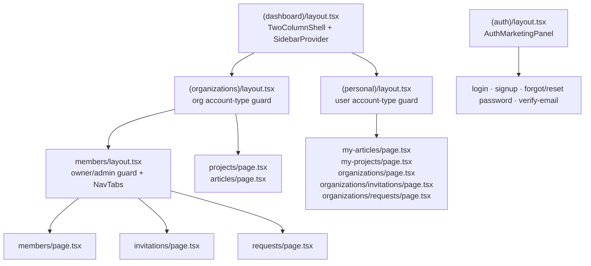

Cards and layout shells in the app are built from a set of shared components in [`src/components/ui/`](https://github.com/ozeaon/ozeaon-v2/tree/0a4f1a95824db87782f1221a4108019d174df3d9/src/components/ui) and wired together through Next.js App Router route-group layouts. The design-token contract that governs card colors and typography lives in [Design Tokens](../design-tokens/).

## Overview

The layout system has two layers. The **component layer** provides card shells, feed wrappers, and two-column shells that feature pages compose. The **route layer** provides App Router `layout.tsx` files that establish persistent chrome, authorization guards, and segment-level error boundaries for settings and auth surfaces.

Cards follow a token contract: all backgrounds and text sizes come from design-system tokens defined in `src/styles/globals.css` and `src/styles/typography.css`. No raw Tailwind color or size utilities are used ([design-system.md](https://github.com/ozeaon/ozeaon-v2/blob/0a4f1a95824db87782f1221a4108019d174df3d9/docs/design-system.md)).

## Card & Feed Components

Key components from [`src/components/ui/cards/`](https://github.com/ozeaon/ozeaon-v2/tree/0a4f1a95824db87782f1221a4108019d174df3d9/src/components/ui/cards) and [`src/components/ui/layout/`](https://github.com/ozeaon/ozeaon-v2/tree/0a4f1a95824db87782f1221a4108019d174df3d9/src/components/ui/layout):

- [`CondensedCardShell`](https://github.com/ozeaon/ozeaon-v2/blob/0a4f1a95824db87782f1221a4108019d174df3d9/src/components/ui/cards/CondensedCardShell.tsx) / `CondensedCardCover` / `CondensedCardActions` — the three-piece condensed card family used across article and project lists
- [`CollapsibleCard`](https://github.com/ozeaon/ozeaon-v2/blob/0a4f1a95824db87782f1221a4108019d174df3d9/src/components/ui/cards/CollapsibleCard.tsx) — a card that expands and collapses its body
- [`GenericInfiniteFeed`](https://github.com/ozeaon/ozeaon-v2/blob/0a4f1a95824db87782f1221a4108019d174df3d9/src/components/ui/layout/GenericInfiniteFeed.tsx) — infinite-scroll wrapper used by article and project feeds
- [`ResponsiveCardList`](https://github.com/ozeaon/ozeaon-v2/blob/0a4f1a95824db87782f1221a4108019d174df3d9/src/components/ui/layout/ResponsiveCardList.tsx) — a grid/list toggling wrapper for card collections
- [`TwoColumnShell`](https://github.com/ozeaon/ozeaon-v2/blob/0a4f1a95824db87782f1221a4108019d174df3d9/src/components/ui/layout/shells/TwoColumnShell.tsx) — the primary page shell (topbar + sidebar + main content); used by `(dashboard)/layout.tsx`
- [`SidebarShell`](https://github.com/ozeaon/ozeaon-v2/blob/0a4f1a95824db87782f1221a4108019d174df3d9/src/components/ui/layout/shells/SidebarShell.tsx) — a simpler sidebar + content shell for single-entity pages

The full catalog for cards is at [UI Cards](../../components/ui/cards/) and for layout at [UI Layout](../../components/ui/layout/).

## Architecture

## Layout Shells

The `(dashboard)/layout.tsx` provides all visible chrome: it wraps content in [`TwoColumnShell`](https://github.com/ozeaon/ozeaon-v2/blob/0a4f1a95824db87782f1221a4108019d174df3d9/src/app/(main)/(dashboard)/layout.tsx) with `AppTopbar` and `DashboardSidebar`. The two settings sub-layouts beneath it are authorization guards, not chrome layers:

- [`settings/(organizations)/layout.tsx`](https://github.com/ozeaon/ozeaon-v2/blob/0a4f1a95824db87782f1221a4108019d174df3d9/src/app/(main)/(dashboard)/settings/(organisations)/layout.tsx) — redirects to `/settings` if the active account is not an organisation
- [`settings/(personal)/layout.tsx`](https://github.com/ozeaon/ozeaon-v2/blob/0a4f1a95824db87782f1221a4108019d174df3d9/src/app/(main)/(dashboard)/settings/(personal)/layout.tsx) — redirects to `/settings` if the active account is not a user

The [`members/layout.tsx`](https://github.com/ozeaon/ozeaon-v2/blob/0a4f1a95824db87782f1221a4108019d174df3d9/src/app/(main)/(dashboard)/settings/(organisations)/members/layout.tsx) goes further: it checks `getUserOrgRole` and redirects non-owners/non-admins to the organisation page, then renders `OrgMembersHeader` and `NavTabs` (member list, invitations, and join requests).

The [`(auth)/layout.tsx`](https://github.com/ozeaon/ozeaon-v2/blob/0a4f1a95824db87782f1221a4108019d174df3d9/src/app/(auth)/layout.tsx) is a flat shell with no dashboard chrome; it renders `AuthMarketingPanel` alongside its children for the marketing split-screen on auth pages.

## Failure Modes & Edge Cases

- A feed page that throws during render is caught by the co-located `error.tsx` at the same segment. The `(personal)` shell stays mounted, so navigation is never lost — see [`organizations/error.tsx`](https://github.com/ozeaon/ozeaon-v2/blob/0a4f1a95824db87782f1221a4108019d174df3d9/src/app/(main)/(dashboard)/settings/(personal)/organizations/error.tsx).
- `settings/(organizations)` and `settings/(personal)` are near-identical paths but protected by opposite account-type checks. Switching active account without reloading can land a user on the wrong guard; both redirect to `/settings` rather than showing a blank page.
- A card author reaching for a raw Tailwind color or size utility breaks the token contract. The `docs/design-system.md` rule is the only guardrail — there is no lint enforcement for this today.

## Operational Notes

Shell persistence is a direct effect of the App Router layout hierarchy: `TwoColumnShell` (in the dashboard layout) does not re-render when navigating between settings child pages. Moving between organisation settings tabs swaps only the leaf `page.tsx`, keeping the sidebar and topbar mounted.

Token-driven styling keeps the generated CSS bounded by the token list rather than by the number of pages. For token definitions see [Design Tokens](../design-tokens/).

## Related Links

- [UI Primitives](../ui-primitives/) — all ui component folders
- [Design Tokens](../design-tokens/) — color and typography tokens used by cards and shells
- [UI Cards](../../components/ui/cards/) — card component catalog
- [UI Layout](../../components/ui/layout/) — layout component catalog
- [dashboard layout.tsx](https://github.com/ozeaon/ozeaon-v2/blob/0a4f1a95824db87782f1221a4108019d174df3d9/src/app/(main)/(dashboard)/layout.tsx)
- [docs/design-system.md](https://github.com/ozeaon/ozeaon-v2/blob/0a4f1a95824db87782f1221a4108019d174df3d9/docs/design-system.md) — token definitions source
