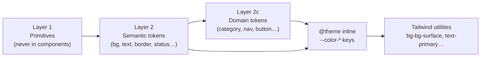

The visual language is defined as a three-layer CSS custom-property system in [`src/styles/globals.css`](https://github.com/ozeaon/ozeaon-v2/blob/0a4f1a95824db87782f1221a4108019d174df3d9/src/styles/globals.css) paired with a fixed type scale in [`src/styles/typography.css`](https://github.com/ozeaon/ozeaon-v2/blob/0a4f1a95824db87782f1221a4108019d174df3d9/src/styles/typography.css). Components must consume named tokens, never raw Tailwind color or size utilities; ESLint [`better-tailwindcss/no-unknown-classes`](https://github.com/ozeaon/ozeaon-v2/blob/0a4f1a95824db87782f1221a4108019d174df3d9/eslint.rules.base.mjs) flags unknown classes. There is no dark theme.

## Architecture

The pipeline has four stages: Layer 1 primitives → Layer 2 semantic tokens → Layer 2c domain tokens → `@theme inline` Tailwind export. Typography runs in parallel via `@utility` blocks.



**Why `@theme inline`?** Without `inline`, Tailwind would bake literal hex values into the generated CSS at build time. With it, every utility stays as a live `var()` reference, so tokens can be re-scoped at runtime in a selector without a rebuild.

**Cascade layer.** All tokens are declared in `@layer base`, which sits below `components` and `utilities`. A utility class always overrides a base declaration, which is why `@layer base { h1 { color: var(--text-primary) } }` can still be overridden per component.

**Adding a token requires two edits.** Declare it in `:root` and then re-export it in `@theme inline`. Declaring only in `:root` gives a working `var()` but no Tailwind class; declaring only in `@theme inline` produces a broken reference.

### Naming Conventions

Two conventions produce otherwise-surprising class names:

- **Surfaces are double-prefixed.** The token `--bg-surface` exports as `--color-bg-surface`, so Tailwind generates `bg-bg-surface`, not `bg-surface`.
- **Text names are shortened.** `--text-primary` exports as `--color-primary`, producing `text-primary` rather than `text-text-primary`.

The two link colors are not interchangeable:

```jsx
// Non-branded inline link in body copy — indigo (#424bb3)
<a className="text-text-link">Read more</a>

// Branded action link — brand green (#00786f)
<a className="text-brand">Join now</a>
```

The `@theme inline` comment states the rule: *"text-brand (green, brand action) ≠ text-text-link (gray, body link text)"*.

### Globals Structure

`globals.css` imports the subsidiary stylesheets, making them available everywhere:

```css
@import "tailwindcss" source("../../src/");
@import "./typography.css";
@import "./transitions.css";
@import "./collapsible-content.css";
@import "./richtext-content.css";
```

`source("../../src/")` limits Tailwind's class detection to `src/`, keeping the build fast.

### Token Layers in Detail

**Layer 1 — Primitives** (`--gray-0`…`--gray-1000`, `--green-*`, `--red-*`, `--amber-*`, `--indigo-*`, `--ink-*`, category and accent primitives). The `Ink` family is kept separate from the gray scale because its values carry no blue tint — icons use it to match Figma's `fill_icon`, `Duotone`, and `Line_icon` roles.

**Layer 2 — Semantic tokens** map intent onto primitives: surfaces (`--bg-surface`, `--bg-inverse`), text (`--text-primary` … `--text-placeholder`), borders (`--border`, `--border-strong`, `--border-stronger`, `--divider`), icons (`--icon`, `--icon-muted`, `--icon-stroke-dark`), and status tokens (`--success`/`-hover`/`-surface`, `--error`, `--warning`, `--info`). Overlay tokens (`--overlay-frosted`, `--overlay-scrim`) are raw `rgba()` because opacity cannot be expressed by aliasing an opaque primitive.

**Layer 2c — Domain tokens** cover category accents (each category gets a `--category-<name>-main` / `-bg` pair), nav icon backgrounds, content-type accents, button states, and badge colors. Some are annotated `code-only` (no Figma counterpart) or `placeholder` (provisional).

**shadcn compatibility bridge.** A dedicated block maps shadcn's required properties (`--background`, `--foreground`, `--card`, `--ring`, etc.) onto semantic tokens. Custom code must not use these bridge properties directly — the comment warns *"never use these directly in custom components"*.

**Radius tokens** use the prefix `--r-sm` rather than `--radius-sm`. The inline comment explains why: a token named `--radius-sm` would self-reference in `@theme inline` and break the generated utilities.

## Typography

[`src/styles/typography.css`](https://github.com/ozeaon/ozeaon-v2/blob/0a4f1a95824db87782f1221a4108019d174df3d9/src/styles/typography.css) declares every text style as a Tailwind v4 `@utility`. Line heights are absolute px values, not ratios, to guarantee pixel-faithful reproduction of the Figma text styles — the exception is the body family, which uses `line-height: 1.65` so long-form prose can breathe.

Font families are loaded via `next/font` in [`src/app/layout.tsx`](https://github.com/ozeaon/ozeaon-v2/blob/0a4f1a95824db87782f1221a4108019d174df3d9/src/app/layout.tsx):

| CSS variable | Family | Role |
| --- | --- | --- |
| `--font-sans` | Manrope | All non-mono text — body, headings, labels |
| `--font-mono` | **Spline Sans Mono** | Code, filled inputs |
| `--font-heading` | Lora (serif) | Content titles (`font-content-title*`) |

Note: the header comment in `typography.css` says "DM Mono" and `docs/design-system.md` repeats it, but both are stale — `layout.tsx` loads Spline Sans Mono.

The body utilities `font-body-lg` and `font-body` include a built-in tablet-band downgrade (640–1536 px): `font-body-lg` steps from 18px to 16px, and `font-body` steps from 16px to 15px. The override is compiled into the utility, so authors write nothing extra at call sites.

`font-h4` (15px / 500) is intentionally lighter than `font-h3` (18px / 700) so card titles do not compete with section headings. The `font-content-title*` series uses Lora rather than Manrope, giving editorial content a distinct voice from UI chrome.

See [`typography.css`](https://github.com/ozeaon/ozeaon-v2/blob/0a4f1a95824db87782f1221a4108019d174df3d9/src/styles/typography.css) for the full utility list (display, h1–h4, body, body-sm, label, caption, mono, content-title).

## Failure Modes & Edge Cases

- **Layer bypass.** Using `var(--gray-1000)` or a raw Tailwind color directly in a component compiles fine but severs the semantic contract — a future palette change propagates to components that were not intended to track that primitive. ESLint `better-tailwindcss/no-unknown-classes` catches undefined utilities but not `var()` references to Layer 1 primitives.
- **The two-link-color trap.** `text-brand` (green) and `text-text-link` (indigo) look similar at a glance. Swapping them is a silent visual error.
- **Double-prefix confusion.** `bg-surface` generates nothing; the correct class is `bg-bg-surface`. Likewise, `text-text-primary` generates nothing; use `text-primary`.
- **Radius rename.** Renaming `--r-sm` to `--radius-sm` breaks the generated radius utilities via the self-reference described in the inline comment.
- **Coincidental equality.** `--success` and `--primary-green` currently resolve to the same primitive (`--green-600`). The inline comments document this explicitly so a future deduplication pass does not merge them — brand green and success green must be free to diverge.
- **Alpha tokens.** `--overlay-frosted`, `--overlay-scrim`, and `--accent` are raw literals and cannot be replaced with `var()` aliases without losing the alpha channel or the code-only value.
- **Bridge-property leakage.** Using `--background` or `--foreground` in custom code creates a competing semantic layer and breaks when shadcn updates those properties.

## Extension Points

To add a token end to end: declare it in `:root` (Layer 2a/2c), then export it as `--color-<name>` in the `@theme inline` block. Adding only one of the two steps results in either a dead utility or a broken `var()`.

To add a category: add `--category-<name>-main` and `--category-<name>-bg` in the Layer 2c block, then two matching `--color-category-*` exports.

To add a type style: add an `@utility font-<name>` block to `typography.css` using one of the three family variables.

To re-skin shadcn components: change only the bridge block (`--background`, `--foreground`, etc.) in `globals.css`.

## Related Links

- [`src/styles/globals.css`](https://github.com/ozeaon/ozeaon-v2/blob/0a4f1a95824db87782f1221a4108019d174df3d9/src/styles/globals.css) — primitives, semantic tokens, domain tokens, shadcn bridge, `@theme inline`
- [`src/styles/typography.css`](https://github.com/ozeaon/ozeaon-v2/blob/0a4f1a95824db87782f1221a4108019d174df3d9/src/styles/typography.css) — type scale utilities, base element styles
- [`src/app/layout.tsx`](https://github.com/ozeaon/ozeaon-v2/blob/0a4f1a95824db87782f1221a4108019d174df3d9/src/app/layout.tsx) — font loading (Manrope, Spline Sans Mono, Lora)
- [`eslint.rules.base.mjs`](https://github.com/ozeaon/ozeaon-v2/blob/0a4f1a95824db87782f1221a4108019d174df3d9/eslint.rules.base.mjs) — `better-tailwindcss/no-unknown-classes`
- [UI Primitives](../ui-primitives/) — shadcn & Radix component wrappers that consume these tokens
- [Cards & Layout](../cards-and-layout/) — card components and layout shells
- [Forms & Validation](../forms-and-validation/) — form field wrappers
- [Conventions & Linting](../../developer-guide/conventions-and-linting/) — full ESLint config including caching bans
