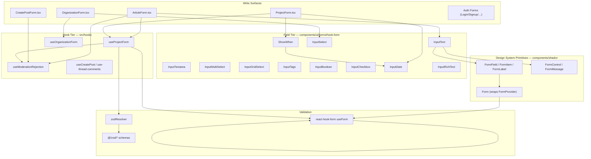
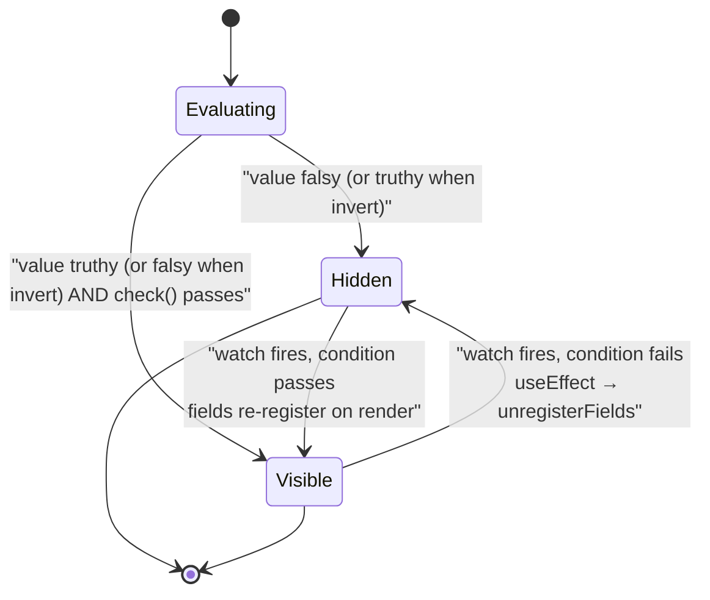
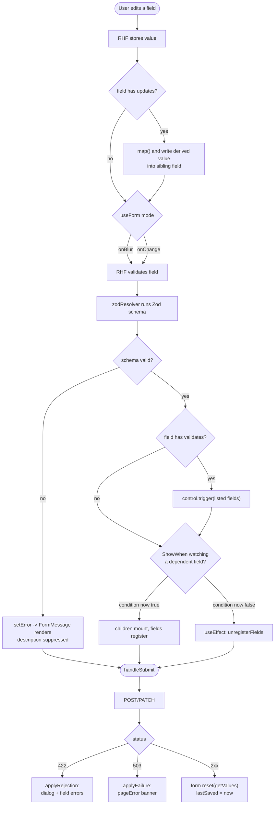
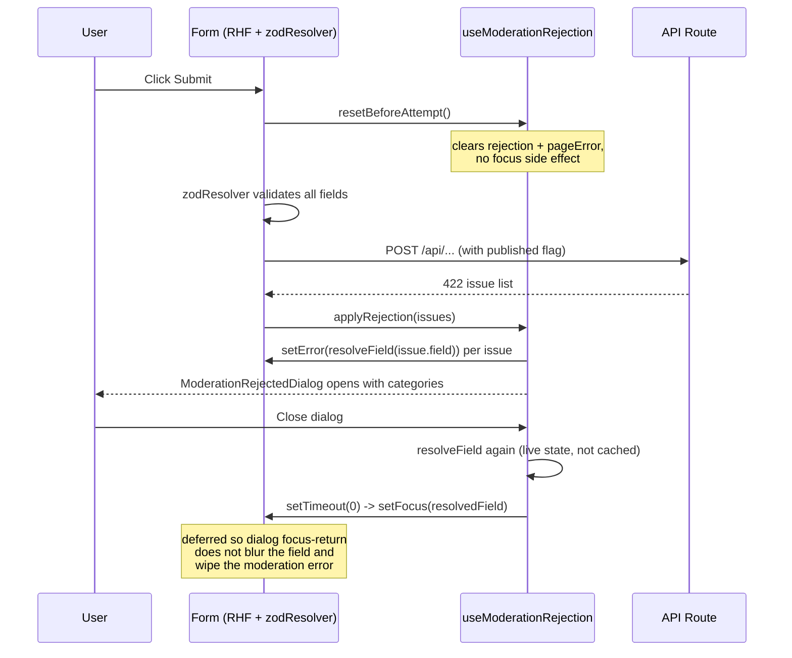

RHF-connected field wrappers (`src/components/ui/forms/hook-form/`) plus the shared `useForm` hooks that drive every create/edit surface in the app, glueing shadcn `<Form>` primitives, Zod schemas, and cross-field reactivity into a single reusable contract.

## Purpose and Scope

This page documents the form layer of the design system: the **RHF-connected field components** (the `hook-form` family), the **conditional-rendering primitive `ShowWhen`**, the **shared form hooks** (`useProjectForm`, `useOrganizationForm`, `useModerationRejection`, and friends), and the **validation flow** that ties Zod schemas to `react-hook-form` through `zodResolver`.

It deliberately stays inside the "forms" boundary:

- For the base shadcn primitives (`Form`, `FormField`, `FormItem`, `FormMessage`, `Button`, `Input`, `Select`) see the shadcn/design-system pages — this page treats them as consumed dependencies.
- For Zod schema definitions themselves (`@/zod/projects`, `@/zod/articles`, …) see the validation/Zod schema page; here they are referenced only as the schema inputs to `zodResolver`.
- For the moderation **API contract** (`ApiModerationIssue`, `ApiError`) see the API/error-handling page. This page documents the form-side consumption of those shapes.

## Overview

The application has many write surfaces — article creation/editing, project drafting/publication, organization management, comments, and auth forms. Duplicating form logic in each one caused drift: each surface re-implemented slug auto-generation, moderation rejection handling, section completion tracking, and conditional visibility. The form layer exists to collapse that duplication into two reusable tiers.

The design is two-tier:

1. **Field tier — `src/components/ui/forms/hook-form/`.** A set of "smart" inputs (`InputText`, `InputTextarea`, `InputSelect`, `InputMultiSelect`, `InputGridSelect`, `InputTags`, `InputBoolean`, `InputCheckbox`, `InputDate`, `InputRichText`) that each wrap a shadcn `FormField`/`FormItem`/`FormLabel`/`FormControl`/`FormMessage` quartet and talk to `react-hook-form` **through context**, not props. Plus `ShowWhen`, a declarative conditional-render wrapper.

2. **Hook tier — `src/hooks/use-*.ts`.** One hook per form domain (`useProjectForm`, `useOrganizationForm`, `useModerationRejection`, `useCreatePost`, …) that owns `useForm`, the resolver, `defaultValues`, submit/save orchestration, section-completion computation, and the moderation dialog state machine.

Key terminology used throughout:

| Term | Meaning |
|---|---|
| `FormProvider` | The RHF context provider wrapped by shadcn `<Form>`. All hook-form components require an ancestor `<Form>`. |
| `control` | RHF's form controller. Hook-form components **never** accept it as a prop — they call `useFormContext` internally ([docs/hook-form-components.md](https://github.com/ozeaon/ozeaon-v2/blob/0a4f1a95824db87782f1221a4108019d174df3d9/docs/hook-form-components.md#L5)). |
| `updates` | A declarative cross-field write: when this field's value changes, mapped values are written into *other* fields. |
| `validates` | A list of sibling field names whose validation is re-triggered (`control.trigger`) on this field's blur/change. |
| `shouldUnregister` | RHF option; `false` in these forms, which preserves values of conditionally hidden fields and forces `ShowWhen` to manage unregistration explicitly. |
| `zodResolver` | `@hookform/resolvers/zod` adapter bridging a Zod schema to RHF's `resolver` contract. |

A subtle but important convention: these components are deliberately **not generic over the form values type**. `FieldUpdate.name` is typed as plain `string`, and the component `name` props are `string`, not `FieldPath<TFormValues>`. The documented rationale ([docs/hook-form-components.md](https://github.com/ozeaon/ozeaon-v2/blob/0a4f1a95824db87782f1221a4108019d174df3d9/docs/hook-form-components.md#L31)) is that making `FieldUpdate` depend on `TFormValues` causes bidirectional inference to over-constrain `TFormValues` when both `name` and `updates` appear on the same component. The type-safety cost is accepted; the ergonomic gain is that a single `<InputText name="title" updates={[…]} />` call site infers cleanly.

## Architecture

The form layer sits between the design-system primitives it composes and the domain hooks that drive it.



The arrows encode real couplings:

- **Surfaces → field components**: every form composes the field tier; no surface hand-rolls a `FormField` quartet for a standard input.
- **Field components → shadcn primitives**: each component's render path is `FormField → FormItem → FormLabel/FormControl → FormMessage`.
- **Field components → context, not props**: the `FormProvider` at the top of each surface is the only channel; hence `ShowWhen` can call `useWatch` with no extra subscription wiring ([docs/hook-form-components.md](https://github.com/ozeaon/ozeaon-v2/blob/0a4f1a95824db87782f1221a4108019d174df3d9/docs/hook-form-components.md#L395)).
- **Hooks → `useModerationRejection`**: the moderation state machine was extracted from `use-project-form`, `ArticleForm`, `useCreatePost`, `use-thread-comments`, `use-organization-form`, and `OrganizationSettingsForm` into one shared hook ([src/hooks/use-moderation-rejection.ts](https://github.com/ozeaon/ozeaon-v2/blob/0a4f1a95824db87782f1221a4108019d174df3d9/src/hooks/use-moderation-rejection.ts#L18-L31)).

## The Field Tier

All components live in `src/components/ui/forms/hook-form/` and are re-exported from the barrel so a surface imports them from a single path:

```typescript
import {
  InputText, InputTextarea, InputSelect, InputMultiSelect,
  InputGridSelect, InputTags, InputBoolean, InputCheckbox,
  InputDate, InputRichText, ShowWhen,
} from "@/components/ui/forms/hook-form";
```

> Source: [hook-form-components.md](https://github.com/ozeaon/ozeaon-v2/blob/0a4f1a95824db87782f1221a4108019d174df3d9/docs/hook-form-components.md#L9-L14)

### The `updates` prop — declarative cross-field writes

`updates` is available on `InputText`, `InputTextarea`, `InputSelect`, and `InputBoolean`. It lets a field push derived values into sibling fields whenever its own value changes.

```typescript
type FieldUpdate<TSourceValue = string> = {
  name: string;        // target field path (dot notation ok)
  map: (value: TSourceValue) => unknown; // transform fn
};
```

> Source: [hook-form-components.md](https://github.com/ozeaon/ozeaon-v2/blob/0a4f1a95824db87782f1221a4108019d174df3d9/docs/hook-form-components.md#L25-L28)

Two recurring patterns in the article form demonstrate why this exists:

```tsx
// ArticleForm.tsx:313
<InputText
  name="title"
  label="Title"
  updates={[{
    name: "slug",
    map: (val: string) => slugify(val?.substring(0, 50) ?? ""),
  }]}
/>

// ArticleForm.tsx:302
<InputSelect
  label="Article Type"
  name="article_type_id"
  options={articleTypeOptions}
  updates={[{
    name: "article_type",
    map: (id) => articleTypes.find((t) => t.id === id),
  }]}
/>
```

> Source: [hook-form-components.md](https://github.com/ozeaon/ozeaon-v2/blob/0a4f1a95824db87782f1221a4108019d174df3d9/docs/hook-form-components.md#L37-L55)

The second pattern is the more architecturally significant one. The select's RHF field stores only the **FK id** (`article_type_id`, `access_level_id`), which is what the API wants. But `ShowWhen` needs to inspect nested properties like `access_level.requires_embargo_date`. Rather than forcing `ShowWhen` to perform lookups, the form keeps the **full joined object** mirrored in a parallel field (`article_type`, `access_level`) via `updates`. This keeps `ShowWhen` a dumb predicate over form state and keeps the persisted payload shaped correctly — at the cost of denormalized duplicate data in form values that must be re-synced on every option change.

### The `validates` prop — cross-field re-validation

Available on `InputText` and `InputBoolean`. It fires `control.trigger(fieldName)` on blur/change for each listed field, which matters when one field's validity depends on another.

```tsx
// ArticleForm.tsx:572 — re-validate funding_source_id when funding_details changes
<InputText
  name="funding_details"
  label="Funding Source Details"
  validates={["funding_source_id"]}
/>
```

> Source: [hook-form-components.md](https://github.com/ozeaon/ozeaon-v2/blob/0a4f1a95824db87782f1221a4108019d174df3d9/docs/hook-form-components.md#L67-L72)

Without this, a schema-level refinement that spans two fields would only re-evaluate when the *dependent* field itself was touched — leaving a stale error visible, or a newly-satisfied constraint still flagged. `validates` deliberately uses `trigger` (single-field validate) rather than a full `handleSubmit`, so it stays cheap and does not surface errors for untouched fields.

### Error and description styling

All components apply `border-destructive bg-error-surface` when `fieldState.invalid` is true. Critically, the `description` text is **suppressed while an error is active** — `FormMessage` takes its place ([docs/hook-form-components.md](https://github.com/ozeaon/ozeaon-v2/blob/0a4f1a95824db87782f1221a4108019d174df3d9/docs/hook-form-components.md#L79)). This is a layout-stability decision: error and description occupy the same slot, so the form does not jump vertically when validation fires.

### Component reference

| Component | RHF value shape | Notable behavior |
|---|---|---|
| `InputText` | `string` (or `number` for `type="number"`) | Number mode converts via `valueAsNumber` and passes `undefined` — not `NaN` — when empty. Label defaults to `name` and renders invisible to preserve layout. |
| `InputTextarea` | `string` | Character counter with `maxLength` default `3000`; counter only appears when ≤ 50 chars remain (amber) or at limit (red), unless `showRemaining`. `resize` defaults true. |
| `InputSelect` | `string` | Single-select Radix `Select`. The *selected option's* `description` overrides the static `description` prop below the input. `placeholder` defaults `"Select an option"`. |
| `InputMultiSelect` | `string[]` | Command-palette search + `CommandGroup` headings driven by an option `group` string. Renders selected values as removable badges inline. |
| `InputGridSelect` | `string[]` | Card-grid multi-select (`grid-cols-1 sm:grid-cols-2 md:grid-cols-3`), per-option `description` inside the card, removable badges above the grid. |
| `InputTags` | `string` (comma-separated) | Pending text held in local state, committed on `Enter`, `,`, or blur. `maxTags` default 5; input hidden at limit. `Backspace` on empty input removes last tag. |
| `InputBoolean` | `boolean \| null \| undefined` | Radix `Switch`, label/description left, switch right. Supports `validates`. |
| `InputCheckbox` | `boolean \| null \| undefined` | Radix `Checkbox` beside label. `indeterminate` is normalized to `false`. |
| `InputDate` | `string \| null \| undefined` (ISO `YYYY-MM-DD`) | Native `<input type="date">` inside `FormField`. |
| `InputRichText` | JSON string (+ derived `content_text`) | BlockNote editor. **WIP — API and autosave behavior may change.** |

> Source: [hook-form-components.md](https://github.com/ozeaon/ozeaon-v2/blob/0a4f1a95824db87782f1221a4108019d174df3d9/docs/hook-form-components.md#L85-L377)

A critical trap is documented for `InputTags`: tags are stored in the RHF field as a **comma-separated string** (`"ocean,climate,reef"`), so tags containing commas split incorrectly on read-back. The docs explicitly recommend switching to an array field if commas are meaningful for a given use case ([docs/hook-form-components.md](https://github.com/ozeaon/ozeaon-v2/blob/0a4f1a95824db87782f1221a4108019d174df3d9/docs/hook-form-components.md#L280-L283)).

### `InputRichText` (work in progress)

`InputRichText` is a BlockNote-based rich text editor that serialises content as a JSON string in the RHF field and *also* writes a plain-text strip to `content_text` (hardcoded target field) for search indexing. Supported block types are paragraph, bullet list, numbered list, quote, and headings h1–h3 (rendered as h2–h4 in the DOM). The toolbar exposes block-type selection, bold, italic, underline, and nest/unnest; code, links, emoji, slash menu, and side menu are disabled. Providing both `objectId` and `objectType` enables server-side autosave ([docs/hook-form-components.md](https://github.com/ozeaon/ozeaon-v2/blob/0a4f1a95824db87782f1221a4108019d174df3d9/docs/hook-form-components.md#L466-L479)).

Because it is flagged WIP, treat its props and autosave contract as unstable — and note the hardcoded `content_text` coupling means renaming that field requires touching the editor, not just the schema.

## `ShowWhen` — conditional rendering

`ShowWhen` is a declarative wrapper that renders its children based on a watched field value. It calls `useWatch` internally, so no subscription setup is needed at the call site.

```typescript
type Props<T> = {
  field: keyof T & string;          // field name to watch
  invert?: boolean;                 // show when value is falsy instead of truthy
  check?: (value: unknown) => boolean;  // custom predicate (overrides default truthy check)
  unregisterFields?: string[];      // fields to unregister when hidden
  children: ReactNode;
};
```

> Source: [hook-form-components.md](https://github.com/ozeaon/ozeaon-v2/blob/0a4f1a95824db87782f1221a4108019d174df3d9/docs/hook-form-components.md#L397-L405)

Visibility logic, as documented: show when `value` is truthy (or `invert` flips that), **AND** the optional `check` predicate passes ([docs/hook-form-components.md](https://github.com/ozeaon/ozeaon-v2/blob/0a4f1a95824db87782f1221a4108019d174df3d9/docs/hook-form-components.md#L407)).

| Goal | Use |
|---|---|
| Show when field has any truthy value | `<ShowWhen field="flagField">` |
| Show when field is falsy/null/false | `<ShowWhen field="flagField" invert>` |
| Show based on specific value(s) | `<ShowWhen field="type.code" check={v => v === "research"}>` |

> Source: [hook-form-components.md](https://github.com/ozeaon/ozeaon-v2/blob/0a4f1a95824db87782f1221a4108019d174df3d9/docs/hook-form-components.md#L443-L447)

Three real usages from the article form:

```tsx
// Basic truthy check — show indigenous fields only when the flag is on
<ShowWhen field="indigenous_knowledge_flag">
  <InputSelect name="indigenous_macro_region_id" ... />
</ShowWhen>
```

> Source: [hook-form-components.md](https://github.com/ozeaon/ozeaon-v2/blob/0a4f1a95824db87782f1221a4108019d174df3d9/docs/hook-form-components.md#L410-L415)

```tsx
// Invert + unregister — show PDF URL when text_only_publication is false/null
<ShowWhen
  field="text_only_publication"
  invert
  unregisterFields={["pdf_url"]}
>
  <InputText name="pdf_url" label="PDF Url" />
</ShowWhen>
```

> Source: [hook-form-components.md](https://github.com/ozeaon/ozeaon-v2/blob/0a4f1a95824db87782f1221a4108019d174df3d9/docs/hook-form-components.md#L420-L427)

```tsx
// Custom check predicate — show abstract only for research/IP article types
const isResearchOrIP = (value: unknown): boolean =>
  ["research", "intellectual_property"].includes(value as string);

<ShowWhen field="article_type.code" check={isResearchOrIP}>
  <InputTextarea name="abstract" label="Article abstract" rows={6} />
</ShowWhen>
```

> Source: [hook-form-components.md](https://github.com/ozeaon/ozeaon-v2/blob/0a4f1a95824db87782f1221a4108019d174df3d9/docs/hook-form-components.md#L432-L438)

### `unregisterFields` and `shouldUnregister: false`

This is the subtlest interaction in the form layer and it is driven directly by the `useForm` configuration. These forms set `shouldUnregister: false` (it is **required** in `ArticleForm` to preserve hidden field values across hide/show cycles — e.g. so a user toggling `text_only_publication` off and back on does not lose a typed `pdf_url`).

The cost of `shouldUnregister: false` is that fields hidden inside a `ShowWhen` **still get submitted**. When a hidden field's value must *not* reach the API, the field must be explicitly unregistered via `unregisterFields`:

```tsx
<ShowWhen
  field="access_level.requires_embargo_date"
  unregisterFields={["embargo_end_date"]}
>
  <InputDate name="embargo_end_date" label="Embargo Ending Date" />
</ShowWhen>
```

> Source: [hook-form-components.md](https://github.com/ozeaon/ozeaon-v2/blob/0a4f1a95824db87782f1221a4108019d174df3d9/docs/hook-form-components.md#L454-L459)

Per the docs, the `unregister` call fires in a `useEffect` when `shouldShow` transitions to `false` ([docs/hook-form-components.md](https://github.com/ozeaon/ozeaon-v2/blob/0a4f1a95824db87782f1221a4108019d174df3d9/docs/hook-form-components.md#L462)).



Note the asymmetry: unregistration on hide is explicit (`useEffect`), while re-registration on show is implicit (the child mounts and its `FormField` registers). This asymmetry is exactly why `shouldUnregister: false` is required — it makes the hide→show path lossless while leaving the developer in control of the show→hide path.

## Hook Tier: `useProjectForm`

`useProjectForm` is the most complete example of a domain form hook and the reference implementation for the pattern.

```typescript
// z.input<> gives the pre-transform type — matches what zodResolver expects
type ProjectFormValues = z.input<typeof projectPublishSchema>;
type ProjectFormOutput = z.output<typeof projectPublishSchema>;

interface UseProjectFormProps {
  draftId?: string;
  initialDraftData?: Record<string, unknown> | null;
  initialProjectId?: string | null;
}
```

> Source: [use-project-form.ts](https://github.com/ozeaon/ozeaon-v2/blob/0a4f1a95824db87782f1221a4108019d174df3d9/src/hooks/use-project-form.ts#L23-L31)

The `z.input<>` / `z.output<>` split is a direct consequence of using transforming schemas: `zodResolver` validates the *input* shape while the submit handler receives the *output* shape.

### Form construction

```typescript
const form = useForm<ProjectFormValues, unknown, ProjectFormOutput>({
  mode: "onBlur",
  resolver: zodResolver(projectPublishSchema),
  shouldUnregister: false,
  defaultValues: {
    ...((initialDraftData ?? {}) as Partial<ProjectFormValues>),
    organizationConnectMode: initialDraftData?.linked_organization_id
      ? "connect"
      : "skip",
  },
});
```

> Source: [use-project-form.ts](https://github.com/ozeaon/ozeaon-v2/blob/0a4f1a95824db87782f1221a4108019d174df3d9/src/hooks/use-project-form.ts#L45-L55)

Design intent behind each option:

- **`mode: "onBlur"`** — validation runs on blur rather than on every keystroke. This is the reason `useModerationRejection.clearModerationRejection` has to fight focus: an on-blur-mode form validates when it loses focus, and clicking a dialog can steal that focus ([use-moderation-rejection.ts](https://github.com/ozeaon/ozeaon-v2/blob/0a4f1a95824db87782f1221a4108019d174df3d9/src/hooks/use-moderation-rejection.ts#L63-L68)).
- **`zodResolver(projectPublishSchema)`** — full publish schema is the resolver, so RHF and the API agree on shape; the *draft* schema is applied separately and defensively in `handleSaveDraft`.
- **`shouldUnregister: false`** — see the `ShowWhen` section; required to preserve hidden-section values across step navigation.
- **`defaultValues` derived from `initialDraftData`**, with a computed non-schema field `organizationConnectMode` derived from whether `linked_organization_id` exists.

### Slug-to-index field resolution

The project form's content sections are an **array**, so RHF registers fields under array indices (`sections.0.body`). But sections can be reordered by the user, which makes indices unstable for logging and for server-reported moderation errors. The form therefore logs and reports sections by **slug** and resolves back to the live index at the moment of use:

```typescript
// Sections are logged and reported by slug ("sections.overview.body") since
// it's stable across reorders, unlike the array index react-hook-form
// actually registers fields under. Resolved back to the live index here -
// called both when a rejection sets field errors and again when the
// dialog closes, so it always resolves against the form's current state.
const moderation = useModerationRejection(form, (field) => {
  const match = /^sections\.([^.]+)\.(intro|body)$/.exec(field);
  if (!match) return field as FieldPath<ProjectFormValues>;

  const [, slug, subfield] = match;
  const index = (form.getValues("sections") ?? []).findIndex(
    (section) => section.slug === slug,
  );
  return (
    index === -1 ? field : `sections.${index}.${subfield}`
  ) as FieldPath<ProjectFormValues>;
});
```

> Source: [use-project-form.ts](https://github.com/ozeaon/ozeaon-v2/blob/0a4f1a95824db87782f1221a4108019d174df3d9/src/hooks/use-project-form.ts#L57-L73)

Note the deliberate re-resolution: the resolver is passed as a *function* and is invoked again when the dialog closes, not cached from the rejection. If a user reorders sections while the rejection dialog is open, the field error and the post-close focus target still land on the right section. If the slug no longer exists at all, the raw slug path is returned so RHF fails gracefully rather than throwing.

### Derived section-completion state

`useProjectForm` computes per-section completion by running **partial Zod schemas** from `@/zod/projects` against the full watched values, rather than maintaining parallel boolean state:

```typescript
const values = useWatch({ control: form.control });
const v = values as Record<string, unknown>;
const contentSections = Array.isArray(v.sections)
  ? (v.sections as SectionItem[])
  : [];

const completedSections: Record<string, boolean> = {
  "section-project-type":
    projectStep1CompleteSchema.safeParse(values).success,
  "section-project-identity":
    projectStep2CompleteSchema.safeParse(values).success,
  "section-categories": projectStep3CompleteSchema.safeParse(values).success,
  "section-configuration": !!(values as Record<string, unknown>)
    .linked_organization_id,
  "section-content": (() => {
    const overview = contentSections.find((s) => s.slug === "overview");
    return Boolean(overview?.intro?.trim() && overview?.body?.trim());
  })(),
  "section-team":
    Array.isArray((values as Record<string, unknown>).team_members) &&
    ((values as Record<string, unknown>).team_members as unknown[]).length >
      0,
  // …section-documents, section-faq, section-contact, section-related, section-comments
};
```

> Source: [use-project-form.ts](https://github.com/ozeaon/ozeaon-v2/blob/0a4f1a95824db87782f1221a4108019d174df3d9/src/hooks/use-project-form.ts#L75-L113)

The design intent is a **single source of truth**: the same Zod schema that gates publication also computes the sidebar's completion checkmarks. There is no way for the sidebar to say "complete" while the publish schema disagrees. For collection-shaped sections (`team_members`, `documents`, `faqs`, `related_articles`/`related_projects`) completion is a length check; for text sections it is a `trim()`-guarded presence check, so whitespace-only input does not count as complete.

`useWatch({ control: form.control })` (unfiltered) is used deliberately here: the completion map depends on nearly every field, so a filtered subscription would require enumerating them.

### Save and publish orchestration

```typescript
const performSave = async (published: boolean) => {
  const values = form.getValues();
  const url = projectId ? `/api/projects/${projectId}` : "/api/projects";
  const method = projectId ? "PATCH" : "POST";

  setIsSaving(true);
  try {
    const res = await fetch(url, {
      method,
      body: JSON.stringify({ ...values, published }),
      headers: { "Content-Type": "application/json" },
    });

    if (!res.ok) {
      throw await ApiError.fromResponse(res);
    }

    const { data, sectionSlugUpdates } = (await res.json()) as {
      data?: { id: string; slug?: string };
      sectionSlugUpdates?: Record<string, string>;
    };

    if (data?.id && !projectId) {
      setProjectId(data.id);
      updateDraftUrl(data.id);
    }
    // …
    form.reset(form.getValues());
    setLastSaved(new Date());
    return data;
  } finally {
    setIsSaving(false);
  }
};
```

> Source: [use-project-form.ts](https://github.com/ozeaon/ozeaon-v2/blob/0a4f1a95824db87782f1221a4108019d174df3d9/src/hooks/use-project-form.ts#L115-L160)

Several behaviors worth calling out:

1. **Create-or-update via one function.** The presence of `projectId` selects `POST /api/projects` vs `PATCH /api/projects/{id}`. This is why `projectId` is initialized to `initialProjectId || draftId || null` ([use-project-form.ts](https://github.com/ozeaon/ozeaon-v2/blob/0a4f1a95824db87782f1221a4108019d174df3d9/src/hooks/use-project-form.ts#L42-L44)) — a loaded draft already has an identity.
2. **Draft URL promotion.** On a first successful create, `setProjectId(data.id)` plus `updateDraftUrl(data.id)` rewrites the browser URL so a refresh re-attaches to the same draft.
3. **Server-corrected slugs.** The server may rewrite section slugs (dedupe collisions). `sectionSlugUpdates` maps the *client* slug to the server slug; the loop writes the corrected slug back with `shouldDirty: false` so the form is not marked dirty by a server correction ([use-project-form.ts](https://github.com/ozeaon/ozeaon-v2/blob/0a4f1a95824db87782f1221a4108019d174df3d9/src/hooks/use-project-form.ts#L142-L152)).
4. **`form.reset(form.getValues())`** clears the dirty baseline without discarding values — the standard way to say "everything currently in the form is now the saved state" in RHF.

### Draft validation is separate from submit validation

```typescript
const handleSaveDraft = async () => {
  const draftResult = projectDraftSchema.safeParse(form.getValues());

  if (!draftResult.success) {
    const failedPaths = [
      ...new Set(
        draftResult.error.issues
          .filter((issue) => issue.path.length > 0)
          .map((issue) => issue.path.join(".")),
      ),
    ] as (keyof ProjectFormValues)[];
    await form.trigger(failedPaths);
    const fieldErrors = draftResult.error.flatten().fieldErrors;
    const message =
      fieldErrors.title || fieldErrors.tagline
        ? "Please fill in the title and tagline to save your progress."
        : "Please fix the errors before saving your draft.";
    showValidationError(undefined, message);
    return;
  }
  // …
};
```

> Source: [use-project-form.ts](https://github.com/ozeaon/ozeaon-v2/blob/0a4f1a95824db87782f1221a4108019d174df3d9/src/hooks/use-project-form.ts#L162-L180)

This is the "progressive validation" pattern in action: `projectDraftSchema` is far looser than `projectPublishSchema`, so a user can save a half-finished draft. But when even the draft schema fails, the code does **not** just toast an error — it extracts the failing paths, de-duplicates them with `Set`, joins nested paths into dot notation, and calls `form.trigger(failedPaths)` so RHF actually paints field-level errors instead of only showing a toast. The deduplication matters because a single Zod issue list can repeat a path across multiple issues.

The message is conditional and user-oriented: if the specific blocking fields are `title`/`tagline` it names them; otherwise it falls back to a generic instruction.

## Hook Tier: `useModerationRejection`

Content moderation is a *server-side, non-schema* concern: text is checked on submit and images on upload. Because moderation failures are not representable in the Zod schema, they need their own channel back into the form.

```typescript
/**
 * Text is checked on submit, images on upload, so a surface only ever has one
 * of the two to report - one dialog serves both, told apart by `kind`.
 */
type Rejection =
  | { kind: "content"; issues: ApiModerationIssue[] }
  | { kind: "image"; categories: string[] };

export function useModerationRejection<TFieldValues extends FieldValues>(
  form: UseFormReturn<TFieldValues>,
  resolveField: (field: string) => FieldPath<TFieldValues> = (field) =>
    field as FieldPath<TFieldValues>,
) {
```

> Source: [use-moderation-rejection.ts](https://github.com/ozeaon/ozeaon-v2/blob/0a4f1a95824db87782f1221a4108019d174df3d9/src/hooks/use-moderation-rejection.ts#L10-L36)

The `resolveField` parameter defaults to identity, so a flat form (organization, comments) uses the hook with no second argument, while the project form supplies the slug→index resolver shown above. This is the extension point that made the extraction possible without forcing every consumer to adopt slug-based reporting.

### The three entry points

```typescript
/** Call from a 422 branch: sets the dialog state and one field error per issue. */
const applyRejection = (issues: ApiModerationIssue[]) => {
  setRejection({ kind: "content", issues });
  issues.forEach((issue) => {
    form.setError(resolveField(issue.field), {
      message: `May contain ${issue.categories.join(", ")}.`,
    });
  });
};

/** Call when an image upload is rejected. The dialog alone… */
const applyImageRejection = (categories: string[]) => {
  setRejection({ kind: "image", categories });
};

/** Call from a 503 branch. */
const applyFailure = (message?: string) => {
  setPageError(message || DEFAULT_FAILURE_MESSAGE);
};
```

> Source: [use-moderation-rejection.ts](https://github.com/ozeaon/ozeaon-v2/blob/0a4f1a95824db87782f1221a4108019d174df3d9/src/hooks/use-moderation-rejection.ts#L40-L61)

Status-code mapping is explicit and part of the contract:

| HTTP status | Handler | Result |
|---|---|---|
| `422` (unsatisfiable content) | `applyRejection(issues)` | Dialog opens **and** one RHF field error is set per issue, message `May contain <categories>.` |
| Image upload rejection | `applyImageRejection(categories)` | Dialog opens only — an image has no field to carry an error |
| `503` (moderation service down) | `applyFailure(message?)` | Page-level banner; default `"We couldn't complete the content check. Please try again."` |

> Source: [use-moderation-rejection.ts](https://github.com/ozeaon/ozeaon-v2/blob/0a4f1a95824db87782f1221a4108019d174df3d9/src/hooks/use-moderation-rejection.ts#L7-L8)

Note the image case's rationale, documented inline: "an image has no field to carry an error, and it is swapped out rather than edited" ([use-moderation-rejection.ts](https://github.com/ozeaon/ozeaon-v2/blob/0a4f1a95824db87782f1221a4108019d174df3d9/src/hooks/use-moderation-rejection.ts#L50-L53)). Setting a field error on an image would give a user nothing actionable.

### The focus-restoration problem

`clearModerationRejection` is the most carefully engineered method in the hook:

```typescript
/**
 * Closes the dialog. Focus is deferred so the call runs after the dialog's
 * own close/focus-return finishes - closing steals focus right back off the
 * field otherwise, which blurs it and clears the moderation error an
 * onBlur-mode form's own validation just found schema-valid, since
 * moderation isn't a schema concern.
 */
const clearModerationRejection = () => {
  const field =
    rejection?.kind === "content" ? rejection.issues[0]?.field : undefined;
  setRejection(null);
  if (!field) return;
  const resolved = resolveField(field);
  setTimeout(() => form.setFocus(resolved), 0);
};
```

> Source: [use-moderation-rejection.ts](https://github.com/ozeaon/ozeaon-v2/blob/0a4f1a95824db87782f1221a4108019d174df3d9/src/hooks/use-moderation-rejection.ts#L63-L77)

This is a genuine race between three subsystems, and the comment documents the exact failure it prevents:

1. The form uses `mode: "onBlur"`.
2. A moderation error is a `setError` call — invisible to the schema.
3. Closing the dialog returns focus (Radix focus-return), which blurs the offending field.
4. Blur triggers the **on-blur schema validation**, which passes (moderation is not a schema concern) and therefore **clears the error** the user was supposed to see.

The fix is to defer `form.setFocus(resolved)` into a `setTimeout(…, 0)` so it lands *after* the dialog's own close/focus-return has settled. If it ran synchronously, the dialog's focus-return would steal focus back off the field. Because the resolver is re-invoked here (rather than reusing the resolved path cached at rejection time), focus lands correctly even if the user reordered sections while the dialog was open — the identical reasoning given in the `resolveField` doc comment ([use-moderation-rejection.ts](https://github.com/ozeaon/ozeaon-v2/blob/0a4f1a95824db87782f1221a4108019d174df3d9/src/hooks/use-moderation-rejection.ts#L25-L30)).

### Reset-without-side-effects

```typescript
/**
 * Call at the start of a new submit attempt - clears both without the
 * close-focus side effect `clearModerationRejection` has, since no dialog
 * was closed and there's nothing to steal focus back from.
 */
const resetBeforeAttempt = () => {
  setRejection(null);
  setPageError(null);
};
```

> Source: [use-moderation-rejection.ts](https://github.com/ozeaon/ozeaon-v2/blob/0a4f1a95824db87782f1221a4108019d174df3d9/src/hooks/use-moderation-rejection.ts#L81-L89)

Two distinct "clear" operations exist on purpose. `clearModerationRejection` is for the *dialog close* path (needs focus restoration); `resetBeforeAttempt` is for the *new submit* path (must not move focus, because the user just clicked submit). Collapsing them into one method would either steal focus on every resubmit or fail to restore focus on dialog close.

### Category de-duplication and dialog props

```typescript
/** De-duplicated, in rejection order - what the dialog's `categories` prop wants. */
const categories = Array.from(
  new Set(
    rejection === null
      ? []
      : rejection.kind === "image"
        ? rejection.categories
        : rejection.issues.flatMap((issue) => issue.categories),
  ),
);
```

> Source: [use-moderation-rejection.ts](https://github.com/ozeaon/ozeaon-v2/blob/0a4f1a95824db87782f1221a4108019d174df3d9/src/hooks/use-moderation-rejection.ts#L91-L100)

`new Set(...)` preserves insertion order in JavaScript, so the dialog shows categories in rejection order (matching how the user encountered them) while removing repeats — a flat-mapped `issues` array will typically mention the same category many times.

The hook returns a pre-assembled `dialogProps` bag:

```typescript
dialogProps: {
  open: rejection !== null,
  onOpenChange: (open: boolean) => {
    if (!open) clearModerationRejection();
  },
  categories,
  kind: rejection?.kind ?? ("content" as const),
},
```

> Source: [use-moderation-rejection.ts](https://github.com/ozeaon/ozeaon-v2/blob/0a4f1a95824db87782f1221a4108019d174df3d9/src/hooks/use-moderation-rejection.ts#L111-L119)

The API surface is deliberately shaped so the consumer spreads one object onto one `ModerationRejectedDialog`. The hook's own doc comment states both that every moderation-gated form has exactly one such dialog and that this code used to be duplicated across `use-project-form`, `ArticleForm`, `useCreatePost`, `use-thread-comments`, `use-organization-form`, and `OrganizationSettingsForm` ([use-moderation-rejection.ts](https://github.com/ozeaon/ozeaon-v2/blob/0a4f1a95824db87782f1221a4108019d174df3d9/src/hooks/use-moderation-rejection.ts#L18-L31)).

## Cross-Field Reactivity and Validation Flow

The validation architecture has three cooperating layers that must not be confused with one another:



The layer separation is the core design invariant:

| Layer | Mechanism | Knows about |
|---|---|---|
| Schema | `zodResolver` + `@/zod/*` | Field shape, cross-field refinements, transforms |
| Reactivity | `updates`, `validates`, `ShowWhen`/`useWatch` | Relationships between fields during editing |
| Server (non-schema) | `useModerationRejection` | Moderation categories, 422/503 semantics |

A field can fail at the schema layer while passing the moderation layer, and vice versa — which is precisely why the on-blur focus race in `clearModerationRejection` is real and why `inputState.error` must not be conflated with `fieldState.invalid`.

### Sequence: submitting a moderation-gated form



## Configuration Options

### `useForm` options used across the form hooks

| Option | Type | Value used | Rationale |
|---|---|---|---|
| `mode` | `"onBlur" \| "onChange" \| …` | `"onBlur"` in `useProjectForm` | Defers validation until the user leaves a field; the direct cause of the dialog focus race handled in `clearModerationRejection`. |
| `resolver` | `Resolver` | `zodResolver(projectPublishSchema)` | Makes RHF and the API share one schema. |
| `shouldUnregister` | `boolean` | `false` | Required to preserve hidden `ShowWhen` field values across hide/show cycles; shifts unregistration responsibility to `unregisterFields`. |
| `defaultValues` | `Partial<TValues>` | spread of `initialDraftData` + computed `organizationConnectMode` | Resumes drafts; derives non-persisted UI state from persisted data. |

> Source: [use-project-form.ts](https://github.com/ozeaon/ozeaon-v2/blob/0a4f1a95824db87782f1221a4108019d174df3d9/src/hooks/use-project-form.ts#L45-L55)

### `ShowWhen` props

| Prop | Type | Default | Description |
|---|---|---|---|
| `field` | `keyof T & string` | — (required) | Field path to watch; dot notation supported (`article_type.code`). |
| `invert` | `boolean` | `false` | Show when the value is falsy instead of truthy. |
| `check` | `(value: unknown) => boolean` | — | Custom predicate; overrides the default truthy check. |
| `unregisterFields` | `string[]` | — | Fields unregistered in a `useEffect` when the condition transitions to `false`. |

> Source: [hook-form-components.md](https://github.com/ozeaon/ozeaon-v2/blob/0a4f1a95824db87782f1221a4108019d174df3d9/docs/hook-form-components.md#L397-L405)

### Field-component options with defaults

| Component | Option | Type | Default |
|---|---|---|---|
| `InputTextarea` | `maxLength` | `number` | `3000` |
| `InputTextarea` | `showRemaining` | `boolean` | `false` (counter appears only at ≤ 50 remaining or at limit) |
| `InputTextarea` | `resize` | `boolean` | `true` |
| `InputSelect` | `placeholder` | `string` | `"Select an option"` |
| `InputMultiSelect` | `searchPlaceholder` | `string` | `"Search..."` |
| `InputMultiSelect` | `emptyMessage` | `string` | `"No results found."` |
| `InputGridSelect` | grid layout | CSS | `grid-cols-1 sm:grid-cols-2 md:grid-cols-3` |
| `InputTags` | `maxTags` | `number` | `5` (input hidden at limit) |
| `InputTags` | `placeholder` | `string` | `"Type and press Enter..."` |
| `InputRichText` | `objectId` + `objectType` | `string` | — (both required to enable server autosave) |

> Sources: [hook-form-components.md](https://github.com/ozeaon/ozeaon-v2/blob/0a4f1a95824db87782f1221a4108019d174df3d9/docs/hook-form-components.md#L123-L134), [hook-form-components.md](https://github.com/ozeaon/ozeaon-v2/blob/0a4f1a95824db87782f1221a4108019d174df3d9/docs/hook-form-components.md#L196-L213), [hook-form-components.md](https://github.com/ozeaon/ozeaon-v2/blob/0a4f1a95824db87782f1221a4108019d174df3d9/docs/hook-form-components.md#L241-L253), [hook-form-components.md](https://github.com/ozeaon/ozeaon-v2/blob/0a4f1a95824db87782f1221a4108019d174df3d9/docs/hook-form-components.md#L285-L293), [hook-form-components.md](https://github.com/ozeaon/ozeaon-v2/blob/0a4f1a95824db87782f1221a4108019d174df3d9/docs/hook-form-components.md#L256), [hook-form-components.md](https://github.com/ozeaon/ozeaon-v2/blob/0a4f1a95824db87782f1221a4108019d174df3d9/docs/hook-form-components.md#L476-L479)

### `useModerationRejection` return shape

| Member | Type | Description |
|---|---|---|
| `pageError` | `string \| null` | Message for the page-level failure banner (503 path). |
| `categories` | `string[]` | De-duplicated categories in rejection order, for the dialog. |
| `applyRejection` | `(issues: ApiModerationIssue[]) => void` | 422 path: opens dialog and sets one field error per issue. |
| `applyImageRejection` | `(categories: string[]) => void` | Image path: opens dialog only, no field errors. |
| `applyFailure` | `(message?: string) => void` | 503 path: sets the page error, defaulting to the standard message. |
| `clearModerationRejection` | `() => void` | Closes dialog and defers focus to the first rejected field. |
| `clearPageError` | `() => void` | Clears the banner only. |
| `resetBeforeAttempt` | `() => void` | Clears both without the focus side effect. |
| `dialogProps` | `{ open; onOpenChange; categories; kind }` | Spread onto the single `ModerationRejectedDialog`. |

> Source: [use-moderation-rejection.ts](https://github.com/ozeaon/ozeaon-v2/blob/0a4f1a95824db87782f1221a4108019d174df3d9/src/hooks/use-moderation-rejection.ts#L102-L120)

## API Reference

### `useModerationRejection<TFieldValues extends FieldValues>(form, resolveField?)`

Shared state and behavior for every form that gates a write on moderation: the rejected-content dialog, the field-level errors underneath it, and the page-level banner for a 503.

**Parameters:**

- `form` (`UseFormReturn<TFieldValues>`): the RHF form instance returned by `useForm`. Used for `setError`, `setFocus`, and nothing else — the hook never mutates values.
- `resolveField` (`(field: string) => FieldPath<TFieldValues>`, optional): maps a server-reported field path to the path RHF actually registered. **Defaults to identity**, which is correct for flat forms. Must be supplied when the form uses slug-keyed arrays that can be reordered (the project form's sections).

**Returns:** an object containing `pageError`, `categories`, `applyRejection`, `applyImageRejection`, `applyFailure`, `clearModerationRejection`, `clearPageError`, `resetBeforeAttempt`, and `dialogProps`.

**Throws:** none. The hook never throws; all failure state is surfaced through `pageError` and the dialog.

> Source: [use-moderation-rejection.ts](https://github.com/ozeaon/ozeaon-v2/blob/0a4f1a95824db87782f1221a4108019d174df3d9/src/hooks/use-moderation-rejection.ts#L32-L36)

### `useProjectForm({ draftId?, initialDraftData?, initialProjectId? })`

Owns the multi-section project form: resolver wiring, draft hydration, section-completion computation, slug→index moderation resolution, and the create-or-update save path.

**Parameters:**

- `draftId` (`string`, optional): id of an existing draft being edited.
- `initialDraftData` (`Record<string, unknown> | null`, optional): persisted draft payload spread into `defaultValues`.
- `initialProjectId` (`string | null`, optional): existing project id; when absent, `draftId` is used as the initial identity.

**Returns (based on the exposed values read from source):**

- `form`: the `useForm` return value.
- `values`: `useWatch({ control: form.control })` output.
- `completedSections`: `Record<string, boolean>` keyed by sidebar section id.
- `isSaving`, `isSavingManually`, `lastSaved`, `projectId`: save-state fields.
- `moderation`: the `useModerationRejection` return object.
- `performSave(published: boolean)`: `POST /api/projects` when no `projectId`, else `PATCH /api/projects/{projectId}`.
- `handleSaveDraft()`: validates against `projectDraftSchema` and paints field errors via `form.trigger(failedPaths)`.

**Throws:** `performSave` throws `ApiError.fromResponse(res)` on a non-`ok` response ([use-project-form.ts](https://github.com/ozeaon/ozeaon-v2/blob/0a4f1a95824db87782f1221a4108019d174df3d9/src/hooks/use-project-form.ts#L128-L130)).

## Failure Modes, Edge Cases & Concurrency

### Focus/blur race on dialog close

The dominant failure mode in this subsystem. Because the project form uses `mode: "onBlur"` and moderation errors are `setError` calls invisible to the schema, closing the rejection dialog returns focus to the field, blurs it, runs on-blur schema validation, finds it valid, and **clears the moderation error**. Mitigation: `setTimeout(() => form.setFocus(resolved), 0)` so the focus move happens after the dialog's focus-return ([use-moderation-rejection.ts](https://github.com/ozeaon/ozeaon-v2/blob/0a4f1a95824db87782f1221a4108019d174df3d9/src/hooks/use-moderation-rejection.ts#L63-L77)). Any future change that closes the dialog synchronously and re-focuses immediately would reintroduce this bug.

### Stale field-path resolution after reorder

Server moderation issues for project sections are reported by **slug**, while RHF registers by **array index**. If a user reorders sections between rejection and dialog close, a cached resolved path would target the wrong field or a nonexistent index. Mitigation: `resolveField` is called twice — once when setting errors, once on close — and it re-reads `form.getValues("sections")` each time ([use-project-form.ts](https://github.com/ozeaon/ozeaon-v2/blob/0a4f1a95824db87782f1221a4108019d174df3d9/src/hooks/use-project-form.ts#L57-L73)). When the slug no longer exists (`index === -1`) the raw path is returned unchanged rather than fabricating an index.

### Hidden fields leaking into the payload

Setting `shouldUnregister: false` (required for `ArticleForm` value preservation) means fields hidden by `ShowWhen` are still submitted. Fields that must not be submitted when hidden have to be named in `unregisterFields`; otherwise stale values reach the API. Missing / incorrect `unregisterFields` is a silent data-correctness bug, not a runtime error.

### Comma-splitting in `InputTags`

`InputTags` stores a comma-separated string, so any tag containing a comma splits incorrectly on read-back. Documented with an explicit recommendation to use an array field instead ([hook-form-components.md](https://github.com/ozeaon/ozeaon-v2/blob/0a4f1a95824db87782f1221a4108019d174df3d9/docs/hook-form-components.md#L280-L283)).

### Empty numeric inputs

`InputText` with `type="number"` converts via `valueAsNumber` and passes `undefined` — not `NaN` — when empty. This matters because `NaN` would fail most Zod number schemas with a confusing type error, whereas `undefined` correctly triggers a "required" style message.

### `indeterminate` checkbox state

`InputCheckbox` normalizes the tri-state `indeterminate` value to `false` ([hook-form-components.md](https://github.com/ozeaon/ozeaon-v2/blob/0a4f1a95824db87782f1221a4108019d174df3d9/docs/hook-form-components.md#L344)), avoiding `unknown`-typed values entering a `boolean` schema field.

### Duplicate Zod issue paths

`handleSaveDraft` de-duplicates failing paths with `new Set` before calling `form.trigger`, because a Zod error list can repeat a path across multiple issues; passing duplicates to `trigger` would validate the same field repeatedly ([use-project-form.ts](https://github.com/ozeaon/ozeaon-v2/blob/0a4f1a95824db87782f1221a4108019d174df3d9/src/hooks/use-project-form.ts#L166-L172)).

### Invalid but non-throwing validation paths

`performSave` is the only path in the read source that throws; `handleSaveDraft` returns early after surfacing errors. Callers therefore must distinguish "returned undefined because invalid" from "returned data because saved" rather than relying on exceptions.

## Performance & Operational Notes

- **Watch granularity.** `useProjectForm` subscribes with a *global* `useWatch({ control: form.control })` because `completedSections` depends on nearly every field. This means the component tree re-renders on any value change. Consider a filtered watch (`useWatch({ control, name: [...] })`) if profiling shows re-render cost, but note the completion map currently reads ~12 field groups.
- **`validates` uses single-field `trigger`.** Re-validating a dependent field on blur is a targeted operation, not a full-form `handleSubmit` — so it does not surface errors on untouched fields and stays O(1) in the number of listed fields.
- **`updates` writes with `map`.** Derived writes are synchronous and local; the mirrored joined objects (`article_type`, `access_level`) mean form state carries duplicated data. This trades memory and a sync obligation for keeping `ShowWhen` predicate-only.
- **Deferred focus is a macrotask.** `setTimeout(…, 0)` introduces one macrotask delay between dialog close and focus; it is not observable to users but is load-order sensitive — moving it into a microtask (`queueMicrotask`) would run before the dialog's focus-return and reintroduce the bug.
- **Server-side slug correction.** `sectionSlugUpdates` are applied with `shouldDirty: false` to avoid marking a saved form dirty from a server-side dedupe ([use-project-form.ts](https://github.com/ozeaon/ozeaon-v2/blob/0a4f1a95824db87782f1221a4108019d174df3d9/src/hooks/use-project-form.ts#L147-L149)).
- **Draft URL promotion on first save** avoids orphaned drafts on refresh; `updateDraftUrl(data.id)` is only called when `data?.id && !projectId`.

## Extension Points

1. **`resolveField` on `useModerationRejection`.** The mechanism for supporting any form whose server-reported field paths differ from RHF's registered paths. Its identity default means flat forms need zero configuration; slug/array forms supply a function. This is the hook that made the extraction from six duplicated call sites feasible.
2. **`updates` on a field.** Declarative, per-field cross-field derivation. Any new "keep this joined object in sync" requirement is expressed here rather than in a `useEffect`.
3. **`validates` on a field.** Declarative cross-field re-validation, likewise avoiding effects.
4. **`ShowWhen` `unregisterFields`.** The supported way to guarantee a conditionally hidden field is excluded from submit data under `shouldUnregister: false`.
5. **The barrel export at `@/components/ui/forms/hook-form`.** New field components are added by extending this barrel; surfaces never import individual files directly.
6. **Partial Zod schemas as completion predicates.** `projectStep1CompleteSchema`, `projectStep2CompleteSchema`, and `projectStep3CompleteSchema` show the pattern of exporting narrower schemas from `@/zod/projects` purely for progress/completion reporting, decoupled from the publish schema.

## Related Links

- [Hook Form Components reference (docs/hook-form-components.md)](https://github.com/ozeaon/ozeaon-v2/blob/0a4f1a95824db87782f1221a4108019d174df3d9/docs/hook-form-components.md) — the primary component-level documentation this page builds on.
- [Article Form reference (docs/article-form/article-form-reference.md)](https://github.com/ozeaon/ozeaon-v2/blob/0a4f1a95824db87782f1221a4108019d174df3d9/docs/article-form/article-form-reference.md) — the largest consumer of the field tier, including `InputRichText` usage.
- [`useModerationRejection` source](https://github.com/ozeaon/ozeaon-v2/blob/0a4f1a95824db87782f1221a4108019d174df3d9/src/hooks/use-moderation-rejection.ts) — shared moderation state machine.
- [`useProjectForm` source](https://github.com/ozeaon/ozeaon-v2/blob/0a4f1a95824db87782f1221a4108019d174df3d9/src/hooks/use-project-form.ts) — reference implementation of a multi-section domain form hook.
- [`use-organization-form.ts`](https://github.com/ozeaon/ozeaon-v2/blob/0a4f1a95824db87782f1221a4108019d174df3d9/src/hooks/use-organization-form.ts) — second domain hook using `useForm` + `useWatch` + `zodResolver`.
- [`ArticleForm.tsx`](https://github.com/ozeaon/ozeaon-v2/blob/0a4f1a95824db87782f1221a4108019d174df3d9/src/components/articles/form/ArticleForm.tsx) — the densest field-tier consumer (`updates`, `validates`, `ShowWhen`).
- [`OrganizationForm.tsx`](https://github.com/ozeaon/ozeaon-v2/blob/0a4f1a95824db87782f1221a4108019d174df3d9/src/components/organizations/form/OrganizationForm.tsx) and [`ProjectForm.tsx`](https://github.com/ozeaon/ozeaon-v2/blob/0a4f1a95824db87782f1221a4108019d174df3d9/src/components/projects/form/ProjectForm.tsx) — other major surfaces.
- [`FormErrors.tsx`](https://github.com/ozeaon/ozeaon-v2/blob/0a4f1a95824db87782f1221a4108019d174df3d9/src/components/articles/form/FormErrors.tsx) and [`FormErrorBanner.tsx`](https://github.com/ozeaon/ozeaon-v2/blob/0a4f1a95824db87782f1221a4108019d174df3d9/src/components/ui/errors/FormErrorBanner.tsx) — error presentation surfaces.
