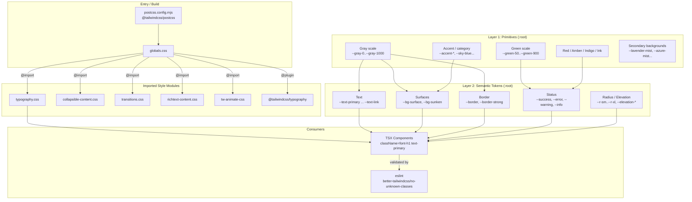
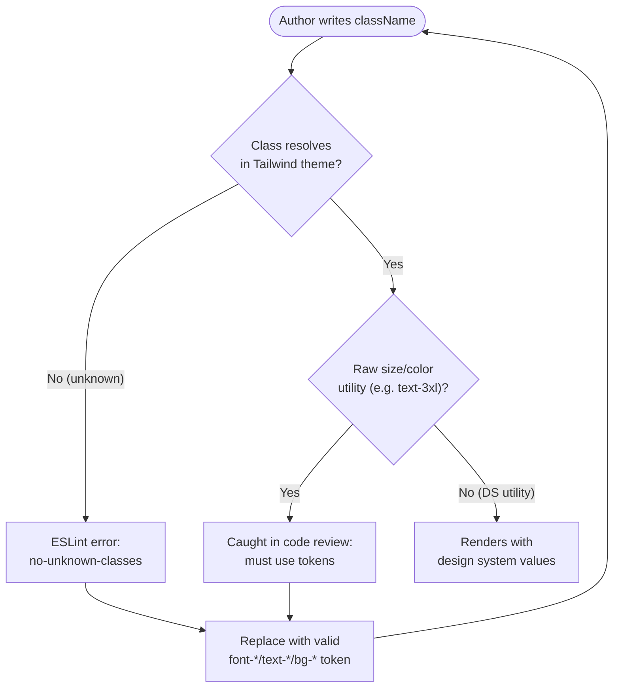

The OZEAON V2 design system is a two-layer CSS token architecture (primitives → semantic tokens) implemented with Tailwind CSS v4, exposing a curated set of typography utilities and color tokens that components are required to consume instead of raw Tailwind size/color classes.

## Purpose and Scope

This page documents the **foundational styling layer** of OZEAON V2: the CSS token system, typography scale, color/surface/border/status tokens, and the lint-level enforcement that keeps component code on the design system.

It deliberately covers:

- The two-layer token model (`@layer base` primitives and semantic tokens) in [`src/styles/globals.css`](https://github.com/ozeaon/ozeaon-v2/blob/0a4f1a95824db87782f1221a4108019d174df3d9/src/styles/globals.css)
- The typography utility library in [`src/styles/typography.css`](https://github.com/ozeaon/ozeaon-v2/blob/0a4f1a95824db87782f1221a4108019d174df3d9/src/styles/typography.css)
- How Tailwind CSS v4 is wired (`@import "tailwindcss"`, `@utility`, `@plugin`, PostCSS)
- The layout/page-type rules that consume these tokens (from `DESIGN-CONSISTENCY-PLAN.md`)
- Enforcement via ESLint `better-tailwindcss/no-unknown-classes`

It intentionally leaves to sibling pages:

- Individual component implementations (buttons, cards, navigation) — see the component library pages.
- Application routing, data access, and Supabase integration — see the respective platform pages.
- Deployment and build configuration beyond the PostCSS/Tailwind wiring needed to understand token compilation.

## Overview

OZEAON V2 uses **Tailwind CSS v4**, which moves theme configuration from a JavaScript `tailwind.config.ts` object into CSS itself using `@theme`, `@utility`, and `@layer` directives. The repository follows a strict three-tier philosophy:

| Tier | Location | Referenced by components? | Purpose |
|------|----------|---------------------------|---------|
| **Layer 1 — Primitives** | `:root` in `globals.css` | ❌ Never | Raw palette values (`--gray-500`, `--green-600`, `--red-600`) straight from Figma |
| **Layer 2 — Semantic tokens** | `:root` in `globals.css` | ✅ Indirectly (as Tailwind utilities) | Named roles (`--text-primary`, `--bg-surface`, `--border`, `--success`) |
| **Layer 3 — Utilities** | `@utility` in `typography.css` | ✅ Directly in JSX | `font-h1`, `font-body`, `text-primary`, `bg-bg-surface` |

The critical design constraint, stated explicitly at the top of the design system doc, is:

> ⚠️ Never use raw Tailwind size or color utilities. Use design system tokens from `src/styles/typography.css` and `src/styles/globals.css`.

Source: [design-system.md](https://github.com/ozeaon/ozeaon-v2/blob/0a4f1a95824db87782f1221a4108019d174df3d9/docs/design-system.md#L1-L4)

This rule exists so that a Figma variable rename or palette change is a single-file edit in `globals.css` rather than a repo-wide search-and-replace. The `@utility` mechanism also lets typography ship as *atomic, semantic* utilities (`font-body-semibold`) that encode a complete combination of font-family, size, weight, and line-height — something raw Tailwind utilities (`text-sm font-semibold`) cannot express as one unit.

## Architecture

The styling architecture is a layered pipeline: an entry stylesheet imports Tailwind and the local style modules; primitives feed semantic tokens; semantic tokens and typography utilities are what components actually consume.



**Why this shape:** primitives are grouped by palette family (gray, green, accent, status, secondary backgrounds) exactly as they appear in the Figma `OZEAON DESIGN 2.0` variable collections. Semantic tokens are grouped by *role* (text, surface, border, status, shape). This separation is what allows the same `--green-600` primitive to back both `--primary-green` and `--success` without the component layer ever knowing the underlying hex.

## Layer 1: Primitive Tokens

Primitives are declared in the `:root` block of `globals.css` under an explicit warning banner. They map one-to-one onto Figma variables and must never be referenced directly by components.

### Gray scale

The gray scale is the backbone of the text, surface, and border roles.

```css
/* ── Gray scale ── */
--gray-0: #ffffff;
--gray-50: #f7f8fa;
--gray-sm-hover: #f1f2f5; /* button SM hover — no Figma token */
--gray-100: #eff3fc;
--gray-200: #e4ecf6;
--gray-300: #d8e4f0;
--gray-400: #c5d4e6;
--gray-500: #a8bac8;
--gray-600: #94a6b2;
--gray-700: #8898a9;
--gray-800: #677888;
--gray-900: #4a5565;
--gray-950: #374150;
--gray-1000: #1c2b3a;
```

Source: [globals.css](https://github.com/ozeaon/ozeaon-v2/blob/0a4f1a95824db87782f1221a4108019d174df3d9/src/styles/globals.css#L16-L30)

Note the deliberate `--gray-sm-hover` entry annotated `no Figma token` — an escape hatch for interaction states that the design file does not define. It is still a Layer 1 value, so any change remains centralized.

### Green scale

The green scale serves as the brand primary and the success status, spanning 50 → 900.

```css
/* ── Green scale ── */
--green-50: #edfff3;
--green-75: #e7fae1;
--green-100: #c4fbcc;
--green-200: #7deea2;
--green-300: #36d47e;
--green-400: #00b18c;
--green-500: #009880;
--green-600: #00786f;
--green-700: #006059;
--green-800: #004540;
--green-900: #002b27;
```

Source: [globals.css](https://github.com/ozeaon/ozeaon-v2/blob/0a4f1a95824db87782f1221a4108019d174df3d9/src/styles/globals.css#L90-L101)

### Status and neutral primitives

Status hues (red, amber, indigo) and the `ink` neutral darks are primitives that back the semantic status and icon tokens:

```css
/* ── Red scale ── */
--red-50: #ffeaec;
--red-100: #ffd5d9;
--red-600: #a91e30;

/* ── Amber scale ── */
--amber-100: #f1dabf;
--amber-700: #72593c;

/* ── Indigo scale ── */
--indigo-100: #d5dafc;
--indigo-600: #424bb3;

/* ── Ink scale — neutral darks (no blue tint) ── */
--ink-900: #222222;
--ink-700: #33363f;
--ink-400: #7e869e;
```

Source: [globals.css](https://github.com/ozeaon/ozeaon-v2/blob/0a4f1a95824db87782f1221a4108019d174df3d9/src/styles/globals.css#L67-L83)

The `ink` scale is intentionally separate from the gray scale because icons in Figma use neutrally-dark fills (`fill_icon`, `Line_icon`, `Duotone`) with **no blue tint**, unlike the blue-tinted grey text scale. Keeping them distinct prevents an icon color from drifting when the text palette is retuned.

### Accent, category, and secondary background primitives

Decorative/secondary palettes live in the same layer:

```css
/* ── Accent primitives ── */
--accent-yellow-primitive: #fef3c6;
--accent-blue-primitive: #dbeafe;
--accent-green-primitive: #d4f1ed;
--accent-purple-primitive: #ede9fe;
--accent-pink-primitive: #fce7f3;

/* ── Secondary background primitives — Figma: color/secondary background/ ── */
--lavender-mist-primitive: #f9f4ff;
--lavender-1-primitive: #ece9ff;
--lavender-2-primitive: #d9dfec;
--lavender-3-primitive: #fdfdff;
--body-parchment-primitive: #f5f1ed;
--lavender-veil-primitive: #fde6ff;
--lavender-veil-2-primitive: #f3e8ff;
--lavender-blush-1-primitive: #ffeaed;
--lavender-blush-2-primitive: #f5e0e5;
--old-lace-primitive: #faf0dc;
--soft-blush-primitive: #fae8e4;
--azure-mist-primitive: #dff3f9;
--lemon-chiffon-primitive: #fdf5d0;
--eggshell-primitive: #f5edda;
--pale-sky-primitive: #d5e8f5;

/* ── Category color primitives — Figma: color/categories/ ── */
--sky-blue: #6bd3ff;
--ice-blue: #e6f8ff;
--golden-yellow: #ffd226;
--seafoam: #70ecbf;
--seafoam-light: #dcfcf1;
--wisteria: #c9b1fd;
--burnt-coral: #ea7a53;
--chartreuse: #b4f729;
--chartreuse-light: #efffce;
```

Source: [globals.css](https://github.com/ozeaon/ozeaon-v2/blob/0a4f1a95824db87782f1221a4108019d174df3d9/src/styles/globals.css#L32-L65)

These palettes support OZEAON's domain concepts — the "categories" set (Health-BioTech, seafoam, chartreuse) is used to visually distinguish project/organisation categories, while the secondary backgrounds provide soft, tinted surface areas used as section accents.

## Layer 2: Semantic Tokens

Semantic tokens are the **single source of truth** for the component layer. They never contain raw hex except where Figma hardcodes a value (e.g. dividers, overlays).

### Primary brand tokens

```css
/* ── Primary ── */
--primary-green: var(--green-600); /* Figma: color/primary/Primary Green */
--ozeaon-blue: var(--slate-blue); /* Figma: color/primary/Ozeaon Blue */
--ozeaon-blue-hover: #445a71; /* ozeaon-blue darkened ~10% for hover states */

/* ── Gradient (design asset, not a color token) ── */
--gradient-brand: linear-gradient(
  to right,
  rgba(76, 100, 126, 0.75),
  #00786f
);
```

Source: [globals.css](https://github.com/ozeaon/ozeaon-v2/blob/0a4f1a95824db87782f1221a4108019d174df3d9/src/styles/globals.css#L109-L119)

Design intent: `--ozeaon-blue-hover` is a *derived* value, not a Figma variable — it is the Ozeaon Blue darkened approximately 10% for hover feedback. It is documented as such so future maintainers know it is intentionally off-palette. Likewise `--gradient-brand` is explicitly labelled a *design asset*, not a color token, and reuses the `ozeaon-blue` and `green-600` hexes inline.

### Surfaces

```css
/* ── Surfaces — Figma: color/background/ ── */
--bg-surface: var(--gray-0); /* #ffffff */
--bg-light-cold: var(--gray-50); /* #f7f8fa */
--bg-subtle: var(--gray-100); /* #eff3fc */
--bg-sunken: var(--gray-200); /* #e4ecf6 */
--bg-inverse: var(--green-700); /* dark/brand surface — pair with --text-inverse */
--bg-neutral: var(--gray-50); /* Figma: neutral-light-gray (alias of bg-light-cold) */
```

Source: [globals.css](https://github.com/ozeaon/ozeaon-v2/blob/0a4f1a95824db87782f1221a4108019d174df3d9/src/styles/globals.css#L121-L131)

The surface scale is intentionally a *depth ramp*: `bg-surface` (white, raised) → `bg-neutral`/`bg-cold` (default) → `bg-subtle` (tag pills, hover) → `bg-sunken` (inset). `bg-inverse` provides a dark brand-facing surface and is documented to be paired with `--text-inverse`.

### Overlays

```css
/* ── Overlays ── */
--overlay-frosted: rgba(243, 247, 255, 0.8);
--overlay-scrim: rgba(26, 35, 48, 0.3);
--overlay-scrim-half: rgba(26, 35, 48, 0.5);
```

Source: [globals.css](https://github.com/ozeaon/ozeaon-v2/blob/0a4f1a95824db87782f1221a4108019d174df3d9/src/styles/globals.css#L133-L136)

Overlays are semi-transparent and therefore cannot alias a solid primitive; they are defined directly. `--overlay-frosted` backs blurred/frosted navigation surfaces, while the two scrims back modal and mega-menu backdrops at 30% and 50% opacity.

### Text, border, and icon roles

```css
/* ── Text — Figma: color/text/ ── */
--text-primary: var(--gray-1000); /* #1c2b3a */
--text-secondary: var(--gray-900); /* #4a5565 */
--text-muted: var(--gray-800); /* #677888 */
--text-subtle: var(--gray-700); /* #8898a9 */
--text-placeholder: var(--gray-600); /* #94a6b2 */
--text-soft: var(--neutral-400); /* Figma: text/soft-400 */
--text-link: var(--indigo-600); /* #424bb3 */
--text-inverse: var(--gray-0);

/* ── Border — Figma: color/background/border-* ── */
--border: var(--gray-300); /* #d8e4f0 */
--border-strong: var(--gray-400); /* #c5d4e6 */
--border-stronger: var(--gray-600); /* #94a6b2 — mid-contrast, e.g. card section dividers */
--border-focus: var(--gray-800); /* #677888 */
--divider: var(--divider-gray); /* Figma: Stroke — intentionally off gray scale */

/* ── Icon — hardcoded per Figma, not gray-scale aliases ── */
--icon: var(--ink-900); /* Figma: fill_icon */
--icon-muted: var(--ink-400); /* Figma: Duotone */
--icon-stroke-dark: var(--ink-700); /* Figma: Line_icon */
```

Source: [globals.css](https://github.com/ozeaon/ozeaon-v2/blob/0a4f1a95824db87782f1221a4108019d174df3d9/src/styles/globals.css#L138-L162)

Design intent worth calling out:

- The text scale is a **named contrast ladder** (`primary` → `secondary` → `muted` → `subtle` → `placeholder`), each step mapping to a progressively lighter gray. This gives designers a vocabulary for hierarchy rather than raw numbers.
- `--text-link` deliberately breaks from the gray scale and uses indigo, because links must be visually distinct from body copy without relying on underline alone (accessibility).
- `--divider` points at `--divider-gray` (`#ecedf0`), which is annotated *intentionally off gray scale* — the Figma `Stroke` variable is a one-off.
- Borders expose four levels of strength (`border`, `border-strong`, `border-stronger`, `border-focus`), with `border-focus` reserved for focus rings.

### Status / functional tokens

```css
/* ── Status — Figma: color/functional/ ── */
--success: var(--green-600); /* #00786f — same primitive as --primary-green today */
--success-hover: var(--green-700); /* #006059 — hover state for bg-success */
--success-surface: var(--green-50); /* #edfff3 */
--error: var(--red-600);
--error-surface: var(--red-50);
--error-surface-hover: var(--red-100); /* #ffd5d9 — hover state for bg-error-surface */
--warning: var(--amber-700);
--warning-surface: var(--amber-100);
--info: var(--indigo-600);
--info-surface: var(--indigo-100);
```

Source: [globals.css](https://github.com/ozeaon/ozeaon-v2/blob/0a4f1a95824db87782f1221a4108019d174df3d9/src/styles/globals.css#L166-L182)

Each status family is a **trio**: a foreground/mid tone (`--error`), a hover tone for interactive status elements (`--error-surface-hover`), and a soft fill (`--error-surface`). The comment noting that `--success` and `--primary-green` share the same primitive today is an important maintainability signal: they are aliased separately so they can diverge later without a breaking change.

### Radius and elevation

```css
/* ── Radius — prefixed --r- to avoid self-reference in @theme inline ── */
--r-sm: 0.5rem; /* 8px  — Figma: radius-8 */
--r-md: 0.75rem; /* 12px */
--r-lg: 1rem; /* 16px */
--r-xl: 1.125rem; /* 18px */

/* ── Elevation — Figma: Elevation WIP ── */
--elevation-xs: 0 2px 2px -1px rgba(0, 0, 0, 0.25);
--elevation-sm: 0 1px 4px rgba(0, 0, 0, 0.06), inset 0 0 0.5px rgba(0, 0, 0, 0.1);
--elevation-md:
  2px 2px 2px -1px rgba(54, 65, 83, 0.25),
  -2px 2px 2px -1px rgba(54, 65, 83, 0.25);
--elevation-fab:
  -4px 4px 4px -1px rgba(54, 65, 83, 0.25),
  4px 4px 2px -1px rgba(54, 65, 83, 0.25);
```

Source: [globals.css](https://github.com/ozeaon/ozeaon-v2/blob/0a4f1a95824db87782f1221a4108019d174df3d9/src/styles/globals.css#L184-L199)

Two design notes:

1. The radius variables are prefixed `--r-` **specifically to avoid self-reference when mapped inside `@theme inline`** — a Tailwind v4 gotcha where `--radius-sm: var(--radius-sm)` would resolve to itself.
2. `--elevation-fab` uses *directional, asymmetric* shadows (negative-then-positive offsets) to give a floating-action-button a lifted, cast-light appearance, distinct from the symmetric ambient `--elevation-sm`. Elevation is marked **WIP** in Figma, signalling that these values are not yet final.

## Typography System

The type system lives in `src/styles/typography.css` and is authored entirely with Tailwind v4's `@utility` directive. Each utility is a *complete* typographic recipe: font-family, size, weight, and line-height are bound together so a caller writes `font-h2` instead of `text-2xl font-bold leading-8`.

The file opens by documenting its provenance and a key invariant:

```css
/**
 * Typography System
 *
 * Type scale from Figma OZEAON-DESIGN-2.0
 * Font families: Manrope (all non-mono), DM Mono (code), Lora (content title serif)
 * Line heights are exact px values, not ratios
 */
```

Source: [typography.css](https://github.com/ozeaon/ozeaon-v2/blob/0a4f1a95824db87782f1221a4108019d174df3d9/src/styles/typography.css#L1-L7)

The statement **"Line heights are exact px values, not ratios"** is a deliberate design decision: contrast between the display and body scales depends on fixed leading from the design file, so the utilities use pixel line-heights (`48px`, `36px`, `26px`) rather than Tailwind's default relative `leading-*` multipliers. The exception is body-copy utilities, which use `1.65` as a unitless ratio to remain fluid across the responsive font-size overrides.

### Font families

Three families are wired:

| Variable | Family | Used by |
|----------|--------|---------|
| `--font-sans` | **Manrope** | All non-mono text: body, headings, buttons, labels |
| `--font-mono` | **DM Mono** | Code, filled inputs |
| `--font-heading` | **Lora** (content title serif) | Editorial "Content Title" utilities |

Source: [design-system.md](https://github.com/ozeaon/ozeaon-v2/blob/0a4f1a95824db87782f1221a4108019d174df3d9/docs/design-system.md#L33-L36), [typography.css](https://github.com/ozeaon/ozeaon-v2/blob/0a4f1a95824db87782f1221a4108019d174df3d9/src/styles/typography.css#L4-L5)

### Type scale utilities

The scale is organized into four families — display/heading, body, label/caption, and mono/content-title.

```css
@utility font-display {
  font-family: var(--font-sans);
  font-size: 40px;
  font-weight: 700;
  line-height: 48px;
}

@utility font-h1 {
  font-family: var(--font-sans);
  font-size: 32px;
  font-weight: 700;
  line-height: 36px;
}

@utility font-h2 {
  font-family: var(--font-sans);
  font-size: 24px;
  font-weight: 700;
  line-height: 32px;
}

@utility font-h3 {
  font-family: var(--font-sans);
  font-size: 18px;
  font-weight: 700;
  line-height: 26px;
}

@utility font-h4 {
  font-family: var(--font-sans);
  font-size: 15px;
  font-weight: 500;
  line-height: 20px;
}
```

Source: [typography.css](https://github.com/ozeaon/ozeaon-v2/blob/0a4f1a95824db87782f1221a4108019d174df3d9/src/styles/typography.css#L13-L46)

Note the deliberate weight drop from `font-h3` (700) to `font-h4` (500): h4 is used for card titles where a full bold would compete with the section heading. The size also drops to 15px — the h4 is a *sub* title, not a peer of h1–h3.

### Responsive body utilities

Body utilities use a **container-query-free media query** that shrinks the font size in the tablet band only, so large displays keep a comfortable reading size while mid-size screens tighten up:

```css
@utility font-body-lg {
  font-family: var(--font-sans);
  font-size: 18px;
  font-weight: 400;
  line-height: 1.65;

  @media (min-width: 40rem) and (max-width: 96rem) {
    font-size: 16px;
  }
}

@utility font-body {
  font-family: var(--font-sans);
  font-size: 16px;
  font-weight: 400;
  line-height: 1.65;

  @media (min-width: 40rem) and (max-width: 96rem) {
    font-size: 15px;
  }
}
```

Source: [typography.css](https://github.com/ozeaon/ozeaon-v2/blob/0a4f1a95824db87782f1221a4108019d174df3d9/src/styles/typography.css#L48-L68)

Design intent: the band `40rem → 96rem` (640px → 1536px) covers tablet through desktop. Inside it, the body size steps down one notch; outside it (mobile <640px and ultrawide >1536px) the larger size applies. This is the reverse of the usual mobile-first pattern and reflects the design team's intent that body copy should not get *too large* on a laptop, while phones and very wide displays stay comfortable.

### Emphasis and label utilities

Weight variants are separate utilities rather than Tailwind modifiers, so the size/weight/leading triple is always valid:

```css
@utility font-label {
  font-family: var(--font-sans);
  font-size: 12px;
  font-weight: 600;
  line-height: 15px;
}

@utility font-label-sm {
  font-family: var(--font-sans);
  font-size: 11px;
  font-weight: 500;
  line-height: 14px;
}

@utility font-caption {
  font-family: var(--font-sans);
  font-size: 11px;
  font-weight: 400;
  line-height: 14px;
}

@utility font-caption-xs {
  font-family: var(--font-sans);
  font-size: 10px;
  font-weight: 500;
  line-height: 15px;
}
```

Source: [typography.css](https://github.com/ozeaon/ozeaon-v2/blob/0a4f1a95824db87782f1221a4108019d174df3d9/src/styles/typography.css#L77-L103)

```css
@utility font-body-semibold {
  font-family: var(--font-sans);
  font-size: 14px;
  font-weight: 600;
  line-height: 1.65;
}

@utility font-body-sm-semibold {
  font-family: var(--font-sans);
  font-size: 13px;
  font-weight: 600;
  line-height: 1.65;
}

@utility font-body-lg-semibold {
  font-family: var(--font-sans);
  font-size: 16px;
  font-weight: 600;
  line-height: 1.65;
}
```

Source: [typography.css](https://github.com/ozeaon/ozeaon-v2/blob/0a4f1a95824db87782f1221a4108019d174df3d9/src/styles/typography.css#L112-L138)

The `…-medium` / `…-semibold` suffixes encode emphasis levels 500 and 600 on top of the same 13/14/16px body sizes, giving the component layer a consistent "emphasized body" vocabulary (e.g. prominent metadata vs. large card titles).

### Mono utilities

```css
@utility font-mono {
  font-family: var(--font-mono);
  font-size: 13px;
  font-weight: 400;
  line-height: 16px;
}

@utility font-mono-sm {
  font-family: var(--font-mono);
  font-size: 11px;
  font-weight: 400;
  line-height: 14px;
}

@utility font-mono-lg {
  font-family: var(--font-mono);
  font-size: 16px;
  font-weight: 400;
  line-height: 18px;
}
```

Source: [typography.css](https://github.com/ozeaon/ozeaon-v2/blob/0a4f1a95824db87782f1221a4108019d174df3d9/src/styles/typography.css#L147-L166)

### Content-title (serif) utilities

The editorial "Content Title" utilities are the only non-sans utilities and use `--font-heading` (Lora), tying article/editorial headings to a serif voice distinct from the platform UI:

```css
@utility font-content-title-sm {
  font-family: var(--font-heading);
  font-size: 18px;
  font-weight: 400;
  line-height: 24px;
}

@utility font-content-title {
  font-family: var(--font-heading);
  font-size: 24px;
  font-weight: 500;
  line-height: 32px;
}

@utility font-content-title-md {
  font-family: var(--font-heading);
  font-size: 26px;
  font-weight: 500;
  line-height: 32px;
}

@utility font-content-title-lg {
  font-family: var(--font-heading);
  font-size: 32px;
  font-weight: 500;
  line-height: 36px;
}
```

Source: [typography.css](https://github.com/ozeaon/ozeaon-v2/blob/0a4f1a95824db87782f1221a4108019d174df3d9/src/styles/typography.css#L168-L194)

### Base element styles

The typography module also installs base styles so raw HTML elements are correct by default — before any utility is applied:

```css
@layer base {
  html {
    font-family: var(--font-sans);
    font-size: 16px;
    -webkit-font-smoothing: antialiased;
    -moz-osx-font-smoothing: grayscale;
  }

  h1,
  h2,
  h3 {
    font-family: var(--font-sans);
    font-weight: 700;
    color: var(--text-primary);
  }

  h4,
  h5,
  h6 {
    font-family: var(--font-sans);
    font-weight: 600;
    color: var(--text-primary);
  }

  h1 {
    @apply font-h1;
  }

  h2 {
    @apply font-h2;
  }

  h3 {
    @apply font-h3;
  }
}
```

Source: [typography.css](https://github.com/ozeaon/ozeaon-v2/blob/0a4f1a95824db87782f1221a4108019d174df3d9/src/styles/typography.css#L204-L238)

Design intent: headings are bound to `--text-primary` at the base layer, and h1–h3 `@apply` the exact same utilities the design system exposes. This means an author who writes a plain `<h2>` and one who writes `<div className="font-h2">` get identical rendering — removing a common source of visual drift between semantic HTML and utility-styled markup. `font-smoothing` is enabled on `html` so text renders consistently across macOS and Windows.

### Full type scale reference

| Utility | Family | Size | Weight | Line-height | Use for |
|---------|--------|------|--------|-------------|---------|
| `font-display` | Manrope | 40px | 700 | 48px | Hero headings |
| `font-h1` | Manrope | 32px | 700 | 36px | Page titles |
| `font-h2` | Manrope | 24px | 700 | 32px | Section titles |
| `font-h3` | Manrope | 18px | 700 | 26px | Sub titles |
| `font-h4` | Manrope | 15px | 500 | 20px | Card titles |
| `font-body-lg` | Manrope | 18/16px | 400 | 1.65 | Lead paragraphs |
| `font-body` | Manrope | 16/15px | 400 | 1.65 | Body |
| `font-body-sm` | Manrope | 13px | 400 | 16px | Secondary text |
| `font-body-medium` | Manrope | 14px | 500 | 1.65 | Emphasized body |
| `font-body-semibold` | Manrope | 14px | 600 | 1.65 | Prominent body |
| `font-body-sm-medium` | Manrope | 13px | 500 | 1.65 | Compact emphasized |
| `font-body-sm-semibold` | Manrope | 13px | 600 | 1.65 | Compact prominent |
| `font-body-lg-semibold` | Manrope | 16px | 600 | 1.65 | Large card titles |
| `font-label` | Manrope | 12px | 600 | 15px | Labels |
| `font-label-medium` | Manrope | 12px | 500 | 15px | Soft labels |
| `font-label-sm` | Manrope | 11px | 500 | 14px | Badge text |
| `font-caption` | Manrope | 11px | 400 | 14px | Captions |
| `font-caption-xs` | Manrope | 10px | 500 | 15px | Micro captions |
| `font-mono` | DM Mono | 13px | 400 | 16px | Code, filled inputs |
| `font-mono-sm` | DM Mono | 11px | 400 | 14px | Inline code |
| `font-mono-lg` | DM Mono | 16px | 400 | 18px | Large code |
| `font-content-title` | Lora | 24px | 500 | 32px | Editorial title |
| `font-content-title-md` | Lora | 26px | 500 | 32px | Editorial title MD |
| `font-content-title-lg` | Lora | 32px | 500 | 36px | Editorial title LG |
| `font-content-title-sm` | Lora | 18px | 400 | 24px | Editorial title SM |
| `font-inherit` | inherit | inherit | — | — | Reset size to inherit |

Source: [typography.css](https://github.com/ozeaon/ozeaon-v2/blob/0a4f1a95824db87782f1221a4108019d174df3d9/src/styles/typography.css#L13-L198), [design-system.md](https://github.com/ozeaon/ozeaon-v2/blob/0a4f1a95824db87782f1221a4108019d174df3d9/docs/design-system.md#L6-L18)

## Token-to-Utility Mapping

Components consume the design system through Tailwind utility classes derived from the semantic tokens. The canonical color surface documented for authors is:

### Text colors

| Utility | Token | Hex | Use for |
|---------|-------|-----|---------|
| `text-primary` | `--text-primary` | `#1c2b3a` | Primary text |
| `text-secondary` | `--text-secondary` | `#4a5565` | Secondary text |
| `text-muted` | `--text-muted` | `#677888` | Muted text |
| `text-subtle` | `--text-subtle` | `#8898a9` | Subtle text |
| `text-placeholder` | `--text-placeholder` | `#94a6b2` | Placeholders |
| `text-link` | `--text-link` | `#424bb3` | Links |

Source: [design-system.md](https://github.com/ozeaon/ozeaon-v2/blob/0a4f1a95824db87782f1221a4108019d174df3d9/docs/design-system.md#L20)

### Backgrounds

| Utility | Token | Hex | Use for |
|---------|-------|-----|---------|
| `bg-bg-surface` | `--bg-surface` | `#ffffff` | Cards, panels |
| `bg-bg-cold` | `--bg-light-cold` | `#f7f8fa` | Default button bg |
| `bg-bg-neutral` | `--bg-neutral` | `#f7f8fa` | Input backgrounds |
| `bg-bg-subtle` | `--bg-subtle` | `#eff3fc` | Tag pills, button hover states |
| `bg-bg-sunken` | `--bg-sunken` | `#e4ecf6` | Inset sections |
| `bg-lavender-mist` | `--lavender-mist-primitive` | `#f9f4ff` | Soft accent areas |

Source: [design-system.md](https://github.com/ozeaon/ozeaon-v2/blob/0a4f1a95824db87782f1221a4108019d174df3d9/docs/design-system.md#L22-L31)

### Figma variable correspondence

`DESIGN-CONSISTENCY-PLAN.md` records the exact Figma variable paths that back these tokens, which is useful when auditing a component against the design file:

```
color/text/text-primary        #1c2b3a
color/text/text-secondary      #4a5565
color/text/text-muted          #677888
color/text/text-subtle         #8898a9
color/text/text-placeholder    #94a6b2
color/text/text-link           #424bb3
color/background/bg-surface    #ffffff
color/background/bg-cold       #f7f8fa
color/background/bg-subtle     #eff3fc
color/background/bg-sunken     #e4ecf6
color/background/border-default              #d8e4f0
color/background/overlay-scrim-default       #1a233080
color/background/overlay-frosted             #f3f7ffcc
color/primary/Primary Green            #00786f
color/primary/Ozeaon Blue              #4c647e
```

Source: [DESIGN-CONSISTENCY-PLAN.md](https://github.com/ozeaon/ozeaon-v2/blob/0a4f1a95824db87782f1221a4108019d174df3d9/DESIGN-CONSISTENCY-PLAN.md#L51-L80)

Note that Figma expresses overlays as 8-digit hex with alpha (`#1a233080` = scrim at 50%, `#f3f7ffcc` = frosted at 80%), which maps directly onto the `rgba()` overlay tokens in `globals.css`.

## Tailwind v4 Wiring

The build uses Tailwind CSS v4 through PostCSS. There is **no JavaScript Tailwind config object** driving theme values — the theme is CSS.

The PostCSS plugin chain is minimal:

```js
plugins: {
  "@tailwindcss/postcss": {},
  autoprefixer: {},
}
```

Source: [postcss.config.mjs](https://github.com/ozeaon/ozeaon-v2/blob/0a4f1a95824db87782f1221a4108019d174df3d9/postcss.config.mjs#L3-L5)

`components.json` still declares a `tailwind.config.ts` path for shadcn-compatibility tooling, but the runtime theme comes from CSS:

```json
"tailwind": {
    "config": "tailwind.config.ts",
```

Source: [components.json](https://github.com/ozeaon/ozeaon-v2/blob/0a4f1a95824db87782f1221a4108019d174df3d9/components.json#L6-L7)

The entry stylesheet `globals.css` orchestrates everything with imports and a plugin registration:

```css
@import "tailwindcss" source("../../src/");
@import "tw-animate-css";
@import "./typography.css";
@import "./collapsible-content.css";
@import "./transitions.css";
@import "./richtext-content.css";

@plugin "@tailwindcss/typography";
```

Source: [globals.css](https://github.com/ozeaon/ozeaon-v2/blob/0a4f1a95824db87782f1221a4108019d174df3d9/src/styles/globals.css#L1-L8)

Key details:

- `@import "tailwindcss" source("../../src/")` scopes content scanning to `src/`, so class detection does not walk `node_modules`, design docs, or build output.
- `tw-animate-css` provides the animation utility set used by collapsible/transition components.
- The four local modules (`typography`, `collapsible-content`, `transitions`, `richtext-content`) are imported **before** the plugin registration, so their `@utility` definitions exist regardless of plugin order.
- `@plugin "@tailwindcss/typography"` activates the `prose` class family used by the rich-text editor renderer.

### Style module roles

| Module | Responsibility |
|--------|----------------|
| `typography.css` | Type scale `@utility` definitions + base heading styles |
| `collapsible-content.css` | Styling for collapsible/accordion content regions |
| `transitions.css` | Shared transition/animation timing utilities |
| `richtext-content.css` | Rich-text (TipTap) rendered content styling; paired with the `prose` plugin |

Source: [globals.css](https://github.com/ozeaon/ozeaon-v2/blob/0a4f1a95824db87782f1221a4108019d174df3d9/src/styles/globals.css#L3-L6)

The existence of a dedicated `richtext-content.css` alongside `@tailwindcss/typography` reflects a common pattern: the plugin supplies the *baseline* editorial CSS, while the local module layers OZEAON's own type scale and tokens on top so user-authored content matches the platform's voice.

## Usage Examples

Because the foundation layer is CSS, there is no TypeScript entry point — usage is via `className`. The following examples come from the documented consumption patterns.

### Correct — design system utilities

```tsx
<h1 className="font-h1 text-primary">Projects</h1>
<p className="font-body text-secondary">Discover ocean conservation work.</p>
<div className="bg-bg-surface border border-default rounded-lg p-4">
  <h4 className="font-h4 text-primary">Card title</h4>
  <span className="font-label-sm bg-bg-subtle text-muted rounded-full px-2">Badge</span>
</div>
<code className="font-mono text-subtle">pnpm dev</code>
```

Source: derived from the utility/token tables in [design-system.md](https://github.com/ozeaon/ozeaon-v2/blob/0a4f1a95824db87782f1221a4108019d174df3d9/docs/design-system.md#L6-L31) and [typography.css](https://github.com/ozeaon/ozeaon-v2/blob/0a4f1a95824db87782f1221a4108019d174df3d9/src/styles/typography.css#L13-L198)

### Incorrect — raw Tailwind size/color utilities (forbidden)

```tsx
{/* ❌ raw sizes and colors bypass the design system */}
<h1 className="text-3xl font-bold text-gray-900">Projects</h1>
<p className="text-sm text-gray-600">Discover ocean conservation work.</p>
```

Source: forbidden by the rule in [design-system.md](https://github.com/ozeaon/ozeaon-v2/blob/0a4f1a95824db87782f1221a4108019d174df3d9/docs/design-system.md#L3-L4)

The prohibition exists because raw utilities bind components to arbitrary scale values. If the design team shifts `h1` from 32px to 34px, every `text-3xl` in the codebase is silently wrong, whereas every `font-h1` updates automatically.

### Layout composition using tokens

The navigation/layout spec demonstrates composition of semantic tokens for surfaces, overlays, and radii in real component structure:

```tsx
<div className="flex items-center gap-8">
```

Source: [DESIGN-CONSISTENCY-PLAN.md](https://github.com/ozeaon/ozeaon-v2/blob/0a4f1a95824db87782f1221a4108019d174df3d9/DESIGN-CONSISTENCY-PLAN.md#L239-L240)

The structural rules also reference the token-driven content width and sticky behavior:

- Content max-width is **1048px** and never stretches beyond that.
- The left sidebar uses `position: sticky` so navigation stays visible on long scroll.
- The outer desktop container uses `md:min-w-[1024px]` to prevent collapse below tablet rules.

Source: [DESIGN-CONSISTENCY-PLAN.md](https://github.com/ozeaon/ozeaon-v2/blob/0a4f1a95824db87782f1221a4108019d174df3d9/DESIGN-CONSISTENCY-PLAN.md#L158-L163)

## Layout Foundations

The design system's tokens feed a documented **page-type taxonomy** that governs layout. This is included because the layout consumes the token layer directly (surface colors, breakpoints, column widths) and is part of the foundation contract.

| Page type | Examples | Sidebar default | Right rail | Main width |
|-----------|----------|-----------------|------------|------------|
| `feed` | `/`, `/projects`, `/articles`, `/community`, `/organisations` | Open | None | 1048px |
| `single-entity` | `/projects/[slug]`, `/articles/[slug]`, `/organisations/[handle]`, `/profile/[handle]` | Closed | Retained (reader `@sidebar` slot) | 1048px |
| `settings` | `/settings/profile*`, `/settings/organisation*` | `AppSidebar` not rendered; `DashboardSidebar` shown | None | 1048px |
| editor (no provider) | `/projects/new`, `/projects/[slug]/edit`, article/organisation create/edit | Not rendered (`useSidebarSafe` fallback) | None | `max-w-7xl` |

Source: [DESIGN-CONSISTENCY-PLAN.md](https://github.com/ozeaon/ozeaon-v2/blob/0a4f1a95824db87782f1221a4108019d174df3d9/DESIGN-CONSISTENCY-PLAN.md#L112-L117)

### Column widths and gutters

- **Sidebar open**: left bar 232px · main content 1048px
- **Sidebar closed**: main content 1048px centred, 116px gutters each side

| Viewport | Left bar | Remaining | Main | Gutter each side |
|----------|----------|-----------|------|------------------|
| 1280px | 232px | 1048px | 1048px | 0px |
| 1600px | 232px | 1368px | 1048px | 160px |
| 1920px | 232px | 1688px | 1048px | 320px |

Source: [DESIGN-CONSISTENCY-PLAN.md](https://github.com/ozeaon/ozeaon-v2/blob/0a4f1a95824db87782f1221a4108019d174df3d9/DESIGN-CONSISTENCY-PLAN.md#L121-L140)

### Breakpoints

| Range | Name | Behaviour |
|-------|------|-----------|
| <768px | Mobile | Single column; no sidebar; mega menu covers screen |
| 768–1024px | Tablet | Icon-only sidebar (40px) |
| 1024–1280px | Desktop | Full layout; content fills available width |
| 1280–1600px | Large | Content block centres; small gutters open |
| >1600px | XL / Wide | Content block stays fixed; gutters grow |

Source: [DESIGN-CONSISTENCY-PLAN.md](https://github.com/ozeaon/ozeaon-v2/blob/0a4f1a95824db87782f1221a4108019d174df3d9/DESIGN-CONSISTENCY-PLAN.md#L150-L156)

Note the interaction between these breakpoints and the typography overrides: the `40rem–96rem` (640px–1536px) band in `font-body-lg` and `font-body` overlaps the tablet and desktop ranges, so body text tightens exactly in the mid-range widths where the layout is densest.

## Enforcement

The design system is not merely documented — it is **enforced at lint time**. ESLint is configured with the `better-tailwindcss` plugin, which validates that every Tailwind class used in the codebase resolves to a real utility.

```js
import tailwindcss from "eslint-plugin-better-tailwindcss";
```

Source: [eslint.config.mjs](https://github.com/ozeaon/ozeaon-v2/blob/0a4f1a95824db87782f1221a4108019d174df3d9/eslint.config.mjs#L5)

```js
{
  plugins: { "better-tailwindcss": tailwindcss },
  rules: {
```

Source: [eslint.config.mjs](https://github.com/ozeaon/ozeaon-v2/blob/0a4f1a95824db87782f1221a4108019d174df3d9/eslint.config.mjs#L23-L25)

The core rule is `better-tailwindcss/no-unknown-classes`, set to `error`:

```js
export default {
  "better-tailwindcss/no-unknown-classes": [
    "error",
```

Source: [eslint.rules.base.mjs](https://github.com/ozeaon/ozeaon-v2/blob/0a4f1a95824db87782f1221a4108019d174df3d9/eslint.rules.base.mjs#L1-L3)

**Why this matters:** Because the design system defines typography through `@utility` (which creates *new* utility names like `font-h1`), a typo such as `font-h11` or a stale class such as `text-body` would otherwise silently compile to nothing. `no-unknown-classes` turns these silent failures into hard errors, so the design system's utility vocabulary stays authoritative. Combined with the documented "never use raw Tailwind size or color utilities" rule, this gives a two-part guarantee: unknown classes fail loudly, and raw-scale classes are caught in review.



## Failure Modes, Edge Cases & Consistency Concerns

### Self-referencing theme variables

The radius tokens carry an explicit warning about Tailwind v4 `@theme inline` behavior:

```css
/* ── Radius — prefixed --r- to avoid self-reference in @theme inline ── */
--r-sm: 0.5rem; /* 8px  — Figma: radius-8 */
```

Source: [globals.css](https://github.com/ozeaon/ozeaon-v2/blob/0a4f1a95824db87782f1221a4108019d174df3d9/src/styles/globals.css#L184-L185)

If a variable were named `--radius-sm` and simultaneously mapped as `--radius-sm: var(--radius-sm)` inside `@theme inline`, the declaration would resolve to itself and produce an empty/invalid value. The `--r-` prefix breaks the name collision. This is a concrete, non-obvious edge case that the naming convention exists to prevent.

### Aliased tokens that share a primitive today

```css
--success: var(--green-600); /* #00786f — same primitive as --primary-green today */
```

Source: [globals.css](https://github.com/ozeaon/ozeaon-v2/blob/0a4f1a95824db87782f1221a4108019d174df3d9/src/styles/globals.css#L167-L169)

`--success` and `--primary-green` currently resolve to the same hex. This is *intentional aliasing*, not duplication: if the brand primary ever diverges from the success color, only the semantic token definition changes. Refactoring these into a single token would remove that future flexibility and is therefore the wrong "cleanup."

### Off-palette tokens

Two semantic tokens are deliberately documented as breaking the palette:

- `--divider: var(--divider-gray)` — *Figma: Stroke — intentionally off gray scale*
- `--ozeaon-blue-hover: #445a71` — *ozeaon-blue darkened ~10% for hover states*

Source: [globals.css](https://github.com/ozeaon/ozeaon-v2/blob/0a4f1a95824db87782f1221a4108019d174df3d9/src/styles/globals.css#L112), [globals.css](https://github.com/ozeaon/ozeaon-v2/blob/0a4f1a95824db87782f1221a4108019d174df3d9/src/styles/globals.css#L155-L157)

These are **not bugs**. The inline comments exist precisely so that a future palette audit does not "fix" them and break the design intent.

### Interaction state coverage gaps

The presence of `--gray-sm-hover` annotated `button SM hover — no Figma token` reveals an edge case: some interaction states were designed in code before the Figma variable existed. The token was added rather than inlining a raw hex, so the gap is centralized and can be retrofitted into Figma later.

### Responsive typography boundary behavior

The `font-body` and `font-body-lg` media queries use **inclusive** `min-width: 40rem` and `max-width: 96rem` bounds. At exactly `40rem` (640px) and `96rem` (1536px) the reduced size applies, since both conditions are satisfied. This means the reduced size is active across a closed interval, with no gap between the mobile and tablet bands. Line-height is declared as the unitless `1.65` precisely so it scales with whichever `font-size` wins.

## Extension Points

### Adding a new typographic style

Add a new `@utility` block to `typography.css` following the existing pattern: declare `font-family`, then `font-size`, `font-weight`, and an **exact pixel** `line-height` (unless it is body-style fluid copy, in which case use a unitless ratio plus the standard `40rem–96rem` media override). Because `no-unknown-classes` validates against defined utilities, the new name becomes immediately enforceable.

### Adding a new color role

1. Add the raw value as a **Layer 1 primitive** in the `:root` block of `globals.css`, with a comment naming its Figma variable path.
2. Add the **Layer 2 semantic alias** referencing that primitive.
3. Reference the semantic value only through the Tailwind utility derived from it — never the primitive.

This ordering is what keeps the "never reference primitives in components" invariant mechanically checkable.

### Adding a new style module

Create the CSS file under `src/styles/`, then add an `@import` line to `globals.css` alongside the existing module imports. The Tailwind `source("../../src/")` scope already covers `src/`, so no config change is required for class detection.

## Related Links

- [src/styles/globals.css](https://github.com/ozeaon/ozeaon-v2/blob/0a4f1a95824db87782f1221a4108019d174df3d9/src/styles/globals.css) — Layer 1 primitives and Layer 2 semantic tokens
- [src/styles/typography.css](https://github.com/ozeaon/ozeaon-v2/blob/0a4f1a95824db87782f1221a4108019d174df3d9/src/styles/typography.css) — Type scale `@utility` definitions and base heading styles
- [src/styles/collapsible-content.css](https://github.com/ozeaon/ozeaon-v2/blob/0a4f1a95824db87782f1221a4108019d174df3d9/src/styles/collapsible-content.css) — Collapsible content styling module
- [src/styles/transitions.css](https://github.com/ozeaon/ozeaon-v2/blob/0a4f1a95824db87782f1221a4108019d174df3d9/src/styles/transitions.css) — Shared transition/animation utilities
- [src/styles/richtext-content.css](https://github.com/ozeaon/ozeaon-v2/blob/0a4f1a95824db87782f1221a4108019d174df3d9/src/styles/richtext-content.css) — Rich-text (TipTap) rendered content styling
- [docs/design-system.md](https://github.com/ozeaon/ozeaon-v2/blob/0a4f1a95824db87782f1221a4108019d174df3d9/docs/design-system.md) — Author-facing typography & color system reference
- [DESIGN-CONSISTENCY-PLAN.md](https://github.com/ozeaon/ozeaon-v2/blob/0a4f1a95824db87782f1221a4108019d174df3d9/DESIGN-CONSISTENCY-PLAN.md) — Navigation/layout specification and Figma variable mapping
- [postcss.config.mjs](https://github.com/ozeaon/ozeaon-v2/blob/0a4f1a95824db87782f1221a4108019d174df3d9/postcss.config.mjs) — `@tailwindcss/postcss` plugin chain
- [components.json](https://github.com/ozeaon/ozeaon-v2/blob/0a4f1a95824db87782f1221a4108019d174df3d9/components.json) — shadcn component configuration
- [eslint.config.mjs](https://github.com/ozeaon/ozeaon-v2/blob/0a4f1a95824db87782f1221a4108019d174df3d9/eslint.config.mjs) — `better-tailwindcss` plugin registration
- [eslint.rules.base.mjs](https://github.com/ozeaon/ozeaon-v2/blob/0a4f1a95824db87782f1221a4108019d174df3d9/eslint.rules.base.mjs) — `no-unknown-classes` rule definition
