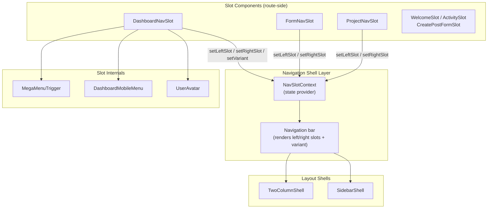
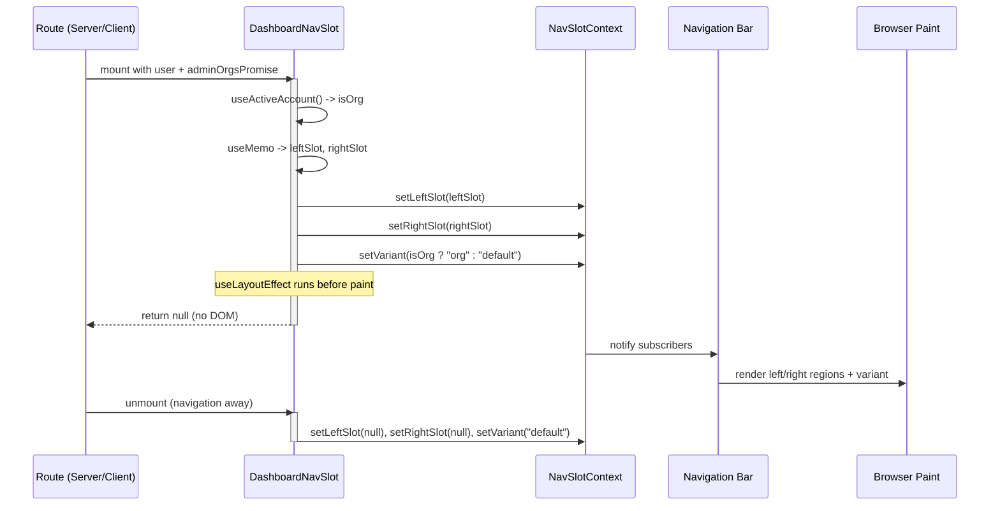

The navigation shell provides a persistent app chrome whose interior regions (left slot, right slot, and visual variant) are filled dynamically by *nav slots*, while layout shells (`TwoColumnShell`, `SidebarShell`) provide reusable page-level scaffolding for two-region layouts.

## Purpose and Scope

This page documents the **navigation shell and slot system** and the **layout shell primitives** that make up Ozeaon's structural UI layer:

- The **slot contract** — how a route contributes content into the navigation bar without owning its markup (`NavSlotContext`, `useNavSlot`).
- The **slot implementations** — `DashboardNavSlot`, `FormNavSlot`, `ProjectNavSlot`, and the home `*Slot` components that push content into the shell.
- The **layout shells** — `TwoColumnShell` and `SidebarShell`, the reusable page-level two-region scaffolds exported from `src/components/ui/layout`.

Related design-system concerns are documented on sibling pages: for the underlying visual primitives (buttons, cards, avatars) see the UI component library; for the form lifecycle that `FormNavSlot` participates in see the forms/hooks pages. This page stays focused on *structural composition* — the shells and the slot plumbing that connects routes to the shell.

## Overview

Ozeaon's shell design separates two concerns that are commonly entangled in app layouts:

1. **The shell owns presentation.** The navigation bar's frame, spacing, and responsive breakpoints live in one place. Routes never render the bar themselves.
2. **Routes own content.** A page declares *what* should appear on the left and right side of the bar by mounting a *slot component* that pushes React nodes into shared context, then returns `null`.

This inversion is the essence of the slot pattern: a slot is a **zero-render React component** whose only job is a side effect — registering content with the navigation shell on mount and clearing it on unmount. The shell re-renders to show whatever the active slot registered.

Key terminology:

| Term | Meaning |
|------|---------|
| **Slot** | A `null`-rendering component that pushes content into the nav shell via `useNavSlot()`. |
| **Left / Right slot** | The two fillable regions of the nav bar, set with `setLeftSlot` / `setRightSlot`. |
| **Variant** | A named presentation mode of the shell (`"default"`, `"org"`, …) set with `setVariant`. |
| **Mega menu** | An expanded navigation panel toggled through the shell context (`megaMenuOpen`, `toggleMegaMenu`). |
| **Layout shell** | A page-level scaffold (`TwoColumnShell`, `SidebarShell`) that arranges a primary region beside a secondary region. |

The pattern solves a real problem: the navigation bar is *persistent* but its contents are *route-specific*. Rather than promoting the bar to a route-aware super-component with a giant `switch` over paths, each route contributes its own slot. Adding a nav variation means adding a slot component, not editing the shell.

## Architecture

The system has three layers: the **shell context** (shared state), the **slot components** (route-side contributors), and the **shell consumers** (components that read the registered nodes and render the bar). Layout shells sit alongside as an independent page-level scaffold.



The arrow direction is deliberate: slots **write** into the context, the bar **reads** from it. Slots never render the bar and the bar never knows which route is active — the two sides communicate only through the context contract. This keeps the shell stable while the route surface changes freely.

## The Slot Contract

Every slot component follows the same lifecycle: read navigation state, derive content, register it, and clean up on unmount. `DashboardNavSlot` is the reference implementation of the contract and shows all of its mechanics at once.

```tsx
export function DashboardNavSlot({ user, adminOrgsPromise }: Props) {
  const { activeAccount } = useActiveAccount();
  const {
    setLeftSlot,
    setRightSlot,
    setVariant,
    megaMenuOpen,
    toggleMegaMenu,
  } = useNavSlot();

  const isOrg = activeAccount.type === "org";
  const displayName = isOrg
    ? activeAccount.name
    : user.platform_meta?.display_name || "Account";
  const avatarUrl = isOrg
    ? getImageUrl(activeAccount?.logo_path)
    : getImageUrl(user?.platform_meta?.avatar_image);
```

> Source: [DashboardNavSlot.tsx](https://github.com/ozeaon/ozeaon-v2/blob/0a4f1a95824db87782f1221a4108019d174df3d9/src/components/nav/slots/DashboardNavSlot.tsx#L21-L37)

Three things happen before a single node is produced:

1. **Account resolution** — `useActiveAccount()` determines whether the viewer is acting as an organisation or a personal account. This single boolean (`isOrg`) drives every downstream branch: display name, avatar source, slot markup, and shell variant.
2. **Context acquisition** — `useNavSlot()` yields the two setters (`setLeftSlot`, `setRightSlot`), the variant setter (`setVariant`), and the mega-menu controls (`megaMenuOpen`, `toggleMegaMenu`). The shell context is the sole channel between slot and bar.
3. **Value derivation** — display name and avatar URL are computed with explicit fallbacks (`"Account"`, optional chaining on `platform_meta`), so the shell never renders an undefined name.

### Memoised region content

The two regions are built as memoised React fragments, not inline JSX, because they are dependencies of the registration effect:

```tsx
  const leftSlot = useMemo(
    () => (
      <>
        {/* Mobile: dropdown-triggered avatar+name+chevron */}
        <div className="md:hidden">
          <DashboardMobileMenu
            user={user}
            activeAccount={activeAccount}
            adminOrgsPromise={adminOrgsPromise}
            displayName={displayName}
            triggerAvatarUrl={avatarUrl}
          />
        </div>

        {/* Desktop: avatar+name + separator + mega menu */}
        <div className="hidden items-center gap-4 md:flex">
          <div className="flex items-center gap-2">
            <UserAvatar
              avatarUrl={avatarUrl}
              displayName={displayName}
              size="xs"
            />
            <span className="font-body-medium text-primary max-w-40 truncate">
              {displayName}
            </span>
          </div>

          <div className="bg-border h-5 w-px" />

          <MegaMenuTrigger
            label={isOrg ? "Organisation Dashboard" : "Account Dashboard"}
            icon={LayoutGrid}
            open={megaMenuOpen}
            onClick={toggleMegaMenu}
          />
        </div>
      </>
    ),
    [ /* deps */ ],
  );
```

> Source: [DashboardNavSlot.tsx](https://github.com/ozeaon/ozeaon-v2/blob/0a4f1a95824db87782f1221a4108019d174df3d9/src/components/nav/slots/DashboardNavSlot.tsx#L39-L87)

Design notes worth extracting:

- **Responsive duality in one region.** The left slot contains *both* a mobile representation (`DashboardMobileMenu`, hidden at `md` and above) and a desktop representation (`UserAvatar` + separator + `MegaMenuTrigger`, hidden below `md`). The shell therefore needs no knowledge of breakpoints for this region — the slot supplies both variants and CSS chooses.
- **The mega menu is stateful, not local.** `MegaMenuTrigger` does not own its open state; it receives `open={megaMenuOpen}` and `onClick={toggleMegaMenu}` from the shell context. This means the mega menu's open state lives in the shell, so other parts of the chrome (or other slots) can observe or close it.
- **Label is variant-aware.** The trigger label switches between `"Organisation Dashboard"` and `"Account Dashboard"` based on `isOrg`, mirroring the variant the slot will register.

### Registration and cleanup

```tsx
  useLayoutEffect(() => {
    setLeftSlot(leftSlot);
    setRightSlot(rightSlot);
    setVariant(isOrg ? "org" : "default");
    return () => {
      setLeftSlot(null);
      setRightSlot(null);
      setVariant("default");
    };
  }, [leftSlot, rightSlot, isOrg, setLeftSlot, setRightSlot, setVariant]);

  return null;
}
```

> Source: [DashboardNavSlot.tsx](https://github.com/ozeaon/ozeaon-v2/blob/0a4f1a95824db87782f1221a4108019d174df3d9/src/components/nav/slots/DashboardNavSlot.tsx#L107-L119)

This is the heart of the pattern, and every choice here is load-bearing:

| Choice | Why |
|--------|-----|
| `useLayoutEffect` over `useEffect` | The slot must publish its content **before the browser paints**, otherwise the navigation bar would flash empty-then-filled on every navigation. |
| Single effect registers all three values | Left slot, right slot, and variant are always updated atomically; they can never be observed in a mixed state. |
| Cleanup resets to `null` / `"default"` | When the route unmounts, the shell must not retain stale content. The default variant is the safe neutral state. |
| `return null` | The slot contributes no DOM of its own; its entire output is the registration side effect. |

Because the effect is keyed on `leftSlot`, `rightSlot`, and `isOrg`, a change in the active account (org ⇄ personal) re-registers the slots and flips the variant in the same commit.

## Route-Side Slot Catalogue

Slots are grouped by feature area and re-exported from barrel files, so a route imports from its own feature namespace rather than a global slot directory.

```ts
export { FormNavSlot } from "./FormNavSlot";
export { DashboardNavSlot } from "./DashboardNavSlot";
```

> Source: [index.ts](https://github.com/ozeaon/ozeaon-v2/blob/0a4f1a95824db87782f1221a4108019d174df3d9/src/components/nav/slots/index.ts#L1-L2)

The project page keeps its slot co-located with the rest of the project page components:

```ts
export { ProjectHeroSection } from "./ProjectHeroSection";
export { ProjectNavSlot } from "./ProjectNavSlot";
```

> Source: [index.ts](https://github.com/ozeaon/ozeaon-v2/blob/0a4f1a95824db87782f1221a4108019d174df3d9/src/components/projects/page/index.ts#L1-L2)

This co-location is intentional: a slot is a *feature-specific* contribution to a *shared* shell. Keeping `ProjectNavSlot` inside `src/components/projects/page` means the project feature can evolve its nav contribution without touching the shared `src/components/nav` directory. The barrel file is the only public seam.

The home feature follows the same convention with its own slot set:

```ts
export { WelcomeSlot } from "./WelcomeSlot";
export { ActivitySlot } from "./ActivitySlot";
export { CreatePostFormSlot } from "./CreatePostFormSlot";
// export { HowOzeaonWorks } from "./HowOzeaonWorks";
```

> Source: [index.ts](https://github.com/ozeaon/ozeaon-v2/blob/0a4f1a95824db87782f1221a4108019d174df3d9/src/components/home/index.ts#L1-L4)

`FormNavSlot` participates in form workflows: the create button that commits a form lives in the nav slot, outside the `<form>` element, so the slot must trigger submission indirectly rather than being a native submit button. This constraint is documented in the form hook:

```ts
      // shouldFocus scrolls the first invalid field into view, since the create
      // button sits in the nav slot outside the form and never focuses one itself.
      await form.trigger(undefined, { shouldFocus: true });
```

> Source: [use-organization-form.ts](https://github.com/ozeaon/ozeaon-v2/blob/0a4f1a95824db87782f1221a4108019d174df3d9/src/hooks/use-organization-form.ts#L70-L72)

This is an important cross-cutting consequence of the slot architecture: because nav content is rendered by the shell rather than inside the page's form, submit behavior cannot rely on native form semantics. `form.trigger(undefined, { shouldFocus: true })` is used to reveal and focus the first invalid field, compensating for the fact that the triggering button is out-of-tree. For the full form lifecycle, see the forms and hooks documentation.

## Layout Shells

While the navigation shell fills the persistent bar, **layout shells** structure the page body. Both are exported from the layout barrel:

```ts
export { TwoColumnShell, SidebarShell } from "./shells";
```

> Source: [index.ts](https://github.com/ozeaon/ozeaon-v2/blob/0a4f1a95824db87782f1221a4108019d174df3d9/src/components/ui/layout/index.ts#L1)

They are re-exported again from the top-level UI barrel, so consumers can import them from `@/components/ui`:

```ts
  TwoColumnShell,
  SidebarShell,
```

> Source: [index.ts](https://github.com/ozeaon/ozeaon-v2/blob/0a4f1a95824db87782f1221a4108019d174df3d9/src/components/ui/index.ts#L54-L56)

The layout package groups these with the rest of the structural primitives:

| File | Role |
|------|------|
| `shells/TwoColumnShell.tsx` | Primary + secondary column scaffold. |
| `shells/SidebarShell.tsx` | Primary content with a sidebar region. |
| `shells/index.ts` | Barrel re-exporting both shells. |
| `GridLayout.tsx` | Grid primitive used for card collections. |
| `FlexBox.tsx` | Flex primitive for arbitrary alignment. |
| `ResponsiveCardList.tsx` | Card list that adapts across breakpoints. |
| `NavTabs.tsx`, `FilterTabs.tsx` | Tab-style in-page navigation. |
| `SectionHeading.tsx` | Standardised section title block. |
| `Carousel.tsx`, `CarouselSection.tsx` | Horizontally scrollable section. |
| `GenericInfiniteFeed.tsx` | Feeding/pagination scaffold. |
| `constants.ts` | Shared layout constants. |

> Source: [layout directory](https://github.com/ozeaon/ozeaon-v2/blob/0a4f1a95824db87782f1221a4108019d174df3d9/src/components/ui/layout/index.ts#L1)

### Why two shells instead of one

`TwoColumnShell` and `SidebarShell` encode different *layout contracts*:

- **`TwoColumnShell`** — two peer regions where both columns are content participants. Appropriate when the two regions are siblings in the information hierarchy (e.g. a hero section beside a nav slot on the project page).
- **`SidebarShell`** — a primary region plus a subordinate side region. Appropriate when one region is supplementary (filters, metadata, secondary navigation) and the other is the page's main content.

Keeping them separate rather than parameterising a single shell means the semantic intent is visible at the call site, and each shell can own its own responsive collapse strategy (how the sidebar moves or hides on narrow viewports) without conditional complexity bleeding into the other.

The project page composes a shell region with a parallel sidebar source, which the query layer explicitly documents:

```ts
 * React-cached public fetch — dedupes across server components in the same request.
 * Use this for both the project page and its parallel sidebar slot.
```

> Source: [projects.ts](https://github.com/ozeaon/ozeaon-v2/blob/0a4f1a95824db87782f1221a4108019d174df3d9/src/lib/supabase/queries/projects.ts#L354-L355)

This is the data-side counterpart of the shell pattern: because the page and its parallel sidebar region are separate render units, the same cached query is reused for both, deduplicated by React's request-scoped cache. A layout shell that renders two regions therefore implies (at most) one data fetch.

## Core Flow

The following sequence traces a route mount through to a painted navigation bar, and then a variant switch when the active account changes.



Three invariants follow from this flow:

1. **The slot is invisible in the DOM.** Navigation away from a route leaves no residue because the component rendered nothing to begin with; only the context cleanup runs.
2. **Registration is atomic.** All three setters are called in one effect body, and the effect's dependency array includes all of them, so React can never apply a partial registration.
3. **Variant is derived, never hard-coded.** The variant is a pure function of the active account type (`isOrg`), so the shell's presentation mode cannot drift out of sync with the account context.

## Failure Modes and Edge Cases

| Scenario | Behaviour / Mitigation (from source) |
|----------|--------------------------------------|
| Account has no `platform_meta` | Optional chaining on `user?.platform_meta?.avatar_image`, and `display_name` falls back to `"Account"` ([DashboardNavSlot.tsx](https://github.com/ozeaon/ozeaon-v2/blob/0a4f1a95824db87782f1221a4108019d174df3d9/src/components/nav/slots/DashboardNavSlot.tsx#L32-L37)). |
| Avatar path missing | `getImageUrl()` is applied to `logo_path` / `avatar_image`; the `UserAvatar` receives the possibly-undefined result and is expected to render a fallback. |
| Route unmounts mid-navigation | The effect cleanup calls `setLeftSlot(null)`, `setRightSlot(null)`, `setVariant("default")`, so the shell reverts to a neutral state ([DashboardNavSlot.tsx](https://github.com/ozeaon/ozeaon-v2/blob/0a4f1a95824db87782f1221a4108019d174df3d9/src/components/nav/slots/DashboardNavSlot.tsx#L111-L115)). |
| Active account switches org ⇄ personal | `isOrg` is in the effect dependency array, so the effect re-runs and re-registers both regions plus the new variant in one commit ([DashboardNavSlot.tsx](https://github.com/ozeaon/ozeaon-v2/blob/0a4f1a95824db87782f1221a4108019d174df3d9/src/components/nav/slots/DashboardNavSlot.tsx#L116)). |
| Mega menu open state must survive re-render | `megaMenuOpen` is owned by the shell context; the slot only reads it and forwards `toggleMegaMenu` as a click handler, so memoisation of `leftSlot` does not reset menu state. |
| Form submit button lives outside the form | `form.trigger(undefined, { shouldFocus: true })` scrolls and focuses the first invalid field ([use-organization-form.ts](https://github.com/ozeaon/ozeaon-v2/blob/0a4f1a95824db87782f1221a4108019d174df3d9/src/hooks/use-organization-form.ts#L70-L72)). |
| Duplicate data fetch across page + sidebar | React request-scoped caching dedupes the shared project query ([projects.ts](https://github.com/ozeaon/ozeaon-v2/blob/0a4f1a95824db87782f1221a4108019d174df3d9/src/lib/supabase/queries/projects.ts#L354-L355)). |

### Concurrency and ordering considerations

- **Pre-paint ordering.** `useLayoutEffect` guarantees the bar receives its content before the browser paints, avoiding a visible empty frame. Using `useEffect` here would reintroduce a flash on every client-side navigation.
- **Single-slot assumption.** The contract exposes a single `leftSlot` and a single `rightSlot`. If two slot components for the same region are mounted simultaneously, the last registration wins; the design relies on one slot per route per region.
- **Cleanup vs. re-registration.** The effect cleanup runs before the next effect invocation, so on `isOrg` change the sequence is clear-then-set. Consumers must therefore tolerate a transient `null` within the same commit — which is safe because no paint occurs between them.

## Performance and Operational Notes

- **Memoised regions.** `leftSlot` and `rightSlot` are wrapped in `useMemo` with explicit dependency arrays ([DashboardNavSlot.tsx](https://github.com/ozeaon/ozeaon-v2/blob/0a4f1a95824db87782f1221a4108019d174df3d9/src/components/nav/slots/DashboardNavSlot.tsx#L39-L105)). This keeps region identity stable across unrelated re-renders, so the registration effect does not fire needlessly and the bar does not re-render its regions on every parent update.
- **Zero-DOM slots.** Because slots return `null`, they add no layout nodes, no hydration cost beyond the effect, and no styling surface.
- **Streaming-friendly inputs.** `DashboardNavSlot` accepts `adminOrgsPromise: Promise<AdminOrg[]>` rather than resolved data ([DashboardNavSlot.tsx](https://github.com/ozeaon/ozeaon-v2/blob/0a4f1a95824db87782f1221a4108019d174df3d9/src/components/nav/slots/DashboardNavSlot.tsx#L16-L19)), allowing the server to stream the promise into the client tree and letting `DashboardMobileMenu` resolve it when needed.
- **Right-slot stability.** `rightSlot` is memoised with an empty dependency array, reflecting content that does not depend on account state — the "Back To Ozeaon" link is static markup per mount ([DashboardNavSlot.tsx](https://github.com/ozeaon/ozeaon-v2/blob/0a4f1a95824db87782f1221a4108019d174df3d9/src/components/nav/slots/DashboardNavSlot.tsx#L89-L105)).

## Extension Points

Adding a new navigation contribution follows one of two paths:

1. **Add a slot component.** Create `src/components/<feature>/<Feature>NavSlot.tsx` accepting the props it needs, call `useNavSlot()` to obtain the setters, and register content in a `useLayoutEffect`. Export it from the feature barrel, as the project page does for `ProjectNavSlot` ([index.ts](https://github.com/ozeaon/ozeaon-v2/blob/0a4f1a95824db87782f1221a4108019d174df3d9/src/components/projects/page/index.ts#L1-L2)). The shared shell requires no modification.
2. **Add a variant.** Call `setVariant("<name>")` from the slot, matching the pattern `setVariant(isOrg ? "org" : "default")` ([DashboardNavSlot.tsx](https://github.com/ozeaon/ozeaon-v2/blob/0a4f1a95824db87782f1221a4108019d174df3d9/src/components/nav/slots/DashboardNavSlot.tsx#L110)). Always reset the variant to `"default"` in cleanup so the next route starts neutral.

For page-body structure, choose between the two layout shells rather than nesting one inside the other: `TwoColumnShell` for peer regions, `SidebarShell` for a primary region with a subordinate sidebar.

## Related Links

- [NavSlotContext (`useNavSlot`)](https://github.com/ozeaon/ozeaon-v2/blob/0a4f1a95824db87782f1221a4108019d174df3d9/src/components/nav/NavSlotContext.tsx) — the shared slot state provider.
- [DashboardNavSlot](https://github.com/ozeaon/ozeaon-v2/blob/0a4f1a95824db87782f1221a4108019d174df3d9/src/components/nav/slots/DashboardNavSlot.tsx) — reference slot implementation.
- [Nav slots barrel](https://github.com/ozeaon/ozeaon-v2/blob/0a4f1a95824db87782f1221a4108019d174df3d9/src/components/nav/slots/index.ts) — `FormNavSlot`, `DashboardNavSlot` exports.
- [ProjectNavSlot](https://github.com/ozeaon/ozeaon-v2/blob/0a4f1a95824db87782f1221a4108019d174df3d9/src/components/projects/page/ProjectNavSlot.tsx) — feature co-located slot.
- [Home slots](https://github.com/ozeaon/ozeaon-v2/blob/0a4f1a95824db87782f1221a4108019d174df3d9/src/components/home/index.ts) — `WelcomeSlot`, `ActivitySlot`, `CreatePostFormSlot`.
- [SidebarShell](https://github.com/ozeaon/ozeaon-v2/blob/0a4f1a95824db87782f1221a4108019d174df3d9/src/components/ui/layout/shells/SidebarShell.tsx) — primary + sidebar page scaffold.
- [TwoColumnShell](https://github.com/ozeaon/ozeaon-v2/blob/0a4f1a95824db87782f1221a4108019d174df3d9/src/components/ui/layout/shells/TwoColumnShell.tsx) — two peer-column page scaffold.
- [Layout barrel](https://github.com/ozeaon/ozeaon-v2/blob/0a4f1a95824db87782f1221a4108019d174df3d9/src/components/ui/layout/index.ts) — layout primitive exports.
- [UI barrel](https://github.com/ozeaon/ozeaon-v2/blob/0a4f1a95824db87782f1221a4108019d174df3d9/src/components/ui/index.ts) — top-level UI exports including both shells.
- [use-organization-form](https://github.com/ozeaon/ozeaon-v2/blob/0a4f1a95824db87782f1221a4108019d174df3d9/src/hooks/use-organization-form.ts) — form trigger behaviour tied to nav-slot submit buttons.
- [projects query](https://github.com/ozeaon/ozeaon-v2/blob/0a4f1a95824db87782f1221a4108019d174df3d9/src/lib/supabase/queries/projects.ts) — request-cached fetch shared by page and sidebar region.
